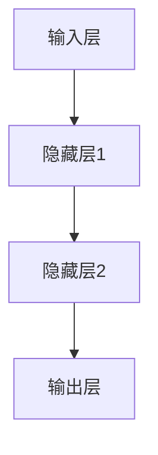

                 

## 1. 背景介绍

在信息化时代的浪潮下，人工智能（AI）成为了科技领域的热点。作为AI的重要分支，神经网络（Neural Network）以其强大的数据处理能力、自我学习和自我适应的特性，为解决复杂的现实问题提供了新的方法。神经网络技术不仅在图像识别、自然语言处理等传统领域展现了强大的应用潜力，还在医疗诊断、自动驾驶、金融预测等新兴领域崭露头角。本文将深入探讨神经网络技术的核心原理、应用领域及其发展前景，为读者提供一个全面、深刻的认识。

## 2. 核心概念与联系

### 2.1 核心概念概述

神经网络，又称为人工神经网络，其灵感来源于人类大脑的结构和功能。人类大脑通过神经元之间的连接进行信息传递和处理，而神经网络则通过类似结构实现数据处理和决策。其基本组成单位是人工神经元，由加权求和、激活函数和输出值三部分组成，并通过层层连接构成网络。神经网络的输入和输出之间，存在着一种“黑盒”映射关系，通过训练可以映射任意非线性函数。

神经网络的主要类型包括前馈神经网络、卷积神经网络（CNN）、循环神经网络（RNN）等，其中每一种网络结构针对特定的应用场景设计，如前馈网络适用于一般的数据处理，CNN用于图像处理，RNN适用于序列数据。

### 2.2 核心概念原理和架构的 Mermaid 流程图(Mermaid 流程节点中不要有括号、逗号等特殊字符)



该图展示了最简单的神经网络结构，包括输入层、两个隐藏层和一个输出层。其中，每一层包含多个神经元，层与层之间通过权重和偏置连接。

## 3. 核心算法原理 & 具体操作步骤

### 3.1 算法原理概述

神经网络的训练主要通过反向传播算法（Backpropagation）实现。其基本思想是通过误差逆传播，计算损失函数对模型参数的梯度，并利用梯度下降等优化算法更新模型参数。具体步骤如下：

1. 初始化模型参数。
2. 将数据集随机分为训练集、验证集和测试集。
3. 前向传播，计算模型输出。
4. 计算损失函数。
5. 反向传播，计算梯度。
6. 更新模型参数。
7. 在验证集上评估模型性能。
8. 在测试集上测试模型性能。

### 3.2 算法步骤详解

1. **初始化模型参数**：设置模型的权重和偏置，通常采用随机初始化。
2. **数据集划分**：将数据集划分为训练集、验证集和测试集，其中训练集用于模型训练，验证集用于模型评估和调参，测试集用于最终的性能评估。
3. **前向传播**：将输入数据输入模型，逐层计算输出。
4. **计算损失函数**：计算模型输出与真实标签之间的差异，常用损失函数包括均方误差、交叉熵等。
5. **反向传播**：利用误差逆传播算法，计算损失函数对模型参数的梯度。
6. **更新模型参数**：利用梯度下降等优化算法，更新模型参数。
7. **模型评估**：在验证集上评估模型性能，防止过拟合，并调整模型超参数。
8. **最终测试**：在测试集上测试模型性能，评估模型泛化能力。

### 3.3 算法优缺点

**优点**：

- **适应性强**：神经网络能够处理非线性问题，适应各种数据分布。
- **可解释性差**：神经网络具有“黑盒”特性，难以解释其内部决策过程。
- **数据依赖性强**：训练效果很大程度上依赖于数据的质量和量。
- **参数众多**：网络参数众多，容易发生过拟合。
- **计算量大**：训练和推理时计算量大，对硬件要求较高。

**缺点**：

- **训练时间长**：神经网络训练时间较长，需要大量计算资源。
- **参数调参困难**：神经网络模型参数众多，需要大量实验来调整超参数。
- **需要大量数据**：神经网络需要大量数据进行训练，数据获取成本高。

### 3.4 算法应用领域

神经网络的应用领域非常广泛，涵盖了从计算机视觉到自然语言处理等多个领域。

- **计算机视觉**：图像识别、目标检测、人脸识别等。
- **自然语言处理**：语言模型、机器翻译、文本生成等。
- **语音识别**：语音识别、语音合成等。
- **游戏智能**：强化学习、策略游戏等。
- **推荐系统**：个性化推荐、广告推荐等。
- **金融预测**：股票预测、风险管理等。

## 4. 数学模型和公式 & 详细讲解 & 举例说明

### 4.1 数学模型构建

以最简单的前馈神经网络为例，假设其包含输入层、隐藏层和输出层，其数学模型如下：

- **输入层**：$x_1,x_2,...,x_n$
- **隐藏层**：$h_1=h_1(x_1,w_{11},w_{12},b_1)$
- **输出层**：$y=h_n(h_{n-1},w_{n-1},w_{n-1},b_n)$

其中，$w_{ij}$表示连接第$i$个输入到第$j$个隐藏单元的权重，$b_i$表示偏置。

### 4.2 公式推导过程

假设损失函数为均方误差损失（Mean Squared Error, MSE），则前向传播和反向传播的公式如下：

- **前向传播**：
  $$
  y=\sigma(\sum_{i=1}^{n}x_iw_{i1}+w_{i2}+b_1)
  $$
  $$
  y_n=\sigma(\sum_{i=1}^{n-1}h_iw_{in}+w_{in+1}+b_n)
  $$

- **反向传播**：
  $$
  \frac{\partial L}{\partial w_{ij}}=\frac{\partial L}{\partial y}\frac{\partial y}{\partial h_{i-1}}\frac{\partial h_{i-1}}{\partial x_j}
  $$

其中，$\sigma$表示激活函数，如sigmoid、ReLU等。

### 4.3 案例分析与讲解

以手写数字识别为例，使用MNIST数据集进行模型训练。具体步骤如下：

1. 导入MNIST数据集。
2. 定义神经网络模型。
3. 定义损失函数和优化器。
4. 训练模型。
5. 评估模型性能。

```python
import torch
import torch.nn as nn
import torch.optim as optim
from torchvision import datasets, transforms

# 1. 导入数据集
transform = transforms.Compose([
    transforms.ToTensor(),
    transforms.Normalize((0.1307,), (0.3081,))
])

trainset = datasets.MNIST('MNIST_data/', train=True, download=True, transform=transform)
trainloader = torch.utils.data.DataLoader(trainset, batch_size=64, shuffle=True)

testset = datasets.MNIST('MNIST_data/', train=False, transform=transform)
testloader = torch.utils.data.DataLoader(testset, batch_size=64, shuffle=True)

# 2. 定义模型
class Net(nn.Module):
    def __init__(self):
        super(Net, self).__init__()
        self.conv1 = nn.Conv2d(1, 32, 3, 1)
        self.conv2 = nn.Conv2d(32, 64, 3, 1)
        self.fc1 = nn.Linear(7*7*64, 120)
        self.fc2 = nn.Linear(120, 84)
        self.fc3 = nn.Linear(84, 10)
        self.relu = nn.ReLU()
        self.dropout = nn.Dropout(0.2)
        self.softmax = nn.Softmax(dim=1)
    
    def forward(self, x):
        x = self.relu(self.conv1(x))
        x = nn.MaxPool2d(2)(x)
        x = self.relu(self.conv2(x))
        x = nn.MaxPool2d(2)(x)
        x = x.view(-1, 7*7*64)
        x = self.relu(self.fc1(x))
        x = self.dropout(x)
        x = self.relu(self.fc2(x))
        x = self.dropout(x)
        x = self.fc3(x)
        x = self.softmax(x)
        return x

# 3. 定义损失函数和优化器
net = Net()
criterion = nn.CrossEntropyLoss()
optimizer = optim.SGD(net.parameters(), lr=0.001, momentum=0.9)

# 4. 训练模型
for epoch in range(10):
    running_loss = 0.0
    for i, data in enumerate(trainloader, 0):
        inputs, labels = data
        optimizer.zero_grad()
        outputs = net(inputs)
        loss = criterion(outputs, labels)
        loss.backward()
        optimizer.step()
        running_loss += loss.item()
    print('Epoch %d loss: %.3f' % (epoch + 1, running_loss / len(trainloader)))

# 5. 评估模型性能
correct = 0
total = 0
with torch.no_grad():
    for data in testloader:
        images, labels = data
        outputs = net(images)
        _, predicted = torch.max(outputs.data, 1)
        total += labels.size(0)
        correct += (predicted == labels).sum().item()

print('Accuracy of the network on the 10000 test images: %d %%' % (100 * correct / total))
```

## 5. 项目实践：代码实例和详细解释说明

### 5.1 开发环境搭建

要在Python中进行神经网络的开发，需要安装相应的库和工具。以下是安装步骤：

1. 安装Anaconda。
2. 创建Python虚拟环境。
3. 安装所需的库，如TensorFlow、PyTorch、Keras等。
4. 搭建训练环境，包括GPU、内存等硬件设备。

### 5.2 源代码详细实现

以下是一个使用PyTorch实现的简单神经网络模型的代码实现：

```python
import torch
import torch.nn as nn
import torch.optim as optim

class Net(nn.Module):
    def __init__(self):
        super(Net, self).__init__()
        self.fc1 = nn.Linear(784, 256)
        self.fc2 = nn.Linear(256, 128)
        self.fc3 = nn.Linear(128, 10)
        self.relu = nn.ReLU()
    
    def forward(self, x):
        x = self.relu(self.fc1(x))
        x = self.relu(self.fc2(x))
        x = self.fc3(x)
        return x

# 加载数据集
train_dataset = torchvision.datasets.MNIST(root='./data', train=True, transform=transforms.ToTensor(), download=True)
test_dataset = torchvision.datasets.MNIST(root='./data', train=False, transform=transforms.ToTensor(), download=True)

# 定义数据加载器
train_loader = torch.utils.data.DataLoader(train_dataset, batch_size=64, shuffle=True)
test_loader = torch.utils.data.DataLoader(test_dataset, batch_size=64, shuffle=False)

# 定义模型、损失函数和优化器
model = Net()
criterion = nn.CrossEntropyLoss()
optimizer = optim.SGD(model.parameters(), lr=0.01)

# 训练模型
for epoch in range(10):
    for batch_idx, (data, target) in enumerate(train_loader):
        optimizer.zero_grad()
        output = model(data.view(-1, 784))
        loss = criterion(output, target)
        loss.backward()
        optimizer.step()
```

### 5.3 代码解读与分析

该代码实现了一个简单的全连接神经网络，用于对手写数字进行分类。

- **模型定义**：定义了一个包含三个全连接层的神经网络，每个层之间使用ReLU激活函数。
- **数据加载**：使用PyTorch的数据加载器，加载MNIST数据集，并进行预处理。
- **训练过程**：通过SGD优化器对模型进行训练，每次迭代中计算损失并更新模型参数。

### 5.4 运行结果展示

在训练过程中，可以通过打印损失函数值来观察模型的训练效果。在测试集上评估模型时，可以通过计算准确率来评估模型的性能。

## 6. 实际应用场景

神经网络技术在实际应用中展现出了强大的能力。

### 6.1 医疗诊断

神经网络在医疗诊断中有着广泛的应用。通过训练神经网络模型，可以自动识别医学影像中的异常区域，辅助医生进行诊断。例如，卷积神经网络（CNN）在乳腺X光片中的癌细胞检测中表现优异。

### 6.2 自动驾驶

神经网络在自动驾驶中也被广泛应用。通过训练神经网络模型，可以识别道路上的车辆、行人、障碍物等信息，并做出相应的决策。例如，神经网络可以用于图像识别和目标检测，实时感知环境变化，提高驾驶安全性。

### 6.3 金融预测

神经网络在金融预测中也展现出强大的能力。通过训练神经网络模型，可以对股票、债券等金融产品进行预测，辅助投资者做出决策。例如，LSTM神经网络在时间序列预测中表现优异，可以用于股票价格预测、风险管理等。

### 6.4 未来应用展望

神经网络技术的未来发展前景广阔。以下是几个可能的发展方向：

1. **模型压缩与优化**：神经网络模型庞大，计算量大，未来需要进一步压缩和优化模型，提高推理效率。
2. **自适应学习**：神经网络模型需要能够适应不同的数据分布和环境，自适应学习将成为重要研究方向。
3. **跨模态学习**：将神经网络应用于多模态数据，如视觉、语音、文本等，可以进一步提升数据处理能力。
4. **边缘计算**：将神经网络模型部署在边缘计算设备上，实时处理数据，降低延迟和带宽需求。
5. **联邦学习**：通过分布式计算，将神经网络模型部署在多个设备上，共同进行训练和推理，提高数据利用效率。

## 7. 工具和资源推荐

### 7.1 学习资源推荐

- **在线课程**：
  - Coursera上的“Deep Learning Specialization”系列课程
  - Udacity的“Deep Learning Nanodegree”
- **书籍**：
  - 《深度学习》(Deep Learning) - Ian Goodfellow、Yoshua Bengio和Aaron Courville
  - 《Python深度学习》(Python Deep Learning) - François Chollet
- **博客与社区**：
  - Keras官网博客
  - PyTorch官方文档
  - GitHub上的TensorFlow与PyTorch社区

### 7.2 开发工具推荐

- **IDE**：
  - PyCharm
  - Visual Studio Code
- **库**：
  - TensorFlow
  - PyTorch
  - Keras
- **框架**：
  - TensorFlow
  - PyTorch
  - Keras

### 7.3 相关论文推荐

- **经典论文**：
  - A Few Useful Things to Know About Deep Learning
  - Deep Residual Learning for Image Recognition
  - ImageNet Classification with Deep Convolutional Neural Networks
- **近期论文**：
  - Transformer is All you Need
  - Self-Attention Generative Adversarial Networks
  - Image-to-Image Translation with Conditional Adversarial Networks

## 8. 总结：未来发展趋势与挑战

### 8.1 研究成果总结

神经网络技术自问世以来，已经取得了巨大的成功。其核心在于通过模拟人类大脑的神经元网络结构，实现对复杂数据的处理和决策。神经网络不仅在图像识别、自然语言处理等传统领域展现了强大的能力，还在医疗诊断、自动驾驶、金融预测等新兴领域发挥了重要作用。

### 8.2 未来发展趋势

1. **模型压缩与优化**：未来需要进一步压缩和优化神经网络模型，提高推理效率。
2. **自适应学习**：神经网络需要能够适应不同的数据分布和环境，自适应学习将成为重要研究方向。
3. **跨模态学习**：将神经网络应用于多模态数据，如视觉、语音、文本等，可以进一步提升数据处理能力。
4. **边缘计算**：将神经网络模型部署在边缘计算设备上，实时处理数据，降低延迟和带宽需求。
5. **联邦学习**：通过分布式计算，将神经网络模型部署在多个设备上，共同进行训练和推理，提高数据利用效率。

### 8.3 面临的挑战

1. **计算资源需求高**：神经网络训练和推理时计算量大，对硬件要求较高。
2. **模型可解释性差**：神经网络具有“黑盒”特性，难以解释其内部决策过程。
3. **数据依赖性强**：神经网络需要大量数据进行训练，数据获取成本高。
4. **模型泛化能力**：神经网络需要具备良好的泛化能力，避免过拟合。
5. **参数调参困难**：神经网络模型参数众多，需要大量实验来调整超参数。

### 8.4 研究展望

未来，神经网络技术将继续在各个领域发挥重要作用，其研究方向包括：

1. **模型压缩与优化**：进一步压缩和优化神经网络模型，提高推理效率。
2. **自适应学习**：神经网络需要能够适应不同的数据分布和环境，自适应学习将成为重要研究方向。
3. **跨模态学习**：将神经网络应用于多模态数据，如视觉、语音、文本等，可以进一步提升数据处理能力。
4. **边缘计算**：将神经网络模型部署在边缘计算设备上，实时处理数据，降低延迟和带宽需求。
5. **联邦学习**：通过分布式计算，将神经网络模型部署在多个设备上，共同进行训练和推理，提高数据利用效率。

## 9. 附录：常见问题与解答

### Q1: 神经网络与传统机器学习有什么区别？

**A1**: 神经网络与传统机器学习的最大区别在于其模型结构和训练方式。传统机器学习通常使用特征提取和模型拟合的方式，通过手工设计特征来描述输入数据。而神经网络则使用神经元之间的连接和激活函数，通过数据自动提取特征。此外，神经网络的训练方式为反向传播，能够适应非线性问题。

### Q2: 神经网络中的激活函数有哪些？

**A2**: 常用的激活函数包括sigmoid、ReLU、tanh等。其中，ReLU由于其简单高效，应用最为广泛。

### Q3: 神经网络中的损失函数有哪些？

**A3**: 常用的损失函数包括均方误差（MSE）、交叉熵（Cross-Entropy）、对数损失（Log Loss）等。

### Q4: 神经网络中的正则化技术有哪些？

**A4**: 常用的正则化技术包括L1正则、L2正则、Dropout等。其中，Dropout通过随机失活神经元，避免过拟合。

### Q5: 神经网络中的超参数有哪些？

**A5**: 常用的超参数包括学习率（learning rate）、批量大小（batch size）、迭代次数（epoch）等。

**作者**：禅与计算机程序设计艺术 / Zen and the Art of Computer Programming

