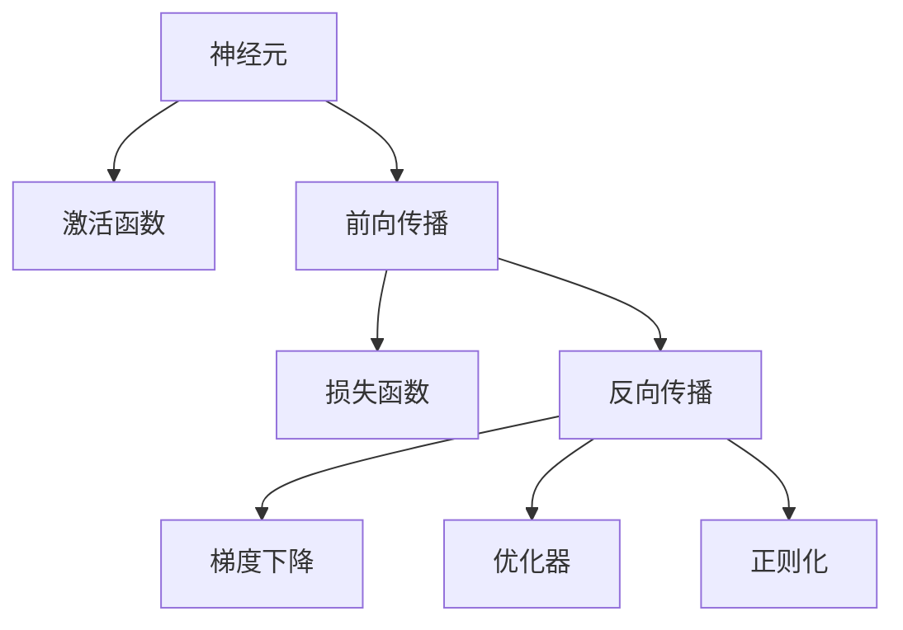

                 

# 神经网络：人类智慧的解放

> 关键词：神经网络,深度学习,人工智能,智慧解放,计算模型,数据驱动,模型训练,反向传播

## 1. 背景介绍

### 1.1 问题由来

随着计算技术的飞速发展，人类对于智能化系统的需求日益增长。从自动驾驶汽车到智能家居，从智慧医疗到金融风控，无处不在的智能系统正在深刻改变我们的生产生活方式。然而，传统的符号式计算模型已经难以应对复杂的现实问题，而基于数据的计算模型则展现了更强的适应性和泛化能力。

### 1.2 问题核心关键点

神经网络作为基于数据的计算模型，通过大量训练数据的学习，实现了对复杂函数关系的学习与表达。其核心思想是通过一系列神经元之间的相互连接，模拟大脑的工作原理，在输入与输出之间建立起非线性的映射关系。

1. **深度学习模型**：包括多层感知机(MLP)、卷积神经网络(CNN)、循环神经网络(RNN)、长短期记忆网络(LSTM)、变分自编码器(VAE)等，通过不同层次的抽象特征提取，实现对不同类型数据的处理和分析。

2. **反向传播算法**：作为神经网络训练的核心，反向传播通过链式法则反向计算梯度，更新模型参数，以最小化损失函数，优化模型性能。

3. **激活函数**：如ReLU、Sigmoid、Tanh等，在神经网络中用于引入非线性特性，增强模型的表达能力。

4. **优化器**：如梯度下降(包括批量梯度下降、随机梯度下降、Adam等)，用于在训练过程中更新模型参数，最小化损失函数。

5. **正则化技术**：如L1正则、L2正则、Dropout等，用于防止过拟合，提高模型泛化能力。

6. **模型融合与集成**：如Bagging、Boosting、Stacking等，通过结合多个模型的预测结果，提升整体性能。

7. **迁移学习与迁移网络**：通过在预训练模型基础上进行微调，实现知识迁移和适应，提高模型在新任务上的性能。

8. **对抗学习**：通过引入对抗样本，提升模型鲁棒性，防止模型对恶意攻击的脆弱性。

9. **自适应学习与在线学习**：在模型训练过程中引入元学习，实现模型在数据流中的动态适应和更新。

### 1.3 问题研究意义

研究神经网络，对构建智能化系统具有重要意义：

1. **提升模型性能**：神经网络通过多层抽象特征提取，实现了对复杂数据的高效处理和分析，提升了模型在不同任务上的性能。
2. **扩展应用范围**：神经网络技术广泛应用于图像处理、语音识别、自然语言处理、推荐系统等领域，为各行各业带来了智能化升级。
3. **推动学科发展**：神经网络研究促进了深度学习、认知科学、计算机视觉等学科的交叉融合，推动了人工智能领域的发展。
4. **改善社会效益**：智能系统的广泛应用，提高了生产效率，改善了医疗、教育、交通等领域的服务质量，增强了社会福祉。
5. **赋能产业升级**：神经网络技术推动了智慧制造、智能物流、金融科技等产业的转型升级，创造了新的经济增长点。

## 2. 核心概念与联系

### 2.1 核心概念概述

为更好地理解神经网络的工作原理和优化方法，本节将介绍几个关键概念：

- **神经元**：神经网络的基本组成单元，接收输入，通过激活函数计算输出，传递给下一层神经元。
- **激活函数**：如ReLU、Sigmoid、Tanh等，在神经网络中用于引入非线性特性，增强模型的表达能力。
- **前向传播**：将输入数据从输入层向输出层传递，通过一系列的线性变换和非线性变换，最终输出预测结果的过程。
- **损失函数**：用于衡量模型输出与真实标签之间的差异，常用的损失函数包括均方误差、交叉熵等。
- **反向传播**：通过链式法则反向计算梯度，更新模型参数，以最小化损失函数，优化模型性能。
- **梯度下降**：通过反向传播计算梯度，更新模型参数，以最小化损失函数。
- **正则化技术**：如L1正则、L2正则、Dropout等，用于防止过拟合，提高模型泛化能力。
- **优化器**：如梯度下降(包括批量梯度下降、随机梯度下降、Adam等)，用于在训练过程中更新模型参数，最小化损失函数。

这些概念之间的逻辑关系可以通过以下Mermaid流程图来展示：



这个流程图展示了几类核心概念及其之间的联系：

1. 神经元通过激活函数进行非线性计算。
2. 前向传播将输入数据传递到输出层，通过一系列的线性变换和非线性变换，最终输出预测结果。
3. 损失函数用于衡量模型输出与真实标签之间的差异。
4. 反向传播通过链式法则反向计算梯度，更新模型参数，以最小化损失函数。
5. 梯度下降通过反向传播计算梯度，更新模型参数。
6. 优化器用于在训练过程中更新模型参数，最小化损失函数。
7. 正则化技术用于防止过拟合，提高模型泛化能力。

这些概念共同构成了神经网络的学习与优化框架，使其能够高效处理复杂数据，实现对现实问题的建模与预测。

## 3. 核心算法原理 & 具体操作步骤

### 3.1 算法原理概述

神经网络的训练过程通常分为两个阶段：前向传播和反向传播。前向传播将输入数据传递到输出层，计算预测结果；反向传播则根据预测结果与真实标签之间的差异，计算梯度，更新模型参数。

假设神经网络包含 $n$ 层，第 $l$ 层的输出 $h_l$ 为输入 $x$ 通过线性变换和激活函数的计算结果：

$$
h_l = f(\sum_{i=1}^{m_{l-1}} W_{l-1,i} h_{l-1,i} + b_l)
$$

其中 $W_{l-1,i}$ 为第 $l-1$ 层到第 $l$ 层的权重矩阵，$b_l$ 为偏置项，$f$ 为激活函数。

假设模型的输出为 $y$，则损失函数 $L$ 通常定义为：

$$
L = \frac{1}{N} \sum_{i=1}^{N} \ell(y_i, \hat{y}_i)
$$

其中 $\ell$ 为损失函数，$y_i$ 为真实标签，$\hat{y}_i$ 为模型预测的标签。

通过反向传播，计算梯度 $\nabla L$，并根据梯度下降算法更新模型参数 $\theta$：

$$
\theta \leftarrow \theta - \eta \nabla L(\theta)
$$

其中 $\eta$ 为学习率，用于控制梯度下降的步长。

### 3.2 算法步骤详解

基于神经网络的训练流程主要包括以下几个关键步骤：

1. **数据准备**：收集并预处理训练数据，划分为训练集、验证集和测试集。
2. **模型定义**：定义神经网络模型，包括输入层、隐藏层、输出层的结构，以及各层的激活函数、权重矩阵和偏置项。
3. **前向传播**：将训练集数据输入模型，通过前向传播计算预测结果和损失函数。
4. **反向传播**：根据预测结果与真实标签之间的差异，计算梯度，并使用反向传播算法更新模型参数。
5. **优化器更新**：根据梯度信息，使用优化器更新模型参数，以最小化损失函数。
6. **模型评估**：在验证集和测试集上评估模型性能，调整超参数和模型结构，以优化模型效果。

### 3.3 算法优缺点

神经网络作为深度学习模型的代表，具有以下优点：

1. **强大的表达能力**：通过多层抽象特征提取，实现了对复杂数据的高效处理和分析，适用于各种类型的任务。
2. **自动特征提取**：无需手工设计特征，通过大量数据学习，自动提取数据中的高层次特征，减少人工干预。
3. **广泛应用**：广泛应用于图像处理、语音识别、自然语言处理、推荐系统等领域，推动了各行各业的智能化升级。
4. **高性能**：通过优化器更新模型参数，最小化损失函数，能够快速收敛，得到高性能的模型。

同时，神经网络也存在一些局限性：

1. **计算资源消耗大**：神经网络模型参数量庞大，需要高性能的计算资源进行训练和推理，对硬件要求较高。
2. **黑盒特性**：神经网络模型通常难以解释其内部的决策过程，缺乏可解释性。
3. **过拟合风险**：由于模型复杂度高，容易出现过拟合现象，需要通过正则化等技术进行缓解。
4. **数据依赖性强**：神经网络模型需要大量标注数据进行训练，数据获取成本高。
5. **模型设计复杂**：神经网络模型结构复杂，设计难度大，需要丰富的领域知识和经验。

### 3.4 算法应用领域

神经网络技术已经广泛应用于各种领域，具体包括：

- **计算机视觉**：如图像分类、目标检测、语义分割、图像生成等，通过卷积神经网络(CNN)实现。
- **自然语言处理**：如文本分类、机器翻译、情感分析、问答系统等，通过循环神经网络(RNN)和长短期记忆网络(LSTM)实现。
- **语音识别**：如自动语音识别、语音合成等，通过卷积神经网络和循环神经网络实现。
- **推荐系统**：如个性化推荐、商品匹配等，通过深度神经网络实现。
- **金融风控**：如信用评估、欺诈检测、市场预测等，通过神经网络实现。
- **医疗健康**：如疾病诊断、医疗影像分析等，通过深度神经网络实现。
- **智能制造**：如工业检测、设备预测性维护等，通过神经网络实现。
- **智慧城市**：如交通流量预测、城市管理等，通过深度学习实现。

## 4. 数学模型和公式 & 详细讲解 & 举例说明

### 4.1 数学模型构建

神经网络的数学模型通常由输入层、隐藏层、输出层组成，假设输入数据为 $x \in \mathbb{R}^d$，隐藏层参数为 $\theta_h$，输出层参数为 $\theta_o$，则神经网络的输出为：

$$
y = \sigma(\sum_{i=1}^{d_h} W_{i, h} h_i + b_h + \sum_{j=1}^{d_o} W_{h, j} h_j + b_o)
$$

其中 $\sigma$ 为激活函数，$d_h$ 和 $d_o$ 分别为隐藏层和输出层的神经元数，$W_{i, h}$ 和 $W_{h, j}$ 分别为输入层到隐藏层和隐藏层到输出层的权重矩阵，$b_h$ 和 $b_o$ 分别为隐藏层和输出层的偏置项。

### 4.2 公式推导过程

假设损失函数为均方误差损失，即：

$$
L = \frac{1}{N} \sum_{i=1}^{N} (y_i - \hat{y}_i)^2
$$

其中 $y_i$ 为真实标签，$\hat{y}_i$ 为模型预测的标签。

根据均方误差损失的定义，可以求得梯度为：

$$
\frac{\partial L}{\partial \theta} = \frac{2}{N} \sum_{i=1}^{N} (y_i - \hat{y}_i) \frac{\partial \hat{y}_i}{\partial \theta}
$$

其中 $\frac{\partial \hat{y}_i}{\partial \theta}$ 为输出层的梯度，通过链式法则可以求得：

$$
\frac{\partial \hat{y}_i}{\partial \theta} = \frac{\partial \hat{y}_i}{\partial z_{o_i}} \frac{\partial z_{o_i}}{\partial z_{h_i}} \frac{\partial z_{h_i}}{\partial \theta}
$$

其中 $z_{o_i}$ 为输出层的线性变换结果，$z_{h_i}$ 为隐藏层的线性变换结果，可以通过反向传播计算得到。

### 4.3 案例分析与讲解

以手写数字识别为例，分析神经网络的训练过程。假设我们有一个包含 28x28 像素的灰度图像，输入数据 $x \in [0, 1]^{784}$，标签数据 $y \in [0, 1]^{10}$，神经网络结构如下：

- 输入层：784个神经元，每个神经元对应一个像素。
- 隐藏层：512个神经元，每个神经元对应一个特征。
- 输出层：10个神经元，每个神经元对应一个数字类别。

假设使用ReLU作为激活函数，均方误差损失函数，训练数据集包含 60,000 个样本。

神经网络的训练流程如下：

1. **数据准备**：将数据集划分为训练集和验证集，每个样本进行归一化处理，转化为神经网络可以处理的形式。
2. **模型定义**：定义神经网络模型，包括输入层、隐藏层、输出层的结构，以及各层的激活函数、权重矩阵和偏置项。
3. **前向传播**：将训练集数据输入模型，通过前向传播计算预测结果和损失函数。
4. **反向传播**：根据预测结果与真实标签之间的差异，计算梯度，并使用反向传播算法更新模型参数。
5. **优化器更新**：根据梯度信息，使用随机梯度下降(Adam)更新模型参数，以最小化损失函数。
6. **模型评估**：在验证集上评估模型性能，调整超参数和模型结构，以优化模型效果。

## 5. 项目实践：代码实例和详细解释说明

### 5.1 开发环境搭建

在进行神经网络训练前，我们需要准备好开发环境。以下是使用Python进行TensorFlow开发的环境配置流程：

1. 安装Anaconda：从官网下载并安装Anaconda，用于创建独立的Python环境。

2. 创建并激活虚拟环境：
```bash
conda create -n tf-env python=3.8 
conda activate tf-env
```

3. 安装TensorFlow：根据CUDA版本，从官网获取对应的安装命令。例如：
```bash
conda install tensorflow -c pytorch -c conda-forge
```

4. 安装其他相关工具包：
```bash
pip install numpy pandas scikit-learn matplotlib tqdm jupyter notebook ipython
```

完成上述步骤后，即可在`tf-env`环境中开始神经网络训练。

### 5.2 源代码详细实现

这里我们以手写数字识别为例，给出使用TensorFlow实现神经网络的代码实现。

首先，定义神经网络模型：

```python
import tensorflow as tf

class NeuralNetwork(tf.keras.Model):
    def __init__(self):
        super(NeuralNetwork, self).__init__()
        self.fc1 = tf.keras.layers.Dense(512, activation='relu')
        self.fc2 = tf.keras.layers.Dense(10, activation='softmax')
        
    def call(self, x):
        x = self.fc1(x)
        x = self.fc2(x)
        return x
```

然后，定义训练函数：

```python
from tensorflow.keras.datasets import mnist
from tensorflow.keras.utils import to_categorical

# 加载MNIST数据集
(x_train, y_train), (x_test, y_test) = mnist.load_data()

# 数据预处理
x_train = x_train.reshape((-1, 28 * 28)).astype('float32') / 255.0
x_test = x_test.reshape((-1, 28 * 28)).astype('float32') / 255.0
y_train = to_categorical(y_train, 10)
y_test = to_categorical(y_test, 10)

# 定义模型
model = NeuralNetwork()

# 定义损失函数
loss_fn = tf.keras.losses.CategoricalCrossentropy()

# 定义优化器
optimizer = tf.keras.optimizers.Adam(learning_rate=0.001)

# 定义训练函数
def train(model, train_dataset, epochs=10, batch_size=32):
    for epoch in range(epochs):
        for batch_id, (x_batch, y_batch) in enumerate(train_dataset):
            with tf.GradientTape() as tape:
                y_pred = model(x_batch)
                loss = loss_fn(y_pred, y_batch)
            gradients = tape.gradient(loss, model.trainable_variables)
            optimizer.apply_gradients(zip(gradients, model.trainable_variables))
```

最后，启动训练流程并在测试集上评估：

```python
# 定义训练集和测试集
train_dataset = tf.data.Dataset.from_tensor_slices((x_train, y_train)).batch(batch_size)
test_dataset = tf.data.Dataset.from_tensor_slices((x_test, y_test)).batch(batch_size)

# 训练模型
train(model, train_dataset)

# 评估模型
test_loss = loss_fn(model(x_test), y_test)
print('Test Loss:', test_loss)
```

以上就是使用TensorFlow实现神经网络训练的完整代码实现。可以看到，TensorFlow提供了强大的高层API，使得神经网络的定义和训练变得简洁高效。

### 5.3 代码解读与分析

让我们再详细解读一下关键代码的实现细节：

**NeuralNetwork类**：
- `__init__`方法：初始化模型，定义输入层、隐藏层和输出层的结构。
- `call`方法：实现神经网络的前向传播过程。

**train函数**：
- `mnist.load_data`方法：加载MNIST数据集。
- `to_categorical`方法：将标签数据转化为one-hot编码。
- `CategoricalCrossentropy`方法：定义损失函数，用于计算交叉熵损失。
- `Adam`方法：定义优化器，用于更新模型参数。
- `GradientTape`方法：用于计算梯度。
- `apply_gradients`方法：应用梯度，更新模型参数。

**训练流程**：
- `for`循环：遍历训练集。
- `with`语句：使用`GradientTape`记录梯度。
- `y_pred`变量：计算神经网络的预测结果。
- `loss`变量：计算损失函数。
- `gradients`变量：计算梯度。
- `optimizer.apply_gradients`：应用梯度，更新模型参数。

可以看到，TensorFlow提供了丰富的API和工具，大大简化了神经网络训练的流程和代码实现。开发者可以将更多精力放在数据处理、模型设计等高层逻辑上，而不必过多关注底层的实现细节。

当然，工业级的系统实现还需考虑更多因素，如模型的保存和部署、超参数的自动搜索、更灵活的任务适配层等。但核心的训练流程基本与此类似。

## 6. 实际应用场景

### 6.1 智能交通系统

基于神经网络技术的智能交通系统，可以实时监测交通流量，优化交通信号灯控制，提高道路通行效率，降低事故率。智能交通系统通过摄像头采集实时交通数据，使用神经网络进行交通流量分析和预测，自动调节信号灯，从而实现交通流量平衡和事故预防。

在技术实现上，可以收集交通监控数据，提取车辆位置、速度、方向等特征，使用神经网络进行训练，实现交通流量预测和优化。微调后的神经网络可以实时处理摄像头数据，输出交通流量预测结果，智能调节信号灯。如此构建的智能交通系统，能够大幅提升交通管理水平，降低交通拥堵和事故风险。

### 6.2 医疗影像分析

在医疗影像分析中，神经网络技术可以用于图像分割、病变识别、影像诊断等任务。通过训练神经网络模型，可以从医学影像中自动识别出病变区域，提高诊断效率和准确性。

在具体实现中，可以收集大量的医学影像数据，进行标注和预处理。然后训练神经网络模型，使用卷积神经网络(CNN)或全卷积神经网络(FCN)进行图像分割和病变识别。微调后的模型可以在新的医学影像数据上快速生成分割结果和诊断报告。

### 6.3 工业质量检测

神经网络技术在工业质量检测中也有广泛应用。通过对工业产品图像的训练，神经网络可以自动识别缺陷和异常，提高产品质量检测的效率和准确性。

在具体实现中，可以收集大量的工业产品图像数据，标注出其中的缺陷和异常区域，使用神经网络进行训练。微调后的模型可以实时处理生产线上产品的图像数据，自动检测出缺陷和异常，并输出检测结果。

### 6.4 未来应用展望

随着神经网络技术的不断发展，未来的应用场景将更加广阔。

在智慧城市中，神经网络可以用于城市管理和智能安防。通过训练神经网络模型，可以从城市监控数据中实时识别出异常事件，自动报警和处理。

在智能制造中，神经网络可以用于设备预测性维护和故障诊断。通过训练神经网络模型，可以从设备运行数据中预测出故障和维护需求，提高设备运行效率。

在金融风控中，神经网络可以用于信用评估和欺诈检测。通过训练神经网络模型，可以从用户行为数据中识别出潜在风险，提高风险控制能力。

在自动驾驶中，神经网络可以用于图像识别和行为预测。通过训练神经网络模型，可以从汽车摄像头数据中实时识别出路标、行人等对象，自动进行驾驶决策。

未来，神经网络技术将在更多领域得到应用，为各行各业带来智能化升级，推动社会进步。

## 7. 工具和资源推荐

### 7.1 学习资源推荐

为了帮助开发者系统掌握神经网络技术，这里推荐一些优质的学习资源：

1. 《深度学习》课程：斯坦福大学开设的深度学习课程，涵盖了神经网络、卷积神经网络、循环神经网络、自编码器等核心内容，适合初学者入门。

2. 《神经网络与深度学习》书籍：Michael Nielsen所写，深入浅出地介绍了神经网络的原理和应用，适合自学和进阶。

3. 《TensorFlow实战》书籍：TensorFlow官方团队所写，详细介绍了TensorFlow的使用方法和实例，适合TensorFlow开发者学习和实践。

4. 《PyTorch基础教程》课程：PyTorch官方团队所写，涵盖了神经网络的基本概念和实现方法，适合初学者入门。

5. 《Deep Learning Specialization》课程：由Andrew Ng教授所讲授的深度学习课程，涵盖了深度学习的前沿技术和实际应用，适合深度学习从业者进阶学习。

通过对这些资源的学习实践，相信你一定能够快速掌握神经网络技术的精髓，并用于解决实际的AI问题。

### 7.2 开发工具推荐

高效的开发离不开优秀的工具支持。以下是几款用于神经网络训练和开发的常用工具：

1. TensorFlow：由Google主导开发的开源深度学习框架，生产部署方便，适合大规模工程应用。
2. PyTorch：基于Python的开源深度学习框架，灵活动态的计算图，适合快速迭代研究。
3. Keras：高层次的神经网络API，可以快速搭建和训练神经网络模型，适合初学者使用。
4. MXNet：由Apache开发的深度学习框架，支持多种编程语言，具有高效的分布式训练能力。
5. Caffe：由Berkeley Vision and Learning Center开发的深度学习框架，适合图像识别和计算机视觉任务。

合理利用这些工具，可以显著提升神经网络训练和开发的效率，加快创新迭代的步伐。

### 7.3 相关论文推荐

神经网络研究源于学界的持续研究。以下是几篇奠基性的相关论文，推荐阅读：

1. Deep Learning（深度学习）：Yoshua Bengio等人所写，系统介绍了深度学习的原理和应用，是深度学习领域的经典之作。

2. Convolutional Neural Networks for Image Recognition（卷积神经网络）：Geoffrey Hinton等人所写，介绍了卷积神经网络在图像识别中的应用，开创了计算机视觉的新纪元。

3. Long Short-Term Memory（循环神经网络）：Sepp Hochreiter等人所写，介绍了循环神经网络在序列数据处理中的应用，推动了自然语言处理和语音识别的发展。

4. ImageNet Classification with Deep Convolutional Neural Networks（深度卷积神经网络）：Alex Krizhevsky等人所写，介绍了深度卷积神经网络在图像分类中的应用，推动了计算机视觉的进步。

5. Generative Adversarial Networks（生成对抗网络）：Ian Goodfellow等人所写，介绍了生成对抗网络在图像生成、自然语言生成等领域的应用，开创了生成式深度学习的新方向。

这些论文代表了大神经网络的发展脉络。通过学习这些前沿成果，可以帮助研究者把握学科前进方向，激发更多的创新灵感。

## 8. 总结：未来发展趋势与挑战

### 8.1 总结

本文对神经网络技术进行了全面系统的介绍。首先阐述了神经网络的基本原理和应用场景，明确了神经网络在解决复杂现实问题中的重要作用。其次，从原理到实践，详细讲解了神经网络的数学模型和训练流程，给出了神经网络训练的代码实现。同时，本文还广泛探讨了神经网络在智能交通、医疗影像、工业质量检测等领域的实际应用，展示了神经网络技术的广泛前景。最后，本文精选了神经网络技术的各类学习资源，力求为读者提供全方位的技术指引。

通过本文的系统梳理，可以看到，神经网络技术正在成为智能系统构建的重要手段，极大地提升了人工智能技术的实用性和泛化能力。未来，伴随神经网络技术的不断发展，将推动更多领域的智能化升级，为社会带来深远的变革。

### 8.2 未来发展趋势

展望未来，神经网络技术将呈现以下几个发展趋势：

1. **深度学习技术突破**：深度学习模型的性能和效果将不断提升，应用范围将进一步拓展，从图像、语音、文本到更多类型的数据。

2. **自监督学习应用**：自监督学习技术将广泛应用，如自回归、掩码语言模型等，通过无标注数据进行预训练，提升模型的泛化能力。

3. **迁移学习技术成熟**：迁移学习技术将更加成熟，通过在预训练模型基础上进行微调，提升模型在特定任务上的性能。

4. **分布式训练优化**：分布式训练技术将不断优化，支持更大规模的数据和模型训练，提升神经网络模型的性能和效果。

5. **跨模态融合技术发展**：跨模态融合技术将进一步发展，实现视觉、语音、文本等多模态信息的整合，提升智能化系统的综合能力。

6. **联邦学习技术应用**：联邦学习技术将得到广泛应用，通过多方数据联合训练，提升模型性能，保护数据隐私。

7. **边缘计算应用推广**：边缘计算技术将广泛应用，通过在设备端进行数据处理和模型训练，提升系统的实时性和可靠性。

以上趋势凸显了神经网络技术的广阔前景。这些方向的探索发展，必将进一步提升神经网络系统的性能和应用范围，为人类认知智能的进化带来深远影响。

### 8.3 面临的挑战

尽管神经网络技术已经取得了瞩目成就，但在迈向更加智能化、普适化应用的过程中，它仍面临着诸多挑战：

1. **计算资源消耗大**：神经网络模型参数量庞大，需要高性能的计算资源进行训练和推理，对硬件要求较高。
2. **模型鲁棒性不足**：神经网络模型面对域外数据时，泛化性能往往大打折扣。
3. **模型过拟合风险**：由于模型复杂度高，容易出现过拟合现象，需要通过正则化等技术进行缓解。
4. **数据依赖性强**：神经网络模型需要大量标注数据进行训练，数据获取成本高。
5. **模型设计复杂**：神经网络模型结构复杂，设计难度大，需要丰富的领域知识和经验。
6. **可解释性不足**：神经网络模型通常难以解释其内部的决策过程，缺乏可解释性。
7. **数据隐私保护**：神经网络模型在处理大规模数据时，可能涉及用户隐私问题，如何保护数据隐私成为重要挑战。

### 8.4 研究展望

面对神经网络技术所面临的挑战，未来的研究需要在以下几个方面寻求新的突破：

1. **探索无监督和半监督学习技术**：摆脱对大规模标注数据的依赖，利用自监督学习、主动学习等无监督和半监督范式，最大限度利用非结构化数据，实现更加灵活高效的神经网络训练。

2. **研究参数高效和计算高效的训练方法**：开发更加参数高效的神经网络模型，如迁移网络、模型蒸馏等，在固定大部分预训练参数的同时，只更新极少量的任务相关参数。同时优化神经网络的计算图，减少前向传播和反向传播的资源消耗，实现更加轻量级、实时性的部署。

3. **引入因果推断和对比学习技术**：通过引入因果推断和对比学习思想，增强神经网络模型的稳定性，学习更加普适、鲁棒的语言表征，从而提升模型泛化性和抗干扰能力。

4. **结合跨模态数据进行建模**：将视觉、语音、文本等多种类型的数据进行整合，实现多模态信息的协同建模，提升神经网络的综合能力。

5. **引入更多先验知识**：将符号化的先验知识，如知识图谱、逻辑规则等，与神经网络模型进行巧妙融合，引导神经网络模型学习更准确、合理的语言模型。

6. **从因果分析和博弈论角度**：将因果分析方法引入神经网络模型，识别出模型决策的关键特征，增强输出解释的因果性和逻辑性。借助博弈论工具刻画人机交互过程，主动探索并规避模型的脆弱点，提高系统稳定性。

7. **纳入伦理道德约束**：在神经网络训练目标中引入伦理导向的评估指标，过滤和惩罚有害的输出倾向，确保输出符合人类价值观和伦理道德。

这些研究方向的探索，必将引领神经网络技术迈向更高的台阶，为构建安全、可靠、可解释、可控的智能系统铺平道路。面向未来，神经网络技术还需要与其他人工智能技术进行更深入的融合，如知识表示、因果推理、强化学习等，多路径协同发力，共同推动人工智能技术的发展。只有勇于创新、敢于突破，才能不断拓展神经网络的边界，让智能技术更好地造福人类社会。

## 9. 附录：常见问题与解答

**Q1：神经网络是否适用于所有NLP任务？**

A: 神经网络技术在NLP领域中得到了广泛应用，适用于大多数NLP任务，如文本分类、命名实体识别、机器翻译、情感分析等。但对于一些特定领域的任务，如医学、法律等，神经网络模型需要进一步在特定领域语料上预训练，才能更好地适应。

**Q2：神经网络模型在训练过程中如何防止过拟合？**

A: 防止神经网络模型过拟合的方法包括：
1. 数据增强：通过回译、近义替换等方式扩充训练集。
2. 正则化：使用L1正则、L2正则、Dropout等，防止模型过度适应训练集。
3. 对抗训练：引入对抗样本，提高模型鲁棒性。
4. 早停法：在验证集上监测模型性能，当性能不再提升时停止训练。
5. 学习率衰减：随着训练次数增加，逐步降低学习率，防止模型震荡。

这些方法需要根据具体任务和数据特点进行灵活组合，才能最大限度地防止过拟合。

**Q3：神经网络模型在部署过程中需要注意哪些问题？**

A: 神经网络模型在部署过程中需要注意以下问题：
1. 模型裁剪：去除不必要的层和参数，减小模型尺寸，加快推理速度。
2. 量化加速：将浮点模型转为定点模型，压缩存储空间，提高计算效率。
3. 服务化封装：将模型封装为标准化服务接口，便于集成调用。
4. 弹性伸缩：根据请求流量动态调整资源配置，平衡服务质量和成本。
5. 监控告警：实时采集系统指标，设置异常告警阈值，确保服务稳定性。
6. 安全防护：采用访问鉴权、数据脱敏等措施，保障数据和模型安全。

合理利用这些技术，可以提升神经网络模型的部署效率和可靠性。

**Q4：神经网络模型在实际应用中如何提高可解释性？**

A: 提高神经网络模型的可解释性可以采取以下方法：
1. 引入可解释性模块：使用LIME、SHAP等工具，生成模型特征重要性解释，提高可解释性。
2. 设计可解释性结构：使用可解释性结构，如线性层、可解释性激活函数等，增强模型的可解释性。
3. 结合领域知识：结合领域知识，对神经网络模型的输出进行解释，增强可解释性。
4. 使用解释性模型：使用可解释性模型，如决策树、规则模型等，提高模型的可解释性。

通过这些方法，可以提升神经网络模型的可解释性，增强模型的可信度和可靠性。

**Q5：神经网络模型在实际应用中如何避免灾难性遗忘？**

A: 避免神经网络模型灾难性遗忘的方法包括：
1. 参数初始化：使用预训练模型的参数进行初始化，保留先验知识。
2. 迁移学习：在预训练模型基础上进行微调，利用先验知识，减少灾难性遗忘。
3. 知识蒸馏：将预训练模型的知识蒸馏到微调模型中，增强模型的鲁棒性。
4. 持续学习：在新的数据上持续训练，保持模型性能，避免遗忘。

通过这些方法，可以有效地避免神经网络模型在微调过程中的灾难性遗忘，保持模型的长期性能。

