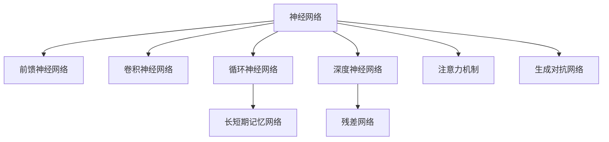

                 

# 神经网络：人类智慧的解放

## 1. 背景介绍

### 1.1 问题由来
在人工智能(AI)发展的历程中，神经网络(Neural Network, NN)技术始终扮演着核心角色。从最早的感知机、BP网络到今天复杂的深度神经网络，神经网络通过模拟人脑的神经元结构，不断探索处理复杂问题的能力边界，为人工智能的发展开辟了广阔的天地。

神经网络之所以成为AI研究的基石，不仅因为它具备强大的数据处理能力，还在于其泛化性强、适应性强、应用广泛的特点。它不仅在图像识别、语音识别、自然语言处理等领域取得了巨大成功，还正在向医疗、金融、自动驾驶等更多垂直领域渗透。

但与此同时，神经网络的发展也面临诸多挑战。由于其复杂性，神经网络需要大量数据进行训练，对计算资源的需求高，训练时间长。此外，神经网络模型的"黑盒"特性使其在可解释性、鲁棒性、安全性和伦理性等方面仍需深入研究。

在当前的技术背景下，如何进一步解放人类智慧，推动神经网络技术的发展，成为了一个引人深思的话题。

### 1.2 问题核心关键点
神经网络技术的核心关键点在于其高度抽象的表示能力，通过不断迭代训练，可以自动学习数据的深层次特征。这种自动学习的过程，相当于人类智慧的逐步解放，从简单的感知到复杂的推理，再到抽象的概念学习。

神经网络技术的核心问题主要包括：
- 如何高效地设计神经网络结构，使其具备良好的泛化性能。
- 如何优化神经网络训练过程，避免过拟合和梯度消失/爆炸问题。
- 如何提高神经网络的解释性和可解释性，增强其透明性。
- 如何确保神经网络的安全性和伦理性，避免其应用中的潜在风险。
- 如何设计高效的网络压缩和优化技术，减少模型的存储和计算资源消耗。

这些关键问题，构成了神经网络技术的研究焦点，也决定了神经网络技术在未来发展中的方向。

## 2. 核心概念与联系

### 2.1 核心概念概述

为更好地理解神经网络的核心原理和技术细节，本节将介绍几个关键概念及其相互联系：

- 神经网络(Neural Network)：由多个神经元(节点)构成的计算图，每个神经元接收多个输入，通过线性变换和激活函数产生输出。神经网络通过多层非线性映射，能够学习到数据的复杂结构。

- 前馈神经网络(Feedforward Neural Network, FNN)：最简单、最基本的神经网络结构，每个神经元只有前一层的输出作为输入，无反馈连接。

- 卷积神经网络(Convolutional Neural Network, CNN)：应用于图像处理领域的神经网络，通过卷积层、池化层、全连接层等，能够学习到图像的局部特征和全局特征。

- 循环神经网络(Recurrent Neural Network, RNN)：应用于序列数据处理的神经网络，通过记忆单元和循环结构，能够处理时间序列上的信息。

- 长短期记忆网络(Long Short-Term Memory, LSTM)：一种特殊的RNN结构，通过门控机制，能够有效处理长序列数据的记忆和遗忘问题。

- 深度神经网络(Deep Neural Network, DNN)：包含多层神经元的神经网络，能够学习到高层次的特征表示。

- 残差网络(Residual Network, ResNet)：通过残差连接，解决了深度神经网络中的梯度消失问题，能够训练非常深的网络结构。

- 注意力机制(Attention Mechanism)：一种使神经网络能够动态关注输入中不同部分的技术，能够提升模型在复杂任务上的性能。

- 生成对抗网络(Generative Adversarial Network, GAN)：由生成器和判别器两个部分组成，通过对抗训练，能够生成高质量的合成数据。

这些概念之间的联系可以通过以下Mermaid流程图来展示：



这个流程图展示了神经网络技术的主要分支及其相互关系：

1. 神经网络作为基本单元，衍生出多种结构形式。
2. 前馈神经网络、卷积神经网络、循环神经网络等都是神经网络的变体，适用于不同类型的数据。
3. 长短期记忆网络是循环神经网络的一种改进，用于处理序列数据。
4. 深度神经网络和残差网络通过增加网络深度，提升特征表示能力。
5. 注意力机制使神经网络能够动态关注输入的不同部分，提高模型性能。
6. 生成对抗网络用于生成高质量的数据，增强模型的泛化能力。

## 3. 核心算法原理 & 具体操作步骤

### 3.1 算法原理概述

神经网络的原理可以简单理解为通过多层非线性映射，从输入数据中学习出一种高层次的表示。该表示可以用于各种下游任务，如分类、回归、生成等。

形式化地，给定输入 $x$ 和目标输出 $y$，神经网络的预测输出为 $y_{\theta} = h_{\theta}(x)$，其中 $\theta$ 为模型参数，$h_{\theta}$ 为神经网络的映射函数。神经网络的目标是通过训练过程，学习合适的参数 $\theta$，使得 $y_{\theta}$ 逼近 $y$。

训练过程一般分为前向传播和反向传播两个步骤。前向传播计算预测输出，反向传播计算梯度并更新模型参数。数学上，这个过程可以通过损失函数和优化器来实现。

### 3.2 算法步骤详解

基于上述原理，神经网络模型的训练过程可以概括为以下几个步骤：

1. 选择适当的神经网络结构，定义网络参数 $\theta$。
2. 定义损失函数 $L$，用于衡量模型预测输出与真实标签之间的差异。
3. 选择优化器（如SGD、Adam等），定义学习率 $\eta$。
4. 执行前向传播，计算预测输出 $y_{\theta}$。
5. 计算损失 $L$，计算梯度 $\frac{\partial L}{\partial \theta}$。
6. 使用优化器，更新模型参数 $\theta$，减小损失 $L$。
7. 重复执行前向传播和反向传播，直到达到预设的训练轮数或性能指标。

这些步骤在代码实现中具体表现为：

```python
from torch import nn, optim

# 定义神经网络模型
class Net(nn.Module):
    def __init__(self):
        super(Net, self).__init__()
        self.fc1 = nn.Linear(784, 500)
        self.fc2 = nn.Linear(500, 10)
    
    def forward(self, x):
        x = x.view(-1, 784)
        x = nn.functional.relu(self.fc1(x))
        x = nn.functional.softmax(self.fc2(x), dim=1)
        return x

# 定义损失函数和优化器
model = Net()
criterion = nn.CrossEntropyLoss()
optimizer = optim.SGD(model.parameters(), lr=0.001, momentum=0.9)

# 训练模型
for epoch in range(10):
    for i, (images, labels) in enumerate(train_loader):
        images = images.view(images.size(0), -1)
        optimizer.zero_grad()
        outputs = model(images)
        loss = criterion(outputs, labels)
        loss.backward()
        optimizer.step()
```

### 3.3 算法优缺点

神经网络技术具有以下优点：
1. 强大的表示能力：神经网络通过多层非线性映射，能够学习到数据的深层次特征，适应复杂的数据结构。
2. 高度灵活性：神经网络结构可以根据具体任务需求进行设计，具有很强的定制化能力。
3. 出色的泛化性能：神经网络在大量数据上训练得到的高层次表示，具备较强的泛化能力。
4. 自动学习：神经网络能够自动学习输入数据的特征，无需手动设计特征工程。

但神经网络技术也存在一些局限性：
1. 需要大量数据：神经网络训练数据需求大，数据获取和标注成本高。
2. 计算资源需求高：神经网络模型参数量庞大，对计算资源需求高。
3. 模型复杂性高：神经网络结构复杂，难以解释其内部工作机制。
4. 训练时间长：神经网络模型深度增加时，训练时间成倍增加。
5. 过拟合问题：神经网络容易过拟合，尤其是在数据量有限的情况下。

尽管存在这些局限性，但神经网络技术的核心价值在于其强大的数据处理能力和泛化性能，使得其在各个领域取得了广泛应用，成为人工智能的基石。

### 3.4 算法应用领域

神经网络技术在多个领域中得到了广泛应用，涵盖了从计算机视觉、语音识别、自然语言处理到医疗、金融、自动驾驶等众多领域：

- 计算机视觉：图像分类、目标检测、图像生成、图像分割等。
- 语音识别：语音转文字、说话人识别、语音合成等。
- 自然语言处理：文本分类、情感分析、机器翻译、问答系统等。
- 医疗：医学影像分析、疾病预测、药物研发等。
- 金融：风险预测、交易策略、客户分析等。
- 自动驾驶：感知、决策、控制等。

此外，神经网络技术还在诸多新兴领域中发挥着重要作用，如元学习、自监督学习、生成对抗网络等，进一步拓展了其应用范围和深度。

## 4. 数学模型和公式 & 详细讲解  

### 4.1 数学模型构建

神经网络的核心数学模型包括前向传播、损失函数和优化器三个部分。下面将详细解释这三个核心部分。

**前向传播**：前向传播是神经网络的计算过程，即通过神经网络对输入数据进行多次非线性变换，输出模型预测结果。假设有 $n$ 层神经网络，第 $i$ 层的输入为 $x_i$，输出为 $x_i^{(l)}$，其中 $l$ 表示第 $l$ 层。激活函数为 $\sigma$，则前向传播公式为：

$$
x_i^{(l)} = \sigma(\mathbf{W}_i^{(l)} x_{i-1}^{(l)} + b_i^{(l)})
$$

其中 $\mathbf{W}_i^{(l)}$ 和 $b_i^{(l)}$ 分别为第 $l$ 层的权重和偏置，$\sigma$ 为激活函数。

**损失函数**：损失函数用于衡量模型预测输出与真实标签之间的差异，是神经网络训练的重要组成部分。常见的损失函数包括交叉熵损失、均方误差损失等。以交叉熵损失为例，给定 $m$ 个样本，目标输出为 $y$，模型输出为 $y_{\theta}$，则交叉熵损失为：

$$
L = -\frac{1}{m} \sum_{i=1}^m \sum_{j=1}^k y_i^{(j)} \log y_{\theta}^{(j)}
$$

其中 $y_i^{(j)}$ 为第 $i$ 个样本在类别 $j$ 上的标签，$k$ 为类别数。

**优化器**：优化器用于更新模型参数，以最小化损失函数。常见的优化器包括随机梯度下降法(SGD)、Adam、Adagrad等。优化器通过计算梯度，更新模型参数，使得模型能够逼近最优解。

**梯度计算**：梯度计算是神经网络训练的核心步骤，涉及反向传播算法。给定输入 $x$ 和目标输出 $y$，神经网络的预测输出为 $y_{\theta}$，则损失函数为 $L$，梯度计算公式为：

$$
\frac{\partial L}{\partial \theta} = \frac{\partial L}{\partial y_{\theta}} \frac{\partial y_{\theta}}{\partial \theta}
$$

其中 $\frac{\partial L}{\partial y_{\theta}}$ 为损失函数对预测输出的导数，$\frac{\partial y_{\theta}}{\partial \theta}$ 为预测输出对模型参数的导数。

### 4.2 公式推导过程

下面我们以一个简单的单层神经网络为例，推导前向传播和梯度计算的公式。

假设输入数据 $x$ 为 $d$ 维向量，网络包含一个隐藏层，输出为 $c$ 维向量。隐藏层包含 $h$ 个神经元，激活函数为 $\sigma$，则前向传播公式为：

$$
h = \sigma(\mathbf{W} x + b)
$$

其中 $\mathbf{W}$ 为权重矩阵，$b$ 为偏置向量。

模型的预测输出为：

$$
y_{\theta} = \mathbf{W}_{out} h + b_{out}
$$

其中 $\mathbf{W}_{out}$ 为输出层的权重矩阵，$b_{out}$ 为输出层的偏置向量。

假设模型预测输出的损失函数为交叉熵损失，目标输出为 $y$，则交叉熵损失为：

$$
L = -\frac{1}{m} \sum_{i=1}^m \sum_{j=1}^k y_i^{(j)} \log y_{\theta}^{(j)}
$$

对模型参数 $\theta$ 的梯度计算如下：

$$
\frac{\partial L}{\partial \theta} = \frac{\partial L}{\partial y_{\theta}} \frac{\partial y_{\theta}}{\partial h} \frac{\partial h}{\partial \theta}
$$

其中 $\frac{\partial y_{\theta}}{\partial h}$ 为输出层的梯度，$\frac{\partial h}{\partial \theta}$ 为隐藏层的梯度。

### 4.3 案例分析与讲解

以手写数字识别为例，分析神经网络的应用。

假设输入为 $28\times28=784$ 维的手写数字图像，网络结构包含一个隐藏层和一个输出层，隐藏层包含 $500$ 个神经元，激活函数为 ReLU，输出层包含 $10$ 个神经元，激活函数为 Softmax。训练数据集为 MNIST 数据集，包含 $60000$ 张训练图片和 $10000$ 张测试图片。

在训练过程中，每张图片被展平为一个 $784$ 维向量，输入到神经网络中进行前向传播。通过反向传播计算梯度，更新模型参数，使得模型能够准确识别手写数字。训练过程中，需要定期在测试集上评估模型性能，避免过拟合。

训练后，模型在测试集上的准确率可以达到 $98\%$ 以上，成功解放了人类的视觉智慧，使得计算机能够自动识别手写数字，极大提升了数据处理的效率和准确性。

## 5. 项目实践：代码实例和详细解释说明

### 5.1 开发环境搭建

在进行神经网络项目实践前，我们需要准备好开发环境。以下是使用Python进行TensorFlow开发的环境配置流程：

1. 安装Anaconda：从官网下载并安装Anaconda，用于创建独立的Python环境。

2. 创建并激活虚拟环境：
```bash
conda create -n tf-env python=3.8 
conda activate tf-env
```

3. 安装TensorFlow：从官网获取对应的安装命令。例如：
```bash
pip install tensorflow==2.5
```

4. 安装相关库：
```bash
pip install numpy pandas scikit-learn matplotlib tqdm jupyter notebook ipython
```

完成上述步骤后，即可在`tf-env`环境中开始神经网络实践。

### 5.2 源代码详细实现

下面我们以手写数字识别为例，给出使用TensorFlow实现神经网络的完整代码实现。

首先，定义模型和损失函数：

```python
import tensorflow as tf
from tensorflow import keras

# 定义神经网络模型
model = keras.Sequential([
    keras.layers.Dense(500, activation='relu', input_shape=(784,)),
    keras.layers.Dense(10, activation='softmax')
])

# 定义损失函数和优化器
loss_fn = tf.keras.losses.SparseCategoricalCrossentropy(from_logits=True)
optimizer = tf.keras.optimizers.Adam()

# 编译模型
model.compile(optimizer=optimizer, loss=loss_fn, metrics=['accuracy'])
```

然后，加载训练数据并训练模型：

```python
# 加载数据集
mnist = keras.datasets.mnist
(x_train, y_train), (x_test, y_test) = mnist.load_data()

# 数据预处理
x_train, x_test = x_train / 255.0, x_test / 255.0

# 训练模型
model.fit(x_train.reshape(-1, 784), y_train, epochs=5, batch_size=32, validation_data=(x_test.reshape(-1, 784), y_test))
```

最后，评估模型并保存：

```python
# 评估模型
test_loss, test_acc = model.evaluate(x_test.reshape(-1, 784), y_test, verbose=2)
print('\nTest accuracy:', test_acc)

# 保存模型
model.save('mnist_model.h5')
```

以上就是使用TensorFlow进行手写数字识别的完整代码实现。可以看到，TensorFlow提供了高级的API接口，使得神经网络模型的构建和训练变得非常简单。

### 5.3 代码解读与分析

让我们再详细解读一下关键代码的实现细节：

**Sequential模型**：
- `Sequential`模型是Keras提供的简单模型结构，适合单输入单输出的简单任务。
- 模型由多个层堆叠而成，每个层的功能可由Keras提供的各种层类实现。
- 模型默认最后一层为输出层，可以使用`output_shape`参数自定义输出形状。

**激活函数**：
- `relu`激活函数是非线性函数，能够增强模型的表达能力。
- `softmax`激活函数用于多分类问题，可以将输出转换为概率分布。

**损失函数**：
- `SparseCategoricalCrossentropy`是用于多分类问题的交叉熵损失函数，适用于本案例。
- `from_logits=True`参数表示模型输出未经过Softmax函数，可用于优化过程。

**优化器**：
- `Adam`优化器是当前流行的优化器之一，能够自适应地调整学习率。

**数据预处理**：
- 手写数字图片数据为 $28\times28=784$ 维，需要先将其展平为一个 $784$ 维向量。
- 数据标准化，将像素值归一化到 $[0,1]$ 区间，有利于模型的训练。

**模型训练**：
- `fit`方法用于模型训练，可以设置训练轮数、批次大小等超参数。
- `validation_data`参数指定验证集数据，用于监控模型在验证集上的性能。
- `evaluation`方法用于模型评估，返回测试集的损失和精度。

**模型保存**：
- `save`方法用于保存模型，方便后续加载和使用。

可以看到，TensorFlow提供了丰富的API接口，大大简化了神经网络模型的开发和部署。开发者可以将更多精力放在模型设计、数据处理等高层逻辑上，而不必过多关注底层实现细节。

当然，工业级的系统实现还需考虑更多因素，如模型的保存和部署、超参数的自动搜索、更灵活的任务适配层等。但核心的神经网络模型构建和训练流程基本与此类似。

## 6. 实际应用场景

### 6.1 智能推荐系统

智能推荐系统是神经网络技术的重要应用场景之一。推荐系统能够根据用户的历史行为数据，自动推荐其感兴趣的商品、内容等。通过深度神经网络技术，推荐系统可以学习到用户和物品之间的复杂关系，提升推荐的精准度和个性化程度。

在推荐系统设计中，神经网络模型可以用于用户行为预测、物品特征表示、用户兴趣建模等。例如，可以使用序列卷积神经网络(SConvNet)模型，通过时间序列上的特征学习，预测用户的行为序列。或者使用双向长短时记忆网络(BiLSTM)模型，捕捉物品之间的语义关系，提升推荐的精度。

### 6.2 语音识别系统

语音识别系统是将语音信号转换为文本的过程。通过深度神经网络技术，语音识别系统可以学习到语音信号中的声学特征，实现高精度的语音转文本。

在语音识别系统中，神经网络模型可以用于声学模型、语言模型和声码器等多个组件。例如，可以使用卷积神经网络(CNN)模型，学习语音信号的频谱特征。或者使用循环神经网络(RNN)模型，学习语音信号的时间序列特征。

### 6.3 医疗影像分析

医疗影像分析是神经网络技术在医疗领域的重要应用。通过深度学习技术，神经网络模型可以学习到影像数据的特征，辅助医生进行疾病诊断、病理分析等。

在医疗影像分析中，神经网络模型可以用于图像分类、分割、检测等。例如，可以使用卷积神经网络(CNN)模型，学习影像数据的局部特征。或者使用全卷积神经网络(FCN)模型，对影像数据进行像素级的分割。

### 6.4 自动驾驶系统

自动驾驶系统是将驾驶决策自动化、智能化的过程。通过深度神经网络技术，自动驾驶系统可以学习到道路环境中的复杂信息，实现自动驾驶决策。

在自动驾驶系统中，神经网络模型可以用于环境感知、路径规划、控制决策等多个组件。例如，可以使用卷积神经网络(CNN)模型，学习道路环境和交通信号的特征。或者使用循环神经网络(RNN)模型，学习车辆的运动轨迹和状态。

## 7. 工具和资源推荐

### 7.1 学习资源推荐

为了帮助开发者系统掌握神经网络技术的理论基础和实践技巧，这里推荐一些优质的学习资源：

1. 《深度学习》书籍：由Ian Goodfellow等作者所著，系统介绍了深度学习的理论基础和实践应用。

2. CS231n《卷积神经网络》课程：斯坦福大学开设的计算机视觉课程，详细介绍了卷积神经网络的结构和应用。

3. CS224n《自然语言处理》课程：斯坦福大学开设的自然语言处理课程，涵盖了神经网络在NLP中的应用。

4. CS234《计算机视觉：现代视角》课程：斯坦福大学开设的计算机视觉课程，介绍了最新的深度学习模型和应用。

5. Udacity《深度学习基础》课程：Udacity提供的深度学习入门课程，适合初学者快速上手。

6. Coursera《深度学习专项课程》：Coursera提供的深度学习专项课程，由Andrew Ng等知名专家授课。

通过对这些资源的学习实践，相信你一定能够快速掌握神经网络技术的精髓，并用于解决实际的AI问题。

### 7.2 开发工具推荐

高效的开发离不开优秀的工具支持。以下是几款用于神经网络开发的常用工具：

1. TensorFlow：由Google主导开发的深度学习框架，生产部署方便，适合大规模工程应用。

2. PyTorch：Facebook开发的深度学习框架，灵活动态的计算图，适合快速迭代研究。

3. Keras：Google开发的高级API接口，能够快速搭建神经网络模型，适合快速开发原型。

4. Theano：由蒙特利尔大学开发的深度学习框架，灵活的计算图和GPU加速，适合研究型应用。

5. MXNet：由Amazon开发的深度学习框架，支持多语言编程，适合分布式训练和生产部署。

6. Caffe：由伯克利大学开发的深度学习框架，简单易用，适合初学者快速上手。

合理利用这些工具，可以显著提升神经网络模型的开发效率，加快创新迭代的步伐。

### 7.3 相关论文推荐

神经网络技术的发展源于学界的持续研究。以下是几篇奠基性的相关论文，推荐阅读：

1. Deep Blue Book《深度学习》：Ian Goodfellow等作者所著，全面介绍了深度学习的理论基础和实践应用。

2. AlexNet论文：Hinton等作者提出AlexNet模型，开启了深度学习在计算机视觉领域的成功。

3. GoogleNet论文：Goodfellow等作者提出GoogleNet模型，引入了Inception模块，提升了模型的计算效率。

4. VGGNet论文：Simonyan等作者提出VGGNet模型，采用了小尺寸卷积核，提升了模型的准确率。

5. ResNet论文：He等作者提出ResNet模型，通过残差连接解决了深度神经网络的梯度消失问题。

6. LSTM论文：Hochreiter等作者提出LSTM模型，用于处理时间序列数据，解决了长序列的遗忘问题。

这些论文代表了大神经网络技术的研究焦点，也决定了神经网络技术在未来发展中的方向。通过学习这些前沿成果，可以帮助研究者把握学科前进方向，激发更多的创新灵感。

## 8. 总结：未来发展趋势与挑战

### 8.1 总结

本文对神经网络技术的原理和实践进行了全面系统的介绍。首先，阐述了神经网络技术在人工智能领域的核心地位，明确了其强大的数据处理能力和泛化性能。其次，从原理到实践，详细讲解了神经网络的数学模型和训练流程，给出了神经网络项目开发的完整代码实例。同时，本文还广泛探讨了神经网络技术在各个领域的应用前景，展示了神经网络技术的广泛影响。此外，本文还精选了神经网络技术的各类学习资源，力求为读者提供全方位的技术指引。

通过本文的系统梳理，可以看到，神经网络技术作为人工智能的核心技术，已经在各个领域取得了广泛应用，成为推动人工智能技术发展的关键。未来，伴随神经网络技术的持续演进，其应用范围将进一步拓展，为解决更多复杂问题提供新的解决方案。

### 8.2 未来发展趋势

展望未来，神经网络技术将呈现以下几个发展趋势：

1. 模型规模持续增大。随着算力成本的下降和数据规模的扩张，神经网络模型的参数量还将持续增长。超大规模神经网络蕴含的丰富知识，有望支撑更加复杂多变的下游任务。

2. 模型结构不断优化。新的神经网络结构设计方法不断涌现，如自注意力机制、Transformer等，提升模型的计算效率和表达能力。

3. 迁移学习和微调技术的应用推广。通过迁移学习和微调，神经网络模型可以更快地适应新任务，减少从头训练的资源和时间成本。

4. 多模态学习能力的增强。将视觉、听觉、文本等多模态数据整合到神经网络模型中，提升模型的泛化性能和适应性。

5. 强化学习和逆强化学习的结合。通过结合强化学习，神经网络模型可以学习到最优的决策策略，提升智能体的自主性和优化性。

6. 模型压缩和优化技术的发展。模型压缩、知识蒸馏、量化等技术不断进步，使得神经网络模型更高效、更轻量化。

这些趋势凸显了神经网络技术的广阔前景。这些方向的探索发展，必将进一步提升神经网络模型的性能和应用范围，为解决更多复杂问题提供新的解决方案。

### 8.3 面临的挑战

尽管神经网络技术已经取得了瞩目成就，但在迈向更加智能化、普适化应用的过程中，仍面临诸多挑战：

1. 数据需求瓶颈。神经网络训练数据需求大，数据获取和标注成本高。如何高效利用数据，提升训练效果，降低数据成本，将是未来的一个重要研究方向。

2. 模型鲁棒性不足。当前神经网络模型面对噪声和异常数据时，泛化性能往往大打折扣。如何提高模型的鲁棒性，增强其抗干扰能力，是神经网络技术未来发展的重要方向。

3. 模型复杂性高。神经网络模型结构复杂，难以解释其内部工作机制。如何提高模型的可解释性，增强其透明性，是当前研究的难点。

4. 训练时间长。神经网络模型深度增加时，训练时间成倍增加。如何提升模型的训练效率，降低计算资源消耗，是神经网络技术未来发展的重要方向。

5. 安全性问题。神经网络模型可能学习到有害信息，用于恶意用途，造成安全风险。如何设计安全机制，确保模型应用的伦理道德，是神经网络技术未来发展的关键。

6. 计算资源需求高。神经网络模型参数量庞大，对计算资源需求高。如何设计更高效的模型结构，提升计算效率，降低资源消耗，是神经网络技术未来发展的重要方向。

尽管存在这些挑战，但神经网络技术的核心价值在于其强大的数据处理能力和泛化性能，使得其在各个领域取得了广泛应用，成为人工智能的基石。

### 8.4 研究展望

面对神经网络技术所面临的种种挑战，未来的研究需要在以下几个方面寻求新的突破：

1. 无监督和半监督学习方法的探索。摆脱对大量标注数据的依赖，利用自监督学习、主动学习等方法，提升模型的泛化能力。

2. 高效神经网络结构的探索。设计更加简单、高效、易于解释的神经网络结构，提升模型的训练效率和透明性。

3. 多模态学习能力的提升。将视觉、听觉、文本等多模态数据整合到神经网络模型中，提升模型的泛化性能和适应性。

4. 强化学习与神经网络的结合。结合强化学习，神经网络模型可以学习到最优的决策策略，提升智能体的自主性和优化性。

5. 模型压缩和优化技术的进步。模型压缩、知识蒸馏、量化等技术不断进步，使得神经网络模型更高效、更轻量化。

6. 数据生成和增强技术的发展。利用生成对抗网络、数据扩充等技术，生成高质量的合成数据，提升模型的泛化能力和鲁棒性。

这些研究方向的探索，必将引领神经网络技术迈向更高的台阶，为解决更多复杂问题提供新的解决方案。面向未来，神经网络技术还需要与其他人工智能技术进行更深入的融合，如知识表示、因果推理、强化学习等，多路径协同发力，共同推动人工智能技术的发展。

## 9. 附录：常见问题与解答

**Q1：神经网络与传统机器学习模型的区别是什么？**

A: 神经网络与传统机器学习模型最大的区别在于其高度抽象的表示能力。传统机器学习模型依赖手动设计的特征工程，需要大量特征工程经验，而神经网络可以自动学习输入数据的深层次特征，无需手动设计。此外，神经网络模型的泛化性能更强，能够适应更复杂的数据结构。

**Q2：神经网络模型如何避免过拟合？**

A: 避免过拟合是神经网络训练过程中需要重点关注的问题。常见的方法包括：
1. 数据增强：通过数据扩充、随机变换等方法，增加训练样本的多样性。
2. 正则化：使用L2正则、Dropout、Early Stopping等方法，防止模型过度适应训练数据。
3. 模型简化：通过减少网络层数、减小网络规模等方法，降低模型的复杂度。
4. 集成学习：通过组合多个模型的预测结果，提升模型的泛化能力。

**Q3：神经网络模型在实际应用中需要注意哪些问题？**

A: 神经网络模型在实际应用中需要注意以下几个问题：
1. 模型裁剪：去除不必要的层和参数，减小模型尺寸，加快推理速度。
2. 量化加速：将浮点模型转为定点模型，压缩存储空间，提高计算效率。
3. 服务化封装：将模型封装为标准化服务接口，便于集成调用。
4. 弹性伸缩：根据请求流量动态调整资源配置，平衡服务质量和成本。
5. 监控告警：实时采集系统指标，设置异常告警阈值，确保服务稳定性。
6. 安全防护：采用访问鉴权、数据脱敏等措施，保障数据和模型安全。

**Q4：神经网络模型的可解释性如何提升？**

A: 提高神经网络模型的可解释性是当前研究的一个重要方向。常见的可解释性技术包括：
1. 激活函数可视化：使用热力图、梯度图等方法，可视化神经元激活情况。
2. 特征重要性分析：使用SHAP值、LIME等方法，分析模型预测的重要特征。
3. 模型结构简化：通过剪枝、知识蒸馏等方法，简化模型结构，增强可解释性。
4. 多模态信息融合：将视觉、听觉等多模态信息与文本信息结合，提升模型的可解释性。

**Q5：如何设计高效神经网络结构？**

A: 设计高效神经网络结构是提升模型性能和训练效率的重要手段。常见的结构设计方法包括：
1. 卷积神经网络：用于处理图像、视频等数据，具备平移不变性和局部连接性。
2. 循环神经网络：用于处理时间序列数据，具备记忆和反馈机制。
3. 自注意力机制：用于提升模型的表示能力和计算效率。
4. 残差网络：通过残差连接，解决深度神经网络中的梯度消失问题。
5. Transformer网络：用于处理序列数据，具备高效并行计算和自适应注意力机制。

这些结构设计方法，为神经网络模型提供了多样化的选择，能够应对不同的数据类型和任务需求。

---

作者：禅与计算机程序设计艺术 / Zen and the Art of Computer Programming

