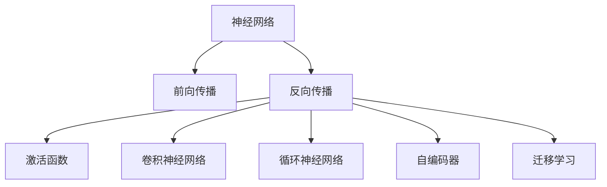

                 

# 神经网络：开启智能新纪元

> 关键词：神经网络,深度学习,反向传播,前向传播,激活函数,卷积神经网络,循环神经网络,自编码器,迁移学习

## 1. 背景介绍

### 1.1 问题由来
随着计算机科技的迅猛发展，人工智能(AI)成为引领新一轮科技革命的重要引擎。神经网络作为人工智能领域最为核心和基础的算法之一，在图像识别、语音识别、自然语言处理等诸多领域取得了令人瞩目的突破。自1940年代神经网络被提出以来，经过多年的研究与发展，神经网络已经从最初的浅层网络发展到今天深度学习的鼎盛时期，开启了智能新纪元。

然而，尽管神经网络在多个领域取得了巨大成功，其理论基础和算法机制仍存在诸多未解之谜。特别是在深度学习的早期发展阶段，学术界和工业界对其效果和可解释性一直存在较大争议。但随着时间的推移，神经网络的性能不断提升，其在实际应用中的价值也逐步得到了广泛的认可。

### 1.2 问题核心关键点
本文旨在全面介绍神经网络的基本原理与核心算法，并通过具体的代码实现，帮助读者深入理解神经网络的实际应用。我们将从神经网络的基本概念入手，逐步深入探索其架构、激活函数、反向传播等核心原理，并通过实践案例，展示神经网络在图像分类、语音识别等实际问题中的强大能力。

## 2. 核心概念与联系

### 2.1 核心概念概述

为更好地理解神经网络的工作原理和算法机制，本节将介绍几个密切相关的核心概念：

- 神经网络(Neural Network)：以多层结构为核心的非线性映射模型，由大量人工神经元组成，通过连接权值和激活函数进行信息传递和计算。
- 前向传播(Forward Propagation)：指将输入数据通过网络结构进行逐层计算，最终得到输出结果的过程。
- 反向传播(Backpropagation)：指通过输出误差与输入数据的反向关联，计算网络各层的梯度，从而更新连接权值，进行模型优化。
- 激活函数(Activation Function)：用于非线性映射的函数，将每个神经元的输入加权后，通过激活函数进行非线性变换，从而引入非线性特性。
- 卷积神经网络(Convolutional Neural Network, CNN)：针对图像和视频处理任务设计的特殊神经网络，利用卷积和池化等操作提取特征。
- 循环神经网络(Recurrent Neural Network, RNN)：针对序列数据设计的网络，能够捕捉序列数据的时序关系，广泛应用于自然语言处理等任务。
- 自编码器(Autoderoder)：用于特征降维和数据压缩的特殊神经网络，通过重构输入数据来实现编码和解码。
- 迁移学习(Transfer Learning)：指将一个领域学习到的知识迁移到另一个相关领域进行学习的方法，大大加速了模型的训练。

这些核心概念之间的逻辑关系可以通过以下Mermaid流程图来展示：



这个流程图展示了几何神经网络的核心概念及其之间的关系：

1. 神经网络通过前向传播进行信息传递。
2. 前向传播和反向传播共同完成网络优化。
3. 激活函数为网络引入非线性特性。
4. 卷积神经网络和循环神经网络针对不同类型数据设计特定网络结构。
5. 自编码器用于特征压缩和数据降维。
6. 迁移学习促进模型跨领域学习。

这些核心概念共同构成了神经网络的基本框架，为其在各个领域的应用奠定了坚实的基础。通过理解这些核心概念，我们可以更好地把握神经网络的工作原理和优化方法。

## 3. 核心算法原理 & 具体操作步骤
### 3.1 算法原理概述

神经网络的基本工作原理可以简要概括为前向传播和反向传播两部分。

- 前向传播：指将输入数据通过网络结构进行逐层计算，最终得到输出结果的过程。每层由线性变换和非线性变换构成，其中线性变换由权重矩阵和偏置项组成，非线性变换由激活函数实现。

- 反向传播：指通过输出误差与输入数据的反向关联，计算网络各层的梯度，从而更新连接权值，进行模型优化。反向传播的核心在于利用链式法则，计算输出误差对每个权重参数的偏导数，从而更新参数以最小化误差。

神经网络的核心思想是通过前向传播和反向传播的循环迭代，不断优化模型参数，使其能够逼近真实的数据分布。

### 3.2 算法步骤详解

神经网络的构建和训练过程包括以下几个关键步骤：

**Step 1: 数据预处理**
- 对原始数据进行预处理，如标准化、归一化等。
- 对分类任务，进行label编码。
- 对图像数据，进行像素值归一化、数据增强等。

**Step 2: 选择模型结构**
- 根据任务类型，选择合适的网络结构，如卷积神经网络(CNN)、循环神经网络(RNN)等。
- 确定网络层数、每层神经元数量、激活函数等关键参数。

**Step 3: 定义损失函数**
- 选择合适的损失函数，如均方误差、交叉熵等，用于衡量模型输出与真实标签之间的差异。
- 对于分类任务，通常使用二元交叉熵。

**Step 4: 模型训练**
- 定义优化算法，如随机梯度下降(SGD)、Adam等，设置学习率等超参数。
- 使用训练数据集，进行前向传播和反向传播，不断优化模型参数。
- 周期性在验证集上评估模型性能，调整学习率、正则化等超参数。

**Step 5: 模型评估与测试**
- 使用测试数据集，评估模型性能。
- 对比训练前后的精度、召回率等指标，评估模型改进效果。

### 3.3 算法优缺点

神经网络具有以下优点：
1. 强大的非线性映射能力，能够处理各种复杂模式和结构。
2. 自适应学习能力，通过反向传播不断优化模型参数。
3. 端到端训练，无需手工提取特征，高效自动化。
4. 广泛的适用性，适用于图像、文本、语音等多样化数据类型。

同时，神经网络也存在以下局限性：
1. 对数据依赖度高，需要大量标注数据进行训练。
2. 参数量巨大，计算复杂度较高。
3. 难以解释，输出结果缺乏可解释性。
4. 过拟合风险，需要适当正则化防止过拟合。
5. 训练耗时长，需要大规模计算资源支持。

尽管存在这些局限性，但就目前而言，神经网络依然是深度学习领域的核心算法，适用于处理复杂的多模态数据和任务。未来相关研究的重点在于如何进一步提高神经网络的泛化能力、可解释性和训练效率，以拓展其应用边界。

### 3.4 算法应用领域

神经网络已经在众多领域得到了广泛的应用，以下是几个典型的应用场景：

- 计算机视觉：图像分类、目标检测、人脸识别等。神经网络能够从图像中自动提取特征，并通过多层非线性变换进行分类。
- 自然语言处理：机器翻译、文本生成、情感分析等。神经网络能够从文本中提取语义特征，并通过语言模型生成文本或进行分类。
- 语音识别：声学模型、语言模型等。神经网络能够自动学习音频信号和文本之间的映射关系。
- 强化学习：自动驾驶、游戏AI等。神经网络能够从环境状态中学习最优策略，进行决策和控制。
- 推荐系统：商品推荐、内容推荐等。神经网络能够从用户历史行为中学习偏好，进行个性化推荐。

除了上述这些应用场景外，神经网络还被创新性地应用到更多领域，如医疗诊断、金融预测、智能家居等，为各行各业带来了革命性的改变。

## 4. 数学模型和公式 & 详细讲解 & 举例说明

### 4.1 数学模型构建

神经网络的核心模型可以表示为：

$$
f(x;\theta) = f^{(L)}\left(W^{(L)}f^{(L-1)}\left(W^{(L-1)}f^{(L-2)}(\dots f^{(1)}(x)\dots\right)+b^{(1)}\right)+b^{(L)}
$$

其中 $x$ 为输入， $\theta$ 为模型参数， $W$ 和 $b$ 分别代表权重矩阵和偏置项， $f(\cdot)$ 为激活函数， $L$ 为网络层数。

神经网络的训练过程是不断迭代更新模型参数的过程，以最小化损失函数 $\mathcal{L}$。常用的损失函数包括均方误差、交叉熵等，具体形式为：

- 均方误差损失：$\mathcal{L}_{MSE} = \frac{1}{N}\sum_{i=1}^N (y_i - \hat{y}_i)^2$
- 二元交叉熵损失：$\mathcal{L}_{CE} = -\frac{1}{N}\sum_{i=1}^N \left(y_i \log \hat{y}_i + (1-y_i) \log (1-\hat{y}_i)\right)$

### 4.2 公式推导过程

以二元分类任务为例，假设输入数据 $x$，模型输出 $y_i = \hat{y}_i = \sigma(W^{(L)}h^{(L-1)}+ b^{(L)})$，其中 $\sigma$ 为sigmoid函数。则二元交叉熵损失为：

$$
\mathcal{L}_{CE} = -\frac{1}{N}\sum_{i=1}^N \left(y_i \log \hat{y}_i + (1-y_i) \log (1-\hat{y}_i)\right)
$$

引入前向传播公式，得到：

$$
h^{(L-1)} = \sigma(W^{(L-1)}h^{(L-2)}+ b^{(L-1)})
$$

$$
h^{(L-2)} = \sigma(W^{(L-2)}h^{(L-3)}+ b^{(L-2)})
$$

$$
\cdots
$$

$$
h^{(1)} = \sigma(W^{(1)}x+ b^{(1)})
$$

代入反向传播公式，求解 $W^{(1)}$ 的梯度：

$$
\frac{\partial \mathcal{L}_{CE}}{\partial W^{(1)}} = \frac{\partial \mathcal{L}_{CE}}{\partial \hat{y}_i} \frac{\partial \hat{y}_i}{\partial h^{(1)}} \frac{\partial h^{(1)}}{\partial W^{(1)}}
$$

$$
\frac{\partial \mathcal{L}_{CE}}{\partial W^{(1)}} = \frac{\partial \mathcal{L}_{CE}}{\partial \hat{y}_i} \frac{\partial \hat{y}_i}{\partial h^{(1)}} \frac{\partial h^{(1)}}{\partial W^{(1)}} = \frac{\partial \mathcal{L}_{CE}}{\partial \hat{y}_i} \sigma^\prime(W^{(1)}x+ b^{(1)})x^T
$$

其中 $\sigma^\prime$ 为sigmoid函数的导数。

通过不断反向传播和参数更新，网络能够不断优化其参数，最小化损失函数，从而提高模型的泛化能力和输出精度。

### 4.3 案例分析与讲解

为了更好地理解神经网络的实际应用，我们以手写数字识别任务为例，展示如何使用TensorFlow实现一个简单的神经网络模型。

首先，导入必要的库：

```python
import tensorflow as tf
from tensorflow.keras import layers, models
```

然后，定义网络结构：

```python
model = models.Sequential()
model.add(layers.Dense(256, activation='relu', input_shape=(784,)))
model.add(layers.Dense(10, activation='softmax'))
```

定义损失函数和优化器：

```python
model.compile(optimizer=tf.keras.optimizers.Adam(), loss='sparse_categorical_crossentropy', metrics=['accuracy'])
```

接下来，加载数据集并进行预处理：

```python
mnist = tf.keras.datasets.mnist
(x_train, y_train), (x_test, y_test) = mnist.load_data()
x_train, x_test = x_train / 255.0, x_test / 255.0
```

最后，训练模型并进行评估：

```python
model.fit(x_train.reshape(-1, 784), y_train, epochs=5, batch_size=64, validation_data=(x_test.reshape(-1, 784), y_test))
test_loss, test_acc = model.evaluate(x_test.reshape(-1, 784), y_test, verbose=2)
print('Test accuracy:', test_acc)
```

通过这段代码，我们构建了一个简单的神经网络模型，通过训练数据集 MNIST 对手写数字进行识别。可以看到，神经网络通过反向传播不断优化其参数，逐步提高了模型的输出准确率。

## 5. 项目实践：代码实例和详细解释说明

### 5.1 开发环境搭建

在进行神经网络项目开发前，我们需要准备好开发环境。以下是使用Python进行TensorFlow开发的环境配置流程：

1. 安装Anaconda：从官网下载并安装Anaconda，用于创建独立的Python环境。

2. 创建并激活虚拟环境：
```bash
conda create -n tf-env python=3.8 
conda activate tf-env
```

3. 安装TensorFlow：根据CUDA版本，从官网获取对应的安装命令。例如：
```bash
pip install tensorflow==2.6
```

4. 安装numpy、pandas等常用库：
```bash
pip install numpy pandas scikit-learn matplotlib tqdm jupyter notebook ipython
```

完成上述步骤后，即可在`tf-env`环境中开始神经网络项目开发。

### 5.2 源代码详细实现

下面我们以手写数字识别任务为例，给出使用TensorFlow实现一个简单的神经网络模型的PyTorch代码实现。

```python
import tensorflow as tf
from tensorflow.keras import layers, models

# 定义网络结构
model = models.Sequential()
model.add(layers.Dense(256, activation='relu', input_shape=(784,)))
model.add(layers.Dense(10, activation='softmax'))

# 定义损失函数和优化器
model.compile(optimizer=tf.keras.optimizers.Adam(), loss='sparse_categorical_crossentropy', metrics=['accuracy'])

# 加载数据集并进行预处理
mnist = tf.keras.datasets.mnist
(x_train, y_train), (x_test, y_test) = mnist.load_data()
x_train, x_test = x_train / 255.0, x_test / 255.0

# 训练模型并进行评估
model.fit(x_train.reshape(-1, 784), y_train, epochs=5, batch_size=64, validation_data=(x_test.reshape(-1, 784), y_test))
test_loss, test_acc = model.evaluate(x_test.reshape(-1, 784), y_test, verbose=2)
print('Test accuracy:', test_acc)
```

以上就是使用TensorFlow实现一个简单的神经网络模型的完整代码实现。可以看到，TensorFlow的高级API使得神经网络的构建和训练变得非常简单，开发者可以将更多精力放在数据处理和模型优化上，而不必过多关注底层的实现细节。

### 5.3 代码解读与分析

让我们再详细解读一下关键代码的实现细节：

**Sequential模型**：
- `Sequential`模型是TensorFlow中最常用的模型之一，它以线性堆叠方式构建神经网络，简单易用。

**网络结构定义**：
- `Dense`层表示全连接层，其中 `activation`参数指定激活函数，`input_shape`参数指定输入数据的形状。

**优化器和损失函数**：
- `optimizer`参数指定优化算法，常用的有Adam、SGD等。
- `loss`参数指定损失函数，常用的有均方误差、交叉熵等。

**数据加载与预处理**：
- `mnist.load_data()`方法加载MNIST数据集，包含训练集和测试集。
- `x_train, x_test = x_train / 255.0, x_test / 255.0`进行归一化处理。

**模型训练与评估**：
- `model.fit()`方法进行模型训练，`epochs`指定训练轮数，`batch_size`指定每个批次的大小。
- `model.evaluate()`方法进行模型评估，`verbose`参数控制输出详细程度。

通过以上代码，我们可以快速构建、训练和评估一个简单的神经网络模型。这只是一个简单的开始，通过不断优化模型结构和训练方法，我们能够解决更加复杂和实际的问题。

## 6. 实际应用场景

### 6.1 计算机视觉

神经网络在计算机视觉领域的应用非常广泛，如图像分类、目标检测、人脸识别等。以图像分类为例，通过神经网络可以自动学习图像中的特征，并进行分类识别。

在实际应用中，可以通过收集标注数据，对神经网络进行训练，使其能够识别各种物体。在测试阶段，输入待识别图像，即可得到分类结果。

### 6.2 自然语言处理

神经网络在自然语言处理领域也有广泛应用，如机器翻译、情感分析、文本生成等。以机器翻译为例，通过神经网络可以将一种语言自动翻译成另一种语言。

在实际应用中，可以通过收集双语语料库，对神经网络进行训练，使其能够进行语言的自动翻译。在测试阶段，输入待翻译文本，即可得到翻译结果。

### 6.3 语音识别

神经网络在语音识别领域也有广泛应用，如语音识别、语音合成等。以语音识别为例，通过神经网络可以自动学习语音信号和文本之间的映射关系。

在实际应用中，可以通过收集语音和文本数据，对神经网络进行训练，使其能够进行语音识别。在测试阶段，输入待识别语音信号，即可得到文字转录结果。

### 6.4 未来应用展望

未来，随着神经网络的不断发展，其在各个领域的应用将更加广泛和深入。以下是几个可能的未来应用方向：

1. 自动驾驶：神经网络可以用于自动驾驶车辆的环境感知、路径规划和决策控制，提升驾驶安全和舒适性。

2. 医疗诊断：神经网络可以用于医学影像的自动诊断、病理学分析和药物研发，提升医疗服务的智能化水平。

3. 智能家居：神经网络可以用于智能家居设备的语音识别、自然语言理解和智能决策，提升家庭生活的便利性和智能化水平。

4. 智能制造：神经网络可以用于智能制造设备的故障诊断、预测维护和生产调度，提升制造业的自动化和智能化水平。

5. 智能推荐：神经网络可以用于推荐系统中的商品推荐、内容推荐和用户画像分析，提升用户满意度和平台收益。

6. 智能客服：神经网络可以用于智能客服系统的自然语言理解和对话生成，提升客户咨询的响应速度和质量。

神经网络的应用领域将不断拓展，未来随着技术的不断进步，其将在更多领域发挥出更大的价值。

## 7. 工具和资源推荐

### 7.1 学习资源推荐

为了帮助开发者系统掌握神经网络的基本原理和实践技巧，这里推荐一些优质的学习资源：

1. Deep Learning Specialization（深度学习专项课程）：由Andrew Ng教授开设的深度学习课程，涵盖神经网络的基础和高级内容。

2. TensorFlow官方文档：TensorFlow的官方文档，包含详细的API和示例代码，是学习神经网络的重要参考资料。

3. PyTorch官方文档：PyTorch的官方文档，涵盖其核心模块和常用操作，是学习神经网络的重要工具。

4. Coursera深度学习课程：Coursera平台上的深度学习课程，涵盖神经网络的基本原理和应用场景。

5. Hands-On Machine Learning with Scikit-Learn, Keras, and TensorFlow：Lars Buitinck等人撰写的深度学习入门书籍，内容详细且易于理解。

通过对这些资源的学习实践，相信你一定能够快速掌握神经网络的核心原理和实践技巧，并用于解决实际的NLP问题。

### 7.2 开发工具推荐

高效的开发离不开优秀的工具支持。以下是几款用于神经网络开发的常用工具：

1. TensorFlow：由Google主导开发的开源深度学习框架，生产部署方便，适合大规模工程应用。

2. PyTorch：由Facebook主导开发的开源深度学习框架，灵活高效，适合研究性开发。

3. Keras：基于TensorFlow和Theano等框架的高层次神经网络API，简单易用。

4. MXNet：由Amazon主导开发的开源深度学习框架，适合分布式计算和高效推理。

5. JAX：由Google开发的Python高级深度学习库，灵活高效，支持自动微分和分布式训练。

6. OpenAI Gym：用于强化学习的开源环境，包含各种经典的强化学习实验。

合理利用这些工具，可以显著提升神经网络开发的效率，加快创新迭代的步伐。

### 7.3 相关论文推荐

神经网络的发展源于学界的持续研究。以下是几篇奠基性的相关论文，推荐阅读：

1. Multi-Layer Perceptron: An Introduction to Backpropagation Networks and the Backpropagation Learning Algorithm：Rumelhart等人撰写的经典论文，介绍了多层感知器及其反向传播算法。

2. ImageNet Classification with Deep Convolutional Neural Networks：Alex Krizhevsky等人撰写的论文，展示了使用CNN进行大规模图像分类的突破性成果。

3. Recurrent Neural Network Tutorial: Building a Language Model with Backpropagation Through Time：Graves等人撰写的教程，介绍了循环神经网络及其在自然语言处理中的应用。

4. AlexNet: ImageNet Large Scale Visual Recognition Challenge：Alex Krizhevsky等人撰写的论文，展示了使用CNN进行大规模图像分类的突破性成果。

5. Attention is All You Need：Vaswani等人撰写的论文，提出了Transformer结构，开启了NLP领域的预训练大模型时代。

6. Learning to Interpret Images with Weak Supervision：Razavian等人撰写的论文，展示了使用自监督学习方法进行图像分类。

这些论文代表了大规模神经网络的研究历程，通过学习这些前沿成果，可以帮助研究者把握学科前进方向，激发更多的创新灵感。

## 8. 总结：未来发展趋势与挑战

### 8.1 总结

本文对神经网络的基本原理与核心算法进行了全面系统的介绍。首先，从神经网络的基本概念入手，逐步深入探索其架构、激活函数、反向传播等核心原理，并通过具体的代码实现，帮助读者深入理解神经网络的实际应用。其次，通过具体案例展示神经网络在图像分类、语音识别等实际问题中的强大能力。

通过本文的系统梳理，可以看到，神经网络作为深度学习的核心算法，已经在各个领域展示了巨大的潜力和应用价值。未来，随着神经网络的发展，其在各个领域的应用将更加广泛和深入。

### 8.2 未来发展趋势

展望未来，神经网络的发展将呈现以下几个趋势：

1. 更强的泛化能力：未来神经网络将进一步提升泛化能力，适应更加多样和复杂的数据分布，具有更强的跨领域迁移能力。

2. 更高效的训练方法：未来神经网络的训练将更加高效，使用分布式训练、硬件加速等技术，缩短训练时间。

3. 更强的可解释性：未来神经网络将更加可解释，使用因果推断、可解释性框架等技术，提升模型的可解释性。

4. 更广泛的适用性：未来神经网络将应用于更多领域，如医疗、金融、智能制造等，为各行各业带来颠覆性变革。

5. 更高效的推理加速：未来神经网络将通过模型压缩、推理加速等技术，提升推理效率，降低计算资源消耗。

6. 更智能的交互方式：未来神经网络将通过智能交互技术，实现人机协作，提升用户体验。

以上趋势凸显了神经网络未来的发展潜力，通过不断的技术创新和应用拓展，神经网络必将在更多领域发挥出更大的价值。

### 8.3 面临的挑战

尽管神经网络已经取得了显著的成就，但在迈向更加智能化、普适化应用的过程中，仍面临诸多挑战：

1. 数据依赖度高：神经网络需要大量标注数据进行训练，数据获取成本较高，且标注过程耗时耗力。

2. 计算资源消耗大：大规模神经网络需要大量计算资源进行训练和推理，对硬件要求较高。

3. 可解释性不足：神经网络的黑箱特性使其难以解释输出结果，缺乏可解释性。

4. 偏见和伦理问题：神经网络可能学习到有害的偏见和信息，对输出结果产生不良影响。

5. 鲁棒性和泛化能力不足：神经网络在面对未知数据时，泛化能力较弱，容易发生过拟合。

6. 模型压缩和推理加速：大规模神经网络推理速度较慢，需要高效的压缩和加速技术。

7. 安全和隐私问题：神经网络涉及大量数据，数据隐私和安全问题亟需解决。

这些挑战仍需通过技术创新和应用优化来克服，相信随着研究者和工程师的共同努力，神经网络将不断优化其性能和应用效果。

### 8.4 研究展望

未来神经网络的研究方向将聚焦于以下几个方面：

1. 模型压缩与推理加速：通过模型剪枝、量化、稀疏化等技术，压缩神经网络参数，提升推理效率。

2. 可解释性框架：通过可解释性框架、因果推断等技术，提升神经网络的可解释性，使其输出结果更加透明和可信。

3. 自监督学习：通过自监督学习技术，利用无标签数据进行预训练，提高神经网络的泛化能力。

4. 联邦学习：通过联邦学习技术，在不同设备上分布式训练神经网络，保护数据隐私。

5. 跨领域迁移学习：通过迁移学习技术，在多个领域之间进行知识迁移，提高神经网络的跨领域适应能力。

6. 分布式训练：通过分布式训练技术，在多台设备上并行训练神经网络，提高训练效率。

这些研究方向将为神经网络带来新的突破和发展，推动其更加广泛的应用。

## 9. 附录：常见问题与解答

**Q1：神经网络对数据依赖度是否非常高？**

A: 是的，神经网络需要大量标注数据进行训练，数据获取成本较高，且标注过程耗时耗力。但近年来，通过自监督学习等方法，部分任务可以实现少样本甚至无样本学习，降低了数据依赖度。

**Q2：神经网络在训练时对计算资源要求是否非常高？**

A: 是的，大规模神经网络需要大量计算资源进行训练和推理，对硬件要求较高。但可以通过分布式训练、模型压缩等技术，提高训练效率，降低资源消耗。

**Q3：神经网络的可解释性是否不足？**

A: 是的，神经网络的黑箱特性使其难以解释输出结果，缺乏可解释性。但近年来，通过可解释性框架、因果推断等技术，提升了神经网络的可解释性。

**Q4：神经网络是否容易产生偏见和伦理问题？**

A: 是的，神经网络可能学习到有害的偏见和信息，对输出结果产生不良影响。但可以通过数据清洗、模型校正等技术，减少偏见和伦理问题。

**Q5：神经网络在面对未知数据时，泛化能力是否较弱？**

A: 是的，神经网络在面对未知数据时，泛化能力较弱，容易发生过拟合。但可以通过正则化、对抗训练等技术，提高泛化能力。

通过本文的系统梳理，可以看到，神经网络作为深度学习的核心算法，已经在各个领域展示了巨大的潜力和应用价值。未来，随着神经网络的发展，其在各个领域的应用将更加广泛和深入。通过不断的技术创新和应用优化，神经网络将不断优化其性能和应用效果，推动人工智能技术在更多领域取得突破。

