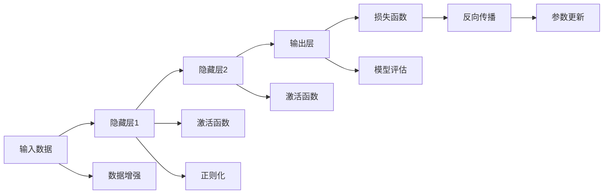

                 

# 神经网络：推动社会进步的力量

> 关键词：神经网络,深度学习,人工智能,社会进步,技术伦理,数据安全,可持续发展

## 1. 背景介绍

### 1.1 问题由来
神经网络，作为人工智能领域的核心技术之一，自20世纪80年代以来经历了从学术研究到工业应用的飞速发展。它通过模拟人脑神经元之间的连接关系，实现对大量数据的复杂处理和分析，已经在图像识别、语音识别、自然语言处理等多个领域取得突破性进展。今天，神经网络已经深入到医疗、金融、教育、交通等各行各业，成为推动社会进步的重要力量。

### 1.2 问题核心关键点
神经网络技术发展迅速，但与此同时，如何高效利用、如何确保其伦理与安全、如何促进其可持续发展等挑战也随之而来。本文将从神经网络技术本身出发，深入探讨其核心概念、原理与应用，同时反思其对社会进步的影响，并提出未来发展的趋势与挑战。

## 2. 核心概念与联系

### 2.1 核心概念概述
神经网络，又称为深度学习模型，是一种基于人工神经元构建的计算模型。其主要特点是层次化的信息传递方式和自适应学习机制。

- **人工神经元(Neuron)**：神经网络的基本单位，接收输入并产生输出，通常由权重、偏置和激活函数组成。
- **权重矩阵(Weight Matrix)**：不同神经元之间的连接参数，影响信息在网络中的传递方式。
- **偏置向量(Bias Vector)**：调整神经元输出，赋予网络一定的灵活性。
- **激活函数(Activation Function)**：对神经元输出进行非线性变换，增强网络的表达能力。
- **损失函数(Loss Function)**：衡量模型预测与真实标签之间的差异，指导模型参数的优化。
- **反向传播(Backpropagation)**：通过链式法则计算损失函数对各个参数的梯度，从而更新模型参数。

### 2.2 核心概念原理和架构的 Mermaid 流程图



该流程图展示了神经网络的基本结构和训练流程。输入数据首先经过多个隐藏层进行特征提取和表示学习，最终由输出层得到预测结果。隐藏层的激活函数非线性变换使得网络可以表达更复杂的函数，反向传播算法利用梯度下降优化损失函数，更新模型参数。数据增强和正则化技术进一步提升模型鲁棒性和泛化能力。

## 3. 核心算法原理 & 具体操作步骤
### 3.1 算法原理概述
神经网络的核心算法是反向传播(Backpropagation)，该算法通过梯度下降优化损失函数，逐步调整网络参数，使模型预测结果逼近真实标签。其数学基础包括链式法则和梯度下降。

神经网络的训练过程主要分为前向传播和反向传播两个步骤：

- **前向传播(Forward Pass)**：将输入数据依次通过各层神经元，得到最终输出。
- **反向传播(Backward Pass)**：从输出层开始，利用链式法则计算损失函数对各个参数的梯度，并根据梯度更新模型参数。

### 3.2 算法步骤详解
#### 3.2.1 输入预处理
输入数据首先需要进行预处理，如归一化、标准化、分词等。对于图像数据，还需要进行缩放、旋转、裁剪等增强操作，增加数据多样性。

#### 3.2.2 前向传播
前向传播过程中，输入数据依次通过各层神经元，每层输出由权重、偏置和激活函数计算得到。最后一层的输出即为模型的预测结果。

#### 3.2.3 损失函数计算
根据预测结果和真实标签计算损失函数，如均方误差、交叉熵等。常用的损失函数定义如下：
$$
\mathcal{L} = \frac{1}{N} \sum_{i=1}^N \ell(y_i, \hat{y_i})
$$
其中，$\ell$为具体损失函数，$y_i$为真实标签，$\hat{y_i}$为模型预测结果，$N$为样本数量。

#### 3.2.4 反向传播
反向传播过程中，利用链式法则计算损失函数对各层参数的梯度，并将梯度传递给前一层神经元，计算新的梯度，最终更新模型参数。

#### 3.2.5 参数更新
使用梯度下降算法更新模型参数，常用的更新策略包括批量梯度下降(Batch Gradient Descent, BGD)、随机梯度下降(Stochastic Gradient Descent, SGD)和动量(Momentum)等。更新公式为：
$$
\theta_j \leftarrow \theta_j - \eta \nabla_{\theta_j} \mathcal{L}
$$
其中，$\theta_j$为第$j$个参数，$\eta$为学习率，$\nabla_{\theta_j} \mathcal{L}$为梯度。

### 3.3 算法优缺点
神经网络具有以下优点：
1. 强大的特征提取能力：通过多层非线性变换，神经网络可以捕捉数据中的复杂模式。
2. 自适应学习机制：神经网络通过反向传播自动调整参数，适应新的数据分布。
3. 广泛的适用性：神经网络广泛应用于图像、语音、自然语言处理等多个领域，取得显著效果。

同时，神经网络也存在一些局限性：
1. 数据需求量大：神经网络需要大量的标注数据进行训练，数据获取和标注成本较高。
2. 训练时间长：神经网络训练通常需要大量计算资源，训练时间长。
3. 黑箱性质：神经网络的内部决策过程不透明，难以解释。
4. 过拟合风险：神经网络容易过拟合，特别是面对复杂模型和大规模数据时。
5. 伦理和安全问题：神经网络可能学习到有害信息，产生误导性输出，影响社会公平和安全。

### 3.4 算法应用领域

神经网络已经在众多领域取得了广泛应用，包括但不限于：

- **计算机视觉**：用于图像识别、目标检测、图像生成等。
- **自然语言处理**：用于机器翻译、情感分析、问答系统等。
- **语音识别**：用于语音识别、语音合成等。
- **推荐系统**：用于个性化推荐、广告推荐等。
- **医疗健康**：用于疾病诊断、治疗方案推荐等。
- **金融风控**：用于信用评估、欺诈检测等。
- **交通管理**：用于交通流量预测、智能驾驶等。

## 4. 数学模型和公式 & 详细讲解 & 举例说明
### 4.1 数学模型构建

神经网络的数学模型可以表示为多层感知机(Multilayer Perceptron, MLP)的形式。一个典型的神经网络包含多个隐藏层，每个隐藏层包含多个神经元，最后一层为输出层。神经元的输出由权重、偏置和激活函数决定：
$$
y = f(w \cdot x + b)
$$
其中，$w$为权重矩阵，$b$为偏置向量，$x$为输入向量，$f$为激活函数。

### 4.2 公式推导过程

以二分类任务为例，推导神经网络的前向传播和反向传播过程。假设网络结构为$L$层，其中第$j$层有$n_j$个神经元，输入为$x$，输出为$y$。

- **前向传播**：从输入层到输出层，依次计算各层神经元的输出：
$$
h_1 = f_1(w_1^T x + b_1)
$$
$$
h_2 = f_2(w_2^T h_1 + b_2)
$$
$$
\ldots
$$
$$
y = f_L(w_L^T h_{L-1} + b_L)
$$
其中，$f_i$为第$i$层的激活函数。

- **反向传播**：从输出层开始，计算损失函数对各层参数的梯度，并更新模型参数：
$$
\frac{\partial \mathcal{L}}{\partial w_L} = \frac{\partial \mathcal{L}}{\partial y} \cdot \frac{\partial y}{\partial h_{L-1}} \cdot \frac{\partial h_{L-1}}{\partial w_L}
$$
$$
\frac{\partial \mathcal{L}}{\partial b_L} = \frac{\partial \mathcal{L}}{\partial y}
$$
$$
\frac{\partial \mathcal{L}}{\partial w_{L-1}} = \frac{\partial \mathcal{L}}{\partial h_{L-1}} \cdot \frac{\partial h_{L-1}}{\partial h_{L-2}} \cdot \frac{\partial h_{L-2}}{\partial w_{L-1}}
$$
$$
\frac{\partial \mathcal{L}}{\partial b_{L-1}} = \frac{\partial \mathcal{L}}{\partial h_{L-1}}
$$
$$
\ldots
$$
$$
\frac{\partial \mathcal{L}}{\partial w_1} = \frac{\partial \mathcal{L}}{\partial y} \cdot \frac{\partial y}{\partial h_1} \cdot \frac{\partial h_1}{\partial w_1}
$$
$$
\frac{\partial \mathcal{L}}{\partial b_1} = \frac{\partial \mathcal{L}}{\partial y}
$$

### 4.3 案例分析与讲解

以MNIST手写数字识别为例，展示神经网络的训练过程。

- **数据集准备**：使用MNIST数据集，将28x28的图像转化为向量形式，进行归一化处理。
- **网络设计**：设计一个3层神经网络，包含一个输入层、两个隐藏层和一个输出层，激活函数为ReLU，输出层使用sigmoid函数进行二值化。
- **模型训练**：使用交叉熵损失函数，采用随机梯度下降优化算法，训练100个epoch，每次迭代使用一个样本进行更新。
- **结果分析**：训练结束后，计算模型在测试集上的准确率，并进行可视化分析。

## 5. 项目实践：代码实例和详细解释说明
### 5.1 开发环境搭建

以下是使用Python和TensorFlow进行神经网络训练的环境配置流程：

1. 安装Anaconda：从官网下载并安装Anaconda，用于创建独立的Python环境。

2. 创建并激活虚拟环境：
```bash
conda create -n tf-env python=3.8 
conda activate tf-env
```

3. 安装TensorFlow：
```bash
conda install tensorflow
```

4. 安装NumPy和Pandas：
```bash
pip install numpy pandas
```

5. 安装Matplotlib和TensorBoard：
```bash
pip install matplotlib tensorboard
```

完成上述步骤后，即可在`tf-env`环境中开始神经网络训练。

### 5.2 源代码详细实现

以下是一个简单的神经网络实现示例，用于对MNIST手写数字进行分类：

```python
import tensorflow as tf
import numpy as np
import matplotlib.pyplot as plt
import tensorflow_datasets as tfds

# 加载MNIST数据集
(train_dataset, test_dataset), _ = tfds.load('mnist', split=['train', 'test'], as_supervised=True)

# 数据预处理
def preprocess_data(x, y):
    x = tf.reshape(x, [28, 28, 1])
    x = x / 255.0
    y = tf.one_hot(y, depth=10)
    return x, y

train_dataset = train_dataset.map(preprocess_data).batch(32)
test_dataset = test_dataset.map(preprocess_data).batch(32)

# 定义神经网络结构
class NeuralNetwork(tf.keras.Model):
    def __init__(self):
        super(NeuralNetwork, self).__init__()
        self.fc1 = tf.keras.layers.Dense(128, activation='relu')
        self.fc2 = tf.keras.layers.Dense(64, activation='relu')
        self.fc3 = tf.keras.layers.Dense(10, activation='sigmoid')

    def call(self, x):
        x = self.fc1(x)
        x = self.fc2(x)
        x = self.fc3(x)
        return x

# 创建模型
model = NeuralNetwork()

# 定义损失函数和优化器
loss_fn = tf.keras.losses.CategoricalCrossentropy()
optimizer = tf.keras.optimizers.Adam(learning_rate=0.001)

# 训练模型
@tf.function
def train_step(x, y):
    with tf.GradientTape() as tape:
        logits = model(x)
        loss = loss_fn(y, logits)
    grads = tape.gradient(loss, model.trainable_variables)
    optimizer.apply_gradients(zip(grads, model.trainable_variables))

# 定义评估函数
@tf.function
def evaluate(x, y):
    logits = model(x)
    loss = loss_fn(y, logits)
    return loss

# 训练过程
def train(model, train_dataset, test_dataset, epochs, batch_size):
    for epoch in range(epochs):
        for x, y in train_dataset:
            train_step(x, y)
        test_loss = evaluate(test_dataset.batch(1))
        print(f'Epoch {epoch+1}, test loss: {test_loss.numpy()}')

# 训练模型
train(model, train_dataset, test_dataset, epochs=100, batch_size=32)
```

以上代码实现了对MNIST手写数字分类的神经网络。使用TensorFlow的高级API，将神经网络定义和训练过程简化，便于快速上手。

### 5.3 代码解读与分析

- **数据加载与预处理**：使用TensorFlow DataSets加载MNIST数据集，并定义数据预处理函数`preprocess_data`，将图像转化为向量形式，并进行归一化和one-hot编码。
- **模型定义**：定义一个包含3个全连接层的神经网络，使用ReLU作为激活函数，输出层使用sigmoid函数进行二值化。
- **训练过程**：定义训练函数`train_step`，使用梯度下降算法更新模型参数。定义评估函数`evaluate`，计算模型在测试集上的损失。在训练函数中，使用TensorFlow的高级API进行模型训练和评估。
- **结果展示**：在每个epoch结束后，计算测试集的损失，并进行可视化展示。

## 6. 实际应用场景

### 6.1 智能医疗

神经网络在智能医疗领域的应用包括疾病诊断、治疗方案推荐等。通过收集和标注海量的医疗数据，训练神经网络模型，使其能够从电子病历、影像、基因数据等多种来源中提取有用信息，辅助医生进行精准诊断和治疗。

- **疾病诊断**：训练神经网络模型，通过分析患者的症状和历史数据，给出可能的疾病诊断。
- **治疗方案推荐**：根据患者的病情、年龄、生活习惯等，推荐最适合的治疗方案，提高治疗效果。

### 6.2 自动驾驶

自动驾驶技术依赖于大量传感器数据进行环境感知和路径规划。神经网络被广泛应用于目标检测、路径优化等任务，辅助车辆进行安全驾驶。

- **目标检测**：使用卷积神经网络(CNN)进行图像处理，识别道路、行人、车辆等关键目标。
- **路径规划**：通过神经网络学习最优驾驶路径，避开障碍物，提高行车安全。

### 6.3 金融风控

金融风控需要对大量的交易数据进行分析，识别潜在的欺诈行为和信用风险。神经网络通过训练，能够从交易记录、用户行为等数据中挖掘模式，提高风险识别和防范能力。

- **欺诈检测**：训练神经网络模型，通过分析交易记录和用户行为，识别异常交易，防止欺诈行为。
- **信用评估**：根据用户的信用记录和行为数据，预测其信用风险，辅助银行和金融机构进行决策。

### 6.4 未来应用展望

未来，神经网络技术将在更多领域得到广泛应用，推动社会的全面进步：

- **智能制造**：通过神经网络进行设备状态监测和故障预测，提高生产效率和设备利用率。
- **环境保护**：利用神经网络进行环境监测和数据分析，提高环保治理效果。
- **教育培训**：通过神经网络进行个性化教学，提高教学质量和效率。
- **智慧城市**：使用神经网络进行城市管理和服务优化，提高城市运行效率。

## 7. 工具和资源推荐

### 7.1 学习资源推荐

为了帮助开发者系统掌握神经网络技术，这里推荐一些优质的学习资源：

1. **《深度学习》课程**：由吴恩达教授主讲，系统讲解深度学习的基本原理和实践方法。
2. **《神经网络与深度学习》书籍**：Ian Goodfellow等人合著，全面介绍神经网络理论及其应用。
3. **DeepLearning.ai**：吴恩达教授创办的在线学习平台，提供多门深度学习课程和实战项目。
4. **PyTorch官方文档**：提供丰富的神经网络模型和实践教程，是学习深度学习的必备资源。
5. **Google Colab**：谷歌提供的在线Jupyter Notebook环境，方便进行深度学习实验。

通过学习这些资源，相信你一定能够快速掌握神经网络技术，并应用于实际问题解决。

### 7.2 开发工具推荐

高效的开发离不开优秀的工具支持。以下是几款常用的深度学习开发工具：

1. **TensorFlow**：由谷歌开发的深度学习框架，支持分布式计算和GPU加速。
2. **PyTorch**：由Facebook开发的深度学习框架，支持动态计算图和模型优化。
3. **Keras**：基于TensorFlow和Theano的高级API，方便快速开发深度学习模型。
4. **MXNet**：由亚马逊开发的深度学习框架，支持多种编程语言和硬件平台。
5. **Caffe**：由Berkeley大学开发的深度学习框架，适用于图像处理和计算机视觉任务。

这些工具各有特点，选择适合自己项目的框架和工具，可以显著提升开发效率和性能。

### 7.3 相关论文推荐

神经网络技术的不断演进离不开学术界的持续研究。以下是几篇奠基性的相关论文，推荐阅读：

1. **ImageNet Large Scale Visual Recognition Challenge**：Alex Krizhevsky等人提出AlexNet模型，开启深度学习在计算机视觉领域的成功。
2. **Convolutional Neural Networks for Deep Learning**：Yann LeCun等人提出卷积神经网络，在图像识别和物体检测等领域取得突破。
3. **Deep Residual Learning for Image Recognition**：Kaiming He等人提出残差网络，解决深度网络训练中的梯度消失问题。
4. **Attention Is All You Need**：谷歌提出Transformer模型，提升自然语言处理任务的精度和效率。
5. **Language Models are Unsupervised Multitask Learners**：OpenAI提出GPT系列模型，展示零样本学习的强大能力。

这些论文代表了大规模神经网络的发展脉络。通过学习这些前沿成果，可以帮助研究者把握学科前进方向，激发更多的创新灵感。

## 8. 总结：未来发展趋势与挑战

### 8.1 总结

本文对神经网络技术进行了全面系统的介绍。从基本概念、原理到实际应用，详细探讨了神经网络对社会进步的推动作用。同时，反思了神经网络技术在发展过程中面临的伦理、安全、可持续等挑战，提出了未来发展的趋势和研究方向。

### 8.2 未来发展趋势

展望未来，神经网络技术将呈现以下几个发展趋势：

1. **更高效、更轻量**：随着硬件设备的不断提升，神经网络模型的效率和性能将进一步提高。轻量化模型、移动端神经网络等将带来更广泛的落地应用。
2. **自监督学习**：通过无监督或半监督学习方法，减少对标注数据的依赖，提升模型的泛化能力和鲁棒性。
3. **联邦学习**：在保护数据隐私的前提下，通过分布式学习，优化大规模神经网络模型。
4. **多模态融合**：结合视觉、语音、文本等多种模态数据，提升模型的理解能力和应用范围。
5. **模型压缩与优化**：通过量化、剪枝、蒸馏等技术，优化神经网络模型，提高运行效率和资源利用率。

### 8.3 面临的挑战

尽管神经网络技术取得了显著进展，但在迈向更加智能化、普适化应用的过程中，仍面临以下挑战：

1. **数据隐私保护**：神经网络需要大量的标注数据进行训练，如何保护用户隐私，避免数据泄露，仍是一个重要问题。
2. **算法透明性**：神经网络的决策过程不透明，难以解释，如何增强模型的可解释性，提升可信度，是一个重要研究方向。
3. **伦理和社会影响**：神经网络可能学习到有害信息，如何避免偏见、歧视等伦理问题，确保技术应用的社会公平，是一个重要课题。
4. **资源消耗**：神经网络模型的计算和存储需求巨大，如何提高模型的资源利用效率，降低计算成本，是一个重要研究方向。

### 8.4 研究展望

未来，神经网络技术需要在以下几个方向进行深入研究：

1. **可解释性**：增强神经网络的可解释性，使其决策过程透明、可信。
2. **数据隐私保护**：开发隐私保护技术，如差分隐私、联邦学习等，保护用户隐私。
3. **公平性**：研究算法公平性，避免偏见和歧视，提高模型在社会上的公平性。
4. **可持续性**：研究神经网络模型的节能降耗技术，实现可持续发展的目标。
5. **跨领域应用**：拓展神经网络在更多领域的应用，如医疗、教育、城市治理等，推动社会全面进步。

总之，神经网络技术正在引领人工智能技术的快速发展，成为推动社会进步的重要力量。未来，需要不断解决其面临的挑战，探索新的发展方向，才能真正实现技术的普惠和可持续性发展。

## 9. 附录：常见问题与解答

**Q1：神经网络是否适用于所有任务？**

A: 神经网络在许多领域取得了显著成功，但其应用也面临一些限制。例如，对于某些复杂任务，如长期记忆、时间序列分析等，传统的神经网络可能效果不佳。此时，可以引入专门设计的网络结构，如循环神经网络(RNN)、长短期记忆网络(LSTM)等，以适应特定任务的需求。

**Q2：神经网络是否存在过拟合风险？**

A: 神经网络在面对复杂数据时容易发生过拟合，特别是当网络结构复杂、数据量较小的情况下。缓解过拟合的方法包括增加数据量、正则化、Dropout、Early Stopping等。同时，可以采用模型压缩、蒸馏等技术，提高模型的泛化能力。

**Q3：神经网络在落地应用时需要注意哪些问题？**

A: 在神经网络落地应用时，需要注意以下几点：
1. **模型裁剪**：去除不必要的层和参数，减小模型尺寸，提高推理速度。
2. **量化加速**：将浮点模型转为定点模型，压缩存储空间，提高计算效率。
3. **服务化封装**：将模型封装为标准化服务接口，便于集成调用。
4. **弹性伸缩**：根据请求流量动态调整资源配置，平衡服务质量和成本。
5. **监控告警**：实时采集系统指标，设置异常告警阈值，确保服务稳定性。

**Q4：神经网络对数据隐私和安全有哪些影响？**

A: 神经网络需要大量的标注数据进行训练，这些数据往往包含敏感信息，如个人隐私、医疗记录等。如何保护用户隐私，避免数据泄露，是神经网络应用过程中必须考虑的重要问题。常见的隐私保护技术包括差分隐私、联邦学习等，可以在保护隐私的同时进行模型训练。

---

作者：禅与计算机程序设计艺术 / Zen and the Art of Computer Programming

