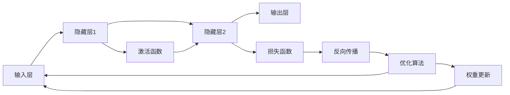

                 

# 神经网络：改变世界的技术

## 1. 背景介绍

### 1.1 问题由来

神经网络(Neural Networks, NNs)，自1940年代问世以来，经历了从低层前馈网络到深度卷积网络，再到全连接深度神经网络的发展历程。神经网络在模式识别、计算机视觉、语音识别、自然语言处理等诸多领域展示了巨大的潜力。在20世纪80年代，BP神经网络引领了第一波神经网络热潮，而进入21世纪，深度学习技术的兴起，使得神经网络的研究与应用达到了新的高度。深度学习技术通过多层非线性变换，实现了对复杂非线性数据的学习与表示，成为了当前人工智能技术的核心。

### 1.2 问题核心关键点

当前，神经网络在诸如自动驾驶、语音识别、自然语言理解等高难度任务中，已经达到了人机匹敌甚至超越人类的水平。然而，尽管神经网络技术迅猛发展，但它的工作原理、设计方式以及未来发展方向，仍然充满着许多未知和挑战。因此，本文将从神经网络的原理、实践以及未来发展趋势几个方面进行探讨，希望能抛砖引玉，为神经网络的深入研究提供新的视角。

## 2. 核心概念与联系

### 2.1 核心概念概述

神经网络，作为深度学习的主要组成部分，是模仿生物神经网络结构和功能的一种计算模型。它由大量的简单处理单元（即神经元）组成，每个神经元与其他神经元相连，形成复杂的网络结构。神经网络通过反向传播算法进行训练，调整权重参数以最小化损失函数，实现对数据的逼近与预测。

在神经网络中，常见的概念包括：

- **神经元**：神经网络的基本组成单元，接收输入数据并计算输出。
- **激活函数**：对神经元的输出进行非线性变换，以引入非线性性质。
- **权重矩阵**：连接神经元的参数，用来控制神经元之间的信息流动。
- **损失函数**：度量模型预测结果与实际值之间的差异，训练的最终目标是最小化损失函数。
- **反向传播**：利用链式法则计算损失函数对权重矩阵的梯度，更新参数。
- **优化算法**：如梯度下降、Adam等，用于调整权重矩阵以最小化损失函数。

这些概念构成了神经网络的基本框架，并在不同的网络结构和算法中不断演变和优化，以适应不同类型的数据和任务。

### 2.2 核心概念原理和架构的 Mermaid 流程图



上图的流程图展示了神经网络的基本架构和流程。输入层接收原始数据，经过隐藏层和激活函数的非线性变换，最终由输出层生成预测结果。通过反向传播算法，计算损失函数对权重矩阵的梯度，利用优化算法更新参数，以最小化预测误差。

## 3. 核心算法原理 & 具体操作步骤

### 3.1 算法原理概述

神经网络通过多层非线性变换，实现对复杂数据的学习与表示。其核心算法包括前向传播和反向传播两个部分。前向传播将输入数据逐层传递，通过非线性变换生成最终输出。反向传播则通过链式法则计算损失函数对权重矩阵的梯度，利用优化算法调整参数，以最小化预测误差。

神经网络的学习过程可以分为以下几个步骤：

1. **初始化权重矩阵**：随机初始化连接神经元的权重参数。
2. **前向传播**：将输入数据逐层传递，通过激活函数和权重矩阵的变换生成最终输出。
3. **计算损失函数**：将输出与实际值对比，计算预测误差。
4. **反向传播**：利用链式法则计算梯度，更新权重参数。
5. **重复迭代**：多次迭代训练，直到达到预设的收敛条件。

### 3.2 算法步骤详解

以一个简单的多层感知机(Multilayer Perceptron, MLP)为例，详细解释神经网络的训练过程。

1. **初始化权重矩阵**：
   ```python
   import numpy as np

   # 定义神经网络的层数和每层神经元数
   input_size = 784  # 输入层神经元数
   hidden_size = 256  # 隐藏层神经元数
   output_size = 10  # 输出层神经元数

   # 随机初始化权重矩阵和偏置向量
   W1 = np.random.randn(input_size, hidden_size)
   b1 = np.zeros(hidden_size)
   W2 = np.random.randn(hidden_size, output_size)
   b2 = np.zeros(output_size)
   ```

2. **前向传播**：
   ```python
   def forward(X):
       h = np.dot(X, W1) + b1
       h = np.maximum(h, 0)  # 使用ReLU作为激活函数
       y_hat = np.dot(h, W2) + b2
       return y_hat

   X = ...  # 输入数据
   y_hat = forward(X)
   ```

3. **计算损失函数**：
   ```python
   def loss(y_hat, y):
       return np.mean((y_hat - y)**2)  # 均方误差损失

   y = ...  # 真实标签
   loss_value = loss(y_hat, y)
   ```

4. **反向传播**：
   ```python
   def backward(y_hat, y, learning_rate):
       dL_dW2 = 2 * (y_hat - y) * y_hat
       dL_dh = np.dot(dL_dW2, W2.T)
       dL_db2 = np.sum(dL_dW2, axis=0)
       dL_dh1 = np.dot(dL_dh, W1.T)
       dL_db1 = np.sum(dL_dh1, axis=0)

       dW2 = learning_rate * dL_dW2
       db2 = learning_rate * dL_db2
       dW1 = learning_rate * dL_dh1
       db1 = learning_rate * dL_db1

       return dW1, db1, dW2, db2

   dW1, db1, dW2, db2 = backward(y_hat, y, learning_rate)
   W1 -= dW1
   b1 -= db1
   W2 -= dW2
   b2 -= db2
   ```

5. **重复迭代**：
   ```python
   num_epochs = 100
   learning_rate = 0.01

   for epoch in range(num_epochs):
       y_hat = forward(X)
       loss_value = loss(y_hat, y)
       dW1, db1, dW2, db2 = backward(y_hat, y, learning_rate)
       W1 -= dW1
       b1 -= db1
       W2 -= dW2
       b2 -= db2
       print(f"Epoch {epoch+1}, loss: {loss_value:.4f}")
   ```

通过上述步骤，可以完成神经网络的训练过程，逐步调整权重参数以最小化损失函数。

### 3.3 算法优缺点

神经网络在处理复杂数据和建模复杂关系方面展现了巨大的优势，但也存在一些局限性：

**优点**：
- **非线性建模能力**：神经网络通过多层非线性变换，可以处理非线性数据，拟合复杂的函数关系。
- **泛化能力强**：神经网络在经过大量数据训练后，可以很好地泛化到新的数据集上。
- **高度并行性**：神经网络可以通过GPU等并行计算设备加速训练，提高模型效率。
- **算法优化**：现代深度学习框架如TensorFlow、PyTorch等提供了高效的优化算法和自动微分工具，极大简化了模型开发和训练过程。

**缺点**：
- **参数过多**：神经网络中的参数数量往往很大，训练时容易出现过拟合。
- **计算资源消耗大**：大规模神经网络需要大量的计算资源和时间，训练和推理过程较为耗时。
- **黑盒性质**：神经网络内部的参数和结构复杂，难以理解和解释，导致模型缺乏可解释性。
- **训练过程中敏感**：神经网络对于初始参数的选择和训练过程的控制较为敏感，需要精心调参。

## 4. 数学模型和公式 & 详细讲解

### 4.1 数学模型构建

神经网络的数学模型可以描述为：

$$
y = f(z)
$$

其中，$z$ 表示输入，$y$ 表示输出，$f$ 表示前向传播函数。前向传播函数可以表示为：

$$
z_i = \sum_{j} w_{ij}z_{j-1} + b_i
$$

$$
y_i = f(z_i) = g(w_{i0}z_0 + w_{i1}z_1 + \cdots + w_{i(n-1)}z_{n-1} + b_i)
$$

其中，$w$ 表示权重矩阵，$b$ 表示偏置向量，$g$ 表示激活函数。

### 4.2 公式推导过程

以一个简单的全连接神经网络为例，其数学模型可以表示为：

$$
z_1 = W_1x + b_1
$$

$$
z_2 = W_2z_1 + b_2
$$

$$
y = W_3z_2 + b_3
$$

其中，$x$ 表示输入，$y$ 表示输出，$W_i$ 表示权重矩阵，$b_i$ 表示偏置向量。通过链式法则，可以得到损失函数对权重矩阵的梯度：

$$
\frac{\partial \mathcal{L}}{\partial W_1} = \frac{\partial \mathcal{L}}{\partial z_1}\frac{\partial z_1}{\partial W_1} + \frac{\partial \mathcal{L}}{\partial z_2}\frac{\partial z_2}{\partial z_1}\frac{\partial z_1}{\partial W_1}
$$

$$
\frac{\partial \mathcal{L}}{\partial b_1} = \frac{\partial \mathcal{L}}{\partial z_1}\frac{\partial z_1}{\partial b_1}
$$

通过反向传播算法，可以逐步计算出损失函数对权重矩阵和偏置向量的梯度，并利用优化算法调整参数，以最小化预测误差。

### 4.3 案例分析与讲解

以一个简单的手写数字识别为例，使用LeNet网络进行训练。LeNet是一种经典的卷积神经网络，适用于处理图像数据。以下是一个简单的LeNet网络结构：

```
Conv2D -> MaxPooling2D -> Conv2D -> MaxPooling2D -> FC -> FC -> Softmax
```

其中，Conv2D表示卷积层，MaxPooling2D表示池化层，FC表示全连接层，Softmax表示输出层。

使用MNIST数据集进行训练，训练过程中，先对输入图像进行预处理，然后送入网络中进行前向传播和反向传播。在每次训练迭代中，计算损失函数，并利用优化算法更新权重和偏置参数。重复这个过程，直到达到预设的收敛条件。

## 5. 项目实践：代码实例和详细解释说明

### 5.1 开发环境搭建

在使用深度学习框架进行神经网络训练时，需要先搭建好开发环境。以下是使用Python进行TensorFlow开发的环境配置流程：

1. 安装Anaconda：从官网下载并安装Anaconda，用于创建独立的Python环境。

2. 创建并激活虚拟环境：
```bash
conda create -n tensorflow-env python=3.8 
conda activate tensorflow-env
```

3. 安装TensorFlow：根据CUDA版本，从官网获取对应的安装命令。例如：
```bash
conda install tensorflow -c tf -c conda-forge
```

4. 安装各类工具包：
```bash
pip install numpy pandas scikit-learn matplotlib tqdm jupyter notebook ipython
```

完成上述步骤后，即可在`tensorflow-env`环境中开始神经网络训练。

### 5.2 源代码详细实现

下面我们以手写数字识别为例，给出使用TensorFlow对LeNet网络进行训练的代码实现。

首先，定义LeNet网络结构：

```python
import tensorflow as tf
from tensorflow.keras.layers import Conv2D, MaxPooling2D, Flatten, Dense, Dropout

def leNet():
    model = tf.keras.Sequential([
        Conv2D(6, kernel_size=(5, 5), activation='relu', input_shape=(28, 28, 1)),
        MaxPooling2D(pool_size=(2, 2)),
        Dropout(0.25),
        Conv2D(16, kernel_size=(5, 5), activation='relu'),
        MaxPooling2D(pool_size=(2, 2)),
        Dropout(0.25),
        Flatten(),
        Dense(128, activation='relu'),
        Dropout(0.5),
        Dense(10, activation='softmax')
    ])
    return model
```

然后，定义损失函数和优化器：

```python
from tensorflow.keras.optimizers import SGD

model = leNet()
loss_fn = tf.keras.losses.SparseCategoricalCrossentropy()
optimizer = SGD(learning_rate=0.01)
```

接着，定义训练和评估函数：

```python
def train_step(model, X_train, y_train, batch_size):
    steps_per_epoch = X_train.shape[0] // batch_size

    for step in range(steps_per_epoch):
        start = step * batch_size
        end = start + batch_size

        with tf.GradientTape() as tape:
            predictions = model(X_train[start:end, :, :, :])
            loss = loss_fn(y_train[start:end], predictions)

        grads = tape.gradient(loss, model.trainable_variables)
        optimizer.apply_gradients(zip(grads, model.trainable_variables))
```

最后，启动训练流程并在测试集上评估：

```python
X_train, y_train, X_test, y_test = ...

train_step(model, X_train, y_train, batch_size)
```

以上就是使用TensorFlow对LeNet网络进行手写数字识别的完整代码实现。可以看到，TensorFlow提供了强大的深度学习框架和丰富的组件库，使得神经网络的开发和训练变得简便高效。

### 5.3 代码解读与分析

让我们再详细解读一下关键代码的实现细节：

**LeNet网络定义**：
- 使用`Sequential`模型定义网络结构，包含卷积层、池化层、全连接层和激活函数。
- `Conv2D`表示卷积层，`MaxPooling2D`表示池化层，`Flatten`表示扁平化操作，`Dense`表示全连接层。

**损失函数和优化器**：
- 使用`SparseCategoricalCrossentropy`作为损失函数，适用于多分类问题。
- 使用`SGD`优化器，学习率为0.01。

**训练函数**：
- 使用`GradientTape`记录梯度，`apply_gradients`用于更新权重参数。

**训练流程**：
- 每次迭代从训练集数据中取出一个batch，计算损失和梯度，更新权重参数。

可以看到，TensorFlow提供了简便易用的API，使得神经网络的开发和训练过程变得更为高效。

## 6. 实际应用场景

### 6.1 自动驾驶

自动驾驶是神经网络应用的一个重要领域。在自动驾驶系统中，神经网络被用于处理传感器数据、进行环境感知、决策制定和路径规划等任务。例如，卷积神经网络可以用于图像识别，从摄像头拍摄的实时图像中识别出道路、车辆、行人等障碍物，帮助汽车做出合理的行驶决策。

### 6.2 语音识别

语音识别是神经网络应用的另一个重要领域。在语音识别系统中，神经网络被用于从语音信号中提取特征、进行语音识别和理解等任务。例如，循环神经网络(RNN)可以用于语音序列建模，从音频信号中提取语义信息，转化为文本格式。

### 6.3 自然语言处理

自然语言处理是神经网络应用的核心领域之一。在自然语言处理系统中，神经网络被用于文本分类、情感分析、机器翻译等任务。例如，Transformer模型可以用于文本序列建模，从输入文本中提取语义信息，生成翻译结果。

### 6.4 未来应用展望

随着神经网络技术的不断发展，其在未来将具有更加广阔的应用前景：

1. **智能家居**：在智能家居系统中，神经网络被用于语音识别、智能推荐、安全监控等任务。例如，智能音箱可以通过语音识别和自然语言处理，实现语音控制家居设备。

2. **医疗诊断**：在医疗诊断系统中，神经网络被用于图像识别、病理分析、疾病预测等任务。例如，卷积神经网络可以用于医学影像分析，从CT、MRI等影像中检测出病变区域。

3. **金融风控**：在金融风控系统中，神经网络被用于欺诈检测、信用评估、风险预测等任务。例如，神经网络可以用于分析用户行为数据，识别异常交易行为，预防欺诈风险。

4. **推荐系统**：在推荐系统中，神经网络被用于用户画像、物品特征、推荐排序等任务。例如，神经网络可以用于分析用户历史行为数据，生成个性化的推荐结果。

## 7. 工具和资源推荐

### 7.1 学习资源推荐

为了帮助开发者系统掌握神经网络的理论基础和实践技巧，这里推荐一些优质的学习资源：

1. 《深度学习》书籍：Ian Goodfellow等著，深入浅出地介绍了深度学习的基本概念、算法和应用。
2. 《神经网络与深度学习》书籍：Michael Nielsen等著，通过直观的图表和实例，介绍了神经网络的原理和实践。
3. 《动手学深度学习》书籍：李沐等著，提供了丰富的代码实例和实验环境，便于实践学习。
4. CS231n《卷积神经网络》课程：斯坦福大学开设的计算机视觉课程，详细介绍了卷积神经网络的理论和实践。
5. DeepLearning.AI课程：由Andrew Ng等教授主讲，介绍了深度学习的基本概念和应用。

通过对这些资源的学习实践，相信你一定能够快速掌握神经网络的核心原理和算法，并应用于解决实际问题。

### 7.2 开发工具推荐

高效的开发离不开优秀的工具支持。以下是几款用于神经网络开发和训练的常用工具：

1. TensorFlow：由Google主导开发的开源深度学习框架，生产部署方便，适合大规模工程应用。
2. PyTorch：基于Python的开源深度学习框架，灵活动态，适合研究和学习。
3. Keras：Keras是一个高级深度学习框架，支持TensorFlow、Theano和CNTK等后端，方便快速搭建模型。
4. Scikit-Learn：用于数据处理和模型评估的Python库，支持多种机器学习算法。
5. Jupyter Notebook：支持Python代码编写和数据可视化的交互式环境。

合理利用这些工具，可以显著提升神经网络的开发效率，加快创新迭代的步伐。

### 7.3 相关论文推荐

神经网络技术的发展离不开学界的持续研究。以下是几篇奠基性的相关论文，推荐阅读：

1. A Course in Deep Learning：Ian Goodfellow等著，详细介绍了深度学习的基本概念、算法和应用。
2. Deep Learning：Ian Goodfellow等著，深入浅出地介绍了深度学习的基本概念、算法和应用。
3. Convolutional Neural Networks for Visual Recognition：Alex Krizhevsky等著，介绍了卷积神经网络的原理和应用。
4. ImageNet Classification with Deep Convolutional Neural Networks：Alex Krizhevsky等著，展示了卷积神经网络在图像分类任务上的强大能力。
5. Deep Residual Learning for Image Recognition：Kaiming He等著，提出了残差网络(RNN)，解决了深度网络训练中的梯度消失问题。

这些论文代表了大神经网络发展的经典成果，通过学习这些前沿成果，可以帮助研究者把握学科前进方向，激发更多的创新灵感。

## 8. 总结：未来发展趋势与挑战

### 8.1 总结

本文对神经网络的核心概念、原理、实践和未来发展进行了全面系统的介绍。神经网络作为深度学习的重要组成部分，通过多层非线性变换，实现对复杂数据的学习与表示，已经成为当前人工智能技术的主要方向之一。在图像识别、语音识别、自然语言处理等领域，神经网络已经取得了显著的成果。

### 8.2 未来发展趋势

展望未来，神经网络技术将呈现以下几个发展趋势：

1. **更高效的模型结构**：未来的神经网络模型将更加注重结构优化，如卷积神经网络、残差网络、Transformer等，以提高模型的效率和精度。
2. **更强大的学习能力**：神经网络将通过更大规模的数据、更多层次的参数和更复杂的结构，实现更强大的学习能力，处理更复杂的数据。
3. **更广泛的应用场景**：神经网络将广泛应用于自动驾驶、语音识别、自然语言处理等领域，推动各行业的发展和进步。
4. **更高的可解释性**：未来的神经网络将更加注重模型的可解释性，提供更好的决策依据和透明度。
5. **更高的安全性**：未来的神经网络将更加注重模型的安全性，防止模型的滥用和恶意攻击。

这些趋势将使神经网络技术在未来的应用中更加广泛和深入，推动人工智能技术的进一步发展。

### 8.3 面临的挑战

尽管神经网络技术在发展中取得了显著进展，但在迈向更加智能化、普适化应用的过程中，它仍面临着诸多挑战：

1. **数据需求巨大**：神经网络的训练需要大量的标注数据，数据采集和标注成本较高。
2. **计算资源消耗大**：大规模神经网络的训练和推理需要大量的计算资源和时间。
3. **模型复杂度高**：神经网络的内部结构复杂，难以解释和调试。
4. **泛化性能有限**：神经网络容易过拟合，泛化性能不足。
5. **模型鲁棒性不足**：神经网络对噪声和异常值较为敏感，鲁棒性有待提高。

这些问题将需要未来研究的重点，通过更多的算法优化和工程实践，解决这些问题，才能使神经网络技术在实际应用中更加可靠和高效。

### 8.4 研究展望

未来的研究将主要集中在以下几个方向：

1. **更高效的模型结构**：开发更加高效的神经网络模型结构，如卷积神经网络、残差网络、Transformer等。
2. **更强大的学习能力**：通过更大规模的数据、更多层次的参数和更复杂的结构，提高神经网络的学习能力。
3. **更广泛的应用场景**：将神经网络应用于更多领域，推动各行业的发展和进步。
4. **更高的可解释性**：开发更加可解释的神经网络模型，提高模型的透明度和可靠性。
5. **更高的安全性**：研究神经网络的安全性和鲁棒性，防止模型的滥用和恶意攻击。

这些研究方向将引领神经网络技术的发展，推动人工智能技术的进一步进步。

## 9. 附录：常见问题与解答

**Q1：神经网络是否适用于所有数据类型？**

A: 神经网络适用于处理连续数据，如图像、音频、文本等，但对于离散数据（如标签），一般需要将其转换为连续数据进行处理。对于特殊的数据类型，可能需要针对性地设计神经网络结构。

**Q2：如何优化神经网络的训练过程？**

A: 神经网络的训练过程可以通过以下方式进行优化：
1. 学习率调优：选择合适的学习率，避免过大或过小。
2. 批量大小调整：选择合适的批量大小，平衡训练速度和模型稳定性。
3. 正则化技术：如L2正则、Dropout等，防止过拟合。
4. 数据增强：通过数据增强技术，扩充训练数据集，提高模型泛化性能。
5. 模型剪枝：去除不必要的参数，提高模型的计算效率。

**Q3：如何提高神经网络的鲁棒性？**

A: 提高神经网络的鲁棒性可以通过以下方式进行优化：
1. 数据预处理：去除噪声和异常值，提高数据质量。
2. 模型集成：通过集成多个模型的预测结果，提高鲁棒性。
3. 对抗训练：使用对抗样本训练模型，提高鲁棒性。
4. 正则化技术：如L2正则、Dropout等，防止过拟合。

**Q4：神经网络在实际应用中需要注意哪些问题？**

A: 神经网络在实际应用中需要注意以下问题：
1. 模型复杂度：神经网络的复杂度需要控制在合理范围内，避免过拟合和计算资源消耗过大。
2. 数据质量：神经网络的训练需要高质量的数据，数据采集和标注成本较高。
3. 模型安全性：神经网络的输出需要具有可解释性和透明性，防止滥用和恶意攻击。
4. 模型效率：神经网络需要在计算资源有限的情况下进行高效训练和推理。

**Q5：如何评估神经网络的性能？**

A: 神经网络的性能可以通过以下指标进行评估：
1. 准确率（Accuracy）：预测正确的样本数与总样本数之比。
2. 精确率（Precision）：预测为正样本中实际为正样本的比例。
3. 召回率（Recall）：实际为正样本中被预测为正样本的比例。
4. F1-score：精确率和召回率的调和平均数。
5. AUC-ROC曲线：ROC曲线下的面积，用于评估模型的分类性能。

---

作者：禅与计算机程序设计艺术 / Zen and the Art of Computer Programming

