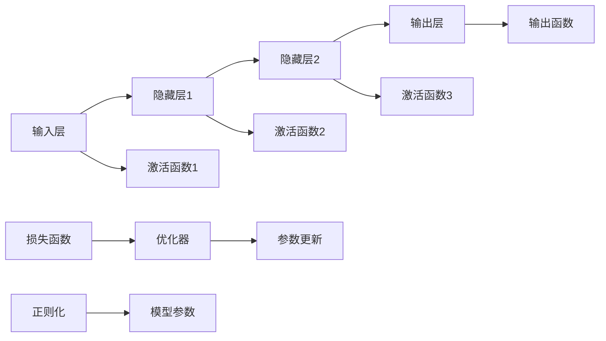

                 

# 神经网络：机器学习的新范式

## 1. 背景介绍

### 1.1 问题由来

在人工智能领域，传统的机器学习算法如支持向量机(SVM)、随机森林(Random Forest)、K近邻(KNN)等，均是基于规则或经验的方法，依赖手工特征工程和算法调参，难以直接处理高维非线性数据。而神经网络(Neural Network, NN)作为20世纪80年代兴起的一种新型机器学习模型，具备自动学习特征的强大能力，能够直接对原始数据进行建模，实现高效、精准的预测与分类。

近年来，随着深度学习技术的飞速发展，神经网络已成为机器学习领域的重要范式，被广泛应用于图像识别、语音识别、自然语言处理(NLP)、推荐系统等多个领域，显著提升了数据处理和分析的自动化和智能化水平。

### 1.2 问题核心关键点

神经网络的核心在于其强大的非线性拟合能力，通过多层神经元之间的组合运算，实现了对复杂函数的逼近。其主要特点包括：

1. 自动学习特征：神经网络可以自动从原始数据中学习高层次特征，无需手工提取。
2. 并行计算：神经网络可以利用GPU等并行计算设备加速训练过程。
3. 可解释性：相比黑箱模型，神经网络的决策过程可以借助梯度反向传播等手段进行解释。
4. 适应性强：通过合理的模型结构和优化策略，神经网络可以适应各种类型的数据和任务。

但神经网络也存在一些局限性，如对过拟合敏感、训练时间长、模型复杂等。因此，研究者们不断探索新的神经网络架构和优化方法，推动了神经网络技术在实践中的应用和发展。

### 1.3 问题研究意义

研究神经网络的核心范式，对于推动机器学习技术的进步，提升数据处理和分析的自动化、智能化水平，具有重要意义：

1. 数据驱动：神经网络通过自动学习特征，减少了人工特征工程的工作量，提高了模型构建的效率和准确性。
2. 高效计算：神经网络的并行计算特性，使其能够快速处理大规模数据集，适应大数据时代的计算需求。
3. 性能提升：神经网络在诸多领域展现了卓越的性能，推动了技术应用的多样化和深入。
4. 跨学科应用：神经网络技术广泛应用于医学影像分析、金融预测、自动驾驶等领域，加速了各行业的数字化转型。
5. 技术创新：神经网络的不断优化和扩展，催生了深度学习、迁移学习等新的研究领域，推动了人工智能技术的创新。

## 2. 核心概念与联系

### 2.1 核心概念概述

神经网络由多个神经元(节点)组成，每个神经元接收输入，通过加权和激活函数计算输出，然后传递给下一层神经元。神经网络通常分为输入层、隐藏层和输出层，中间隐藏层的神经元越多，模型复杂度越高，拟合能力越强。

**神经元(Neuron)**：
- 输入层：接受输入信号。
- 隐藏层：进行特征学习。
- 输出层：输出预测结果。

**激活函数(Activation Function)**：
- 线性函数：$y=x$。
- 非线性函数：$y=f(x)$，如Sigmoid、ReLU、Tanh等。

**损失函数(Loss Function)**：
- 衡量模型输出与真实标签的差异。
- 常见的损失函数包括均方误差(MSE)、交叉熵损失(Cross-Entropy Loss)等。

**优化器(Optimizer)**：
- 用于更新模型参数，最小化损失函数。
- 常见的优化器包括SGD、Adam、Adagrad等。

**正则化(Regularization)**：
- 防止模型过拟合，提高泛化能力。
- 常用的正则化方法包括L1正则、L2正则、Dropout等。

### 2.2 核心概念原理和架构的 Mermaid 流程图



该图展示了典型的多层神经网络架构，其中神经元之间通过加权连接传递信号，每层神经元通过激活函数计算输出，损失函数和优化器用于调整模型参数。正则化技术则用于防止过拟合，提升模型泛化能力。

## 3. 核心算法原理 & 具体操作步骤
### 3.1 算法原理概述

神经网络的训练过程通常分为前向传播(Forward Propagation)和反向传播(Backpropagation)两个步骤：

**前向传播**：
- 输入数据从输入层开始，通过加权和激活函数计算，一层层传递到输出层，生成预测结果。

**反向传播**：
- 通过损失函数计算预测结果与真实标签之间的差异。
- 利用梯度下降等优化算法，反向传播计算损失函数对每个参数的梯度。
- 根据梯度调整模型参数，重复以上过程直至收敛。

神经网络的训练过程是通过不断迭代调整模型参数，最小化损失函数，从而实现对输入数据的拟合。

### 3.2 算法步骤详解

神经网络训练的一般步骤如下：

**Step 1: 准备数据**
- 收集训练集、验证集和测试集，划分数据集。
- 将数据预处理为神经网络所需的格式，如归一化、标准化等。

**Step 2: 定义模型**
- 选择适合任务的神经网络架构，如CNN、RNN、LSTM等。
- 设置神经元的数量、激活函数、损失函数、优化器等超参数。

**Step 3: 训练模型**
- 将训练集数据输入模型，进行前向传播计算预测结果。
- 计算损失函数，反向传播计算梯度。
- 利用优化器更新模型参数，直至损失函数收敛。

**Step 4: 验证和测试**
- 在验证集上评估模型性能，选择最优参数组合。
- 在测试集上测试模型效果，对比模型预测与真实标签之间的差异。

**Step 5: 模型部署**
- 将训练好的模型部署到实际应用中，进行实时推理预测。

### 3.3 算法优缺点

神经网络的优点包括：
1. 自动学习特征：无需手工提取特征，减少了数据预处理的工作量。
2. 高效计算：可以利用GPU等高性能设备加速计算，适用于大规模数据处理。
3. 鲁棒性强：通过深度学习，神经网络能够处理非线性关系，适应各种复杂场景。

神经网络的缺点包括：
1. 参数复杂：需要大量训练样本和计算资源，容易出现过拟合。
2. 可解释性差：神经网络的内部机制不透明，难以解释其决策过程。
3. 训练时间长：神经网络的训练过程往往耗时较长，需要耐心迭代优化。
4. 模型脆弱：对初始化、超参数敏感，需要细致的调参策略。

### 3.4 算法应用领域

神经网络技术在多个领域得到了广泛应用，具体包括：

- 计算机视觉：神经网络在图像识别、目标检测、人脸识别等任务上表现优异，推动了图像处理的自动化和智能化。
- 自然语言处理：神经网络在机器翻译、文本分类、情感分析、语音识别等任务上取得了显著进展，提升了NLP应用的智能化水平。
- 语音识别：神经网络在语音识别和语音生成等方面表现出色，推动了人机交互的自然化和智能化。
- 推荐系统：神经网络在个性化推荐、商品预测、广告推荐等任务上效果显著，提高了用户体验和营销效果。
- 游戏AI：神经网络在实时决策、路径规划、策略优化等方面发挥了重要作用，提升了游戏AI的智能化水平。

除了这些传统应用领域外，神经网络还在医疗影像分析、自动驾驶、金融预测等领域展现出巨大潜力，成为推动各行业智能化转型的重要技术手段。

## 4. 数学模型和公式 & 详细讲解 & 举例说明
### 4.1 数学模型构建

神经网络可以视为一种图结构，由节点和边组成。每个节点表示一个神经元，接收输入信号，通过加权和激活函数计算输出。神经网络的数学模型可以表示为：

$$
y = f(x;w,b)
$$

其中 $x$ 表示输入向量，$w$ 表示权重矩阵，$b$ 表示偏置项，$f$ 表示激活函数。神经网络通过多层非线性变换，实现对复杂函数的逼近。

### 4.2 公式推导过程

以最简单的单层神经网络为例，推导其前向传播和反向传播的公式。

**前向传播**：
设输入向量 $x$，权重矩阵 $w$，偏置项 $b$，激活函数 $f$，则单层神经网络的输出 $y$ 可以表示为：

$$
y = f(xw+b)
$$

其中 $xw$ 表示输入向量与权重矩阵的矩阵乘积，$+b$ 表示偏置项的加和。

**反向传播**：
设损失函数为 $L$，神经网络的输出为 $y$，真实标签为 $t$，则损失函数的梯度可以表示为：

$$
\frac{\partial L}{\partial w} = \frac{\partial L}{\partial y} \frac{\partial y}{\partial w} = \frac{\partial L}{\partial y} \frac{\partial f(xw+b)}{\partial w}
$$

其中 $\frac{\partial L}{\partial y}$ 表示损失函数对输出的偏导数，$\frac{\partial y}{\partial w}$ 表示输出对权重的偏导数。

通过链式法则，反向传播公式可以进一步展开为：

$$
\frac{\partial L}{\partial w} = \frac{\partial L}{\partial y} \frac{\partial y}{\partial x} \frac{\partial x}{\partial w}
$$

其中 $\frac{\partial y}{\partial x}$ 表示输出对输入的偏导数，$\frac{\partial x}{\partial w}$ 表示输入对权重的偏导数。

### 4.3 案例分析与讲解

以手写数字识别为例，分析神经网络的训练过程。

**Step 1: 数据准备**
- 收集MNIST手写数字数据集，划分为训练集、验证集和测试集。
- 将数据预处理为神经网络所需的格式，如归一化、标准化等。

**Step 2: 模型定义**
- 定义神经网络模型，选择合适的网络结构，如单层全连接神经网络。
- 设置神经元的数量、激活函数、损失函数、优化器等超参数。

**Step 3: 训练模型**
- 将训练集数据输入模型，进行前向传播计算预测结果。
- 计算损失函数，反向传播计算梯度。
- 利用优化器更新模型参数，直至损失函数收敛。

**Step 4: 验证和测试**
- 在验证集上评估模型性能，选择最优参数组合。
- 在测试集上测试模型效果，对比模型预测与真实标签之间的差异。

通过上述步骤，神经网络可以学习到手写数字图像的特征，实现对数字的准确识别。

## 5. 项目实践：代码实例和详细解释说明
### 5.1 开发环境搭建

在进行神经网络开发前，我们需要准备好开发环境。以下是使用Python进行TensorFlow开发的环境配置流程：

1. 安装Anaconda：从官网下载并安装Anaconda，用于创建独立的Python环境。

2. 创建并激活虚拟环境：
```bash
conda create -n tf-env python=3.8 
conda activate tf-env
```

3. 安装TensorFlow：从官网获取对应的安装命令。例如：
```bash
pip install tensorflow==2.7
```

4. 安装TensorBoard：用于实时监控模型训练状态，提供丰富的图表呈现方式，方便调试模型。

5. 安装Keras：基于TensorFlow的高层API，简化模型定义和训练流程。

6. 安装PyTorch：用于模型可视化、性能测试等。

完成上述步骤后，即可在`tf-env`环境中开始神经网络模型的开发。

### 5.2 源代码详细实现

下面我们以手写数字识别为例，给出使用TensorFlow和Keras对神经网络进行训练的PyTorch代码实现。

```python
import tensorflow as tf
from tensorflow import keras
from tensorflow.keras import layers

# 加载MNIST数据集
(x_train, y_train), (x_test, y_test) = keras.datasets.mnist.load_data()

# 数据预处理
x_train = x_train / 255.0
x_test = x_test / 255.0
y_train = keras.utils.to_categorical(y_train, 10)
y_test = keras.utils.to_categorical(y_test, 10)

# 定义神经网络模型
model = keras.Sequential([
    layers.Flatten(input_shape=(28, 28)),
    layers.Dense(128, activation='relu'),
    layers.Dense(10, activation='softmax')
])

# 编译模型
model.compile(optimizer='adam', loss='categorical_crossentropy', metrics=['accuracy'])

# 训练模型
model.fit(x_train, y_train, epochs=5, batch_size=32, validation_split=0.2)

# 评估模型
model.evaluate(x_test, y_test)

# 保存模型
model.save('mnist_model.h5')
```

以上代码实现了简单的单层全连接神经网络对手写数字进行分类，通过TensorFlow和Keras的高层API，极大地简化了模型定义和训练过程。

### 5.3 代码解读与分析

让我们再详细解读一下关键代码的实现细节：

**数据加载**：
- 使用Keras内置的MNIST数据集，自动下载并加载数据集。
- 将像素值归一化到[0,1]之间，防止梯度爆炸。
- 使用`to_categorical`函数将标签转换为one-hot编码，方便模型训练。

**模型定义**：
- 使用`Sequential`模型定义单层神经网络。
- 添加一个Flatten层将输入展平为一维向量。
- 添加两个Dense层，分别包含128个神经元和10个神经元，使用ReLU和Softmax激活函数。

**模型编译**：
- 使用Adam优化器，设置交叉熵损失函数，评估指标为准确率。

**模型训练**：
- 使用`fit`函数训练模型，设置迭代轮数为5，批量大小为32，验证集比例为20%。
- 训练过程中使用`validation_split`参数指定验证集。

**模型评估**：
- 使用`evaluate`函数评估模型在测试集上的性能。

**模型保存**：
- 使用`save`函数将训练好的模型保存到文件中，方便后续部署使用。

通过上述代码实现，神经网络可以高效地进行手写数字识别任务的训练和测试。

## 6. 实际应用场景
### 6.1 智能推荐系统

神经网络在推荐系统中的应用非常广泛，可以实现个性化推荐、商品预测、广告推荐等多种功能。以电商平台的推荐系统为例，其核心问题在于如何通过用户的历史行为数据和商品属性，预测用户对商品的兴趣，并进行精准推荐。

在推荐系统的构建中，神经网络可以通过学习用户的历史浏览记录、点击行为、评价评论等数据，提取用户兴趣的隐式特征，进而进行商品推荐。具体实现步骤如下：

**Step 1: 数据准备**
- 收集用户的历史行为数据和商品属性数据。
- 将数据预处理为神经网络所需的格式，如归一化、标准化等。

**Step 2: 模型定义**
- 定义神经网络模型，选择合适的网络结构，如CNN、RNN、LSTM等。
- 设置神经元的数量、激活函数、损失函数、优化器等超参数。

**Step 3: 训练模型**
- 将用户行为数据和商品属性数据输入模型，进行前向传播计算预测结果。
- 计算损失函数，反向传播计算梯度。
- 利用优化器更新模型参数，直至损失函数收敛。

**Step 4: 验证和测试**
- 在验证集上评估模型性能，选择最优参数组合。
- 在测试集上测试模型效果，对比模型预测与真实标签之间的差异。

通过上述步骤，神经网络可以学习到用户对商品的兴趣模型，实现个性化推荐。

### 6.2 医疗影像分析

神经网络在医疗影像分析领域也有着广泛的应用，可以用于疾病诊断、图像分割、病理分析等多种任务。以肺部X光图像分析为例，其核心问题在于如何通过图像识别技术，自动识别肺部病灶和结节，并给出疾病诊断结果。

在医疗影像分析中，神经网络可以通过学习大量的肺部X光图像数据，提取影像中的高层次特征，进行疾病诊断。具体实现步骤如下：

**Step 1: 数据准备**
- 收集肺部X光图像数据集，划分为训练集、验证集和测试集。
- 将数据预处理为神经网络所需的格式，如归一化、标准化等。

**Step 2: 模型定义**
- 定义神经网络模型，选择合适的网络结构，如卷积神经网络(CNN)。
- 设置神经元的数量、激活函数、损失函数、优化器等超参数。

**Step 3: 训练模型**
- 将训练集数据输入模型，进行前向传播计算预测结果。
- 计算损失函数，反向传播计算梯度。
- 利用优化器更新模型参数，直至损失函数收敛。

**Step 4: 验证和测试**
- 在验证集上评估模型性能，选择最优参数组合。
- 在测试集上测试模型效果，对比模型预测与真实标签之间的差异。

通过上述步骤，神经网络可以学习到肺部X光图像的特征，实现疾病诊断和影像分割。

### 6.3 金融市场预测

神经网络在金融市场预测中的应用也非常重要，可以用于股票价格预测、市场趋势分析、风险评估等多种任务。以股票价格预测为例，其核心问题在于如何通过历史股票数据，预测未来股票价格的变化趋势。

在金融市场预测中，神经网络可以通过学习大量的历史股票价格数据，提取价格变化的时间序列特征，进行股票价格预测。具体实现步骤如下：

**Step 1: 数据准备**
- 收集历史股票价格数据，划分为训练集、验证集和测试集。
- 将数据预处理为神经网络所需的格式，如归一化、标准化等。

**Step 2: 模型定义**
- 定义神经网络模型，选择合适的网络结构，如LSTM、GRU等。
- 设置神经元的数量、激活函数、损失函数、优化器等超参数。

**Step 3: 训练模型**
- 将训练集数据输入模型，进行前向传播计算预测结果。
- 计算损失函数，反向传播计算梯度。
- 利用优化器更新模型参数，直至损失函数收敛。

**Step 4: 验证和测试**
- 在验证集上评估模型性能，选择最优参数组合。
- 在测试集上测试模型效果，对比模型预测与真实标签之间的差异。

通过上述步骤，神经网络可以学习到股票价格的时间序列特征，实现股票价格预测。

### 6.4 未来应用展望

随着神经网络技术的不断发展，其在更多领域的应用前景也非常广阔。未来，神经网络可能会在以下几个方向上继续突破：

1. 自监督学习：利用未标注数据进行预训练，减少对标注数据的依赖，提高模型的泛化能力。
2. 弱监督学习：利用少量标注数据进行微调，适应资源受限的场景，提升模型的实用性。
3. 迁移学习：将预训练模型的知识迁移到新任务上，加速模型的训练和优化。
4. 多模态学习：结合视觉、听觉、文本等多种模态数据，提升模型的多感官融合能力。
5. 强化学习：通过与环境交互，优化模型的决策策略，提升智能系统的自主性和适应性。
6. 因果学习：引入因果推断理论，解释模型的决策过程，提高模型的可解释性和可控性。

这些方向的研究将进一步提升神经网络的性能和应用范围，推动人工智能技术在更多领域的落地。

## 7. 工具和资源推荐
### 7.1 学习资源推荐

为了帮助开发者系统掌握神经网络的理论基础和实践技巧，这里推荐一些优质的学习资源：

1. 《深度学习》书籍：Ian Goodfellow、Yoshua Bengio和Aaron Courville合著的经典教材，系统介绍了深度学习的基本概念和算法。
2. CS231n《卷积神经网络》课程：斯坦福大学开设的计算机视觉课程，提供了大量实践案例和代码。
3. CS224n《序列建模》课程：斯坦福大学开设的自然语言处理课程，涵盖多种序列建模技术。
4. Kaggle：数据科学竞赛平台，提供了大量开源数据集和模型，适合实战训练。
5. PyTorch官方文档：PyTorch的官方文档，提供了完整的教程、API参考和示例代码。
6. TensorFlow官方文档：TensorFlow的官方文档，提供了丰富的学习资源和工具支持。

通过对这些资源的学习实践，相信你一定能够快速掌握神经网络的技术细节，并用于解决实际的机器学习问题。
### 7.2 开发工具推荐

高效的开发离不开优秀的工具支持。以下是几款用于神经网络开发的常用工具：

1. PyTorch：基于Python的开源深度学习框架，灵活动态的计算图，适合快速迭代研究。
2. TensorFlow：由Google主导开发的开源深度学习框架，生产部署方便，适合大规模工程应用。
3. Keras：基于TensorFlow的高层API，简化模型定义和训练流程。
4. Jupyter Notebook：免费的开源笔记本环境，支持Python、R、MATLAB等多种编程语言。
5. Anaconda：用于创建和管理Python环境的免费工具，方便开发者快速搭建和切换环境。

合理利用这些工具，可以显著提升神经网络模型的开发效率，加快创新迭代的步伐。

### 7.3 相关论文推荐

神经网络技术的发展源于学界的持续研究。以下是几篇奠基性的相关论文，推荐阅读：

1. AlexNet: ImageNet Classification with Deep Convolutional Neural Networks（AlexNet）：提出了卷积神经网络，开创了深度学习在计算机视觉领域的应用。
2. Long Short-Term Memory（LSTM）：提出LSTM结构，解决了传统RNN在长期依赖问题上的缺陷。
3. Deep Residual Learning for Image Recognition（ResNet）：提出残差网络，解决了深度网络退化问题，实现了更高的深度和性能。
4. A Three-Stream-CNN Architecture for Real-Time Single-Shot Object Detection（Faster R-CNN）：提出Faster R-CNN结构，实现了高效的物体检测。
5. Attention Is All You Need（Transformer）：提出Transformer结构，开创了自注意力机制在神经网络中的应用。

这些论文代表了大神经网络技术的发展脉络。通过学习这些前沿成果，可以帮助研究者把握学科前进方向，激发更多的创新灵感。

## 8. 总结：未来发展趋势与挑战
### 8.1 总结

本文对神经网络的核心范式进行了全面系统的介绍。首先阐述了神经网络在机器学习领域的重要性，明确了其自动学习特征、高效计算、鲁棒性强等核心优势。其次，从原理到实践，详细讲解了神经网络的数学模型和训练过程，给出了神经网络在多个领域的应用案例。通过本文的系统梳理，可以看到，神经网络技术已经成为机器学习的重要组成部分，极大地提升了数据处理和分析的自动化、智能化水平。

### 8.2 未来发展趋势

展望未来，神经网络技术将继续在以下几个方向上不断演进：

1. 模型规模和深度不断增大：神经网络将继续朝着更大规模、更深层次的方向发展，以提升模型的拟合能力和泛化能力。
2. 模型压缩与加速技术不断进步：神经网络将不断优化，以更小的模型规模和更少的计算资源实现高效推理。
3. 模型迁移和联邦学习不断提升：神经网络将探索更多的迁移学习和联邦学习技术，以实现数据分布的适应和模型的协同优化。
4. 模型与知识的结合不断深化：神经网络将进一步融合符号化知识和逻辑规则，提升模型的理解和推理能力。
5. 模型自监督与弱监督不断优化：神经网络将探索更多的自监督学习和弱监督学习方法，以提高模型在数据稀缺场景下的性能。
6. 模型与伦理道德的结合不断加强：神经网络将更多考虑模型的可解释性、公平性和安全性，以确保模型的伦理道德属性。

这些趋势将推动神经网络技术向更高效、更智能、更可靠的方向发展，为更多应用场景带来创新和变革。

### 8.3 面临的挑战

尽管神经网络技术在诸多领域取得了显著进展，但仍面临诸多挑战：

1. 数据量不足：神经网络需要大量标注数据进行训练，对于一些数据稀缺的应用场景，数据量不足成为制约性能提升的主要瓶颈。
2. 模型复杂度高：神经网络模型通常包含大量参数，计算资源和计算时间成本高，难以高效部署和应用。
3. 模型可解释性差：神经网络的内部机制复杂，难以解释其决策过程和输出结果。
4. 模型安全性问题：神经网络可能会学习到有害数据和偏见，产生误导性、歧视性的输出。
5. 模型公平性问题：神经网络可能会放大数据集中的偏见，产生不公平的决策结果。
6. 模型计算复杂度高：神经网络的计算复杂度高，难以实时处理大规模数据集。

这些挑战需要研究者们在模型设计、数据处理、优化策略、伦理道德等方面不断探索和优化，才能推动神经网络技术在实际应用中的广泛应用。

### 8.4 研究展望

未来的研究需要在以下几个方面寻求新的突破：

1. 轻量级神经网络：开发更加高效的神经网络模型，如MobileNet、ShuffleNet等，实现更小规模、更高效的结构。
2. 自动学习数据：探索无监督学习和半监督学习方法，利用未标注数据进行预训练，减少对标注数据的依赖。
3. 自适应学习：开发自适应神经网络，使其能够根据数据分布的变化进行动态优化。
4. 跨模态融合：融合视觉、语音、文本等多种模态数据，提升模型的多感官融合能力。
5. 联邦学习：通过联邦学习技术，实现模型在不同设备上的协同优化，保护数据隐私。
6. 因果推理：引入因果推断理论，提升模型的因果解释能力和决策逻辑性。

这些研究方向的探索，必将引领神经网络技术迈向更高的台阶，为构建安全、可靠、可解释、可控的智能系统铺平道路。面向未来，神经网络技术还需要与其他人工智能技术进行更深入的融合，如知识表示、因果推理、强化学习等，多路径协同发力，共同推动人工智能技术的进步。只有勇于创新、敢于突破，才能不断拓展神经网络的边界，让智能技术更好地造福人类社会。

## 9. 附录：常见问题与解答

**Q1：神经网络为何需要大量的训练样本？**

A: 神经网络需要大量训练样本，主要是为了确保模型能够充分学习到数据的分布特征，避免过拟合。训练样本越多，模型越能够准确地拟合数据的分布，泛化能力也越强。同时，大量的训练样本也可以帮助模型学习到更丰富的特征，提升模型的性能。

**Q2：神经网络为何需要反向传播？**

A: 神经网络通过反向传播算法更新模型参数，最小化损失函数，从而实现对输入数据的拟合。前向传播计算输出，反向传播计算梯度，梯度下降算法根据梯度更新模型参数，不断迭代优化，直到损失函数收敛。反向传播算法是神经网络的核心，它使得神经网络能够自动学习数据的分布特征，实现高维非线性关系的逼近。

**Q3：神经网络为何需要激活函数？**

A: 神经网络通过激活函数引入非线性因素，使得模型能够逼近更复杂的非线性关系。常见的激活函数包括ReLU、Sigmoid、Tanh等，它们能够将输入信号映射到不同的输出范围，增强模型的表达能力。同时，激活函数也可以防止梯度消失问题，提高神经网络的训练效率。

**Q4：神经网络为何需要正则化？**

A: 正则化技术可以防止神经网络过拟合，提高模型的泛化能力。常见的正则化方法包括L1正则、L2正则、Dropout等，它们可以通过引入惩罚项或随机失活，控制模型的复杂度，避免模型在训练集上过拟合。正则化技术是神经网络中不可或缺的一部分，能够提升模型的稳定性和可靠性。

**Q5：神经网络为何需要数据增强？**

A: 数据增强技术可以在训练过程中引入更多的数据多样性，提升模型的泛化能力。常见的数据增强方法包括图像翻转、旋转、裁剪等，它们可以生成更多的训练样本，使得模型能够更好地适应数据分布的变化。数据增强技术在图像识别、语音识别等任务中效果显著，能够提高模型的鲁棒性和泛化能力。

这些问题的解答，可以帮助读者更好地理解神经网络的核心概念和训练过程，解决实际应用中可能遇到的疑惑和问题。

---

作者：禅与计算机程序设计艺术 / Zen and the Art of Computer Programming

