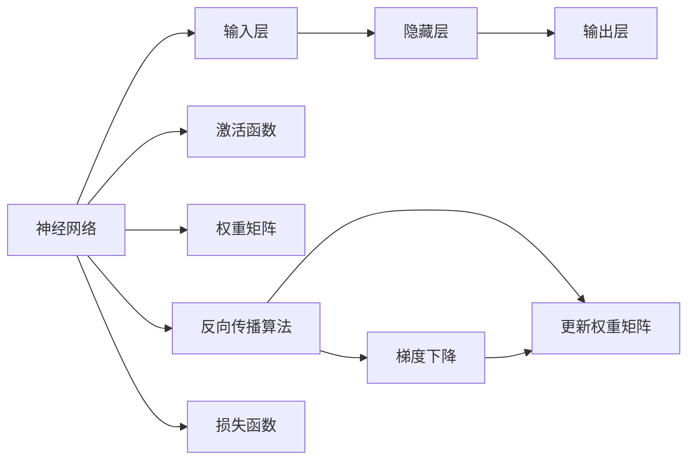

                 

## 1. 背景介绍

### 1.1 问题由来

随着人工智能技术的迅猛发展，机器学习（Machine Learning, ML）在各个领域的应用日益广泛。然而，传统的ML方法，如决策树、逻辑回归、支持向量机等，面对复杂数据结构和高维空间时，往往显得力不从心。神经网络（Neural Networks, NNs）作为一种高效的多层次非线性模型，以其强大的表示能力和泛化能力，成为新一代机器学习的代表。

### 1.2 问题核心关键点

神经网络的核心思想是模拟人脑神经元的工作原理，通过多层非线性变换，将输入数据转化为期望的输出。其核心结构包括输入层、隐藏层和输出层，每个神经元通过加权和激活函数实现信息的传递与处理。神经网络的训练过程，即通过反向传播算法，不断调整各层权重，使得模型输出逼近真实标签。

神经网络的核心概念和原理相对简单，但其算法实现和优化技术较为复杂。因此，深入理解神经网络的工作机制和优化方法，对于实际的机器学习应用至关重要。

### 1.3 问题研究意义

神经网络作为一种强大的机器学习工具，已经在图像识别、语音识别、自然语言处理等领域取得了突破性进展。这些成功案例证明了神经网络在处理复杂非线性问题上的优势。同时，神经网络的研究也推动了机器学习理论的进步，深化了我们对数据表示和模型架构的理解。

未来，随着神经网络技术的进一步成熟和应用场景的不断拓展，神经网络将可能在更多领域带来变革性的影响，推动人工智能技术的普及和深化。

## 2. 核心概念与联系

### 2.1 核心概念概述

为更好地理解神经网络的工作原理和优化技术，本节将介绍几个关键概念及其相互联系：

- **神经网络**：由多层神经元组成的网络结构，通过加权和激活函数实现信息的传递和处理。
- **反向传播算法**：一种通过梯度下降优化算法，用于更新神经网络参数的算法，是神经网络训练的核心。
- **损失函数**：用于衡量模型预测输出与真实标签之间的差异，常用的损失函数包括均方误差、交叉熵等。
- **激活函数**：用于引入非线性因素，增强模型的表达能力。常见的激活函数包括Sigmoid、ReLU、Tanh等。
- **权重矩阵**：神经网络中的关键参数，决定了输入到输出的映射关系。
- **批量梯度下降**：一种常用的优化算法，通过计算批量样本的梯度，更新权重矩阵。

这些概念通过神经网络的基本结构和工作流程相互联系，共同构成了神经网络的基本框架。

### 2.2 核心概念原理和架构的 Mermaid 流程图



这个流程图展示了神经网络的基本结构和训练流程：输入数据通过神经网络的多层变换，最终输出到输出层；隐藏层通过激活函数引入非线性，增强模型表达能力；反向传播算法通过计算梯度，更新权重矩阵，优化模型参数；损失函数衡量模型输出与真实标签的差异，指导优化方向。

## 3. 核心算法原理 & 具体操作步骤

### 3.1 算法原理概述

神经网络的训练过程，即通过反向传播算法不断优化模型参数，使得输出逼近真实标签。具体步骤如下：

1. **前向传播**：将输入数据输入网络，通过各层激活函数计算输出。
2. **损失计算**：使用损失函数计算模型预测输出与真实标签之间的差异。
3. **反向传播**：根据损失函数的梯度，反向计算各层激活函数的梯度。
4. **权重更新**：使用梯度下降算法，更新各层的权重矩阵。

这一过程反复迭代，直至模型收敛或达到预设的训练轮数。

### 3.2 算法步骤详解

下面将详细介绍神经网络的训练过程：

**Step 1: 准备数据和模型**

- 收集标注数据集，将其划分为训练集、验证集和测试集。
- 选择合适的神经网络结构，如全连接网络、卷积神经网络（CNNs）、循环神经网络（RNNs）等。
- 初始化模型的权重矩阵和偏置项。

**Step 2: 前向传播计算**

- 将训练集数据逐批次输入模型，计算各层的加权和与激活函数输出。
- 通过多层前向传播，计算最终输出。

**Step 3: 损失计算**

- 使用损失函数（如均方误差、交叉熵等）计算模型输出与真实标签之间的差异。
- 根据损失值，决定是否触发Early Stopping。

**Step 4: 反向传播计算**

- 根据损失函数的梯度，反向计算各层激活函数的梯度。
- 使用链式法则，逐层反向传播计算权重矩阵的梯度。

**Step 5: 权重更新**

- 使用梯度下降算法，根据计算出的权重梯度更新各层权重。
- 设置合适的学习率和正则化参数，防止过拟合。

**Step 6: 评估模型性能**

- 在验证集上评估模型性能，决定是否继续训练。
- 在测试集上测试模型，输出最终的评估结果。

### 3.3 算法优缺点

神经网络作为一种强大的机器学习工具，具有以下优点：

1. **强大的表达能力**：通过多层次非线性变换，神经网络能够处理复杂的非线性问题。
2. **灵活的模型结构**：神经网络可以用于各种应用场景，如图像识别、语音识别、自然语言处理等。
3. **高效的训练方法**：反向传播算法能够高效地更新权重矩阵，快速优化模型参数。
4. **自动特征提取**：神经网络能够自动学习输入数据的特征，减少手动特征工程的工作量。

然而，神经网络也存在一些缺点：

1. **数据依赖性高**：神经网络的性能依赖于标注数据的数量和质量，缺乏足够数据时容易出现过拟合。
2. **训练复杂度高**：神经网络的训练过程计算量大，需要高效的硬件支持。
3. **黑盒特性**：神经网络的内部机制复杂，难以解释其决策过程，缺乏可解释性。
4. **参数调优困难**：神经网络的参数较多，调优过程复杂，需要丰富的经验。

尽管存在这些缺点，神经网络依然是目前最有效的机器学习工具之一，广泛应用于各类复杂问题的解决。

### 3.4 算法应用领域

神经网络在多个领域的应用已经取得了显著成效，例如：

- **计算机视觉**：神经网络在图像分类、目标检测、人脸识别等领域取得了突破性进展，已经成为计算机视觉的主流技术。
- **自然语言处理**：神经网络在机器翻译、文本分类、情感分析、语言生成等领域表现优异，推动了NLP技术的发展。
- **语音识别**：神经网络在语音识别、语音合成等领域，通过端到端训练，提升了语音识别的准确率和自然度。
- **医疗健康**：神经网络在医学影像分析、疾病预测、基因组学等领域，通过自动特征提取和深度学习，提升了医疗诊断的准确性和效率。
- **金融风控**：神经网络在信用评估、风险管理、市场预测等领域，通过非线性建模和大数据分析，提升了金融决策的精准度和效率。

## 4. 数学模型和公式 & 详细讲解 & 举例说明

### 4.1 数学模型构建

神经网络的基本数学模型可以表示为：

$$
y = f(Wx + b)
$$

其中，$x$ 为输入向量，$y$ 为输出向量，$W$ 为权重矩阵，$b$ 为偏置项，$f$ 为激活函数。激活函数常用的有Sigmoid、ReLU、Tanh等。

### 4.2 公式推导过程

以单层神经网络为例，推导其损失函数和梯度更新公式。

假设模型输出为 $y$，真实标签为 $t$，则交叉熵损失函数为：

$$
L(y,t) = -\frac{1}{N} \sum_{i=1}^N (t_i \log y_i + (1-t_i) \log (1-y_i))
$$

其中，$N$ 为样本数量。

使用反向传播算法，计算权重矩阵的梯度为：

$$
\frac{\partial L}{\partial W} = \frac{1}{N} (y-t) \cdot x
$$

其中，$x$ 为输入向量，$y$ 为输出向量。

使用梯度下降算法，更新权重矩阵为：

$$
W_{i+1} = W_i - \eta \frac{\partial L}{\partial W}
$$

其中，$\eta$ 为学习率。

### 4.3 案例分析与讲解

以下是一个简单的单层神经网络案例，用于分类手写数字图像。

**数据准备**：
- 收集MNIST数据集，将其分为训练集、验证集和测试集。
- 将图像数据归一化，将其转化为输入向量 $x$。
- 将标签数据转化为独热编码 $t$。

**模型构建**：
- 定义单层神经网络，包括权重矩阵 $W$ 和偏置项 $b$。
- 选择Sigmoid激活函数。
- 定义损失函数为交叉熵损失。

**训练过程**：
- 前向传播计算输出 $y$。
- 计算损失函数 $L(y,t)$。
- 反向传播计算权重梯度 $\frac{\partial L}{\partial W}$。
- 使用梯度下降更新权重矩阵 $W$。
- 重复上述过程直至模型收敛或达到预设的训练轮数。

通过上述过程，神经网络能够逐步学习到手写数字的特征，并在测试集上取得较高的准确率。

## 5. 项目实践：代码实例和详细解释说明

### 5.1 开发环境搭建

在进行神经网络开发前，需要准备好开发环境。以下是使用Python进行TensorFlow开发的环境配置流程：

1. 安装Anaconda：从官网下载并安装Anaconda，用于创建独立的Python环境。

2. 创建并激活虚拟环境：
```bash
conda create -n tf-env python=3.8 
conda activate tf-env
```

3. 安装TensorFlow：根据CUDA版本，从官网获取对应的安装命令。例如：
```bash
conda install tensorflow -c conda-forge -c pytorch
```

4. 安装相关库：
```bash
pip install numpy scipy matplotlib scikit-learn tqdm jupyter notebook ipython
```

完成上述步骤后，即可在`tf-env`环境中开始神经网络实践。

### 5.2 源代码详细实现

下面我们以手写数字分类为例，给出使用TensorFlow对神经网络进行训练的Python代码实现。

首先，定义神经网络的结构和参数：

```python
import tensorflow as tf
from tensorflow.keras import layers, models

# 定义神经网络结构
input_layer = layers.Input(shape=(784,))
hidden_layer = layers.Dense(units=128, activation='relu')(input_layer)
output_layer = layers.Dense(units=10, activation='softmax')(hidden_layer)

model = models.Model(inputs=input_layer, outputs=output_layer)

# 定义优化器和损失函数
optimizer = tf.keras.optimizers.Adam(learning_rate=0.001)
loss_fn = tf.keras.losses.CategoricalCrossentropy()

# 编译模型
model.compile(optimizer=optimizer, loss=loss_fn, metrics=['accuracy'])
```

然后，定义数据加载和预处理函数：

```python
import numpy as np
from tensorflow.keras.datasets import mnist

def load_data():
    (x_train, y_train), (x_test, y_test) = mnist.load_data()
    x_train = x_train.reshape(-1, 784) / 255.0
    x_test = x_test.reshape(-1, 784) / 255.0
    y_train = tf.keras.utils.to_categorical(y_train, num_classes=10)
    y_test = tf.keras.utils.to_categorical(y_test, num_classes=10)
    return x_train, y_train, x_test, y_test
```

接下来，定义训练函数：

```python
def train_model(model, x_train, y_train, x_test, y_test, epochs, batch_size):
    model.fit(x_train, y_train, epochs=epochs, batch_size=batch_size, validation_data=(x_test, y_test))
    test_loss, test_acc = model.evaluate(x_test, y_test)
    print(f'Test loss: {test_loss:.4f}')
    print(f'Test accuracy: {test_acc:.4f}')
```

最后，启动训练流程并在测试集上评估：

```python
x_train, y_train, x_test, y_test = load_data()
train_model(model, x_train, y_train, x_test, y_test, epochs=10, batch_size=32)
```

以上就是使用TensorFlow对神经网络进行训练的完整代码实现。可以看到，TensorFlow提供了强大的高层次API，使得神经网络的构建和训练过程非常简便。

### 5.3 代码解读与分析

让我们再详细解读一下关键代码的实现细节：

**神经网络结构定义**：
- 定义输入层、隐藏层和输出层，分别使用`Input`、`Dense`和`Softmax`层。
- 隐藏层使用ReLU激活函数，输出层使用Softmax激活函数。

**优化器和损失函数定义**：
- 使用Adam优化器，设置学习率为0.001。
- 使用Categorical Cross-Entropy损失函数。

**模型编译和训练**：
- 使用`compile`方法编译模型，设置优化器、损失函数和评估指标。
- 使用`fit`方法进行模型训练，指定训练轮数和批次大小。
- 在训练过程中，使用`validation_data`参数指定验证集，用于实时评估模型性能。

**数据加载和预处理**：
- 使用MNIST数据集，将其转化为模型的输入和输出格式。
- 对数据进行归一化和独热编码处理，使其符合模型的输入要求。

可以看到，TensorFlow提供了丰富的API和工具，使得神经网络的开发和训练过程变得简单高效。

## 6. 实际应用场景

### 6.1 计算机视觉

神经网络在计算机视觉领域的应用非常广泛，例如：

- **图像分类**：通过卷积神经网络（CNNs），神经网络能够自动学习图像特征，实现图像分类任务。在ImageNet数据集上，CNNs已经取得了突破性的分类准确率。
- **目标检测**：通过区域提取网络（RPN）和RoI池化，神经网络能够精确定位图像中的目标对象，并在COCO数据集上取得了领先的成绩。
- **人脸识别**：通过卷积神经网络和特征提取技术，神经网络能够高效识别人脸，并在LFW数据集上实现了高精度的识别效果。

### 6.2 自然语言处理

神经网络在自然语言处理领域也取得了显著进展，例如：

- **机器翻译**：通过序列到序列（Seq2Seq）模型和注意力机制，神经网络能够实现高效的机器翻译任务。在WMT数据集上，基于神经网络的翻译模型已经超越了传统的统计机器翻译方法。
- **情感分析**：通过卷积神经网络和循环神经网络，神经网络能够自动分析文本的情感倾向，并在IMDb数据集上实现了高精度的情感分类。
- **语言生成**：通过自回归模型和Transformer结构，神经网络能够生成自然流畅的文本内容，并在GPT-2等模型上实现了高效的文本生成。

### 6.3 语音识别

神经网络在语音识别领域也展现出了强大的能力，例如：

- **语音识别**：通过端到端（End-to-End）的神经网络模型，神经网络能够高效地将语音转化为文本，并在LibriSpeech数据集上取得了领先的成绩。
- **语音合成**：通过神经网络生成对抗网络（GANs）和变分自编码器（VAEs），神经网络能够生成高质量的语音合成效果，并在VCTK和LJSpeech等数据集上取得了优异的成绩。

### 6.4 未来应用展望

未来，神经网络将继续拓展其在各个领域的应用，带来更多的突破和创新。

在计算机视觉领域，深度卷积神经网络（DCNNs）和自适应网络（Adaptive Networks）等新兴技术，将进一步提升图像识别的精度和速度。同时，多模态学习技术，如视觉-文本融合、视觉-语音融合等，也将推动计算机视觉技术的发展。

在自然语言处理领域，基于Transformer的模型如BERT、GPT-3等，将进一步提升机器翻译、文本生成、情感分析等任务的性能。同时，神经网络的跨领域迁移学习技术，也将使得模型在新的任务上快速适配，提升应用的灵活性和泛化性。

在语音识别领域，神经网络的端到端学习和多模态融合技术，将继续提升语音识别的准确性和自然度。同时，神经网络与深度学习其他分支的结合，如深度强化学习，也将为语音识别技术带来新的突破。

总之，神经网络将继续在计算机视觉、自然语言处理、语音识别等众多领域发挥重要作用，推动人工智能技术的发展和应用。

## 7. 工具和资源推荐

### 7.1 学习资源推荐

为了帮助开发者系统掌握神经网络的理论基础和实践技巧，这里推荐一些优质的学习资源：

1. 《深度学习》系列课程：由吴恩达教授主讲，系统讲解了深度学习的基本概念和前沿技术，是神经网络学习的入门必选。
2. 《神经网络与深度学习》书籍：由Michael Nielsen撰写，深入浅出地介绍了神经网络的基本原理和应用，适合初学者和进阶者阅读。
3. 《TensorFlow官方文档》：TensorFlow的官方文档，提供了详尽的API文档和案例代码，是学习TensorFlow的必备资料。
4. 《PyTorch官方文档》：PyTorch的官方文档，提供了丰富的教程和案例，适合快速上手神经网络开发。
5. Coursera和edX等在线学习平台：提供了众多由知名大学和专家提供的神经网络课程，涵盖从入门到进阶的各种内容。

通过学习这些资源，相信你一定能够快速掌握神经网络的核心思想和优化方法，并用于解决实际的机器学习问题。

### 7.2 开发工具推荐

高效的开发离不开优秀的工具支持。以下是几款用于神经网络开发的常用工具：

1. TensorFlow：由Google主导开发的深度学习框架，生产部署方便，适合大规模工程应用。同时提供了丰富的预训练模型和优化器。
2. PyTorch：由Facebook开发的高性能深度学习框架，适合快速迭代研究。提供了灵活的动态计算图和强大的GPU加速支持。
3. Keras：基于TensorFlow和Theano的高级API，提供了简洁的API接口，适合快速原型设计和实验。
4. MXNet：由亚马逊开发的深度学习框架，支持分布式训练和多种语言接口，适合大规模并行计算。
5. Caffe：由伯克利大学开发的深度学习框架，专注于卷积神经网络的加速计算，适合计算机视觉应用。

合理利用这些工具，可以显著提升神经网络的开发效率，加快创新迭代的步伐。

### 7.3 相关论文推荐

神经网络的发展依赖于学界的持续研究。以下是几篇奠基性的相关论文，推荐阅读：

1. 《ImageNet Classification with Deep Convolutional Neural Networks》（AlexNet论文）：提出了卷积神经网络，开创了深度学习在计算机视觉领域的应用。
2. 《A Tutorial on Deep Learning for Natural Language Processing》：系统介绍了神经网络在自然语言处理领域的应用，包括机器翻译、文本分类等。
3. 《WaveNet: A Generative Model for Raw Audio》：提出了卷积神经网络和注意力机制，实现了高质量的语音合成。
4. 《Attention Is All You Need》：提出了Transformer结构，显著提升了机器翻译和文本生成的效果。
5. 《Bidirectional and Language Models》：介绍了双向语言模型的基本原理和应用，推动了自然语言处理的发展。

这些论文代表了大神经网络的发展脉络。通过学习这些前沿成果，可以帮助研究者把握学科前进方向，激发更多的创新灵感。

## 8. 总结：未来发展趋势与挑战

### 8.1 总结

本文对神经网络的工作原理和优化技术进行了全面系统的介绍。首先阐述了神经网络的基本结构和训练过程，明确了神经网络在处理复杂非线性问题上的优势。其次，从原理到实践，详细讲解了神经网络的数学模型和优化方法，给出了神经网络开发的完整代码实例。同时，本文还探讨了神经网络在计算机视觉、自然语言处理、语音识别等多个领域的应用前景，展示了神经网络技术的广泛应用。

通过本文的系统梳理，可以看到，神经网络作为一种强大的机器学习工具，已经在多个领域取得了显著成效，具有广泛的应用前景。未来，随着神经网络技术的进一步成熟和应用场景的不断拓展，神经网络必将在更多领域带来变革性的影响，推动人工智能技术的普及和深化。

### 8.2 未来发展趋势

展望未来，神经网络将继续拓展其在各个领域的应用，带来更多的突破和创新：

1. **深度学习模型的融合**：神经网络与深度学习其他分支，如强化学习、生成对抗网络（GANs）等的结合，将进一步提升模型性能，推动更多领域的智能化进程。
2. **跨领域迁移学习**：神经网络的跨领域迁移学习能力，使得模型能够在新的任务上快速适配，提升应用的灵活性和泛化性。
3. **多模态学习**：神经网络的多模态学习能力，将推动视觉、语音、文本等多种模态信息的融合，实现更全面的信息理解。
4. **自监督学习**：神经网络的自监督学习能力，将进一步提升模型的泛化能力和数据利用效率，减少对标注数据的依赖。
5. **分布式计算**：神经网络的分布式计算能力，将推动大规模深度学习模型的训练和推理，加速计算资源的应用。

这些发展趋势凸显了神经网络技术的广阔前景，必将进一步推动人工智能技术的普及和深化。

### 8.3 面临的挑战

尽管神经网络已经取得了显著进展，但在迈向更加智能化、普适化应用的过程中，它仍面临诸多挑战：

1. **数据依赖性高**：神经网络的性能依赖于标注数据的数量和质量，缺乏足够数据时容易出现过拟合。
2. **计算资源消耗大**：神经网络的训练和推理过程计算量大，需要高效的硬件支持。
3. **模型复杂度高**：神经网络的结构复杂，调优过程复杂，需要丰富的经验。
4. **解释性不足**：神经网络的内部机制复杂，缺乏可解释性。
5. **安全和隐私问题**：神经网络模型可能存在偏见和歧视，需关注模型输出和应用场景的安全性和隐私性。

尽管存在这些挑战，神经网络依然是目前最有效的机器学习工具之一，广泛应用于各类复杂问题的解决。未来，神经网络的研究需要在数据、硬件、算法等多个方面进行更深入的优化和改进。

### 8.4 研究展望

面对神经网络所面临的挑战，未来的研究需要在以下几个方面寻求新的突破：

1. **数据增强技术**：通过数据增强技术，提高神经网络对标注数据的利用效率，减少过拟合风险。
2. **分布式计算技术**：通过分布式计算技术，提升神经网络的训练和推理效率，加速大规模模型的应用。
3. **模型压缩和优化**：通过模型压缩和优化技术，减小神经网络的计算资源消耗，提升模型的实时性和可扩展性。
4. **可解释性方法**：通过可解释性方法，提高神经网络的透明性和可解释性，增强其应用的可信度。
5. **跨领域知识融合**：通过跨领域知识融合技术，提升神经网络的跨领域迁移能力和泛化能力。

这些研究方向将进一步推动神经网络技术的发展，为构建更加智能、可靠的机器学习系统铺平道路。

## 9. 附录：常见问题与解答

**Q1：神经网络在训练过程中如何避免过拟合？**

A: 避免神经网络过拟合的方法包括：
1. 数据增强：通过数据扩充、图像旋转等方法增加训练样本数量。
2. 正则化：使用L2正则、Dropout等方法限制模型复杂度。
3. 早停策略：在验证集上监控模型性能，一旦性能不再提升，停止训练。
4. 权重衰减：通过引入权重衰减项，限制模型的权重变化。

**Q2：如何选择合适的神经网络结构？**

A: 选择合适的神经网络结构需要考虑多个因素，如数据规模、任务类型、计算资源等。常用的神经网络结构包括：
1. 全连接网络：适用于数据规模较小的任务，如线性回归、分类等。
2. 卷积神经网络（CNNs）：适用于图像、视频等高维数据，具有局部连接和池化操作。
3. 循环神经网络（RNNs）：适用于序列数据，如文本、语音等，具有时间依赖性。
4. 自编码器（AEs）：适用于数据降维和特征学习，具有编码器和解码器结构。
5. 生成对抗网络（GANs）：适用于生成数据，如图像、音频等，具有生成器和判别器结构。

**Q3：神经网络在实际应用中需要注意哪些问题？**

A: 神经网络在实际应用中需要注意以下问题：
1. 模型裁剪：去除不必要的层和参数，减小模型尺寸，加快推理速度。
2. 量化加速：将浮点模型转为定点模型，压缩存储空间，提高计算效率。
3. 服务化封装：将模型封装为标准化服务接口，便于集成调用。
4. 弹性伸缩：根据请求流量动态调整资源配置，平衡服务质量和成本。
5. 监控告警：实时采集系统指标，设置异常告警阈值，确保服务稳定性。

通过合理应用这些技术，可以显著提升神经网络在实际应用中的性能和稳定性。

**Q4：神经网络在训练过程中如何优化超参数？**

A: 优化神经网络超参数的方法包括：
1. 网格搜索：在给定的超参数空间中，穷举搜索最优超参数组合。
2. 随机搜索：随机选择超参数组合，进行多次训练和评估。
3. 贝叶斯优化：利用贝叶斯方法，通过样本数据逐步优化超参数选择。
4. 自适应学习率：使用自适应学习率算法，自动调整学习率，减少手动调参的工作量。

这些方法都可以提高神经网络模型的性能和泛化能力，找到最优的超参数组合。

**Q5：神经网络在实际应用中如何提高可解释性？**

A: 提高神经网络可解释性的方法包括：
1. 激活图可视化：使用激活图可视化方法，展示模型在处理输入时的内部工作机制。
2. 特征重要性分析：通过特征重要性分析方法，找出模型中对输出有重要影响的特征。
3. 模型可解释性模块：在模型中引入可解释性模块，如注意力机制、可解释性层等。
4. 对抗样本攻击：通过对抗样本攻击，分析模型在不同情况下的决策行为。

这些方法可以帮助开发者更好地理解神经网络的决策过程，增强其应用的可信度和透明度。

---

作者：禅与计算机程序设计艺术 / Zen and the Art of Computer Programming

