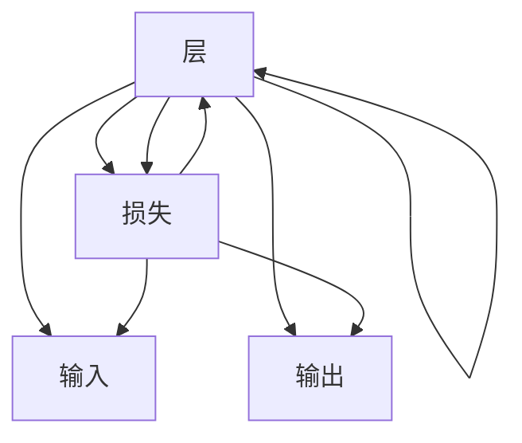

                 

# 神经网络：机器学习的新范式

> 关键词：神经网络,机器学习,深度学习,反向传播,梯度下降,激活函数,卷积神经网络,循环神经网络,深度学习框架,自动微分,优化器

## 1. 背景介绍

### 1.1 问题由来

在过去几十年里，机器学习(Machine Learning, ML)技术取得了飞速的发展，广泛应用于图像识别、自然语言处理、语音识别等多个领域。机器学习技术的成功离不开数学和算法基础，包括统计学、概率论、线性代数和优化理论等。然而，传统统计学习方法往往依赖手工特征工程，难以处理大规模非结构化数据。

与此同时，深度学习(Deep Learning, DL)技术的出现，打破了这一桎梏，通过模拟人脑的神经网络结构，直接从数据中学习特征，实现端到端的自动化模型训练。深度学习技术的成功应用，带动了人工智能(AI)的全面兴起，开辟了智能系统的新时代。

神经网络(Neural Networks, NNs)作为深度学习的核心模型，通过大量参数和非线性变换，从原始数据中挖掘高层次的抽象特征，为各种复杂的智能任务提供了解决方案。然而，神经网络的理论基础和实践技术仍然存在诸多未解之谜，对其深度和广度的研究已成为当前学术和工业界的重点。

本文旨在深入探讨神经网络的基本原理和算法细节，并结合实践案例，阐明神经网络在机器学习中的新范式作用，为从业者提供全面的技术参考。

## 2. 核心概念与联系

### 2.1 核心概念概述

神经网络是一类基于仿生学的计算模型，由大量简单的计算单元（神经元）相互连接而成，能够模拟人脑的信息处理过程。神经网络的每层节点（神经元）通过一系列权重参数将输入映射为输出，并通过激活函数实现非线性变换。

神经网络模型的核心思想是通过反向传播算法（Backpropagation），对模型参数进行优化，使得其输出误差最小化。反向传播算法基于梯度下降（Gradient Descent）等优化策略，通过链式法则计算各层参数的梯度，并逐层更新参数，实现误差最小化。

### 2.2 核心概念原理和架构的 Mermaid 流程图



该图表展示了神经网络的基本结构。输入通过各层神经元逐层映射为输出，最终与真实值计算损失，反向传播更新参数。

## 3. 核心算法原理 & 具体操作步骤

### 3.1 算法原理概述

神经网络通过反向传播算法学习参数，最小化输出与真实标签之间的误差。反向传播算法是一种基于梯度的优化算法，通过链式法则计算每层参数的梯度，并逐层反向更新参数。

具体步骤如下：

1. **前向传播（Forward Propagation）**：将输入数据逐层传递，通过权重和激活函数计算各层输出。
2. **计算损失（Loss Calculation）**：将网络输出与真实标签计算误差。
3. **反向传播（Backward Propagation）**：根据链式法则计算各层参数的梯度，并逐层反向传播梯度。
4. **参数更新（Parameter Update）**：通过梯度下降等优化算法，更新网络参数以最小化损失。

### 3.2 算法步骤详解

#### 3.2.1 前向传播（Forward Propagation）

前向传播是指将输入数据从输入层传递到输出层，逐层进行线性变换和非线性变换，得到最终的输出结果。具体步骤如下：

1. **输入层**：将原始数据作为输入层的输入。
2. **隐藏层**：每一层神经元通过加权和与激活函数计算输出。
3. **输出层**：最终输出为网络的预测结果。

以一个简单的全连接神经网络为例：

```
x = 输入层
h = 隐藏层
y = 输出层
```

其中，隐藏层的计算公式为：

$$ h = \sigma(Wx + b) $$

其中，$W$ 为权重矩阵，$b$ 为偏置向量，$\sigma$ 为激活函数。

#### 3.2.2 计算损失（Loss Calculation）

在得到网络的输出后，通过计算损失函数（Loss Function）来评估模型的性能。常用的损失函数包括均方误差（Mean Squared Error, MSE）、交叉熵（Cross-Entropy）等。以交叉熵损失为例，其计算公式为：

$$ \mathcal{L} = -\frac{1}{N}\sum_{i=1}^N \sum_{j=1}^C y_{i,j}\log(\hat{y}_{i,j}) + (1-y_{i,j})\log(1-\hat{y}_{i,j}) $$

其中，$y$ 为真实标签矩阵，$\hat{y}$ 为预测结果矩阵。

#### 3.2.3 反向传播（Backward Propagation）

反向传播算法通过链式法则计算各层参数的梯度，并逐层反向传播梯度，以更新网络参数。以交叉熵损失为例，其梯度计算公式为：

$$ \frac{\partial \mathcal{L}}{\partial z} = \frac{\partial \mathcal{L}}{\partial y} \frac{\partial y}{\partial z} = (y-\hat{y}) $$

其中，$z$ 为神经元的加权和，$y$ 为输出层的激活函数，$\frac{\partial y}{\partial z}$ 为激活函数的导数。

#### 3.2.4 参数更新（Parameter Update）

参数更新是反向传播算法的最后一步，通过梯度下降等优化算法，更新网络参数以最小化损失。以梯度下降法为例，其更新公式为：

$$ \theta = \theta - \eta \frac{\partial \mathcal{L}}{\partial \theta} $$

其中，$\theta$ 为网络参数，$\eta$ 为学习率，$\frac{\partial \mathcal{L}}{\partial \theta}$ 为损失函数对参数的梯度。

### 3.3 算法优缺点

神经网络的优点包括：

- **自动特征提取**：无需手工特征工程，可以直接从数据中学习特征。
- **端到端优化**：通过反向传播算法，可以自动优化网络参数，实现端到端学习。
- **非线性映射**：通过非线性激活函数，可以学习复杂的非线性映射关系。

神经网络的缺点包括：

- **参数过多**：神经网络通常具有大量参数，导致过拟合的风险较高。
- **计算复杂度高**：反向传播算法复杂度较高，训练和推理速度较慢。
- **模型可解释性差**：神经网络的黑箱性质，使得其决策过程难以解释和调试。

### 3.4 算法应用领域

神经网络已经在多个领域取得了广泛应用，以下是几个典型应用场景：

1. **图像识别**：通过卷积神经网络（Convolutional Neural Networks, CNNs），实现对图像的特征提取和分类。
2. **自然语言处理**：通过循环神经网络（Recurrent Neural Networks, RNNs）、长短期记忆网络（Long Short-Term Memory, LSTMs）等，实现文本分类、语言模型等任务。
3. **语音识别**：通过卷积神经网络、深度神经网络（Deep Neural Networks, DNNs）等，实现语音识别和语音生成。
4. **推荐系统**：通过协同过滤（Collaborative Filtering）、深度学习等，实现个性化推荐。
5. **自动驾驶**：通过卷积神经网络、深度神经网络等，实现环境感知和决策。

## 4. 数学模型和公式 & 详细讲解 & 举例说明

### 4.1 数学模型构建

神经网络的数学模型可以表示为：

$$ y = f(\theta, x) $$

其中，$y$ 为网络的输出，$x$ 为输入，$\theta$ 为网络参数。

对于分类任务，常用的输出函数为softmax函数：

$$ \hat{y} = \frac{e^{z}}{\sum_{k=1}^K e^{z_k}} $$

其中，$z = Wx + b$ 为神经元的加权和，$K$ 为分类数。

### 4.2 公式推导过程

以二分类任务为例，神经网络的损失函数为交叉熵损失：

$$ \mathcal{L} = -\frac{1}{N}\sum_{i=1}^N (y_i \log \hat{y_i} + (1-y_i) \log (1-\hat{y_i})) $$

其中，$y$ 为真实标签，$\hat{y}$ 为预测标签。

### 4.3 案例分析与讲解

以MNIST手写数字识别为例，展示神经网络的基本实现步骤：

1. **数据准备**：将MNIST数据集分为训练集和测试集，并进行数据预处理。
2. **网络搭建**：搭建一个包含两层全连接神经网络，其中一层为隐藏层，另一层为输出层。
3. **前向传播**：通过前向传播计算每个样本的输出。
4. **损失计算**：计算交叉熵损失。
5. **反向传播**：通过反向传播计算每个参数的梯度。
6. **参数更新**：通过梯度下降法更新参数。

以下是Python代码实现：

```python
import torch
import torch.nn as nn
import torch.optim as optim
from torchvision.datasets import MNIST
from torchvision.transforms import ToTensor
from torch.utils.data import DataLoader

# 定义神经网络模型
class Net(nn.Module):
    def __init__(self):
        super(Net, self).__init__()
        self.fc1 = nn.Linear(784, 128)
        self.fc2 = nn.Linear(128, 10)

    def forward(self, x):
        x = x.view(-1, 28*28)
        x = torch.relu(self.fc1(x))
        x = torch.relu(self.fc2(x))
        return x

# 加载数据集
train_dataset = MNIST(root='./data', train=True, transform=ToTensor(), download=True)
test_dataset = MNIST(root='./data', train=False, transform=ToTensor(), download=True)

# 划分数据集
train_loader = DataLoader(train_dataset, batch_size=64, shuffle=True)
test_loader = DataLoader(test_dataset, batch_size=64, shuffle=False)

# 定义模型和优化器
model = Net()
criterion = nn.CrossEntropyLoss()
optimizer = optim.SGD(model.parameters(), lr=0.01, momentum=0.9)

# 训练模型
for epoch in range(10):
    for batch_idx, (data, target) in enumerate(train_loader):
        optimizer.zero_grad()
        output = model(data)
        loss = criterion(output, target)
        loss.backward()
        optimizer.step()

# 测试模型
correct = 0
total = 0
with torch.no_grad():
    for data, target in test_loader:
        output = model(data)
        _, predicted = torch.max(output.data, 1)
        total += target.size(0)
        correct += (predicted == target).sum().item()

print('Accuracy: {:.2f}%'.format(100 * correct / total))
```

## 5. 项目实践：代码实例和详细解释说明

### 5.1 开发环境搭建

在开始项目实践前，需要安装Python和相关库。以下是基本环境搭建步骤：

1. 安装Anaconda：从官网下载并安装Anaconda。
2. 创建虚拟环境：
   ```bash
   conda create -n myenv python=3.8
   conda activate myenv
   ```
3. 安装相关库：
   ```bash
   conda install numpy pandas matplotlib
   ```

### 5.2 源代码详细实现

以一个简单的全连接神经网络为例，展示神经网络的实现步骤：

1. **定义模型结构**：
   ```python
   import torch.nn as nn
   import torch.optim as optim

   # 定义神经网络模型
   class Net(nn.Module):
       def __init__(self):
           super(Net, self).__init__()
           self.fc1 = nn.Linear(784, 128)
           self.fc2 = nn.Linear(128, 10)

       def forward(self, x):
           x = x.view(-1, 784)
           x = torch.relu(self.fc1(x))
           x = torch.relu(self.fc2(x))
           return x
   ```

2. **定义损失函数和优化器**：
   ```python
   # 定义交叉熵损失函数
   criterion = nn.CrossEntropyLoss()

   # 定义优化器
   optimizer = optim.SGD(model.parameters(), lr=0.01, momentum=0.9)
   ```

3. **训练模型**：
   ```python
   # 训练模型
   for epoch in range(10):
       for batch_idx, (data, target) in enumerate(train_loader):
           optimizer.zero_grad()
           output = model(data)
           loss = criterion(output, target)
           loss.backward()
           optimizer.step()
   ```

4. **测试模型**：
   ```python
   # 测试模型
   correct = 0
   total = 0
   with torch.no_grad():
       for data, target in test_loader:
           output = model(data)
           _, predicted = torch.max(output.data, 1)
           total += target.size(0)
           correct += (predicted == target).sum().item()

   print('Accuracy: {:.2f}%'.format(100 * correct / total))
   ```

### 5.3 代码解读与分析

以下是代码中关键部分的详细解读：

- **模型结构定义**：通过继承`nn.Module`类，定义神经网络模型。在`__init__`方法中定义各层神经元，并在`forward`方法中实现前向传播。
- **损失函数定义**：使用`nn.CrossEntropyLoss`定义交叉熵损失函数，适用于分类任务。
- **优化器定义**：使用`optim.SGD`定义随机梯度下降优化器，设置学习率和动量。
- **模型训练**：在训练循环中，使用`optimizer.zero_grad()`清空梯度，通过`loss.backward()`计算梯度，使用`optimizer.step()`更新参数。
- **模型测试**：在测试循环中，使用`torch.no_grad()`禁用梯度计算，统计预测结果与真实标签的匹配数。

## 6. 实际应用场景

### 6.1 图像识别

神经网络在图像识别领域取得了巨大成功，特别是卷积神经网络（CNNs）。以ImageNet识别为例，通过多层卷积和池化操作，从原始图像中提取高级特征，并通过全连接层进行分类。CNNs的成功，使得神经网络在计算机视觉领域得到了广泛应用。

### 6.2 自然语言处理

神经网络在自然语言处理（NLP）领域同样表现出色。通过循环神经网络（RNNs）和长短期记忆网络（LSTMs），可以实现文本分类、语言模型等任务。RNNs通过时序信息捕捉文本的上下文关系，而LSTMs通过门控机制解决了长期依赖问题。

### 6.3 语音识别

神经网络在语音识别领域也取得了重要进展，通过卷积神经网络（CNNs）和深度神经网络（DNNs），实现了对语音信号的特征提取和分类。通过端到端的训练，神经网络可以直接从原始语音信号中提取特征并转化为文本。

### 6.4 推荐系统

神经网络在推荐系统中也有广泛应用。通过协同过滤和深度学习，可以实现用户行为分析、商品推荐等任务。神经网络能够从用户行为和商品特征中学习到复杂的非线性关系，从而提供更加个性化的推荐服务。

## 7. 工具和资源推荐

### 7.1 学习资源推荐

1. **《深度学习》（Ian Goodfellow 著）**：经典教材，涵盖深度学习的基本概念和算法。
2. **《Python深度学习》（Francois Chollet 著）**：由Keras作者撰写，详细介绍了深度学习的实践技巧。
3. **CS231n《卷积神经网络》课程**：斯坦福大学开设的计算机视觉课程，讲解CNNs的理论和实践。
4. **Deep Learning Specialization by Andrew Ng**：由斯坦福大学教授Andrew Ng主讲，涵盖深度学习的多个模块。
5. **Transformers库文档**：HuggingFace开发的NLP工具库，提供丰富的预训练模型和微调样例。

### 7.2 开发工具推荐

1. **TensorFlow**：Google开发的深度学习框架，支持分布式计算，适用于大规模模型训练。
2. **PyTorch**：Facebook开发的深度学习框架，灵活易用，适用于科研和生产环境。
3. **Keras**：高层次的深度学习框架，提供了简单易用的API，适合快速原型开发。
4. **MXNet**：亚马逊开发的深度学习框架，支持多种编程语言，适用于异构硬件。
5. **TensorBoard**：TensorFlow配套的可视化工具，可以实时监测模型训练状态，提供丰富的图表呈现方式。

### 7.3 相关论文推荐

1. **ImageNet分类挑战（ILSVRC）**：神经网络在图像分类任务上的突破性进展。
2. **长短期记忆网络（LSTM）**：引入门控机制，解决了RNNs的长期依赖问题。
3. **深度神经网络（DNNs）**：通过多层神经元，实现复杂非线性映射。
4. **卷积神经网络（CNNs）**：通过卷积操作，捕捉图像的局部特征。
5. **Autoencoder（自编码器）**：通过编码器-解码器结构，实现数据的降维和重构。

## 8. 总结：未来发展趋势与挑战

### 8.1 研究成果总结

神经网络作为深度学习的核心模型，已经在多个领域取得了显著进展。从图像识别到自然语言处理，再到语音识别和推荐系统，神经网络展现出了强大的学习和适应能力。通过反向传播算法和梯度下降优化，神经网络能够自动学习复杂的特征表示，实现端到端的自动化学习。

### 8.2 未来发展趋势

1. **更深的神经网络**：随着硬件算力的提升和计算技术的进步，未来神经网络的深度将进一步增加，实现更复杂的特征提取和表示学习。
2. **更高效的算法**：研究更高效的优化算法和自动微分技术，加速神经网络的训练和推理。
3. **更广泛的应用**：神经网络将进一步拓展到更多领域，如医疗、金融、智能制造等，带来更多创新应用。
4. **更好的可解释性**：研究神经网络的可解释性，通过可视化、解释模型等手段，增强模型的透明度和可信度。
5. **更高的鲁棒性**：提高神经网络的鲁棒性和泛化能力，适应更广泛的数据分布和应用场景。

### 8.3 面临的挑战

神经网络在发展过程中仍面临诸多挑战：

1. **过拟合问题**：神经网络由于参数过多，容易过拟合。研究如何防止过拟合，提高模型的泛化能力，是未来的一个重要研究方向。
2. **计算资源消耗**：神经网络的训练和推理需要大量计算资源，如何在资源有限的情况下，优化神经网络的结构和参数，是另一个重要挑战。
3. **可解释性问题**：神经网络的复杂性使得其决策过程难以解释，研究如何提高模型的可解释性和可理解性，是提升用户信任度的关键。
4. **鲁棒性和泛化能力**：神经网络在对抗攻击和噪声环境下，鲁棒性和泛化能力不足，如何提高模型的鲁棒性和泛化能力，是未来需要重点突破的问题。

### 8.4 研究展望

1. **研究更高效的算法**：开发更高效的优化算法和自动微分技术，加速神经网络的训练和推理。
2. **研究更广泛的应用**：神经网络将进一步拓展到更多领域，如医疗、金融、智能制造等，带来更多创新应用。
3. **研究更好的可解释性**：研究神经网络的可解释性，通过可视化、解释模型等手段，增强模型的透明度和可信度。
4. **研究更深的神经网络**：随着硬件算力的提升和计算技术的进步，未来神经网络的深度将进一步增加，实现更复杂的特征提取和表示学习。

## 9. 附录：常见问题与解答

### 9.1 Q1：什么是神经网络？

A：神经网络是一种通过多层神经元模拟人脑信息处理过程的计算模型。它由输入层、隐藏层和输出层组成，通过前向传播和反向传播算法实现参数优化。

### 9.2 Q2：神经网络的缺点有哪些？

A：神经网络的缺点包括参数过多、计算复杂度高、模型可解释性差等。这些缺点限制了神经网络在大规模数据上的应用。

### 9.3 Q3：如何防止神经网络的过拟合？

A：防止过拟合的方法包括数据增强、正则化、Dropout等。这些方法可以提高神经网络的泛化能力，避免在训练集上过拟合。

### 9.4 Q4：什么是反向传播算法？

A：反向传播算法是一种基于梯度的优化算法，通过链式法则计算各层参数的梯度，并逐层反向传播梯度，以更新网络参数。

### 9.5 Q5：神经网络的未来发展方向有哪些？

A：神经网络的未来发展方向包括更深的神经网络、更高效的算法、更好的可解释性和更广泛的适用领域等。

---

作者：禅与计算机程序设计艺术 / Zen and the Art of Computer Programming

