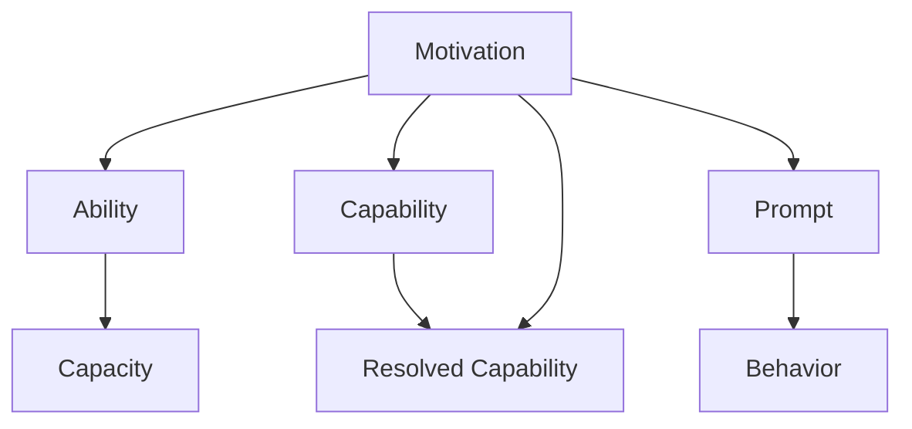

                 

# 福格行为模型:培养团队良好习惯的秘诀

> 关键词：行为科学, 习惯培养, 团队管理, 行为模型, 行为设计

## 1. 背景介绍

在现代企业的快速发展中，团队管理和个人习惯培养成为了决定公司效率和成果的关键因素。有效管理团队，提升员工绩效，培养良好习惯，是每个领导者和HR的日常挑战。福格行为模型（Fogg's Behavior Model）为解决这些问题提供了一个理论基础和实用工具。

福格行为模型是由斯坦福大学行为科学家布莱恩·福格（B. J. Fogg）提出的，旨在帮助人们理解和设计行为，特别是那些难以实现的行为。福格认为，只要让行为变得简单且令人愉悦，任何行为都可以被实现。这一模型已经在产品设计和习惯养成中得到了广泛应用，并逐渐成为一种指导团队管理和个人发展的有效方法。

## 2. 核心概念与联系

福格行为模型包含三个核心要素：动机（Motivation）、能力（Ability）和提示（Prompts），分别对应行为动机、行为执行能力和行为触发条件。这三种因素必须同时具备才能触发一个行为。模型的核心架构和流程可以通过以下Mermaid流程图来展示：



**动机**（Motivation）指的是一个人希望完成某件事的内心渴望或外部奖励。动机是行为的开始，且动机越强烈，行为越可能发生。

**能力**（Ability）指的是行为执行所需的技能和资源。能力越强，行为越容易发生。

**提示**（Prompt）指的是行为触发条件，如提醒、信号等。提示越明显，行为越容易被触发。

福格行为模型的关键在于行为设计，即通过合理设计和调整动机、能力和提示，使行为变得简单且愉悦，从而提高行为实现的效率和效果。

## 3. 核心算法原理 & 具体操作步骤

### 3.1 算法原理概述

福格行为模型是基于行为科学的理论框架，适用于任何习惯或行为的培养。其核心思想是通过改变行为发生的动机、能力和提示，来实现行为的持续和自动化。

一个行为的发生可以分为三个阶段：

1. **动机阶段**：决定是否要进行某个行为。
2. **能力阶段**：决定能否完成这个行为。
3. **提示阶段**：决定何时、何地以及如何完成这个行为。

这三个阶段需要同时满足，才能构成一个完整的行为。福格模型帮助人们在行为设计的每个阶段进行优化，提升行为实现的效率。

### 3.2 算法步骤详解

以下是使用福格行为模型进行行为设计的基本步骤：

**Step 1: 确定行为目标**

1. 明确具体、可衡量的行为目标，例如“每天早上6点起床”。

**Step 2: 分析动机因素**

1. 确定动机，即行为发生的内在渴望或外部奖励。例如，为了健康，早上运动。

**Step 3: 评估能力**

1. 评估行为执行所需的能力和资源。例如，早上起床需要具备闹钟和足够的睡眠。

**Step 4: 设计提示**

1. 设计提示，即行为触发条件。例如，将闹钟放在床边，确保醒来后可以立即执行行为。

**Step 5: 测试和调整**

1. 实施行为计划，并根据反馈进行调整。例如，如果起床困难，可以提前设定更多的提示（如两个闹钟）。

**Step 6: 持续优化**

1. 持续观察行为，并进行优化，确保行为能够持续进行。例如，逐渐调整闹钟时间，适应新的生物钟。

### 3.3 算法优缺点

福格行为模型的优点在于其简明易懂的理论框架和实用性强的方法论，适用于各种行为设计场景，包括个人习惯养成和团队管理。

其缺点在于模型过于简化，实际应用中可能需要根据具体情况进行调整，且对行为设计的深入理解需要一定的实践和经验。

### 3.4 算法应用领域

福格行为模型广泛应用于个人习惯养成、企业团队管理、产品设计等多个领域。具体应用包括：

- **个人习惯养成**：通过设计动机、能力和提示，帮助个人养成健康的饮食、运动等习惯。
- **企业团队管理**：通过合理设计行为触发条件，提升团队协作和绩效，如定时会议、跨部门协作等。
- **产品设计**：优化产品设计，提高用户粘性和互动率，如应用内的提醒、推送等。
- **市场营销**：设计有效的营销策略，提升用户参与度和转化率。

## 4. 数学模型和公式 & 详细讲解

虽然福格行为模型主要基于行为科学，并不涉及复杂的数学模型，但其理论框架和应用场景可以与数学方法相结合，进行更深入的分析。

以下通过数学语言简要分析福格行为模型：

设行为发生的动机为 $M$，执行能力为 $A$，提示为 $P$。则行为发生的概率 $P$ 可以表示为：

$$
P = \frac{M \times A \times P}{1 + M \times A \times P}
$$

这个公式展示了行为发生的可能性，取决于动机、能力和提示的乘积。为了使行为发生概率最大化，福格行为模型建议在设计过程中，重点关注如何增强动机、提升能力和优化提示。

## 5. 项目实践：代码实例和详细解释说明

福格行为模型主要适用于理论和实践结合，其应用场景通常不需要具体的代码实现。以下通过一个简单的团队会议管理实例，展示如何使用福格行为模型进行行为设计。

**项目背景**：
某公司团队希望每周按时召开会议，但成员普遍难以坚持。

**需求分析**：
1. 动机：团队成员希望通过会议提升协作效率，达成共识。
2. 能力：时间安排、技术工具等。
3. 提示：会议时间、地点和方式。

**行为设计**：
1. **动机**：明确会议的价值和必要性，将会议视为团队沟通和协作的重要环节。
2. **能力**：确保会议安排在合理的时间段，选择适合的视频会议工具，提前通知所有成员。
3. **提示**：设置每周固定的时间（例如每周二上午10点），发送会议邀请，提前一天提醒成员准备议题。

**代码实例**：
由于福格行为模型主要应用于行为设计和优化，不需要具体的代码实现。以下是一个简单的伪代码示例，展示如何在项目管理工具中使用福格行为模型：

```python
def set_up_meeting(motivation, ability, prompt):
    """
    设定团队会议，根据动机、能力和提示进行优化。
    :param motivation: 动机
    :param ability: 能力
    :param prompt: 提示
    """
    # 确定会议时间、地点和方式
    schedule = set_meeting_time(motivation, ability, prompt)
    location = set_meeting_location(motivation, ability, prompt)
    tools = set_meeting_tools(motivation, ability, prompt)
    
    # 发送会议邀请和提醒
    send_meeting_invite(schedule, location, tools)
    send_reminder(schedule, location, tools)
    
def set_meeting_time(motivation, ability, prompt):
    """
    根据动机、能力和提示，确定会议时间
    """
    # 逻辑实现
    # ...
    return time
    
def set_meeting_location(motivation, ability, prompt):
    """
    根据动机、能力和提示，确定会议地点
    """
    # 逻辑实现
    # ...
    return location
    
def set_meeting_tools(motivation, ability, prompt):
    """
    根据动机、能力和提示，确定会议工具
    """
    # 逻辑实现
    # ...
    return tools
    
def send_meeting_invite(time, location, tools):
    """
    发送会议邀请
    """
    # 逻辑实现
    # ...
    
def send_reminder(time, location, tools):
    """
    发送会议提醒
    """
    # 逻辑实现
    # ...
```

**代码解读与分析**：
由于福格行为模型主要应用于行为设计，其具体的代码实现依赖于项目管理工具和团队管理流程。上述伪代码展示了如何在项目管理工具中使用福格行为模型进行会议管理的实现。

在实际应用中，可以根据具体情况进行调整，例如通过集成自动化的提醒和邀请功能，进一步提高会议管理的效率。

**运行结果展示**：
由于福格行为模型主要应用于行为设计和优化，具体的运行结果取决于具体的行为设计和执行情况。在团队会议管理中，成功的行为设计应能够显著提升会议的按时率和参与度，提升团队协作效率。

## 6. 实际应用场景

福格行为模型已经在多个领域得到了广泛应用，以下是几个典型的应用场景：

**1. 个人习惯养成**

通过福格行为模型，个人可以设计出有效的习惯养成计划。例如，为了养成每天早上跑步的习惯，可以设定动机（健康）、能力和提示（闹钟、跑步路线），逐步调整和优化行为。

**2. 企业团队管理**

福格行为模型可以帮助企业优化团队协作和绩效管理。例如，通过设定定期团队会议的动机、能力和提示，提升团队成员的参与度和效率。

**3. 产品设计**

在产品设计中，福格行为模型可以优化用户体验，提高用户粘性和互动率。例如，通过设计吸引用户的提示和奖励，提升产品的功能和应用率。

## 7. 工具和资源推荐

福格行为模型的应用主要依赖于理论和实践结合，以下是一些推荐的工具和资源，帮助理解、应用和优化福格行为模型：

### 7.1 学习资源推荐

1. **《行为设计革命：打造简单愉悦行为》**：布莱恩·福格（B. J. Fogg）所著，详细介绍了行为科学和行为设计的原理和实践。
2. **《影响力》**：罗伯特·西奥迪尼（Robert Cialdini）所著，研究了影响人们行为的心理因素。
3. **Coursera课程：行为设计基础**：斯坦福大学开设的课程，通过实际案例讲解行为设计的理论和方法。
4. **Fogg Institute**：布莱恩·福格（B. J. Fogg）创办的机构，提供行为设计培训和咨询。

### 7.2 开发工具推荐

1. **项目管理工具**：如Trello、Asana、JIRA等，帮助团队进行任务管理和行为优化。
2. **提醒和通知工具**：如Google Calendar、Slack等，帮助设定和提醒行为。
3. **数据分析工具**：如Tableau、Power BI等，帮助跟踪和分析行为效果。

### 7.3 相关论文推荐

1. **《简化行为》**：B. J. Fogg，详细介绍了福格行为模型的理论和应用。
2. **《心理账户：人们在金钱、时间和情感上的非理性行为》**：Thaler & Sunstein，研究了行为经济学在行为设计中的应用。

## 8. 总结：未来发展趋势与挑战

### 8.1 研究成果总结

福格行为模型作为一种行为设计理论，已经广泛应用于个人习惯养成、企业团队管理和产品设计等多个领域。其核心思想是通过设计动机、能力和提示，使行为变得简单且愉悦，从而提升行为实现的效率和效果。

### 8.2 未来发展趋势

1. **跨领域应用**：福格行为模型将逐步应用于更多领域，如教育、健康、金融等，帮助人们优化行为和习惯。
2. **技术融合**：随着人工智能、大数据等技术的进步，福格行为模型将与这些技术相结合，实现更加智能和个性化的行为设计。
3. **伦理和社会责任**：随着行为设计的广泛应用，如何平衡个人自由与社会责任、技术应用与伦理道德，将成为重要的研究方向。

### 8.3 面临的挑战

1. **行为设计复杂性**：福格行为模型需要深入理解动机、能力和提示，对于复杂行为设计，仍需更多实践和优化。
2. **行为效果的持续性**：如何确保行为设计的长期效果，避免行为疲劳和反弹，仍需深入研究。
3. **跨文化适应性**：不同文化和背景下的行为设计可能存在差异，如何实现跨文化的有效应用，仍需探索。

### 8.4 研究展望

未来，福格行为模型将在以下几个方面寻求新的突破：

1. **多层次行为设计**：将行为设计从简单的动机、能力和提示，扩展到多层次的行为设计框架，如动机分析、能力评估、提示设计等。
2. **数据驱动的行为优化**：结合大数据和机器学习技术，实现动态优化和个性化行为设计。
3. **行为设计的伦理和责任**：探索行为设计的伦理和社会责任，确保技术应用的正向价值。

福格行为模型作为一种行为设计理论，为团队管理和个人发展提供了强有力的工具。未来，随着行为科学的不断发展和技术的进步，福格行为模型将不断完善和扩展，为人们的生活和工作中带来更多便捷和效率。

---

作者：禅与计算机程序设计艺术 / Zen and the Art of Computer Programming

