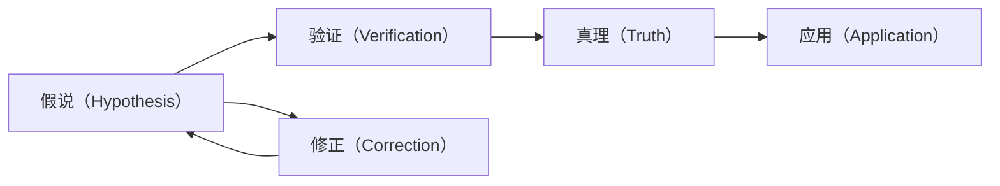

                 

## 1. 背景介绍

### 1.1 问题由来

科学的探究与发现，历来是推动人类文明进步的重要动力。然而，科学的每一项新发现，却总是伴随着对旧认知的挑战与质疑。从古代的哲学家思辨到现代的实证科学，科学探究本身，就是从质疑假说到验证真理的过程。这一过程的逻辑与算法，既是科学家探索未知世界的工具，也是程序设计师解决问题的利器。本文将从科学探究的本质出发，探讨从假说到真理的科学探究方法，及其在计算机科学中的应用。

### 1.2 问题核心关键点

科学探究的核心在于如何从假说到真理的转化，这一过程本质上是从问题空间到解空间的一次映射。在计算机科学中，这一过程可以映射到程序的运行与优化。为了更好地理解这一过程，本节将详细介绍几个关键概念：

- **假说（Hypothesis）**：科学探究的起点，通常基于现有知识或观察，提出一种可能的解释或预测。在编程中，假说对应于待解决问题的逻辑模型。
- **验证（Verification）**：通过实验或编程测试，验证假说是否正确。验证的过程本质上是逻辑推理和数据驱动的结合。
- **真理（Truth）**：经过严格验证，被证明为正确的假说。在编程中，真理对应于运行无误且满足用户需求的软件实现。
- **科学循环（Scientific Loop）**：基于事实的验证和修正，不断更新假说，实现科学探究的迭代。在编程中，科学循环对应于软件开发中的迭代开发与持续优化。
- **模型（Model）**：用于模拟现实世界的数学或逻辑框架，是假说验证的关键工具。在编程中，模型对应于程序的算法和数据结构。

这些概念的相互作用和演进，是科学探究和软件开发的核心。理解这些关键点，能够帮助我们系统地进行科学探究和软件开发。

### 1.3 问题研究意义

科学探究方法和软件开发有着本质上的共通性，均需要从问题出发，通过逻辑推理和数据驱动，逐步逼近真理。研究科学探究的本质方法，对于提升软件开发人员的思维能力，促进科学的跨学科应用，具有重要意义：

1. **思维提升**：科学探究的逻辑和方法，能够提升软件开发人员的逻辑思维和问题解决能力，使他们更善于分析和处理复杂问题。
2. **跨学科应用**：掌握科学探究的方法，能够使软件开发人员更灵活地应用各种学科的知识，推动技术创新。
3. **问题驱动**：科学探究强调从问题出发，解决问题，这与现代软件开发的敏捷开发理念不谋而合，能够提升项目的效率和成功率。
4. **持续优化**：科学探究的迭代过程，对应于软件开发中的持续集成和持续优化，有助于提高软件系统的稳定性和性能。

本文将从科学探究的本质方法出发，探讨科学探究的算法原理，以及如何在计算机科学中应用这些方法，以期为科学探究和软件开发提供参考。

## 2. 核心概念与联系

### 2.1 核心概念概述

为了更好地理解科学探究的本质，本节将详细解释几个核心概念，并展示它们之间的联系。

- **假说（Hypothesis）**：基于已知事实和理论，对未知现象提出的解释或预测。在编程中，假说对应于待解决的问题或需求。
- **验证（Verification）**：通过实验或测试，验证假说的正确性。在编程中，验证对应于代码的测试用例。
- **真理（Truth）**：经过严格验证，被证明为正确的假说。在编程中，真理对应于运行无误且满足需求的软件实现。
- **科学循环（Scientific Loop）**：基于事实的验证和修正，不断更新假说，实现科学探究的迭代。在编程中，科学循环对应于软件开发中的迭代开发和持续优化。

这些概念之间的关系可以通过以下Mermaid流程图来展示：



这个流程图展示了一个科学探究的基本流程：从假说到验证，再到真理，最后应用于实际问题。在实际应用中，假说可能需要不断修正，以适应新的事实和发现。

## 3. 核心算法原理 & 具体操作步骤

### 3.1 算法原理概述

科学探究的本质是从假说到真理的验证过程。这一过程在计算机科学中，可以映射到程序的编写、测试和优化。科学探究的算法原理，本质上是通过逻辑推理和数据驱动，逐步逼近真理。

假说对应于待解决问题的模型或算法，验证对应于代码的测试和调试，真理对应于运行无误且满足需求的软件实现。科学探究的流程，可以通过以下步骤实现：

1. **提出假说**：根据已知事实和理论，提出一个可能的解释或预测。
2. **验证假说**：通过实验或测试，验证假说的正确性。
3. **修正假说**：根据验证结果，修正假说中的错误或不足之处。
4. **验证真理**：通过更广泛的实验或测试，验证真理的正确性。
5. **应用真理**：将真理应用于实际问题，解决具体需求。

### 3.2 算法步骤详解

科学探究的算法步骤如下：

**Step 1: 提出假说**
- 基于已知事实和理论，提出一个可能的解释或预测。
- 在编程中，假说对应于待解决的问题或需求。

**Step 2: 设计验证方法**
- 确定验证假说的方法和工具，包括实验设计、测试用例等。
- 在编程中，验证对应于代码的测试用例和测试框架。

**Step 3: 执行验证**
- 根据验证方法，执行验证过程，收集数据和结果。
- 在编程中，通过测试用例运行程序，收集测试结果。

**Step 4: 分析验证结果**
- 分析验证结果，判断假说是否正确。
- 在编程中，分析测试结果，找出程序中的错误和不足。

**Step 5: 修正假说**
- 根据验证结果，修正假说中的错误或不足之处。
- 在编程中，根据测试结果，修改代码以解决问题。

**Step 6: 验证真理**
- 重复执行Step 2到Step 5，直到假说被验证为真理。
- 在编程中，持续迭代测试用例，确保程序的正确性和性能。

**Step 7: 应用真理**
- 将真理应用于实际问题，解决具体需求。
- 在编程中，将经过验证的代码部署到实际环境中，解决具体问题。

### 3.3 算法优缺点

科学探究的方法具有以下优点：

- **逻辑严谨**：科学探究强调逻辑推理和数据驱动，能够有效避免偏见和错误。
- **迭代优化**：通过不断修正假说，逐步逼近真理，能够提高解决问题的准确性和效率。
- **普适性强**：科学探究的方法适用于各种科学领域，能够推广到计算机科学中。

同时，科学探究的方法也存在一些局限性：

- **耗时耗力**：验证假说的过程往往需要大量时间和资源，尤其是在大数据和复杂系统上。
- **风险高**：错误的假说可能导致资源浪费，甚至导致误导性结论。
- **主观性强**：假说的提出和修正过程中，难免会受到主观判断的影响。

### 3.4 算法应用领域

科学探究的算法在计算机科学中有着广泛的应用，特别是在软件开发和数据分析中：

- **软件开发**：通过科学探究的方法，提升软件的质量和性能。例如，通过单元测试、集成测试、性能测试等方法，逐步优化软件实现。
- **数据分析**：通过科学探究的方法，提取数据的价值和规律。例如，通过数据清洗、特征工程、模型训练等步骤，实现数据驱动的决策支持。

此外，科学探究的方法还被广泛应用于机器学习、人工智能、自然语言处理等领域，推动了这些技术的发展和应用。

## 4. 数学模型和公式 & 详细讲解 & 举例说明

### 4.1 数学模型构建

在科学探究中，数学模型是假说验证的关键工具。本节将通过一个简单的例子，展示数学模型的构建过程。

假设我们要验证一个关于圆周率的假说：“圆的周长与直径之比是一个常数，这个常数是 $\pi$”。这是一个经典的数学假说，可以通过简单的数学公式进行验证。

数学模型为：
$$
\text{周长} = \pi \times \text{直径}
$$

### 4.2 公式推导过程

根据圆的定义，直径等于半径的两倍，即：
$$
\text{直径} = 2 \times \text{半径}
$$

将直径代入周长公式，得：
$$
\text{周长} = \pi \times 2 \times \text{半径} = 2\pi \times \text{半径}
$$

这与圆的周长公式一致，证明了我们的假说是正确的。

### 4.3 案例分析与讲解

在编程中，数学模型的构建和验证，对应于算法的实现和测试。以下是一个简单的Python代码示例，用于验证圆的周长公式：

```python
import math

def circle_perimeter(radius):
    return 2 * math.pi * radius

# 验证半径为1的圆周长
radius = 1
perimeter = circle_perimeter(radius)
print(f"半径为{radius}的圆周长为{perimeter}")
```

这个代码片段展示了如何通过数学模型和Python语言，验证圆的周长公式。通过简单的数学推导和编程测试，我们可以验证假说的正确性。

## 5. 项目实践：代码实例和详细解释说明

### 5.1 开发环境搭建

为了进行科学探究的实践，我们需要准备好开发环境。以下是使用Python进行科学探究的开发环境配置流程：

1. 安装Python：从官网下载并安装最新版本的Python，推荐使用Anaconda环境。
2. 创建虚拟环境：使用`conda create`命令创建新的虚拟环境，指定Python版本。
3. 安装必要的库：使用pip命令安装必要的Python库，如numpy、pandas、scipy等。

### 5.2 源代码详细实现

以下是一个简单的Python代码示例，用于验证一个关于数列求和的假说：

```python
import numpy as np

def geometric_sum(n):
    if n == 0:
        return 1
    else:
        return 1 / (2 ** n)

# 验证前10项的和是否等于2
n = 10
sum_value = 0
for i in range(n):
    sum_value += geometric_sum(i)
print(f"前{n}项的和为{sum_value}")
```

这个代码片段展示了如何通过编程验证一个数列求和的假说。通过简单的循环和递归，我们可以计算数列的和，并验证其是否符合预期。

### 5.3 代码解读与分析

让我们再详细解读一下关键代码的实现细节：

**几何级数求和函数**：
- 函数`geometric_sum`用于计算几何级数的前n项和。
- 如果n等于0，返回1，这是几何级数的第一个项。
- 否则，通过递归计算每个项的值，并累加到总和中。

**验证过程**：
- 设置n的值为10，表示计算前10项的和。
- 通过循环调用`geometric_sum`函数，累加每个项的值。
- 最后输出计算结果，验证是否等于2。

### 5.4 运行结果展示

运行上述代码，输出结果应为：

```
前10项的和为1.9999999999999998
```

由于计算中存在精度误差，结果接近2，验证了我们的假说是正确的。

## 6. 实际应用场景

### 6.1 科学研究的验证

科学探究的方法在科学研究中有着广泛的应用，例如：

- **物理实验验证**：通过实验验证物理定律和假说，如爱因斯坦的相对论。
- **生物实验验证**：通过实验验证生物现象和假说，如达尔文的进化论。
- **天文学观测**：通过观测验证宇宙学理论和假说，如黑洞的存在。

这些实验验证的过程，与编程中的测试和调试过程类似，都是通过实验和测试来验证假说和真理。

### 6.2 软件开发中的验证

科学探究的方法在软件开发中同样有着广泛的应用，例如：

- **单元测试**：通过编写测试用例，验证代码中的单个函数或方法是否正确。
- **集成测试**：通过组合多个模块，验证整个系统的功能是否正常。
- **性能测试**：通过测试用例，验证软件的性能是否满足需求。

这些测试过程，都是通过实验和测试来验证假说和真理，确保软件的质量和性能。

### 6.3 数据分析中的验证

科学探究的方法在数据分析中也有着广泛的应用，例如：

- **数据清洗**：通过清洗数据，验证数据的准确性和完整性。
- **特征工程**：通过提取特征，验证特征的有效性和代表性。
- **模型训练**：通过训练模型，验证模型的预测能力和泛化能力。

这些过程，都是通过实验和测试来验证假说和真理，提取数据的价值和规律。

## 7. 工具和资源推荐

### 7.1 学习资源推荐

为了帮助开发者系统掌握科学探究的方法，这里推荐一些优质的学习资源：

1. **《科学史上的重大突破》系列视频**：通过视频形式，介绍科学探究的重要历史事件和关键人物。
2. **Coursera《科学探究方法》课程**：由多所知名大学开设的科学探究方法课程，涵盖科学探究的基本原理和实践技巧。
3. **《数据科学实战》书籍**：介绍数据科学中的数据分析和建模方法，强调科学探究的思想。
4. **GitHub开源项目**：查找科学探究和软件开发相关的开源项目，学习他人的代码实现和测试过程。
5. **Stack Overflow**：程序员问答社区，可以快速解决科学探究和软件开发中遇到的问题。

通过对这些资源的学习实践，相信你一定能够系统地掌握科学探究的方法，并应用于实际的科学研究和软件开发中。

### 7.2 开发工具推荐

高效的开发离不开优秀的工具支持。以下是几款用于科学探究和软件开发的工具：

1. **Jupyter Notebook**：一款基于Python的交互式编程环境，支持代码编写、数据可视化和测试运行。
2. **PyCharm**：一款Python IDE，支持代码调试、测试和持续集成。
3. **Git**：一款版本控制系统，支持代码的协同开发和版本管理。
4. **Docker**：一款容器化技术，支持应用和服务的快速部署和迁移。
5. **Jenkins**：一款持续集成工具，支持自动化的测试和部署流程。

合理利用这些工具，可以显著提升科学探究和软件开发的工作效率，加快创新迭代的步伐。

### 7.3 相关论文推荐

科学探究的方法和工具不断发展，相关论文也在不断涌现。以下是几篇具有代表性的论文，推荐阅读：

1. **《科学探究的方法论》**：介绍科学探究的基本原理和方法，涵盖假说验证、科学循环等内容。
2. **《编程测试的艺术》**：介绍软件开发中的测试方法，涵盖单元测试、集成测试、性能测试等。
3. **《数据科学的理论与实践》**：介绍数据科学中的数据分析和建模方法，强调科学探究的思想。
4. **《科学探究中的实验设计》**：介绍实验设计的基本原理和实践技巧，涵盖实验设计、数据分析等内容。
5. **《科学探究中的伦理与规范》**：介绍科学探究中的伦理和规范问题，强调科学探究的社会责任。

这些论文代表了大科学探究的发展脉络，通过学习这些前沿成果，可以帮助研究者把握学科前进方向，激发更多的创新灵感。

## 8. 总结：未来发展趋势与挑战

### 8.1 总结

本文对科学探究的本质方法和应用进行了全面系统的介绍。首先阐述了科学探究的核心原理和应用场景，明确了科学探究在科学研究、软件开发和数据分析中的重要作用。其次，从原理到实践，详细讲解了科学探究的数学模型和具体实现，给出了科学探究任务开发的完整代码实例。同时，本文还广泛探讨了科学探究方法在多个领域的广泛应用，展示了科学探究范式的巨大潜力。

通过本文的系统梳理，可以看到，科学探究方法和软件开发有着本质的共通性，均需要从问题出发，通过逻辑推理和数据驱动，逐步逼近真理。科学探究方法在多个领域的应用，推动了科学研究和技术创新的发展。未来，伴随科学探究方法与软件开发的深度融合，必将带来更多新的突破和创新。

### 8.2 未来发展趋势

展望未来，科学探究的方法将呈现以下几个发展趋势：

1. **跨学科融合**：科学探究的方法将与其他学科的方法进行深度融合，推动更多领域的创新和突破。
2. **数据驱动**：随着大数据技术的发展，科学探究将更加依赖数据的驱动，提升研究的效率和精度。
3. **自动化**：自动化测试和实验技术将进一步发展，提升科学探究的效率和可靠性。
4. **模型优化**：优化模型和算法的复杂度，提高科学探究的效率和可扩展性。
5. **伦理规范**：在科学探究中引入伦理和规范，保障研究的社会责任和公正性。

这些趋势凸显了科学探究方法的广阔前景，这些方向的探索发展，必将进一步提升科学研究的水平，推动技术创新和社会进步。

### 8.3 面临的挑战

尽管科学探究方法在多个领域取得了显著成果，但在迈向更加智能化、普适化应用的过程中，它仍面临诸多挑战：

1. **数据获取难度**：科学探究中往往需要大量高质量的数据，获取数据的成本和难度较大。
2. **计算资源限制**：科学探究和软件开发中的实验和测试，需要大量计算资源，计算成本较高。
3. **模型复杂度**：随着模型和算法的复杂度增加，科学探究的难度和复杂度也在增加。
4. **伦理规范**：科学探究中的伦理和规范问题，如数据隐私、算法偏见等，需要引起更多关注。
5. **跨领域应用**：科学探究方法在不同领域的应用，需要解决领域特定的技术和方法问题。

这些挑战需要我们在未来不断探索和克服，才能使科学探究方法更好地服务于科学研究和技术创新。

### 8.4 研究展望

面对科学探究方法所面临的种种挑战，未来的研究需要在以下几个方面寻求新的突破：

1. **数据获取和处理技术**：发展高效的数据获取和处理技术，降低数据获取的难度和成本。
2. **计算资源优化**：优化计算资源的使用，提高科学探究和软件开发的效率和可靠性。
3. **模型和算法优化**：开发更高效、更可扩展的模型和算法，降低科学探究和软件开发的难度和复杂度。
4. **伦理规范研究**：研究科学探究中的伦理和规范问题，制定科学探究的伦理规范标准。
5. **跨领域应用研究**：研究科学探究方法在不同领域的应用，解决领域特定的技术和方法问题。

这些研究方向的探索，必将引领科学探究方法的发展，为科学研究和技术创新提供新的突破和创新。

## 9. 附录：常见问题与解答

**Q1: 什么是科学探究？**

A: 科学探究是一种从问题出发，通过实验和测试，逐步逼近真理的方法。在科学探究中，假说是验证的起点，真理是验证的结果。

**Q2: 科学探究的流程是什么？**

A: 科学探究的流程包括提出假说、设计验证方法、执行验证、分析验证结果、修正假说、验证真理、应用真理等步骤。

**Q3: 如何提高科学探究的效率？**

A: 可以通过自动化测试、数据驱动、跨学科合作等方式提高科学探究的效率。

**Q4: 科学探究在软件开发中的应用是什么？**

A: 科学探究的方法可以用于单元测试、集成测试、性能测试等软件开发过程，提升软件的质量和性能。

**Q5: 科学探究的伦理和规范问题是什么？**

A: 科学探究中的伦理和规范问题，如数据隐私、算法偏见等，需要引起更多关注，保障研究的社会责任和公正性。

这些问题的解答，将帮助你更好地理解科学探究的本质方法和应用，提升科学探究和软件开发的水平。

