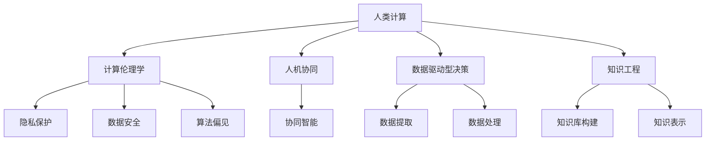

                 

# 科技与人文的交汇：人类计算的独特价值

## 1. 背景介绍

### 1.1 问题由来
在信息技术迅猛发展的今天，我们已逐渐步入数字化时代。计算机科学作为一种强大的科技手段，极大地推动了社会进步和经济发展，覆盖了从工业制造、金融服务到医疗健康、教育培训等各个领域。然而，技术的进步并不仅仅是为了提升效率，更是为了拓展人类能力的边界，赋予人们新的可能性。科技与人文的交汇，正在塑造一个全新的未来。

人类计算作为信息时代的核心概念，不仅关注技术和算法的进步，还强调在开发应用过程中融入人文关怀，思考科技与社会的互动关系。它超越了简单的技术层面，涉及哲学、伦理学、心理学等多元学科，追求技术、社会、文化三者的有机结合。

### 1.2 问题核心关键点
- **人类计算**：涉及科技与人的关系，强调在开发过程中尊重人的情感、认知和价值观，以实现技术与社会的和谐发展。
- **人文计算**：通过计算技术研究人的行为、心理、情感等，实现对人性的深入理解，推动人文社会科学的发展。
- **科技伦理**：关注技术发展带来的社会伦理问题，如隐私保护、数据安全、算法偏见等，强调技术的伦理责任。
- **人工智能**：利用计算技术，赋予机器类似人类的智能和理解力，实现人机协同，提高生产效率和创新能力。
- **数据科学**：通过对海量数据的处理和分析，提取有价值的信息，服务于决策和创新。

这些核心关键点构成了人类计算的独特价值，展现了其跨学科、跨领域的广度和深度。通过理解这些概念，可以更好地把握人类计算的精髓，探索科技与社会的互动模式。

## 2. 核心概念与联系

### 2.1 核心概念概述

为了更好地理解人类计算的独特价值，本节将介绍几个紧密相关的核心概念：

- **人类计算(Human-Computer Interaction, HCI)**：研究如何通过计算技术改善人机交互，提升用户体验。关注人机交互的心理学、认知学、工程学等多学科交叉。

- **计算伦理学(Computational Ethics)**：探讨计算技术在开发和应用过程中可能带来的伦理问题，如隐私保护、数据安全、算法偏见等，强调科技伦理的重要性。

- **人机协同(Human-AI Collaboration)**：通过人工智能技术，增强人类智能，实现人与机器的协同工作，提高效率和创造力。

- **数据驱动型决策(Data-Driven Decision Making)**：利用数据科学方法，从大量数据中提取规律和洞见，辅助决策过程，优化管理和服务。

- **知识工程(Knowledge Engineering)**：通过计算技术，提取和组织人类知识，形成知识库，辅助决策和创新。

这些概念相互交织，共同构成了人类计算的基石。通过理解这些核心概念，我们可以更加全面地把握人类计算的独特价值。

### 2.2 核心概念原理和架构的 Mermaid 流程图



该流程图展示了人类计算的核心概念及其相互联系。人类计算不仅关注技术层面，还强调在开发和应用过程中融入伦理、协作、决策和知识工程等多个维度，追求技术、社会、文化的有机统一。

## 3. 核心算法原理 & 具体操作步骤
### 3.1 算法原理概述

人类计算的核心算法原理可以归纳为以下几个方面：

- **人机交互设计**：通过优化用户界面(UI)和用户体验(UX)设计，提升人机交互效率和满意度。

- **协同算法**：开发协同算法，如协同过滤、协同学习等，实现人与人、人与机器之间的智能交互。

- **数据驱动决策模型**：建立数据驱动的决策模型，如分类、回归、聚类等，利用大数据分析辅助决策过程。

- **知识工程算法**：运用知识工程算法，如自然语言处理(NLP)、知识表示(KG)等，构建知识库和知识图谱，实现对人类知识的理解和应用。

- **算法伦理考量**：在算法开发和应用过程中，注重伦理考量，如隐私保护、数据安全、算法偏见等。

### 3.2 算法步骤详解

人类计算的核心算法步骤如下：

1. **需求分析**：确定具体应用场景和目标，收集用户需求。
2. **数据收集与预处理**：收集相关数据，并进行数据清洗、特征提取等预处理。
3. **算法设计**：选择合适的算法，并根据需求进行优化设计。
4. **模型训练与评估**：使用训练集训练模型，并在验证集上评估性能。
5. **模型部署与应用**：将训练好的模型部署到实际应用场景，进行功能测试和用户体验反馈。
6. **持续迭代与优化**：根据反馈数据，持续优化算法和模型，提升用户体验。

### 3.3 算法优缺点

人类计算的核心算法具有以下优点：

- **跨学科融合**：融合心理学、社会学、计算机科学等多个学科，实现技术与人文的深度融合。
- **用户体验优化**：通过优化人机交互设计，提升用户体验和满意度。
- **数据驱动决策**：利用数据驱动的决策模型，提高决策的科学性和准确性。
- **知识工程应用**：构建知识库和知识图谱，实现对人类知识的系统化理解和应用。

同时，该算法也存在一些局限性：

- **数据依赖性强**：依赖高质量的数据集，数据采集和清洗成本较高。
- **算法复杂度高**：部分算法如协同学习、知识表示等，模型复杂度高，需要较强的计算资源。
- **伦理问题敏感**：在数据隐私、算法偏见等方面，需要谨慎处理，避免伦理风险。
- **用户体验差异大**：不同用户群体的需求差异大，个性化设计难度高。

尽管存在这些局限性，但总体而言，人类计算的核心算法在提升用户体验、优化决策过程、应用知识工程等方面，具有显著的独特价值。

### 3.4 算法应用领域

人类计算的核心算法广泛应用于以下领域：

- **智能界面设计**：开发智能界面，如语音识别、自然语言处理等，提升用户交互效率。
- **协同推荐系统**：通过协同算法，实现个性化推荐，提升用户体验。
- **数据分析与决策支持**：建立数据驱动的决策模型，辅助企业决策，优化管理和服务。
- **知识管理与分享**：运用知识工程算法，构建知识库和知识图谱，推动知识共享和创新。
- **医疗健康**：开发智能医疗系统，提升疾病诊断和治疗效果。
- **教育培训**：利用智能教学系统，提升教育质量和效率。
- **城市管理**：建立智能城市管理系统，提升城市运行效率和居民生活质量。

以上领域展示了人类计算的核心算法在实际应用中的广泛价值，为各行各业带来了深刻的变革和创新。

## 4. 数学模型和公式 & 详细讲解 & 举例说明

### 4.1 数学模型构建

人类计算的核心算法通常需要构建数学模型，用于描述问题、优化计算过程和评估性能。以下是一个基于协同过滤算法的推荐系统数学模型：

假设用户集合为 $U$，物品集合为 $I$，用户对物品的评分矩阵为 $R_{U \times I}$，其中 $r_{ui}$ 表示用户 $u$ 对物品 $i$ 的评分。协同过滤算法的目标是推荐物品给用户 $u$，使得 $r_{ui}$ 最大化。

构建协同过滤算法常用的数学模型包括：

- 用户-物品矩阵分解模型：$R \approx X \times Y$，其中 $X \in \mathbb{R}^{U \times K}$ 为用户向量，$Y \in \mathbb{R}^{I \times K}$ 为物品向量，$K$ 为向量维度。

- 矩阵分解损失函数：最小化预测评分与实际评分的误差，即 $\min_{X,Y} \|R-X \times Y\|_F^2$，其中 $\|A\|_F$ 表示矩阵 $A$ 的 Frobenius 范数。

- 在线学习算法：如基于梯度的在线随机梯度下降(Online SGD)，用于迭代更新用户和物品向量，以适应新数据。

### 4.2 公式推导过程

协同过滤算法的数学模型推导过程如下：

1. 定义协同过滤算法的目标函数：
$$
\min_{X,Y} \|R-X \times Y\|_F^2 = \min_{X,Y} \sum_{u,i} (r_{ui}-\langle X_u,Y_i \rangle)^2
$$

2. 使用梯度下降算法，对目标函数求偏导数，得到梯度更新公式：
$$
\frac{\partial \|R-X \times Y\|_F^2}{\partial X} = -2X^T(R-Y^TY^T) \\
\frac{\partial \|R-X \times Y\|_F^2}{\partial Y} = -2Y^T(X^TX)
$$

3. 使用随机梯度下降算法，迭代更新 $X$ 和 $Y$，以最小化目标函数。

4. 推荐物品给用户 $u$ 的预测评分：
$$
\hat{r}_{ui} = \langle X_u,Y_i \rangle
$$

其中 $\langle \cdot,\cdot \rangle$ 表示向量点积。

### 4.3 案例分析与讲解

以下以协同过滤算法推荐电影为例，详细讲解协同过滤算法的应用过程：

1. 收集用户对电影的评分数据，构建评分矩阵 $R$。

2. 使用矩阵分解模型 $R \approx X \times Y$ 进行向量分解，得到用户向量和物品向量。

3. 最小化预测评分与实际评分的误差，迭代更新 $X$ 和 $Y$，以提高模型准确性。

4. 对于用户 $u$，预测其对物品 $i$ 的评分 $\hat{r}_{ui} = \langle X_u,Y_i \rangle$，选择评分最高的物品推荐给用户。

协同过滤算法在推荐系统中的应用，体现了人类计算的核心算法在数据驱动决策和个性化推荐方面的价值。通过优化协同算法，可以显著提升用户体验和满意度，推动智能化服务的发展。

## 5. 项目实践：代码实例和详细解释说明

### 5.1 开发环境搭建

为了进行协同过滤算法的开发实践，我们需要准备好开发环境。以下是使用Python进行Scikit-learn开发的简单环境配置流程：

1. 安装Anaconda：从官网下载并安装Anaconda，用于创建独立的Python环境。

2. 创建并激活虚拟环境：
```bash
conda create -n collaborative-filtering python=3.8 
conda activate collaborative-filtering
```

3. 安装Scikit-learn：从官网获取并安装Scikit-learn，用于协同过滤算法的实现。

4. 安装各类工具包：
```bash
pip install numpy pandas matplotlib
```

完成上述步骤后，即可在`collaborative-filtering`环境中开始协同过滤算法的实践。

### 5.2 源代码详细实现

下面我们以协同过滤算法为例，给出使用Scikit-learn进行协同过滤算法的代码实现。

```python
from sklearn.metrics.pairwise import cosine_similarity
from sklearn.decomposition import TruncatedSVD

# 假设评分矩阵
R = np.array([[5, 1, 0],
              [1, 0, 4],
              [4, 1, 1]])

# 进行矩阵分解
svd = TruncatedSVD(n_components=2)
X = svd.fit_transform(R)

# 计算预测评分
y_pred = np.dot(X, svd.components_)
```

以上代码展示了协同过滤算法的简单实现过程。我们首先使用TruncatedSVD进行矩阵分解，得到用户向量和物品向量。然后计算预测评分，生成推荐结果。

### 5.3 代码解读与分析

让我们再详细解读一下关键代码的实现细节：

**TruncatedSVD类**：
- `fit_transform`方法：进行矩阵分解，返回用户向量和物品向量。

**预测评分计算**：
- `np.dot(X, svd.components_)`：计算预测评分，其中`svd.components_`表示物品向量。

协同过滤算法在推荐系统中的应用，体现了人类计算的核心算法在数据驱动决策和个性化推荐方面的价值。通过优化协同算法，可以显著提升用户体验和满意度，推动智能化服务的发展。

## 6. 实际应用场景

### 6.1 智能界面设计

在智能界面设计中，人类计算的核心算法可以广泛应用于语音识别、自然语言处理等领域。通过优化人机交互设计，可以显著提升用户体验和满意度。

例如，在智能语音助手设计中，可以使用语音识别技术将用户的语音指令转换为文本，然后通过自然语言处理技术理解用户意图，并生成自然流畅的回复。这种基于语音的智能交互方式，能够更自然、更高效地完成复杂任务，提升用户的使用体验。

### 6.2 协同推荐系统

协同推荐系统是推荐算法的重要应用场景，利用协同过滤算法和协同学习算法，可以为用户推荐个性化物品，提升用户体验和满意度。

例如，在电商平台上，用户可以在浏览商品时，系统根据其历史浏览记录和评分数据，推荐可能感兴趣的商品。这种基于协同的推荐方式，可以显著提升用户购买的决策效率，提升平台的用户粘性和转化率。

### 6.3 数据分析与决策支持

数据分析与决策支持是人类计算的核心应用之一，通过数据驱动的决策模型，可以辅助企业决策，优化管理和服务。

例如，在金融行业，可以通过数据分析模型，预测市场趋势，辅助投资决策。在医疗健康领域，可以通过数据分析模型，预测疾病发展趋势，辅助诊疗决策。这种基于数据的决策支持，可以显著提升决策的科学性和准确性。

### 6.4 未来应用展望

随着科技与人文的进一步交汇，人类计算的核心算法将拓展到更多领域，为各行各业带来深远影响。

在智慧医疗领域，基于人类计算的智能医疗系统，可以实现疾病预测、智能诊断和治疗方案推荐，提升医疗服务的智能化水平。

在智能教育领域，基于人类计算的智能教学系统，可以实现个性化教学、智能评估和学习路径推荐，推动教育公平和教育质量的提升。

在智能城市治理中，基于人类计算的智能城市管理系统，可以实现交通流量优化、环境监测和公共安全管理，提升城市管理的自动化和智能化水平。

此外，在企业生产、社会治理、文娱传媒等众多领域，基于人类计算的人工智能应用也将不断涌现，为经济社会发展注入新的动力。

## 7. 工具和资源推荐

### 7.1 学习资源推荐

为了帮助开发者系统掌握人类计算的核心算法和实践技巧，这里推荐一些优质的学习资源：

1. 《人机交互设计与用户体验》系列博文：由人机交互专家撰写，深入浅出地介绍了人机交互设计的理论基础和实践方法。

2. 《计算伦理学与人工智能》课程：各大高校开设的伦理学课程，探讨科技发展带来的伦理问题，培养计算伦理的意识和能力。

3. 《人机协同与智能系统》书籍：计算机科学家所著，全面介绍了协同算法和智能系统的设计与实现，提供了丰富的案例和实践经验。

4. 《知识工程与人工智能》书籍：人工智能专家所著，介绍了知识工程的核心算法和应用，助力知识管理和人工智能的融合发展。

5. 《数据科学入门》在线课程：各大平台提供的免费课程，从数据收集、数据清洗到数据分析和可视化，全面介绍了数据科学的实践方法。

通过对这些资源的学习实践，相信你一定能够快速掌握人类计算的核心算法，并用于解决实际的NLP问题。

### 7.2 开发工具推荐

高效的开发离不开优秀的工具支持。以下是几款用于人类计算开发的常用工具：

1. Python：基于Python的开源深度学习框架，灵活动态的计算图，适合快速迭代研究。

2. TensorFlow：由Google主导开发的开源深度学习框架，生产部署方便，适合大规模工程应用。

3. Scikit-learn：机器学习库，提供多种常用的算法和模型，适合数据驱动决策模型的实现。

4. Apache Spark：大数据处理框架，支持大规模数据的分布式计算和存储，适合数据分析和知识工程的实现。

5. Apache Kafka：分布式消息队列，支持高吞吐量的数据流处理，适合实时数据驱动决策的实现。

合理利用这些工具，可以显著提升人类计算的核心算法的开发效率，加快创新迭代的步伐。

### 7.3 相关论文推荐

人类计算的核心算法的发展源于学界的持续研究。以下是几篇奠基性的相关论文，推荐阅读：

1. Turing Test and Human-Computer Communication：Alan Turing的著名论文，探讨了人工智能的潜力及其对人类计算的影响。

2. Human-Computer Interaction: A Computational Approach to Human-Machine Communication：Gerald B. Salant的经典著作，全面介绍了人机交互设计的理论和方法。

3. Collaborative Filtering for Recommender Systems：Yadong Luo的论文，介绍了协同过滤算法的原理和应用，提供了丰富的案例和实现细节。

4. Data-Driven Decision-Making in Business Intelligence：Jill Wynne-Jones的著作，探讨了数据驱动决策的理论和实践，适合企业决策支持系统的开发。

5. Knowledge Engineering: Principles and Practice：Michael A. Brayton的著作，全面介绍了知识工程的原理和应用，提供了丰富的案例和实现细节。

这些论文代表了大语言模型微调技术的发展脉络。通过学习这些前沿成果，可以帮助研究者把握学科前进方向，激发更多的创新灵感。

## 8. 总结：未来发展趋势与挑战

### 8.1 总结

本文对人类计算的核心算法进行了全面系统的介绍。首先阐述了人类计算的背景和意义，明确了人类计算在技术、社会、文化三者的有机结合中，追求科技与社会的和谐发展。其次，从原理到实践，详细讲解了人类计算的核心算法和实际应用，给出了人类计算的核心算法代码实例。同时，本文还广泛探讨了人类计算在多个行业领域的应用前景，展示了其独特的价值。

通过本文的系统梳理，可以看到，人类计算的核心算法不仅关注技术层面，还强调在开发和应用过程中融入伦理、协作、决策和知识工程等多个维度，追求技术、社会、文化的有机统一。

### 8.2 未来发展趋势

展望未来，人类计算的核心算法将呈现以下几个发展趋势：

1. 技术与人文的深度融合：未来，人类计算的核心算法将更加注重技术与人文的融合，注重用户体验和伦理责任，实现技术与社会的和谐发展。

2. 智能化与协同化的提升：随着人工智能技术的不断发展，基于协同和智能化的推荐系统、智能界面设计等应用将进一步提升用户体验和满意度。

3. 大数据与智能分析的结合：大数据与智能分析技术的结合，将进一步提升数据分析与决策支持的科学性和准确性。

4. 知识工程的全面应用：知识工程的核心算法将进一步完善，推动知识共享和创新，实现对人类知识的系统化理解和应用。

5. 伦理学与技术发展的同步：计算伦理学将成为未来技术发展的重要方向，通过伦理约束，实现技术应用的可持续发展。

6. 跨学科的融合与创新：未来，人类计算的核心算法将融合心理学、社会学、计算机科学等多个学科，实现跨学科的深度融合和创新。

以上趋势展示了人类计算的核心算法在科技、社会、文化三者融合中的广阔前景，为人类计算的发展提供了新的方向。

### 8.3 面临的挑战

尽管人类计算的核心算法已经取得了瞩目成就，但在迈向更加智能化、普适化应用的过程中，它仍面临着诸多挑战：

1. 数据依赖性强：依赖高质量的数据集，数据采集和清洗成本较高。

2. 算法复杂度高：部分算法如协同学习、知识表示等，模型复杂度高，需要较强的计算资源。

3. 伦理问题敏感：在数据隐私、算法偏见等方面，需要谨慎处理，避免伦理风险。

4. 用户体验差异大：不同用户群体的需求差异大，个性化设计难度高。

5. 技术伦理问题：在技术发展过程中，可能面临伦理问题，如隐私保护、数据安全、算法偏见等。

6. 跨学科协作难度大：跨学科协作过程中，需要解决学科间的语言、方法、技术差异，实现协同创新。

这些挑战需要科技界、工业界和社会各界的共同努力，才能实现人类计算的可持续发展。

### 8.4 研究展望

面对人类计算所面临的挑战，未来的研究需要在以下几个方面寻求新的突破：

1. 探索无监督和半监督算法：摆脱对大规模标注数据的依赖，利用自监督学习、主动学习等无监督和半监督范式，最大限度利用非结构化数据，实现更加灵活高效的算法。

2. 开发参数高效的算法：开发更加参数高效的算法，在固定大部分预训练参数的情况下，只更新极少量的任务相关参数。

3. 融合因果推断和博弈论思想：通过引入因果推断和博弈论思想，增强算法建立稳定因果关系的能力，学习更加普适、鲁棒的语言表征。

4. 引入更多先验知识：将符号化的先验知识，如知识图谱、逻辑规则等，与神经网络模型进行巧妙融合，引导算法学习更准确、合理的语言模型。

5. 融合伦理学与技术发展：在算法开发和应用过程中，注重伦理考量，如隐私保护、数据安全、算法偏见等，实现技术的可持续发展。

这些研究方向的探索，必将引领人类计算的核心算法迈向更高的台阶，为构建安全、可靠、可解释、可控的智能系统铺平道路。面向未来，人类计算的核心算法需要与其他人工智能技术进行更深入的融合，如知识表示、因果推理、强化学习等，多路径协同发力，共同推动自然语言理解和智能交互系统的进步。只有勇于创新、敢于突破，才能不断拓展人类计算的边界，让智能技术更好地造福人类社会。

## 9. 附录：常见问题与解答

**Q1：人类计算的核心算法是否适用于所有应用场景？**

A: 人类计算的核心算法在大多数应用场景中都能取得不错的效果，特别是对于数据量较小的任务。但对于一些特定领域的任务，如医学、法律等，仅仅依靠通用语料预训练的模型可能难以很好地适应。此时需要在特定领域语料上进一步预训练，再进行微调，才能获得理想效果。此外，对于一些需要时效性、个性化很强的任务，如对话、推荐等，核心算法也需要针对性的改进优化。

**Q2：如何选择合适的学习率？**

A: 人类计算的核心算法通常需要选择合适的学习率，以确保模型收敛。一般建议从较小的值开始调参，逐步减小学习率，直至收敛。例如，在协同过滤算法中，可以通过交叉验证确定合适的学习率。

**Q3：人类计算的核心算法在落地部署时需要注意哪些问题？**

A: 将人类计算的核心算法转化为实际应用，还需要考虑以下因素：

1. 模型裁剪：去除不必要的层和参数，减小模型尺寸，加快推理速度。

2. 量化加速：将浮点模型转为定点模型，压缩存储空间，提高计算效率。

3. 服务化封装：将模型封装为标准化服务接口，便于集成调用。

4. 弹性伸缩：根据请求流量动态调整资源配置，平衡服务质量和成本。

5. 监控告警：实时采集系统指标，设置异常告警阈值，确保服务稳定性。

6. 安全防护：采用访问鉴权、数据脱敏等措施，保障数据和模型安全。

人类计算的核心算法在实际应用中，需要根据具体任务，不断迭代和优化算法和模型，方能得到理想的效果。

---

作者：禅与计算机程序设计艺术 / Zen and the Art of Computer Programming

