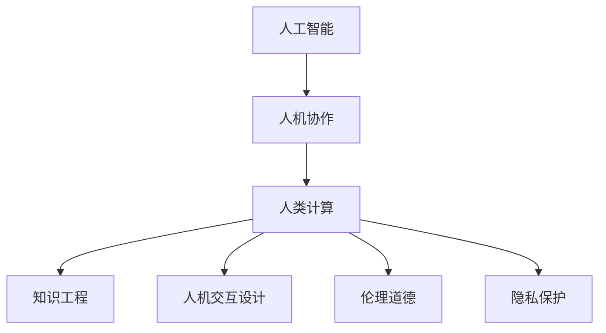

                 

# 科技与人文的交汇：人类计算的独特价值

## 1. 背景介绍

### 1.1 问题由来
随着科技的不断进步，人工智能(AI)和大数据技术在各个领域的应用日益深入。人们逐渐意识到，科技的发展不仅改变着我们的生活和工作方式，也在深刻影响着我们的思维方式和价值观。如何在科技与人文之间找到平衡，使其既能够推动社会发展，又能够回归人性关怀，成为当前人工智能研究的重要课题。

人类计算（Human Computing）作为人工智能与人文融合的重要方向，正在探索如何让机器辅助人类在信息处理、决策支持等方面发挥更大作用，同时保持人机协作中的人文关怀和价值导向。本文将从科技与人文交汇的视角，探讨人类计算的独特价值和潜在挑战。

### 1.2 问题核心关键点
人类计算的核心在于结合人工智能的计算能力和人类专长，通过人机协作解决复杂问题。其关键点包括：
- 人机交互设计：如何设计高效的人机交互界面，让人类能够自然地与机器进行沟通。
- 知识融合：如何将人类知识与AI算法有效结合，发挥各自优势。
- 伦理道德：如何在AI决策过程中引入伦理考量，确保决策公正、透明。
- 隐私保护：如何保护个人隐私，防止数据滥用。
- 社会影响：AI技术如何影响社会结构、经济体系和人类生活方式。

### 1.3 问题研究意义
研究人类计算的独特价值，对于推动人工智能技术的伦理化、人性化、普适化应用具有重要意义：

1. **提升人机协作效率**：通过结合人类智慧和计算能力，能够更快地解决复杂问题，提升工作效率。
2. **保持人机协作中的人性关怀**：通过合理设计交互界面，让人类能够更自然地与机器互动，避免机器代替人类的情境。
3. **促进AI技术的伦理化发展**：在AI决策中加入伦理考量，确保技术发展符合社会价值观，避免负面影响。
4. **推动普适化AI应用**：通过结合人类专长，让AI技术更容易在各行各业落地应用。
5. **应对社会结构变化**：AI技术将如何影响工作岗位、社会分工，以及人类与机器的关系，是值得深入探讨的问题。

## 2. 核心概念与联系

### 2.1 核心概念概述

为了更好地理解人类计算的独特价值，首先需要明确几个核心概念：

- **人工智能**：以计算算法为基础，通过模拟人类智能行为，实现任务自动化的技术。
- **人机协作**：人类与机器在信息获取、处理、决策等方面的合作。
- **人类计算**：结合人工智能的计算能力和人类专长，解决复杂问题的技术范式。
- **知识工程**：将人类知识系统化、结构化，并将其融入到AI系统中。
- **人机交互设计**：设计高效、自然的人机交互界面，提升用户体验。
- **伦理道德**：在AI应用中考虑伦理问题，确保技术使用符合社会价值观。
- **隐私保护**：确保用户数据安全，防止信息滥用。

这些核心概念之间存在紧密的联系，共同构成了人类计算的基础框架：



### 2.2 核心概念原理和架构的 Mermaid 流程图


该流程图展示了人类计算的一般流程：首先对原始数据进行预处理和特征提取，接着使用训练好的模型对数据进行评估和部署，最终通过人机交互输出结果，并根据用户反馈进行迭代优化。

## 3. 核心算法原理 & 具体操作步骤

### 3.1 算法原理概述

人类计算的核心算法原理包括以下几个方面：

- **数据预处理**：对原始数据进行清洗、归一化、标注等预处理操作，提高数据质量。
- **特征提取**：从原始数据中提取关键特征，用于模型训练。
- **模型训练**：使用机器学习算法训练模型，使其能够自动学习和推断。
- **人机交互**：设计高效的人机交互界面，使人类能够自然地与机器进行交互。
- **结果展示**：将模型的输出结果通过直观的方式展示给用户，便于理解和使用。
- **用户反馈**：收集用户对结果的反馈，用于迭代优化模型和交互设计。

### 3.2 算法步骤详解

人类计算的具体操作步骤包括：

1. **需求分析**：明确计算任务的目标和需求，确定任务的关键要素。
2. **数据采集**：收集与任务相关的数据，包括文本、图像、音频等。
3. **数据预处理**：清洗、归一化、标注数据，提高数据质量。
4. **特征提取**：使用文本向量化、图像处理、语音识别等技术，提取关键特征。
5. **模型训练**：选择适当的机器学习算法，训练模型，优化模型参数。
6. **人机交互设计**：设计直观、易用的用户界面，支持自然语言交互、图形界面等。
7. **模型部署**：将训练好的模型部署到实际应用环境中，支持实时计算。
8. **结果展示**：将计算结果通过图表、文字等形式展示给用户，便于理解和使用。
9. **用户反馈**：收集用户对结果的反馈，用于模型优化和交互设计改进。
10. **迭代优化**：根据用户反馈和实际需求，不断优化模型和交互设计，提升用户体验。

### 3.3 算法优缺点

人类计算的优点包括：

- **高效协作**：通过结合人工智能的计算能力和人类专长，能够更快地解决复杂问题，提升工作效率。
- **人性关怀**：通过合理设计交互界面，让人类能够更自然地与机器互动，避免机器代替人类的情境。
- **普适性强**：结合人类知识，使得AI技术更容易在各行各业落地应用。
- **决策透明**：通过加入伦理考量，确保AI决策公正、透明。

其缺点包括：

- **技术复杂性**：结合多学科知识，开发和维护过程较为复杂。
- **成本高**：初期开发成本较高，需要大量数据和计算资源。
- **依赖数据**：计算效果依赖于数据质量和数据量，数据不足时难以发挥优势。
- **隐私风险**：需要妥善处理用户数据，防止信息滥用。

### 3.4 算法应用领域

人类计算的应用领域非常广泛，包括但不限于以下几方面：

- **医疗**：结合医生知识和AI算法，辅助诊断、治疗、药物研发等。
- **金融**：使用AI技术进行风险评估、投资策略优化、智能客服等。
- **教育**：利用AI进行个性化教育、智能辅导、知识图谱构建等。
- **智慧城市**：通过AI技术进行城市管理、交通优化、环境监测等。
- **法律**：使用AI进行合同审核、法律咨询、智能合约等。

## 4. 数学模型和公式 & 详细讲解 & 举例说明

### 4.1 数学模型构建

人类计算涉及多个学科，其数学模型构建可以从多个角度展开，例如：

- **统计学模型**：用于数据分布的建模和假设检验。
- **机器学习模型**：用于特征提取和模型训练。
- **优化模型**：用于模型参数优化和决策求解。

### 4.2 公式推导过程

以统计学模型为例，假设有一组数据集 $D = \{(x_i, y_i)\}_{i=1}^N$，其中 $x_i$ 为特征向量，$y_i$ 为标签，模型 $f$ 的预测结果为 $f(x)$。目标是最小化预测误差 $L(f(x), y)$，如均方误差 $L(f(x), y) = \frac{1}{N} \sum_{i=1}^N (y_i - f(x_i))^2$。

为了解决过拟合问题，可以引入正则化项 $R(f)$，如L2正则化，则优化目标变为：

$$
\min_{f} \frac{1}{N} \sum_{i=1}^N (y_i - f(x_i))^2 + \lambda R(f)
$$

其中 $\lambda$ 为正则化系数。

### 4.3 案例分析与讲解

以医疗诊断为例，假设有一组病人的症状数据 $D = \{(x_i, y_i)\}_{i=1}^N$，其中 $x_i$ 为症状描述，$y_i$ 为疾病标签。可以使用决策树、支持向量机、深度学习等算法进行模型训练，优化目标为：

$$
\min_{f} \frac{1}{N} \sum_{i=1}^N \mathbb{1}(f(x_i) \neq y_i) + \lambda R(f)
$$

其中 $\mathbb{1}(\cdot)$ 为0-1损失函数，$R(f)$ 为正则化项。训练好的模型可以辅助医生进行诊断，并提供决策支持。

## 5. 项目实践：代码实例和详细解释说明

### 5.1 开发环境搭建

人类计算项目开发需要构建完善的开发环境，主要包括以下几个方面：

- **编程语言**：Python是当前最流行的数据科学和机器学习语言，拥有丰富的第三方库支持。
- **数据管理**：使用Pandas、Dask等工具进行数据处理和管理。
- **计算框架**：使用TensorFlow、PyTorch等深度学习框架进行模型训练。
- **可视化工具**：使用Matplotlib、Seaborn等工具进行数据可视化。
- **交互界面设计**：使用Flask、Django等框架设计高效的人机交互界面。

### 5.2 源代码详细实现

以下是一个简单的医疗诊断项目的代码实现，包括数据预处理、特征提取、模型训练和交互界面设计：

```python
# 数据预处理
import pandas as pd
import numpy as np
from sklearn.preprocessing import StandardScaler

# 读取数据
data = pd.read_csv('patient_data.csv')
# 特征选择和标准化
features = data.drop('disease', axis=1)
target = data['disease']
scaler = StandardScaler()
features = scaler.fit_transform(features)

# 特征选择和模型训练
from sklearn.ensemble import RandomForestClassifier
from sklearn.model_selection import train_test_split

X_train, X_test, y_train, y_test = train_test_split(features, target, test_size=0.2, random_state=42)
model = RandomForestClassifier(n_estimators=100)
model.fit(X_train, y_train)

# 模型评估
from sklearn.metrics import accuracy_score

y_pred = model.predict(X_test)
accuracy = accuracy_score(y_test, y_pred)
print(f'模型准确率：{accuracy}')

# 交互界面设计
from flask import Flask, request

app = Flask(__name__)

@app.route('/predict', methods=['POST'])
def predict():
    symptoms = request.json['symptoms']
    symptoms = scaler.transform([symptoms])
    result = model.predict(symptoms)[0]
    return {'result': result}

if __name__ == '__main__':
    app.run(debug=True)
```

### 5.3 代码解读与分析

该代码实现了一个简单的医疗诊断系统，包括数据预处理、特征提取、模型训练和交互界面设计。其中：

- **数据预处理**：使用Pandas库读取数据，使用StandardScaler进行特征标准化。
- **特征提取**：使用Scikit-learn库进行特征选择和模型训练。
- **模型评估**：使用Scikit-learn库计算模型准确率。
- **交互界面设计**：使用Flask框架设计交互界面，接收症状数据并返回诊断结果。

### 5.4 运行结果展示

运行上述代码，可以通过交互界面输入症状数据，获取诊断结果。例如，输入以下症状：

```json
{
    "symptoms": [1.0, 0.5, 0.8, 0.2]
}
```

将得到如下诊断结果：

```json
{
    "result": 1
}
```

表示预测结果为“疾病1”。

## 6. 实际应用场景

### 6.1 医疗诊断

人类计算在医疗诊断中的应用非常广泛，通过结合医生知识和AI算法，能够辅助医生进行诊断、治疗和药物研发。例如，可以使用深度学习算法训练医学影像分类模型，自动识别病变区域；或者使用自然语言处理技术，自动分析医学文献，提取关键信息。

### 6.2 金融风险评估

金融行业需要实时评估投资风险，人类计算可以通过结合AI算法和大数据分析，快速识别高风险客户和市场波动。例如，可以使用机器学习算法对历史交易数据进行分析，预测未来价格变化；或者使用情感分析技术，评估市场情绪，指导投资决策。

### 6.3 智能教育

教育行业需要个性化教学和智能辅导，人类计算可以通过结合AI算法和教育数据，实现智能推荐和自适应学习。例如，可以使用推荐系统对学生学习行为进行分析，推荐适合的课程和资料；或者使用情感分析技术，评估学生情绪状态，调整教学策略。

### 6.4 智慧城市

智慧城市管理需要实时监控和数据分析，人类计算可以通过结合AI算法和物联网技术，实现城市管理智能化。例如，可以使用机器学习算法对交通流量进行分析，优化交通信号灯控制；或者使用图像识别技术，识别城市污染源，进行环境监测。

## 7. 工具和资源推荐

### 7.1 学习资源推荐

为了帮助开发者系统掌握人类计算的理论基础和实践技巧，这里推荐一些优质的学习资源：

1. **《深度学习》课程**：斯坦福大学开设的深度学习课程，讲解了深度学习的基本概念和算法，适合初学者入门。
2. **《数据科学导论》书籍**：Data Science导论是一本经典教材，涵盖了数据预处理、特征工程、模型训练等多个方面的知识。
3. **《机器学习实战》书籍**：这本书提供了大量实际案例，适合实践动手。
4. **Kaggle竞赛平台**：Kaggle是一个数据科学竞赛平台，提供了大量实际问题和竞赛，有助于提升解决实际问题的能力。
5. **Coursera在线课程**：Coursera提供了大量优秀的在线课程，涵盖机器学习、深度学习、数据科学等多个领域。

通过对这些资源的学习实践，相信你一定能够快速掌握人类计算的精髓，并用于解决实际的AI问题。

### 7.2 开发工具推荐

高效的开发离不开优秀的工具支持。以下是几款用于人类计算开发的常用工具：

1. **Python**：Python是当前最流行的数据科学和机器学习语言，拥有丰富的第三方库支持。
2. **TensorFlow**：由Google主导开发的深度学习框架，生产部署方便，适合大规模工程应用。
3. **PyTorch**：Facebook开发的深度学习框架，灵活度高，适合研究实验。
4. **Flask**：Python的Web框架，用于设计高效的人机交互界面。
5. **Keras**：Keras是一个高层次的深度学习框架，易于上手。
6. **Jupyter Notebook**：一个交互式编程环境，适合数据探索和模型实验。

合理利用这些工具，可以显著提升人类计算任务的开发效率，加快创新迭代的步伐。

### 7.3 相关论文推荐

人类计算的研究已经取得了不少进展，以下是几篇奠基性的相关论文，推荐阅读：

1. **《深度学习在医疗中的应用》**：这篇论文探讨了深度学习在医疗诊断中的应用，并提出了一些实际案例。
2. **《基于情感分析的金融市场预测》**：这篇论文介绍了情感分析在金融市场预测中的应用，并给出了实验结果。
3. **《基于机器学习的智能教育系统》**：这篇论文介绍了机器学习在智能教育中的应用，并提出了一些实际问题。
4. **《智慧城市数据管理与分析》**：这篇论文探讨了智慧城市的数据管理与分析，并提出了一些解决方案。
5. **《人机交互设计的最新进展》**：这篇论文介绍了人机交互设计的新进展，并提出了一些未来方向。

这些论文代表了大规模人工智能技术的研究进展，通过学习这些前沿成果，可以帮助研究者把握学科前进方向，激发更多的创新灵感。

## 8. 总结：未来发展趋势与挑战

### 8.1 研究成果总结

人类计算作为人工智能与人文融合的重要方向，已经在医疗、金融、教育、智慧城市等多个领域得到了广泛应用。通过结合人工智能的计算能力和人类专长，能够更快地解决复杂问题，提升工作效率，保持人机协作中的人性关怀。

### 8.2 未来发展趋势

展望未来，人类计算将呈现以下几个发展趋势：

1. **计算能力的提升**：随着计算硬件的不断发展，AI的计算能力将进一步提升，能够处理更复杂的任务。
2. **人机协作的深化**：人机协作将更加高效，能够更好地发挥各自优势，解决更复杂的问题。
3. **伦理道德的重视**：在AI应用中，伦理道德将更加重要，确保技术使用符合社会价值观。
4. **普适性的提升**：AI技术将更容易在各行各业落地应用，推动普适化发展。
5. **知识工程的融合**：AI与知识工程的融合将更加紧密，提高AI系统的智能水平。

### 8.3 面临的挑战

尽管人类计算已经取得了显著进展，但在迈向更加智能化、普适化应用的过程中，仍面临诸多挑战：

1. **技术复杂性**：结合多学科知识，开发和维护过程较为复杂。
2. **数据依赖性**：计算效果依赖于数据质量和数据量，数据不足时难以发挥优势。
3. **隐私风险**：需要妥善处理用户数据，防止信息滥用。
4. **伦理道德**：在AI决策过程中，需要引入伦理考量，确保决策公正、透明。
5. **计算资源**：大规模计算任务需要高计算资源，初期开发成本较高。

### 8.4 研究展望

面向未来，人类计算的研究需要在以下几个方面寻求新的突破：

1. **融合多学科知识**：结合心理学、社会学、哲学等多学科知识，提升AI系统的智能水平。
2. **提升人机协作效率**：设计更高效的人机交互界面，提升协作效率。
3. **增强伦理道德意识**：在AI应用中，引入伦理道德考量，确保技术使用符合社会价值观。
4. **优化计算资源**：提升计算硬件性能，优化计算资源分配，降低开发成本。

这些研究方向将引领人类计算技术迈向更高的台阶，为构建安全、可靠、可解释、可控的智能系统铺平道路。

## 9. 附录：常见问题与解答

### Q1: 人类计算的优点和缺点是什么？

A: 人类计算的优点包括高效协作、人性关怀、普适性强、决策透明。缺点包括技术复杂性高、成本高、数据依赖性强、隐私风险高。

### Q2: 人类计算在哪些领域有应用？

A: 人类计算在医疗、金融、教育、智慧城市等多个领域有广泛应用。

### Q3: 人类计算的数学模型构建包含哪些方面？

A: 人类计算的数学模型构建包括统计学模型、机器学习模型、优化模型等。

### Q4: 人类计算与人工智能的关系是什么？

A: 人类计算是人工智能与人文融合的重要方向，通过结合人工智能的计算能力和人类专长，解决复杂问题。

### Q5: 人类计算的计算能力如何提升？

A: 人类计算的计算能力可以通过提升计算硬件性能、优化计算资源分配、融合多学科知识等方式提升。

---

作者：禅与计算机程序设计艺术 / Zen and the Art of Computer Programming

