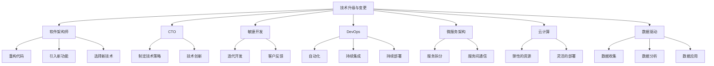

                 

# 程序员如何应对技术升级与变更

> 关键词：技术升级，技术变更，软件架构师，程序员，CTO，技术创新，技术演进，项目管理，敏捷开发，DevOps，微服务架构，云计算，数据驱动

## 1. 背景介绍

随着信息技术的发展，新技术的不断涌现，程序员们面临着一个不断变化的技术环境。技术升级与变更不仅会影响现有系统的稳定性和兼容性，还可能带来新功能和新需求的引入。如何在快速变化的技术环境中保持竞争力，是每个程序员和软件架构师需要面对的挑战。本文将深入探讨如何应对技术升级与变更，帮助程序员和软件架构师在技术变革中保持领先地位。

## 2. 核心概念与联系

### 2.1 核心概念概述

为更好地理解技术升级与变更的应对策略，本节将介绍几个密切相关的核心概念：

- **技术升级与变更**：指通过引入新功能、新技术或新架构来改进现有系统的过程。技术升级可以是渐进的，也可以是颠覆性的。变更可能需要重新设计系统架构、重构代码，甚至更换现有技术栈。

- **软件架构师**：负责设计软件系统的整体结构和组件，确保系统的可扩展性、可维护性和性能。软件架构师需要具备深厚的技术背景和良好的沟通能力，能够协调团队进行技术变更。

- **CTO（首席技术官）**：负责制定公司的技术策略，管理技术团队，推动技术创新和应用。CTO需要具有前瞻性思维，能够识别新技术的潜力和风险。

- **敏捷开发**：一种快速响应变化的软件开发方法，强调迭代开发、客户反馈和团队协作。敏捷开发能够提高项目交付速度，降低变更成本。

- **DevOps**：将软件开发与运维流程紧密结合，强调自动化、持续集成和持续部署。DevOps能够提高软件交付效率，降低变更时的系统风险。

- **微服务架构**：将大型应用拆分为多个小服务的架构设计。微服务架构提高了系统的可扩展性和可维护性，但也需要面对服务间的复杂性和通信开销。

- **云计算**：通过互联网提供计算资源和服务，如IaaS（基础设施即服务）、PaaS（平台即服务）和SaaS（软件即服务）。云计算能够提供弹性的资源和灵活的部署方式。

- **数据驱动**：通过数据收集、分析和应用，指导决策和优化流程。数据驱动能够帮助团队更好地理解用户需求，优化产品功能。

这些核心概念之间的逻辑关系可以通过以下Mermaid流程图来展示：



这个流程图展示了技术升级与变更的一般流程：

1. 技术升级与变更的发生。
2. 软件架构师和CTO参与评估和决策。
3. 引入敏捷开发和DevOps，以快速响应变更。
4. 采用微服务架构和云计算，以提高系统灵活性和可扩展性。
5. 通过数据驱动，优化产品功能和用户体验。

## 3. 核心算法原理 & 具体操作步骤

### 3.1 算法原理概述

技术升级与变更的过程，本质上是一种复杂的管理和工程问题。其核心在于如何通过有效的项目管理、技术评估和团队协作，确保变更的顺利实施和系统的稳定运行。

形式化地，假设现有系统为 $S$，需要引入的新技术或新架构为 $T$。技术升级与变更的目标是找到最优的变更方案，使得系统 $S$ 能够适配新的技术栈或架构，即：

$$
S' = \mathop{\arg\min}_{S'} \mathcal{C}(S', T)
$$

其中 $\mathcal{C}$ 为变更成本函数，用于衡量变更所需的资源和风险。

通过最小化变更成本函数 $\mathcal{C}$，我们可以找到最佳的变更方案。然而，实际中的变更成本可能涉及多方面的因素，如技术复杂度、用户影响、业务中断等。因此，评估和决策过程需要综合考虑这些因素。

### 3.2 算法步骤详解

技术升级与变更的一般流程包括以下几个关键步骤：

**Step 1: 需求分析与评估**

- 收集变更需求，明确变更目标和预期效果。
- 对现有系统进行评估，识别关键组件和技术栈。
- 分析新技术的潜力和风险，确定变更的必要性和可行性。

**Step 2: 制定变更计划**

- 确定变更的范围和优先级，制定详细的实施计划。
- 分配资源和角色，建立跨部门的沟通机制。
- 制定变更的里程碑和进度表，确保变更按期完成。

**Step 3: 技术评估与决策**

- 组织技术评估会议，邀请专家和团队成员讨论变更方案。
- 通过实验和原型验证新技术的可行性和性能。
- 制定技术评估报告，提出最佳技术方案和推荐方案。

**Step 4: 实施与测试**

- 按照变更计划实施变更，进行代码重构、架构迁移等操作。
- 进行单元测试、集成测试和系统测试，确保变更的正确性。
- 在生产环境中进行负载测试和性能测试，验证系统的稳定性。

**Step 5: 部署与监控**

- 逐步部署变更到生产环境，观察系统表现。
- 监控系统指标，及时发现和解决问题。
- 收集反馈和数据，优化变更方案，持续改进系统。

### 3.3 算法优缺点

技术升级与变更的方法具有以下优点：

1. **提升系统性能和可扩展性**：通过引入新技术和架构，可以提高系统的性能、可扩展性和可维护性。
2. **增强系统安全性和可靠性**：采用最佳实践和新技术，可以提高系统的安全性和可靠性。
3. **优化用户体验和业务流程**：通过技术升级和变更，可以提升用户体验和业务流程的效率。

同时，该方法也存在以下局限性：

1. **成本高**：技术升级和变更需要大量资源和时间，可能会影响业务发展。
2. **风险高**：变更过程中可能会出现未知的bug和性能问题，导致系统不稳定。
3. **用户影响大**：变更可能会影响用户的使用体验和业务流程，需要良好的沟通和协调。
4. **技术复杂度高**：新技术的引入和架构的迁移，需要深厚的技术背景和经验。

尽管存在这些局限性，但就目前而言，技术升级与变更仍是提升系统性能和应用功能的重要手段。未来相关研究的重点在于如何降低变更成本和风险，提高变更效率，同时兼顾用户体验和业务需求。

### 3.4 算法应用领域

技术升级与变更的应用领域非常广泛，包括但不限于：

- **软件开发**：升级开发工具、框架和语言，提高开发效率和代码质量。
- **基础设施**：更换服务器、存储和网络设备，提升基础设施的性能和可靠性。
- **安全加固**：引入最新的安全技术和策略，保护系统和数据的安全。
- **业务流程优化**：引入自动化和智能化工具，优化业务流程和用户体验。
- **产品创新**：引入新技术和新功能，拓展产品线，满足用户新需求。

除了上述这些经典应用外，技术升级与变更还被创新性地应用于更多场景中，如数据中台建设、智能运维、微服务治理等，为企业的数字化转型提供了新的动力。

## 4. 数学模型和公式 & 详细讲解 & 举例说明

### 4.1 数学模型构建

本节将使用数学语言对技术升级与变更的过程进行更加严格的刻画。

假设现有系统为 $S$，需要引入的新技术或新架构为 $T$。技术升级与变更的目标是找到最优的变更方案，使得系统 $S$ 能够适配新的技术栈或架构，即：

$$
S' = \mathop{\arg\min}_{S'} \mathcal{C}(S', T)
$$

其中 $\mathcal{C}$ 为变更成本函数，用于衡量变更所需的资源和风险。

定义变更成本函数 $\mathcal{C}$ 为：

$$
\mathcal{C}(S', T) = C_{dev} + C_{int} + C_{ris}
$$

其中 $C_{dev}$ 为开发成本，$C_{int}$ 为集成成本，$C_{ris}$ 为风险成本。

开发成本 $C_{dev}$ 可以通过以下公式计算：

$$
C_{dev} = \sum_{i=1}^n p_i f_i
$$

其中 $p_i$ 为变更需求的数量，$f_i$ 为每个需求对应的开发复杂度。

集成成本 $C_{int}$ 可以通过以下公式计算：

$$
C_{int} = \sum_{j=1}^m q_j g_j
$$

其中 $q_j$ 为变更需求的数量，$g_j$ 为每个需求对应的集成复杂度。

风险成本 $C_{ris}$ 可以通过以下公式计算：

$$
C_{ris} = \sum_{k=1}^K h_k r_k
$$

其中 $h_k$ 为变更需求的优先级，$r_k$ 为每个需求对应的风险程度。

### 4.2 公式推导过程

以下我们以软件开发为例，推导技术升级与变更的成本函数及其梯度计算公式。

假设现有系统为 $S$，需要引入的新技术为 $T$。开发成本 $C_{dev}$ 可以通过以下公式计算：

$$
C_{dev} = \sum_{i=1}^n p_i f_i
$$

其中 $p_i$ 为变更需求的数量，$f_i$ 为每个需求对应的开发复杂度。

集成成本 $C_{int}$ 可以通过以下公式计算：

$$
C_{int} = \sum_{j=1}^m q_j g_j
$$

其中 $q_j$ 为变更需求的数量，$g_j$ 为每个需求对应的集成复杂度。

风险成本 $C_{ris}$ 可以通过以下公式计算：

$$
C_{ris} = \sum_{k=1}^K h_k r_k
$$

其中 $h_k$ 为变更需求的优先级，$r_k$ 为每个需求对应的风险程度。

因此，变更成本函数 $\mathcal{C}$ 可以表示为：

$$
\mathcal{C}(S', T) = \sum_{i=1}^n p_i f_i + \sum_{j=1}^m q_j g_j + \sum_{k=1}^K h_k r_k
$$

通过梯度下降等优化算法，技术升级与变更过程不断更新系统参数 $\theta$，最小化成本函数 $\mathcal{C}$，使得系统 $S$ 能够适配新的技术栈或架构。

### 4.3 案例分析与讲解

假设现有系统为一个大型的电商平台，需要引入新的推荐引擎和实时数据分析系统。以下是计算成本函数的详细步骤：

1. 需求分析与评估
   - 收集变更需求，明确变更目标和预期效果。
   - 对现有系统进行评估，识别关键组件和技术栈。
   - 分析新技术的潜力和风险，确定变更的必要性和可行性。

2. 制定变更计划
   - 确定变更的范围和优先级，制定详细的实施计划。
   - 分配资源和角色，建立跨部门的沟通机制。
   - 制定变更的里程碑和进度表，确保变更按期完成。

3. 技术评估与决策
   - 组织技术评估会议，邀请专家和团队成员讨论变更方案。
   - 通过实验和原型验证新技术的可行性和性能。
   - 制定技术评估报告，提出最佳技术方案和推荐方案。

4. 实施与测试
   - 按照变更计划实施变更，进行代码重构、架构迁移等操作。
   - 进行单元测试、集成测试和系统测试，确保变更的正确性。
   - 在生产环境中进行负载测试和性能测试，验证系统的稳定性。

5. 部署与监控
   - 逐步部署变更到生产环境，观察系统表现。
   - 监控系统指标，及时发现和解决问题。
   - 收集反馈和数据，优化变更方案，持续改进系统。

## 5. 项目实践：代码实例和详细解释说明

### 5.1 开发环境搭建

在进行技术升级与变更的实践前，我们需要准备好开发环境。以下是使用Python进行DevOps开发的环境配置流程：

1. 安装Anaconda：从官网下载并安装Anaconda，用于创建独立的Python环境。

2. 创建并激活虚拟环境：
```bash
conda create -n devops-env python=3.8 
conda activate devops-env
```

3. 安装相关工具包：
```bash
pip install git git-lfs setuptools
pip install tox tox.ini pytest pytest-xdist pytest-random pytest-timeout pytest-cov coverage pytest-flake8 coverage report
pip install flask Jinja2
```

4. 安装Docker和Kubernetes：
```bash
sudo apt-get update && sudo apt-get install -y \
    apt-transport-https \
    ca-certificates \
    curl \
    software-properties-common \
    && curl -fsSL https://download.docker.com/linux/debian/gpg | sudo apt-key add -
sudo add-apt-repository \
    "deb [arch=amd64] https://download.docker.com/linux/debian \
    $(lsb_release -cs) \
    stable"
sudo apt-get update && sudo apt-get install -y docker-ce docker-ce-cli containerd.io
sudo kubectl install -y kube-proxy
```

5. 安装Helm和Helmfile：
```bash
curl -L https://helm.sh/helm-v2-stable.tar.gz | tar -xz
```

完成上述步骤后，即可在`devops-env`环境中开始DevOps实践。

### 5.2 源代码详细实现

这里我们以微服务架构的实现为例，给出使用Docker和Kubernetes进行微服务部署的PyTorch代码实现。

首先，定义微服务的Dockerfile：

```dockerfile
FROM python:3.8-slim

WORKDIR /app

COPY requirements.txt .
RUN pip install --no-cache-dir -r requirements.txt

COPY . .

CMD ["python", "app.py"]
```

然后，创建微服务的PyTorch模型和应用：

```python
from torch import nn, optim

class Microservice(nn.Module):
    def __init__(self):
        super().__init__()
        self.linear = nn.Linear(1, 1)

    def forward(self, x):
        return self.linear(x)

model = Microservice()

criterion = nn.MSELoss()
optimizer = optim.SGD(model.parameters(), lr=0.01)
```

接着，定义微服务的Flask应用和API：

```python
from flask import Flask, request, jsonify

app = Flask(__name__)

@app.route('/predict', methods=['POST'])
def predict():
    data = request.json['data']
    output = model(torch.tensor(data))
    return jsonify({'prediction': output.item()})

if __name__ == '__main__':
    app.run(host='0.0.0.0', port=5000)
```

最后，在Helmfile中定义微服务的Deployment和Service：

```yaml
# microservice-1
apiVersion: apps/v1
kind: Deployment
metadata:
  name: microservice-1
spec:
  replicas: 3
  selector:
    matchLabels:
      hello: world
  template:
    metadata:
      labels:
        hello: world
    spec:
      containers:
      - name: microservice-1
        image: python:3.8-slim
        command: ["python", "app.py"]
        ports:
        - containerPort: 5000
```

启动微服务的部署和监控：

```bash
kubectl apply -f helmfile.yaml
kubectl get services
kubectl get pods
```

以上就是使用Docker和Kubernetes实现微服务架构的完整代码实现。可以看到，借助DevOps工具，我们可以更加高效地进行微服务部署和监控，确保系统稳定运行。

### 5.3 代码解读与分析

让我们再详细解读一下关键代码的实现细节：

**Dockerfile**：
- 定义了微服务的Docker镜像，包括Python环境、依赖包、应用代码等。
- 通过`COPY`命令将项目代码和依赖文件复制到Docker镜像中。
- 使用`CMD`命令指定应用的运行命令。

**Flask应用和API**：
- 使用Flask框架创建Web应用。
- 定义API接口`/predict`，接收JSON数据，调用PyTorch模型进行预测，并返回预测结果。
- 通过`app.run()`启动应用，监听本地5000端口。

**Helmfile**：
- 定义了微服务的Deployment和Service，指定了应用的容器镜像、端口号、副本数等。
- 通过`kubectl apply`命令部署应用到Kubernetes集群中。
- 使用`kubectl get`命令查看应用的状态，确保应用部署成功。

通过Docker和Kubernetes工具，我们可以快速构建、部署和监控微服务应用，实现高效的DevOps实践。

## 6. 实际应用场景

### 6.1 智能运维

基于DevOps的微服务架构和自动化部署，智能运维系统能够实现实时监控、故障预测和自动化修复，保障系统的稳定运行。通过DevOps工具，智能运维系统可以自动检测和响应系统异常，及时通知运维人员进行处理，大大提高了运维效率。

### 6.2 微服务治理

微服务架构的复杂性需要完善的服务治理机制，包括服务发现、负载均衡、容错处理等。DevOps工具可以帮助管理微服务架构，实现服务的自动发现和负载均衡，提高系统的可靠性和可用性。

### 6.3 数据驱动的决策支持

通过DevOps工具，可以快速收集和处理用户行为数据，分析用户需求和反馈，指导产品开发和业务决策。数据驱动的决策支持系统能够帮助企业更好地理解用户，优化产品功能和业务流程，提升用户体验和业务价值。

### 6.4 未来应用展望

未来，DevOps工具和技术将进一步普及，推动微服务架构和云计算的发展。DevOps的普及将使得技术升级和变更更加高效、灵活，帮助企业快速响应市场变化，提升竞争力。

随着DevOps工具的不断发展，更多功能将被整合到DevOps平台中，如持续交付、自动化测试、安全扫描等，进一步提升开发和运维效率。同时，DevOps也将与人工智能、大数据等技术深度融合，推动业务智能和决策支持系统的发展。

## 7. 工具和资源推荐
### 7.1 学习资源推荐

为了帮助开发者系统掌握DevOps的技术基础和实践技巧，这里推荐一些优质的学习资源：

1. **《DevOps 实践指南》**：由Lorrie W. TFord和James F. Jones合著，介绍了DevOps的核心理念、工具和方法。
2. **《微服务架构之路》**：由Sam Newman撰写，全面介绍了微服务架构的设计、开发和运维。
3. **《持续交付》**：由Gene Kim、Patrick Debois和John Willis合著，讲解了持续交付的最佳实践。
4. **《Docker实战》**：由Jeff Carpenter和Sandi Metz合著，介绍了Docker容器化的原理和应用。
5. **《Kubernetes权威指南》**：由Brian Kobliner和Dana eldering合著，详细介绍了Kubernetes的原理和应用。

通过学习这些资源，相信你一定能够快速掌握DevOps的理论基础和实践技巧，并用于解决实际的开发和运维问题。

### 7.2 开发工具推荐

高效的开发离不开优秀的工具支持。以下是几款用于DevOps开发常用的工具：

1. **Jenkins**：开源的自动化部署和持续集成工具，支持多种插件和扩展，能够灵活配置自动化流程。
2. **GitLab**：集成了代码管理、持续集成、持续部署、项目管理和DevOps仪表板等功能，提供了完整的DevOps生态系统。
3. **Docker**：开源的容器化平台，能够封装应用和依赖，提供跨环境的可移植性和一致性。
4. **Kubernetes**：开源的容器编排平台，能够管理容器的部署、扩展和负载均衡。
5. **Prometheus**：开源的监控和报警系统，能够收集和分析系统的各种指标。
6. **Grafana**：开源的可视化仪表板工具，能够将Prometheus等监控数据进行可视化展示。

合理利用这些工具，可以显著提升DevOps的开发效率，加快创新迭代的步伐。

### 7.3 相关论文推荐

DevOps技术的发展源于学界的持续研究。以下是几篇奠基性的相关论文，推荐阅读：

1. **《DevOps Handbook》**：由Andy Neal、John Willis和Bruce Kramer合著，总结了DevOps的实践经验和方法论。
2. **《Microservices: The Three Pillars》**：由Sam Newman撰写，提出了微服务架构的三大支柱：构建模块、自动化和持续交付。
3. **《Continuous Delivery》**：由Jez Humble和David Farley合著，讲解了持续交付的最佳实践和工具。
4. **《The Docker Manifesto》**：由Docker公司发布，介绍了Docker容器化的核心理念和优势。
5. **《Kubernetes: Defining the Future of DevOps》**：由Google发布，介绍了Kubernetes的起源和发展方向。

这些论文代表了大规模系统开发和运维的理论进展，将有助于深入理解DevOps技术的核心理念和实践方法。

## 8. 总结：未来发展趋势与挑战

### 8.1 总结

本文对技术升级与变更的应对策略进行了全面系统的介绍。首先阐述了技术升级与变更的背景和意义，明确了DevOps在快速变化的技术环境中的独特价值。其次，从原理到实践，详细讲解了DevOps的数学模型和关键步骤，给出了DevOps任务开发的完整代码实例。同时，本文还广泛探讨了DevOps方法在智能运维、微服务治理等多个行业领域的应用前景，展示了DevOps范式的广泛影响力。此外，本文精选了DevOps技术的各类学习资源，力求为读者提供全方位的技术指引。

通过本文的系统梳理，可以看到，DevOps方法在提升系统性能和应用功能、优化开发和运维流程方面具有显著效果。DevOps技术已经成为现代软件开发和运维的标准实践，正推动信息技术行业的全面变革。

### 8.2 未来发展趋势

展望未来，DevOps技术将呈现以下几个发展趋势：

1. **全栈自动化**：DevOps工具和技术将进一步集成，实现从代码管理到部署、监控、反馈的全面自动化。
2. **云原生**：DevOps将与云计算深度融合，推动微服务架构和容器化技术的发展。
3. **智能化**：DevOps将引入人工智能和机器学习技术，实现故障预测、自动修复等功能。
4. **安全性**：DevOps将加强安全性和合规性管理，确保开发和运维过程的安全可靠。
5. **协作与可视化**：DevOps将加强团队协作和可视化，提升开发效率和决策质量。

这些趋势凸显了DevOps技术的广阔前景。随着DevOps技术的不断演进，其在提高软件开发和运维效率、保障系统稳定性和可靠性方面将发挥更大的作用。

### 8.3 面临的挑战

尽管DevOps技术已经取得了显著成效，但在迈向更加智能化、普适化应用的过程中，仍面临诸多挑战：

1. **复杂性高**：DevOps涉及到多个环节和工具，集成和配置复杂，需要深厚的技术背景。
2. **成本高**：DevOps工具和平台需要大量投入，尤其是对于小型企业，可能存在经济压力。
3. **文化差异**：DevOps需要跨团队、跨部门的协作，不同团队的文化和习惯可能存在差异。
4. **安全风险**：DevOps的自动化流程可能带来新的安全风险，如自动化脚本漏洞、自动化测试失败等。
5. **变更管理**：DevOps需要高效地管理变更，确保变更过程的可控性和可追溯性。

尽管面临这些挑战，DevOps技术的普及和应用仍是大势所趋。未来相关研究的重点在于如何降低DevOps的复杂性，降低成本，增强协作和安全性，提高变更管理的效率。

### 8.4 研究展望

面对DevOps技术面临的挑战，未来的研究需要在以下几个方面寻求新的突破：

1. **自动化工具的整合与优化**：开发更加自动化和灵活的工具，降低DevOps的复杂性，提高开发和运维效率。
2. **云原生平台的发展**：推动云原生技术的发展，提供更加灵活、高效的云资源管理和容器编排解决方案。
3. **智能化工具的引入**：引入人工智能和机器学习技术，提高DevOps的智能化水平，实现故障预测和自动修复等功能。
4. **安全工具的完善**：加强安全性和合规性管理，开发更加安全可靠的DevOps工具和平台。
5. **协作与可视化的提升**：提升团队协作和可视化工具，增强DevOps的协作和决策质量。

这些研究方向的探索，将引领DevOps技术迈向更高的台阶，为构建高效、稳定、智能的软件开发和运维系统提供新的动力。

## 9. 附录：常见问题与解答

**Q1：DevOps能否适用于所有类型的软件开发和运维？**

A: DevOps方法适用于多种类型的软件开发和运维，尤其是对于大型、复杂、高频率变更的系统。但对于小型项目或非技术驱动的项目，DevOps的复杂性可能过高，并不适合。因此，在应用DevOps方法时，需要根据项目的特点进行评估和决策。

**Q2：如何平衡DevOps中的开发和运维？**

A: 在DevOps实践中，开发和运维应该紧密协作，共同追求持续交付和系统稳定性。开发团队需要关注代码质量、自动化测试等，运维团队需要关注部署、监控、故障处理等。通过建立跨团队的协作机制，如DevOps会议、定期沟通等，可以更好地平衡开发和运维的需求。

**Q3：DevOps中如何保障系统的安全性？**

A: 在DevOps中，安全性应该贯穿整个开发和运维流程。开发团队需要引入安全设计、自动化测试等，运维团队需要关注漏洞扫描、安全配置等。通过持续的安全评估和改进，可以最大限度地保障系统的安全性。

**Q4：DevOps中如何处理变更管理？**

A: 变更管理是DevOps中的关键环节。通过建立变更管理流程，明确变更的审批和实施步骤，可以确保变更的可控性和可追溯性。同时，通过持续监控和反馈机制，及时发现和解决变更中的问题，确保系统的稳定性和可靠性。

**Q5：如何提升DevOps工具的可用性和易用性？**

A: 提升DevOps工具的可用性和易用性是DevOps实践中的重要方向。开发更加自动化和可视化的工具，降低复杂性，提高开发和运维效率。同时，提供良好的文档和支持，帮助团队更好地使用和维护工具。

通过以上常见问题的解答，相信你对DevOps技术的理解和应用将更加深入。在未来的技术升级与变更中，DevOps将是你不可或缺的利器。

---

作者：禅与计算机程序设计艺术 / Zen and the Art of Computer Programming

