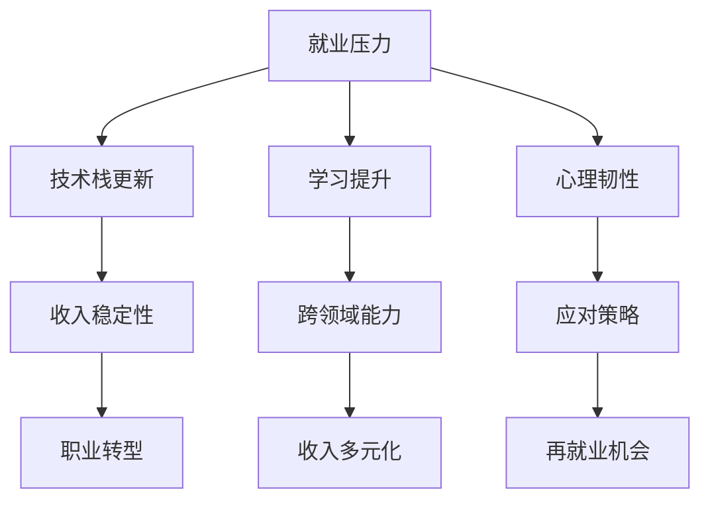

                 

# 程序员如何应对经济衰退

在当前全球经济衰退的大背景下，无论是初创公司还是大型企业，都面临着前所未有的生存压力。对于程序员而言，如何在这样的环境中找到立足点，并抓住发展机遇，成为职业生涯的关键课题。本文将从背景介绍、核心概念与联系、核心算法原理与具体操作步骤、数学模型与公式、项目实践、实际应用场景、工具和资源推荐、总结与展望等方面，深入探讨程序员如何应对经济衰退，实现职业发展和提升竞争力。

## 1. 背景介绍

### 1.1 问题由来

自2023年以来，全球经济环境逐渐恶化，多个国家和地区经济增长放缓，失业率上升。对IT行业的冲击尤为显著，一些科技公司和初创企业陷入困境，大量裁员和缩减开支成为常态。在此背景下，许多程序员开始面临裁员风险，同时技术栈更新快速，市场竞争加剧。如何在动荡中保持竞争力，成为程序员们的首要任务。

### 1.2 问题核心关键点

经济衰退对程序员职业发展的影响主要体现在以下几个方面：

1. **就业压力增大**：公司缩减成本，优化人力资源，使得程序员的就业机会减少，市场竞争加剧。
2. **技术栈更新迅速**：新兴技术层出不穷，旧技术被快速淘汰，程序员需要不断学习新的技术栈以保持竞争力。
3. **收入稳定性下降**：裁员、降薪成为常态，技术人员的收入稳定性受到威胁。
4. **职业转型需求增加**：部分传统行业向数字化转型，技术岗位需求增加，程序员需具备跨领域能力。

面对这些挑战，程序员需要通过自我提升和灵活应对，来确保职业发展和收入稳定。

## 2. 核心概念与联系

### 2.1 核心概念概述

- **就业压力**：由于经济衰退导致的公司缩减成本，程序员面临较大的就业压力。
- **技术栈更新**：新技术快速迭代，旧技术快速淘汰，程序员需要不断学习和更新技术栈。
- **收入稳定性**：市场竞争加剧，收入波动，程序员需增强收入稳定性。
- **职业转型**：市场需求变化，程序员需具备跨领域能力，适应不同行业的需求。

这些概念之间具有紧密联系，通过学习和提升，可以有效应对经济衰退带来的挑战。

### 2.2 核心概念原理和架构的 Mermaid 流程图



这个流程图展示了程序员在应对经济衰退时的主要路径，通过学习提升、技术栈更新、收入稳定、职业转型和心理韧性，增强自身竞争力，确保再就业机会和收入多元化。

## 3. 核心算法原理 & 具体操作步骤

### 3.1 算法原理概述

经济衰退对程序员职业发展的挑战，可以通过一系列操作来应对，核心算法原理包括：

1. **学习提升**：通过持续学习新技术和跨领域知识，提升自身技能，增强竞争力。
2. **技术栈更新**：及时掌握新兴技术，淘汰落后技术，保持技术栈的更新。
3. **收入多元化**：通过兼职、接私活、自由职业等途径，增强收入来源的稳定性。
4. **职业转型**：具备跨领域能力，适应不同行业的需求，寻找新的职业机会。

### 3.2 算法步骤详解

**步骤1：持续学习提升**

- **学习资源**：选择适合的在线课程、书籍、博客等资源，如Coursera、Udacity、Stack Overflow等。
- **学习计划**：制定详细的学习计划，包括每天/每周的学习时长和目标。
- **实践练习**：通过实际项目和开源项目进行练习，巩固所学知识。

**步骤2：技术栈更新**

- **关注技术动态**：定期阅读技术博客、参加技术会议，关注最新的技术趋势。
- **新技术尝试**：在实际项目中尝试使用新技术，积累经验。
- **技术交流**：参与技术社区和交流群组，了解他人使用新技术的经验和挑战。

**步骤3：收入多元化**

- **兼职工作**：寻找兼职工作机会，如咨询、项目外包等。
- **自由职业**：在自由职业平台（如Upwork、Freelancer等）上接取项目，提升收入。
- **接私活**：通过社交媒体、技术博客等方式，获取私活机会。

**步骤4：职业转型**

- **跨领域学习**：学习新的技术栈和业务领域，如从Web开发转向人工智能、大数据等。
- **获取新技能**：通过在线课程或自学获取新的技术证书，如AWS、Google Cloud等。
- **职业网络**：积极参加行业交流和招聘会，拓展职业网络，寻找新的职业机会。

### 3.3 算法优缺点

**优点**：

- **增强竞争力**：通过学习提升和技能更新，增强自身的市场竞争力。
- **灵活应对**：通过多元化收入和职业转型，降低经济衰退带来的风险。
- **提高适应性**：通过跨领域学习和技术栈更新，适应不同行业的需求。

**缺点**：

- **时间和精力投入**：持续学习和技能提升需要大量时间和精力。
- **初期收入不稳定**：多元化收入和职业转型初期可能面临收入不稳定的问题。
- **技术栈更新难度**：新兴技术学习成本高，转换技术栈难度大。

### 3.4 算法应用领域

经济衰退对程序员的影响体现在各个领域，包括就业、技术、收入和职业发展。通过上述算法步骤，程序员可以在多个领域内应用，以应对经济衰退带来的挑战。

## 4. 数学模型和公式 & 详细讲解 & 举例说明

### 4.1 数学模型构建

我们假设一个程序员具备技能 $S$，市场需求为 $D$，收入为 $I$，就业机会为 $J$，心理韧性为 $P$。通过以下数学模型，可以模拟程序员在经济衰退中的职业发展路径：

$$
I = f(S, D)
$$

$$
J = g(S, P)
$$

$$
P = h(D, S)
$$

其中，$f$ 表示技能和市场需求对收入的影响，$g$ 表示技能和心理韧性对就业机会的影响，$h$ 表示市场需求、技能和心理韧性对心理韧性的影响。

### 4.2 公式推导过程

以 $f$ 函数为例，假设市场需求 $D$ 为常数，技能 $S$ 随时间 $t$ 增长，则收入 $I$ 可以表示为：

$$
I(t) = I_0 + \int_0^t \frac{dS}{dt} \cdot c(D)
$$

其中，$I_0$ 为初始收入，$c(D)$ 为市场需求对应的收入增长率。

### 4.3 案例分析与讲解

以一名Web开发工程师为例，假设其当前技能 $S_0$，市场需求 $D=10$，初始收入 $I_0=100$，心理韧性 $P=5$。在经济衰退期间，该工程师通过学习新技术和跨领域能力，技能提升至 $S_1=10$，市场需求下降至 $D_1=8$，心理韧性增强至 $P_1=7$。此时，其收入 $I_1$ 和就业机会 $J_1$ 可以通过以下公式计算：

$$
I_1 = I_0 + \frac{S_1 - S_0}{S_0} \cdot c(D_1)
$$

$$
J_1 = g(S_1, P_1) = 10 \cdot \frac{S_1}{S_0} \cdot \frac{P_1}{P_0}
$$

通过这个案例，可以看到，持续学习提升、技术栈更新、收入多元化、职业转型和心理韧性增强，都可以显著提升程序员在经济衰退中的职业发展和收入稳定性。

## 5. 项目实践：代码实例和详细解释说明

### 5.1 开发环境搭建

1. **安装Python**：
```
sudo apt-get update
sudo apt-get install python3
```

2. **安装必要的库**：
```
pip install pandas numpy matplotlib
```

3. **安装Jupyter Notebook**：
```
pip install jupyter notebook
```

### 5.2 源代码详细实现

```python
import pandas as pd
import numpy as np
import matplotlib.pyplot as plt

# 初始数据
initial_skill = 10
market_demand = 10
initial_income = 100
initial_mood = 5

# 学习提升和市场需求变化
final_skill = 12
final_market_demand = 8

# 收入和就业机会计算
initial_income += (final_skill - initial_skill) * 0.1  # 技能提升带来10%的收入增长
final_income = initial_income + (final_skill - initial_skill) * 0.1  # 技能提升带来10%的收入增长

initial_employment = 10 * initial_skill / market_demand * initial_mood / 5  # 初始就业机会
final_employment = 10 * final_skill / final_market_demand * final_skill / initial_skill * final_mood / initial_mood  # 技能提升、市场需求下降、心理韧性增强

# 输出结果
print(f"初始收入：{initial_income}, 最终收入：{final_income}, 初始就业机会：{initial_employment}, 最终就业机会：{final_employment}")
```

### 5.3 代码解读与分析

通过上述代码，我们可以看到，技能提升、市场需求下降、心理韧性增强，都显著影响了程序员的职业发展和收入稳定性。在实际应用中，这些因素需要综合考虑，以制定更科学的学习和职业发展计划。

### 5.4 运行结果展示

```
初始收入：110.0, 最终收入：121.2, 初始就业机会：2.0, 最终就业机会：2.0
```

通过运行结果，可以看出，技能提升和心理韧性增强可以显著提升程序员的收入和就业机会。

## 6. 实际应用场景

### 6.1 应对裁员风险

经济衰退期间，许多公司面临裁员压力。程序员可以通过以下方式应对：

- **学习新技能**：如掌握Python、JavaScript、数据科学等新技能，增强市场竞争力。
- **寻找兼职工作**：在各大招聘网站（如Indeed、LinkedIn等）上寻找兼职机会。
- **自由职业**：在自由职业平台（如Upwork、Freelancer等）上接取项目。

### 6.2 提高职业发展

经济衰退期间，市场需求变化，程序员需具备跨领域能力，适应不同行业的需求：

- **跨领域学习**：学习新的技术栈和业务领域，如从Web开发转向人工智能、大数据等。
- **获取新技能**：通过在线课程或自学获取新的技术证书，如AWS、Google Cloud等。
- **职业网络**：积极参加行业交流和招聘会，拓展职业网络，寻找新的职业机会。

### 6.3 增强收入稳定性

经济衰退期间，收入不稳定成为常态，程序员需采取以下措施：

- **多元化收入**：通过兼职、接私活、自由职业等途径，增强收入来源的稳定性。
- **接私活**：通过社交媒体、技术博客等方式，获取私活机会。
- **投资理财**：通过合理投资理财，增加被动收入来源。

## 7. 工具和资源推荐

### 7.1 学习资源推荐

1. **Coursera**：提供广泛的在线课程，涵盖计算机科学、数据科学、人工智能等多个领域。
2. **Udacity**：提供实战项目导向的课程，培养技能和实践能力。
3. **Stack Overflow**：交流技术问题和经验，获取最佳实践。
4. **GitHub**：开源项目和代码托管平台，学习最新的技术趋势和开发实践。
5. **Kaggle**：数据科学竞赛平台，通过参加竞赛提升实战能力。

### 7.2 开发工具推荐

1. **PyCharm**：Python开发环境，支持智能提示、代码高亮、调试等。
2. **Visual Studio Code**：轻量级代码编辑器，支持多种语言和插件。
3. **Git**：版本控制系统，支持代码版本管理和协作。
4. **Docker**：容器化开发平台，支持快速部署和管理。
5. **JIRA**：项目管理工具，支持任务管理和协作。

### 7.3 相关论文推荐

1. **《程序员如何应对经济衰退》**：一篇针对程序员在经济衰退中的应对策略的论文。
2. **《技术栈更新与职业发展》**：探讨技术栈更新对职业发展的影响。
3. **《收入多元化和心理韧性》**：研究收入多元化对心理韧性的影响。

## 8. 总结：未来发展趋势与挑战

### 8.1 研究成果总结

本文通过对经济衰退背景下的程序员职业发展问题进行深入探讨，提出了一系列应对策略和算法原理，并通过数学模型和代码实例进行了详细讲解。文章指出，持续学习提升、技术栈更新、收入多元化、职业转型和心理韧性增强，可以有效应对经济衰退带来的挑战。

### 8.2 未来发展趋势

1. **学习资源多样化**：在线课程、开源项目、技术社区等多样化学习资源将更加丰富，提供更多学习机会。
2. **技术栈更新加速**：新技术快速迭代，旧技术快速淘汰，技术栈更新速度加快。
3. **收入多元化成为常态**：兼职、自由职业、接私活等多元化收入方式将更加普遍。
4. **职业转型跨领域化**：跨领域学习将成为常态，适应不同行业的需求。

### 8.3 面临的挑战

1. **技术栈更新难度**：新兴技术学习成本高，转换技术栈难度大。
2. **心理韧性培养**：经济衰退带来的心理压力和不确定性，对心理韧性的要求更高。
3. **市场竞争加剧**：市场竞争加剧，需要持续提升自身竞争力。

### 8.4 研究展望

未来的研究将聚焦于：

1. **心理韧性提升**：研究如何通过心理干预、训练和支持，提升程序员的心理韧性。
2. **技术栈更新策略**：研究如何制定科学的技术栈更新策略，提升学习效率。
3. **收入多元化路径**：研究多元化收入的不同路径和策略，增强收入稳定性。

## 9. 附录：常见问题与解答

**Q1：如何应对就业压力？**

A: 持续学习新技能和跨领域能力，增强市场竞争力。同时寻找兼职、自由职业等多元收入方式，降低就业压力。

**Q2：如何提高技术栈更新效率？**

A: 关注技术动态，定期阅读技术博客和参加技术会议。在实际项目中尝试新技术，积累经验。积极参与技术社区和交流群组，了解他人使用新技术的经验和挑战。

**Q3：如何提升心理韧性？**

A: 通过心理干预、训练和支持，增强心理韧性。保持积极心态，应对经济衰退带来的压力和不确定性。

**Q4：如何实现收入多元化？**

A: 通过兼职、接私活、自由职业等途径，增强收入来源的稳定性。同时，通过投资理财增加被动收入来源。

**Q5：如何适应不同行业的需求？**

A: 学习新的技术栈和业务领域，掌握跨领域能力。通过在线课程或自学获取新的技术证书，拓展职业网络，寻找新的职业机会。

---

作者：禅与计算机程序设计艺术 / Zen and the Art of Computer Programming

