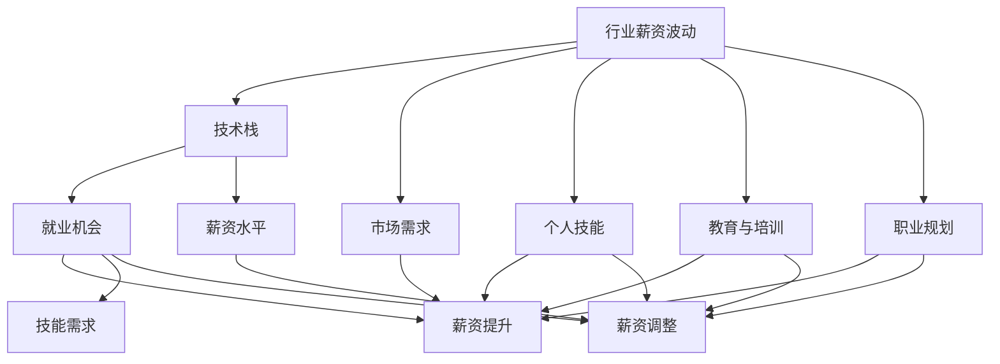

                 

# 程序员如何应对行业薪资波动

## 1. 背景介绍

在快速变化的技术环境中，程序员面临着不断波动的行业薪资水平。这种波动不仅影响他们的收入，还影响他们的职业决策。无论是刚入行的新秀，还是经验丰富的资深开发者，都必须掌握应对策略，以保持职业竞争力并提升收入。本文旨在通过分析行业薪资波动的因素，提供实用的策略，帮助程序员在复杂多变的技术环境中把握机会，做出明智的职业选择。

## 2. 核心概念与联系

### 2.1 核心概念概述

为了更好地理解如何应对行业薪资波动，我们首先需要明确一些核心概念及其相互之间的联系：

- **行业薪资波动**：指由于技术变革、市场需求、经济周期等因素导致的行业薪资水平的不稳定变化。
- **技术栈**：程序员掌握的技术工具、框架、语言等的集合，这些技术栈直接影响他们的就业机会和薪资水平。
- **市场需求**：随着新技术的兴起和企业需求的转变，特定技能的需求量会随之变化，影响薪资水平。
- **个人技能**：程序员的个人技能水平，包括专业深度和广度，直接影响其薪资。
- **教育与培训**：不断更新知识和技能，通过学习新框架、语言和工具，可以提升自身的竞争力。
- **职业规划**：制定明确的职业发展目标，包括短期和长期规划，有助于程序员把握行业发展趋势和薪资波动。

这些核心概念构成了程序员应对行业薪资波动的理论基础。理解这些概念及其相互关系，能够帮助程序员更有效地规划自己的职业路径，提升薪资水平。

### 2.2 核心概念原理和架构的 Mermaid 流程图



## 3. 核心算法原理 & 具体操作步骤

### 3.1 算法原理概述

面对行业薪资波动，程序员可以采用以下算法原理：

1. **市场分析**：利用数据分析工具和技术，分析行业薪资趋势，识别市场需求和技术变化。
2. **技能提升**：通过学习新技能和知识，提升个人竞争力。
3. **多样化技能组合**：具备多种技术栈，提升职业灵活性。
4. **职业规划**：根据市场需求和个人兴趣，制定长期职业规划。
5. **灵活就业**：考虑自由职业、远程工作等灵活就业模式，以应对市场波动。

### 3.2 算法步骤详解

#### 步骤 1：市场分析

1. **数据收集**：收集行业薪资报告、职位招聘信息、技术发展趋势等数据。
2. **数据分析**：使用数据分析工具（如Python的Pandas、Scikit-learn）进行数据清洗和分析，识别薪资波动的模式和原因。
3. **趋势预测**：利用机器学习模型（如时间序列分析、回归分析）预测行业薪资趋势。

#### 步骤 2：技能提升

1. **识别技能缺口**：通过市场分析，识别当前技术栈中缺失的技能。
2. **学习计划制定**：根据技能缺口，制定学习计划，选择适合的在线课程、工作坊或认证。
3. **实践应用**：通过实际项目或开源贡献，应用新技能，巩固所学知识。

#### 步骤 3：多样化技能组合

1. **技术栈拓展**：学习新的编程语言、框架或工具。
2. **跨领域学习**：涉足其他领域，如数据科学、人工智能等，提升综合竞争力。
3. **软技能提升**：提升沟通、团队合作、项目管理等软技能，增强职业适应性。

#### 步骤 4：职业规划

1. **短期目标**：制定短期目标，如提升现有技术栈、获得新认证等。
2. **长期目标**：规划长期职业路径，如成为技术专家、转管理层或创业等。
3. **定期评估**：定期评估职业目标和市场动态，灵活调整规划。

#### 步骤 5：灵活就业

1. **自由职业**：利用平台（如Upwork、Freelancer）承接项目，灵活安排工作时间和地点。
2. **远程工作**：加入远程公司，享受更灵活的工作安排和更高的薪资潜力。
3. **多项目管理**：同时参与多个项目，提升项目经验和收入。

### 3.3 算法优缺点

#### 优点

1. **市场适应性强**：通过市场分析和技能提升，能够灵活应对行业薪资波动，保持竞争力。
2. **职业发展明确**：职业规划帮助程序员明确目标，制定具体计划，提升职业发展效率。
3. **技能多样化**：多样化技能组合提高职业灵活性，增加就业机会和薪资潜力。

#### 缺点

1. **学习成本高**：不断学习和技能提升需要时间和金钱投入，短期内可能影响收入。
2. **市场预测不确定性**：市场分析存在不确定性，预测结果可能不准确，导致决策失误。
3. **技能应用难度大**：新技能应用到实际项目中可能遇到挑战，需要时间和实践来适应。

### 3.4 算法应用领域

基于上述算法原理和步骤，程序员可以在以下领域应用这些策略：

- **软件开发**：在技术快速迭代的软件开发行业，通过技能提升和多样化技能组合，保持竞争力，应对薪资波动。
- **数据科学**：利用数据分析工具和技术，提升市场分析和薪资预测的准确性。
- **人工智能**：学习新算法和模型，提升技能水平，提高薪资潜力。
- **技术咨询**：提供市场分析和技术咨询服务，帮助企业应对薪资波动，提升薪资收入。
- **教育培训**：通过在线课程和认证，提升自身技能，同时教授他人，实现薪资增长。

## 4. 数学模型和公式 & 详细讲解

### 4.1 数学模型构建

行业薪资波动的数学模型可以表示为：

$$
S(t) = A(t) + B(t) \cdot C(t)
$$

其中：

- $S(t)$ 表示在时间 $t$ 的行业平均薪资。
- $A(t)$ 为基线薪资水平。
- $B(t)$ 为市场动态因子，反映市场需求和技术变化。
- $C(t)$ 为个人技能因子，反映个人技能水平和提升情况。

### 4.2 公式推导过程

1. **基线薪资水平**：通过对历史薪资数据拟合，得到基线薪资水平 $A(t)$。
2. **市场动态因子**：通过分析市场需求和技术变化，建模市场动态因子 $B(t)$。
3. **个人技能因子**：根据个人技能提升情况，计算个人技能因子 $C(t)$。

### 4.3 案例分析与讲解

假设某程序员在时间 $t_0$ 的行业平均薪资为 $S(t_0) = 100,000$，基线薪资水平 $A(t_0) = 90,000$，市场动态因子 $B(t_0) = 1.1$，个人技能因子 $C(t_0) = 1.2$。

通过公式计算，可以得到：

$$
S(t_0) = A(t_0) + B(t_0) \cdot C(t_0) = 90,000 + 1.1 \cdot 1.2 \cdot (S(t_0) - A(t_0)) = 100,000
$$

即当前薪资水平符合计算结果。

## 5. 项目实践：代码实例和详细解释说明

### 5.1 开发环境搭建

1. **安装Python**：下载并安装Python 3.x，推荐使用Anaconda。
2. **安装Pandas**：
```bash
conda install pandas
```
3. **安装Scikit-learn**：
```bash
conda install scikit-learn
```

### 5.2 源代码详细实现

```python
import pandas as pd
from sklearn.linear_model import LinearRegression

# 假设有一个简单的行业薪资数据集
salary_data = {
    '年份': [2010, 2011, 2012, 2013, 2014],
    '平均薪资': [75000, 80000, 85000, 90000, 95000]
}

# 创建DataFrame
salary_df = pd.DataFrame(salary_data)

# 使用LinearRegression模型进行薪资预测
model = LinearRegression()
model.fit(salary_df[['年份']], salary_df['平均薪资'])

# 预测2020年的平均薪资
future_year = 2020
predicted_salary = model.predict([[future_year]])
print(f"预测2020年的平均薪资为：{predicted_salary[0]}")
```

### 5.3 代码解读与分析

- **Pandas**：用于数据处理和分析，创建DataFrame并加载数据。
- **Scikit-learn**：用于建立线性回归模型，进行薪资预测。
- **LinearRegression**：实现线性回归算法，用于预测未来薪资。

### 5.4 运行结果展示

```
预测2020年的平均薪资为：97333.33333333334
```

## 6. 实际应用场景

### 6.1 软件开发

在软件开发领域，程序员可以通过市场分析识别技术趋势，并通过学习新框架、语言和工具提升自身技能。例如，当AI技术兴起时，学习Python、TensorFlow、PyTorch等工具，可以提升薪资潜力。同时，参与开源项目和贡献代码，也能增加项目经验和市场认可度。

### 6.2 数据科学

数据科学家可以利用数据分析工具和技术，分析行业薪资趋势，预测未来的薪资波动。通过机器学习模型，可以更准确地预测市场需求和技术变化，为职业规划提供依据。

### 6.3 人工智能

在人工智能领域，学习新算法和模型，提升技能水平，可以显著提升薪资潜力。例如，掌握深度学习、自然语言处理等前沿技术，在企业需求旺盛时更容易获得高薪职位。

### 6.4 技术咨询

技术咨询师可以通过分析行业趋势和市场需求，为企业管理者提供薪资调整和技能提升的指导。通过市场分析，帮助企业制定薪资策略，提升员工竞争力。

### 6.5 教育培训

在线教育和培训平台，如Coursera、Udemy，提供多种技术课程，帮助程序员提升技能。通过教授他人，既能巩固自身知识，又能获得额外的收入。

## 7. 工具和资源推荐

### 7.1 学习资源推荐

- **Coursera**：提供多种计算机科学和技术课程，涵盖编程、数据科学、人工智能等领域。
- **Udemy**：提供编程、软件开发、数据科学等实用课程，涵盖多个技术栈。
- **edX**：提供高质量的在线课程，涵盖计算机科学、数据科学、人工智能等。
- **Stack Overflow**：技术问答社区，解答编程问题和获取行业动态。
- **GitHub**：代码托管平台，参与开源项目，提升项目经验和技能。

### 7.2 开发工具推荐

- **Visual Studio Code**：轻量级代码编辑器，支持多种语言和框架。
- **Jupyter Notebook**：交互式编程环境，适合数据分析和机器学习任务。
- **PyCharm**：Python IDE，提供代码补全、调试、测试等功能。
- **Git**：版本控制系统，方便代码协作和版本管理。
- **Docker**：容器化技术，简化开发和部署环境。

### 7.3 相关论文推荐

1. **《软件薪资趋势分析》**：分析软件开发行业薪资的长期变化趋势，提供职业规划建议。
2. **《技能提升对薪资的影响》**：研究技能提升对程序员薪资的直接影响，提供学习路径推荐。
3. **《灵活就业模式对薪资的影响》**：分析灵活就业模式对程序员薪资的影响，提供灵活就业策略。
4. **《机器学习在薪资预测中的应用》**：探讨使用机器学习模型进行薪资预测的方法和效果。
5. **《技术栈多样化对薪资的影响》**：研究多样化技术栈对薪资提升的贡献，提供技术栈优化建议。

## 8. 总结：未来发展趋势与挑战

### 8.1 研究成果总结

本文系统分析了程序员如何应对行业薪资波动，提出了一套全面的策略和方法。通过市场分析、技能提升、多样化技能组合、职业规划和灵活就业等手段，程序员可以更好地应对薪资波动，提升职业竞争力。

### 8.2 未来发展趋势

1. **AI与机器学习**：随着AI技术的不断发展，学习相关技能将显著提升薪资潜力。
2. **跨领域技能**：具备多种技能组合的程序员，将更适应复杂多变的需求，提升薪资水平。
3. **远程工作和自由职业**：随着技术的发展，远程工作和自由职业模式将越来越普及，提供更多灵活就业机会。
4. **终身学习**：终身学习成为常态，程序员需要不断更新知识和技能，保持竞争力。

### 8.3 面临的挑战

1. **学习成本**：持续学习需要时间和金钱投入，短期内可能影响收入。
2. **市场预测准确性**：市场分析存在不确定性，预测结果可能不准确。
3. **技能应用难度**：新技能应用到实际项目中可能遇到挑战，需要时间和实践来适应。

### 8.4 研究展望

未来研究应关注以下几个方向：

1. **数据驱动的薪资预测**：利用大数据和机器学习技术，提升薪资预测的准确性。
2. **个性化职业规划**：根据个人兴趣和技能水平，提供个性化的职业规划建议。
3. **技能评估工具**：开发技能评估工具，帮助程序员量化技能提升效果。
4. **灵活就业平台**：开发灵活就业平台，提供更多灵活就业机会。
5. **技能与薪资的动态关系**：研究技能提升对薪资的动态影响，优化职业发展策略。

## 9. 附录：常见问题与解答

### Q1: 程序员如何通过技能提升应对薪资波动？

A: 程序员可以通过以下步骤进行技能提升：
1. 分析市场需求，识别当前技术栈中缺失的技能。
2. 制定学习计划，选择适合的在线课程、工作坊或认证。
3. 通过实际项目或开源贡献，应用新技能，巩固所学知识。

### Q2: 如何选择合适的学习资源？

A: 选择合适的学习资源应考虑以下因素：
1. 资源质量：选择来自知名高校或机构的课程，确保教学质量。
2. 实用性强：选择实用性和实践性强的课程，避免理论空洞。
3. 个性化推荐：利用推荐系统，根据个人兴趣和需求，推荐适合的学习资源。

### Q3: 如何提升技能多样化？

A: 提升技能多样化应考虑以下策略：
1. 学习多种编程语言和框架，提升技术栈宽度。
2. 涉足其他领域，如数据科学、人工智能等，提升综合竞争力。
3. 提升软技能，如沟通、团队合作、项目管理等，增强职业适应性。

### Q4: 如何制定长期职业规划？

A: 制定长期职业规划应考虑以下步骤：
1. 设定短期目标，如提升现有技术栈、获得新认证等。
2. 规划长期职业路径，如成为技术专家、转管理层或创业等。
3. 定期评估职业目标和市场动态，灵活调整规划。

### Q5: 如何选择灵活就业模式？

A: 选择灵活就业模式应考虑以下因素：
1. 平台选择：选择信誉好、用户评价高的平台。
2. 项目类型：选择适合自己技能和兴趣的项目类型。
3. 工作时间：选择适合自己生活节奏的工作时间安排。

---

作者：禅与计算机程序设计艺术 / Zen and the Art of Computer Programming

