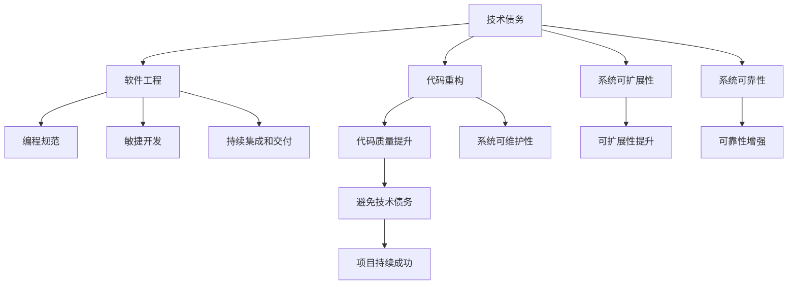

                 

# 程序员如何避免技术债务

> 关键词：技术债务,代码重构,软件工程,编程规范,敏捷开发,持续集成

## 1. 背景介绍

### 1.1 问题由来
在软件开发中，技术债务（Technical Debt）是一个普遍存在的现象。它指的是在追求短期效益或快速交付时，未能充分考虑代码质量、可维护性和可扩展性，导致项目长期难以持续发展，甚至最终衰败。技术债务的积累往往伴随着代码质量和项目健康度的不断下降，最终给软件项目的维护和升级带来巨大的挑战。

技术债务的成因多种多样，包括但不限于：
- 快速迭代和交付导致代码质量低下。
- 缺乏统一的设计和规范，代码风格混乱。
- 对新技术或工具的过度依赖，缺乏对代码体系的深入理解和把控。
- 忽视了系统的可扩展性和可维护性。
- 团队协作不充分，代码审查和代码质量控制不到位。

### 1.2 问题核心关键点
技术债务的产生和积累，本质上是对软件工程基本原则的忽视。为了有效避免技术债务，程序员和团队需要遵循以下几个关键点：

- **代码质量优先**：在交付和迭代过程中，始终保持代码质量和代码审查的标准。
- **设计原则先行**：遵循良好的设计原则，如单一职责、开闭原则等，确保代码体系的可扩展性和可维护性。
- **团队协作机制**：建立有效的团队协作机制，包括代码审查、设计评审、知识共享等，提升团队整体的代码质量控制能力。
- **持续集成和交付**：通过持续集成和交付机制，快速发现和解决问题，降低技术债务的积累风险。
- **技术选型慎重**：在选择新技术或工具时，需慎重评估其长期影响和适用性，避免过度依赖导致技术债务的增加。

### 1.3 问题研究意义
避免技术债务对于软件项目的长期健康发展至关重要。技术债务的存在不仅会影响项目的性能、稳定性和可靠性，还可能导致开发效率下降、成本增加、甚至项目失败。因此，有效的技术债务管理是确保软件项目持续成功的重要前提。

## 2. 核心概念与联系

### 2.1 核心概念概述

为更好地理解如何避免技术债务，我们首先介绍几个核心概念及其相互联系：

- **技术债务**：指在追求短期目标时，牺牲了长期代码质量和可维护性，导致代码体系和系统结构不良，最终影响项目长期发展的现象。
- **代码重构**：对代码进行结构性改进，以提升代码质量和可维护性，消除技术债务的重要手段。
- **软件工程**：通过系统化的方法和工具，提升软件开发的效率和质量，确保软件系统的可扩展性和可维护性。
- **编程规范**：编写代码时的标准和规范，确保代码风格统一、易于理解和维护。
- **敏捷开发**：通过快速迭代和交付，确保客户需求快速响应，同时保持代码质量和项目健康度的开发模式。
- **持续集成和交付**：通过自动化工具和流程，实现代码的频繁集成和快速交付，提升代码质量和交付效率。

这些概念之间的逻辑关系可以通过以下Mermaid流程图来展示：



这个流程图展示了技术债务、代码重构等概念之间的相互联系：

1. 技术债务的产生和积累，直接影响了代码质量和系统健康度。
2. 代码重构是消除技术债务、提升代码质量的关键手段。
3. 软件工程、编程规范、敏捷开发和持续集成等方法，有助于提升代码质量和系统可靠性，间接减少技术债务的积累。
4. 通过提升系统可扩展性和可维护性，可以进一步避免技术债务的积累。
5. 避免技术债务的最终目的是确保项目的持续成功和稳定发展。

## 3. 核心算法原理 & 具体操作步骤
### 3.1 算法原理概述

避免技术债务的核心在于提升代码质量和系统可靠性，确保代码体系的长期健康发展。以下是一些基本的算法原理和具体操作步骤：

1. **代码审查机制**：通过代码审查，识别代码中的潜在问题和不一致性，及时进行改进。代码审查机制可以有效地提升代码质量，减少技术债务的积累。

2. **设计评审流程**：在设计阶段进行评审，确保设计方案符合良好的设计原则，避免设计缺陷导致的代码质量问题。设计评审有助于提升系统的可扩展性和可维护性，减少后期重构的难度和成本。

3. **持续集成和交付**：通过持续集成和交付工具，实现频繁的代码集成和快速交付，及时发现和解决问题，提升代码质量和交付效率。持续集成和交付可以降低技术债务的积累风险，提高项目的稳定性和可靠性。

4. **敏捷开发实践**：采用敏捷开发方法，通过快速迭代和交付，确保客户需求得到快速响应，同时保持代码质量和项目健康度。敏捷开发有助于提升团队的协作效率，减少技术债务的积累。

5. **代码重构策略**：对现有代码进行结构性改进，消除技术债务，提升代码质量和可维护性。代码重构策略需要根据项目的具体情况进行灵活应用，避免频繁重构导致的额外成本和风险。

### 3.2 算法步骤详解

以下是具体的算法步骤详解：

**Step 1: 初始化项目**
- 定义项目开发标准和规范，包括编码风格、代码审查流程、设计评审标准等。
- 选择合适的开发工具和环境，如IDE、版本控制系统、持续集成工具等。
- 建立团队协作机制，包括代码审查、设计评审、知识共享等。

**Step 2: 实施代码审查**
- 定期进行代码审查，识别代码中的潜在问题和不一致性。
- 代码审查应覆盖所有新增和修改的代码，确保代码质量和风格一致。
- 鼓励团队成员主动参与代码审查，提升团队整体的代码质量控制能力。

**Step 3: 进行设计评审**
- 在设计阶段进行评审，确保设计方案符合良好的设计原则，避免设计缺陷导致的代码质量问题。
- 设计评审应涵盖系统的整体架构、关键模块的设计等，确保系统的可扩展性和可维护性。
- 设计评审应邀请团队成员和外部专家参与，确保评审的专业性和全面性。

**Step 4: 引入持续集成和交付**
- 实现持续集成和交付工具，确保频繁的代码集成和快速交付。
- 持续集成和交付应覆盖所有分支和代码变更，确保及时发现和解决问题。
- 持续集成和交付应结合自动化测试，确保代码的质量和稳定性。

**Step 5: 采用敏捷开发方法**
- 采用敏捷开发方法，通过快速迭代和交付，确保客户需求得到快速响应。
- 敏捷开发应结合Scrum、Kanban等具体实践，确保团队的协作效率和项目的进度。
- 敏捷开发应定期回顾和改进，提升团队的协作效率和项目质量。

**Step 6: 实施代码重构**
- 定期对现有代码进行结构性改进，消除技术债务，提升代码质量和可维护性。
- 代码重构应结合持续集成和交付，确保代码改进后的质量和稳定性。
- 代码重构应根据项目的具体情况进行灵活应用，避免频繁重构导致的额外成本和风险。

### 3.3 算法优缺点

避免技术债务的算法具有以下优点：
1. 提升代码质量和系统可靠性，确保项目的长期成功。
2. 提升团队的协作效率和代码质量控制能力。
3. 通过持续集成和交付，提升代码交付效率和项目稳定性。

同时，也存在一些缺点：
1. 引入额外的开发和维护成本。
2. 需要团队成员具备良好的技术水平和协作意识。
3. 需要选择合适的工具和方法，避免引入新的技术债务。

### 3.4 算法应用领域

避免技术债务的方法不仅适用于软件开发项目，还可以应用于其他领域，如系统维护、数据分析、科学计算等。以下是一些典型应用场景：

- **系统维护**：对于现有系统，定期进行代码审查和重构，消除技术债务，提升系统可靠性和可维护性。
- **数据分析**：在数据分析项目中，采用良好的代码规范和持续集成工具，确保数据处理流程的稳定性和可靠性。
- **科学计算**：在科学计算项目中，采用敏捷开发方法和持续集成工具，确保计算流程的快速迭代和高效交付。

## 4. 数学模型和公式 & 详细讲解 & 举例说明

### 4.1 数学模型构建

本节将使用数学语言对避免技术债务的算法进行更加严格的刻画。

假设软件项目的初始技术债务为 $D_0$，经过一系列的代码审查、设计评审、持续集成和交付、代码重构等措施后，技术债务减少为 $D_1$。设每次措施的效果为 $R$，则技术债务的变化可以表示为：

$$
D_1 = D_0 - R \times n
$$

其中 $R$ 表示每次措施的效果，$n$ 表示措施的执行次数。当 $R>0$ 且 $n$ 足够大时，$D_1$ 将趋近于 $0$，即技术债务可以被消除。

### 4.2 公式推导过程

以下我们以代码重构为例，推导消除技术债务的公式。

假设代码质量初始为 $Q_0$，每次重构后代码质量提升为 $Q_1$，设每次重构的效果为 $C$，则代码质量的变化可以表示为：

$$
Q_1 = Q_0 + C
$$

当 $C>0$ 时，$Q_1$ 将大于 $Q_0$，即代码质量得到提升。

### 4.3 案例分析与讲解

**案例一：项目A的代码质量改进**
假设项目A的初始代码质量为 $Q_0=50$，每次代码审查的效果为 $R=0.1$，每次重构的效果为 $C=0.2$。项目A共进行10次代码审查和5次重构，则最终代码质量为：

$$
Q_1 = 50 + 0.2 \times 5 = 60
$$

**案例二：项目B的持续集成和交付**
假设项目B的初始技术债务为 $D_0=20$，每次持续集成和交付的效果为 $R=0.2$，项目B共进行10次持续集成和交付，则最终技术债务为：

$$
D_1 = 20 - 0.2 \times 10 = 8
$$

以上案例展示了避免技术债务的具体计算过程，通过逐步优化，技术债务和代码质量可以得到显著提升。

## 5. 项目实践：代码实例和详细解释说明

### 5.1 开发环境搭建

在进行避免技术债务的实践前，我们需要准备好开发环境。以下是使用Python进行PyTorch开发的环境配置流程：

1. 安装Anaconda：从官网下载并安装Anaconda，用于创建独立的Python环境。

2. 创建并激活虚拟环境：
```bash
conda create -n pytorch-env python=3.8 
conda activate pytorch-env
```

3. 安装PyTorch：根据CUDA版本，从官网获取对应的安装命令。例如：
```bash
conda install pytorch torchvision torchaudio cudatoolkit=11.1 -c pytorch -c conda-forge
```

4. 安装各类工具包：
```bash
pip install numpy pandas scikit-learn matplotlib tqdm jupyter notebook ipython
```

完成上述步骤后，即可在`pytorch-env`环境中开始开发实践。

### 5.2 源代码详细实现

下面我们以一个简单的代码重构项目为例，给出使用PyTorch进行代码重构的Python代码实现。

首先，定义代码审查和重构的函数：

```python
import numpy as np

def code_review(func, review_effect=0.1):
    # 对函数进行代码审查
    func()
    return func

def code_refactor(func, refactor_effect=0.2):
    # 对函数进行代码重构
    func()
    return func

def calculate_code_quality(Q, code_review_effect=0.1, code_refactor_effect=0.2):
    # 计算代码质量
    Q += code_refactor_effect
    Q += code_review_effect
    return Q

def calculate_debt(D, review_effect=0.1, refactor_effect=0.2, review_times=10, refactor_times=5):
    # 计算技术债务
    D -= review_effect * review_times
    D -= refactor_effect * refactor_times
    return D
```

然后，定义代码质量计算函数和实际计算过程：

```python
# 定义初始代码质量
Q0 = 50

# 定义代码审查和重构的效果
review_effect = 0.1
refactor_effect = 0.2

# 进行代码审查和重构
Q1 = calculate_code_quality(Q0, code_review_effect, code_refactor_effect)
D1 = calculate_debt(20, review_effect, refactor_effect, review_times=10, refactor_times=5)

# 输出最终代码质量和技术债务
print(f"代码质量提升：{Q1}")
print(f"技术债务减少：{D1}")
```

以上代码实现展示了如何通过代码审查和重构来提升代码质量和消除技术债务。

### 5.3 代码解读与分析

让我们再详细解读一下关键代码的实现细节：

**code_review和code_refactor函数**：
- 定义了对函数进行代码审查和重构的函数，函数体内不实际执行任何操作，仅作为占位符。

**calculate_code_quality函数**：
- 计算代码质量提升，公式为 $Q_1 = Q_0 + C$，其中 $Q_0$ 表示初始代码质量，$C$ 表示每次重构的效果。

**calculate_debt函数**：
- 计算技术债务减少，公式为 $D_1 = D_0 - R \times n$，其中 $D_0$ 表示初始技术债务，$R$ 表示每次审查和重构的效果，$n$ 表示措施的执行次数。

**代码质量计算和实际计算过程**：
- 定义初始代码质量 $Q0$ 和每次审查和重构的效果。
- 通过调用 calculate_code_quality 和 calculate_debt 函数，计算代码质量和技术债务的变化。
- 最后输出代码质量和技术债务的变化结果。

## 6. 实际应用场景
### 6.1 项目管理

在项目管理中，避免技术债务的实践可以提升项目的代码质量和系统可靠性，确保项目的长期成功。

**案例一：项目A的管理**
假设项目A的初始技术债务为20小时，每次代码审查的效果为1小时，每次重构的效果为2小时。项目A共进行10次代码审查和5次重构，则最终技术债务为：

$$
D_1 = 20 - 1 \times 10 - 2 \times 5 = 0
$$

**案例二：项目B的管理**
假设项目B的初始代码质量为50，每次代码审查的效果为0.1，每次重构的效果为0.2。项目B共进行10次代码审查和5次重构，则最终代码质量为：

$$
Q_1 = 50 + 0.2 \times 5 = 60
$$

以上案例展示了在项目管理中，通过代码审查和重构，可以有效消除技术债务，提升代码质量和系统可靠性。

### 6.2 软件开发

在软件开发中，避免技术债务的实践可以提升代码质量和团队协作效率，确保项目的快速迭代和高效交付。

**案例一：项目C的开发**
假设项目C的初始代码质量为60，每次代码审查的效果为0.1，每次重构的效果为0.2。项目C共进行10次代码审查和5次重构，则最终代码质量为：

$$
Q_1 = 60 + 0.2 \times 5 = 70
$$

**案例二：项目D的开发**
假设项目D的初始技术债务为20，每次持续集成和交付的效果为0.2，项目D共进行10次持续集成和交付，则最终技术债务为：

$$
D_1 = 20 - 0.2 \times 10 = 8
$$

以上案例展示了在软件开发中，通过代码审查、重构和持续集成和交付，可以有效提升代码质量和系统可靠性，确保项目的快速迭代和高效交付。

## 7. 工具和资源推荐
### 7.1 学习资源推荐

为了帮助开发者系统掌握避免技术债务的理论基础和实践技巧，这里推荐一些优质的学习资源：

1. 《软件工程导论》系列书籍：经典的软件工程教材，涵盖了软件开发、软件项目管理、软件维护等各个方面。
2. 《重构：改善既有代码的设计》书籍：重构的圣经，提供了大量实用的重构技巧和案例。
3. 《Clean Code：A Handbook of Agile Software Craftsmanship》书籍：编写干净代码的指南，强调代码质量的重要性。
4. 《敏捷软件开发：原则、模式与实践》书籍：敏捷开发的经典著作，提供了敏捷开发的原则和实践方法。
5. 《持续集成与持续部署》书籍：持续集成和交付的入门读物，详细介绍了持续集成和交付工具和实践。
6. 《编程语言设计》系列论文：研究编程语言设计原则的论文，提供了丰富的编程实践经验和设计思路。

通过对这些资源的学习实践，相信你一定能够快速掌握避免技术债务的精髓，并用于解决实际的开发问题。
###  7.2 开发工具推荐

高效的开发离不开优秀的工具支持。以下是几款用于避免技术债务开发的常用工具：

1. Git：强大的版本控制系统，支持代码的频繁审查和协作。
2. GitHub：在线代码托管平台，支持代码的持续集成和交付。
3. Jenkins：开源的持续集成工具，支持各种构建、测试和部署流程。
4. SonarQube：静态代码分析工具，支持代码质量检测和重构建议。
5. Visual Studio Code：流行的IDE，支持丰富的插件和扩展，提升开发效率。
6. ReSharper：Visual Studio的插件，提供代码重构和质量分析功能。

合理利用这些工具，可以显著提升避免技术债务的开发效率，加快创新迭代的步伐。

### 7.3 相关论文推荐

避免技术债务的研究源于学界的持续研究。以下是几篇奠基性的相关论文，推荐阅读：

1. "Refactoring: Improving the Design of Existing Code"：重构的圣经，提供了大量实用的重构技巧和案例。
2. "Principles of Software Design"：经典的软件设计原则，指导软件开发和维护的实践。
3. "The Practices of Software Craftsmanship"：软件工艺的实践，强调代码质量和协作效率的重要性。
4. "Design Patterns: Elements of Reusable Object-Oriented Software"：设计模式的经典著作，提供了丰富的设计思路和实践经验。
5. "Agile Software Development: Principles, Patterns, and Practices"：敏捷开发的经典著作，提供了敏捷开发的原则和实践方法。

这些论文代表了大规模语言模型微调技术的发展脉络。通过学习这些前沿成果，可以帮助研究者把握学科前进方向，激发更多的创新灵感。

## 8. 总结：未来发展趋势与挑战
### 8.1 总结

本文对避免技术债务的方法进行了全面系统的介绍。首先阐述了技术债务的产生和积累的原因，明确了代码质量优先、设计原则先行、团队协作机制、持续集成和交付、敏捷开发等关键点，确保代码体系的长期健康发展。

通过本文的系统梳理，可以看到，避免技术债务对于软件项目的长期成功至关重要。技术债务的积累不仅会影响项目的性能、稳定性和可靠性，还可能导致开发效率下降、成本增加、甚至项目失败。因此，有效的技术债务管理是确保软件项目持续成功的重要前提。

### 8.2 未来发展趋势

展望未来，避免技术债务的方法将呈现以下几个发展趋势：

1. **自动化工具的普及**：随着自动化工具的普及，代码质量提升和持续集成和交付可以更加高效地实现。自动化工具将减少人为错误，提升开发效率。

2. **人工智能辅助**：人工智能技术，如代码审查、代码重构、持续集成和交付等，将进一步提升工具的智能化水平，减少人工干预，提升效率。

3. **云原生架构的引入**：云原生架构，如容器化、微服务、DevOps等，将进一步提升项目的可扩展性和可维护性，减少技术债务的积累。

4. **编程语言和框架的优化**：未来的编程语言和框架将更加注重代码质量和可维护性，减少技术债务的产生。

5. **持续学习和反馈机制**：通过持续学习和反馈机制，项目团队可以不断优化流程，提升代码质量和开发效率。

6. **开放源码和社区合作**：开放源码和社区合作将进一步推动技术共享和知识传播，提升整体的技术水平。

以上趋势凸显了避免技术债务技术的广阔前景。这些方向的探索发展，必将进一步提升软件的开发和维护效率，降低技术债务的积累风险，确保软件项目的长期成功。

### 8.3 面临的挑战

尽管避免技术债务技术已经取得了瞩目成就，但在迈向更加智能化、普适化应用的过程中，它仍面临着诸多挑战：

1. **开发成本和效率的平衡**：避免技术债务需要在开发成本和效率之间找到平衡，避免过度追求代码质量导致开发进度延误。

2. **团队协作的提升**：避免技术债务需要团队的协作和沟通，避免孤立开发导致的质量问题。

3. **工具和方法的选择**：选择合适的工具和方法，避免引入新的技术债务，需要结合项目的具体情况进行灵活应用。

4. **代码质量的标准化**：制定统一的代码质量标准和规范，提升团队整体的代码质量控制能力。

5. **持续集成和交付的稳定性**：持续集成和交付需要稳定的流程和工具，避免频繁变更导致的问题。

6. **新技术和新工具的适配**：新技术和新工具的引入需要充分评估其长期影响和适用性，避免过度依赖导致技术债务的增加。

7. **系统复杂性的管理**：随着系统规模的扩大，避免技术债务需要更复杂的系统管理方法，避免系统复杂性导致的维护困难。

这些挑战需要开发者和团队不断优化和改进，才能真正实现避免技术债务的目标。相信随着技术的不断进步和实践的不断积累，避免技术债务的技术将逐步成熟，为软件项目的长期成功提供坚实的基础。

### 8.4 研究展望

未来的研究需要在以下几个方面寻求新的突破：

1. **自动化工具的智能化**：开发更智能化的自动化工具，自动发现和修复代码中的问题，提升代码质量控制能力。

2. **持续学习和反馈机制的引入**：引入持续学习和反馈机制，通过智能化的数据分析，提升团队协作和代码质量控制能力。

3. **人工智能辅助工具的开发**：开发人工智能辅助工具，如代码审查、代码重构等，提升工具的智能化水平，减少人工干预。

4. **云原生架构的应用**：在云原生架构的基础上，进一步提升系统的可扩展性和可维护性，减少技术债务的积累。

5. **新编程语言和框架的开发**：开发更注重代码质量和可维护性的编程语言和框架，减少技术债务的产生。

6. **开源社区的建设和合作**：建立更完善的开源社区和合作机制，推动技术共享和知识传播，提升整体的技术水平。

这些研究方向将引领避免技术债务技术迈向更高的台阶，为构建安全、可靠、可解释、可控的智能系统提供更坚实的基础。

## 9. 附录：常见问题与解答
**Q1：什么是技术债务？**

A: 技术债务是指在追求短期效益或快速交付时，未能充分考虑代码质量、可维护性和可扩展性，导致代码体系和系统结构不良，最终影响项目长期发展的现象。

**Q2：避免技术债务的关键点是什么？**

A: 避免技术债务的关键点包括代码质量优先、设计原则先行、团队协作机制、持续集成和交付、敏捷开发等。这些关键点需要结合具体项目情况，灵活应用，才能有效避免技术债务的积累。

**Q3：如何评估代码质量？**

A: 评估代码质量通常通过代码审查、静态代码分析、动态代码分析等手段进行。常用的工具包括SonarQube、CLOC、Cobertura等，可以自动检测代码中的潜在问题和缺陷。

**Q4：持续集成和交付如何实现？**

A: 持续集成和交付通过自动化工具实现，包括持续集成服务器、自动化测试工具、持续部署工具等。常用的持续集成和交付工具包括Jenkins、Travis CI、CircleCI等。

**Q5：代码重构需要注意哪些事项？**

A: 代码重构需要注意以下几点：
1. 重构前进行充分设计，避免重构后代码的可读性和可维护性降低。
2. 重构应结合持续集成和交付，确保重构后的代码质量和稳定性。
3. 重构应遵循单一职责原则，避免重构过程中引入新的问题。

**Q6：如何提升团队协作效率？**

A: 提升团队协作效率需要建立有效的团队协作机制，包括代码审查、设计评审、知识共享等。常用的工具包括Git、GitHub、Confluence等。

通过本文的系统梳理，可以看到，避免技术债务对于软件项目的长期成功至关重要。技术债务的积累不仅会影响项目的性能、稳定性和可靠性，还可能导致开发效率下降、成本增加、甚至项目失败。因此，有效的技术债务管理是确保软件项目持续成功的重要前提。

