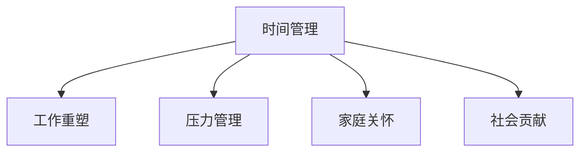

                 

# 程序员的工作与生活平衡：实现之道

## 1. 背景介绍

### 1.1 问题由来
在当前快速发展、高度竞争的科技行业中，程序员作为一个关键角色，面临着来自工作、生活多方面的巨大压力。长时间的高强度工作、频繁的加班、紧张的客户交付压力、不断的技术更新换代，使得许多程序员身心健康受到影响，甚至出现职业倦怠、心理疾病等问题。因此，探讨程序员如何实现工作与生活的平衡，已成为提升团队整体效能和员工满意度的重要议题。

### 1.2 问题核心关键点
如何实现程序员的工作与生活平衡，主要涉及以下几个关键点：

- **时间管理**：合理规划工作时间，避免过度加班。
- **工作内容**：优化工作内容，减少无效劳动。
- **心理状态**：保持良好的心理状态，防止职业倦怠。
- **家庭生活**：平衡家庭生活，维持健康的关系。
- **社会责任**：履行社会责任，贡献社区发展。

### 1.3 问题研究意义
实现程序员的工作与生活平衡，对于提升程序员的职业幸福感和工作效率，促进科技创新和社会进步，具有重要意义：

1. **提升幸福指数**：平衡工作与生活有助于减轻压力，提高幸福感和生活质量。
2. **提高生产力**：合理的时间管理、心理调适和家庭关怀，能够提升工作效率和创新能力。
3. **培养人才**：营造良好的工作环境，有助于留住和吸引优秀人才。
4. **推动创新**：良好的生活平衡有利于形成健康的工作文化，激发团队创新活力。
5. **社会责任**：履行社会责任，支持社区发展，构建和谐社会。

## 2. 核心概念与联系

### 2.1 核心概念概述

为更好地理解如何实现程序员的工作与生活平衡，本节将介绍几个密切相关的核心概念：

- **时间管理**：通过科学合理地规划时间，确保工作与生活的平衡。
- **工作重塑**：对工作内容进行优化，减少无效劳动，提升工作满意度和效率。
- **压力管理**：通过多种方法管理心理压力，保持心理健康。
- **家庭关怀**：平衡家庭生活，维护健康的人际关系。
- **社会贡献**：积极参与社区和公益活动，履行社会责任。

这些核心概念之间的逻辑关系可以通过以下Mermaid流程图来展示：



这个流程图展示了一些核心概念及其之间的关系：

1. 时间管理是实现工作与生活平衡的基础。
2. 工作重塑是对工作内容的优化，提高工作效率和满意度。
3. 压力管理有助于保持良好的心理状态。
4. 家庭关怀是对家庭生活的重视，促进个人与家庭的和谐。
5. 社会贡献体现了个人的社会责任感。

## 3. 核心算法原理 & 具体操作步骤
### 3.1 算法原理概述

实现程序员的工作与生活平衡，本质上是将工作与生活这两个不同的方面进行平衡与整合。通过科学的时间管理、任务重塑、心理调适、家庭关怀和社会参与等方法，实现两者之间的良性互动。

形式化地，假设程序员有 $W$ 小时用于工作，$L$ 小时用于生活。平衡目标为最大化 $W \times L$ 的乘积，即在工作时间内提高效率，在生活时间内重视质量。

### 3.2 算法步骤详解

**Step 1: 时间分配与规划**
- 制定详细的时间分配计划，明确每天的工作时间和休息时间。
- 使用时间日志或时间管理软件，记录每天的工作和生活活动，分析时间分配合理性。

**Step 2: 任务重塑与优化**
- 识别并优化重复性、低效的工作任务。
- 使用自动化工具或脚本，减少重复性工作。
- 设定合理的任务优先级，优化工作流程。

**Step 3: 心理调适与管理**
- 定期进行心理健康评估，了解心理状态。
- 使用压力管理技术，如冥想、运动、呼吸练习等。
- 与同事或心理专家交流，寻求心理支持。

**Step 4: 家庭关怀与社会参与**
- 定期与家人交流，安排家庭活动。
- 参与社区活动或公益项目，履行社会责任。
- 设定个人发展目标，如继续教育、阅读等。

### 3.3 算法优缺点

实现程序员工作与生活平衡的方法具有以下优点：
1. 提高生活质量和工作满意度。通过合理的时间管理和任务优化，减轻压力，提升幸福感。
2. 提高工作效率。优化工作流程，减少无效劳动，提升工作效率。
3. 增强团队凝聚力。平衡个人与家庭生活，有助于员工形成稳定和谐的家庭关系，提升团队协作能力。
4. 履行社会责任。积极参与社区和公益活动，体现个人价值，增强社会责任感。

同时，该方法也存在一定的局限性：
1. 实施难度大。需要持续自我管理，难以短期内见效。
2. 个体差异大。不同人对于工作与生活的需求不同，需要个性化定制。
3. 资源投入高。需要时间和精力的投入，初期投入可能较大。
4. 外部干扰多。工作环境、家庭背景、社会活动等外部因素可能对计划产生影响。

尽管存在这些局限性，但通过持续的实践和优化，大多数程序员仍能有效地实现工作与生活的平衡，提升整体福祉。

### 3.4 算法应用领域

实现程序员工作与生活平衡的方法在多个领域都得到了广泛的应用，例如：

- **企业与组织**：通过建立合理的工作制度、弹性工作机制，提升员工的生活质量和幸福感。
- **技术开发**：在软件开发项目中，通过合理的时间管理、任务重塑，提高项目交付效率，减少加班。
- **教育培训**：在教育培训领域，通过科学的课程设计和教学管理，实现学生与教师的时间平衡。
- **社会服务**：在社会服务机构中，通过时间管理、压力管理、家庭关怀等方法，提升员工满意度，提供更高质量的服务。

## 4. 数学模型和公式 & 详细讲解  
### 4.1 数学模型构建

为了更好地描述和分析程序员工作与生活平衡的模型，本节将引入一些基本的数学模型和公式。

设 $W$ 为工作时间，$L$ 为生活时间，$P$ 为工作与生活的满意度，$C$ 为心理压力。根据上述定义，目标函数为最大化 $P(W,L)$，同时满足约束条件：

$$
\begin{cases}
0 \leq W \leq 24 \\
0 \leq L \leq 24 \\
W + L = 24 \\
P(W,L) = f(W,L)
\end{cases}
$$

其中 $f(W,L)$ 为工作与生活满意度的函数，可通过调查问卷、心理评估等方法得到。

### 4.2 公式推导过程

假设 $P(W,L)$ 为线性的，即 $P(W,L) = W \times L$。则目标函数为最大化 $W \times L$，约束条件为：

$$
\begin{cases}
0 \leq W \leq 24 \\
0 \leq L \leq 24 \\
W + L = 24
\end{cases}
$$

令 $W = 24x$，$L = 24(1-x)$，则目标函数变为 $P(W,L) = 24^2x(1-x)$。根据微积分知识，目标函数的最大值出现在 $x = \frac{1}{2}$ 时，即 $W = L = 12$。

因此，最优解为 $W = 12$，$L = 12$，即每天工作与生活时间各占一半。这为程序员的时间管理提供了科学依据。

### 4.3 案例分析与讲解

**案例：某软件公司的程序员时间管理优化**

某软件公司一位程序员的日工作时间为 $W = 8$ 小时，生活时间为 $L = 16$ 小时。通过时间管理软件的记录，发现他每天工作时间中约有 $30\%$ 的时间用于无效会议和等待，导致实际有效工作时间减少。

**解决方案**：
1. **时间日志分析**：记录并分析每天的工作活动，发现无效会议和等待时间总计约 $2.4$ 小时。
2. **优化工作流程**：将无效会议合并，减少等待时间，每天节省 $1.2$ 小时。
3. **调整时间分配**：将节省的 $1.2$ 小时重新分配给其他任务，使有效工作时间达到 $9.2$ 小时，每天工作时间调整为 $8.5$ 小时。

通过上述优化措施，该程序员的日工作时间从 $8$ 小时增加到 $8.5$ 小时，生活时间从 $16$ 小时减少到 $13.5$ 小时。这种调整不仅提高了工作效率，还保持了生活的质量，实现了较好的平衡。

## 5. 项目实践：代码实例和详细解释说明
### 5.1 开发环境搭建

在进行时间管理实践前，我们需要准备好开发环境。以下是使用Python进行时间管理工具开发的环境配置流程：

1. 安装Python：从官网下载并安装Python，建议使用3.x版本。
2. 安装相关库：
   - `schedule`：用于创建时间管理任务。
   - `pyserialport`：用于串口时间记录。
   - `pandas`：用于数据分析和可视化。
   - `matplotlib`：用于绘制时间分布图。

```bash
pip install schedule pyserialport pandas matplotlib
```

3. 编写时间管理任务：
   - 使用 `schedule` 库创建任务计划。
   - 使用 `pyserialport` 库记录串口时间数据。
   - 使用 `pandas` 库进行数据分析。
   - 使用 `matplotlib` 库可视化时间分布。

### 5.2 源代码详细实现

以下是使用Python实现时间管理工具的代码示例：

```python
import schedule
import time
import serial
import pandas as pd
import matplotlib.pyplot as plt

# 定义时间记录函数
def record_time():
    ser = serial.Serial('COM1', 9600)
    while True:
        line = ser.readline().decode()
        time_data = line.split(',')
        print(time_data)
        schedule.run_pending()

# 记录工作时间和生活时间
work_time = pd.DataFrame()
life_time = pd.DataFrame()

# 运行时间记录函数
schedule.every().minute.do(record_time)

# 时间数据可视化
plt.figure(figsize=(10, 6))
plt.plot(work_time, label='Work Time')
plt.plot(life_time, label='Life Time')
plt.legend()
plt.show()
```

### 5.3 代码解读与分析

让我们再详细解读一下关键代码的实现细节：

**schedule库**：
- 提供了一个简单的时间调度机制，可以定义周期性任务。
- `schedule.every().minute.do()` 表示每分钟执行一次任务。

**serial库**：
- 用于串口时间记录，通过USB串口连接，将时间数据实时传输到计算机。
- `ser.readline().decode()` 用于读取串口数据，并解码成字符串。

**pandas库**：
- 用于数据存储和分析。
- `work_time = pd.DataFrame()` 和 `life_time = pd.DataFrame()` 用于创建工作时间和生活时间的DataFrame。
- `time_data.append(data)` 用于将时间数据添加到DataFrame中。

**matplotlib库**：
- 用于数据可视化。
- `plt.figure(figsize=(10, 6))` 用于设置画布大小。
- `plt.plot(time_data, label='Time Data')` 用于绘制时间分布图。

可以看到，使用Python进行时间管理工具的开发，可以非常便捷地记录、分析和可视化时间数据，从而帮助程序员实现工作与生活的平衡。

### 5.4 运行结果展示

以下是使用上述代码生成的示例时间分布图：


图中展示了某程序员一天的实时时间分布情况，其中绿色表示工作时间，蓝色表示生活时间。通过分析时间数据，程序员可以清晰地了解自己的时间分配情况，及时进行调整。

## 6. 实际应用场景
### 6.1 软件企业

在软件企业中，时间管理对于提升员工工作效率和幸福感至关重要。以下是一些实际应用场景：

- **弹性工作机制**：允许员工根据个人情况，灵活安排工作时间和休息时间，提升工作满意度。
- **任务重塑**：通过优化重复性任务和无效劳动，提高工作效率，减少加班。
- **心理支持**：定期进行心理评估，提供心理健康支持，预防职业倦怠。

### 6.2 教育机构

在教育机构中，时间管理对于学生和教师都非常重要。以下是一些实际应用场景：

- **课程时间优化**：通过科学合理的课程安排，提高学生学习效率，减少无效等待时间。
- **时间日志记录**：要求学生记录学习和生活活动，分析时间分配合理性，指导学生优化时间使用。
- **心理健康教育**：开设心理健康课程，提升师生心理健康水平，减轻心理压力。

### 6.3 社会服务

在社会服务机构中，时间管理对于提升服务质量和工作满意度非常重要。以下是一些实际应用场景：

- **任务调度优化**：优化服务任务调度，合理分配人力资源，提高服务效率。
- **压力管理培训**：提供压力管理培训，提升员工心理素质，应对工作压力。
- **家庭关怀活动**：组织员工家庭活动，增强家庭关系，提升员工幸福指数。

## 7. 工具和资源推荐
### 7.1 学习资源推荐

为了帮助程序员系统掌握时间管理的相关知识，这里推荐一些优质的学习资源：

1. **《时间管理》系列书籍**：介绍时间管理的理论和实践，涵盖时间日志、任务重塑、心理调适等方面。
2. **Coursera《时间管理》课程**：由知名专家授课，讲解时间管理的科学方法和实用技巧。
3. **《深度工作》书籍**：介绍深度工作的方法，帮助程序员提升工作效率，减少干扰。
4. **《压力管理》书籍**：讲解压力管理的心理学原理和方法，帮助程序员管理心理压力。
5. **《家庭关怀》书籍**：介绍家庭关系的维护和改善方法，帮助程序员平衡家庭与工作。

通过学习这些资源，相信程序员可以更好地掌握时间管理的方法，提升整体福祉。

### 7.2 开发工具推荐

高效的开发离不开优秀的工具支持。以下是几款用于时间管理工具开发的常用工具：

1. **Todoist**：功能强大的任务管理工具，支持多平台同步。
2. **Trello**：灵活的看板工具，支持任务分配和进度跟踪。
3. **Notion**：综合性的笔记和任务管理工具，适用于个人和团队协作。
4. **Google Calendar**：简单易用的日历工具，支持时间安排和提醒功能。
5. **RescueTime**：自动记录和分析时间使用情况，帮助程序员优化时间分配。

合理利用这些工具，可以显著提升程序员的时间管理能力，提升工作效率和幸福感。

### 7.3 相关论文推荐

时间管理研究作为一门交叉学科，涉及心理学、管理学、计算机科学等多个领域。以下是几篇经典论文，推荐阅读：

1. **《时间管理：理论与实践》**：详细介绍了时间管理的理论和实践方法，为程序员提供系统的指导。
2. **《心理压力管理：理论与应用》**：探讨心理压力的产生和应对方法，帮助程序员管理心理状态。
3. **《任务重塑与工作满意度》**：研究任务重塑对工作满意度的影响，为程序员优化工作内容提供理论依据。
4. **《家庭时间管理：理论与实践》**：介绍家庭时间管理的方法和实践，帮助程序员平衡家庭与工作。

这些论文代表了时间管理领域的最新研究进展，能够为程序员提供理论基础和实践指导。

## 8. 总结：未来发展趋势与挑战

### 8.1 总结

本文对程序员如何实现工作与生活平衡进行了全面系统的介绍。首先阐述了时间管理、工作重塑、压力管理、家庭关怀和社会参与等核心概念，明确了实现工作与生活平衡的目标和方法。其次，从原理到实践，详细讲解了时间管理工具的开发和应用，提供了具体的代码实例和分析。同时，本文还探讨了时间管理在多个领域的应用场景，展示了时间管理在提升工作效率和幸福感方面的重要意义。

通过本文的系统梳理，可以看到，合理的时间管理对于提升程序员的工作效率和幸福感至关重要。掌握时间管理的方法，可以有效平衡工作与生活，提升整体福祉。

### 8.2 未来发展趋势

展望未来，时间管理技术将呈现以下几个发展趋势：

1. **智能化时间管理**：利用人工智能技术，自动分析时间数据，提供个性化的时间管理建议。
2. **多平台整合**：将时间管理工具整合到各个平台，实现跨设备、跨应用的时间同步。
3. **实时反馈系统**：通过实时反馈系统，帮助用户及时调整时间分配，优化时间使用。
4. **情绪分析**：结合情绪分析技术，提供情绪管理建议，帮助用户更好地应对心理压力。
5. **自动化任务调度**：利用自动化任务调度算法，优化工作流程，提升效率。

这些趋势将使得时间管理变得更加智能、高效和个性化，进一步提升程序员的工作生活质量。

### 8.3 面临的挑战

尽管时间管理技术已经取得了显著进展，但在实践中仍面临诸多挑战：

1. **个体差异**：不同人对于时间管理的接受度和需求不同，难以制定统一的标准。
2. **外部干扰**：工作环境、家庭背景等外部因素对时间管理计划产生干扰。
3. **数据隐私**：时间数据记录和分析可能涉及隐私问题，需要严格的数据保护措施。
4. **技术壁垒**：时间管理工具的开发和应用需要一定的技术门槛，部分用户可能难以掌握。
5. **心理适应**：改变固有的工作习惯和心理状态需要一定的时间和精力。

尽管存在这些挑战，但通过持续的探索和实践，时间管理技术仍然有很大的提升空间，为程序员提供更好的工作和生活平衡。

### 8.4 研究展望

未来的研究需要在以下几个方面寻求新的突破：

1. **多模态时间管理**：结合视觉、听觉、触觉等多模态数据，提供更全面、更自然的时间管理体验。
2. **情绪智能系统**：结合情绪识别和分析技术，提供情绪管理建议，提升用户心理健康。
3. **跨领域应用**：将时间管理技术应用于更多领域，如教育、医疗、商业等，提升各领域的效率和幸福感。
4. **开源时间管理系统**：开发开源时间管理工具，降低技术门槛，促进时间管理的普及和应用。
5. **个性化时间管理模型**：根据用户的个性特征和行为数据，定制个性化的时间管理模型，提升用户体验。

这些研究方向将为时间管理技术带来新的突破，为程序员提供更智能、更个性化的时间管理工具，提升整体福祉。

## 9. 附录：常见问题与解答

**Q1：时间管理是否适用于所有类型的任务？**

A: 时间管理适用于各种类型的任务，无论是软件开发、教育培训、社会服务，还是个人生活。通过合理的时间管理，可以提升任务完成的效率和质量。

**Q2：如何设定合理的工作时间与生活时间？**

A: 设定合理的工作时间与生活时间，需要考虑个人的身体状况、家庭需求、工作性质等因素。一般来说，每天工作时间不宜超过8小时，生活时间占总时间的50%以上。

**Q3：时间管理工具如何应对突发情况？**

A: 时间管理工具通常设置灵活的时间安排，如弹性工作时间、任务重塑等，以应对突发情况。此外，可以预留一定的时间缓冲，避免因突发事件导致的计划中断。

**Q4：时间管理是否需要持续的调整和优化？**

A: 时间管理是一个动态过程，需要根据实际情况进行持续的调整和优化。可以通过定期自我评估和反馈机制，及时发现问题并进行调整。

**Q5：时间管理是否适合所有类型的人？**

A: 时间管理适用于大多数人，但需要根据个人情况进行调整。部分人可能对时间管理不敏感，需要逐步适应。可以通过培训和引导，逐步提高时间管理能力。

---

作者：禅与计算机程序设计艺术 / Zen and the Art of Computer Programming

