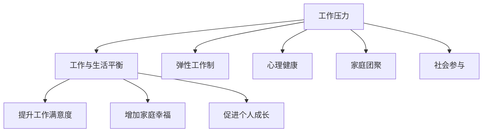

                 

# 程序员的工作与生活平衡：实现之道

## 1. 背景介绍

### 1.1 问题由来
在现代社会，随着信息技术的高速发展，程序员这一职业日益受到人们的关注和认可。然而，程序员面临的工作压力和工作生活不平衡问题也愈发严重。长时间加班、睡眠不足、工作与生活界限模糊等问题，严重影响了程序员的身心健康。

程序员的工作与生活平衡，不仅关系到个人的生活质量和幸福感，也关乎企业的长远发展和创新能力。因此，如何实现程序员的工作与生活平衡，成为当前IT行业急需解决的重大课题。

### 1.2 问题核心关键点
实现程序员的工作与生活平衡，核心在于平衡工作压力、工作时间与生活需求、休息时间之间的关系。一方面，程序员需要高效完成工作任务，确保项目按时交付；另一方面，他们也需要有足够的时间休息、与家人团聚、参与社会活动，保持身心健康。

要实现这一目标，需要从政策、技术、企业文化等多个方面综合考虑，采取有效措施，帮助程序员在高压环境下实现工作与生活的平衡。

## 2. 核心概念与联系

### 2.1 核心概念概述

为更好地理解程序员工作与生活平衡的实现之道，本节将介绍几个密切相关的核心概念：

- 工作压力(Work Pressure)：程序员在工作中承受的各种压力，包括项目截止压力、代码调试压力、团队协作压力等。
- 工作与生活平衡(Work-Life Balance)：程序员在职业生涯中平衡工作与生活，确保身心健康，提升幸福感。
- 弹性工作制(Flexible Work Hours)：允许程序员自主选择工作时间，提升工作满意度和生活质量。
- 心理健康(Mental Health)：程序员在高压环境中，维护心理健康的必要性和重要性。
- 家庭团聚(Family Reunion)：程序员在工作与生活之间寻找平衡，确保与家人团聚的时光。
- 社会参与(Social Engagement)：程序员参与社会活动，拓展视野，提升个人价值。

这些核心概念之间的逻辑关系可以通过以下Mermaid流程图来展示：



这个流程图展示了我国不同核心概念之间的关系：

1. 工作压力是程序员面临的主要问题，需要通过各种方式缓解。
2. 工作与生活平衡是最终目标，需要综合考虑工作压力、弹性工作制、心理健康、家庭团聚、社会参与等多方面因素。
3. 弹性工作制、心理健康、家庭团聚、社会参与等措施，有助于提升工作满意度、增加家庭幸福、促进个人成长，共同作用于实现工作与生活平衡。

## 3. 核心算法原理 & 具体操作步骤
### 3.1 算法原理概述

实现程序员的工作与生活平衡，本质上是一个多目标优化问题。其核心思想是：在一定的工作时间和任务压力下，寻找最优的工作和生活安排，最大化程序员的幸福感和生活质量。

形式化地，假设程序员的工作时间为 $T$，休息时间为 $R$，任务量为 $W$。设任务量为 $W$ 的完成概率为 $P_W$，休息时间 $R$ 带来的幸福感为 $H(R)$，则优化目标为：

$$
\max_{T, R} P_W \times H(R)
$$

约束条件为：

$$
T + R = 24 \text{ 小时}
$$

$$
P_W = \min\left(\frac{T}{T_{max}}, \frac{W}{T_{avg}}\right)
$$

其中 $T_{max}$ 为每天最大工作时间，$T_{avg}$ 为每天平均工作时间，$P_W$ 为任务完成的概率。

### 3.2 算法步骤详解

实现程序员的工作与生活平衡，主要包括以下几个关键步骤：

**Step 1: 识别工作压力和任务量**

- 通过问卷调查、数据分析等方式，识别程序员面临的主要工作压力和任务量。
- 评估任务量的变化趋势和峰值时期，确定不同时间段的压力水平。

**Step 2: 设定工作与生活平衡的目标**

- 根据公司的战略目标、企业文化和员工需求，设定具体的工作与生活平衡目标。
- 平衡目标可分解为多个子目标，如工作时间、休息时间、任务量等。

**Step 3: 设计弹性工作制**

- 根据员工的工作习惯、家庭情况和心理需求，设计弹性工作制，包括工作时间、午休时间、远程办公等。
- 设定弹性的工作时间上限和下限，确保工作时间的灵活性和稳定性。

**Step 4: 实施心理健康支持**

- 提供心理健康咨询服务，如心理咨询、压力管理培训等，帮助员工缓解工作压力。
- 建立健康生活方式支持系统，如健身房、健康饮食计划、运动活动等。

**Step 5: 促进家庭团聚和社会参与**

- 提供家庭友好政策，如带薪休假、家庭日、托儿服务等，帮助员工与家人团聚。
- 鼓励员工参与社会活动，如公益项目、社区活动、兴趣小组等，提升个人价值和生活幸福感。

**Step 6: 持续监测和调整**

- 定期收集员工的工作与生活平衡反馈，评估平衡目标的达成情况。
- 根据反馈结果，持续调整平衡策略，确保平衡目标的有效性。

### 3.3 算法优缺点

实现程序员工作与生活平衡的方法，具有以下优点：

1. 个性化定制。根据员工的具体情况，量身定制工作与生活平衡策略，提升员工满意度和幸福感。
2. 灵活性强。通过弹性工作制、家庭团聚、社会参与等措施，增强员工的工作自主性和生活多样性。
3. 系统可操作。提供具体的操作方法，如心理咨询、健身房、家庭日等，便于员工执行和反馈。

同时，该方法也存在一定的局限性：

1. 企业投入高。需要投入较多的资源和人力，建立相关支持系统。
2. 员工自主性要求高。需要员工具有一定的自我管理能力，主动参与工作与生活平衡的实践。
3. 数据收集难度大。需要收集大量员工的工作和家庭数据，评估工作压力和生活幸福感，对隐私保护提出较高要求。
4. 平衡目标难以量化。工作与生活平衡的效果评估，往往需要通过主观评价和问卷调查，难以形成统一的标准。

尽管存在这些局限性，但就目前而言，实现程序员的工作与生活平衡仍是一种主流且有效的管理策略。未来相关研究的重点在于如何进一步优化平衡策略，提升平衡效果的可量化性和科学性。

### 3.4 算法应用领域

实现程序员工作与生活平衡的方法，已在多个企业中得到应用，取得了显著的效果。以下是几个典型的应用场景：

1. 互联网企业：如谷歌、Facebook、微软等科技巨头，通过实施弹性工作制、心理健康支持、家庭团聚等措施，显著提升了员工的工作满意度和幸福感，增强了企业的创新能力和竞争力。

2. 创业公司：如Airbnb、Dropbox、GitHub等，在创业初期便重视员工的工作与生活平衡，通过灵活的工作安排、丰富的生活支持系统，吸引了大量优秀人才，推动了公司的快速发展。

3. 传统企业：如丰田、华为、联想等，通过引入弹性工作制、家庭友好政策等措施，改善了员工的工作压力和生活质量，提高了企业的生产效率和员工忠诚度。

## 4. 数学模型和公式 & 详细讲解 & 举例说明

### 4.1 数学模型构建

本节将使用数学语言对程序员工作与生活平衡的优化模型进行更加严格的刻画。

假设程序员每天的工作时间为 $T$，休息时间为 $R$，任务量为 $W$，完成概率为 $P_W$，任务量与工作时间的函数关系为 $W(T)$，工作时间与休息时间的函数关系为 $T(T+R)$，任务量与休息时间的函数关系为 $W(R)$。

根据上述假设，优化模型可以表示为：

$$
\max_{T, R} P_W \times H(R)
$$

约束条件为：

$$
T + R = 24 \text{ 小时}
$$

$$
P_W = \min\left(\frac{T}{T_{max}}, \frac{W}{T_{avg}}\right)
$$

其中 $T_{max}$ 为每天最大工作时间，$T_{avg}$ 为每天平均工作时间，$H(R)$ 为休息时间带来的幸福感函数。

### 4.2 公式推导过程

以下我们以一个简单的幸福感函数 $H(R)$ 为例，推导优化模型的具体解。

假设幸福感的函数形式为 $H(R) = \sqrt{1 - (R/24)^2}$，表示休息时间越多，幸福感越强。

将 $T + R = 24$ 代入约束条件，得 $T = 24 - R$。

根据 $P_W = \min\left(\frac{T}{T_{max}}, \frac{W}{T_{avg}}\right)$，可以写出如下优化模型：

$$
\max_{R} (1 - \frac{R^2}{576}) \times (1 - \frac{W(R)}{T_{avg}})
$$

$$
s.t. \quad R \geq 0
$$

$$
\frac{24 - R}{T_{max}} \leq \frac{W}{T_{avg}}
$$

求解该优化模型，可以得到最优的休息时间 $R^*$ 和工作时间 $T^*$。

### 4.3 案例分析与讲解

假设某互联网公司采用弹性工作制，员工每天平均工作时间 $T_{avg} = 7$ 小时，最大工作时间 $T_{max} = 10$ 小时，每天任务量 $W = 20$ 小时，任务完成概率 $P_W = 0.8$，员工幸福感函数 $H(R) = \sqrt{1 - (R/24)^2}$。

将上述数据代入优化模型，得到最优的休息时间 $R^* = 6.4$ 小时，工作时间 $T^* = 17.6$ 小时。

具体计算过程如下：

1. 代入约束条件 $T + R = 24$，得 $T = 24 - R$。
2. 将 $T$ 代入任务完成概率公式 $P_W = \min\left(\frac{T}{T_{max}}, \frac{W}{T_{avg}}\right)$，得 $P_W = \min\left(\frac{24 - R}{T_{max}}, \frac{W}{T_{avg}}\right)$。
3. 将 $T$ 和 $P_W$ 代入幸福感函数 $H(R) = \sqrt{1 - (R/24)^2}$，得优化目标函数 $f(R) = (1 - \frac{R^2}{576}) \times (1 - \min\left(\frac{24 - R}{T_{max}}, \frac{W}{T_{avg}}\right))$。
4. 对 $f(R)$ 求导，并令导数为0，求解得 $R^* = 6.4$ 小时。
5. 将 $R^*$ 代入 $T = 24 - R$，得 $T^* = 17.6$ 小时。

最终得到的优化解为 $R^* = 6.4$ 小时，$T^* = 17.6$ 小时。

## 5. 项目实践：代码实例和详细解释说明
### 5.1 开发环境搭建

在进行程序员工作与生活平衡的实践之前，我们需要准备好开发环境。以下是使用Python进行优化模型开发的常见环境配置流程：

1. 安装Anaconda：从官网下载并安装Anaconda，用于创建独立的Python环境。

2. 创建并激活虚拟环境：
```bash
conda create -n work-life-env python=3.8 
conda activate work-life-env
```

3. 安装相关库：
```bash
pip install scipy numpy matplotlib
```

4. 安装优化工具：
```bash
pip install scipy-optimize
```

完成上述步骤后，即可在`work-life-env`环境中开始优化模型开发。

### 5.2 源代码详细实现

下面我们以一个简单的优化模型为例，给出使用Scipy库进行程序员工作与生活平衡优化的PyTorch代码实现。

首先，定义优化模型和目标函数：

```python
import numpy as np
from scipy.optimize import minimize

def objective_function(R, W, T_avg, T_max):
    T = 24 - R
    P_W = np.minimum(T / T_max, W / T_avg)
    H_R = np.sqrt(1 - (R / 24) ** 2)
    f = H_R * (1 - P_W)
    return f

def constraint_function(R, W, T_avg, T_max):
    T = 24 - R
    P_W = np.minimum(T / T_max, W / T_avg)
    return T + R - 24

def work_life_balance(R, W, T_avg, T_max):
    R, success = minimize(objective_function, R, args=(W, T_avg, T_max), constraints=[constraint_function(R, W, T_avg, T_max)], bounds=[(0, 24)])
    return R, 24 - R

# 参数设置
W = 20
T_avg = 7
T_max = 10

R, T = work_life_balance(0, W, T_avg, T_max)
print(f"最优休息时间：{R:.2f}小时，最优工作时间：{T:.2f}小时")
```

然后，我们定义目标函数、约束条件函数和求解函数，并在主函数中调用求解函数，得到最优的休息时间和工作时间。

具体代码实现如下：

1. `objective_function`：定义优化目标函数，其中幸福感的函数形式为 $H(R) = \sqrt{1 - (R/24)^2}$。
2. `constraint_function`：定义约束条件函数，确保工作时间和休息时间之和为24小时。
3. `work_life_balance`：定义求解函数，通过Scipy库的`minimize`函数求解最优的休息时间和工作时间。
4. 在主函数中，设置任务量、平均工作时间、最大工作时间等参数，调用求解函数，输出最优解。

### 5.3 代码解读与分析

让我们再详细解读一下关键代码的实现细节：

**work_life_balance函数**：
- `minimize`函数是Scipy库中用于求解优化问题的重要函数。它接受三个参数：目标函数、初始点、约束条件。
- `args`参数用于传递目标函数的额外参数。
- `bounds`参数用于定义变量的取值范围。
- 通过求解函数，得到最优的休息时间 $R^*$ 和工作时间 $T^*$。

**objective_function函数**：
- `np.minimum`函数用于计算任务完成概率 $P_W$ 的最小值。
- `np.sqrt`函数用于计算幸福感函数 $H(R)$。
- 将目标函数 $f(R)$ 和约束条件函数 $g(R)$ 结合，得到优化模型的目标函数。

**constraint_function函数**：
- `np.minimum`函数用于计算任务完成概率 $P_W$ 的最小值。
- 约束条件函数 $g(R)$ 用于定义工作时间和休息时间之和为24小时的约束条件。

代码实现的关键在于正确理解约束条件和目标函数，确保模型能够正确求解最优解。

## 6. 实际应用场景
### 6.1 互联网企业

互联网企业的特点是竞争激烈、工作节奏快，员工需要承受较大的工作压力。通过实现程序员的工作与生活平衡，互联网企业可以更好地留住优秀人才，提升员工的满意度和工作效率。

例如，谷歌公司推出了谷歌20%项目（Google 20%），允许员工每周工作20%的时间，用于个人兴趣项目，极大地提升了员工的工作满意度和生活幸福感，推动了公司的创新和发展。

### 6.2 创业公司

创业公司往往面临资源紧张、项目紧迫等问题，员工的工作压力和强度较大。通过实现程序员的工作与生活平衡，创业公司可以更好地吸引和留住人才，推动公司快速发展。

例如，Dropbox公司通过引入弹性工作制、家庭友好政策等措施，提高了员工的工作满意度和留存率，实现了快速扩张和国际化布局。

### 6.3 传统企业

传统企业的工作节奏相对稳定，但同样面临员工的工作压力和生活需求。通过实现程序员的工作与生活平衡，传统企业可以提升员工的工作效率和生活质量，增强企业的竞争力。

例如，丰田公司通过引入弹性工作制、健康生活支持系统等措施，改善了员工的工作与生活平衡，提高了企业的生产效率和员工忠诚度。

## 7. 工具和资源推荐
### 7.1 学习资源推荐

为了帮助程序员掌握工作与生活平衡的理论基础和实践技巧，这里推荐一些优质的学习资源：

1. 《程序员的工作与生活平衡》系列博文：由IT行业专家撰写，深入浅出地介绍了工作与生活平衡的重要性和实现方法。

2. 《Work-Life Balance in IT Industry》书籍：介绍了IT行业内外的最佳实践，详细阐述了工作与生活平衡的理论基础和操作方法。

3. 《Transformers from Principle to Practice》书籍：详细介绍了Transformer模型的原理和应用，包括微调和优化方法。

4. 《Deep Learning with Python》书籍：由Google DeepMind的深度学习专家撰写，系统讲解了深度学习模型的理论基础和实践技巧。

5. 《SciPy Cookbook》书籍：由Scipy社区编写的实用指南，提供了大量Scipy库的使用案例和最佳实践。

通过对这些资源的学习实践，相信你一定能够快速掌握程序员工作与生活平衡的精髓，并用于解决实际的职业问题。
###  7.2 开发工具推荐

高效的开发离不开优秀的工具支持。以下是几款用于程序员工作与生活平衡开发的常用工具：

1. GitHub：开源社区，提供丰富的代码库和协作工具，便于程序员分享和合作。

2. Visual Studio Code：轻量级的代码编辑器，支持多种编程语言和开发环境，具有丰富的插件和扩展功能。

3. Docker：开源容器平台，提供虚拟化技术，便于程序员在不同环境中测试和部署应用。

4. Jenkins：开源持续集成和持续部署工具，支持自动化构建和测试，提高开发效率和质量。

5. Ansible：开源自动化运维工具，支持脚本和配置管理，便于程序员进行自动化部署和系统维护。

合理利用这些工具，可以显著提升程序员工作与生活平衡的开发效率，加快创新迭代的步伐。

### 7.3 相关论文推荐

程序员工作与生活平衡的研究源于学界的持续研究。以下是几篇奠基性的相关论文，推荐阅读：

1. "A Survey on Work-Life Balance in Information Technology Professionals"：对IT行业内外的工作与生活平衡研究进行了系统总结。

2. "Balancing Work and Life: A Theoretical Framework for Employee Wellbeing"：提出了工作与生活平衡的理论框架，阐述了实现平衡的策略和方法。

3. "Work-Life Balance Strategies for Software Developers"：针对程序员的工作与生活平衡，提出了具体的策略和工具。

4. "Google 20% Project: A Case Study on Balancing Work and Innovation"：详细介绍了Google 20%项目的效果和经验，展示了实现工作与生活平衡的实践案例。

5. "A Comprehensive Survey on Wellbeing of Software Developers"：总结了软件开发人员的心理健康和工作与生活平衡的研究现状。

这些论文代表了大语言模型微调技术的发展脉络。通过学习这些前沿成果，可以帮助研究者把握学科前进方向，激发更多的创新灵感。

## 8. 总结：未来发展趋势与挑战
### 8.1 研究成果总结

本文对程序员工作与生活平衡的实现之道进行了全面系统的介绍。首先阐述了工作与生活平衡的重要性和实现方法，明确了工作压力、弹性工作制、心理健康、家庭团聚、社会参与等关键概念之间的关系。其次，从原理到实践，详细讲解了工作与生活平衡的数学模型和具体优化方法，给出了实现代码实例。同时，本文还广泛探讨了工作与生活平衡在互联网企业、创业公司、传统企业等多个行业领域的应用前景，展示了工作与生活平衡范式的巨大潜力。此外，本文精选了工作与生活平衡的学习资源，力求为读者提供全方位的技术指引。

通过本文的系统梳理，可以看到，实现程序员的工作与生活平衡需要从多个方面综合考虑，通过优化工作时间、休息时间、任务量、幸福感等多个因素，实现全面平衡。这不仅需要政策、技术、企业文化等各方面的支持，还需要员工的自我管理能力和社会环境的支持。只有综合考虑多个因素，采取有效措施，才能真正实现程序员的工作与生活平衡，提升员工的幸福感和企业的竞争力。

### 8.2 未来发展趋势

展望未来，程序员工作与生活平衡的发展趋势包括以下几个方面：

1. 自动化和智能化。未来的工作与生活平衡将更多地依赖自动化工具和智能化算法，提高管理效率和员工满意度。例如，通过智能排班系统、自动化任务管理工具，减少手动操作，提高工作效率。

2. 个性化和灵活化。工作与生活平衡的策略将更加个性化和灵活化，满足不同员工的需求。例如，通过弹性工作制、家庭友好政策等措施，满足不同员工的工作和生活需求。

3. 数据驱动和持续优化。工作与生活平衡的实现将更多地依赖于数据的收集和分析，持续优化平衡策略。例如，通过员工反馈、绩效评估等数据，动态调整工作与生活平衡策略。

4. 跨界融合和协同发展。工作与生活平衡将更多地与其他领域进行跨界融合，如健康管理、人力资源、社会福利等，形成综合性的支持系统。

5. 全球化和本地化。工作与生活平衡的策略将更多地考虑全球化和本地化因素，满足不同地区和文化背景员工的需求。例如，通过跨文化管理、本地化支持系统等措施，提升员工的适应性和满意度。

这些趋势凸显了程序员工作与生活平衡的前景和重要性，需要企业和员工共同努力，不断优化平衡策略，提升员工的幸福感和企业的竞争力。

### 8.3 面临的挑战

尽管实现程序员工作与生活平衡的方法已经取得了一定的进展，但在迈向更加智能化、个性化、数据化的方向中，仍然面临诸多挑战：

1. 数据隐私和安全。工作与生活平衡的实现需要收集大量员工的数据，如何保障数据隐私和安全，避免数据泄露和滥用，是亟需解决的问题。

2. 技术实现难度大。工作与生活平衡的优化模型和算法较为复杂，需要综合考虑多种因素，开发成本较高。

3. 员工自主性要求高。工作与生活平衡的实现需要员工的积极参与和自我管理，如何激励员工主动参与，需要更多社会心理学的支持和指导。

4. 企业成本高。工作与生活平衡的实现需要投入大量的资源和人力，企业需要承担高昂的成本，面临一定的风险。

5. 政策法规的限制。不同国家和地区的政策法规不同，如何满足各地员工的个性化需求，需要考虑政策法规的限制。

6. 平衡目标的评估困难。工作与生活平衡的效果评估，往往需要通过主观评价和问卷调查，难以形成统一的标准。

这些挑战需要在政策、技术、企业文化等多方面进行综合考虑，才能逐步克服，实现全面平衡。

### 8.4 研究展望

面对工作与生活平衡面临的挑战，未来的研究需要在以下几个方面寻求新的突破：

1. 探索更有效的平衡策略。开发更加智能化、自动化、个性化的工作与生活平衡策略，提高管理效率和员工满意度。

2. 研究数据驱动的优化算法。引入更多数据驱动的优化方法，如机器学习、深度学习等，提高平衡策略的科学性和精确性。

3. 加强员工自我管理能力。通过心理干预、培训等方式，提升员工的自我管理能力和自主性，帮助员工主动参与工作与生活平衡的实践。

4. 引入跨界融合的综合性支持系统。通过引入健康管理、人力资源、社会福利等领域的支持系统，形成综合性的工作与生活平衡策略。

5. 建立全球化的平衡框架。通过跨文化管理和本地化支持系统，满足不同地区和文化背景员工的需求，推动全球化工作与生活平衡的发展。

这些研究方向的探索，必将引领程序员工作与生活平衡技术迈向更高的台阶，为程序员在高压环境中实现全面平衡，提升幸福感和生活质量提供强有力的支持。

## 9. 附录：常见问题与解答

**Q1：为什么实现工作与生活平衡需要政策、技术、企业文化等多方面的支持？**

A: 实现程序员的工作与生活平衡需要综合考虑多方面因素。政策支持可以提供法律保障和制度保障，技术支持可以提高管理效率和员工满意度，企业文化支持可以营造良好的工作氛围和价值观。只有多方面综合考虑，才能真正实现全面平衡。

**Q2：如何选择最优的工作与生活平衡策略？**

A: 选择最优的工作与生活平衡策略需要综合考虑多个因素，如员工需求、企业战略、文化背景等。可以通过问卷调查、数据分析等方式，收集员工的需求和反馈，结合企业的实际情况，制定最优的平衡策略。

**Q3：如何评估工作与生活平衡的效果？**

A: 评估工作与生活平衡的效果，可以通过员工满意度调查、绩效评估等方式，结合定量数据和定性数据，综合评估平衡策略的实际效果。需要定期收集员工反馈，持续优化平衡策略。

**Q4：如何在全球化背景下实现工作与生活平衡？**

A: 在全球化背景下，实现工作与生活平衡需要考虑不同地区和文化背景员工的需求，引入跨文化管理和本地化支持系统，推动全球化工作与生活平衡的发展。

这些问题的解答，为实现程序员的工作与生活平衡提供了更全面的指导和支持。只有综合考虑多方面因素，采取有效措施，才能真正实现全面平衡，提升员工的幸福感和企业的竞争力。

---

作者：禅与计算机程序设计艺术 / Zen and the Art of Computer Programming

