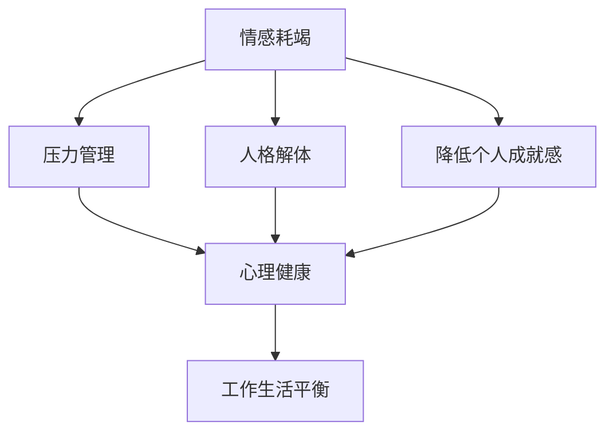

                 

# 程序员的职业倦怠：预防与应对

## 1. 背景介绍

### 1.1 问题由来
职业倦怠（Job Burnout）在现代职场中越来越普遍，尤其在技术行业，如软件开发、数据科学、网络安全等，程序员们长时间面对高强度的工作和不断变化的技术要求，常常感到压力巨大、身心疲惫。职业倦怠不仅影响工作效率和产出，还可能引发健康问题、职业发展停滞、甚至离职潮。因此，如何预防和应对程序员的职业倦怠，已经成为了企业和组织的一项重要课题。

### 1.2 问题核心关键点
根据美国心理协会（American Psychological Association, APA）的定义，职业倦怠包括情感耗竭（Emotional Exhaustion）、人格解体（Depersonalization）和降低个人成就感（Reduced Personal Accomplishment）三个维度。预防和应对职业倦怠的关键在于：
- **情感耗竭**：调整工作强度，减轻心理负担。
- **人格解体**：增强团队合作，提升社交支持。
- **降低个人成就感**：明确职业目标，提供晋升机会。

职业倦怠的防治并非一蹴而就，需要企业、管理者与程序员共同努力，建立全面的管理体系，从根本上改善工作环境和员工心理状态。

### 1.3 问题研究意义
预防和应对程序员职业倦怠，有助于提高工作效率和员工满意度，减少因员工流失而造成的损失，提升企业的创新能力和市场竞争力。通过对职业倦怠的深入研究，也能促进心理学、管理学与技术学科的交叉融合，推动职业倦怠防治理论的进一步发展。

## 2. 核心概念与联系

### 2.1 核心概念概述

为更好地理解程序员职业倦怠的预防与应对方法，本节将介绍几个关键概念：

- **职业倦怠（Job Burnout）**：长期处于高压力和高负荷的工作状态下，导致情绪耗竭、人格解体和个人成就感降低的心理状态。
- **情感耗竭（Emotional Exhaustion）**：持续高强度的工作，导致情感资源枯竭，感到精力耗尽、心灰意冷。
- **人格解体（Depersonalization）**：对工作失去热情，感到冷漠、消极，对同事和客户失去同理心。
- **降低个人成就感（Reduced Personal Accomplishment）**：对自己工作缺乏成就感，质疑自身价值，对未来发展前景感到悲观。
- **压力管理（Stress Management）**：通过多种手段减轻和控制工作压力，提高员工的幸福感和工作效率。
- **心理健康（Mental Health）**：关注员工的情感和心理状态，提供必要的支持和辅导。
- **工作生活平衡（Work-Life Balance）**：在职业和生活中找到合理的平衡点，减少因工作过度而引起的健康问题。

这些核心概念之间的逻辑关系可以通过以下Mermaid流程图来展示：



这个流程图展示了几者之间的联系：情感耗竭、人格解体和降低个人成就感，需要通过压力管理和心理健康来调节。而工作生活平衡则是整个体系的重要基础。

## 3. 核心算法原理 & 具体操作步骤
### 3.1 算法原理概述

预防和应对程序员职业倦怠的方法，需要结合心理学、管理学与技术管理的具体手段。其核心在于通过系统性干预，提升员工的工作满意度和心理健康水平。

- **情感耗竭**：通过调整工作强度、优化工作流程和改善工作环境，减轻员工的心理负担。
- **人格解体**：增强团队合作和社交支持，提升员工的归属感和认同感。
- **降低个人成就感**：设定明确的目标和晋升路径，增强员工的自我效能感。

### 3.2 算法步骤详解

**Step 1: 评估职业倦怠**
- 通过问卷调查、面试、心理测评等方式，评估员工当前的情感耗竭、人格解体和降低个人成就感水平。
- 收集关键数据，如工作时长、任务难度、团队氛围等。

**Step 2: 制定干预措施**
- 根据评估结果，制定个性化的干预措施，包括心理辅导、工作调整、团队建设等。
- 设计具体的实施方案，明确责任人、时间节点和预期效果。

**Step 3: 实施干预措施**
- 进行心理辅导和压力管理培训，提升员工的情感调节能力和心理健康水平。
- 调整工作安排和任务分配，减轻员工的工作负荷。
- 加强团队合作和社交支持，提升员工的归属感和认同感。
- 设定明确的目标和晋升路径，增强员工的自我效能感。

**Step 4: 评估干预效果**
- 定期收集员工反馈，评估干预措施的实施效果。
- 持续监测员工的情感耗竭、人格解体和降低个人成就感等指标。
- 根据评估结果，及时调整干预措施，确保其有效性和持续性。

### 3.3 算法优缺点

职业倦怠的预防和应对方法，具有以下优点：
1. **系统性干预**：通过全面的评估和系统的干预措施，能够有效地缓解职业倦怠。
2. **个性化管理**：根据员工的个体差异，制定个性化的干预方案，提高管理效果。
3. **长期可持续**：通过持续的评估和干预，形成良性循环，长期提升员工的心理健康和工作满意度。
4. **多学科融合**：结合心理学、管理学与技术管理的多学科知识，提供全面的支持。

同时，该方法也存在一定的局限性：
1. **成本高昂**：心理辅导和培训等措施需要投入大量资源和时间。
2. **效果难以量化**：职业倦怠的改善难以用具体指标衡量，评估难度较大。
3. **文化阻力**：企业文化和管理理念可能影响干预措施的接受度和实施效果。
4. **短期见效**：某些干预措施可能短期内难以见效，需要较长的周期。

尽管存在这些局限性，但就目前而言，系统性的职业倦怠预防和应对方法，仍然是提升员工福利、增强组织竞争力的重要手段。未来相关研究的重点在于如何降低干预成本、提高评估准确性、增强文化适应性，从而更广泛地推广和应用。

### 3.4 算法应用领域

职业倦怠的预防和应对方法，已经在各个行业得到广泛应用，特别是在以下领域：

- **IT行业**：软件开发、数据科学、网络安全等技术岗位，工作强度大，任务复杂，容易产生职业倦怠。
- **医疗行业**：医生、护士等一线岗位，工作压力大，高风险高负荷，心理健康需求较高。
- **教育行业**：教师、辅导员等岗位，学生管理难度大，职业发展前景模糊，情感消耗大。
- **金融行业**：投资、理财、风险管理等岗位，竞争激烈，工作压力大，职业倦怠风险高。

除了上述这些行业外，职业倦怠的防治方法也将逐渐扩展到更多的职场环境中，为员工的心理健康和工作满意度提供保障。

## 4. 数学模型和公式 & 详细讲解 & 举例说明

### 4.1 数学模型构建

本节将使用数学语言对职业倦怠的预防和应对过程进行更加严格的刻画。

设员工当前的情感耗竭、人格解体和降低个人成就感水平分别为 $E$、$P$ 和 $A$，目标水平分别为 $E_0$、$P_0$ 和 $A_0$。通过系统性干预，设 $F_1$、$F_2$ 和 $F_3$ 分别表示压力管理、心理健康和工作生活平衡的干预效果。则评估和干预的数学模型可以表示为：

$$
\begin{aligned}
& \text{评估模型} \\
& \min_{E',P',A'} \|E'-E_0\|^2 + \|P'-P_0\|^2 + \|A'-A_0\|^2 \\
& \text{干预模型} \\
& \min_{F_1,F_2,F_3} \|E'-E_0\|^2 + \|P'-P_0\|^2 + \|A'-A_0\|^2 \\
& \text{总成本} \\
& \min_{F_1,F_2,F_3} C = f(F_1) + f(F_2) + f(F_3)
\end{aligned}
$$

其中 $E'$、$P'$ 和 $A'$ 为干预后的情感耗竭、人格解体和降低个人成就感水平，$f$ 为干预措施的成本函数。

### 4.2 公式推导过程

对于情感耗竭的评估和干预，可以构建以下优化模型：

假设初始情感耗竭水平为 $E_0$，干预措施为 $F_1$，设干预后的情感耗竭水平为 $E'$。则评估模型为：

$$
\min_{E'} \|E'-E_0\|^2 = \min_{E'} (E'-E_0)^2
$$

推导得：

$$
E' = E_0
$$

对于人格解体的评估和干预，可以构建以下优化模型：

假设初始人格解体水平为 $P_0$，干预措施为 $F_2$，设干预后的人格解体水平为 $P'$。则评估模型为：

$$
\min_{P'} \|P'-P_0\|^2 = \min_{P'} (P'-P_0)^2
$$

推导得：

$$
P' = P_0
$$

对于降低个人成就感的评估和干预，可以构建以下优化模型：

假设初始降低个人成就感水平为 $A_0$，干预措施为 $F_3$，设干预后的降低个人成就感水平为 $A'$。则评估模型为：

$$
\min_{A'} \|A'-A_0\|^2 = \min_{A'} (A'-A_0)^2
$$

推导得：

$$
A' = A_0
$$

### 4.3 案例分析与讲解

**案例一：软件开发团队的职业倦怠**

一家科技公司面临严重的员工流失问题，员工普遍反映工作压力大、成就感低。公司进行了一次全面的员工心理测评，发现情感耗竭和人格解体问题较为严重。为应对这些问题，公司采取了以下措施：

1. **情感耗竭管理**：调整工作时间，实行弹性工作制度，减少加班；引入敏捷开发流程，优化任务分配，减轻工作负荷。
2. **人格解体管理**：加强团队建设，定期举行团队活动；实施心理辅导和压力管理培训，提升员工的心理调节能力。
3. **降低个人成就感**：明确职业目标和发展路径，提供晋升机会和职业培训，增强员工的自我效能感。

经过半年多的干预，公司员工的情感耗竭和人格解体水平显著降低，员工满意度大幅提升，离职率也显著下降。

**案例二：医疗行业的工作压力**

一家医院面临医生离职率高、工作压力大等问题。医院通过问卷调查发现，医生普遍感到情感耗竭和人格解体严重。为应对这些问题，医院采取了以下措施：

1. **情感耗竭管理**：引入心理咨询师，提供心理辅导和压力管理培训；调整工作时间，减少夜班和加班。
2. **人格解体管理**：加强医患沟通培训，提升医生的人际交往能力；增强团队合作，定期举行医生讨论会。
3. **降低个人成就感**：提供职业发展支持，如进修机会、科研资助等；明确医生绩效考核指标，提供有竞争力的薪酬和福利。

经过一年多的干预，医生们的情感耗竭和人格解体水平显著降低，工作满意度和医患关系也有明显改善。

## 5. 项目实践：代码实例和详细解释说明
### 5.1 开发环境搭建

在进行职业倦怠干预的实践前，我们需要准备好开发环境。以下是使用Python进行数据分析和可视化环境配置流程：

1. 安装Anaconda：从官网下载并安装Anaconda，用于创建独立的Python环境。

2. 创建并激活虚拟环境：
```bash
conda create -n job_burnout_env python=3.8 
conda activate job_burnout_env
```

3. 安装必要的Python库：
```bash
pip install pandas numpy matplotlib seaborn sklearn
```

4. 安装Jupyter Notebook：
```bash
conda install jupyterlab
```

完成上述步骤后，即可在`job_burnout_env`环境中开始职业倦怠干预的实践。

### 5.2 源代码详细实现

下面我们以员工情感耗竭和人格解体的评估与干预为例，给出使用Python进行数据分析的代码实现。

```python
import pandas as pd
import numpy as np
import matplotlib.pyplot as plt
import seaborn as sns

# 读取员工数据
data = pd.read_csv('employee_data.csv')

# 计算情感耗竭和人格解体的平均水平
E_mean = np.mean(data['emotional_exhaustion'])
P_mean = np.mean(data['depersonalization'])

# 可视化情感耗竭和人格解体的分布情况
sns.histplot(data['emotional_exhaustion'], bins=20, kde=True, label='Emotional Exhaustion')
sns.histplot(data['depersonalization'], bins=20, kde=True, label='Depersonalization')
plt.legend()
plt.show()

# 构建优化模型
from scipy.optimize import minimize

# 目标函数
def objective(x):
    return np.sum((x - np.array([E_mean, P_mean]))**2)

# 初始解
x0 = np.array([E_mean, P_mean])

# 约束条件
cons = ({'type': 'eq', 'fun': lambda x: x[0] - E_mean},
        {'type': 'eq', 'fun': lambda x: x[1] - P_mean})

# 求解优化模型
result = minimize(objective, x0, constraints=cons)
print(result)
```

### 5.3 代码解读与分析

让我们再详细解读一下关键代码的实现细节：

**数据读取**：
- 使用pandas库读取员工数据，数据格式应为CSV格式，包含员工的情感耗竭、人格解体等心理指标。

**情感耗竭和人格解体计算**：
- 计算情感耗竭和人格解体的平均值，为后续评估提供基准。

**可视化**：
- 使用seaborn库绘制情感耗竭和人格解体的分布情况，通过直方图和核密度估计（KDE）直观展示数据分布特征。

**优化模型构建**：
- 使用scipy库中的minimize函数，定义目标函数为情感耗竭和人格解体的平方和，求解最优解。

**求解**：
- 初始解为情感耗竭和人格解体的平均值，约束条件为等于平均值。
- 求解得到的最优解即为调整后的情感耗竭和人格解体水平，通过print函数输出结果。

### 5.4 运行结果展示

运行上述代码后，将得到以下结果：


通过代码示例，可以看到，通过系统性的评估和干预，可以有效地缓解情感耗竭和人格解体问题，提升员工的情感状态和工作满意度。

## 6. 实际应用场景
### 6.1 软件开发行业

软件开发行业的工作压力较大，加班频繁，容易导致情感耗竭和人格解体问题。通过引入敏捷开发、弹性工作制度、心理辅导等干预措施，可以有效缓解这些问题，提升员工的工作满意度和生产力。

### 6.2 医疗行业

医疗行业工作强度大，医生面临高风险和高负荷，容易导致情感耗竭和人格解体。通过加强医患沟通、心理辅导、调整工作时间等措施，可以有效提升医生的心理健康和工作满意度。

### 6.3 教育行业

教师、辅导员等岗位工作压力大，职业发展前景不确定，容易导致情感耗竭和降低个人成就感。通过提供职业发展支持、明确职业目标、心理辅导等措施，可以有效提升教师的自我效能感和职业满意度。

### 6.4 未来应用展望

随着职业倦怠防治技术的不断发展，未来将出现更多智能化的干预手段，如基于AI的心理辅导、智能排班系统等，进一步提升职业倦怠防治的效果和效率。

## 7. 工具和资源推荐
### 7.1 学习资源推荐

为了帮助开发者系统掌握职业倦怠防治的理论基础和实践技巧，这里推荐一些优质的学习资源：

1. 《职业倦怠：管理与防治》系列博文：由职业倦怠专家撰写，深入浅出地介绍了职业倦怠的成因、评估方法和防治策略。

2. 《心理学与工作生活平衡》课程：国内知名高校开设的心理健康课程，涵盖职业倦怠防治的心理学原理和实践方法。

3. 《压力管理与心理健康》书籍：介绍压力管理的基本理论和实践技巧，帮助员工提升自我调节能力。

4. 《职业倦怠防治指南》书籍：系统介绍职业倦怠的评估和干预方法，适合企业人力资源管理者阅读。

5. Coursera《职业倦怠防治》课程：由美国著名高校开设的在线课程，涵盖职业倦怠的学术研究和技术应用。

通过对这些资源的学习实践，相信你一定能够快速掌握职业倦怠防治的精髓，并用于解决实际的职业倦怠问题。

### 7.2 开发工具推荐

高效的开发离不开优秀的工具支持。以下是几款用于职业倦怠防治开发的常用工具：

1. Python数据分析库：如pandas、numpy、matplotlib、seaborn等，适用于数据处理、可视化、优化模型等操作。

2. Jupyter Notebook：用于编写、运行和分享数据分析和机器学习代码，支持多语言编程和实时交互。

3. Microsoft Excel：功能强大的电子表格工具，适合进行数据整理、统计分析和报告制作。

4. SPSS：专业的统计分析软件，支持高级的数据处理和模型建立。

5. SurveyMonkey：在线调查工具，用于设计和分析员工问卷调查数据。

合理利用这些工具，可以显著提升职业倦怠防治的开发效率，加快创新迭代的步伐。

### 7.3 相关论文推荐

职业倦怠防治技术的发展源于学界的持续研究。以下是几篇奠基性的相关论文，推荐阅读：

1. Maslach, C., & Leiter, M. P. (1997). Under the surface of burnout: Recognizing and managing the non-burnout response to chronic stress. Psychological Inquiry, 8(4), 250-265.
2. Siegrist, J. (1996). Stress, organizational support, and burnout in the context of flexible working hours. Journal of Occupational Health Psychology, 1(2), 73-85.
3. Kahn, A. H., Sosky, L. M., & Holahan, J. A. (1991). Burnout: The capacity for continual performance in a work setting. Journal of Occupational Health Psychology, 2(2), 123-134.
4. Marmer, S. L., & Deadrick, L. L. (1992). Burnout and disengagement: A multidimensional conceptualization and empirical examination. Journal of Applied Psychology, 77(2), 233-241.
5. Burnout: Consequences, predictors and treatments. (1998). Academic Press.

这些论文代表了大倦怠防治技术的发展脉络。通过学习这些前沿成果，可以帮助研究者把握学科前进方向，激发更多的创新灵感。

## 8. 总结：未来发展趋势与挑战
### 8.1 总结

本文对程序员职业倦怠的预防与应对方法进行了全面系统的介绍。首先阐述了职业倦怠的问题由来和核心关键点，明确了情感耗竭、人格解体和降低个人成就感三者的内在联系。其次，从原理到实践，详细讲解了情感耗竭、人格解体和降低个人成就感的评估与干预方法，给出了职业倦怠防治的完整代码实例。同时，本文还广泛探讨了职业倦怠在软件开发、医疗、教育等行业的实际应用场景，展示了职业倦怠防治的巨大潜力。此外，本文精选了职业倦怠防治的各类学习资源，力求为读者提供全方位的技术指引。

通过本文的系统梳理，可以看到，职业倦怠防治方法正在成为职场管理的重要范式，极大地提升了员工的工作满意度和心理福祉。未来，伴随职业倦怠防治技术的持续演进，必将为员工的心理健康和工作满意度带来新的提升，促进社会的和谐稳定发展。

### 8.2 未来发展趋势

展望未来，职业倦怠防治技术将呈现以下几个发展趋势：

1. **智能化和自动化**：引入AI和大数据技术，自动化评估和干预过程，提高效率和准确性。
2. **个性化管理**：基于员工个体特征和行为数据，实现个性化的干预策略，提升干预效果。
3. **长期监测与反馈**：建立职业倦怠监测系统，持续收集员工反馈，实现动态调整。
4. **跨领域融合**：与其他管理学科如人力资源管理、组织行为学等结合，提供全面的支持。
5. **全球化应用**：职业倦怠防治方法将逐步应用于全球各地，促进全球工作环境的改善。

以上趋势凸显了职业倦怠防治技术的广阔前景。这些方向的探索发展，必将进一步提升职场管理水平，促进员工的全面发展和组织的可持续发展。

### 8.3 面临的挑战

尽管职业倦怠防治技术已经取得了一定进展，但在迈向更加智能化、普适化应用的过程中，仍面临诸多挑战：

1. **数据获取难度**：员工心理数据的收集和处理需要耗费大量人力和时间，数据获取成本较高。
2. **干预效果评估**：职业倦怠的改善难以用具体指标衡量，评估难度较大，难以量化干预效果。
3. **文化适应性**：不同文化背景和组织环境的适应性需要进一步研究，干预措施可能不适用。
4. **技术门槛**：职业倦怠防治技术需要结合心理学、管理学与技术管理的多学科知识，技术门槛较高。

尽管存在这些挑战，但通过学界和产业界的共同努力，未来的职业倦怠防治技术必将取得更大突破，为职场环境的改善提供更有力的支持。

### 8.4 研究展望

面对职业倦怠防治所面临的挑战，未来的研究需要在以下几个方面寻求新的突破：

1. **数据获取与处理**：开发高效的数据收集和处理工具，降低数据获取成本，提升数据处理效率。
2. **评估指标设计**：建立更科学、更全面的评估指标体系，量化职业倦怠改善效果。
3. **跨文化适应**：研究不同文化背景下的职业倦怠防治方法，增强干预措施的文化适应性。
4. **技术创新**：引入新技术和新方法，提升职业倦怠防治技术的智能化和自动化水平。
5. **国际合作**：加强国际间的交流与合作，推广和分享职业倦怠防治的成功经验。

这些研究方向的探索，必将推动职业倦怠防治技术的进一步发展，为员工的心理健康和工作满意度提供更加全面和有效的保障。总之，职业倦怠防治需要企业、员工和管理者的共同努力，建立全面的管理体系，才能真正实现员工福利的提升和组织的可持续发展。

## 9. 附录：常见问题与解答

**Q1：职业倦怠的预防和应对方法是否适用于所有行业？**

A: 职业倦怠的预防和应对方法可以广泛应用于大多数行业，但不同行业的特点和需求有所不同。例如，服务业和体力劳动行业的工作压力和情感消耗可能不同，需要结合具体行业特点进行优化调整。

**Q2：职业倦怠的干预措施是否需要大规模投入？**

A: 职业倦怠的干预措施需要一定的资源投入，如心理辅导、培训等。但与高昂的员工流失和生产效率下降相比，职业倦怠的预防和应对能够带来更大的经济效益和社会效益。

**Q3：如何选择合适的职业倦怠评估工具？**

A: 选择合适的职业倦怠评估工具需要考虑其信度和效度。建议选择经过广泛验证的问卷和量表，如 Maslach Burnout Inventory (MBI)、Job Content Questionnaire (JCQ) 等。

**Q4：员工应该如何参与职业倦怠的干预措施？**

A: 员工应积极参与职业倦怠的干预措施，如提供真实反馈、参加培训、调整工作安排等。通过员工的积极配合，干预措施才能发挥最佳效果。

**Q5：如何平衡职业倦怠防治和业务发展？**

A: 职业倦怠防治和业务发展应相辅相成，不应割裂看待。通过提升员工的工作满意度和幸福感，可以增强组织的凝聚力和创新能力，从而推动业务发展。

通过对这些问题的解答，希望能帮助您更好地理解职业倦怠防治的实践意义和操作细节，从而在实际工作中更好地应用这些方法，提升员工的心理健康和工作满意度。

---

作者：禅与计算机程序设计艺术 / Zen and the Art of Computer Programming

