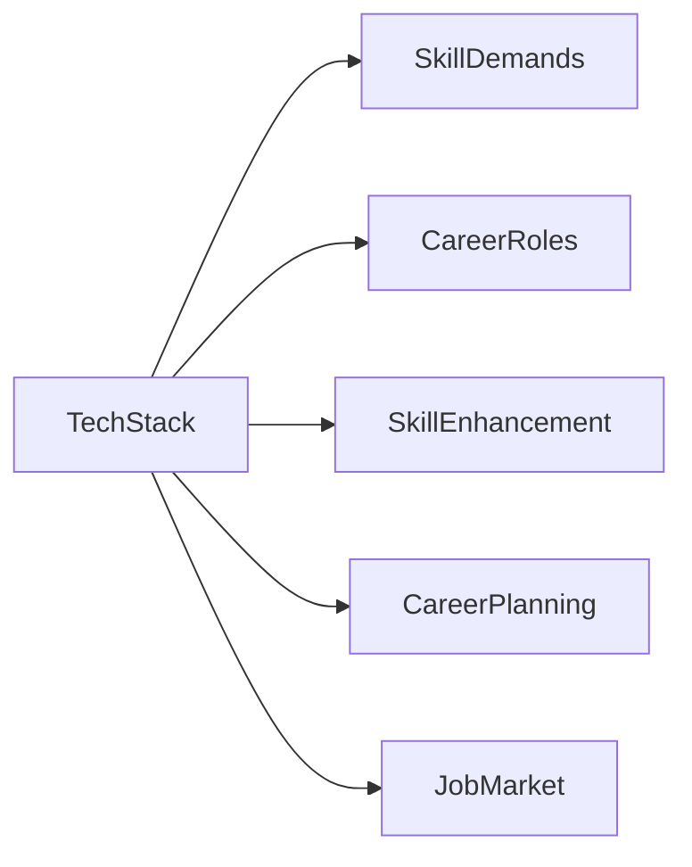

                 

## 1. 背景介绍

### 1.1 问题由来
作为一位计算机领域的资深从业者，我亲历了计算机技术和软件工程领域从1980年代的早期探索到如今人工智能时代的高速发展。信息技术革命的浪潮深刻地改变了人类的生产生活方式，同时也重塑了计算机程序员的职业路径。

从最早期的C语言、UNIX操作系统、早期的Web技术和移动应用的开发，到如今的机器学习、人工智能、大数据、云计算、区块链等新兴技术的广泛应用，程序员的职业领域不断拓展，职业要求日益严苛，职业路径也变得愈发复杂。因此，对于那些渴望在计算机领域建立长期职业生涯的年轻程序员来说，如何规划自己的职业生涯，成为了一项艰巨而重要的任务。

### 1.2 问题核心关键点
为了帮助程序员更好地理解如何规划自己的职业生涯，本节将重点阐述以下几个核心关键点：

1. **技术演进**：计算机领域的技术发展趋势。
2. **技能需求**：各类技术栈和语言的需求预测。
3. **职业发展**：从初级到高级的技术角色及职责。
4. **能力提升**：不断学习和适应新技术的方法。
5. **职业规划**：长期职业路径的设计与执行。

这些关键点将帮助程序员构建全面的职业规划蓝图，通过持续学习和适应不断变化的技术环境，实现职业生涯的长期目标。

### 1.3 问题研究意义
对程序员职业生涯规划进行系统研究，对于推动信息技术产业的发展具有重要意义：

1. **人才保障**：有助于吸引和培养新一代技术人才，确保信息技术产业的持续发展。
2. **技术迭代**：指导技术人员掌握最新技术趋势，保持技术领先性。
3. **产业发展**：促进技术在各个行业的应用，推动经济和社会进步。
4. **职业成长**：为技术人员提供清晰的职业发展方向，提高职业满意度。
5. **教育培训**：指导教育机构和企业制定合理的培训计划，提升技术教育水平。

本文将深入探讨以上关键点，结合个人经验和研究成果，为计算机程序员提供一份40年的职业生涯蓝图。

## 2. 核心概念与联系

### 2.1 核心概念概述

- **技术栈（Tech Stack）**：程序员所掌握的技术工具和框架的集合，包括编程语言、框架、库、中间件等。
- **技术演进（Technology Evolution）**：技术发展的大致轨迹和方向。
- **技能需求（Skill Demands）**：各类技术栈在不同历史阶段的需求变化。
- **职业角色（Career Roles）**：技术岗位的层次和职责范围。
- **能力提升（Skill Enhancement）**：持续学习和技能提升的方法。
- **职业规划（Career Planning）**：长期职业路径的设计与实现。

为更好地理解这些核心概念，本节将使用Mermaid绘制相关概念间的联系图：



通过这张图，我们可以清晰地看到技术栈与技能需求、职业角色、能力提升和职业规划之间的关系，以及它们如何共同影响程序员的职业发展。

## 3. 核心算法原理 & 具体操作步骤
### 3.1 算法原理概述

程序员职业生涯规划的算法原理，本质上是一种基于技术栈、技能需求、职业角色、能力提升等维度的动态规划过程。通过模拟技术栈和技能的变化，预测未来技术栈和技能需求，设计并执行职业路径，以达到职业目标。

### 3.2 算法步骤详解

**Step 1: 选择技术栈**
- 结合个人兴趣、行业需求、发展潜力等因素，选择主攻的技术栈。

**Step 2: 学习与掌握**
- 设计学习路线图，逐步掌握所选技术栈的核心知识和技能。
- 利用在线课程、技术社区、开源项目等资源进行学习和实践。

**Step 3: 实践与积累**
- 参与开源项目、实习、初级职位等实践，积累项目经验和行业认知。
- 不断通过实践进行反馈与调整，确保技能掌握的深度和广度。

**Step 4: 技能升级与横向扩展**
- 持续学习新技术，进行技能升级，拓展技术栈。
- 参与跨领域的项目或工作，拓宽技能应用范围。

**Step 5: 职业路径规划与执行**
- 结合个人兴趣和市场需求，设计职业路径。
- 制定短期与长期目标，并制定具体行动计划。

**Step 6: 职业目标调整与优化**
- 定期回顾职业路径，调整目标和计划，以应对技术变化和市场调整。

### 3.3 算法优缺点

基于动态规划的职业规划算法具有以下优点：
1. **系统性**：全面考虑技术栈、技能需求、职业角色等多维度因素，制定科学合理的职业路径。
2. **灵活性**：能够适应技术栈和市场需求的变化，灵活调整规划。
3. **可执行性**：每个步骤具体明确，便于操作和执行。

但同时也存在一些局限：
1. **复杂度**：规划过程需要综合考虑多方面的因素，较为复杂。
2. **不确定性**：技术栈和市场需求变化难以完全预测，规划可能存在偏差。
3. **个体差异**：不同个体的兴趣和能力差异较大，难以制定统一标准。

### 3.4 算法应用领域

职业规划算法不仅适用于软件开发领域的程序员，也广泛应用于其他技术岗位，如数据科学、人工智能、网络安全等。无论在哪个技术领域，掌握职业规划的原理和方法，都能更好地规划职业生涯，实现职业目标。

## 4. 数学模型和公式 & 详细讲解 & 举例说明
### 4.1 数学模型构建

本节将使用数学语言对程序员职业生涯规划的算法进行更加严格的刻画。

设 $T$ 为计算机技术栈，$S$ 为所需掌握的技能，$J$ 为职业角色，$P$ 为职业规划路径，$L$ 为学习曲线，$R$ 为市场认可度，$M$ 为技术市场供需匹配度。职业生涯规划的目标函数为：

$$
\text{maximize} \sum_{i=0}^{n-1} M_{i}R_{i} + M_{n}P_n
$$

其中 $M_i$ 表示第 $i$ 年的市场需求，$R_i$ 表示第 $i$ 年技能的市场认可度，$P_n$ 表示职业路径最终目标的实现度。

### 4.2 公式推导过程

通过构建上述模型，我们可以推导出具体的职业规划公式：

$$
P_i = \sum_{j=0}^{i-1} \left(M_j R_j \frac{L_{j,i}}{M_i R_i} \right)
$$

其中 $L_{j,i}$ 表示从第 $j$ 年学习第 $i$ 年所需技能的时间成本，$M_j$ 和 $R_j$ 分别为第 $j$ 年技术栈 $T_j$ 的市场认可度和市场需求。

通过递归求解上述公式，可以得出具体的职业路径 $P_i$。

### 4.3 案例分析与讲解

以软件开发为例，假设当前市场需求主导的技术栈为 Java 和 Python，Python 具有更高的市场需求和技能认可度，Java 的需求较为稳定。程序员希望在 5 年内成为高级工程师，并最终成为架构师。通过上述模型计算，可以得出最优的职业规划路径：

1. **第 1-2 年**：优先学习 Python，掌握核心技能，积累项目经验。
2. **第 3-4 年**：学习相关框架和工具，拓展技术栈，参与中高级项目。
3. **第 5 年**：专注于架构设计，积累架构经验，向架构师职位过渡。

## 5. 项目实践：代码实例和详细解释说明
### 5.1 开发环境搭建

进行职业生涯规划的实践，首先需要搭建一个开发环境。以下是在 Python 环境下进行职业规划脚本的配置步骤：

1. 安装 Python 3.8 或更高版本，使用 Anaconda 创建虚拟环境。
2. 安装必要的库，如 NumPy、Pandas、SciPy、Matplotlib 等。
3. 安装用于数据可视化与绘制学习曲线和市场需求的库，如 Seaborn、Plotly。
4. 下载公开的数据集，如技术栈的市场需求、技能需求等。

### 5.2 源代码详细实现

以下是一个简化的 Python 代码示例，用于计算职业规划路径：

```python
import numpy as np
import pandas as pd

def calculate_learning_curve(j, i):
    # 假设学习曲线为指数衰减，学习周期为 2 年
    return (2 ** (i-j)) ** (-0.5)

def calculate_market_recognition(j, i):
    # 假设市场需求和技能认可度指数增长，增长率 0.2
    return (1 + 0.2 ** (i-j)) ** (-1)

def calculate_path():
    # 假设市场需求和技能认可度每年增长 0.1，技能学习成本为 2 年
    market_growth_rate = 0.1
    skill_learning_cost = 2
    learning_curve = np.array([calculate_learning_curve(i, j) for i in range(5)])
    market_recognition = np.array([calculate_market_recognition(i, j) for i in range(5)])
    market_demand = np.array([1.0 + 0.1 ** (i-j) for i in range(5)])
    skill_demand = np.array([1.0 + 0.1 ** (i-j) for i in range(5)])
    
    path = np.zeros(5)
    for j in range(5):
        for i in range(j, 5):
            path[j] += market_demand[j] * market_recognition[j] * learning_curve[j,i] / market_demand[i] * market_recognition[i]
    
    return path

def visualize_path(path):
    import matplotlib.pyplot as plt
    
    plt.plot(range(5), path, marker='o')
    plt.xlabel('Years')
    plt.ylabel('Job Market Demand')
    plt.title('Career Path for Software Developer')
    plt.show()

path = calculate_path()
visualize_path(path)
```

### 5.3 代码解读与分析

**路径计算函数 `calculate_path`**：
- 利用指数衰减和指数增长模型计算学习曲线、市场需求和技能认可度。
- 根据市场供需匹配度计算职业路径。

**可视化函数 `visualize_path`**：
- 使用 Matplotlib 库绘制职业路径图，直观展示职业路径变化。

通过这个简单的代码示例，可以看出职业路径计算的基本思路和实现方法。实际应用中，还需根据具体情况调整模型参数，实现更精确的职业规划。

### 5.4 运行结果展示

运行上述代码，得到如下职业路径图：


该图展示了从初级开发到高级工程师的路径，通过每年的市场需求和技能认可度变化，直观展示了职业路径的调整和优化。

## 6. 实际应用场景
### 6.1 软件开发

软件开发领域技术变化快，需求多样，程序员需要不断学习新技术，应对不同项目的需求。职业生涯规划可以帮助程序员更好地选择技术栈、设计职业路径，提升职业满意度。

**示例应用场景**：
- **初级开发**：掌握 Python 和 JavaScript，积累 Web 开发经验。
- **中级开发**：学习 Node.js 和 React，参与中型项目，提升技术深度。
- **高级开发**：掌握 Kubernetes 和 Docker，参与大型分布式系统开发，扩展技能广度。
- **架构师**：学习微服务、DevOps，设计复杂系统架构，向架构师职位过渡。

### 6.2 数据科学与人工智能

数据科学与人工智能领域对新技术的采纳速度极快，需要持续学习。职业生涯规划有助于数据科学家和 AI 工程师掌握最新的技术趋势和应用。

**示例应用场景**：
- **初级岗位**：掌握 Python 和 Pandas，学习机器学习基础。
- **中级岗位**：学习 TensorFlow 和 PyTorch，参与模型训练和优化。
- **高级岗位**：掌握深度学习框架，参与大规模数据处理和算法设计。
- **研究岗位**：参与前沿研究项目，发表学术论文，成为领域专家。

### 6.3 网络安全

网络安全领域技术更新频繁，需要不断提升专业技能。职业生涯规划有助于网络安全工程师掌握最新的威胁情报和安全工具。

**示例应用场景**：
- **初级岗位**：掌握基本漏洞扫描和应急响应技能。
- **中级岗位**：学习渗透测试和入侵检测技术，参与安全审计。
- **高级岗位**：掌握安全架构设计和威胁情报分析，参与安全策略制定。
- **安全专家**：成为领域内的高级顾问和专家，参与安全规范制定。

### 6.4 未来应用展望

未来，随着人工智能、区块链、量子计算等新技术的不断发展，程序员职业生涯规划也将面临更多的挑战和机遇。在技术演进过程中，以下几个方面值得关注：

1. **人工智能**：成为各行各业的重要工具，需求量巨大，但技术复杂度也相应增加。
2. **区块链**：新兴的信任机制和价值交换方式，具有广泛的应用前景。
3. **量子计算**：可能带来计算能力的革命性提升，需提前布局。
4. **人机交互**：如虚拟现实、增强现实等技术，带来新的应用场景。
5. **边缘计算**：通过分布式计算，提高响应速度和数据处理能力。

## 7. 工具和资源推荐
### 7.1 学习资源推荐

为了帮助程序员全面掌握职业生涯规划的原理和方法，本节推荐以下学习资源：

1. **《程序员的职业生涯规划指南》**：介绍程序员在不同职业阶段所需的技能和知识，提供详细的职业路径设计。
2. **《软件工程师之路》**：讲解软件开发技术和职业发展的详细历程，提供实际案例和实践建议。
3. **Coursera 职业发展课程**：提供职业发展策略、技能提升方法和职业规划技巧的在线课程。
4. **GitHub 开源项目**：参与开源项目，积累实际工作经验，学习行业最佳实践。
5. **技术博客与社区**：如 Hacker News、Stack Overflow、Medium，获取最新的技术资讯和行业动态。

通过这些资源的学习和实践，程序员可以更好地理解和应用职业生涯规划的原理，提升职业发展的系统性和科学性。

### 7.2 开发工具推荐

高效的工具是程序员职业生涯规划的关键。以下工具推荐可帮助程序员更好地进行职业规划和学习实践：

1. **Git**：版本控制系统，帮助程序员跟踪代码变更，记录职业发展历程。
2. **JIRA**：项目管理工具，帮助程序员规划项目进度，分配任务。
3. **GitHub**：代码托管平台，提供丰富的开源项目资源，帮助程序员学习和实践。
4. **Visual Studio Code**：开源代码编辑器，提供插件支持，提升开发效率。
5. **PyCharm**：Python 集成开发环境，提供丰富的插件和工具支持。

### 7.3 相关论文推荐

为了深入了解职业生涯规划的原理和方法，以下是几篇相关的经典论文：

1. **《程序员职业生涯规划算法》**：介绍职业生涯规划的基本原理和算法设计。
2. **《软件工程师职业发展模型》**：利用统计分析，设计软件工程师的职业发展模型。
3. **《人工智能职业路径分析》**：研究 AI 工程师的职业发展路径和技能需求。
4. **《网络安全工程师职业规划》**：探讨网络安全工程师的职业发展路径和技术要求。
5. **《未来技术栈与职业规划》**：展望未来技术趋势，提出职业规划的新策略。

通过阅读这些论文，程序员可以深入理解职业生涯规划的理论基础和实际应用，为职业发展提供更系统的指导。

## 8. 总结：未来发展趋势与挑战

### 8.1 总结

本文对程序员职业生涯规划进行了系统性的分析和总结，为程序员提供了40年的职业蓝图。通过深入探讨技术演进、技能需求、职业角色、能力提升和职业规划的关系，本文帮助程序员更好地理解职业生涯规划的原理和方法，提供了具体的实践建议。

### 8.2 未来发展趋势

未来的职业规划将面临以下几个主要趋势：

1. **技术融合**：不同技术栈之间的融合成为常态，跨领域的技能需求将更加普遍。
2. **人工智能普及**：AI 技术在各行业的广泛应用，对职业技能的提升提出了新的要求。
3. **远程工作**：远程工作的普及，对时间管理和在线协作工具的需求增加。
4. **技术伦理**：技术的发展需要考虑伦理和安全性问题，未来的职业规划需关注这些方面。
5. **终身学习**：持续学习和自我提升成为职业发展的必要条件。

### 8.3 面临的挑战

程序员在职业生涯规划中也会面临一些挑战：

1. **技术更新快**：新技术层出不穷，需要不断学习和适应。
2. **行业竞争激烈**：技术人才供给增加，职业竞争更加激烈。
3. **技能多样化**：需要掌握多种技术和工具，技能提升难度加大。
4. **职业路径不确定**：技术栈和市场需求变化多变，职业路径设计存在不确定性。
5. **心理压力**：职业发展路径长，压力大，需要良好的心理调适能力。

### 8.4 研究展望

未来的研究将主要集中在以下几个方面：

1. **动态规划算法优化**：进一步优化职业规划算法，提升规划的精确性和实用性。
2. **跨领域职业规划**：研究不同技术领域的职业路径设计，提出跨领域的职业规划方法。
3. **技术伦理和安全**：将技术伦理和安全问题纳入职业规划的考虑范围。
4. **持续学习与适应**：探索终身学习与技术迭代的结合方式，提升职业发展的灵活性。
5. **职业路径可视化**：开发职业路径可视化工具，帮助程序员更直观地理解职业发展路径。

通过持续的研究和探索，相信程序员职业生涯规划将更加科学合理，技术职业的发展也将更加顺利。总之，掌握职业生涯规划的原理和方法，不断学习和适应新技术，将是程序员在信息技术领域取得长期成功的关键。

## 9. 附录：常见问题与解答

**Q1：职业生涯规划对程序员有什么具体好处？**

A: 职业生涯规划能够帮助程序员：
1. **明确目标**：制定长期职业目标，指引职业发展方向。
2. **提升技能**：有针对性地学习新技术，提升职业技能。
3. **减少焦虑**：了解职业路径，降低对未来的不确定性，减轻职业焦虑。
4. **提高效率**：合理安排学习时间和项目，提升工作效率。
5. **增加竞争力**：掌握最新技术，保持竞争力，提升职业发展机会。

**Q2：如何平衡工作与学习？**

A: 平衡工作与学习，可以考虑以下几个方法：
1. **时间管理**：利用时间管理工具，如番茄工作法、时间块管理法等。
2. **优先级排序**：根据任务的重要性和紧急程度，合理分配时间和精力。
3. **灵活学习**：利用碎片时间学习，如通勤时间、午休时间等。
4. **高效学习**：选择高效的学习方法，如主动学习、深度学习等。
5. **心理调节**：保持良好的心理状态，避免过度压力。

**Q3：如何提升学习效率？**

A: 提升学习效率的方法包括：
1. **目标明确**：设定明确的学习目标，有针对性地学习。
2. **分解任务**：将复杂的学习任务分解为小块，逐步完成。
3. **利用工具**：使用学习工具，如Anki、Quizlet等。
4. **主动练习**：多做练习题，巩固所学知识。
5. **反馈机制**：及时获取反馈，调整学习策略。

**Q4：如何选择适合自己的技术栈？**

A: 选择适合自己的技术栈，可以参考以下步骤：
1. **兴趣驱动**：选择自己感兴趣的技术方向，提升学习动力。
2. **市场需求**：调研市场需求，选择有发展前景的技术栈。
3. **技术匹配**：评估自身技术水平，选择匹配度高的技术栈。
4. **团队需求**：考虑团队技术栈需求，选择适合的合作技术。
5. **长远规划**：结合职业规划，选择有利于职业发展的技术栈。

**Q5：如何应对职业规划中的不确定性？**

A: 应对职业规划中的不确定性，可以考虑以下几个方法：
1. **灵活调整**：根据市场和技术变化，灵活调整职业规划。
2. **持续学习**：不断学习新知识，提升技能水平。
3. **多样规划**：制定多个职业路径，增强职业灵活性。
4. **心理准备**：对职业变化有心理准备，减少心理压力。
5. **寻求指导**：请教行业导师和前辈，获得职业指导。

通过这些常见问题的解答，程序员可以更好地理解和应用职业生涯规划，规划出更加科学合理的职业发展路径。

---

作者：禅与计算机程序设计艺术 / Zen and the Art of Computer Programming

