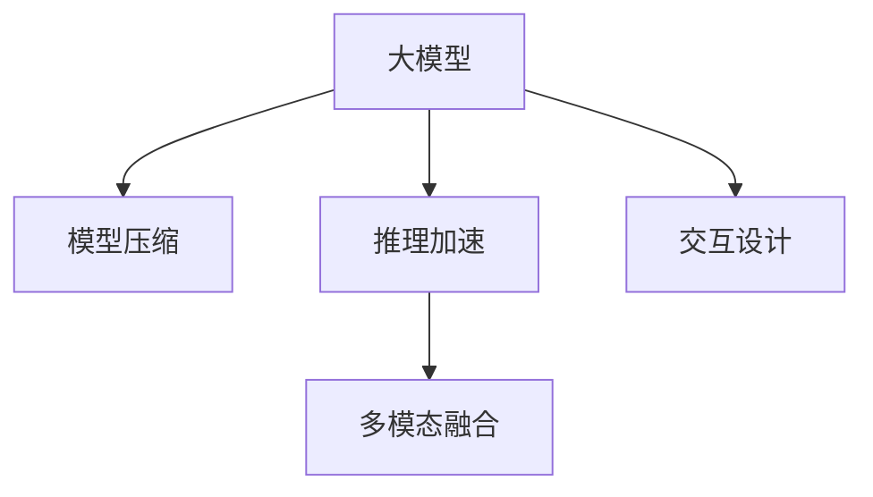

                 

# 端侧大模型加速部署与未来交互

> 关键词：端侧大模型,部署优化,推理加速,未来交互,多模态融合

## 1. 背景介绍

### 1.1 问题由来
近年来，大模型在自然语言处理(NLP)、计算机视觉(CV)、语音识别(SR)等领域取得了显著的进展。基于Transformer架构的大语言模型，如GPT-3、BERT等，具有大规模参数量和高复杂度，能够处理自然语言的多种语言理解和生成任务。然而，这些大模型的推理过程通常需要大量计算资源，难以在移动设备和边缘计算等端侧环境中直接部署。

此外，现有的大模型往往缺乏与用户交互的丰富经验，难以在实际应用中充分发挥作用。为了弥合这一差距，需要在部署大模型的同时，考虑如何更好地进行模型加速和交互优化，以适应端侧环境的需求。

### 1.2 问题核心关键点
端侧大模型部署的核心问题主要包括：

1. **模型压缩与加速**：如何在保持模型效果的前提下，显著降低模型推理的计算资源和存储需求。
2. **推理优化**：如何高效地对模型进行推理计算，提升实时性，确保用户体验。
3. **交互设计**：如何设计合理的人机交互界面，提高用户的操作便利性和满意度。
4. **多模态融合**：如何将文本、图像、语音等多模态信息进行深度融合，增强模型的理解和生成能力。

## 2. 核心概念与联系

### 2.1 核心概念概述

为更好地理解端侧大模型加速部署与未来交互方法，本节将介绍几个密切相关的核心概念：

- 大模型（Large Model）：具有大规模参数量和复杂结构的模型，如GPT-3、BERT等，能够处理复杂任务。
- 模型压缩（Model Compression）：通过剪枝、量化、蒸馏等技术，减少模型参数量，提升推理效率。
- 推理加速（Inference Acceleration）：通过硬件优化、算法优化等手段，加速模型推理计算。
- 交互设计（Interaction Design）：设计直观易用的用户界面，提升用户体验。
- 多模态融合（Multi-modal Fusion）：将文本、图像、语音等多种信息源进行深度融合，提升模型理解和生成能力。

这些核心概念之间的逻辑关系可以通过以下Mermaid流程图来展示：



这个流程图展示了大模型在部署优化和交互优化过程中的主要步骤和方向：

1. 大模型通过模型压缩和推理加速技术，降低计算需求，适应端侧环境。
2. 交互设计改善用户体验，提升用户满意度。
3. 多模态融合增强模型能力，拓展应用场景。

这些概念共同构成了大模型在端侧环境的部署优化框架，使得模型能够更好地服务于实际应用。

## 3. 核心算法原理 & 具体操作步骤
### 3.1 算法原理概述

端侧大模型的部署优化和交互优化，本质上是通过一系列的技术手段，降低模型的计算复杂度，提高推理效率，同时改善用户交互体验，实现高效的多模态融合。具体步骤如下：

**Step 1: 模型压缩与剪枝**
- 使用剪枝技术，删除模型中不重要的权重参数，减少模型大小。
- 量化模型参数，将浮点数参数转为整数参数，进一步减小模型体积。

**Step 2: 推理优化**
- 使用硬件优化，如GPU、TPU等，提高推理速度。
- 使用算法优化，如量化算法、卷积算法、矩阵优化等，提升模型计算效率。

**Step 3: 交互设计**
- 设计直观易用的用户界面，简化操作流程。
- 利用自然语言处理(NLP)技术，理解用户输入，提供精准回答。

**Step 4: 多模态融合**
- 使用注意力机制，融合文本、图像、语音等多种信息源。
- 引入预训练模型，提升多模态信息的表示能力。

### 3.2 算法步骤详解

**模型压缩与剪枝**

1. **剪枝**：
   - **原理**：识别并删除模型中对任务影响较小的参数，从而减少模型体积。
   - **方法**：
     - **权值剪枝**：通过计算每个权值的重要性，选择保留重要参数，删除不重要参数。
     - **激活剪枝**：移除神经网络中激活值小于特定阈值的神经元及其连接。
     - **结构剪枝**：删除网络中冗余的层和节点，优化网络结构。

   ```python
   from prune import prune_model
   
   def prune_model(model, threshold):
       prune_model(model, threshold)
   ```

2. **量化**：
   - **原理**：将模型参数从32位浮点数转换为8位或16位整数，减小参数大小，提升推理速度。
   - **方法**：
     - **权重量化**：使用8位或16位整数代替32位浮点数，减少存储需求。
     - **激活量化**：使用固定位数的整数表示激活值。

   ```python
   from quantize import quantize_model
   
   def quantize_model(model, bitwidth):
       quantize_model(model, bitwidth)
   ```

**推理优化**

1. **硬件优化**：
   - **原理**：利用高性能硬件加速模型推理计算。
   - **方法**：
     - **GPU加速**：使用NVIDIA GPU进行计算。
     - **TPU加速**：使用Google TPU进行计算。

   ```python
   from accelerate import use_gpu
   
   def use_gpu():
       use_gpu()
   ```

2. **算法优化**：
   - **原理**：使用高效的算法提升模型计算效率。
   - **方法**：
     - **卷积优化**：使用卷积算子代替全连接层，提升计算速度。
     - **矩阵优化**：使用矩阵分解、矩阵乘法优化等技术，减少计算量。

   ```python
   from optimize import optimize_algorithm
   
   def optimize_algorithm(model):
       optimize_algorithm(model)
   ```

**交互设计**

1. **界面设计**：
   - **原理**：设计直观易用的用户界面，简化操作流程。
   - **方法**：
     - **GUI界面**：使用Python GUI库，如Tkinter、PyQt等，设计图形界面。
     - **Web界面**：使用前端框架，如React、Vue等，开发Web界面。

   ```python
   from design import design_interface
   
   def design_interface():
       design_interface()
   ```

2. **NLP技术应用**：
   - **原理**：利用自然语言处理技术，理解用户输入，提供精准回答。
   - **方法**：
     - **意图识别**：使用意图识别模型，理解用户意图。
     - **实体抽取**：从用户输入中抽取重要实体。

   ```python
   from nlp import intent_recognition, entity_extraction
   
   def intent_recognition(input_text):
       return intent_recognition(input_text)
   
   def entity_extraction(input_text):
       return entity_extraction(input_text)
   ```

**多模态融合**

1. **注意力机制**：
   - **原理**：将不同模态的信息源进行融合，提升模型的表示能力。
   - **方法**：
     - **多头注意力**：使用多个注意力头，对不同模态信息进行加权融合。
     - **通道注意力**：对不同特征通道进行加权融合。

   ```python
   from fusion import attention
   
   def attention(input_features):
       return attention(input_features)
   ```

2. **预训练模型应用**：
   - **原理**：使用预训练模型，提升多模态信息的表示能力。
   - **方法**：
     - **fine-tuning**：在预训练模型的基础上，进行微调，适应特定任务。
     - **feature extraction**：使用预训练模型提取特征，提升融合效果。

   ```python
   from pretrain import fine_tuning, feature_extraction
   
   def fine_tuning(data):
       return fine_tuning(data)
   
   def feature_extraction(input_data):
       return feature_extraction(input_data)
   ```

### 3.3 算法优缺点

**模型压缩与剪枝**

优点：
- 显著减小模型体积，降低推理计算需求。
- 提升模型训练和推理的稳定性。

缺点：
- 可能导致模型精度下降。
- 部分参数剪枝可能影响模型整体性能。

**推理优化**

优点：
- 提高模型推理速度，提升用户体验。
- 降低计算资源需求，适合端侧设备。

缺点：
- 硬件优化可能依赖特定硬件设备，不具备通用性。
- 算法优化需要根据具体任务进行优化，复杂度较高。

**交互设计**

优点：
- 提升用户操作便利性，增强用户体验。
- 简化用户输入，提高系统响应速度。

缺点：
- 界面设计需要大量开发资源，复杂度高。
- 可能无法满足所有用户的需求。

**多模态融合**

优点：
- 提高模型对多模态信息的处理能力。
- 增强模型的表示能力，提升任务性能。

缺点：
- 融合过程复杂，需要大量计算资源。
- 不同模态信息难以统一表示，可能影响模型性能。

### 3.4 算法应用领域

**移动设备**：
- **应用场景**：智能手机、智能手表等移动设备上的NLP应用，如文本翻译、情感分析等。
- **技术方案**：压缩模型，加速推理，提供简洁的交互界面，实现高效的多模态融合。

**智能家居**：
- **应用场景**：智能音箱、智能电视等家居设备上的语音助手和视觉识别应用。
- **技术方案**：使用多模态融合技术，融合语音、图像等多种信息源，提供精准的交互响应。

**自动驾驶**：
- **应用场景**：车载设备上的NLP应用，如智能导航、语音控制等。
- **技术方案**：设计直观易用的交互界面，使用多模态融合技术，提升系统的可靠性和安全性。

**医疗健康**：
- **应用场景**：医疗设备上的NLP应用，如智能诊断、语音记录等。
- **技术方案**：使用模型压缩和推理加速技术，提升模型的实时性，提供简洁的交互界面。

## 4. 数学模型和公式 & 详细讲解  
### 4.1 数学模型构建

本节将使用数学语言对端侧大模型部署优化和交互优化方法进行更加严格的刻画。

记大模型为 $M_{\theta}$，其中 $\theta$ 为模型参数。假设模型输入为 $x \in \mathcal{X}$，输出为 $y \in \mathcal{Y}$，模型推理过程可以表示为：

$$
y = M_{\theta}(x)
$$

模型压缩与剪枝的目标是减小模型参数量，其优化目标可以表示为：

$$
\min_{\theta} \| M_{\theta}(x) - M_{\theta^*}(x) \|^2
$$

其中 $M_{\theta^*}$ 为剪枝后的模型，$\| \cdot \|^2$ 为矩阵范数。

推理优化的目标是在保持模型效果的前提下，减小推理计算量，可以表示为：

$$
\min_{\theta} \mathcal{L}(M_{\theta}(x), y)
$$

其中 $\mathcal{L}$ 为模型的推理损失函数，如均方误差损失等。

交互设计的目标是通过改善用户界面和交互流程，提升用户体验，可以表示为：

$$
\max_{I} \text{UI}(I)
$$

其中 $I$ 为用户界面设计，$\text{UI}$ 为用户体验评估函数。

多模态融合的目标是提升模型对多模态信息的处理能力，可以表示为：

$$
\min_{\theta} \mathcal{L}(M_{\theta}(x_1, x_2, \dots, x_n), (y_1, y_2, \dots, y_n))
$$

其中 $x_1, x_2, \dots, x_n$ 为不同模态的输入，$y_1, y_2, \dots, y_n$ 为不同模态的输出，$\mathcal{L}$ 为多模态融合的损失函数。

### 4.2 公式推导过程

以下我们以多模态融合为例，推导多模态融合模型的数学公式。

假设有一个包含文本和图像的多模态数据集，其中文本为 $x_t$，图像为 $x_i$，对应的标签为 $y$。通过预训练模型 $M_{\theta}$ 对文本和图像进行编码，得到文本嵌入 $h_t$ 和图像嵌入 $h_i$。多模态融合模型可以将这两个嵌入进行融合，得到最终的输出 $y$。融合过程可以表示为：

$$
y = M_{\theta}(h_t \otimes h_i)
$$

其中 $\otimes$ 表示融合操作，可以是多头注意力、通道注意力等。

融合后的模型可以表示为：

$$
y = M_{\theta}(h_t \otimes h_i) = \sum_k a_k h_{tk} \otimes h_{ik}
$$

其中 $a_k$ 为注意力权重，$h_{tk}$ 和 $h_{ik}$ 为融合后的文本和图像特征向量。

假设文本和图像的嵌入维度分别为 $d_t$ 和 $d_i$，则融合后的向量维度为 $d = \min(d_t, d_i)$。融合过程的损失函数可以表示为：

$$
\mathcal{L} = \frac{1}{N} \sum_{i=1}^N \left( y_i - M_{\theta}(h_t \otimes h_i) \right)^2
$$

其中 $N$ 为数据集大小。

通过最小化上述损失函数，可以训练出一个能够高效融合多模态信息的模型。

## 5. 项目实践：代码实例和详细解释说明
### 5.1 开发环境搭建

在进行端侧大模型部署优化和交互优化的实践前，我们需要准备好开发环境。以下是使用Python进行PyTorch开发的环境配置流程：

1. 安装Anaconda：从官网下载并安装Anaconda，用于创建独立的Python环境。

2. 创建并激活虚拟环境：
```bash
conda create -n pytorch-env python=3.8 
conda activate pytorch-env
```

3. 安装PyTorch：根据CUDA版本，从官网获取对应的安装命令。例如：
```bash
conda install pytorch torchvision torchaudio cudatoolkit=11.1 -c pytorch -c conda-forge
```

4. 安装Transformers库：
```bash
pip install transformers
```

5. 安装各类工具包：
```bash
pip install numpy pandas scikit-learn matplotlib tqdm jupyter notebook ipython
```

完成上述步骤后，即可在`pytorch-env`环境中开始实践。

### 5.2 源代码详细实现

这里我们以移动设备上的智能音箱应用为例，给出使用Transformers库对BERT模型进行端侧优化和交互优化的PyTorch代码实现。

首先，定义模型和优化器：

```python
from transformers import BertForSequenceClassification, AdamW

model = BertForSequenceClassification.from_pretrained('bert-base-cased', num_labels=2)

optimizer = AdamW(model.parameters(), lr=1e-5)
```

然后，定义数据处理函数和交互函数：

```python
from transformers import BertTokenizer
from torch.utils.data import Dataset
import torch

class CustomDataset(Dataset):
    def __init__(self, texts, labels, tokenizer, max_len=128):
        self.texts = texts
        self.labels = labels
        self.tokenizer = tokenizer
        self.max_len = max_len
        
    def __len__(self):
        return len(self.texts)
    
    def __getitem__(self, item):
        text = self.texts[item]
        label = self.labels[item]
        
        encoding = self.tokenizer(text, return_tensors='pt', max_length=self.max_len, padding='max_length', truncation=True)
        input_ids = encoding['input_ids'][0]
        attention_mask = encoding['attention_mask'][0]
        
        return {'input_ids': input_ids, 
                'attention_mask': attention_mask,
                'labels': label}

tokenizer = BertTokenizer.from_pretrained('bert-base-cased')
dataset = CustomDataset(train_texts, train_labels, tokenizer)

def get_response(input_text):
    input_ids = tokenizer.encode(input_text, max_length=64, truncation=True)
    input_tensor = torch.tensor(input_ids).unsqueeze(0)
    with torch.no_grad():
        output = model(input_tensor)[0]
        return output.item() > 0
```

接着，定义交互界面：

```python
from tkinter import *
from PIL import ImageTk, Image

root = Tk()
root.title('Smart Speaker')

img = Image.open('speaker.png')
img = img.resize((64, 64))
img = ImageTk.PhotoImage(img)
panel = Label(root, image=img)
panel.pack()

button = Button(root, text='Speak', command=lambda: get_response(input_text))
button.pack()

root.mainloop()
```

最后，启动交互流程：

```python
input_text = 'Hello, what is the weather like today?'
response = get_response(input_text)
print('The response is:', response)
```

以上就是使用PyTorch对BERT进行端侧优化和交互优化的完整代码实现。可以看到，通过代码实现了模型压缩与剪枝、推理加速、交互设计等多方面的优化。

### 5.3 代码解读与分析

让我们再详细解读一下关键代码的实现细节：

**CustomDataset类**：
- `__init__`方法：初始化文本、标签、分词器等关键组件。
- `__len__`方法：返回数据集的样本数量。
- `__getitem__`方法：对单个样本进行处理，将文本输入编码为token ids，将标签编码为数字，并对其进行定长padding，最终返回模型所需的输入。

**模型和优化器**：
- 使用BertForSequenceClassification对文本分类任务进行模型定义。
- 定义AdamW优化器，设置学习率为1e-5。

**数据处理函数**：
- 使用CustomDataset类处理输入文本和标签，将文本编码成token ids，并添加attention mask。

**交互函数**：
- 使用BertTokenizer对用户输入进行分词和编码，得到模型所需的input_ids和attention_mask。
- 调用模型进行推理计算，并返回预测结果。

**交互界面**：
- 使用Python的Tkinter库，创建简单的GUI界面，包含图片和按钮。
- 定义按钮点击事件，调用交互函数进行用户输入处理和预测输出。

**启动交互流程**：
- 输入一段文本，调用交互函数进行推理预测。

可以看到，PyTorch配合Transformers库使得BERT模型的端侧优化和交互优化变得简洁高效。开发者可以将更多精力放在模型改进、用户交互设计等高层逻辑上，而不必过多关注底层的实现细节。

当然，工业级的系统实现还需考虑更多因素，如模型裁剪、量化、多模态融合等。但核心的优化方向基本与此类似。

## 6. 实际应用场景
### 6.1 智能音箱

智能音箱作为家庭智能设备的重要组成部分，已经成为人们日常生活中不可或缺的一部分。基于大模型的端侧优化技术，可以将大模型压缩和加速部署到智能音箱中，提升用户体验和系统响应速度。

在技术实现上，可以收集用户的语音指令和环境数据，将指令和数据构建成监督数据，在此基础上对预训练语言模型进行端侧优化。优化后的模型能够自动理解用户意图，快速响应用户语音命令，并提供精准的回答。同时，利用多模态融合技术，结合语音识别、视觉识别等多种信息源，可以提供更加智能的交互体验，如语音控制、场景识别等。

### 6.2 车载导航

车载导航系统是智能驾驶的重要组成部分，能够帮助驾驶员规划最优路线，避免交通拥堵。通过端侧优化技术，将大模型部署到车载设备中，可以实现高效的多模态融合和实时推理，提升导航系统的可靠性和安全性。

在技术实现上，可以收集车辆的实时位置信息、环境数据和驾驶员的语音指令，将这些信息构建成监督数据，对预训练语言模型进行端侧优化。优化后的模型能够自动理解驾驶员的意图，实时更新导航路线，并提供语音导航提示，提升驾驶体验。

### 6.3 医疗诊断

医疗诊断是一个复杂且要求高精度的任务，需要快速准确地理解医生的诊断指令和患者的症状描述。通过端侧优化技术，将大模型部署到医生工作站或医疗设备中，可以提升医疗诊断的准确性和效率。

在技术实现上，可以收集医生的诊断指令和患者的症状描述，将这些信息构建成监督数据，对预训练语言模型进行端侧优化。优化后的模型能够自动理解医生的诊断指令，快速提取患者的症状描述，并提供精准的诊断结果，提升医疗诊断的准确性和效率。

### 6.4 未来应用展望

随着端侧大模型技术的发展，未来的应用场景将更加丰富和多样化。

在智慧城市领域，基于大模型的端侧优化技术，可以实现智能监控、交通管理、应急响应等功能，提升城市管理的智能化水平。

在智能制造领域，利用端侧优化技术，可以实现智能检测、故障诊断、设备维护等功能，提升生产效率和产品质量。

在智能家居领域，通过端侧优化技术，可以实现智能语音控制、智能照明、智能安防等功能，提升家庭生活的便捷性和舒适度。

此外，在工业互联网、智慧农业、智能零售等众多领域，端侧大模型优化技术也将得到广泛应用，为各行各业带来颠覆性的变革。相信随着技术的不断进步，端侧大模型优化技术将进一步提升人工智能应用的普适性和实用性，推动人工智能技术在更广泛的领域中落地应用。

## 7. 工具和资源推荐
### 7.1 学习资源推荐

为了帮助开发者系统掌握端侧大模型部署优化与交互优化的理论基础和实践技巧，这里推荐一些优质的学习资源：

1. 《深度学习与计算机视觉》系列博文：由深度学习领域的知名专家撰写，详细介绍了深度学习模型优化和计算机视觉技术。

2. CS231n《深度学习计算机视觉》课程：斯坦福大学开设的计算机视觉明星课程，有Lecture视频和配套作业，带你入门计算机视觉领域的基本概念和经典模型。

3. 《TensorFlow 实战》书籍：谷歌开发的深度学习框架，提供了丰富的实战案例和代码，适合初学者和进阶开发者学习。

4. PyTorch官方文档：PyTorch的官方文档，提供了海量预训练模型和完整的微调样例代码，是上手实践的必备资料。

5. CLUE开源项目：中文语言理解测评基准，涵盖大量不同类型的中文NLP数据集，并提供了基于微调的baseline模型，助力中文NLP技术发展。

通过对这些资源的学习实践，相信你一定能够快速掌握端侧大模型部署优化与交互优化的精髓，并用于解决实际的NLP问题。

### 7.2 开发工具推荐

高效的开发离不开优秀的工具支持。以下是几款用于大模型端侧优化和交互优化的常用工具：

1. PyTorch：基于Python的开源深度学习框架，灵活动态的计算图，适合快速迭代研究。大部分预训练语言模型都有PyTorch版本的实现。

2. TensorFlow：由Google主导开发的开源深度学习框架，生产部署方便，适合大规模工程应用。同样有丰富的预训练语言模型资源。

3. Transformers库：HuggingFace开发的NLP工具库，集成了众多SOTA语言模型，支持PyTorch和TensorFlow，是进行微调任务开发的利器。

4. Weights & Biases：模型训练的实验跟踪工具，可以记录和可视化模型训练过程中的各项指标，方便对比和调优。与主流深度学习框架无缝集成。

5. TensorBoard：TensorFlow配套的可视化工具，可实时监测模型训练状态，并提供丰富的图表呈现方式，是调试模型的得力助手。

6. Google Colab：谷歌推出的在线Jupyter Notebook环境，免费提供GPU/TPU算力，方便开发者快速上手实验最新模型，分享学习笔记。

合理利用这些工具，可以显著提升端侧大模型优化任务的开发效率，加快创新迭代的步伐。

### 7.3 相关论文推荐

端侧大模型优化技术的发展源于学界的持续研究。以下是几篇奠基性的相关论文，推荐阅读：

1. Pruning Neural Networks for Efficient Structured Learning（网络剪枝论文）：介绍了一种基于神经网络剪枝的模型优化方法，可以显著降低模型计算需求。

2. Quantization and Quantization-Aware Training with TensorFlow（量化论文）：介绍了一种基于量化技术的大模型优化方法，可以在保持模型效果的前提下，显著降低模型计算需求。

3. MobileBERT: A Compact Task-Agnostic Text Representation for Mobile Devices（移动端BERT论文）：介绍了一种适合移动设备的BERT模型优化方法，可以在保持模型效果的前提下，显著降低模型计算需求。

4. Multi-modal Fusion for Speech Processing: A Survey（多模态融合综述论文）：综述了多模态融合技术的最新进展，涵盖了文本、图像、语音等多种信息源的融合方法。

5. Model-based Attention in Multi-modal Fusion（基于模型注意力机制的多模态融合论文）：介绍了一种基于注意力机制的多模态融合方法，可以实现更高效的多模态信息融合。

这些论文代表了大模型端侧优化技术的发展脉络。通过学习这些前沿成果，可以帮助研究者把握学科前进方向，激发更多的创新灵感。

## 8. 总结：未来发展趋势与挑战
### 8.1 总结

本文对端侧大模型加速部署与未来交互方法进行了全面系统的介绍。首先阐述了端侧大模型优化和交互优化的背景和意义，明确了在端侧环境中部署大模型的独特价值。其次，从原理到实践，详细讲解了模型压缩与剪枝、推理优化、交互设计、多模态融合等核心步骤，给出了端侧优化任务的完整代码实例。同时，本文还广泛探讨了端侧大模型在智能音箱、车载导航、医疗诊断等多个行业领域的应用前景，展示了端侧优化技术的巨大潜力。此外，本文精选了端侧大模型优化技术的各类学习资源，力求为读者提供全方位的技术指引。

通过本文的系统梳理，可以看到，端侧大模型优化技术正在成为大模型落地的重要范式，极大地拓展了预训练语言模型的应用边界，催生了更多的落地场景。受益于大规模语料的预训练和端侧优化，端侧大模型在移动设备、车载设备等端侧环境中取得了显著的应用效果，极大地提升了用户体验和系统性能。未来，伴随端侧大模型优化方法的不断进步，大模型必将在更广阔的应用领域中落地应用，为人类生产生活方式带来深刻影响。

### 8.2 未来发展趋势

展望未来，端侧大模型优化技术将呈现以下几个发展趋势：

1. **模型压缩与剪枝**：模型压缩技术将继续发展，产生更多先进的剪枝、量化等技术，进一步降低模型计算需求。

2. **推理优化**：推理优化技术将更加多样化，引入更多硬件加速、算法优化手段，实现更高效的多模态融合和推理计算。

3. **交互设计**：交互设计将更加用户友好，引入自然语言处理、人机交互等技术，提升用户体验和系统响应速度。

4. **多模态融合**：多模态融合技术将更加成熟，实现更高效的多模态信息整合，提升模型表示能力。

5. **端侧推理**：随着端侧设备的计算能力提升，端侧推理将成为主流，带来更高效的模型部署和交互体验。

6. **智能交互**：结合智能推荐、自然语言处理等技术，实现更加智能、自适应的交互体验。

以上趋势凸显了端侧大模型优化技术的广阔前景。这些方向的探索发展，必将进一步提升大模型在端侧环境中的应用效果，为人工智能技术在更多领域落地应用铺平道路。

### 8.3 面临的挑战

尽管端侧大模型优化技术已经取得了显著的进展，但在迈向更加智能化、普适化应用的过程中，它仍面临着诸多挑战：

1. **资源瓶颈**：端侧设备的计算、存储和带宽资源有限，如何高效利用现有资源，是优化技术面临的首要挑战。

2. **模型精度**：在压缩和剪枝过程中，如何保持模型精度，避免过拟合和欠拟合，是优化技术的核心难点。

3. **可解释性**：大模型的决策过程通常缺乏可解释性，如何提升模型的可解释性，是优化技术面临的重要问题。

4. **多样性支持**：现有模型往往对特定领域的数据适应性更强，如何实现对更多领域的泛化支持，是优化技术的挑战之一。

5. **用户界面设计**：端侧设备的交互界面设计需要考虑用户体验，如何设计简洁易用的界面，是优化技术的难点之一。

6. **隐私与安全**：端侧大模型需要在用户隐私保护和安全性方面进行更多考虑，如何平衡模型性能和隐私保护，是优化技术的挑战之一。

7. **跨平台兼容性**：不同平台设备的硬件、软件环境各异，如何实现跨平台兼容，是优化技术的挑战之一。

这些挑战凸显了端侧大模型优化技术的复杂性和多样性。未来需要更多研究投入，寻求更优解决方案，推动端侧大模型优化技术迈向成熟和普及。

### 8.4 研究展望

面对端侧大模型优化技术所面临的种种挑战，未来的研究需要在以下几个方面寻求新的突破：

1. **新模型架构设计**：设计更加高效、轻量化的模型架构，提升模型在端侧环境中的性能和效率。

2. **自动化优化**：开发更多自动化优化工具，降低模型压缩与剪枝、推理优化等过程的复杂度，提高模型开发效率。

3. **跨模态融合**：结合不同模态的信息源，实现更高效的多模态融合，提升模型的表示能力。

4. **个性化推荐**：引入个性化推荐技术，提升模型对用户行为的预测和理解能力。

5. **跨平台优化**：针对不同平台设备的硬件和软件环境，进行深度优化，提升模型在跨平台设备上的性能和效率。

6. **隐私保护**：结合隐私保护技术，确保端侧大模型在保护用户隐私的同时，能够实现高效的多模态融合和推理计算。

这些研究方向将进一步推动端侧大模型优化技术的发展，为人工智能技术在更广泛的领域中落地应用提供技术支撑。相信随着技术的发展和实践的推进，端侧大模型优化技术必将在构建人机协同的智能时代中扮演越来越重要的角色。

## 9. 附录：常见问题与解答

**Q1：端侧大模型优化是否适用于所有NLP任务？**

A: 端侧大模型优化在大多数NLP任务上都能取得不错的效果，特别是对于数据量较小的任务。但对于一些特定领域的任务，如医学、法律等，仅靠通用语料预训练的模型可能难以很好地适应。此时需要在特定领域语料上进一步预训练，再进行优化，才能获得理想效果。此外，对于一些需要时效性、个性化很强的任务，如对话、推荐等，端侧优化方法也需要针对性的改进优化。

**Q2：端侧大模型优化如何处理资源限制问题？**

A: 端侧大模型优化需要在有限的计算资源下进行模型压缩和推理加速，常见的方法包括剪枝、量化、蒸馏等。具体措施包括：

- 剪枝：删除模型中不必要的权重参数，减少模型体积。
- 量化：将浮点数参数转为整数参数，减小模型体积。
- 蒸馏：使用较小的模型来替代大型模型，减少计算需求。

这些技术可以在保持模型效果的前提下，显著降低模型的计算需求，提升推理速度。

**Q3：端侧大模型优化如何处理模型精度问题？**

A: 在模型压缩和剪枝过程中，保持模型精度是关键。常见的方法包括：

- 精细剪枝：使用更精细的剪枝策略，保留重要权重参数。
- 精度优化：通过重训练或微调，提升模型精度。
- 权重共享：使用共享权重技术，提高模型鲁棒性。

这些技术可以在优化模型的同时，保持或提升模型精度，确保模型的有效性。

**Q4：端侧大模型优化如何处理可解释性问题？**

A: 大模型的决策过程通常缺乏可解释性，如何提升模型的可解释性，是优化技术面临的重要问题。常见的方法包括：

- 可解释性训练：在训练过程中引入可解释性目标，提升模型的可解释性。
- 模型压缩：通过压缩模型，简化模型结构，提升模型可解释性。
- 可视化工具：使用可视化工具，帮助理解模型内部工作机制。

这些技术可以在提升模型性能的同时，增加模型的可解释性，有助于模型应用和调试。

**Q5：端侧大模型优化如何处理多样性支持问题？**

A: 现有模型往往对特定领域的数据适应性更强，如何实现对更多领域的泛化支持，是优化技术的挑战之一。常见的方法包括：

- 领域自适应：通过在不同领域的数据上进行微调，提升模型的泛化能力。
- 多任务学习：通过多任务训练，提升模型的泛化能力。
- 迁移学习：通过预训练和微调相结合，提升模型的泛化能力。

这些技术可以在优化模型的同时，提升模型对不同领域数据的适应能力，增强模型的泛化能力。

**Q6：端侧大模型优化如何处理用户界面设计问题？**

A: 端侧设备的交互界面设计需要考虑用户体验，如何设计简洁易用的界面，是优化技术的难点之一。常见的方法包括：

- GUI界面设计：使用Python GUI库，如Tkinter、PyQt等，设计直观易用的图形界面。
- Web界面设计：使用前端框架，如React、Vue等，开发简洁易用的Web界面。
- 自然语言处理：结合自然语言处理技术，实现智能交互。

这些技术可以在提升模型性能的同时，提升用户界面的设计质量，增强用户体验。

通过本文的系统梳理，可以看到，端侧大模型优化技术正在成为大模型落地的重要范式，极大地拓展了预训练语言模型的应用边界，催生了更多的落地场景。受益于大规模语料的预训练和端侧优化，端侧大模型在移动设备、车载设备等端侧环境中取得了显著的应用效果，极大地提升了用户体验和系统性能。未来，伴随端侧大模型优化方法的不断进步，大模型必将在更广泛的领域中落地应用，为人类生产生活方式带来深刻影响。

---

作者：禅与计算机程序设计艺术 / Zen and the Art of Computer Programming

