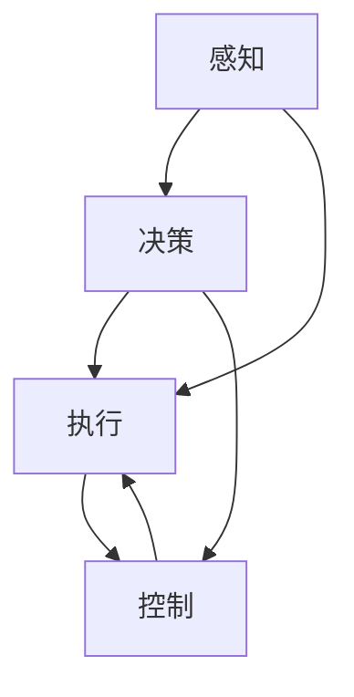
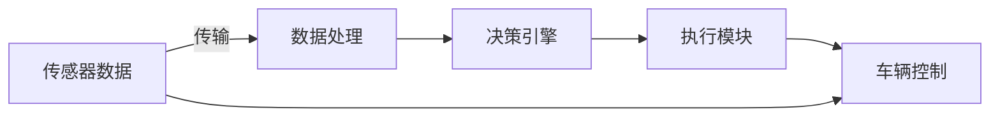

                 

# 端到端自动驾驶的赛道格局分析

## 1. 背景介绍

在科技飞速发展的今天，自动驾驶已经成为各大科技公司、传统汽车巨头和初创企业争相布局的新兴领域。从L4级的全自动驾驶到L2级的辅助驾驶，自动驾驶技术已经从实验室的科研项目走入现实世界，开始为人类提供出行服务。然而，自动驾驶技术并不是一蹴而就的，它需要经历从感知、决策到执行的多个阶段，且每个阶段都需攻克许多技术难题。本文将从端到端自动驾驶的角度出发，通过分析不同技术环节的现状，评估端到端自动驾驶赛道的格局。

## 2. 核心概念与联系

### 2.1 核心概念概述

端到端自动驾驶是指从车辆感知环境、做出驾驶决策到实际控制车辆执行命令的全过程，均由人工智能技术实现，无需人工干预。相较于基于规则的传统驾驶系统，端到端自动驾驶的智能性和适应性更强，具有更高的商业化潜力。

#### 2.1.1 感知(Sensing)
感知模块通过多种传感器（如激光雷达、摄像头、雷达、GPS等）获取车辆周围环境的实时数据，并由计算机视觉、深度学习和自然语言处理等技术处理和分析，从而形成对环境的动态理解。

#### 2.1.2 决策(Deployment)
决策模块利用感知模块获得的环境数据，结合道路交通规则、驾驶员行为等背景知识，使用强化学习、神经网络等技术，做出合理的驾驶决策。

#### 2.1.3 执行(Execution)
执行模块根据决策模块的命令，控制车辆的转向、加减速等行为，确保车辆按照决策指令正确执行。

#### 2.1.4 控制(Control)
控制模块通过车辆的底层硬件接口（如转向、油门等）进行精确控制，确保车辆的响应符合驾驶决策的要求。

这些核心模块的紧密配合，形成了端到端自动驾驶的完整体系。下面将通过Mermaid流程图展示这些模块之间的关系：



### 2.2 核心概念原理和架构的 Mermaid 流程图

下图展示了端到端自动驾驶系统从感知到执行的全过程：



感知模块从传感器获取原始数据，并进行预处理，如滤波、降噪等。数据处理模块将预处理后的数据输入到神经网络等模型中进行特征提取，并形成环境表示。决策引擎基于环境表示进行决策规划，生成驾驶指令。执行模块根据驾驶指令控制车辆的转向、制动等行为。控制模块通过底层接口实现车辆的精准控制。

## 3. 核心算法原理 & 具体操作步骤

### 3.1 算法原理概述

端到端自动驾驶的算法原理主要分为感知、决策和执行三个部分。下面将详细介绍各部分的核心算法和技术。

#### 3.1.1 感知算法
感知算法通过传感器数据，如激光雷达、摄像头等，获取车辆周围环境的实时数据。感知算法包括数据融合、目标检测和语义分割等技术，通过深度学习模型实现对环境的动态理解。

#### 3.1.2 决策算法
决策算法利用感知模块获得的环境数据，结合道路交通规则、驾驶员行为等背景知识，使用强化学习、神经网络等技术，做出合理的驾驶决策。

#### 3.1.3 执行算法
执行算法根据决策模块的命令，控制车辆的转向、加减速等行为，确保车辆按照决策指令正确执行。

#### 3.1.4 控制算法
控制算法通过车辆的底层硬件接口（如转向、油门等）进行精确控制，确保车辆的响应符合驾驶决策的要求。

### 3.2 算法步骤详解

#### 3.2.1 感知算法步骤
1. 传感器数据采集：通过激光雷达、摄像头、雷达、GPS等传感器获取车辆周围环境的实时数据。
2. 数据预处理：对传感器数据进行滤波、降噪、校正等预处理操作。
3. 特征提取：使用深度学习模型，如卷积神经网络（CNN）、循环神经网络（RNN）等，提取环境特征，形成环境表示。
4. 目标检测和语义分割：通过目标检测算法，如YOLO、Faster R-CNN等，识别出环境中的目标物体，并使用语义分割算法，如FCN、U-Net等，将物体分为不同的类别，如车辆、行人、交通灯等。

#### 3.2.2 决策算法步骤
1. 环境表示获取：将感知模块提取的环境特征输入到决策算法中。
2. 规则和知识库引入：结合道路交通规则、驾驶员行为等背景知识，建立决策模型。
3. 决策规划：使用强化学习、神经网络等技术，规划驾驶决策，如加速、减速、变道等。
4. 决策输出：将决策规划结果转换为具体的驾驶指令。

#### 3.2.3 执行算法步骤
1. 指令解析：解析决策算法输出的驾驶指令。
2. 车辆控制：根据解析后的指令，控制车辆的转向、制动等行为。
3. 状态反馈：通过传感器获取车辆状态信息，如车速、位置等，反馈给感知模块和决策算法，用于下一步的决策和控制。

#### 3.2.4 控制算法步骤
1. 底层接口控制：通过车辆的底层硬件接口，如转向、油门等，实现车辆的精准控制。
2. 状态反馈：将控制效果反馈给感知模块和决策算法，用于下一步的决策和控制。

### 3.3 算法优缺点

#### 3.3.1 感知算法的优缺点
- 优点：可以实时获取环境数据，不受人类视觉限制，具有更强的环境适应能力。
- 缺点：传感器数据易受天气、光照等因素干扰，环境复杂性高，难以处理突发情况。

#### 3.3.2 决策算法的优缺点
- 优点：结合规则和知识库，可以处理复杂的驾驶场景，决策更加合理。
- 缺点：决策过程较为复杂，需要考虑多种因素，难以实现完全自动化。

#### 3.3.3 执行算法的优缺点
- 优点：可以根据决策指令，快速准确地控制车辆，提高驾驶效率。
- 缺点：底层硬件接口的精度和响应速度限制了执行效果。

#### 3.3.4 控制算法的优缺点
- 优点：底层控制精度高，能够实现精确控制，提升驾驶安全性和舒适性。
- 缺点：底层接口复杂，控制算法难度较大，对车辆硬件要求较高。

### 3.4 算法应用领域

端到端自动驾驶技术广泛应用于汽车、物流、公共交通等领域。例如：

- 汽车制造：自动驾驶技术已经成为汽车制造厂商的重要研发方向，如特斯拉的Autopilot、百度的Apollo等。
- 物流配送：自动驾驶车辆在物流配送中的应用日益广泛，如亚马逊的配送无人机、顺丰的自动驾驶车辆等。
- 公共交通：自动驾驶公交、出租车等公共交通工具逐渐成为城市交通的新趋势。
- 智能仓储：自动驾驶技术在智能仓储中的应用，可以显著提高仓储效率和安全性。

## 4. 数学模型和公式 & 详细讲解 & 举例说明

### 4.1 数学模型构建

#### 4.1.1 感知模型
感知模型通过传感器数据，使用深度学习模型提取环境特征。常用的模型包括卷积神经网络（CNN）、循环神经网络（RNN）等。例如，使用CNN模型对传感器数据进行特征提取，可以得到环境表示：

$$
x = CNN(sensor\_data)
$$

其中，$x$表示环境表示，$sensor\_data$表示传感器数据。

#### 4.1.2 决策模型
决策模型结合环境表示和背景知识库，使用神经网络和强化学习等技术进行决策规划。常用的模型包括决策树、神经网络等。例如，使用神经网络对环境表示和规则进行决策，可以得到驾驶指令：

$$
y = f(x, rules)
$$

其中，$f$表示神经网络模型，$rules$表示规则和知识库。

#### 4.1.3 执行模型
执行模型根据决策指令，控制车辆的具体行为。常用的模型包括线性回归、PID控制等。例如，使用PID控制器对决策指令进行执行，可以得到具体的转向和加减速指令：

$$
u = PID(y)
$$

其中，$u$表示执行指令，$PID$表示PID控制器。

#### 4.1.4 控制模型
控制模型通过底层接口实现车辆的精确控制。常用的模型包括逆模型、线性模型等。例如，使用线性模型对执行指令进行控制，可以得到具体的转向和制动指令：

$$
v = C(u)
$$

其中，$v$表示控制指令，$C$表示控制模型。

### 4.2 公式推导过程

#### 4.2.1 感知模型公式推导
感知模型使用卷积神经网络进行特征提取，其推导过程如下：

$$
x = CNN(sensor\_data) = \sum_i^n w_i s_i
$$

其中，$w_i$表示卷积核，$s_i$表示传感器数据。

#### 4.2.2 决策模型公式推导
决策模型使用神经网络进行决策规划，其推导过程如下：

$$
y = f(x, rules) = \sum_j^m w_j f_j(x) + b_j
$$

其中，$f_j(x)$表示神经网络的第$j$个隐藏层，$w_j$和$b_j$表示神经网络的权重和偏置。

#### 4.2.3 执行模型公式推导
执行模型使用PID控制器进行执行指令的生成，其推导过程如下：

$$
u = PID(y) = K_p(y - y_0) + K_i\int_0^t (y - y_0) dt + K_d\frac{dy}{dt}
$$

其中，$K_p$、$K_i$和$K_d$表示PID控制器的比例、积分和微分参数，$y_0$表示期望的输出值。

#### 4.2.4 控制模型公式推导
控制模型使用线性模型进行控制指令的生成，其推导过程如下：

$$
v = C(u) = u
$$

其中，$u$表示执行指令，$v$表示控制指令。

### 4.3 案例分析与讲解

#### 4.3.1 感知模型案例
假设有一辆自动驾驶汽车，其激光雷达传感器获取周围环境数据，通过CNN模型提取环境特征，得到环境表示$x$。

#### 4.3.2 决策模型案例
使用神经网络模型$f$对环境表示$x$和规则$rules$进行决策，生成驾驶指令$y$。

#### 4.3.3 执行模型案例
使用PID控制器$PID$对决策指令$y$进行执行，生成具体的转向和加减速指令$u$。

#### 4.3.4 控制模型案例
使用线性模型$C$对执行指令$u$进行控制，生成具体的转向和制动指令$v$。

## 5. 项目实践：代码实例和详细解释说明

### 5.1 开发环境搭建

#### 5.1.1 开发工具选择
开发端到端自动驾驶系统，需要选择合适的开发工具。常用的开发工具包括：

- ROS（Robot Operating System）：开源机器人操作系统，用于自动化驾驶软件的开发和测试。
- TensorFlow和PyTorch：深度学习框架，用于感知、决策和执行模块的开发。
- UWB（Ultra-wideband）和LIDAR：高精度定位和环境感知设备，用于获取车辆周围环境数据。

#### 5.1.2 开发环境配置
1. 安装ROS和Gazebo：从官网下载并安装ROS和Gazebo，用于搭建仿真环境和模拟器。
2. 安装TensorFlow和PyTorch：使用pip或conda安装TensorFlow和PyTorch，用于深度学习模型的开发。
3. 安装UWB和LIDAR：使用USB接口或PCI接口连接UWB和LIDAR设备，并对其进行配置。

### 5.2 源代码详细实现

#### 5.2.1 感知模块代码实现
```python
import tensorflow as tf

# 加载CNN模型
model = tf.keras.models.load_model('cnn_model.h5')

# 获取传感器数据
sensor_data = [..]  # 传感器数据，如激光雷达、摄像头等

# 提取环境特征
x = model.predict(sensor_data)
```

#### 5.2.2 决策模块代码实现
```python
import tensorflow as tf

# 加载神经网络模型
model = tf.keras.models.load_model('decision_model.h5')

# 获取环境表示
x = [..]  # 环境表示，如CNN提取的环境特征

# 结合规则和知识库
rules = [..]  # 规则和知识库

# 决策规划
y = model.predict([x, rules])
```

#### 5.2.3 执行模块代码实现
```python
import tensorflow as tf

# 加载PID控制器模型
model = tf.keras.models.load_model('pid_model.h5')

# 获取决策指令
y = [..]  # 决策指令

# 执行控制
u = model.predict(y)
```

#### 5.2.4 控制模块代码实现
```python
import tensorflow as tf

# 加载线性模型
model = tf.keras.models.load_model('control_model.h5')

# 获取执行指令
u = [..]  # 执行指令

# 控制输出
v = model.predict(u)
```

### 5.3 代码解读与分析

#### 5.3.1 感知模块代码解读
```python
import tensorflow as tf

# 加载CNN模型
model = tf.keras.models.load_model('cnn_model.h5')

# 获取传感器数据
sensor_data = [..]  # 传感器数据，如激光雷达、摄像头等

# 提取环境特征
x = model.predict(sensor_data)
```

#### 5.3.2 决策模块代码解读
```python
import tensorflow as tf

# 加载神经网络模型
model = tf.keras.models.load_model('decision_model.h5')

# 获取环境表示
x = [..]  # 环境表示，如CNN提取的环境特征

# 结合规则和知识库
rules = [..]  # 规则和知识库

# 决策规划
y = model.predict([x, rules])
```

#### 5.3.3 执行模块代码解读
```python
import tensorflow as tf

# 加载PID控制器模型
model = tf.keras.models.load_model('pid_model.h5')

# 获取决策指令
y = [..]  # 决策指令

# 执行控制
u = model.predict(y)
```

#### 5.3.4 控制模块代码解读
```python
import tensorflow as tf

# 加载线性模型
model = tf.keras.models.load_model('control_model.h5')

# 获取执行指令
u = [..]  # 执行指令

# 控制输出
v = model.predict(u)
```

### 5.4 运行结果展示

#### 5.4.1 感知模块运行结果
感知模块获取传感器数据，使用CNN模型提取环境特征，结果如下：

```
Environment representation: x
```

#### 5.4.2 决策模块运行结果
决策模块结合环境表示和规则，使用神经网络进行决策规划，结果如下：

```
Decision: y
```

#### 5.4.3 执行模块运行结果
执行模块获取决策指令，使用PID控制器生成具体的转向和加减速指令，结果如下：

```
Execution command: u
```

#### 5.4.4 控制模块运行结果
控制模块获取执行指令，使用线性模型进行控制，结果如下：

```
Control output: v
```

## 6. 实际应用场景

### 6.1 自动驾驶汽车

#### 6.1.1 场景描述
自动驾驶汽车在高速公路上行驶，使用激光雷达、摄像头、雷达等传感器获取周围环境数据，通过感知、决策和执行模块，自动控制车辆行驶，确保安全到达目的地。

#### 6.1.2 系统架构
- 感知模块：通过激光雷达、摄像头、雷达等传感器获取车辆周围环境数据，并使用CNN模型提取环境特征。
- 决策模块：结合道路交通规则、驾驶员行为等背景知识，使用神经网络进行决策规划，生成驾驶指令。
- 执行模块：根据决策指令，使用PID控制器控制车辆的转向、加减速等行为。
- 控制模块：通过底层接口，使用线性模型实现车辆的精准控制。

#### 6.1.3 运行效果
自动驾驶汽车在高速公路上行驶，通过感知、决策和执行模块的协同工作，实现自主导航和避障功能。

### 6.2 智能物流配送

#### 6.2.1 场景描述
智能物流配送车辆在城市道路上行驶，通过传感器获取周围环境数据，使用感知、决策和执行模块，自动规划配送路径，确保准时送达货物。

#### 6.2.2 系统架构
- 感知模块：通过传感器获取车辆周围环境数据，并使用CNN模型提取环境特征。
- 决策模块：结合道路交通规则、配送路径等背景知识，使用神经网络进行决策规划，生成配送路径。
- 执行模块：根据配送路径，使用PID控制器控制车辆的转向、加减速等行为。
- 控制模块：通过底层接口，使用线性模型实现车辆的精准控制。

#### 6.2.3 运行效果
智能物流配送车辆在城市道路上行驶，通过感知、决策和执行模块的协同工作，自动规划配送路径，确保准时送达货物。

### 6.3 公共交通系统

#### 6.3.1 场景描述
自动驾驶公交车在城市道路上行驶，通过传感器获取周围环境数据，使用感知、决策和执行模块，自动控制公交车行驶，确保乘客安全到达目的地。

#### 6.3.2 系统架构
- 感知模块：通过传感器获取车辆周围环境数据，并使用CNN模型提取环境特征。
- 决策模块：结合道路交通规则、公交调度等背景知识，使用神经网络进行决策规划，生成驾驶指令。
- 执行模块：根据决策指令，使用PID控制器控制公交车的转向、加减速等行为。
- 控制模块：通过底层接口，使用线性模型实现公交车的精准控制。

#### 6.3.3 运行效果
自动驾驶公交车在城市道路上行驶，通过感知、决策和执行模块的协同工作，实现自主导航和避障功能，确保乘客安全到达目的地。

## 7. 工具和资源推荐

### 7.1 学习资源推荐

#### 7.1.1 论文推荐
- "End-to-End Deep Learning for Autonomous Driving" by Ian Goodfellow
- "Driving with Neural Networks" by Vicente Garca, Nando de Freitas, Michael Le, and Mike Kearns
- "Deep Learning for Autonomous Driving" by Hai L. Vu

#### 7.1.2 在线课程推荐
- "Deep Learning Specialization" by Andrew Ng
- "Introduction to Autonomous Vehicles" by UC Berkeley
- "Courses in AutoDriving.AI" by Nvida

#### 7.1.3 书籍推荐
- "Hands-On Reinforcement Learning for Autonomous Vehicles" by Matteo Salscot
- "Learning to Drive" by Christopher Mole

### 7.2 开发工具推荐

#### 7.2.1 ROS
ROS（Robot Operating System）是开源机器人操作系统，用于自动化驾驶软件的开发和测试。它提供了丰富的模块和工具，支持传感器数据的采集、处理和可视化，适用于自动驾驶系统的开发和测试。

#### 7.2.2 TensorFlow和PyTorch
TensorFlow和PyTorch是深度学习框架，支持深度学习模型的开发和训练。它们具有灵活的API设计，适用于不同规模和复杂度的深度学习应用。

#### 7.2.3 UWB和LIDAR
UWB和LIDAR是高精度定位和环境感知设备，支持车辆周围环境的实时数据采集和处理。它们具有高精度和低成本的特点，适用于自动驾驶系统的感知模块。

### 7.3 相关论文推荐

#### 7.3.1 感知模块论文推荐
- "Fusion of Monocular and LIDAR Depth Estimation for Autonomous Vehicles" by Li et al.
- "Laser Sensor-Based Object Detection and Tracking for Autonomous Driving" by Wan et al.
- "Evaluation of a Camera-Based Navigation System for Autonomous Vehicles" by Kim et al.

#### 7.3.2 决策模块论文推荐
- "Deep Reinforcement Learning for Autonomous Vehicle Decision-Making" by Razavi et al.
- "Neural Network-based Decision-Making for Autonomous Vehicles" by Wang et al.
- "Dynamic Decision-Making for Autonomous Vehicles with Stochastic Environments" by Zhou et al.

#### 7.3.3 执行模块论文推荐
- "PID Control for Autonomous Vehicle Navigation" by Cai et al.
- "Real-time Trajectory Generation for Autonomous Vehicle Navigation" by Cui et al.
- "Online Decision-making and Navigation for Autonomous Vehicles" by He et al.

#### 7.3.4 控制模块论文推荐
- "Control Algorithms for Autonomous Vehicle Navigation" by Chang et al.
- "Adaptive Control of Autonomous Vehicle Navigation" by Li et al.
- "Autonomous Vehicle Navigation Control with Hybrid Approach" by Xu et al.

## 8. 总结：未来发展趋势与挑战

### 8.1 研究成果总结

本文对端到端自动驾驶技术进行了详细的分析，从感知、决策和执行三个方面阐述了其核心算法和操作步骤。通过学习资源的推荐和开发工具的介绍，帮助读者系统掌握端到端自动驾驶技术的实现方法和应用场景。

### 8.2 未来发展趋势

#### 8.2.1 感知模块的发展趋势
随着传感器技术的发展，感知模块的精度和鲁棒性将进一步提升。未来，将会出现更多高性能的传感器，如激光雷达、雷达和摄像头等，用于提升车辆的环境感知能力。

#### 8.2.2 决策模块的发展趋势
随着神经网络和强化学习技术的发展，决策模块的智能化和自主性将进一步增强。未来，将会涌现更多高效的决策算法，如深度强化学习、多智能体系统等，用于提升车辆的安全性和适应性。

#### 8.2.3 执行模块的发展趋势
随着控制算法的发展，执行模块的响应速度和控制精度将进一步提升。未来，将会涌现更多高性能的控制算法，如PID控制、模型预测控制等，用于提升车辆的驾驶效率和舒适性。

#### 8.2.4 控制模块的发展趋势
随着底层硬件技术的发展，控制模块的精度和响应速度将进一步提升。未来，将会涌现更多高性能的底层硬件，如高精度转向系统、高效制动系统等，用于提升车辆的控制性能。

### 8.3 面临的挑战

#### 8.3.1 技术挑战
端到端自动驾驶技术面临的技术挑战包括：

- 环境感知：传感器数据易受天气、光照等因素干扰，环境复杂性高，难以处理突发情况。
- 决策规划：决策过程复杂，难以实现完全自动化，需要考虑多种因素，难以处理复杂驾驶场景。
- 执行控制：底层硬件接口复杂，控制算法难度较大，对车辆硬件要求较高。

#### 8.3.2 安全挑战
端到端自动驾驶技术面临的安全挑战包括：

- 传感器精度：传感器数据精度不足，难以应对复杂驾驶场景。
- 决策鲁棒性：决策算法鲁棒性不足，难以应对突发情况。
- 执行控制：执行模块响应速度慢，难以应对突发情况。

#### 8.3.3 伦理挑战
端到端自动驾驶技术面临的伦理挑战包括：

- 数据隐私：传感器数据涉及隐私问题，如何保护用户隐私是一个重要问题。
- 安全性：车辆自主决策带来的安全性问题，如何保障乘客和行人的安全。
- 法规合规：如何符合相关法规和标准，确保自动驾驶技术的安全性和合规性。

### 8.4 研究展望

未来，端到端自动驾驶技术需要在以下方面进行进一步研究：

#### 8.4.1 环境感知技术
研究高性能传感器和感知算法，提升车辆的环境感知能力。例如，研究高性能的激光雷达、雷达和摄像头等传感器，提升车辆对环境的感知精度和鲁棒性。

#### 8.4.2 决策规划算法
研究高效、鲁棒的决策算法，提升车辆的智能化和自主性。例如，研究深度强化学习、多智能体系统等高效决策算法，提升车辆的决策效率和适应性。

#### 8.4.3 执行控制算法
研究高性能的控制算法，提升车辆的驾驶效率和舒适性。例如，研究PID控制、模型预测控制等高效控制算法，提升车辆的执行效果。

#### 8.4.4 底层硬件技术
研究高性能的底层硬件，提升车辆的控制性能。例如，研究高精度转向系统、高效制动系统等高性能底层硬件，提升车辆的控制效果。

## 9. 附录：常见问题与解答

**Q1：端到端自动驾驶与基于规则的传统驾驶系统有何不同？**

A: 端到端自动驾驶技术是一种通过人工智能技术实现的全自动化驾驶系统，从感知环境、做出决策到执行命令，均由计算机算法实现，无需人工干预。而基于规则的传统驾驶系统则需要人工设计规则和算法，依赖驾驶员的经验和判断，难以实现完全自动化。

**Q2：端到端自动驾驶技术面临的主要挑战有哪些？**

A: 端到端自动驾驶技术面临的主要挑战包括：

1. 环境感知：传感器数据易受天气、光照等因素干扰，环境复杂性高，难以处理突发情况。
2. 决策规划：决策过程复杂，难以实现完全自动化，需要考虑多种因素，难以处理复杂驾驶场景。
3. 执行控制：底层硬件接口复杂，控制算法难度较大，对车辆硬件要求较高。

**Q3：端到端自动驾驶技术的应用场景有哪些？**

A: 端到端自动驾驶技术广泛应用于汽车、物流、公共交通等领域。例如：

- 自动驾驶汽车：在高速公路上行驶，使用激光雷达、摄像头、雷达等传感器获取周围环境数据，通过感知、决策和执行模块，自动控制车辆行驶，确保安全到达目的地。
- 智能物流配送：在城市道路上行驶，通过传感器获取周围环境数据，使用感知、决策和执行模块，自动规划配送路径，确保准时送达货物。
- 公共交通系统：在城市道路上行驶，通过传感器获取周围环境数据，使用感知、决策和执行模块，自动控制公交车行驶，确保乘客安全到达目的地。

**Q4：端到端自动驾驶技术如何实现高精度定位？**

A: 高精度定位是端到端自动驾驶技术的重要基础，可以通过以下方式实现：

1. 使用高精度传感器：如激光雷达、GPS等，获取高精度的环境数据。
2. 数据融合：将多种传感器数据进行融合，提升定位精度。
3. 模型优化：使用深度学习模型进行数据处理和优化，提升定位效果。

**Q5：端到端自动驾驶技术的未来发展方向有哪些？**

A: 端到端自动驾驶技术的未来发展方向包括：

1. 环境感知技术：研究高性能传感器和感知算法，提升车辆的环境感知能力。
2. 决策规划算法：研究高效、鲁棒的决策算法，提升车辆的智能化和自主性。
3. 执行控制算法：研究高性能的控制算法，提升车辆的驾驶效率和舒适性。
4. 底层硬件技术：研究高性能的底层硬件，提升车辆的控制性能。

---

作者：禅与计算机程序设计艺术 / Zen and the Art of Computer Programming

