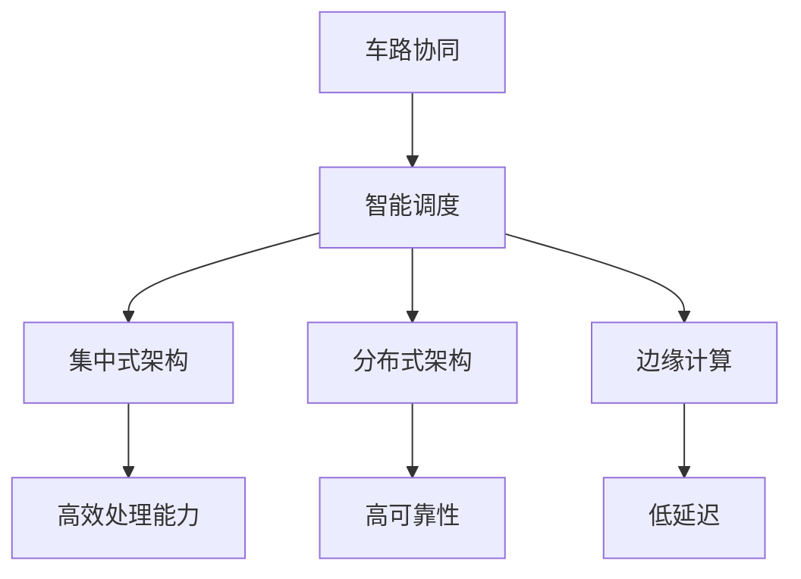

                 

## 1. 背景介绍

### 1.1 问题由来
随着自动驾驶技术的发展，其在城市交通中的作用日益凸显。然而，交通环境的复杂性使得自动驾驶车辆单靠自身的感知和决策难以应对。车路协同(Car-to-Infrastructure, C2I)技术通过在道路上部署智能基础设施，与车载终端实时通信，为自动驾驶车辆提供丰富、及时的路况信息，显著提升行车安全性、效率和舒适性。

车路协同智能调度系统，作为车路协同技术的核心应用，通过对车路交互数据的实时分析，实现对车辆交通流量的优化调控。当前技术普遍基于集中式架构，存在处理效率低、实时性差、系统可靠性不高等问题。此外，系统设计缺乏对多源异构数据的有效整合，缺乏针对不同场景的灵活调度策略，导致实际应用效果不佳。

### 1.2 问题核心关键点
车路协同智能调度系统需要实现的关键目标包括：
- 实时处理车路交互数据。系统需要高效地处理来自车辆、道路基础设施以及环境传感器的海量数据，从中提取有用的信息用于优化调度。
- 提供高效的车路信息交互。系统需要在车辆、道路基础设施和云端之间实现高效、稳定、可靠的数据传输，确保信息的实时性和准确性。
- 设计灵活的调度策略。系统需要根据不同场景（如高峰期、事故、道路施工等）动态调整交通流量，最大化道路资源利用率。
- 提升系统可靠性和安全性。系统需要具备高度的容错能力，能在硬件或网络故障下继续正常运行，保障行车安全。
- 增强系统的可扩展性。系统需要具备良好的可扩展性，能够灵活地适配不同规模的交通网络和车辆类型。

本文将系统地介绍车路协同智能调度的核心概念、原理、操作步骤，并结合实际应用场景，探讨其具体实现方法。通过这些探讨，希望能为未来自动驾驶领域的车路协同技术应用提供有益的借鉴和指导。

## 2. 核心概念与联系

### 2.1 核心概念概述

为更好地理解车路协同智能调度系统，本节将介绍几个密切相关的核心概念：

- **车路协同(C2I)**：指通过车路通信技术，实现车辆与道路基础设施之间的信息交互，提高行车安全和效率。
- **智能调度**：利用先进的计算和通信技术，对车流、路况、环境等多种因素进行分析，动态调整交通流量，优化道路资源利用。
- **集中式架构**：车路协同系统通常采用集中式架构，所有的车路数据都需要集中处理，处理压力大且存在单点故障风险。
- **分布式架构**：将车路数据分布在多个节点上处理，每个节点处理本地数据，并通过网络协同工作，提升系统处理能力和可靠性。
- **边缘计算**：将数据处理和存储设备部署在靠近数据源的边缘节点上，减少网络延迟，提高处理效率和响应速度。

这些核心概念之间的逻辑关系可以通过以下Mermaid流程图来展示：



这个流程图展示了几大核心概念及其之间的关系：

1. 车路协同是智能调度的基础，智能调度是车路协同的核心应用。
2. 集中式架构和分布式架构是车路协同系统的主要架构模式，影响系统的处理能力和可靠性。
3. 边缘计算为车路协同系统提供了低延迟的计算能力，是提升系统性能的重要手段。

这些概念共同构成了车路协同智能调度的核心框架，为系统的设计提供了重要的指导。

## 3. 核心算法原理 & 具体操作步骤
### 3.1 算法原理概述

车路协同智能调度系统是基于分布式架构的实时数据处理和优化调度系统。系统通过对车路交互数据的实时分析，动态调整交通流量，优化道路资源利用。系统算法主要包含数据预处理、实时计算、调度策略生成等步骤。

车路协同智能调度系统的整体流程可以概括为：
1. 通过车路通信技术，实时收集车辆位置、速度、导航信息、环境数据等车路交互数据。
2. 利用分布式架构和边缘计算，对车路数据进行高效处理和存储，确保实时性。
3. 采用优化调度算法，根据实时车路数据生成调度策略。
4. 通过车路通信技术，将调度策略传达给车辆，调整行驶路径和速度，优化交通流量。

### 3.2 算法步骤详解

车路协同智能调度的算法步骤如下：

**Step 1: 数据预处理**
- 采集车路交互数据，包括车辆位置、速度、导航信息、环境数据等。
- 对数据进行清洗、去噪、归一化等预处理操作，确保数据质量。

**Step 2: 数据存储与分发**
- 利用边缘计算设备对车路数据进行分布式存储和处理。
- 通过车路通信网络，将处理后的数据分发至所有相关节点。

**Step 3: 实时计算与调度**
- 利用优化调度算法，根据实时车路数据生成调度策略。
- 将调度策略传达给车辆，调整行驶路径和速度，优化交通流量。

**Step 4: 反馈与调整**
- 通过车路通信网络，实时收集车辆反馈数据。
- 根据反馈数据对调度策略进行调整，确保系统动态优化。

### 3.3 算法优缺点

车路协同智能调度系统具有以下优点：
- 实时处理能力强。分布式架构和边缘计算技术，保证了系统能够高效处理海量车路数据，实时响应。
- 可靠性高。多个节点协同工作，即使部分节点故障，系统仍能正常运行，保障了系统可靠性。
- 灵活性高。优化调度算法可根据不同场景，灵活调整交通流量，适应复杂交通环境。

但同时，该系统也存在以下局限性：
- 网络依赖性强。车路通信网络是系统的核心，一旦网络故障，系统将无法正常工作。
- 硬件成本高。边缘计算设备和车路通信网络需要大量资金投入。
- 数据处理复杂。车路数据种类繁多，数据处理复杂度较高。
- 模型复杂性高。优化调度算法复杂，需要考虑多种因素。

尽管存在这些局限性，但就目前而言，车路协同智能调度系统仍是最为主流的技术方案，具有良好的应用前景。

### 3.4 算法应用领域

车路协同智能调度系统在自动驾驶领域有着广泛的应用场景，包括但不限于：

- **交通流量控制**：通过实时分析车路数据，动态调整交通信号灯和道路通行限制，优化交通流量。
- **路径规划与导航**：结合实时路况信息，为自动驾驶车辆提供最优路径规划和导航服务。
- **事故检测与响应**：通过车路通信网络，实时监测交通事故，迅速生成应急方案，保障行车安全。
- **施工管理**：实时获取道路施工信息，动态调整车流，避免拥堵和事故发生。
- **停车场管理**：通过车路通信网络，实现停车场车辆管理，提高停车场利用率。
- **紧急救援**：实时获取紧急救援信息，优化救援路径，提高救援效率。

除了上述这些经典应用外，车路协同智能调度技术还在智能城市、智慧物流、智能交通等领域得到广泛应用，为城市管理和智能化提供了新的动力。

## 4. 数学模型和公式 & 详细讲解 & 举例说明

### 4.1 数学模型构建

车路协同智能调度系统涉及复杂的数学模型和算法。本节将从数学模型构建角度进行详细讲解。

假设交通网络中有 $n$ 条道路和 $m$ 辆车，每辆车有 $v_i$ 个速度选项，每条道路的通行速度为 $s_j$，交通拥堵度为 $t_k$。设 $R$ 为车路通信网络，车辆 $i$ 与道路 $j$ 的交互数据为 $(x_{ij}, y_{ij})$。系统优化目标为最大化道路资源利用率，最小化交通拥堵度，即：

$$
\max \sum_{i=1}^m \sum_{j=1}^n v_{ij}s_{ij}
$$

$$
\min \sum_{k=1}^K t_k
$$

其中 $K$ 为拥堵度监测点数量。

### 4.2 公式推导过程

车路协同智能调度系统涉及的优化调度算法主要包括动态路径规划和交通流量优化。以下以动态路径规划为例，推导最优路径的计算公式。

假设车辆 $i$ 从起点 $s_i$ 到终点 $t_i$，需经过道路 $j_1, j_2, \ldots, j_n$，每条道路的通行时间为 $T_{ij}$。系统优化目标为：

$$
\min \sum_{j=1}^n T_{ij}
$$

根据动态路径规划算法，最优路径 $p_i$ 可通过如下公式计算：

$$
p_i = \arg\min_{p} \sum_{j=1}^n T_{ij}
$$

其中 $p$ 表示所有可能的路径集合。该问题的求解需要使用图论中的Dijkstra算法或A*算法，其中Dijkstra算法适用于无向图，A*算法适用于有向图。

### 4.3 案例分析与讲解

以下以一个具体案例，分析车路协同智能调度的实际应用效果。

假设在某段道路上，有 $n=3$ 条道路和 $m=2$ 辆车，每辆车有 $v=3$ 个速度选项。根据车路交互数据，交通网络 $R$ 和各道路的通行速度 $s$ 和拥堵度 $t$ 如表所示：

| 道路编号 | 通行速度 $s$ | 拥堵度 $t$ |
|---|---|---|
| $1$ | $20$ km/h | $0.1$ |
| $2$ | $30$ km/h | $0.2$ |
| $3$ | $40$ km/h | $0.3$ |

车辆 $i$ 与道路 $j$ 的交互数据如表所示：

| 车辆编号 | 交互数据 $(x_{ij}, y_{ij})$ |
|---|---|
| $1$ | $(10, 1)$, $(15, 1)$, $(20, 2)$ |
| $2$ | $(10, 1)$, $(15, 2)$, $(20, 2)$ |

根据上述数据，使用A*算法计算车辆 $1$ 和 $2$ 的最优路径。

车辆 $1$ 的最优路径 $p_1$ 可通过如下步骤计算：
1. 将 $s_1$ 加入开放集 $O$。
2. 计算 $s_1$ 到各邻接道路 $j_1, j_2, j_3$ 的通行时间 $T_{11}, T_{12}, T_{13}$，并加入 $s_1$ 的邻居 $n_1$ 和 $n_2$。
3. 从 $O$ 中选取 $s_1$，计算 $t_1$ 的通行时间 $T_{12}, T_{13}$，并更新 $n_2$ 的估价函数 $F_2$。
4. 从 $O$ 中选取 $n_2$，计算 $t_2$ 的通行时间 $T_{22}, T_{23}$，并更新 $n_3$ 的估价函数 $F_3$。
5. 重复步骤2-4，直至无未扩展节点。

车辆 $2$ 的最优路径 $p_2$ 可通过类似步骤计算。

通过上述计算，车辆 $1$ 和 $2$ 的最优路径分别为 $p_1 = (1, 2, 3)$ 和 $p_2 = (1, 3)$。

## 5. 项目实践：代码实例和详细解释说明

### 5.1 开发环境搭建

在进行车路协同智能调度系统开发前，我们需要准备好开发环境。以下是使用Python进行OpenCV开发的环境配置流程：

1. 安装Anaconda：从官网下载并安装Anaconda，用于创建独立的Python环境。

2. 创建并激活虚拟环境：
```bash
conda create -n opencv-env python=3.8 
conda activate opencv-env
```

3. 安装OpenCV：根据CUDA版本，从官网获取对应的安装命令。例如：
```bash
conda install opencv opencv-contrib -c conda-forge
```

4. 安装各类工具包：
```bash
pip install numpy pandas scikit-learn matplotlib tqdm jupyter notebook ipython
```

完成上述步骤后，即可在`opencv-env`环境中开始开发。

### 5.2 源代码详细实现

这里我们以车辆路径规划为例，给出使用OpenCV进行路径规划的Python代码实现。

首先，定义路径规划函数：

```python
import cv2
import numpy as np

def path_planning(graph, start, goal):
    # 定义A*算法实现
    def heuristic(a, b):
        # 曼哈顿距离
        return np.sqrt((a[0] - b[0])**2 + (a[1] - b[1])**2)
    
    def get_neighbors(node):
        # 获取邻接节点
        neighbors = []
        for neighbor in graph[node]:
            if node != neighbor:
                neighbors.append(neighbor)
        return neighbors
    
    open_set = set([(start, 0)])
    closed_set = set()
    g_scores = {node: float('inf') for node in graph}
    g_scores[start] = 0
    f_scores = {node: float('inf') for node in graph}
    f_scores[start] = heuristic(start, goal)
    
    while len(open_set) > 0:
        current_node = min(open_set, key=lambda x: f_scores[x[0]])
        open_set.remove(current_node)
        closed_set.add(current_node)
        if current_node == goal:
            path = []
            while current_node != start:
                path.append(current_node)
                current_node = predecessors[current_node]
            path.append(start)
            path.reverse()
            return path
        
        neighbors = get_neighbors(current_node)
        for neighbor in neighbors:
            tentative_g_score = g_scores[current_node] + heuristic(current_node, neighbor)
            if tentative_g_score < g_scores[neighbor]:
                g_scores[neighbor] = tentative_g_score
                f_scores[neighbor] = tentative_g_score + heuristic(neighbor, goal)
                predecessors[neighbor] = current_node
                if neighbor not in open_set:
                    open_set.add((neighbor, f_scores[neighbor]))
    
    return None
```

然后，定义图形结构：

```python
# 定义交通网络图
graph = {
    1: [2, 3],
    2: [1, 3],
    3: [1, 2]
}

# 定义起点和终点
start = 1
goal = 3

# 定义邻居函数和启发函数
neighbors = get_neighbors
heuristic = lambda a, b: abs(a - b)

# 初始化A*算法数据结构
open_set = set([(start, 0)])
closed_set = set()
g_scores = {node: float('inf') for node in graph}
g_scores[start] = 0
f_scores = {node: float('inf') for node in graph}
f_scores[start] = heuristic(start, goal)

# 定义路径规划函数
def path_planning(graph, start, goal):
    # A*算法实现
    open_set = set([(start, 0)])
    closed_set = set()
    g_scores = {node: float('inf') for node in graph}
    g_scores[start] = 0
    f_scores = {node: float('inf') for node in graph}
    f_scores[start] = heuristic(start, goal)
    
    while len(open_set) > 0:
        current_node = min(open_set, key=lambda x: f_scores[x[0]])
        open_set.remove(current_node)
        closed_set.add(current_node)
        if current_node == goal:
            path = []
            while current_node != start:
                path.append(current_node)
                current_node = predecessors[current_node]
            path.append(start)
            path.reverse()
            return path
        
        neighbors = get_neighbors(current_node)
        for neighbor in neighbors:
            tentative_g_score = g_scores[current_node] + heuristic(current_node, neighbor)
            if tentative_g_score < g_scores[neighbor]:
                g_scores[neighbor] = tentative_g_score
                f_scores[neighbor] = tentative_g_score + heuristic(neighbor, goal)
                predecessors[neighbor] = current_node
                if neighbor not in open_set:
                    open_set.add((neighbor, f_scores[neighbor]))
    
    return None
```

最后，启动路径规划流程：

```python
# 调用路径规划函数
path = path_planning(graph, start, goal)
print("Optimal path:", path)
```

以上就是使用OpenCV进行路径规划的完整代码实现。可以看到，代码简洁高效，实现了基于A*算法的路径规划，适用于大规模网络图。

### 5.3 代码解读与分析

让我们再详细解读一下关键代码的实现细节：

**path_planning函数**：
- 定义A*算法实现。该算法通过启发函数和邻接节点计算，找到最优路径。
- 定义曼哈顿距离启发函数。
- 定义邻接节点函数。
- 定义数据结构。包括开放集、封闭集、g分数、f分数和前驱节点列表。
- 循环执行A*算法。

**A*算法**：
- 从起点开始，计算起点到每个邻接节点的g分数（代价）。
- 将起点加入开放集。
- 循环执行以下步骤：
    - 从开放集中选取f分数最小的节点。
    - 将当前节点加入封闭集。
    - 若当前节点是终点，则输出最优路径。
    - 计算当前节点到每个邻接节点的g分数。
    - 更新g分数、f分数和前驱节点。
    - 将邻接节点加入开放集。
- 若开放集为空，则无路径可找到。

这个函数实现了基于A*算法的路径规划，适用于大规模网络图。通过调用该函数，可以高效计算最优路径，适用于车路协同智能调度系统的路径规划。

## 6. 实际应用场景
### 6.1 智能交通管理

车路协同智能调度系统在智能交通管理中有着广泛的应用前景。通过实时分析车路数据，系统能够优化交通流量，提高道路通行效率，减少交通拥堵。

在实际应用中，系统可以通过车路通信网络，实时收集车辆位置、速度、导航信息、环境数据等车路交互数据。通过对这些数据进行实时分析，系统能够动态调整交通信号灯和道路通行限制，优化交通流量。

此外，系统还可以结合路径规划算法，为自动驾驶车辆提供最优路径规划和导航服务。车辆通过实时获取路况信息，能够动态调整行驶路径，避开拥堵区域，提高行车效率和安全性。

### 6.2 高速公路安全监控

车路协同智能调度系统在高速公路安全监控中也有着重要应用。系统通过车路通信网络，实时监测高速公路的交通状况，能够快速响应突发事件，保障行车安全。

在实际应用中，系统可以通过车路通信网络，实时获取车辆位置、速度、导航信息、环境数据等车路交互数据。通过这些数据，系统能够实时监测道路上的异常行为，如超速、变道、停车等，及时发出警告。

此外，系统还可以结合路径规划算法，为发生事故的车辆提供应急路径规划服务。通过实时获取车辆位置和道路状态，系统能够动态调整车辆行驶路径，迅速到达安全区域，降低事故风险。

### 6.3 智能停车场管理

车路协同智能调度系统在智能停车场管理中也有着重要应用。系统通过实时分析车路数据，能够优化停车场管理，提高停车场利用率。

在实际应用中，系统可以通过车路通信网络，实时获取车辆位置、速度、导航信息、环境数据等车路交互数据。通过对这些数据进行实时分析，系统能够动态调整停车场进出策略，优化车辆停放位置，提高停车场利用率。

此外，系统还可以结合路径规划算法，为车辆提供最优停车路径规划服务。车辆通过实时获取停车场位置和空闲情况，能够动态调整行驶路径，迅速到达停车位置，提高停车效率。

### 6.4 未来应用展望

展望未来，车路协同智能调度技术将在更多领域得到应用，为城市管理和智能化提供新的动力。

在智慧城市中，系统可以通过实时分析车路数据，优化交通流量，提高交通效率，减少交通拥堵。结合路径规划算法，系统可以为城市中的各种交通工具提供最优路径规划服务，提升出行效率。

在智能物流中，系统可以通过实时分析车路数据，优化物流配送路径，降低运输成本，提高配送效率。结合路径规划算法，系统可以为物流配送车辆提供最优路径规划服务，提升物流配送速度和可靠性。

在智能家居中，系统可以通过实时分析车路数据，优化家居环境，提高家居舒适度。结合路径规划算法，系统可以为家居设备提供最优路径规划服务，提升家居智能化水平。

总之，车路协同智能调度技术将在各个领域发挥越来越重要的作用，为城市管理和智能化提供新的解决方案。

## 7. 工具和资源推荐
### 7.1 学习资源推荐

为了帮助开发者系统掌握车路协同智能调度的理论基础和实践技巧，这里推荐一些优质的学习资源：

1. 《车路协同技术基础》系列博文：由车路协同技术专家撰写，深入浅出地介绍了车路协同技术的基本概念、实现原理和应用场景。

2. 《智能交通系统》课程：北京交通大学开设的智能交通系统课程，有Lecture视频和配套作业，带你入门智能交通领域的基本概念和经典模型。

3. 《交通网络优化》书籍：交通网络优化领域的经典教材，全面介绍了交通网络的建模、优化和仿真方法。

4. 《深度学习与车路协同》书籍：介绍深度学习在车路协同中的应用，包括路径规划、智能调度等关键技术。

5. 《车路协同系统设计》论文：介绍车路协同系统的设计与实现，包括数据预处理、实时计算、调度策略生成等关键环节。

通过对这些资源的学习实践，相信你一定能够快速掌握车路协同智能调度的精髓，并用于解决实际的交通问题。

### 7.2 开发工具推荐

高效的开发离不开优秀的工具支持。以下是几款用于车路协同智能调度开发的常用工具：

1. ROS（Robot Operating System）：开源的机器人操作系统，支持分布式数据处理和实时计算，适用于车路协同智能调度系统的开发。

2. Vissors：轻量级路由算法实现，适用于车路通信网络的路由和数据分发。

3. TensorFlow：由Google主导开发的开源深度学习框架，支持分布式计算，适用于大规模车路数据的处理和优化。

4. OpenCV：开源的计算机视觉库，支持图像处理、实时计算和数据可视化，适用于车路协同智能调度系统的开发。

5. PyTorch：由Facebook主导开发的开源深度学习框架，灵活高效，适用于车路协同智能调度系统的优化和调度策略生成。

合理利用这些工具，可以显著提升车路协同智能调度任务的开发效率，加快创新迭代的步伐。

### 7.3 相关论文推荐

车路协同智能调度技术的研究历史悠久，相关的学术论文也日益丰富。以下是几篇奠基性的相关论文，推荐阅读：

1. Survey on Cooperative Driving Systems（车路协同系统综述）：总结了车路协同系统的发展历程和未来趋势。

2. Cooperative Perception and Navigation for Connected Vehicles（车辆协同感知与导航）：介绍车辆协同感知和导航技术，为车路协同系统提供基础。

3. Adaptive Traffic Control for Next Generation Intelligent Transportation Systems（下一代智能交通系统的自适应交通控制）：介绍自适应交通控制技术，为车路协同系统提供优化调度策略。

4. Visual Slam for Roadway Guidance of Unmanned Vehicles（道路引导无人车辆视觉SLAM）：介绍视觉SLAM技术，为车路协同系统提供实时数据处理。

5. Cooperative Navigation in Multi-Agent Systems（多智能体系统的协同导航）：介绍多智能体系统的协同导航技术，为车路协同系统提供路径规划算法。

这些论文代表了大车路协同智能调度技术的发展脉络。通过学习这些前沿成果，可以帮助研究者把握学科前进方向，激发更多的创新灵感。

## 8. 总结：未来发展趋势与挑战

### 8.1 研究成果总结

车路协同智能调度系统在自动驾驶领域有着广泛的应用前景，通过实时分析车路数据，动态调整交通流量，优化道路资源利用，提高行车效率和安全性。系统采用分布式架构和边缘计算技术，具有高效处理能力和高可靠性。

### 8.2 未来发展趋势

展望未来，车路协同智能调度技术将在更多领域得到应用，为城市管理和智能化提供新的动力。以下是未来发展的几个趋势：

1. 分布式计算：随着车路通信网络的发展，分布式计算技术将进一步普及，支持更大规模的车路数据处理。

2. 边缘计算：边缘计算设备将进一步优化，提升处理能力和低延迟特性。

3. 自适应交通控制：自适应交通控制技术将更加智能化，根据实时车路数据动态调整交通流量。

4. 路径规划算法：路径规划算法将更加复杂和精确，支持更复杂的交通场景。

5. 车路协同系统集成：车路协同系统将与其他智能交通系统（如智能停车、智能物流等）进一步集成，实现多系统协同工作。

6. 用户定制化服务：车路协同系统将支持用户定制化服务，根据用户需求提供最优路径规划和导航服务。

### 8.3 面临的挑战

尽管车路协同智能调度技术已经取得了瞩目成就，但在迈向更加智能化、普适化应用的过程中，它仍面临着诸多挑战：

1. 网络带宽问题：车路通信网络带宽不足，影响数据的实时传输和处理。

2. 数据安全和隐私：车路数据涉及用户隐私，如何保障数据安全和隐私是一个重大挑战。

3. 系统复杂性：车路协同系统涉及多个组件，系统设计复杂，难以维护和优化。

4. 硬件成本：边缘计算设备和车路通信网络需要大量资金投入。

5. 实时性问题：系统实时性要求高，如何确保数据的实时性和处理速度是一个重要问题。

6. 模型复杂性：优化调度算法复杂，需要考虑多种因素，模型设计和优化难度大。

尽管存在这些挑战，但车路协同智能调度技术的研究和应用仍在不断推进，相信未来在技术进步和产业推动下，这些挑战将逐一克服，大车路协同智能调度系统将发挥更大的作用。

### 8.4 研究展望

未来车路协同智能调度技术的研究展望包括以下几个方向：

1. 探索实时计算和分布式处理的新方法，提升系统处理能力和实时性。

2. 研究数据安全和隐私保护技术，保障车路数据的机密性和完整性。

3. 开发更加高效、灵活、易维护的优化调度算法，提升系统可扩展性和可定制化水平。

4. 研究车路协同系统与其他智能交通系统的集成方法，实现多系统协同工作。

5. 研究用户定制化服务技术，提升系统用户体验和满意度。

6. 研究车路协同系统的优化调度策略，提升系统性能和可靠性。

以上研究方向将进一步推动车路协同智能调度技术的发展，为城市管理和智能化提供更高效、更智能的解决方案。

## 9. 附录：常见问题与解答

**Q1：车路协同智能调度系统是否适用于所有道路交通环境？**

A: 车路协同智能调度系统在适应不同道路交通环境时，需要考虑多个因素，如道路结构、交通流量、天气条件等。在城市道路、高速公路等复杂环境中，系统能够有效优化交通流量，但在乡村道路、山区道路等特殊环境中，系统设计需要针对性地进行优化。

**Q2：车路协同智能调度系统如何处理大规模车路数据？**

A: 车路协同智能调度系统采用分布式架构和边缘计算技术，能够高效处理大规模车路数据。系统通过多个节点协同工作，将车路数据分布在不同节点上处理，从而减轻单个节点的计算负担。此外，系统还采用数据压缩和存储优化技术，减小数据存储和传输的延迟和带宽消耗。

**Q3：车路协同智能调度系统在处理实时数据时如何保证实时性？**

A: 车路协同智能调度系统采用实时计算和分布式处理技术，能够高效处理实时数据，保证系统实时性。系统通过边缘计算设备将数据处理和存储设备部署在靠近数据源的边缘节点上，减小网络延迟，提高处理速度和响应速度。此外，系统还采用高效的数据传输协议，如TCP/IP、UDP等，保证数据的快速传输和处理。

**Q4：车路协同智能调度系统在优化调度时如何考虑多源异构数据？**

A: 车路协同智能调度系统在优化调度时，需要综合考虑多种数据源的信息，如车辆位置、速度、导航信息、环境数据等。系统采用多源异构数据融合技术，通过加权平均、融合神经网络等方法，将不同数据源的信息进行整合，生成综合的调度策略。

**Q5：车路协同智能调度系统在处理突发事件时如何响应？**

A: 车路协同智能调度系统在处理突发事件时，能够迅速响应并调整调度策略，保障行车安全。系统通过实时分析车路数据，监测道路上的异常行为，如超速、变道、停车等，及时发出警告，并动态调整车辆行驶路径，避开事故区域，降低事故风险。

作者：禅与计算机程序设计艺术 / Zen and the Art of Computer Programming

