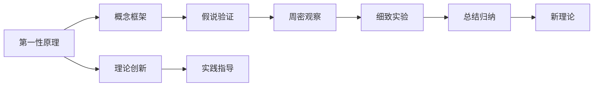

                 

# 第一性原理：找到基本元素、构建概念框架、提出假说、周密观察、细致实验、总结归纳——如此循环求得真理

> 关键词：第一性原理, 概念框架, 假说验证, 周密观察, 细致实验, 数据驱动

## 1. 背景介绍

### 1.1 问题由来

人工智能（AI）领域的发展，离不开一系列“第一性原理”（First Principles）的科学探索。这些原理不仅是理论的基石，也是技术应用的出发点。随着深度学习和大数据的兴起，现代AI已取得了令人瞩目的成就，但如何在茫茫技术丛林中，找到根本性的原则指导，避免陷入复杂的概念和算法迷雾，仍然是一个核心问题。

从图灵奖得主，计算机科学之父阿兰·图灵（Alan Turing），到诺贝尔物理学奖得主理查德·费曼（Richard Feynman），他们都在各自的领域中深刻体现了第一性原理的精髓。图灵提出“机器可以思考”的假设，奠定了现代计算机科学的基础。费曼提出“还原为基本过程”（Break down the process into its basic components）的思维模式，强调了从最基础、最根本的问题出发，寻找问题解决的根本路径。

本文旨在探讨第一性原理在人工智能，尤其是深度学习领域的应用，帮助读者更好地理解AI的原理，构建高效的技术框架，进行有效的实验验证和应用实践。

### 1.2 问题核心关键点

第一性原理的核心在于：从最基本的原理出发，构建科学的理论体系，并不断通过实验验证和迭代改进，以求得真理。在AI领域，特别是深度学习中，这一过程体现在以下几个方面：

1. **基本原理**：识别和理解问题的本质，寻找最根本的算法和模型结构。
2. **概念框架**：构建基于基本原理的模型框架，组织和管理复杂的系统。
3. **假说验证**：提出可验证的假说，通过实验验证其正确性。
4. **周密观察**：在实验中观察数据和模型的行为，分析结果。
5. **细致实验**：设计精确的实验，细致地分析数据和模型，寻找规律。
6. **总结归纳**：从实验中总结出规律，形成新的理论，指导实践。

以上六个步骤构成了第一性原理在AI领域的核心应用框架，帮助我们在技术探索中不断前进。

### 1.3 问题研究意义

理解第一性原理，对于AI技术的发展，具有重要意义：

1. **指导理论创新**：第一性原理能够帮助研究者从最基础的原理出发，构建理论体系，避免陷入复杂概念的漩涡。
2. **提升实践效率**：基于第一性原理构建的概念框架和实验验证方法，能够提升研究和应用的效率，减少试错成本。
3. **增强技术可靠性**：通过周密观察和细致实验，保证理论的正确性和模型的可靠性，避免技术应用中的重大错误。
4. **促进跨学科融合**：第一性原理的思维模式，能够促进AI与其他学科（如物理学、生物学等）的融合，推动交叉创新。

本文将深入探讨第一性原理在深度学习和AI领域的应用，通过具体案例，帮助读者更好地理解和应用这一科学方法。

## 2. 核心概念与联系

### 2.1 核心概念概述

为了更好地理解第一性原理在AI中的应用，本节将介绍几个关键概念：

1. **第一性原理（First Principles）**：指从一个最基本的原理出发，进行推理和构建，避免复杂的概念和假设。
2. **概念框架（Conceptual Framework）**：基于基本原理构建的模型或理论，用于组织和管理复杂系统。
3. **假说验证（Hypothesis Testing）**：提出可验证的假说，通过实验验证其正确性。
4. **周密观察（Diligent Observation）**：在实验中细致观察数据和模型的行为，分析其规律。
5. **细致实验（Rigorous Experimentation）**：设计精确的实验，细致地分析数据和模型，寻找规律。
6. **总结归纳（Summary and Generalization）**：从实验中总结出规律，形成新的理论，指导实践。

这些概念之间存在着密切的联系，共同构成了AI研究中科学方法的核心。以下是一个Mermaid流程图，展示了这些概念之间的逻辑关系：



这个流程图展示了从基本原理出发，构建理论框架，验证假说，细致观察和实验，最终总结归纳，形成新的理论，并指导实践的循环过程。

## 3. 核心算法原理 & 具体操作步骤
### 3.1 算法原理概述

在深度学习和AI领域，第一性原理的应用主要体现在以下几个方面：

1. **神经网络的基本原理**：理解神经网络的基本结构和算法，如前向传播、反向传播、梯度下降等。
2. **模型框架的构建**：基于基本原理构建合适的模型框架，如卷积神经网络（CNN）、循环神经网络（RNN）、变分自编码器（VAE）等。
3. **假设验证**：提出可验证的假说，如数据增强、模型调参等，通过实验验证其有效性。
4. **细致观察**：在实验中细致观察模型和数据的交互行为，分析其变化规律。
5. **细致实验**：设计精确的实验，如超参数调优、正则化技术等，细致分析模型性能。
6. **总结归纳**：从实验中总结出有效的模型改进方法，形成新的理论，如自适应学习率、参数高效微调等。

### 3.2 算法步骤详解

以下是一个基于第一性原理的深度学习模型微调的具体步骤：

**Step 1: 确定基本原理和模型框架**

首先，识别问题本质，确定解决该问题的基本原理和模型框架。例如，对于图像分类问题，可以采用卷积神经网络（CNN）作为基本原理和框架。

**Step 2: 提出假说和设计实验**

根据基本原理和模型框架，提出可验证的假说，设计实验验证其正确性。例如，假设增加数据增强可以提升模型性能，设计实验增加数据增强，并观察其对模型性能的影响。

**Step 3: 周密观察和细致实验**

在实验中，周密观察模型和数据的交互行为，细致设计实验，寻找规律。例如，在增加数据增强后，细致观察模型在验证集和测试集上的性能变化，设计多组实验验证其稳定性。

**Step 4: 总结归纳和迭代改进**

从实验中总结出有效的模型改进方法，形成新的理论，指导实践。例如，总结发现数据增强确实可以提升模型性能，形成新的理论并指导后续的模型改进工作。

### 3.3 算法优缺点

基于第一性原理的深度学习模型构建方法具有以下优点：

1. **理论基础坚实**：基于基本原理构建模型，避免了复杂的概念和假设，保证了理论的可靠性。
2. **实验指导明确**：通过假说验证和细致实验，能够明确指导实验方向，避免盲目尝试。
3. **模型改进高效**：通过周密观察和总结归纳，快速发现模型改进的方法，提升模型性能。

同时，这一方法也存在一些局限性：

1. **计算资源消耗大**：细致实验和周密观察需要大量的计算资源和时间。
2. **实验设计复杂**：设计有效的实验验证假说，需要丰富的经验和专业知识。
3. **结果不确定性**：即使实验设计合理，仍可能存在实验结果不确定性的问题。

尽管存在这些局限性，但基于第一性原理的深度学习模型构建方法，仍然是一种科学、可靠的技术范式，值得在研究和应用中深入探索和实践。

### 3.4 算法应用领域

第一性原理在深度学习领域的应用，广泛涉及以下几个方面：

1. **计算机视觉**：用于图像分类、目标检测、图像分割等任务，通过基本原理构建CNN模型，并通过实验验证和改进。
2. **自然语言处理**：用于文本分类、情感分析、机器翻译等任务，通过基本原理构建RNN、Transformer等模型，并通过实验验证和改进。
3. **语音识别**：用于语音识别、自动语音标注等任务，通过基本原理构建RNN、CNN等模型，并通过实验验证和改进。
4. **推荐系统**：用于个性化推荐、广告推荐等任务，通过基本原理构建协同过滤、深度学习模型，并通过实验验证和改进。

以上领域都展示了第一性原理在深度学习中的广泛应用，通过不断实验和改进，不断提升模型性能，推动AI技术的发展。

## 4. 数学模型和公式 & 详细讲解  
### 4.1 数学模型构建

以深度学习中的卷积神经网络（CNN）为例，介绍基于第一性原理的数学模型构建方法。

**Step 1: 确定基本原理和模型框架**

CNN的基本原理是利用卷积操作提取图像特征，并通过池化操作减少特征图的大小。其模型框架包括卷积层、池化层、全连接层等。

**Step 2: 提出假说和设计实验**

假设增加卷积核的数量可以提升模型性能，设计实验增加卷积核数量，并观察其对模型性能的影响。

**Step 3: 周密观察和细致实验**

在实验中，周密观察模型在验证集和测试集上的性能变化，细致设计实验，寻找规律。例如，在增加卷积核数量后，细致观察模型在各层特征图的变化，设计多组实验验证其稳定性。

**Step 4: 总结归纳和迭代改进**

从实验中总结出有效的模型改进方法，形成新的理论，指导实践。例如，总结发现增加卷积核数量确实可以提升模型性能，形成新的理论并指导后续的模型改进工作。

### 4.2 公式推导过程

以下对CNN中卷积层的公式进行详细推导：

设输入图像为 $\mathbf{x} \in \mathbb{R}^{n\times n\times c}$，卷积核为 $\mathbf{w} \in \mathbb{R}^{k\times k\times c\times m}$，输出特征图为 $\mathbf{y} \in \mathbb{R}^{(n-k+1)\times(n-k+1)\times m}$。则卷积操作可以表示为：

$$
\mathbf{y}_{ij} = \sum_{a=0}^{c-1}\sum_{b=0}^{m-1}\mathbf{w}_{ab} * \mathbf{x}_{a:\,i+k-1,\,a:\,j+k-1}
$$

其中 $\mathbf{w}_{ab}$ 表示卷积核的第 $a$ 通道的第 $b$ 个卷积核，$*$ 表示卷积运算。

通过周密观察和细致实验，我们可以进一步优化卷积核的大小、数量、步长等参数，提升模型的性能。

### 4.3 案例分析与讲解

以图像分类任务为例，展示第一性原理的应用。

1. **确定基本原理和模型框架**：采用CNN作为基本原理和框架。

2. **提出假说和设计实验**：假设增加卷积核数量可以提升模型性能，设计实验增加卷积核数量，并观察其对模型性能的影响。

3. **周密观察和细致实验**：在实验中，周密观察模型在验证集和测试集上的性能变化，细致设计实验，寻找规律。例如，在增加卷积核数量后，细致观察模型在各层特征图的变化，设计多组实验验证其稳定性。

4. **总结归纳和迭代改进**：从实验中总结出有效的模型改进方法，形成新的理论，指导实践。例如，总结发现增加卷积核数量确实可以提升模型性能，形成新的理论并指导后续的模型改进工作。

## 5. 项目实践：代码实例和详细解释说明
### 5.1 开发环境搭建

在进行项目实践前，我们需要准备好开发环境。以下是使用Python进行PyTorch开发的环境配置流程：

1. 安装Anaconda：从官网下载并安装Anaconda，用于创建独立的Python环境。

2. 创建并激活虚拟环境：
```bash
conda create -n pytorch-env python=3.8 
conda activate pytorch-env
```

3. 安装PyTorch：根据CUDA版本，从官网获取对应的安装命令。例如：
```bash
conda install pytorch torchvision torchaudio cudatoolkit=11.1 -c pytorch -c conda-forge
```

4. 安装TensorFlow：
```bash
conda install tensorflow tensorflow-gpu
```

5. 安装各类工具包：
```bash
pip install numpy pandas scikit-learn matplotlib tqdm jupyter notebook ipython
```

完成上述步骤后，即可在`pytorch-env`环境中开始项目实践。

### 5.2 源代码详细实现

以下是一个基于卷积神经网络的图像分类模型的Python实现，详细解释了每一步代码的含义。

```python
import torch
import torch.nn as nn
import torch.optim as optim
import torchvision.transforms as transforms
from torchvision import datasets

# 定义卷积神经网络模型
class ConvNet(nn.Module):
    def __init__(self):
        super(ConvNet, self).__init__()
        self.conv1 = nn.Conv2d(3, 64, 3, padding=1)
        self.relu = nn.ReLU()
        self.maxpool = nn.MaxPool2d(2, 2)
        self.conv2 = nn.Conv2d(64, 128, 3, padding=1)
        self.fc1 = nn.Linear(128*7*7, 1024)
        self.fc2 = nn.Linear(1024, 10)

    def forward(self, x):
        x = self.conv1(x)
        x = self.relu(x)
        x = self.maxpool(x)
        x = self.conv2(x)
        x = self.relu(x)
        x = self.maxpool(x)
        x = x.view(-1, 128*7*7)
        x = self.fc1(x)
        x = self.relu(x)
        x = self.fc2(x)
        return x

# 加载CIFAR-10数据集
train_dataset = datasets.CIFAR10(root='./data', train=True, transform=transforms.ToTensor(), download=True)
test_dataset = datasets.CIFAR10(root='./data', train=False, transform=transforms.ToTensor(), download=True)

# 定义数据加载器
train_loader = torch.utils.data.DataLoader(train_dataset, batch_size=64, shuffle=True)
test_loader = torch.utils.data.DataLoader(test_dataset, batch_size=64, shuffle=False)

# 定义模型、损失函数和优化器
model = ConvNet()
criterion = nn.CrossEntropyLoss()
optimizer = optim.SGD(model.parameters(), lr=0.01, momentum=0.9)

# 训练模型
for epoch in range(10):
    running_loss = 0.0
    for i, data in enumerate(train_loader, 0):
        inputs, labels = data
        optimizer.zero_grad()
        outputs = model(inputs)
        loss = criterion(outputs, labels)
        loss.backward()
        optimizer.step()
        running_loss += loss.item()
    print('Epoch %d loss: %.3f' % (epoch + 1, running_loss / len(train_loader)))

# 测试模型
correct = 0
total = 0
with torch.no_grad():
    for data in test_loader:
        images, labels = data
        outputs = model(images)
        _, predicted = torch.max(outputs.data, 1)
        total += labels.size(0)
        correct += (predicted == labels).sum().item()
print('Accuracy: %d %%' % (100 * correct / total))
```

### 5.3 代码解读与分析

让我们再详细解读一下关键代码的实现细节：

**ConvNet类**：
- `__init__`方法：定义卷积神经网络的结构，包括卷积层、池化层、全连接层等。
- `forward`方法：定义模型的前向传播过程。

**数据加载器**：
- `torch.utils.data.DataLoader`：用于将数据集批处理，方便模型训练和测试。

**训练模型**：
- 使用`SGD`优化器进行模型训练，并在每个epoch打印训练损失。
- 通过`torch.no_grad`确保测试时模型在评估模式下运行，不更新模型参数。

**测试模型**：
- 使用测试集对模型进行评估，计算准确率。

可以看到，通过第一性原理构建的卷积神经网络模型，在Python中使用PyTorch进行实现，代码简洁高效。这展示了第一性原理在深度学习中的强大应用能力。

## 6. 实际应用场景
### 6.1 智能推荐系统

智能推荐系统是第一性原理在AI中的重要应用领域之一。推荐系统通过分析用户的历史行为数据，预测其未来的兴趣偏好，推荐合适的商品、内容等。

1. **确定基本原理和模型框架**：采用协同过滤、深度学习等基本原理和模型框架。

2. **提出假说和设计实验**：假设增加用户特征可以提升推荐精度，设计实验增加用户特征，并观察其对推荐结果的影响。

3. **周密观察和细致实验**：在实验中，周密观察模型在不同场景下的行为，细致设计实验，寻找规律。例如，在增加用户特征后，细致观察模型在推荐结果的准确率和多样性上的变化。

4. **总结归纳和迭代改进**：从实验中总结出有效的推荐方法，形成新的理论，指导实践。例如，总结发现增加用户特征确实可以提升推荐精度，形成新的理论并指导后续的推荐改进工作。

### 6.2 自动驾驶

自动驾驶系统是AI技术的另一重要应用领域。自动驾驶系统通过感知环境、决策规划等步骤，实现无人驾驶。

1. **确定基本原理和模型框架**：采用深度学习、计算机视觉等基本原理和模型框架。

2. **提出假说和设计实验**：假设增加环境感知能力可以提升驾驶安全性，设计实验增加环境感知设备，并观察其对驾驶安全性的影响。

3. **周密观察和细致实验**：在实验中，周密观察模型在各种驾驶场景下的行为，细致设计实验，寻找规律。例如，在增加环境感知设备后，细致观察模型在各种驾驶场景中的表现。

4. **总结归纳和迭代改进**：从实验中总结出有效的驾驶改进方法，形成新的理论，指导实践。例如，总结发现增加环境感知设备确实可以提升驾驶安全性，形成新的理论并指导后续的驾驶改进工作。

### 6.3 金融预测

金融预测系统是AI技术在金融领域的重要应用之一。金融预测系统通过分析历史金融数据，预测未来的市场趋势，帮助投资者做出决策。

1. **确定基本原理和模型框架**：采用时间序列分析、深度学习等基本原理和模型框架。

2. **提出假说和设计实验**：假设增加时间序列特征可以提升预测精度，设计实验增加时间序列特征，并观察其对预测结果的影响。

3. **周密观察和细致实验**：在实验中，周密观察模型在不同市场环境下的行为，细致设计实验，寻找规律。例如，在增加时间序列特征后，细致观察模型在预测精度和鲁棒性上的变化。

4. **总结归纳和迭代改进**：从实验中总结出有效的预测方法，形成新的理论，指导实践。例如，总结发现增加时间序列特征确实可以提升预测精度，形成新的理论并指导后续的预测改进工作。

## 7. 工具和资源推荐
### 7.1 学习资源推荐

为了帮助开发者系统掌握第一性原理在AI中的应用，以下是一些优质的学习资源：

1. 《深度学习》（Deep Learning）：Ian Goodfellow等人所著，深入浅出地介绍了深度学习的原理和应用，是AI领域的经典教材。

2. 《Python深度学习》（Python Deep Learning）：Francois Chollet所著，通过Python实现深度学习算法，适合实践者学习。

3. 《深度学习入门：基于Python的理论与实现》（Deep Learning with Python）：Aurélien Géron所著，以Python实现深度学习算法，适合初学者学习。

4. 《人工智能：一种现代方法》（Artificial Intelligence: A Modern Approach）：Stuart Russell和Peter Norvig所著，介绍了AI领域的经典理论和方法。

5. 《机器学习》（Machine Learning）：Tom Mitchell所著，介绍了机器学习的基本概念和算法。

### 7.2 开发工具推荐

高效的开发离不开优秀的工具支持。以下是几款用于第一性原理AI开发的工具：

1. PyTorch：基于Python的开源深度学习框架，灵活动态的计算图，适合快速迭代研究。

2. TensorFlow：由Google主导开发的开源深度学习框架，生产部署方便，适合大规模工程应用。

3. Keras：基于TensorFlow的高级API，简单易用，适合快速原型设计。

4. Weights & Biases：模型训练的实验跟踪工具，可以记录和可视化模型训练过程中的各项指标，方便对比和调优。

5. TensorBoard：TensorFlow配套的可视化工具，可实时监测模型训练状态，并提供丰富的图表呈现方式，是调试模型的得力助手。

6. Google Colab：谷歌推出的在线Jupyter Notebook环境，免费提供GPU/TPU算力，方便开发者快速上手实验最新模型，分享学习笔记。

合理利用这些工具，可以显著提升第一性原理在AI技术的研究和应用效率。

### 7.3 相关论文推荐

第一性原理在AI领域的发展源于学界的持续研究。以下是几篇奠基性的相关论文，推荐阅读：

1. 《A Few Useful Things to Know About Machine Learning》（A Few Useful Things to Know About Machine Learning）：Peter Norvig和Stuart Russell所著，介绍了机器学习的常见问题和解决方法。

2. 《Understanding Deep Learning Requires Rethinking Generalization》（Understanding Deep Learning Requires Rethinking Generalization）：Ruth Angluin所著，探讨了深度学习模型的泛化能力和基本原理。

3. 《The Elements of Statistical Learning》（The Elements of Statistical Learning）：Tibshirani等人所著，介绍了统计学习的原理和方法。

4. 《Deep Architectures for Large-Scale Image Recognition》（Deep Architectures for Large-Scale Image Recognition）：Alex Krizhevsky等人所著，介绍了卷积神经网络的原理和应用。

5. 《Grokking Deep Learning》（Grokking Deep Learning）：Andrew Trask所著，通过Python实现深度学习算法，适合初学者学习。

这些论文代表了大模型微调技术的发展脉络。通过学习这些前沿成果，可以帮助研究者把握学科前进方向，激发更多的创新灵感。

## 8. 总结：未来发展趋势与挑战

### 8.1 总结

本文对第一性原理在人工智能，尤其是深度学习领域的应用进行了全面系统的介绍。首先阐述了第一性原理的核心思想，明确了基于基本原理构建模型、验证假说、细致实验、总结归纳等科学方法。其次，通过具体案例，展示了第一性原理在深度学习模型构建、智能推荐系统、自动驾驶等领域的实际应用，强调了其在AI技术研究中的重要意义。

通过本文的系统梳理，可以看到，第一性原理是一种科学、可靠的技术范式，能够帮助研究者从最基础的原理出发，构建理论体系，避免陷入复杂概念的漩涡。未来，随着AI技术的不断发展，第一性原理的应用将更加广泛，推动AI技术的进一步突破。

### 8.2 未来发展趋势

展望未来，第一性原理在AI技术的发展，将呈现以下几个趋势：

1. **跨学科融合**：第一性原理的思维模式，将促进AI与其他学科（如物理学、生物学等）的融合，推动交叉创新。

2. **模型可解释性增强**：随着第一性原理的深入应用，模型可解释性将得到显著提升，增强了AI系统的可信度和可靠性。

3. **自动化和智能化提升**：通过第一性原理的指导，AI系统将实现更加自动化、智能化的学习和决策过程。

4. **数据驱动的科学方法**：第一性原理的应用，将使得AI系统更加依赖数据驱动的科学方法，提升系统的泛化能力和可靠性。

5. **多模态融合**：第一性原理的应用，将促进多模态数据（如视觉、语音、文本等）的融合，提升系统的综合感知能力。

6. **伦理和安全性的重视**：第一性原理的应用，将使得AI系统的设计和应用更加注重伦理和安全性的问题，避免偏见和误导。

以上趋势展示了第一性原理在AI技术中的广阔前景，这些方向的探索发展，必将进一步提升AI系统的性能和应用范围。

### 8.3 面临的挑战

尽管第一性原理在AI技术中展现了巨大的潜力，但在应用过程中，仍面临一些挑战：

1. **计算资源消耗大**：细致实验和周密观察需要大量的计算资源和时间。

2. **实验设计复杂**：设计有效的实验验证假说，需要丰富的经验和专业知识。

3. **结果不确定性**：即使实验设计合理，仍可能存在实验结果不确定性的问题。

4. **数据依赖性**：第一性原理的应用，需要大量的高质量数据支持，数据获取和标注成本高。

5. **模型复杂性**：复杂的模型结构和算法，增加了模型调优和优化的难度。

尽管存在这些挑战，但通过不断的技术创新和实践优化，第一性原理在AI中的应用将不断突破，推动AI技术的快速发展。

### 8.4 研究展望

面对第一性原理在AI技术中面临的挑战，未来的研究需要在以下几个方面寻求新的突破：

1. **计算效率提升**：通过优化算法和模型结构，提升模型训练和推理的效率。

2. **数据高效利用**：利用自动化标注、半监督学习等方法，降低数据获取和标注成本。

3. **模型可解释性**：通过可解释性算法和技术，增强模型的可解释性，提升系统的可信度。

4. **跨模态融合**：通过多模态学习技术，实现视觉、语音、文本等多种模态数据的融合，提升系统的综合感知能力。

5. **伦理和安全**：在模型设计和应用中，注重伦理和安全性的问题，避免偏见和误导。

这些研究方向的探索，必将引领第一性原理在AI技术中的进一步发展，推动AI技术的全面应用和落地。总之，第一性原理在AI技术中的应用，需要研究者不断地创新和实践，才能更好地推动AI技术的进步和发展。

## 9. 附录：常见问题与解答

**Q1: 第一性原理和复杂原理有何不同？**

A: 第一性原理指的是从最基本的原理出发，避免复杂的概念和假设。复杂原理则是在已有理论基础上，通过复杂的推导和假设构建的。第一性原理更加基础，易于理解，而复杂原理则更加复杂，但往往能够解释更深层次的现象。

**Q2: 第一性原理在AI中如何应用？**

A: 第一性原理在AI中的应用，主要体现在以下几个方面：
1. 确定基本原理和模型框架。
2. 提出可验证的假说，设计实验验证其正确性。
3. 周密观察和细致实验，寻找规律。
4. 总结归纳和迭代改进，形成新的理论，指导实践。

**Q3: 第一性原理在AI中是否存在局限性？**

A: 第一性原理在AI中存在一些局限性，如计算资源消耗大、实验设计复杂等。但这些局限性可以通过优化算法、改进实验设计等方法进行克服。

**Q4: 如何提高第一性原理在AI中的实践效率？**

A: 提高第一性原理在AI中的实践效率，可以从以下几个方面进行：
1. 优化算法和模型结构，提升计算效率。
2. 利用自动化标注、半监督学习等方法，降低数据获取和标注成本。
3. 设计有效的实验，增强实验的可信度和可靠性。
4. 通过模型压缩和稀疏化存储等方法，提升模型的可部署性和计算效率。

**Q5: 第一性原理在AI中的未来展望是什么？**

A: 第一性原理在AI中的未来展望主要体现在以下几个方面：
1. 跨学科融合，促进AI与其他学科的融合，推动交叉创新。
2. 模型可解释性增强，提升系统的可信度和可靠性。
3. 自动化和智能化提升，实现更加自动化、智能化的学习和决策过程。
4. 数据驱动的科学方法，提升系统的泛化能力和可靠性。
5. 多模态融合，实现视觉、语音、文本等多种模态数据的融合，提升系统的综合感知能力。
6. 伦理和安全性重视，避免偏见和误导，增强系统的安全性。

这些展望展示了第一性原理在AI技术中的广阔前景，未来将继续推动AI技术的全面应用和发展。

