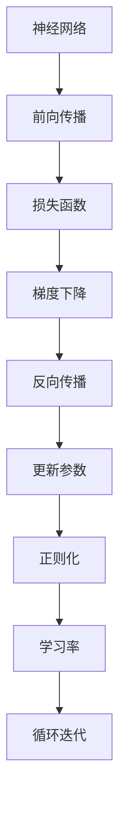

                 

# 第二章：机器学习和反向传播的微妙之处

> 关键词：机器学习,反向传播,梯度下降,损失函数,神经网络,学习率,正则化,反向传播算法

## 1. 背景介绍

机器学习作为人工智能的重要分支，已经在众多领域取得了显著成果。其中，基于神经网络的机器学习模型，由于其强大的表达能力和自适应能力，成为了当下研究的热点。然而，神经网络模型的训练是一个复杂的过程，涉及许多底层原理和技术细节，需要深入理解和掌握。本文将详细探讨机器学习和神经网络模型训练中的关键技术——反向传播。

### 1.1 问题由来

神经网络模型的训练通常需要大量的数据和计算资源，其核心在于通过反向传播算法，不断更新模型参数，使得模型能够最小化损失函数，从而更好地拟合训练数据。然而，在实际应用中，神经网络模型的训练往往面临许多挑战，如梯度消失、梯度爆炸、过拟合等问题。因此，深入理解反向传播算法及其优化方法，对于提升模型的训练效果和泛化能力具有重要意义。

### 1.2 问题核心关键点

反向传播算法的核心在于通过链式法则，将损失函数的梯度逐层传递，更新模型的参数。其主要包括以下几个关键点：

- **损失函数**：定义用于衡量模型预测输出与真实标签之间差异的函数。
- **梯度下降**：用于最小化损失函数的优化算法，通过迭代更新模型参数，使其逼近最优解。
- **反向传播**：通过链式法则计算损失函数对模型参数的梯度，并反向传播更新参数。
- **正则化**：通过L2正则、Dropout等方法，防止模型过拟合。
- **学习率**：用于控制梯度下降步幅的超参数，影响训练速度和效果。
- **神经网络结构**：包括层数、神经元个数、激活函数等，直接影响模型的表达能力和训练效果。

## 2. 核心概念与联系

### 2.1 核心概念概述

为更好地理解反向传播算法，本节将介绍几个关键概念及其之间的联系：

- **神经网络**：由多个层组成的计算模型，每一层包含若干神经元，神经元通过连接权重传递信号，形成前向传播过程。
- **损失函数**：用于衡量模型预测输出与真实标签之间差异的函数，如均方误差、交叉熵等。
- **梯度下降**：一种优化算法，通过迭代更新模型参数，最小化损失函数。
- **反向传播**：通过链式法则计算损失函数对模型参数的梯度，并反向传播更新参数。
- **正则化**：防止模型过拟合的技术，包括L2正则、Dropout等。
- **学习率**：控制梯度下降步幅的超参数，影响训练速度和效果。
- **反向传播算法**：神经网络模型训练的核心算法，通过链式法则计算梯度，并反向传播更新参数。

这些概念之间的逻辑关系可以通过以下Mermaid流程图来展示：



这个流程图展示了神经网络模型训练的基本流程：

1. 神经网络通过前向传播计算输出，并经过损失函数评估预测误差。
2. 梯度下降算法根据损失函数计算梯度，并用于更新模型参数。
3. 反向传播算法通过链式法则计算梯度，并反向传播更新参数。
4. 正则化技术如L2正则、Dropout等，用于防止模型过拟合。
5. 学习率控制梯度下降的步幅，影响训练速度和效果。
6. 整个训练过程通过循环迭代逐步逼近最优解。

## 3. 核心算法原理 & 具体操作步骤

### 3.1 算法原理概述

神经网络模型的训练是通过反向传播算法实现的。其核心思想是：通过前向传播计算模型预测输出，并使用损失函数评估预测误差；然后通过反向传播计算损失函数对模型参数的梯度，并用于更新模型参数。

形式化地，假设神经网络模型由若干层组成，其中第$l$层有$n_l$个神经元，输入为$x \in \mathbb{R}^{n_0}$，输出为$y \in \mathbb{R}^{n_L}$。定义损失函数为$\mathcal{L}(y, \hat{y})$，其中$y$为真实标签，$\hat{y}$为模型预测输出。

反向传播算法的步骤如下：

1. **前向传播**：计算模型输出$\hat{y} = f_{\theta}(x)$，其中$f_{\theta}$为神经网络模型，$\theta$为模型参数。
2. **计算损失**：使用损失函数$\mathcal{L}(\hat{y}, y)$计算预测误差。
3. **反向传播**：通过链式法则计算梯度$\frac{\partial \mathcal{L}}{\partial \theta_j}$，其中$j$为参数编号。
4. **更新参数**：使用梯度下降等优化算法更新参数$\theta_j$，使得$\mathcal{L}$最小化。

### 3.2 算法步骤详解

以下是基于反向传播算法训练神经网络模型的详细步骤：

**Step 1: 准备数据和模型**
- 准备训练数据集$D=\{(x_i, y_i)\}_{i=1}^N$，其中$x_i \in \mathbb{R}^{n_0}$为输入，$y_i \in \mathbb{R}^{n_L}$为真实标签。
- 定义神经网络模型$f_{\theta}$，包括输入层、隐藏层和输出层。
- 初始化模型参数$\theta$，通常使用随机初始化。

**Step 2: 前向传播**
- 将输入数据$x_i$输入模型，通过前向传播计算输出$\hat{y}_i = f_{\theta}(x_i)$。

**Step 3: 计算损失**
- 使用损失函数$\mathcal{L}(\hat{y}_i, y_i)$计算预测误差，通常是均方误差或交叉熵损失。

**Step 4: 反向传播**
- 通过链式法则计算损失函数对模型参数的梯度$\frac{\partial \mathcal{L}}{\partial \theta_j}$。
- 从输出层开始，依次计算每一层的梯度，并将结果传递给上一层。
- 计算每一层神经元的激活函数导数，用于计算梯度。

**Step 5: 更新参数**
- 使用梯度下降算法更新模型参数$\theta_j$，具体公式为$\theta_j \leftarrow \theta_j - \eta \frac{\partial \mathcal{L}}{\partial \theta_j}$，其中$\eta$为学习率。
- 重复执行步骤2-5，直到模型收敛或达到预设的迭代次数。

### 3.3 算法优缺点

反向传播算法具有以下优点：
1. 高效性：通过链式法则，可以高效计算模型参数的梯度，加快训练速度。
2. 鲁棒性：适用于各类神经网络模型，具有较强的泛化能力。
3. 稳定性：可以通过正则化、学习率调参等技术，提升模型的稳定性。

然而，反向传播算法也存在一些缺点：
1. 计算复杂度：对于大型神经网络，反向传播需要计算大量的梯度，计算复杂度较高。
2. 梯度消失/爆炸：对于过深或过宽的神经网络，梯度在反向传播过程中可能逐渐消失或爆炸，导致训练困难。
3. 模型过拟合：需要适当的正则化和早停策略，防止模型过拟合训练数据。

### 3.4 算法应用领域

反向传播算法在机器学习和深度学习领域有广泛应用，主要包括以下几个方面：

- **图像分类**：使用卷积神经网络进行图像分类任务，通过反向传播算法优化模型参数。
- **自然语言处理**：使用循环神经网络或Transformer模型进行文本分类、情感分析等任务，通过反向传播算法进行微调。
- **语音识别**：使用卷积神经网络或循环神经网络进行语音识别任务，通过反向传播算法优化模型参数。
- **推荐系统**：使用协同过滤等模型进行推荐系统任务，通过反向传播算法优化模型参数。
- **强化学习**：使用深度强化学习算法进行智能决策任务，通过反向传播算法优化模型参数。

## 4. 数学模型和公式 & 详细讲解 & 举例说明

### 4.1 数学模型构建

在反向传播算法中，我们需要使用数学模型来描述损失函数和梯度计算过程。以下是一个简单的二分类任务模型：

- 输入层：$x \in \mathbb{R}^n$。
- 隐藏层：$h = \sigma(Wx+b)$，其中$\sigma$为激活函数，$W$和$b$为权重和偏置。
- 输出层：$\hat{y} = \tanh(h)$，其中$\tanh$为激活函数。
- 损失函数：$\mathcal{L}(\hat{y}, y) = -\frac{1}{2}(y-\hat{y})^2$，其中$y \in \{0, 1\}$为真实标签，$\hat{y} \in [-1, 1]$为模型预测输出。

### 4.2 公式推导过程

以下是使用反向传播算法计算梯度的公式推导过程：

1. **输出层梯度计算**：
   $$
   \frac{\partial \mathcal{L}}{\partial \hat{y}} = -(y - \hat{y})
   $$
   $$
   \frac{\partial \mathcal{L}}{\partial \theta} = \frac{\partial \mathcal{L}}{\partial \hat{y}} \frac{\partial \hat{y}}{\partial h} \frac{\partial h}{\partial x} \frac{\partial x}{\partial \theta}
   $$
   其中$\frac{\partial \hat{y}}{\partial h} = \tanh'(h)$，$\frac{\partial h}{\partial x} = W$。

2. **隐藏层梯度计算**：
   $$
   \frac{\partial \mathcal{L}}{\partial h} = \frac{\partial \mathcal{L}}{\partial \hat{y}} \frac{\partial \hat{y}}{\partial h}
   $$
   $$
   \frac{\partial \mathcal{L}}{\partial W} = \frac{\partial \mathcal{L}}{\partial h} h^T
   $$
   $$
   \frac{\partial \mathcal{L}}{\partial b} = \frac{\partial \mathcal{L}}{\partial h}
   $$

### 4.3 案例分析与讲解

考虑一个简单的三层神经网络，其中输入层有2个神经元，隐藏层有4个神经元，输出层有1个神经元。定义激活函数为$\tanh$，损失函数为均方误差。假设训练数据集为$\{(x_i, y_i)\}_{i=1}^2$，其中$x_i \in \mathbb{R}^2$，$y_i \in \{0, 1\}$。

**Step 1: 初始化参数**

- 随机初始化权重$W_0 \in \mathbb{R}^{4 \times 2}$，偏置$b_0 \in \mathbb{R}^4$。
- 随机初始化权重$W_1 \in \mathbb{R}^{1 \times 4}$，偏置$b_1 \in \mathbb{R}$。

**Step 2: 前向传播**

- 对于第一个训练样本$x_1 = [1, 2]$，计算隐藏层输出$h_0 = \tanh(W_0 x_1 + b_0)$。
- 计算输出层输出$\hat{y}_1 = \tanh(h_0)$。

**Step 3: 计算损失**

- 使用均方误差损失函数$\mathcal{L}_1(\hat{y}_1, y_1) = \frac{1}{2}(y_1 - \hat{y}_1)^2$计算预测误差。

**Step 4: 反向传播**

- 计算输出层梯度$\frac{\partial \mathcal{L}_1}{\partial \hat{y}_1} = (y_1 - \hat{y}_1)$。
- 计算输出层权重梯度$\frac{\partial \mathcal{L}_1}{\partial W_1} = \frac{\partial \mathcal{L}_1}{\partial \hat{y}_1} h_0^T$。
- 计算输出层偏置梯度$\frac{\partial \mathcal{L}_1}{\partial b_1} = \frac{\partial \mathcal{L}_1}{\partial \hat{y}_1}$。
- 计算隐藏层输出梯度$\frac{\partial \mathcal{L}_1}{\partial h_0} = \frac{\partial \mathcal{L}_1}{\partial \hat{y}_1} \tanh'(h_0)$。
- 计算隐藏层权重梯度$\frac{\partial \mathcal{L}_1}{\partial W_0} = \frac{\partial \mathcal{L}_1}{\partial h_0} h_0^T$。
- 计算隐藏层偏置梯度$\frac{\partial \mathcal{L}_1}{\partial b_0} = \frac{\partial \mathcal{L}_1}{\partial h_0}$。

**Step 5: 更新参数**

- 使用梯度下降算法更新模型参数，例如$\theta_j \leftarrow \theta_j - \eta \frac{\partial \mathcal{L}_1}{\partial \theta_j}$。

通过反复执行上述步骤，神经网络模型可以不断优化，提升预测精度。需要注意的是，在实际应用中，我们通常需要针对不同的神经网络结构和损失函数进行公式推导和优化。

## 5. 项目实践：代码实例和详细解释说明

### 5.1 开发环境搭建

在进行反向传播算法实践前，我们需要准备好开发环境。以下是使用Python进行PyTorch开发的环境配置流程：

1. 安装Anaconda：从官网下载并安装Anaconda，用于创建独立的Python环境。

2. 创建并激活虚拟环境：
```bash
conda create -n pytorch-env python=3.8 
conda activate pytorch-env
```

3. 安装PyTorch：根据CUDA版本，从官网获取对应的安装命令。例如：
```bash
conda install pytorch torchvision torchaudio cudatoolkit=11.1 -c pytorch -c conda-forge
```

4. 安装Transformers库：
```bash
pip install transformers
```

5. 安装各类工具包：
```bash
pip install numpy pandas scikit-learn matplotlib tqdm jupyter notebook ipython
```

完成上述步骤后，即可在`pytorch-env`环境中开始反向传播算法实践。

### 5.2 源代码详细实现

下面我们以简单的二分类任务为例，给出使用PyTorch实现反向传播算法的代码实现。

首先，定义二分类任务的模型：

```python
import torch
import torch.nn as nn
import torch.optim as optim

class TwoLayerNet(nn.Module):
    def __init__(self, D_in, H, D_out):
        super(TwoLayerNet, self).__init__()
        self.linear1 = nn.Linear(D_in, H)
        self.linear2 = nn.Linear(H, D_out)
        self.relu = nn.ReLU()
        
    def forward(self, x):
        h_relu = self.linear1(x)
        y_pred = self.linear2(h_relu)
        return y_pred
```

然后，定义训练函数：

```python
def train_net(net, train_loader, loss_fn, optimizer, num_epochs):
    net.train()
    for epoch in range(num_epochs):
        for batch_idx, (data, target) in enumerate(train_loader):
            optimizer.zero_grad()
            output = net(data)
            loss = loss_fn(output, target)
            loss.backward()
            optimizer.step()
        print('Epoch: {}, Loss: {:.4f}'.format(epoch, loss.item()))
```

最后，启动训练流程：

```python
D_in, H, D_out = 1, 10, 1
device = torch.device('cuda' if torch.cuda.is_available() else 'cpu')

net = TwoLayerNet(D_in, H, D_out).to(device)
loss_fn = nn.MSELoss()
optimizer = optim.SGD(net.parameters(), lr=1e-4)

train_loader = torch.utils.data.DataLoader(torch.randn(10, D_in).to(device), batch_size=5, shuffle=True)
train_net(net, train_loader, loss_fn, optimizer, num_epochs=10)
```

以上就是使用PyTorch实现反向传播算法的完整代码实现。可以看到，通过定义模型、损失函数和优化器，配合PyTorch的高层API，可以很方便地进行反向传播算法的训练。

### 5.3 代码解读与分析

让我们再详细解读一下关键代码的实现细节：

**TwoLayerNet类**：
- `__init__`方法：初始化模型参数，包括线性层和激活函数。
- `forward`方法：定义前向传播计算过程。

**train_net函数**：
- 定义训练过程中的关键步骤，包括前向传播、计算损失、反向传播和更新参数。
- 使用DataLoader对数据集进行批次化加载，供模型训练和推理使用。

**训练流程**：
- 定义模型的输入和输出维度，创建模型对象。
- 定义损失函数和优化器，并将模型和优化器移动到GPU（如果可用）。
- 定义训练数据集和批处理大小，开始循环迭代。
- 每个epoch内，在训练集上训练，输出平均损失。

可以看到，PyTorch的高层API使得反向传播算法的代码实现变得简洁高效。开发者可以将更多精力放在数据处理、模型改进等高层逻辑上，而不必过多关注底层的实现细节。

当然，工业级的系统实现还需考虑更多因素，如模型的保存和部署、超参数的自动搜索、更灵活的任务适配层等。但核心的反向传播算法基本与此类似。

## 6. 实际应用场景

### 6.1 图像分类

反向传播算法在图像分类任务中得到了广泛应用。通过卷积神经网络(CNN)进行图像分类，训练数据集包含大量带标注的图像和标签。模型通过反向传播算法优化权重和偏置，使得模型能够准确识别图像中的物体。

在实际应用中，可以使用反向传播算法对CNN模型进行微调，提升模型在特定图像分类任务上的性能。例如，在医疗影像分类任务中，微调后的模型可以自动识别肿瘤、炎症等异常区域，帮助医生进行快速诊断。

### 6.2 自然语言处理

反向传播算法在自然语言处理领域也有广泛应用。通过循环神经网络(RNN)或Transformer模型进行文本分类、情感分析等任务，训练数据集包含大量带标注的文本和标签。模型通过反向传播算法优化权重和偏置，使得模型能够准确预测文本的类别或情感倾向。

在实际应用中，可以使用反向传播算法对RNN或Transformer模型进行微调，提升模型在特定文本分类任务上的性能。例如，在情感分析任务中，微调后的模型可以自动识别文本中的情感倾向，帮助社交媒体平台进行舆情分析。

### 6.3 语音识别

反向传播算法在语音识别任务中也有广泛应用。通过卷积神经网络或循环神经网络进行语音识别，训练数据集包含大量带标注的语音和文本。模型通过反向传播算法优化权重和偏置，使得模型能够准确识别语音中的单词或句子。

在实际应用中，可以使用反向传播算法对CNN或RNN模型进行微调，提升模型在特定语音识别任务上的性能。例如，在智能音箱应用中，微调后的模型可以准确识别用户的语音指令，并执行相应的操作。

### 6.4 强化学习

反向传播算法在强化学习中也有重要应用。通过深度强化学习算法进行智能决策任务，训练数据集包含大量带标注的决策和奖励。模型通过反向传播算法优化权重和偏置，使得模型能够最大化长期奖励。

在实际应用中，可以使用反向传播算法对深度强化学习算法进行微调，提升模型在特定决策任务上的性能。例如，在自动驾驶应用中，微调后的模型可以自动识别道路交通情况，并做出最优决策。

## 7. 工具和资源推荐

### 7.1 学习资源推荐

为了帮助开发者系统掌握反向传播算法的理论基础和实践技巧，这里推荐一些优质的学习资源：

1. 《深度学习》（周志华著）：系统讲解深度学习的基本概念和算法，涵盖反向传播算法的原理和应用。

2. CS231n《卷积神经网络》课程：斯坦福大学开设的深度学习明星课程，有Lecture视频和配套作业，涵盖卷积神经网络及其反向传播算法。

3. 《神经网络与深度学习》（Michael Nielsen著）：通俗易懂地介绍神经网络和深度学习的基本原理，包含反向传播算法的详细推导和示例。

4. Google AI Blog《反向传播的直观理解》：谷歌AI团队的博客文章，通俗易懂地介绍反向传播算法的原理和应用。

5. PyTorch官方文档：PyTorch的官方文档，提供详细的API和使用示例，帮助开发者快速上手。

通过对这些资源的学习实践，相信你一定能够系统掌握反向传播算法的精髓，并用于解决实际的机器学习和深度学习问题。

### 7.2 开发工具推荐

高效的开发离不开优秀的工具支持。以下是几款用于反向传播算法开发的常用工具：

1. PyTorch：基于Python的开源深度学习框架，灵活动态的计算图，适合快速迭代研究。

2. TensorFlow：由Google主导开发的开源深度学习框架，生产部署方便，适合大规模工程应用。

3. Keras：基于TensorFlow的高级API，简单易用，适合快速搭建和调试模型。

4. JAX：Google开发的Python深度学习库，支持动态计算图，适合高性能计算。

5. Numba：用于加速Python计算的JIT编译器，支持快速计算和内存管理。

合理利用这些工具，可以显著提升反向传播算法的开发效率，加快创新迭代的步伐。

### 7.3 相关论文推荐

反向传播算法在机器学习和深度学习领域有众多研究论文，以下是几篇奠基性的相关论文，推荐阅读：

1. Backpropagation: Application of the chain rule to stochastic computations：反向传播算法原论文，介绍反向传播的基本原理和算法。

2. Delving deep into rectifiers：论文介绍ReLU激活函数的反向传播算法。

3. Deep Residual Learning for Image Recognition：论文介绍残差网络的反向传播算法。

4. Dropout: A simple way to prevent neural networks from overfitting：论文介绍Dropout正则化的反向传播算法。

5. Fast RNNs with vanishing connections：论文介绍LSTM的反向传播算法。

这些论文代表了大规模深度学习技术的发展脉络。通过学习这些前沿成果，可以帮助研究者把握学科前进方向，激发更多的创新灵感。

## 8. 总结：未来发展趋势与挑战

### 8.1 总结

本文对反向传播算法的核心原理和操作步骤进行了详细讲解。首先阐述了反向传播算法在机器学习和深度学习中的重要地位，并介绍了反向传播的基本流程和步骤。其次，通过数学模型和公式推导，详细讲解了反向传播算法在实际应用中的计算过程，并通过代码实例进行了演示。

通过本文的系统梳理，可以看到，反向传播算法在神经网络模型训练中扮演着核心角色，其高效性、鲁棒性和稳定性使其成为深度学习应用的重要基础。未来，随着预训练模型和大模型技术的发展，反向传播算法在模型优化和微调中的应用也将更加广泛。

### 8.2 未来发展趋势

展望未来，反向传播算法将呈现以下几个发展趋势：

1. **计算图优化**：反向传播算法将与编译器结合，生成高效的计算图，提升训练和推理速度。

2. **分布式训练**：反向传播算法将与分布式训练技术结合，支持大规模模型的高效训练。

3. **动态计算图**：反向传播算法将与动态计算图技术结合，支持实时训练和推理。

4. **混合精度计算**：反向传播算法将与混合精度计算技术结合，提升训练效率和计算精度。

5. **自动化微调**：反向传播算法将与自动化微调技术结合，减少人工调参工作量，提高模型训练效率。

6. **多任务学习**：反向传播算法将与多任务学习技术结合，提升模型的跨领域泛化能力。

这些趋势将使反向传播算法更加高效、灵活和可扩展，推动深度学习技术的进一步发展。

### 8.3 面临的挑战

尽管反向传播算法已经取得了显著成就，但在实际应用中仍面临诸多挑战：

1. **计算资源瓶颈**：大型神经网络模型需要大量计算资源，反向传播算法的计算复杂度较高，难以满足大规模模型的训练需求。

2. **模型过拟合**：反向传播算法容易产生过拟合，特别是在训练数据不足的情况下。

3. **模型泛化能力不足**：反向传播算法在训练数据分布变化较大的情况下，模型的泛化能力可能不足。

4. **模型鲁棒性不足**：反向传播算法在面对异常输入和噪声数据时，模型的鲁棒性可能不足。

5. **模型可解释性不足**：反向传播算法通常是"黑盒"模型，难以解释其内部工作机制和决策逻辑。

6. **模型安全性不足**：反向传播算法可能学习到有害信息，存在安全风险。

7. **模型效率不足**：反向传播算法在实际应用中，可能存在计算效率低、推理速度慢等问题。

这些挑战将限制反向传播算法的应用范围和效果，需要通过更高效、可解释、安全的算法和工具来解决。

### 8.4 研究展望

未来，反向传播算法需要结合更多前沿技术，应对挑战并提升其应用价值。以下是一些可能的研究方向：

1. **自监督学习**：结合自监督学习技术，利用无标注数据进行预训练，提升模型的泛化能力和鲁棒性。

2. **迁移学习**：结合迁移学习技术，利用预训练模型进行微调，提升模型的跨领域泛化能力。

3. **对抗训练**：结合对抗训练技术，提升模型的鲁棒性和安全性。

4. **模型压缩**：结合模型压缩技术，减少模型参数和计算资源，提升模型效率。

5. **知识蒸馏**：结合知识蒸馏技术，通过小模型学习大模型的知识，提升模型的性能和可解释性。

6. **自动化调参**：结合自动化调参技术，减少人工调参工作量，提高模型训练效率。

7. **联邦学习**：结合联邦学习技术，保护用户隐私，提升模型的泛化能力和鲁棒性。

这些研究方向将推动反向传播算法在实际应用中发挥更大作用，推动深度学习技术的发展。

## 9. 附录：常见问题与解答

**Q1：什么是反向传播算法？**

A: 反向传播算法是一种优化算法，用于最小化损失函数，通过链式法则计算梯度，并用于更新神经网络模型参数。

**Q2：反向传播算法的基本流程是什么？**

A: 反向传播算法的基本流程包括前向传播计算输出，计算损失函数，反向传播计算梯度，并更新模型参数。具体步骤为：
1. 前向传播：计算模型输出。
2. 计算损失：使用损失函数评估预测误差。
3. 反向传播：计算梯度，并用于更新模型参数。

**Q3：如何防止反向传播中的梯度消失或梯度爆炸？**

A: 防止梯度消失或梯度爆炸的方法包括：
1. 使用激活函数，如ReLU、LeakyReLU等。
2. 使用梯度裁剪，限制梯度范围。
3. 使用批量归一化技术，稳定梯度。

**Q4：反向传播算法有哪些优化方法？**

A: 反向传播算法的优化方法包括：
1. 使用动量优化器，加速收敛。
2. 使用自适应学习率优化器，如Adam、Adagrad等。
3. 使用批量归一化技术，加速训练。
4. 使用数据增强技术，提升模型泛化能力。

**Q5：如何评估反向传播算法的训练效果？**

A: 评估反向传播算法的训练效果通常使用验证集或测试集进行评估，计算模型在验证集或测试集上的损失函数和准确率。同时，可以使用学习曲线、混淆矩阵等工具分析模型的训练过程和性能。

通过本文的系统梳理，可以看到，反向传播算法在神经网络模型训练中扮演着核心角色，其高效性、鲁棒性和稳定性使其成为深度学习应用的重要基础。未来，随着预训练模型和大模型技术的发展，反向传播算法在模型优化和微调中的应用也将更加广泛。

---

作者：禅与计算机程序设计艺术 / Zen and the Art of Computer Programming

