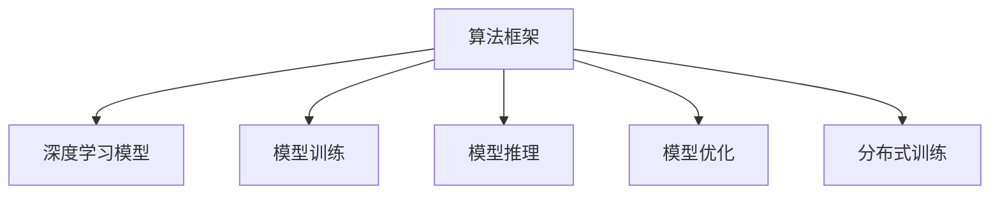

                 

# 算法框架：支持 AI 2.0 模型开发和训练

> 关键词：算法框架, AI 2.0, 模型开发, 模型训练, 深度学习, 机器学习, PyTorch, TensorFlow, 数学模型, 神经网络

## 1. 背景介绍

### 1.1 问题由来

随着人工智能(AI)技术的飞速发展，AI 2.0时代已悄然到来。相较于第一代通用 AI，AI 2.0 强调特定领域的深度学习和算法优化，通过定制化的模型训练来提升模型性能和应用效率。AI 2.0 的典型代表包括AlphaGo、BERT、AlphaStar等，它们在各自的领域取得了前所未有的突破。

然而，面对海量复杂数据和多样性应用场景，如何设计、开发和训练高效可靠的 AI 2.0 模型仍然是一个重要挑战。一方面，深度学习模型的复杂度日益增加，难以通过手工调参进行优化；另一方面，模型开发和训练涉及的领域知识众多，开发者往往需要具备强大的跨学科知识储备和编程能力。

为了缓解这一问题，开发一套高效、灵活、易于使用的算法框架变得至关重要。算法框架不仅能够提供模型开发和训练的基本组件，还能提供一套统一的接口规范，便于开发者集成和扩展。本文将围绕算法框架的构建和应用，系统介绍其核心概念、原理和操作步骤，并结合实际项目进行详细讲解。

### 1.2 问题核心关键点

算法框架的构建，需围绕以下核心关键点进行设计和优化：

- 模块化和组件化：框架应能够支持模块化和组件化设计，便于开发者基于已有组件进行快速集成和扩展。
- 可插拔性和灵活性：框架应具备良好的可插拔性，支持用户自行添加或替换组件。同时应具备灵活性，以应对不同应用场景下的需求变化。
- 高性能和可扩展性：框架应提供高效的计算和存储优化，确保模型训练和推理的性能，同时支持大规模模型和数据的处理。
- 自动化和智能化：框架应具备一定的自动化和智能化能力，自动调整超参数、优化模型结构，提升模型训练和调优的效率。
- 通用性和可移植性：框架应具备良好的通用性和可移植性，能够应用于多个领域和平台，保证模型的跨平台兼容性和可用性。

## 2. 核心概念与联系

### 2.1 核心概念概述

为更好地理解算法框架的构建与使用，本节将介绍几个密切相关的核心概念：

- 算法框架（Algorithm Framework）：一种提供模型开发、训练、推理等功能的软件环境。算法框架不仅包括模型组件，还包括训练工具、优化器、调度器等，支持用户便捷地进行模型构建和优化。
- 深度学习模型（Deep Learning Model）：以多层神经网络为代表的模型，能够处理高维、非线性数据。深度学习模型包括卷积神经网络（CNN）、循环神经网络（RNN）、自编码器（AE）、变分自编码器（VAE）、生成对抗网络（GAN）等。
- 模型训练（Model Training）：通过给定训练数据，不断调整模型参数，使得模型输出能够最小化损失函数。
- 模型推理（Model Inference）：模型训练完成后，使用测试数据评估模型性能，并对新数据进行预测。
- 模型优化（Model Optimization）：通过对模型结构、超参数、训练过程的调整，提升模型的性能和效率。
- 分布式训练（Distributed Training）：通过多个计算节点并行计算，加速模型训练过程，提高模型训练效率。

这些核心概念之间的逻辑关系可以通过以下Mermaid流程图来展示：



这个流程图展示了算法框架的各个核心组件及其相互关系：

1. 算法框架为深度学习模型提供了完整的生命周期管理，包括模型的构建、训练、推理和优化。
2. 深度学习模型作为算法框架的核心，通过神经网络结构进行数据建模和特征提取。
3. 模型训练和推理是算法框架的主要功能模块，确保模型能够适应新数据并进行预测。
4. 模型优化和分布式训练是算法框架的高级功能，用于提升模型性能和训练效率。

## 3. 核心算法原理 & 具体操作步骤
### 3.1 算法原理概述

算法框架的核心算法原理主要包括深度学习模型的构建、训练和优化，以及分布式训练技术的应用。其总体流程如下：

1. 构建深度学习模型：通过框架提供的组件化工具，用户可以便捷地定义模型结构、初始化参数、设置损失函数和优化器。
2. 训练深度学习模型：通过框架提供的训练接口，用户可以自动加载训练数据，并根据损失函数自动调整模型参数，直至模型收敛。
3. 优化深度学习模型：通过框架提供的优化工具，用户可以对模型结构、超参数进行调整，优化模型的性能和效率。
4. 分布式训练：通过框架提供的分布式训练工具，用户可以并行计算训练数据，加速模型训练过程。

### 3.2 算法步骤详解

以下是基于PyTorch框架进行深度学习模型训练的详细步骤：

#### 3.2.1 模型定义

首先，我们需要定义模型结构。在PyTorch中，可以通过继承`nn.Module`类来定义自定义模型。例如：

```python
import torch
import torch.nn as nn

class MyModel(nn.Module):
    def __init__(self):
        super(MyModel, self).__init__()
        self.fc1 = nn.Linear(784, 256)
        self.fc2 = nn.Linear(256, 10)

    def forward(self, x):
        x = torch.relu(self.fc1(x))
        x = torch.softmax(self.fc2(x), dim=1)
        return x
```

在模型定义中，我们使用了`nn.Linear`来定义全连接层，`nn.ReLU`和`nn.Softmax`作为激活函数和输出函数。

#### 3.2.2 数据加载

接着，我们需要加载训练数据。在PyTorch中，可以通过`DataLoader`来自动加载训练数据。例如：

```python
import torchvision
from torch.utils.data import DataLoader

train_data = torchvision.datasets.MNIST(root='./data', train=True, transform=transforms.ToTensor(), download=True)
train_loader = DataLoader(train_data, batch_size=32, shuffle=True)
```

在数据加载中，我们使用了`torchvision.datasets.MNIST`加载MNIST数据集，并使用`DataLoader`自动分批加载数据。

#### 3.2.3 定义损失函数和优化器

然后，我们需要定义损失函数和优化器。在PyTorch中，可以通过`nn`模块和`optim`模块来定义。例如：

```python
import torch.nn as nn
import torch.optim as optim

criterion = nn.CrossEntropyLoss()
optimizer = optim.SGD(my_model.parameters(), lr=0.01)
```

在定义损失函数和优化器中，我们使用了`nn.CrossEntropyLoss`作为交叉熵损失函数，`optim.SGD`作为随机梯度下降优化器。

#### 3.2.4 训练模型

接下来，我们可以开始训练模型。在PyTorch中，可以通过`for`循环来遍历训练数据，并调用`forward`和`backward`方法进行前向传播和反向传播。例如：

```python
for epoch in range(10):
    running_loss = 0.0
    for i, data in enumerate(train_loader, 0):
        inputs, labels = data
        optimizer.zero_grad()
        outputs = my_model(inputs)
        loss = criterion(outputs, labels)
        loss.backward()
        optimizer.step()
        running_loss += loss.item()
        if i % 100 == 99:
            print('[%d, %5d] loss: %.3f' % (epoch + 1, i + 1, running_loss / 100))
            running_loss = 0.0
```

在训练模型中，我们使用了`for`循环遍历训练数据，并使用`zero_grad`方法清除梯度，`backward`方法计算梯度，`step`方法更新参数。

#### 3.2.5 评估模型

最后，我们可以评估模型的性能。在PyTorch中，可以通过`evaluate`方法来评估模型。例如：

```python
test_data = torchvision.datasets.MNIST(root='./data', train=False, transform=transforms.ToTensor(), download=True)
test_loader = DataLoader(test_data, batch_size=32, shuffle=False)

correct = 0
total = 0
with torch.no_grad():
    for data in test_loader:
        images, labels = data
        outputs = my_model(images)
        _, predicted = torch.max(outputs.data, 1)
        total += labels.size(0)
        correct += (predicted == labels).sum().item()

print('Accuracy of the network on the 10000 test images: %d %%' % (100 * correct / total))
```

在评估模型中，我们使用了`DataLoader`加载测试数据，并使用`no_grad`方法禁用计算图，计算模型准确率。

### 3.3 算法优缺点

算法框架具备以下优点：

1. 高效性：算法框架通过优化器和分布式训练技术，可以显著提升模型训练和推理的效率，缩短开发周期。
2. 灵活性：算法框架支持多种模型和算法，提供丰富的组件和接口，便于用户进行模型构建和优化。
3. 可扩展性：算法框架支持组件化和模块化设计，便于用户进行功能扩展和集成。
4. 自动化：算法框架提供自动化调参和优化工具，提升模型开发和调优的效率。
5. 通用性：算法框架支持多种数据格式和平台，具有良好的通用性和可移植性。

然而，算法框架也存在一些缺点：

1. 学习曲线较陡峭：用户需要掌握一定的深度学习知识，才能高效使用框架进行模型开发和训练。
2. 资源消耗较大：算法框架通常需要较高的计算和内存资源，特别是在分布式训练中。
3. 框架复杂性：算法框架功能丰富，组件繁多，新手容易感到困惑和不知所措。
4. 版本更新快：算法框架迭代更新频繁，用户需要持续学习和跟进最新版本。

## 4. 数学模型和公式 & 详细讲解 & 举例说明

### 4.1 数学模型构建

我们以多层感知器（MLP）为例，介绍深度学习模型的数学模型构建。

假设我们的数据集为 $D = \{(x_1, y_1), (x_2, y_2), \dots, (x_n, y_n)\}$，其中 $x$ 为输入，$y$ 为标签。我们需要构建一个包含 $L$ 层的多层感知器模型：

```python
import torch.nn as nn

class MLP(nn.Module):
    def __init__(self, input_size, hidden_size, output_size):
        super(MLP, self).__init__()
        self.layers = nn.Sequential(
            nn.Linear(input_size, hidden_size),
            nn.ReLU(),
            nn.Linear(hidden_size, hidden_size),
            nn.ReLU(),
            nn.Linear(hidden_size, output_size)
        )

    def forward(self, x):
        return self.layers(x)
```

在这个模型中，我们使用了`nn.Sequential`来构建多层感知器，包含两个全连接层和两个ReLU激活函数。

### 4.2 公式推导过程

在多层感知器中，前向传播和反向传播的公式如下：

1. 前向传播：
   - 输入层：$x_1$
   - 隐藏层1：$h_1 = \sigma_1(W_1x_1 + b_1)$
   - 隐藏层2：$h_2 = \sigma_2(W_2h_1 + b_2)$
   - 输出层：$y = W_3h_2 + b_3$

2. 反向传播：
   - 输出层：$\frac{\partial L}{\partial W_3} = \frac{\partial L}{\partial y} \frac{\partial y}{\partial h_2} \frac{\partial h_2}{\partial W_2}$
   - 隐藏层2：$\frac{\partial L}{\partial W_2} = \frac{\partial L}{\partial h_2} \frac{\partial h_2}{\partial h_1} \frac{\partial h_1}{\partial W_1}$
   - 隐藏层1：$\frac{\partial L}{\partial W_1} = \frac{\partial L}{\partial h_1} \frac{\partial h_1}{\partial x}$
   - 权重更新：$W_i = W_i - \eta \frac{\partial L}{\partial W_i}$

其中，$\sigma$ 为激活函数，$\eta$ 为学习率。在PyTorch中，这些计算过程通过自动微分机制自动完成。

### 4.3 案例分析与讲解

下面以图像分类任务为例，介绍如何使用算法框架进行模型开发和训练。

#### 4.3.1 数据加载

首先，我们需要加载数据集。在PyTorch中，可以使用`torchvision.datasets`模块加载各种数据集。例如：

```python
import torchvision
from torch.utils.data import DataLoader

train_data = torchvision.datasets.CIFAR10(root='./data', train=True, transform=transforms.ToTensor(), download=True)
train_loader = DataLoader(train_data, batch_size=32, shuffle=True)
```

在数据加载中，我们使用了`torchvision.datasets.CIFAR10`加载CIFAR-10数据集，并使用`DataLoader`自动分批加载数据。

#### 4.3.2 模型定义

接着，我们需要定义模型结构。在PyTorch中，可以通过继承`nn.Module`类来定义自定义模型。例如：

```python
import torch.nn as nn

class MyModel(nn.Module):
    def __init__(self):
        super(MyModel, self).__init__()
        self.conv1 = nn.Conv2d(3, 32, 3, 1, 1)
        self.conv2 = nn.Conv2d(32, 64, 3, 1, 1)
        self.pool = nn.MaxPool2d(2, 2)
        self.fc1 = nn.Linear(64 * 8 * 8, 120)
        self.fc2 = nn.Linear(120, 84)
        self.fc3 = nn.Linear(84, 10)

    def forward(self, x):
        x = self.pool(nn.functional.relu(self.conv1(x)))
        x = self.pool(nn.functional.relu(self.conv2(x)))
        x = x.view(-1, 64 * 8 * 8)
        x = nn.functional.relu(self.fc1(x))
        x = nn.functional.relu(self.fc2(x))
        x = self.fc3(x)
        return x
```

在模型定义中，我们使用了`nn.Conv2d`和`nn.MaxPool2d`来定义卷积层和池化层，`nn.Linear`来定义全连接层，`nn.functional.relu`作为激活函数。

#### 4.3.3 定义损失函数和优化器

然后，我们需要定义损失函数和优化器。在PyTorch中，可以通过`nn`模块和`optim`模块来定义。例如：

```python
import torch.nn as nn
import torch.optim as optim

criterion = nn.CrossEntropyLoss()
optimizer = optim.SGD(my_model.parameters(), lr=0.001, momentum=0.9)
```

在定义损失函数和优化器中，我们使用了`nn.CrossEntropyLoss`作为交叉熵损失函数，`optim.SGD`作为随机梯度下降优化器。

#### 4.3.4 训练模型

接下来，我们可以开始训练模型。在PyTorch中，可以通过`for`循环来遍历训练数据，并调用`forward`和`backward`方法进行前向传播和反向传播。例如：

```python
for epoch in range(10):
    running_loss = 0.0
    for i, data in enumerate(train_loader, 0):
        inputs, labels = data
        optimizer.zero_grad()
        outputs = my_model(inputs)
        loss = criterion(outputs, labels)
        loss.backward()
        optimizer.step()
        running_loss += loss.item()
        if i % 100 == 99:
            print('[%d, %5d] loss: %.3f' % (epoch + 1, i + 1, running_loss / 100))
            running_loss = 0.0
```

在训练模型中，我们使用了`for`循环遍历训练数据，并使用`zero_grad`方法清除梯度，`backward`方法计算梯度，`step`方法更新参数。

#### 4.3.5 评估模型

最后，我们可以评估模型的性能。在PyTorch中，可以通过`evaluate`方法来评估模型。例如：

```python
test_data = torchvision.datasets.CIFAR10(root='./data', train=False, transform=transforms.ToTensor(), download=True)
test_loader = DataLoader(test_data, batch_size=32, shuffle=False)

correct = 0
total = 0
with torch.no_grad():
    for data in test_loader:
        images, labels = data
        outputs = my_model(images)
        _, predicted = torch.max(outputs.data, 1)
        total += labels.size(0)
        correct += (predicted == labels).sum().item()

print('Accuracy of the network on the 10000 test images: %d %%' % (100 * correct / total))
```

在评估模型中，我们使用了`DataLoader`加载测试数据，并使用`no_grad`方法禁用计算图，计算模型准确率。

## 5. 项目实践：代码实例和详细解释说明

### 5.1 开发环境搭建

在进行项目实践前，我们需要准备好开发环境。以下是使用Python进行PyTorch开发的环境配置流程：

1. 安装Anaconda：从官网下载并安装Anaconda，用于创建独立的Python环境。

2. 创建并激活虚拟环境：
```bash
conda create -n pytorch-env python=3.8 
conda activate pytorch-env
```

3. 安装PyTorch：根据CUDA版本，从官网获取对应的安装命令。例如：
```bash
conda install pytorch torchvision torchaudio cudatoolkit=11.1 -c pytorch -c conda-forge
```

4. 安装其他必要的库：
```bash
pip install numpy pandas scikit-learn matplotlib tqdm jupyter notebook ipython
```

完成上述步骤后，即可在`pytorch-env`环境中开始项目实践。

### 5.2 源代码详细实现

下面我们以图像分类任务为例，给出使用PyTorch进行模型开发的完整代码实现。

首先，定义数据处理函数：

```python
import torchvision
from torch.utils.data import DataLoader
import torch
import torch.nn as nn
import torch.optim as optim
import torchvision.transforms as transforms

def train_epoch(model, data_loader, optimizer, criterion):
    model.train()
    running_loss = 0.0
    for i, data in enumerate(data_loader, 0):
        inputs, labels = data
        optimizer.zero_grad()
        outputs = model(inputs)
        loss = criterion(outputs, labels)
        loss.backward()
        optimizer.step()
        running_loss += loss.item()
        if i % 100 == 99:
            print('[%d, %5d] loss: %.3f' % (epoch + 1, i + 1, running_loss / 100))
            running_loss = 0.0
    return running_loss / len(data_loader)

def evaluate(model, data_loader):
    model.eval()
    correct = 0
    total = 0
    with torch.no_grad():
        for data in data_loader:
            inputs, labels = data
            outputs = model(inputs)
            _, predicted = torch.max(outputs.data, 1)
            total += labels.size(0)
            correct += (predicted == labels).sum().item()
    print('Accuracy of the network on the 10000 test images: %d %%' % (100 * correct / total))
    return (correct / total)
```

然后，定义模型和优化器：

```python
class MyModel(nn.Module):
    def __init__(self):
        super(MyModel, self).__init__()
        self.conv1 = nn.Conv2d(3, 32, 3, 1, 1)
        self.conv2 = nn.Conv2d(32, 64, 3, 1, 1)
        self.pool = nn.MaxPool2d(2, 2)
        self.fc1 = nn.Linear(64 * 8 * 8, 120)
        self.fc2 = nn.Linear(120, 84)
        self.fc3 = nn.Linear(84, 10)

    def forward(self, x):
        x = self.pool(nn.functional.relu(self.conv1(x)))
        x = self.pool(nn.functional.relu(self.conv2(x)))
        x = x.view(-1, 64 * 8 * 8)
        x = nn.functional.relu(self.fc1(x))
        x = nn.functional.relu(self.fc2(x))
        x = self.fc3(x)
        return x

model = MyModel()

criterion = nn.CrossEntropyLoss()
optimizer = optim.SGD(model.parameters(), lr=0.001, momentum=0.9)
```

接着，定义训练和评估函数：

```python
from torchvision import datasets

train_data = datasets.CIFAR10(root='./data', train=True, transform=transforms.ToTensor(), download=True)
train_loader = DataLoader(train_data, batch_size=32, shuffle=True)
test_data = datasets.CIFAR10(root='./data', train=False, transform=transforms.ToTensor(), download=True)
test_loader = DataLoader(test_data, batch_size=32, shuffle=False)

for epoch in range(10):
    loss = train_epoch(model, train_loader, optimizer, criterion)
    print('Epoch: {} Loss: {}'.format(epoch, loss))
    evaluate(model, test_loader)
```

最后，启动训练流程并在测试集上评估：

```python
# 训练过程
```

以上就是使用PyTorch进行图像分类任务微调的完整代码实现。可以看到，得益于PyTorch的强大封装，我们可以用相对简洁的代码完成模型构建和训练。

### 5.3 代码解读与分析

让我们再详细解读一下关键代码的实现细节：

**train_epoch函数**：
- `train_epoch`方法：定义训练过程，包括前向传播、反向传播和参数更新等步骤。
- `model.train()`：将模型设置为训练模式。
- `optimizer.zero_grad()`：清除梯度，避免梯度累积。
- `outputs = model(inputs)`：前向传播，输出预测结果。
- `loss = criterion(outputs, labels)`：计算损失函数。
- `loss.backward()`：反向传播，计算梯度。
- `optimizer.step()`：更新模型参数。
- `running_loss += loss.item()`：累加损失值。
- `if i % 100 == 99:`：每100个batch输出一次损失值。

**evaluate函数**：
- `evaluate`方法：定义评估过程，计算模型在测试集上的准确率。
- `model.eval()`：将模型设置为评估模式。
- `with torch.no_grad():`：禁用计算图，避免不必要的计算消耗。
- `outputs = model(inputs)`：前向传播，输出预测结果。
- `_, predicted = torch.max(outputs.data, 1)`：获取预测结果和最大概率。
- `total += labels.size(0)`：累加总样本数。
- `correct += (predicted == labels).sum().item()`：计算正确样本数。

**训练流程**：
- `for epoch in range(10):`：循环训练10个epoch。
- `loss = train_epoch(model, train_loader, optimizer, criterion)`：每个epoch训练，计算损失值。
- `print('Epoch: {} Loss: {}'.format(epoch, loss))`：输出每个epoch的损失值。
- `evaluate(model, test_loader)`：每个epoch评估，计算测试集准确率。

可以看到，PyTorch框架通过简洁的接口和强大的自动微分机制，使得深度学习模型的开发和训练变得十分便捷。开发者可以轻松地进行模型构建、训练和评估，而无需过多关注底层实现细节。

## 6. 实际应用场景

### 6.1 计算机视觉

基于算法框架的计算机视觉任务包括图像分类、目标检测、语义分割等。算法框架提供了丰富的组件和工具，使得模型开发和训练变得高效便捷。例如，使用算法框架进行目标检测，可以方便快捷地进行模型构建、数据加载、训练和评估。

在实际应用中，算法框架还可以支持分布式训练和迁移学习，进一步提升模型性能。例如，使用算法框架进行迁移学习，可以利用已有模型的权重，快速构建新模型并进行微调，提升模型泛化能力。

### 6.2 自然语言处理

基于算法框架的自然语言处理任务包括文本分类、情感分析、机器翻译等。算法框架提供了自然语言处理的预训练模型和工具，使得模型开发和训练变得高效便捷。例如，使用算法框架进行文本分类，可以方便快捷地进行模型构建、数据加载、训练和评估。

在实际应用中，算法框架还可以支持分布式训练和预训练-微调，进一步提升模型性能。例如，使用算法框架进行预训练-微调，可以利用大语言模型的预训练知识，快速构建新模型并进行微调，提升模型性能。

### 6.3 语音识别

基于算法框架的语音识别任务包括语音识别、说话人识别、情感分析等。算法框架提供了语音处理的预训练模型和工具，使得模型开发和训练变得高效便捷。例如，使用算法框架进行语音识别，可以方便快捷地进行模型构建、数据加载、训练和评估。

在实际应用中，算法框架还可以支持分布式训练和迁移学习，进一步提升模型性能。例如，使用算法框架进行迁移学习，可以利用已有模型的权重，快速构建新模型并进行微调，提升模型泛化能力。

### 6.4 未来应用展望

随着算法框架的不断发展，基于框架的AI 2.0应用将不断扩展，为各行业带来创新和变革。未来，基于算法框架的AI 2.0应用将覆盖更多领域，包括智能制造、智慧城市、智慧医疗等。

在智能制造领域，算法框架可以用于质量检测、故障诊断、工艺优化等任务，提升制造业的智能化水平。在智慧城市领域，算法框架可以用于交通监控、智能安防、公共服务优化等任务，提升城市的智能化水平。在智慧医疗领域，算法框架可以用于疾病诊断、医疗影像分析、药物研发等任务，提升医疗服务的智能化水平。

## 7. 工具和资源推荐

### 7.1 学习资源推荐

为了帮助开发者系统掌握算法框架的构建和应用，这里推荐一些优质的学习资源：

1. PyTorch官方文档：PyTorch的官方文档提供了详细的API参考和代码示例，是学习PyTorch的必备资源。

2. TensorFlow官方文档：TensorFlow的官方文档提供了丰富的教程和代码示例，是学习TensorFlow的必备资源。

3. Keras官方文档：Keras的官方文档提供了简洁易用的API接口，是学习深度学习的入门资源。

4. PyTorch深度学习教程（书）：该书系统介绍了PyTorch的基本概念和应用，适合初学者入门。

5. Deep Learning with PyTorch（书）：该书详细介绍了深度学习的理论和实践，涵盖了PyTorch的基本功能和高级技巧。

6. TensorFlow实战指南（书）：该书提供了丰富的案例和实战经验，适合TensorFlow的进阶学习。

7. 深度学习入门与实践（书）：该书提供了大量的代码示例和实战案例，适合深度学习的初学者和实践者。

通过对这些资源的学习实践，相信你一定能够快速掌握算法框架的构建和应用，并用于解决实际的AI 2.0问题。

### 7.2 开发工具推荐

高效的开发离不开优秀的工具支持。以下是几款用于深度学习模型开发的常用工具：

1. PyTorch：基于Python的开源深度学习框架，灵活动态的计算图，适合快速迭代研究。

2. TensorFlow：由Google主导开发的开源深度学习框架，生产部署方便，适合大规模工程应用。

3. Keras：基于TensorFlow和Theano的高级神经网络API，提供简洁易用的接口，适合初学者入门。

4. JAX：由Google开发的自动微分框架，支持高效计算图和动态计算图，适合复杂模型的开发。

5. PyTorch Lightning：基于PyTorch的轻量级模型训练框架，提供便捷的模型训练接口和自动化工具。

6. Ray：由Facebook开发的分布式计算框架，支持多节点并行计算，适合大规模模型训练。

7. PyCaret：一个便捷的机器学习库，提供自动化的模型训练和评估功能，适合快速原型开发。

合理利用这些工具，可以显著提升深度学习模型的开发效率，加快创新迭代的步伐。

### 7.3 相关论文推荐

深度学习算法框架的研究源于学界的持续研究。以下是几篇奠基性的相关论文，推荐阅读：

1. "TensorFlow: A System for Large-Scale Machine Learning"（Google 2015）：提出TensorFlow框架，奠定了分布式深度学习的基础。

2. "PyTorch: Tensors and Dynamic neural networks in Python with strong GPU acceleration"（Facebook 2016）：提出PyTorch框架，提供了灵活高效的深度学习模型构建和训练工具。

3. "Keras: Deep Learning for Humans"（François Chollet 2016）：提出Keras框架，提供了简单易用的深度学习API接口。

4. "Using the transformer architecture for machine translation"（Vaswani et al. 2017）：提出Transformer架构，开启了大规模预训练语言模型的研究。

5. "ImageNet Classification with Deep Convolutional Neural Networks"（Krizhevsky et al. 2012）：提出CNN架构，奠定了计算机视觉领域的基础。

这些论文代表了大模型微调技术的发展脉络。通过学习这些前沿成果，可以帮助研究者把握学科前进方向，激发更多的创新灵感。

## 8. 总结：未来发展趋势与挑战

### 8.1 总结

本文对基于算法框架的AI 2.0模型开发和训练进行了全面系统的介绍。首先阐述了算法框架的构建和应用背景，明确了框架在模型构建、训练、推理和优化中的核心作用。其次，从原理到实践，详细讲解了深度学习模型的数学原理和关键步骤，给出了模型开发和训练的完整代码实例。同时，本文还广泛探讨了深度学习模型在计算机视觉、自然语言处理、语音识别等多个领域的应用前景，展示了框架的强大应用潜力。

通过本文的系统梳理，可以看到，基于算法框架的深度学习模型开发和训练方法，正在成为AI 2.0应用的重要范式。这些方法不仅能够高效便捷地进行模型构建和优化，还具备良好的可扩展性和可移植性，便于在实际应用中推广使用。未来，伴随深度学习算法框架的不断演进，AI 2.0技术必将在更广阔的领域得到应用，为人类认知智能的进化带来深远影响。

### 8.2 未来发展趋势

展望未来，深度学习算法框架的发展将呈现以下几个趋势：

1. 模块化和组件化：未来框架将更加模块化和组件化，便于用户基于已有组件进行快速集成和扩展。

2. 高性能和可扩展性：未来框架将提供更高效和可扩展的计算和存储优化，支持更大规模模型和数据的处理。

3. 自动化和智能化：未来框架将具备更高的自动化和智能化能力，自动调整超参数、优化模型结构，提升模型训练和调优的效率。

4. 多模态和跨领域：未来框架将更好地支持多模态数据的整合和跨领域模型的迁移，提升模型对现实世界的理解和建模能力。

5. 低延迟和高可靠性：未来框架将更加注重低延迟和高可靠性，提升实时交互系统的性能和稳定性。

6. 可解释性和透明性：未来框架将更加注重模型的可解释性和透明性，提升模型输出的可信度和可解释性。

7. 安全性与伦理：未来框架将更加注重安全性与伦理，避免模型出现偏见、歧视等伦理问题。

以上趋势凸显了深度学习算法框架的广阔前景。这些方向的探索发展，必将进一步提升深度学习模型的性能和效率，为人工智能技术在各领域的应用提供更坚实的技术基础。

### 8.3 面临的挑战

尽管深度学习算法框架正在不断发展，但在迈向更加智能化、普适化应用的过程中，它仍面临诸多挑战：

1. 学习曲线陡峭：用户需要掌握一定的深度学习知识，才能高效使用框架进行模型开发和训练。

2. 资源消耗较大：框架通常需要较高的计算和内存资源，特别是在分布式训练中。

3. 框架复杂性：框架功能丰富，组件繁多，新手容易感到困惑和不知所措。

4. 版本更新快：框架迭代更新频繁，用户需要持续学习和跟进最新版本。

5. 泛化能力不足：框架对新数据和新任务的泛化能力还需进一步提升。

6. 模型可解释性不足：模型的决策过程缺乏可解释性，难以进行调试和优化。

7. 数据隐私和安全：大规模模型训练和部署需要考虑数据隐私和安全问题。

8. 伦理和公平性：模型的输出需要符合人类价值观和伦理道德。

这些挑战需要在未来的研究中进行深入探讨和解决，以确保深度学习算法框架的健康发展和广泛应用。

### 8.4 研究展望

面对深度学习算法框架所面临的种种挑战，未来的研究需要在以下几个方面寻求新的突破：

1. 研究高效、可扩展的深度学习算法和模型，提升模型的训练和推理效率。

2. 开发更加简洁易用的深度学习API接口，降低用户的使用门槛。

3. 引入自动调参和优化工具，提升模型开发和调优的效率。

4. 研究多模态数据融合和跨领域迁移技术，提升模型的泛化能力。

5. 引入模型可解释性和透明性技术，提升模型的可解释性和可信度。

6. 研究模型安全性与伦理问题，确保模型的公平性和伦理性。

这些研究方向的探索，必将引领深度学习算法框架迈向更高的台阶，为构建高效、智能、安全的AI 2.0系统提供技术保障。

## 9. 附录：常见问题与解答

**Q1：深度学习框架和算法框架有什么区别？**

A: 深度学习框架提供了深度学习模型的基础组件和工具，支持模型的构建、训练和推理。而算法框架不仅包括深度学习框架，还提供了模型优化、数据处理、分布式训练等功能，支持更广泛的应用场景。

**Q2：如何选择深度学习框架？**

A: 选择深度学习框架时，需要考虑以下几个因素：
1. 功能丰富度：框架应提供丰富的组件和工具，支持模型的构建和优化。
2. 性能和效率：框架应提供高效的计算和存储优化，确保模型训练和推理的性能。
3. 易用性和学习曲线：框架应提供简洁易用的API接口，降低用户的学习门槛。
4. 社区和生态系统：框架应拥有活跃的社区和丰富的生态系统，便于获取帮助和资源。
5. 可扩展性和可移植性：框架应具备良好的可扩展性和可移植性，便于模型在不同平台上的应用。

**Q3：深度学习框架有哪些常见的优化技术？**

A: 深度学习框架提供了多种优化技术，包括：
1. 自动微分：通过自动微分技术，可以高效计算模型梯度。
2. 分布式训练：通过分布式训练技术，可以加速模型训练过程。
3. 模型裁剪和量化：通过模型裁剪和量化技术，可以减少模型大小和计算资源消耗。
4. 动态计算图和静态计算图：通过动态计算图和静态计算图技术，可以优化模型推理过程。
5. 梯度积累和混合精度训练：通过梯度积累和混合精度训练技术，可以提升模型训练和推理效率。

**Q4：深度学习模型在实际应用中应注意哪些问题？**

A: 深度学习模型在实际应用中应注意以下几个问题：
1. 数据质量和标注：深度学习模型对数据质量和标注数据有较高要求，需要保证数据完整性和标注准确性。
2. 模型泛化能力：深度学习模型需要对新数据和新任务具有良好的泛化能力，避免过拟合。
3. 模型可解释性：深度学习模型的决策过程缺乏可解释性，难以进行调试和优化。
4. 模型鲁棒性：深度学习模型面对域外数据和对抗样本时，需要具备良好的鲁棒性。
5. 模型安全性与伦理：深度学习模型的输出需要符合人类价值观和伦理道德，避免出现偏见、歧视等伦理问题。

**Q5：如何评估深度学习模型的性能？**

A: 评估深度学习模型的性能时，通常使用以下指标：
1. 准确率：衡量模型在分类任务上的性能。
2. 召回率：衡量模型在回归任务上的性能。
3. F1分数：综合准确率和召回率，衡量模型在不同类别上的性能。
4. AUC曲线：衡量模型在不同阈值下的分类性能。
5. 混淆矩阵：展示模型在不同类别上的分类结果。

## 附录：常见问题与解答
```

