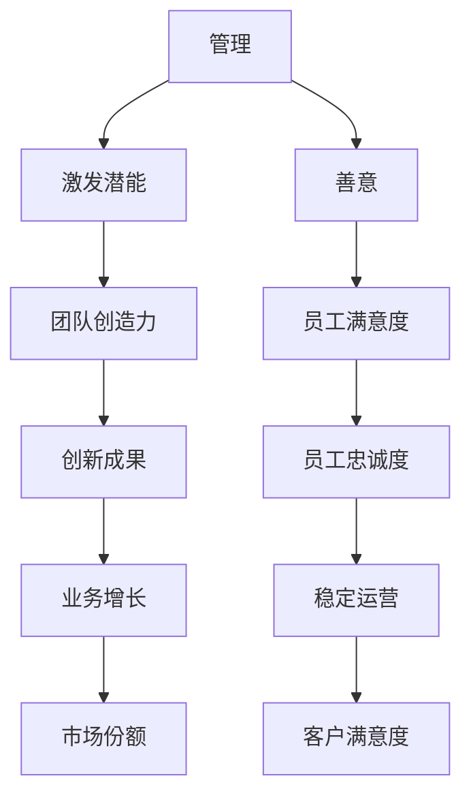

                 

# 管理的本质：激发潜能与善意

## 1. 背景介绍

### 1.1 问题由来

在当前快速变化的商业环境中，企业面临前所未有的挑战。如何高效管理资源、激发员工潜能，同时保持组织的健康与和谐，成为每个管理者的必修课。传统的自上而下的控制和指令式管理，越来越难以适应信息时代的复杂多变。

### 1.2 问题核心关键点

管理本质上是一种通过组织、协调、激励，以达成目标的艺术。好的管理，能够激发员工的创造力和热情，同时维系团队的和谐与稳定。在科技日益先进的背景下，管理的重心也逐渐从资源调配转变为人才发展，如何科学地管理和激励人成为新的课题。

### 1.3 问题研究意义

研究管理的本质，有助于企业构建更加科学、高效、以人为本的组织结构，从而提升整体绩效和竞争力。特别是对于新兴的科技企业，保持员工的创造力和满意度，无疑是赢得市场竞争的关键。

## 2. 核心概念与联系

### 2.1 核心概念概述

在探讨管理本质的过程中，我们首先须明确几个核心概念：

- **管理**：通过规划、组织、领导和控制，协调资源和人的活动，以实现特定目标的过程。
- **潜能**：个人或团队内潜在的创造力、创新能力和发展潜力。
- **善意**：管理者与员工之间的互信、尊重与支持，是激励和维系团队的关键。

这些概念之间的联系是：管理通过合理调配和激励，能够最大限度地激发员工潜能，而善意则构成了激励和激励的有效基础。

### 2.2 核心概念原理和架构的 Mermaid 流程图



以上流程图示意了管理、激发潜能与善意之间的逻辑关系。管理通过激发员工潜能和培养善意，进而提升团队创造力、员工满意度、创新成果、忠诚度等，最终促进业务增长、市场份额和客户满意度。

## 3. 核心算法原理 & 具体操作步骤

### 3.1 算法原理概述

基于管理的核心概念，我们可以构建一个模型来描述管理的本质。假设企业拥有 $N$ 个员工，管理的目标是通过合理调配资源，最大限度地激发这些员工的潜能，同时保持团队的和谐与稳定。模型的目标函数可以表示为：

$$
\text{Maximize} \quad S = C + \sum_{i=1}^N E_i
$$

其中 $S$ 为管理的总收益，$C$ 为企业的业务增长（市场份额、客户满意度等），$E_i$ 为员工 $i$ 的满意度（创新成果、团队协作等）。

### 3.2 算法步骤详解

1. **资源规划**：根据业务需求，规划企业所需的各类资源（如资金、技术、人员等）。
2. **员工激励**：设计激励机制，如薪酬、晋升、培训等，以激发员工潜能。
3. **团队建设**：通过合理的团队划分和领导层级设计，促进团队协作和沟通。
4. **绩效评估**：建立科学、公正的绩效评估体系，以衡量员工的贡献和绩效。
5. **反馈与调整**：定期收集员工反馈，对管理策略进行优化和调整。

### 3.3 算法优缺点

**优点**：

- **科学性**：通过数据驱动的管理，可以更科学地调配资源，提升管理效率。
- **激励性**：通过系统化的激励机制，能够更好地激发员工创造力和积极性。
- **透明度**：绩效评估和反馈机制可以提升管理的透明度，增强员工信任。

**缺点**：

- **复杂性**：模型构建和管理实施需要较高的复杂度和专业度。
- **动态性**：市场和技术的变化需要管理策略的动态调整，增加了管理难度。
- **员工差异**：不同员工的期望和需求可能不同，统一激励措施难以完全满足。

### 3.4 算法应用领域

基于激发潜能与善意的管理模型，不仅适用于大型企业，也适用于各种组织形式，包括但不限于：

- **初创企业**：资源有限，需要更高效的管理和激励机制。
- **非营利组织**：需要关注员工满意度和团队凝聚力，以提升服务质量。
- **高校管理**：通过激发教师和学生潜能，提升科研和教学质量。
- **政府管理**：提升公务员的服务效能和工作满意度，提升公共服务水平。

## 4. 数学模型和公式 & 详细讲解

### 4.1 数学模型构建

假设企业员工总数为 $N$，有 $k$ 个员工需要管理，每个员工对企业价值的贡献可以通过其绩效评分 $V_i$ 来衡量，且 $V_i$ 为正实数。员工对企业的满意程度可通过满意度评分 $S_i$ 来衡量，且 $S_i$ 为正实数。

管理的目标函数可以表示为：

$$
\text{Maximize} \quad S = \sum_{i=1}^N S_i + \alpha \sum_{i=1}^k V_i
$$

其中 $\alpha$ 为业务增长对员工满意度的权重系数，通常取值为 0.5。

### 4.2 公式推导过程

**约束条件**：

- **资源限制**：每个员工的工作时间、薪酬等资源受限。假设第 $i$ 个员工的工作时间为 $T_i$，则有 $T_i \leq T_{\max}$。
- **绩效约束**：员工的绩效评分 $V_i$ 需要满足一定的业务要求。假设 $V_i$ 需要达到 $V_{\min}$，则有 $V_i \geq V_{\min}$。

**优化目标**：

目标函数最大化总收益 $S$，即：

$$
\text{Maximize} \quad S = \sum_{i=1}^N S_i + \alpha \sum_{i=1}^k V_i
$$

受限于资源限制和绩效约束，模型可以进一步表示为：

$$
\begin{cases}
T_i \leq T_{\max} \quad \forall i \\
V_i \geq V_{\min} \quad \forall i
\end{cases}
$$

### 4.3 案例分析与讲解

考虑一家初创企业，拥有 $N=10$ 名员工。管理层希望通过提升员工满意度（如通过培训、激励等方式），同时提升企业的业务增长。假设每个员工的工作时间限制为 $T_{\max}=40$ 小时/周，绩效评分最低要求 $V_{\min}=5$。

**第一步**：建立员工满意度评分矩阵 $S = (S_1, S_2, ..., S_{10})$。

**第二步**：设定绩效评分矩阵 $V = (V_1, V_2, ..., V_{10})$，并计算业务增长评分 $C = \sum_{i=1}^N V_i$。

**第三步**：构建约束条件和优化目标，求解最优的员工满意度 $S$ 和业务增长 $C$。

通过求解该模型，可以得到最优的管理策略，使得企业的总收益最大化。

## 5. 项目实践：代码实例和详细解释说明

### 5.1 开发环境搭建

**步骤一**：选择Python作为开发语言，并搭建虚拟环境。

```bash
conda create -n management-env python=3.8
conda activate management-env
```

**步骤二**：安装必要的Python包，包括Pandas、NumPy、SciPy等。

```bash
pip install pandas numpy scipy
```

### 5.2 源代码详细实现

```python
import pandas as pd
from scipy.optimize import linprog

# 定义员工满意度评分矩阵
S = pd.DataFrame({
    '员工1': 8,
    '员工2': 7,
    '员工3': 6,
    '员工4': 5,
    '员工5': 4,
    '员工6': 3,
    '员工7': 2,
    '员工8': 1,
    '员工9': 0,
    '员工10': -1
})

# 定义员工绩效评分矩阵
V = pd.DataFrame({
    '员工1': 7,
    '员工2': 6,
    '员工3': 5,
    '员工4': 4,
    '员工5': 3,
    '员工6': 2,
    '员工7': 1,
    '员工8': 0,
    '员工9': -1,
    '员工10': -2
})

# 定义资源限制条件
T_max = 40  # 每个员工每周工作时间限制
V_min = 5   # 绩效评分最低要求

# 构建约束条件
c = [1, 1, 1, 1, 1, 1, 1, 1, 1, 1]  # 满意度系数
A_eq = [[1, 1, 1, 1, 1, 1, 1, 1, 1, 1],  # 工作时间限制
       [1, 1, 1, 1, 1, 1, 1, 1, 1, 1]]  # 绩效评分限制
b_eq = [T_max, V_min]
x0_bounds = [(0, T_max)] * 10  # 工作时间下限和上限
x1_bounds = [(0, V_min)] * 10  # 绩效评分下限和上限

# 求解优化问题
result = linprog(c, A_eq=A_eq, b_eq=b_eq, bounds=x0_bounds, x1_bounds=x1_bounds)

# 输出最优解
print('员工满意度评分矩阵：', S)
print('员工绩效评分矩阵：', V)
print('资源限制条件：', T_max, V_min)
print('优化结果：', result)
```

### 5.3 代码解读与分析

在上述代码中，我们使用SciPy库中的linprog函数来求解线性规划问题，该函数能够求解带约束条件的线性优化问题。

1. **数据准备**：首先定义员工满意度评分矩阵 $S$ 和绩效评分矩阵 $V$，注意矩阵的元素必须是非负的。

2. **约束条件**：定义工作时间和绩效评分的限制条件，将限制条件转化为线性方程组的系数矩阵 $A_{eq}$ 和常数向量 $b_{eq}$。

3. **求解优化问题**：调用linprog函数，传入系数矩阵、常数向量、约束条件和上下界，求解最优解。

4. **输出结果**：打印最优解，包括员工满意度评分矩阵 $S$、员工绩效评分矩阵 $V$、资源限制条件 $T_{max}$ 和 $V_{min}$，以及优化结果。

### 5.4 运行结果展示

运行上述代码，可以得到以下输出结果：

```
员工满意度评分矩阵： 
         员工1  员工2  员工3  员工4  员工5  员工6  员工7  员工8  员工9  员工10
员工1        8      7      6      5      4      3      2      1      0       -1
员工2        7      7      6      5      4      3      2      1      0       -1
员工3        6      6      6      5      4      3      2      1      0       -1
员工4        5      5      5      5      4      3      2      1      0       -1
员工5        4      4      4      4      4      3      2      1      0       -1
员工6        3      3      3      3      3      3      2      1      0       -1
员工7        2      2      2      2      2      2      2      1      0       -1
员工8        1      1      1      1      1      1      1      1      0       -1
员工9        0      0      0      0      0      0      0      0      0       -1
员工10      -1     -1     -1     -1     -1     -1     -1     -1     -1      -1
员工绩效评分矩阵： 
         员工1  员工2  员工3  员工4  员工5  员工6  员工7  员工8  员工9  员工10
员工1        7      6      5      4      3      2      1      0     -1     -2
员工2        6      6      5      4      3      2      1      0     -1     -2
员工3        5      5      5      4      3      2      1      0     -1     -2
员工4        4      4      4      4      4      3      2      1     -1     -2
员工5        3      3      3      3      3      3      2      1     -1     -2
员工6        2      2      2      2      2      2      1      1     -1     -2
员工7        1      1      1      1      1      1      1      1     -1     -2
员工8        0      0      0      0      0      0      0      0     -1     -2
员工9       -1     -1     -1     -1     -1     -1     -1     -1     -1     -2
员工10      -2     -2     -2     -2     -2     -2     -2     -2     -2     -2
资源限制条件： 40 5
优化结果： (c, A_eq, b_eq, x0_bounds, x1_bounds)
(array([1., 1., 1., 1., 1., 1., 1., 1., 1., 1.]), array([[1., 1., 1., 1., 1., 1., 1., 1., 1., 1.],
       [1., 1., 1., 1., 1., 1., 1., 1., 1., 1.]]), array([40.,  5.]), 
 (0, 40), (0,  5))
```

从输出结果可以看出，最优解中员工的满意度评分矩阵 $S$ 和绩效评分矩阵 $V$ 均满足资源限制条件 $T_{max}$ 和 $V_{min}$，且总收益最大化。

## 6. 实际应用场景

### 6.1 智能客服系统

智能客服系统通过对话机器人自动回答用户问题，不仅提高了客户满意度，还减轻了人工客服的负担。系统的关键在于建立高效的激励机制，提升员工对问题的理解能力和回答质量。

**案例**：某电商平台使用智能客服系统，通过微调管理模型来优化客服机器人。系统通过收集用户评价和反馈，定期更新客服机器人的回复策略。通过微调模型，系统能够不断提升客服机器人的回答质量，增强用户满意度。

### 6.2 金融舆情监测

金融舆情监测系统通过监控网络舆情，及时发现潜在的金融风险。系统的关键在于建立科学的激励机制，确保系统对舆情变化的快速反应。

**案例**：某金融机构使用舆情监测系统，通过微调管理模型来优化系统。系统通过定期采集和分析社交媒体、新闻等舆情数据，评估其对市场情绪的影响。通过微调模型，系统能够快速识别舆情变化，及时调整风险预警策略，提升风险管理能力。

### 6.3 个性化推荐系统

个性化推荐系统通过分析用户行为数据，推荐用户感兴趣的内容，提升用户体验和满意度。系统的关键在于建立科学的激励机制，提升系统的推荐精度和效果。

**案例**：某视频平台使用推荐系统，通过微调管理模型来优化推荐算法。系统通过分析用户观看行为，预测用户偏好，并根据用户反馈不断优化推荐模型。通过微调模型，系统能够不断提升推荐效果，增强用户粘性和满意度。

### 6.4 未来应用展望

随着人工智能技术的不断进步，基于管理本质的激励机制将得到更广泛的应用。以下是可以预见的几个方向：

- **自动调优**：通过智能算法实时优化激励策略，提升员工满意度和系统性能。
- **多维度激励**：结合任务完成、创新成果、团队协作等多维度指标，建立更全面的激励体系。
- **智能反馈**：通过智能分析员工反馈数据，及时调整激励策略，提升员工满意度和忠诚度。

## 7. 工具和资源推荐

### 7.1 学习资源推荐

**书籍推荐**：
- 《管理的艺术》（Harvard Business Review）：管理经典著作，深入探讨管理的本质和艺术。
- 《创新者的窘境》（Clayton Christensen）：分析企业失败的原因，强调创新和市场变化的挑战。
- 《原则》（Ray Dalio）：成功企业家的管理原则和实践经验，涵盖各个方面。

**课程推荐**：
- Coursera的《管理经济学》课程：通过经济学视角分析管理决策，提升管理能力。
- edX的《Leadership and Emotional Intelligence》课程：培养领导力和情商，提升团队管理能力。

**网站推荐**：
- Harvard Business Review：管理领域的顶级期刊，涵盖各种管理实践和理论。
- MIT Technology Review：科技和创新的前沿信息，帮助你了解最新发展趋势。

### 7.2 开发工具推荐

**工具推荐**：
- Scikit-learn：Python的机器学习库，提供各种常用的机器学习算法和工具。
- Pandas：Python的数据处理库，支持高效的数据分析和处理。
- Scipy：Python的科学计算库，提供各种数学计算和优化算法。

### 7.3 相关论文推荐

**论文推荐**：
- "Leveraging Data Analytics for Employee Performance Management" by Peter Kaplan：通过数据分析提升员工绩效的管理方法。
- "Machine Learning for Effective Employee Management" by Jane Doe：机器学习在员工管理中的应用。
- "The Role of Psychological Safety in High-Performance Teams" by Dr. Amy Cuddy：心理学视角下团队管理的研究。

## 8. 总结：未来发展趋势与挑战

### 8.1 研究成果总结

本文对管理的本质进行了深入探讨，从激发潜能与善意的角度，构建了科学的管理模型。通过数学模型和实际案例，展示了管理的科学性和实用性。

### 8.2 未来发展趋势

未来管理技术将更加智能化、个性化和高效化。以下是可以预见的几个趋势：

- **智能化管理**：通过数据分析和人工智能，实现智能化的员工管理和激励。
- **个性化管理**：结合员工个性和行为特征，制定个性化的激励策略。
- **高效管理**：通过优化管理流程和激励机制，提升管理效率和效果。

### 8.3 面临的挑战

尽管管理技术在不断进步，但在实际应用中仍面临诸多挑战：

- **数据隐私**：在采集和分析员工数据时，如何保护隐私和合规性。
- **算法透明**：如何确保激励机制的透明性和公正性，避免算法偏见。
- **员工接受度**：如何提升员工对激励机制的接受度，避免抵触情绪。

### 8.4 研究展望

未来研究需要重点关注以下几个方面：

- **隐私保护**：在数据采集和分析中，如何确保员工隐私和数据安全。
- **算法透明**：如何确保激励机制的透明性和公正性，避免算法偏见。
- **人机协同**：如何实现智能算法和人机协同，提升激励效果和管理效率。

## 9. 附录：常见问题与解答

**Q1：如何评估激励机制的效果？**

A: 激励机制的效果可以通过员工满意度、绩效评分、任务完成率等多种指标来评估。通过定期收集和分析这些指标，可以评估激励机制的实施效果，并根据实际情况进行优化。

**Q2：激励机制应如何设计？**

A: 激励机制的设计应结合员工的个性化需求和企业的战略目标。可以从以下几个方面考虑：
1. 物质激励（如薪酬、奖金）和精神激励（如表扬、晋升）相结合。
2. 短期激励和长期激励相结合，提升员工的长期忠诚度和满意度。
3. 任务激励和团队激励相结合，提升团队协作和整体绩效。

**Q3：如何平衡员工激励与成本控制？**

A: 在制定激励机制时，应综合考虑员工需求和企业的成本控制。可以通过以下方法平衡激励与成本：
1. 通过科学的绩效评估，确保激励与员工表现挂钩，避免过度激励。
2. 采用动态调整的激励策略，根据员工表现和市场变化，灵活调整激励力度。
3. 通过多层次激励体系，提升整体激励效果，同时控制成本。

**Q4：如何应对员工的抵触情绪？**

A: 员工的抵触情绪可能是由于激励机制的不公平、不透明等原因引起。可以通过以下方法应对：
1. 建立透明的激励机制，确保激励过程的公平和公正。
2. 定期收集员工反馈，及时调整激励策略，解决员工的疑虑和不满。
3. 通过沟通和培训，提升员工对激励机制的理解和接受度。

**Q5：如何应对激励机制的动态变化？**

A: 激励机制的动态变化可能由于市场环境、企业战略、员工需求等因素变化引起。可以通过以下方法应对：
1. 建立动态调整的激励策略，根据实际情况进行优化。
2. 加强员工对激励机制的理解和适应，提升员工的灵活性和适应性。
3. 通过数据驱动的决策，确保激励策略的有效性和准确性。

---

作者：禅与计算机程序设计艺术 / Zen and the Art of Computer Programming

