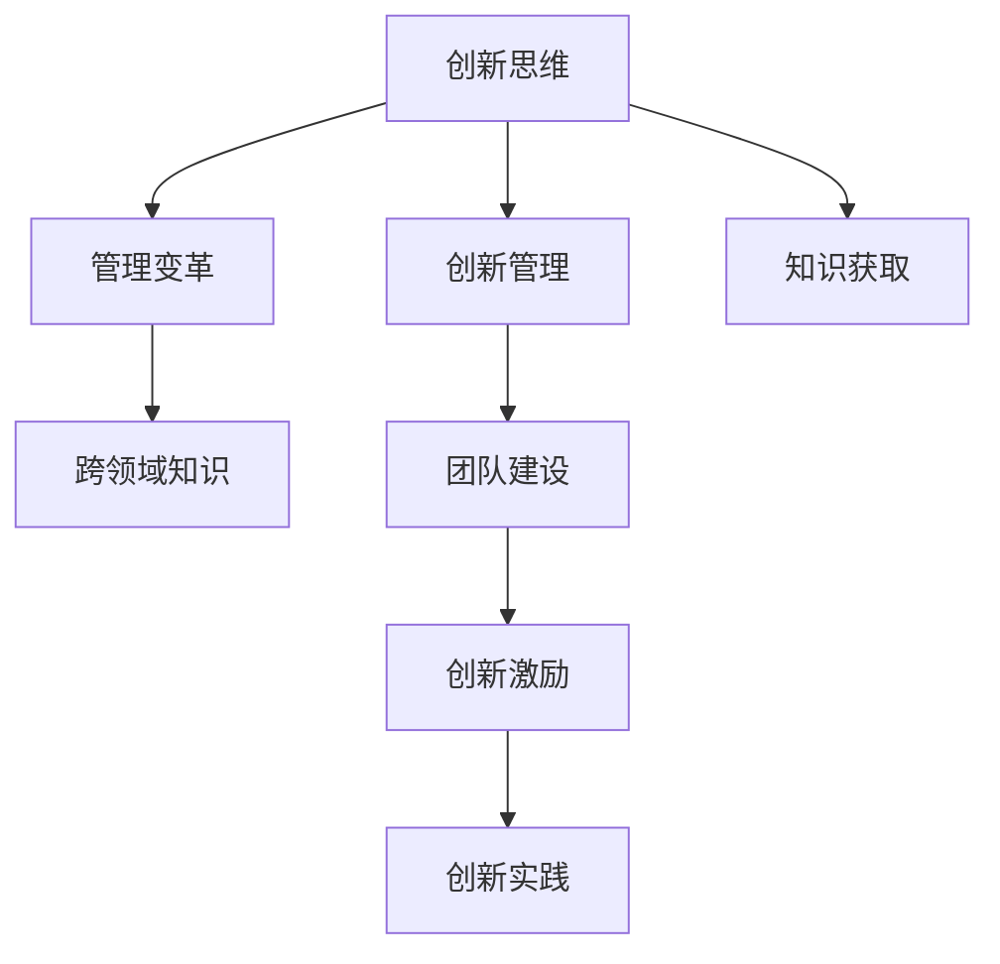

                 

# 管理者如何培养创新思维

> 关键词：创新思维, 创新管理, 管理变革, 跨领域知识, 团队建设, 创新激励

## 1. 背景介绍

在当今快速变化和竞争激烈的市场环境中，创新思维成为了企业保持竞争力的关键。对于管理者而言，如何培养和激励团队中的创新思维，以实现组织的长远发展和目标，成为了一项重要任务。本文将深入探讨管理者如何培养创新思维，并提出一系列策略和方法，帮助管理者在实践中有效地激发团队成员的创新潜力。

## 2. 核心概念与联系

### 2.1 核心概念概述

- **创新思维（Innovative Thinking）**：指在面对问题或挑战时，能够提出新颖、独特且具有可行性的解决方案的思维方式。

- **创新管理（Innovation Management）**：涉及如何识别、开发、实施和维护创新项目的策略和流程，确保组织能够持续创新。

- **管理变革（Management Change）**：涉及组织结构、流程、文化等内部机制的根本性改变，以实现战略目标。

- **跨领域知识（Interdisciplinary Knowledge）**：涉及将不同领域的知识和方法应用于组织创新实践中的能力。

- **团队建设（Team Building）**：涉及构建和优化团队结构，促进成员之间的协作与沟通，提升团队整体效能。

- **创新激励（Innovation Motivation）**：指通过各种手段激发团队成员的创新动机，创造支持创新的环境。

这些核心概念之间的关系可以通过以下Mermaid流程图来展示：



这个流程图展示了创新思维如何通过跨领域知识的学习和管理变革的实践，在团队建设过程中得到提升，并通过创新激励最终转化为实际创新实践的过程。

## 3. 核心算法原理 & 具体操作步骤
### 3.1 算法原理概述

管理者培养创新思维的算法原理主要基于心理学和组织行为学的研究成果，结合创新管理的最佳实践，形成了一套系统的方法论。

- **问题识别**：通过系统化的方法识别组织内部的痛点和挑战，为创新提供明确的目标和方向。
- **知识获取**：鼓励跨领域学习，扩大知识面，提升创新思维的多样性和深度。
- **团队协作**：通过优化团队结构，促进协作与沟通，激发团队成员的创新潜力。
- **创新激励**：通过正向激励机制，如奖励创新、容忍失败、提供资源等，营造支持创新的文化氛围。
- **实践实施**：将创新的想法和策略转化为实际项目，进行试点和验证，不断迭代优化。

### 3.2 算法步骤详解

**Step 1: 问题识别**

管理者首先需要对组织内部的问题进行系统性分析和识别。这可以通过以下方法实现：

1. **SWOT分析**：分析组织的优势（Strengths）、劣势（Weaknesses）、机会（Opportunities）和威胁（Threats），明确创新方向。
2. **战略地图**：绘制组织的战略地图，识别关键业务领域和潜在改进点。
3. **客户反馈**：收集客户反馈，了解他们的需求和痛点，为创新提供依据。

**Step 2: 知识获取**

管理者应鼓励团队成员通过以下方式获取跨领域知识：

1. **跨学科学习**：鼓励团队成员参加跨学科的培训和研讨会，学习相关领域的最新知识和技能。
2. **知识共享**：建立知识共享平台，促进团队成员之间的经验交流和知识共享。
3. **外部资源**：通过外部专家咨询、行业报告等方式，获取前沿的创新理念和方法。

**Step 3: 团队协作**

管理者应优化团队结构，促进协作与沟通，激发团队成员的创新潜力：

1. **多样性招聘**：招聘具有不同背景和技能的人才，增加团队多样性。
2. **角色分工**：明确团队成员的角色和职责，促进专业化和协作。
3. **沟通机制**：建立高效的沟通机制，如定期会议、工作坊等，促进信息流动。

**Step 4: 创新激励**

管理者应通过正向激励机制，营造支持创新的文化氛围：

1. **奖励机制**：建立创新的奖励机制，对提出和实施创新项目的团队和个人进行奖励。
2. **容忍失败**：鼓励尝试新想法，即使失败，也要从中学习和改进。
3. **资源支持**：提供必要的资源和支持，如时间、资金、技术等，确保创新项目的顺利进行。

**Step 5: 实践实施**

管理者应将创新的想法和策略转化为实际项目，进行试点和验证，不断迭代优化：

1. **试点项目**：选择具有潜力的创新想法，进行小规模试点，验证其可行性和效果。
2. **反馈机制**：建立反馈机制，收集试点项目的反馈，不断优化和改进。
3. **规模推广**：试点成功后，进行大规模推广和应用，实现组织的目标和愿景。

### 3.3 算法优缺点

管理者培养创新思维的算法具有以下优点：

- **系统化**：通过系统化的步骤和方法，确保创新过程的全面性和有效性。
- **灵活性**：鼓励跨领域学习和知识共享，提升团队的多样性和创新潜力。
- **持续性**：通过正向激励和反馈机制，营造支持创新的文化氛围，实现持续创新。

同时，也存在一些缺点：

- **资源消耗**：系统的实施可能需要大量资源和时间，包括培训、知识共享平台的搭建等。
- **复杂性**：系统的实施需要管理者的专业知识和能力，存在一定的复杂性。
- **风险管理**：创新项目存在一定的风险，如何有效管理风险，是一个挑战。

### 3.4 算法应用领域

管理者培养创新思维的算法适用于各类组织和团队，特别是在以下领域：

1. **高科技公司**：如互联网、金融科技、医疗科技等，这些公司对创新有高度需求，可以通过该算法系统地培养和激励创新思维。
2. **创业团队**：创业团队需要不断创新，解决市场和客户的新问题，该算法可以提供系统性的支持。
3. **传统行业**：如制造业、零售业、农业等，通过该算法可以提升组织的创新能力，实现转型升级。

## 4. 数学模型和公式 & 详细讲解 & 举例说明

### 4.1 数学模型构建

本节将使用数学语言对管理者培养创新思维的过程进行更加严格的刻画。

记管理者在组织内部识别的问题为 $P$，团队成员的知识水平为 $K$，团队的协作能力为 $C$，创新激励机制为 $I$，创新实践的效果为 $E$。则管理者培养创新思维的数学模型为：

$$
E = f(P, K, C, I)
$$

其中 $f$ 为模型的映射函数，表示如何通过问题识别、知识获取、团队协作和创新激励，实现创新实践的效果 $E$。

### 4.2 公式推导过程

以下我们将推导该模型中每个关键变量的影响函数，以便更深入理解其作用。

1. **问题识别 $P$**：

$$
P \rightarrow \text{问题描述} \rightarrow \text{问题严重性} \rightarrow \text{创新方向}
$$

其中问题描述越清晰、问题严重性越高，则创新方向越明确。

2. **知识获取 $K$**：

$$
K \rightarrow \text{跨领域知识} \rightarrow \text{知识广度} \rightarrow \text{知识深度}
$$

跨领域知识越丰富，知识广度和深度越高，则创新潜力越大。

3. **团队协作 $C$**：

$$
C \rightarrow \text{团队结构} \rightarrow \text{沟通机制} \rightarrow \text{协作效率}
$$

团队结构合理、沟通机制高效，协作效率越高，则创新实践效果越好。

4. **创新激励 $I$**：

$$
I \rightarrow \text{奖励机制} \rightarrow \text{容忍失败} \rightarrow \text{资源支持}
$$

奖励机制明确、容忍失败、资源充足，则创新激励越强。

### 4.3 案例分析与讲解

假设某高科技公司面临市场需求变化快速的问题，需要开发新的产品和服务。通过以下步骤实现创新思维的培养：

1. **问题识别**：
   - **SWOT分析**：发现公司的优势在于技术研发能力强，劣势在于市场响应速度慢，机会在于新兴技术市场的崛起，威胁在于竞争对手的快速扩张。
   - **战略地图**：识别出关键业务领域为产品开发和市场推广。
   - **客户反馈**：通过客户调研，了解到用户对现有产品的不满意和需求的新变化。

2. **知识获取**：
   - **跨学科学习**：组织团队成员参加新技术的培训和研讨会，学习新兴技术的最新应用。
   - **知识共享**：建立内部知识共享平台，促进团队成员之间的经验交流和知识共享。
   - **外部资源**：通过外部专家咨询和行业报告，获取新兴技术市场的趋势和机会。

3. **团队协作**：
   - **多样性招聘**：招聘具有技术、市场、用户体验等多方面背景的人才，增加团队多样性。
   - **角色分工**：明确团队成员的角色和职责，促进专业化和协作。
   - **沟通机制**：建立高效的沟通机制，如定期会议、工作坊等，促进信息流动。

4. **创新激励**：
   - **奖励机制**：建立创新的奖励机制，对提出和实施创新项目的团队和个人进行奖励。
   - **容忍失败**：鼓励团队尝试新想法，即使失败，也要从中学习和改进。
   - **资源支持**：提供必要的资源和支持，如时间、资金、技术等，确保创新项目的顺利进行。

5. **实践实施**：
   - **试点项目**：选择具有潜力的创新想法，进行小规模试点，验证其可行性和效果。
   - **反馈机制**：建立反馈机制，收集试点项目的反馈，不断优化和改进。
   - **规模推广**：试点成功后，进行大规模推广和应用，实现组织的目标和愿景。

## 5. 项目实践：代码实例和详细解释说明

### 5.1 开发环境搭建

在进行创新思维培养的实践前，我们需要准备好开发环境。以下是使用Python进行开发的环境配置流程：

1. 安装Python：从官网下载并安装Python，推荐使用最新稳定版本。
2. 安装Jupyter Notebook：用于编写和运行Python代码，可以通过pip安装。
3. 安装相关库：如numpy、pandas、scikit-learn等，用于数据处理和机器学习模型训练。

完成上述步骤后，即可在Jupyter Notebook中开始实践。

### 5.2 源代码详细实现

这里我们以知识获取为例，给出使用Python进行知识共享平台的实现。

首先，定义数据结构：

```python
class KnowledgeItem:
    def __init__(self, id, title, content, tags, author):
        self.id = id
        self.title = title
        self.content = content
        self.tags = tags
        self.author = author
```

然后，实现知识共享平台的基本功能：

```python
class KnowledgePlatform:
    def __init__(self, knowledge_items):
        self.knowledge_items = knowledge_items
    
    def get_knowledge(self, item_id):
        for item in self.knowledge_items:
            if item.id == item_id:
                return item
    
    def search_knowledge(self, keyword):
        results = []
        for item in self.knowledge_items:
            if keyword in item.title or keyword in item.content:
                results.append(item)
        return results
```

最后，构建知识共享平台：

```python
# 创建知识库
knowledge_items = [
    KnowledgeItem(1, "机器学习基础", "...内容...", ["机器学习", "深度学习"], "张三"),
    KnowledgeItem(2, "数据科学实战", "...内容...", ["数据科学", "数据挖掘"], "李四"),
    ...
]

# 使用知识共享平台
platform = KnowledgePlatform(knowledge_items)
platform.get_knowledge(1)  # 获取知识ID为1的内容
platform.search_knowledge("深度学习")  # 搜索包含"深度学习"的知识
```

### 5.3 代码解读与分析

这里我们详细解读一下关键代码的实现细节：

**KnowledgeItem类**：
- `__init__`方法：初始化知识项的基本属性，包括ID、标题、内容、标签和作者。

**KnowledgePlatform类**：
- `__init__`方法：初始化知识平台，存储知识项列表。
- `get_knowledge`方法：根据ID获取知识项内容。
- `search_knowledge`方法：根据关键词搜索知识项，返回包含关键词的结果。

**知识共享平台的实现**：
- 通过定义`KnowledgeItem`和`KnowledgePlatform`类，实现了知识项的存储和查询功能。
- 利用Python的数据结构和方法，简化了知识共享平台的实现。
- 代码实现简洁、高效，易于扩展和维护。

## 6. 实际应用场景

### 6.1 智能制造

智能制造领域面临快速变化的工艺和技术需求，管理者通过培养创新思维，推动新技术的引入和应用。

具体而言，可以构建跨学科的知识共享平台，促进不同领域的专家交流，推动新技术的引入和应用。同时，通过正向激励机制，鼓励团队成员提出和实施创新项目，推动智能制造的持续创新和优化。

### 6.2 健康医疗

健康医疗领域的技术进步和创新对提高医疗质量和效率至关重要。管理者通过培养创新思维，推动医疗技术的创新和应用。

具体而言，可以通过跨学科学习，提升团队成员对新兴技术的理解和应用能力。同时，通过建立创新的奖励机制，激励团队成员提出和实施创新项目，推动医疗技术的持续改进和优化。

### 6.3 金融科技

金融科技领域需要不断创新，以应对市场变化和客户需求。管理者通过培养创新思维，推动金融科技的创新和应用。

具体而言，可以通过跨学科学习，提升团队成员对新兴技术和市场趋势的理解。同时，通过建立正向激励机制，鼓励团队成员提出和实施创新项目，推动金融科技的持续创新和优化。

### 6.4 未来应用展望

未来，随着人工智能、大数据、物联网等技术的不断发展，基于创新思维的管理方法将得到更广泛的应用，推动各行业的数字化转型和智能化升级。

在智慧城市、智能交通、智慧能源等领域，管理者通过培养创新思维，推动新技术的引入和应用，提升公共服务的智能化水平，实现城市管理和社会治理的现代化。

## 7. 工具和资源推荐

### 7.1 学习资源推荐

为了帮助管理者系统掌握创新思维的培养方法，这里推荐一些优质的学习资源：

1. **《创新者的窘境》（The Innovator's Dilemma）**：作者：克莱顿·克里斯滕森（Clayton Christensen），系统介绍了创新背后的理论基础和实践方法。
2. **《蓝海战略》（Blue Ocean Strategy）**：作者：W. 钱·金（W. Chan Kim）和勒妮·莫博涅（Renée Mauborgne），介绍了如何通过创新的市场细分，实现竞争优势。
3. **《颠覆性技术创新》（Disruptive Technologies: 20 Paradigms Transforming Industry and Society）**：作者：约翰·皮拉（John G. Pillar），介绍了20种颠覆性技术对行业的深远影响。
4. **《敏捷管理》（Agile Management）**：作者：西奥多·达夫特（Theodore D. Duffett），介绍了敏捷管理的方法论和实践。
5. **《精益创业》（The Lean Startup）**：作者：艾瑞克·莱斯（Eric Ries），介绍了如何通过快速迭代和验证，实现产品创新。

通过对这些资源的学习实践，相信管理者能够更好地理解创新思维的培养方法，并将其应用到实际管理中。

### 7.2 开发工具推荐

高效的开发离不开优秀的工具支持。以下是几款用于创新思维培养开发的常用工具：

1. **Trello**：项目管理和协作工具，帮助团队进行任务分解和进度跟踪。
2. **JIRA**：任务追踪和缺陷管理工具，提供强大的问题跟踪和统计功能。
3. **Slack**：即时通讯和协作工具，促进团队成员之间的沟通和协作。
4. **Zoom**：视频会议和在线培训工具，支持远程团队协作和沟通。
5. **Google Docs**：在线文档协作工具，支持团队成员共同编辑和讨论。

合理利用这些工具，可以显著提升创新思维培养的开发效率，加快创新项目的推进和实施。

### 7.3 相关论文推荐

管理者培养创新思维的研究源于学界的持续研究。以下是几篇奠基性的相关论文，推荐阅读：

1. **《组织学习与创新》（Organization Learning and Innovation）**：作者：亚当·沃德（Adam Wade）和维韦克·拉贾戈帕兰（Vivek Ranjan），介绍了组织学习与创新的关系。
2. **《跨领域创新》（Cross-Domain Innovation）**：作者：阿米特·查卡瓦尔（Amit Chakrabarti）和詹姆斯·H·夏普（James H. Sharp），介绍了跨领域创新的方法和实践。
3. **《创新与企业文化》（Innovation and Organizational Culture）**：作者：林登·米尔斯（Lyndon Miles）和理查德·金（Richard King），介绍了创新与企业文化的关系。
4. **《管理变革的路径》（The Path to Management Change）**：作者：阿尔文·托夫勒（Alvin Toffler）和弗兰克·G·休伯曼（Frank G. Wharton），介绍了管理变革的路径和方法。
5. **《创新的战略管理》（Strategic Management of Innovation）**：作者：弗雷德·W·克莱姆（Fred W. Clegg）和约翰·N·皮斯（John N. Pearce），介绍了创新的战略管理方法。

这些论文代表了大语言模型微调技术的发展脉络。通过学习这些前沿成果，可以帮助研究者把握学科前进方向，激发更多的创新灵感。

## 8. 总结：未来发展趋势与挑战

### 8.1 总结

本文对管理者如何培养创新思维进行了全面系统的介绍。首先阐述了创新思维的培养在现代管理中的重要性，明确了培养创新思维的系统化方法和策略。其次，从原理到实践，详细讲解了创新思维的培养步骤和关键要素，给出了创新思维培养的完整代码实例。同时，本文还广泛探讨了创新思维在各行业领域的应用前景，展示了创新思维培养的巨大潜力。此外，本文精选了创新思维培养的各类学习资源，力求为管理者提供全方位的技术指引。

通过本文的系统梳理，可以看到，创新思维的培养对于管理者在快速变化和竞争激烈的市场环境中保持组织竞争力具有重要意义。管理者通过系统化的方法和策略，可以有效地激发团队成员的创新潜力，推动组织的持续创新和优化。

### 8.2 未来发展趋势

展望未来，创新思维的培养将呈现以下几个发展趋势：

1. **数字化转型**：随着数字化技术的普及，管理者将更多地利用数字化工具和平台，推动创新思维的培养和应用。
2. **跨领域融合**：创新思维将更加注重跨领域知识的融合和应用，提升团队的多样性和创新潜力。
3. **数据驱动**：管理者将更多地利用数据分析和机器学习等方法，量化评估创新思维的效果和影响。
4. **持续学习**：管理者将注重持续学习和知识更新，提升自身和团队的知识水平和创新能力。
5. **协作与共享**：管理者将更加重视团队协作和知识共享，促进创新思维的快速传播和应用。

以上趋势凸显了创新思维培养的重要性和未来方向。这些方向的探索发展，必将进一步提升管理者的创新能力，推动组织的持续创新和优化。

### 8.3 面临的挑战

尽管创新思维的培养已经取得了一定进展，但在迈向更加智能化、普适化应用的过程中，它仍面临诸多挑战：

1. **资源消耗**：系统的实施可能需要大量资源和时间，包括培训、知识共享平台的搭建等。
2. **复杂性**：系统的实施需要管理者的专业知识和能力，存在一定的复杂性。
3. **风险管理**：创新项目存在一定的风险，如何有效管理风险，是一个挑战。
4. **激励机制**：如何设计有效的创新激励机制，激发团队成员的创新动机，需要进一步探索。
5. **文化建设**：如何营造支持创新的文化氛围，需要持续努力和改进。

正视创新思维培养面临的这些挑战，积极应对并寻求突破，将是大语言模型微调走向成熟的必由之路。相信随着学界和产业界的共同努力，这些挑战终将一一被克服，创新思维培养必将在构建人机协同的智能时代中扮演越来越重要的角色。

### 8.4 研究展望

未来，研究者需要在以下几个方面寻求新的突破：

1. **跨领域知识获取**：如何更好地整合跨领域知识，提升创新思维的多样性和深度。
2. **创新激励机制**：如何设计更有效的创新激励机制，激发团队成员的创新动机。
3. **风险管理**：如何有效管理创新项目的风险，确保创新过程的稳定性和可持续性。
4. **文化建设**：如何营造支持创新的文化氛围，增强团队的凝聚力和创新动力。
5. **数据驱动**：如何利用大数据和机器学习等方法，量化评估创新思维的效果和影响。

这些研究方向的探索，必将引领创新思维培养技术迈向更高的台阶，为管理者的创新实践提供更全面、更深入的支持。只有勇于创新、敢于突破，才能不断拓展创新思维的边界，让创新思维成为推动组织发展的强大动力。

## 9. 附录：常见问题与解答

**Q1：管理者如何评估创新思维的效果？**

A: 管理者可以通过以下方式评估创新思维的效果：

1. **项目成果**：通过评估创新项目的成果和效果，如新产品推出、技术改进等，衡量创新思维的实际应用效果。
2. **团队反馈**：通过团队成员的反馈，了解创新思维的实施效果和改进建议。
3. **市场反应**：通过市场反应和用户反馈，评估创新项目的市场表现和用户接受度。
4. **绩效指标**：通过设定明确的绩效指标，如创新项目数量、知识产权产出等，衡量创新思维的总体效果。

**Q2：如何构建支持创新的文化氛围？**

A: 构建支持创新的文化氛围可以通过以下方法实现：

1. **领导示范**：管理者以身作则，积极倡导和推动创新。
2. **激励机制**：建立明确的创新激励机制，如奖励创新、容忍失败等。
3. **团队建设**：通过多样性招聘、角色分工、沟通机制等方式，构建高效协作的团队。
4. **知识共享**：建立知识共享平台，促进团队成员之间的经验交流和知识共享。
5. **开放心态**：鼓励团队成员提出新的想法和建议，营造开放包容的文化氛围。

**Q3：如何管理创新项目中的风险？**

A: 管理创新项目中的风险可以通过以下方法实现：

1. **风险评估**：在系统实施前进行全面的风险评估，识别潜在的风险点和风险等级。
2. **分阶段实施**：将创新项目分为多个阶段，逐步推进，及时发现和解决问题。
3. **资源保障**：确保项目有足够的资源和支持，如时间、资金、技术等。
4. **团队协作**：通过团队协作和跨部门合作，提升风险管理和问题解决的效率。
5. **应急预案**：制定应急预案，准备应对突发情况和问题。

**Q4：如何提升团队成员的创新能力？**

A: 提升团队成员的创新能力可以通过以下方法实现：

1. **培训和学习**：提供针对性的培训和学习机会，提升团队成员的专业知识和技能。
2. **跨领域学习**：鼓励团队成员参加跨领域的培训和研讨会，学习相关领域的最新知识和技能。
3. **创新工作坊**：定期举办创新工作坊，促进团队成员之间的交流和合作。
4. **知识共享**：建立知识共享平台，促进团队成员之间的经验交流和知识共享。
5. **正向激励**：建立正向激励机制，鼓励团队成员提出和实施创新项目。

通过这些方法，可以提升团队成员的创新能力和水平，推动组织的持续创新和优化。

---

作者：禅与计算机程序设计艺术 / Zen and the Art of Computer Programming

