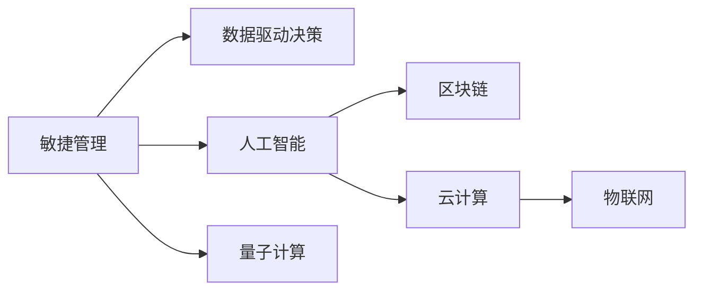

                 

## 1. 背景介绍

在当今快速变化的商业环境中，管理者面临着前所未有的挑战。技术的进步、市场的竞争、消费者的需求不断变化，使得企业必须迅速适应和调整策略。本文旨在探讨管理者在应对这些变化时所应采取的策略和方法，结合技术角度的思考，提供一套全面的应对框架。

## 2. 核心概念与联系

### 2.1 核心概念概述

在快速变化的商业环境中，管理者需要掌握以下核心概念：

- **敏捷管理(Agile Management)**：敏捷管理是一种灵活的项目管理方法，强调快速响应变化，通过迭代开发和持续反馈来适应市场和客户需求的变化。

- **数据驱动决策(Data-Driven Decision Making)**：数据驱动决策是指利用数据和分析工具来指导决策，减少主观判断，提高决策的准确性和科学性。

- **人工智能(Artificial Intelligence, AI)**：AI技术包括机器学习、深度学习、自然语言处理等，通过自动化和智能化提升业务效率和决策能力。

- **区块链(Blockchain)**：区块链技术提供了一种去中心化的数据管理和交易方式，增强了企业的透明度和安全性。

- **云计算(Cloud Computing)**：云计算通过提供弹性的计算资源和存储服务，支持企业灵活部署应用和扩展业务。

- **物联网(IoT)**：物联网连接了各种设备和传感器，实时收集数据，支持智能决策和业务创新。

- **量子计算(Quantum Computing)**：量子计算利用量子叠加和纠缠等特性，在处理大规模数据和复杂计算任务时具有显著优势。

这些概念之间的关系可以通过以下Mermaid流程图来展示：



这个流程图展示了敏捷管理、数据驱动、AI、区块链、云计算、物联网和量子计算之间的联系。敏捷管理为数据驱动提供了框架，而数据驱动为AI提供了数据基础。AI和区块链进一步增强了数据驱动决策的能力，云计算提供了弹性资源支持，物联网增强了实时数据收集，量子计算提供了未来计算能力的前景。

## 3. 核心算法原理 & 具体操作步骤

### 3.1 算法原理概述

管理者在快速变化的商业环境中，应采用数据驱动和敏捷管理的方法，结合AI技术，实时分析和优化业务流程。以下是从技术角度对这一过程的概述：

1. **数据采集与处理**：利用物联网设备实时收集数据，通过云计算平台存储和处理。

2. **数据驱动分析**：使用机器学习算法对收集到的数据进行分析，识别市场和客户行为模式，预测未来趋势。

3. **敏捷决策与迭代**：根据数据分析结果，利用敏捷管理方法进行快速迭代开发和决策调整。

4. **AI辅助优化**：应用AI技术自动化业务流程，提高效率，优化决策过程。

5. **区块链安全与透明**：利用区块链技术保证数据的真实性和安全性，增强业务透明度。

### 3.2 算法步骤详解

管理者在应对快速变化的商业环境时，可以按照以下步骤操作：

**Step 1: 数据采集与清洗**
- 部署物联网设备，实时收集业务相关数据。
- 使用云计算平台存储和管理数据。
- 对数据进行清洗，去除噪声和异常值，保证数据质量。

**Step 2: 数据分析与模型训练**
- 使用机器学习算法（如分类、回归、聚类等）对数据进行分析。
- 建立预测模型，利用历史数据进行训练，并验证模型的准确性。
- 根据模型结果，调整业务策略和流程。

**Step 3: 敏捷开发与迭代**
- 采用敏捷方法，如Scrum或Kanban，进行快速迭代开发。
- 在每个迭代周期结束时，评估业务效果，进行优化调整。
- 使用持续集成(CI)和持续部署(CD)工具，自动化部署和更新。

**Step 4: AI辅助与优化**
- 引入AI技术，如自然语言处理(NLP)、计算机视觉(CV)、推荐系统等，辅助业务决策。
- 利用AI自动化重复性任务，提高效率。
- 使用强化学习(Reinforcement Learning)优化业务流程，提升决策效果。

**Step 5: 区块链安全与透明**
- 利用区块链技术，记录业务交易和数据操作，确保数据透明和安全。
- 采用智能合约(Smart Contracts)自动执行业务规则，减少人为干预。

### 3.3 算法优缺点

敏捷管理、数据驱动决策和AI技术的结合，具有以下优点：

1. **快速响应变化**：敏捷方法允许快速迭代，快速适应市场和客户需求的变化。
2. **数据驱动决策**：利用数据分析和预测模型，减少主观判断，提高决策的准确性和科学性。
3. **自动化和智能化**：AI技术自动化业务流程，提高效率，优化决策过程。

同时，也存在一些缺点：

1. **成本高**：初期需要大量资金投资于技术基础设施和人力资源。
2. **技术复杂**：引入新技术和管理方法，需要较高的技术门槛。
3. **文化变革**：需要组织内部的文化变革，以适应新的管理方式。

### 3.4 算法应用领域

敏捷管理、数据驱动决策和AI技术在多个领域都有广泛应用，例如：

- **金融行业**：实时监控市场动态，利用AI进行风险评估和投资决策。
- **零售行业**：分析消费者行为，个性化推荐商品，优化供应链管理。
- **制造业**：通过物联网设备监控生产流程，利用AI优化生产计划和质量控制。
- **医疗行业**：实时监控患者健康数据，利用AI进行疾病预测和个性化治疗。
- **能源行业**：监控能源消耗，利用AI进行需求预测和优化能源利用。

## 4. 数学模型和公式 & 详细讲解

### 4.1 数学模型构建

在快速变化的商业环境中，管理者需要构建数学模型来预测市场和客户行为。以下是一个简单的预测模型：

设市场数据为 $x_t = (x_{1t}, x_{2t}, ..., x_{nt})$，其中 $x_{it}$ 为第 $i$ 个特征在时刻 $t$ 的值。

设市场目标变量为 $y_t$，如销售额、客户满意度等。

预测模型可表示为：

$$
y_t = f(x_t; \theta)
$$

其中 $f$ 为预测函数，$\theta$ 为模型参数。

### 4.2 公式推导过程

以线性回归模型为例，其数学模型为：

$$
y_t = \beta_0 + \beta_1 x_{1t} + \beta_2 x_{2t} + ... + \beta_n x_{nt} + \epsilon_t
$$

其中 $\epsilon_t$ 为误差项，假设其服从正态分布 $\epsilon_t \sim \mathcal{N}(0, \sigma^2)$。

利用最小二乘法求解模型参数：

$$
\hat{\beta} = \arg\min_{\beta} \sum_{t=1}^T (y_t - f(x_t; \beta))^2
$$

即最小化残差平方和（Residual Sum of Squares, RSS）：

$$
RSS = \sum_{t=1}^T (y_t - f(x_t; \beta))^2
$$

求解得到：

$$
\hat{\beta} = (X^TX)^{-1}X^Ty
$$

其中 $X$ 为特征矩阵，$y$ 为目标变量向量。

### 4.3 案例分析与讲解

假设某零售企业想要预测下一季度的销售额。利用历史销售数据，建立线性回归模型：

设销售额为 $y_t$，特征包括销售额、促销活动、季节性因素等。

模型可表示为：

$$
y_t = \beta_0 + \beta_1 x_{1t} + \beta_2 x_{2t} + \beta_3 x_{3t} + \epsilon_t
$$

通过最小二乘法求解模型参数，得到预测模型：

$$
\hat{y_t} = \hat{\beta_0} + \hat{\beta_1} x_{1t} + \hat{\beta_2} x_{2t} + \hat{\beta_3} x_{3t}
$$

利用该模型，可以实时预测销售额，并调整促销策略和库存管理。

## 5. 项目实践：代码实例和详细解释说明

### 5.1 开发环境搭建

以下是在Python中使用Pandas和Scikit-learn库构建线性回归模型的步骤：

1. 安装依赖库：

```
pip install pandas scikit-learn
```

2. 导入库：

```python
import pandas as pd
import numpy as np
from sklearn.linear_model import LinearRegression
from sklearn.model_selection import train_test_split
```

3. 准备数据：

```python
data = pd.read_csv('sales_data.csv')
X = data[['promotion', 'seasonality']]  # 特征
y = data['sales']  # 目标变量
```

### 5.2 源代码详细实现

线性回归模型的代码实现如下：

```python
# 分割数据集
X_train, X_test, y_train, y_test = train_test_split(X, y, test_size=0.2, random_state=42)

# 构建线性回归模型
model = LinearRegression()

# 训练模型
model.fit(X_train, y_train)

# 预测测试集
y_pred = model.predict(X_test)

# 评估模型
from sklearn.metrics import mean_squared_error
mse = mean_squared_error(y_test, y_pred)
print(f"Mean Squared Error: {mse}")
```

### 5.3 代码解读与分析

1. **数据准备**：使用Pandas库读取销售数据，并分离出特征和目标变量。

2. **模型训练**：使用train_test_split函数将数据集分割为训练集和测试集，然后利用LinearRegression模型进行训练。

3. **模型预测**：使用训练好的模型对测试集进行预测，得到预测结果。

4. **模型评估**：使用均方误差（Mean Squared Error, MSE）评估模型预测效果。

### 5.4 运行结果展示

运行上述代码，得到均方误差（MSE）值，表示模型预测的准确性。

## 6. 实际应用场景

### 6.1 金融行业

在金融行业中，利用数据驱动决策和AI技术可以实时监控市场动态，优化投资组合。

**场景**：一家投资公司想要优化其投资组合，以最大化收益并降低风险。

**方法**：

1. **数据采集**：使用API获取市场数据，包括股票价格、市场指数、宏观经济指标等。
2. **数据分析**：利用机器学习算法，分析历史数据，识别市场趋势和风险因素。
3. **模型训练**：建立预测模型，利用历史数据进行训练，并验证模型的准确性。
4. **敏捷决策**：根据模型结果，实时调整投资组合，优化收益和风险。

### 6.2 零售行业

在零售行业中，利用数据驱动决策和AI技术可以个性化推荐商品，优化库存管理。

**场景**：一家电商公司想要提高客户满意度和销售额。

**方法**：

1. **数据采集**：使用物联网设备收集客户购买行为数据，如浏览记录、购买历史、评分反馈等。
2. **数据分析**：利用机器学习算法，分析客户行为，识别购买偏好和需求。
3. **模型训练**：建立推荐模型，利用历史数据进行训练，并验证模型的准确性。
4. **敏捷决策**：根据模型结果，实时推荐商品，优化库存管理和促销策略。

### 6.3 医疗行业

在医疗行业中，利用数据驱动决策和AI技术可以优化诊疗方案，提升医疗服务质量。

**场景**：一家医院想要提高诊断准确率和患者满意度。

**方法**：

1. **数据采集**：收集患者病历、影像数据、实验室检查结果等。
2. **数据分析**：利用机器学习算法，分析患者数据，识别疾病模式和风险因素。
3. **模型训练**：建立预测模型，利用历史数据进行训练，并验证模型的准确性。
4. **敏捷决策**：根据模型结果，优化诊疗方案，提高诊断准确率和患者满意度。

## 7. 工具和资源推荐

### 7.1 学习资源推荐

1. **《数据科学导论》(Introduction to Data Science)**：由Jake VanderPlas所著，全面介绍了数据科学的基本概念和方法。

2. **《Python数据科学手册》(Python Data Science Handbook)**：由Jake VanderPlas所著，详细介绍了使用Python进行数据科学实践的方法和工具。

3. **《深度学习》(Deep Learning)**：由Ian Goodfellow、Yoshua Bengio和Aaron Courville所著，全面介绍了深度学习的基本原理和应用。

4. **Kaggle平台**：提供丰富的数据集和竞赛平台，帮助开发者实践数据科学和机器学习项目。

5. **Coursera平台**：提供多种数据科学和机器学习课程，帮助开发者系统学习相关知识。

### 7.2 开发工具推荐

1. **Jupyter Notebook**：提供交互式环境，方便开发者进行数据科学和机器学习项目的开发和分享。

2. **PyCharm**：提供强大的代码编辑器和调试工具，支持Python开发和数据分析。

3. **GitHub**：提供代码托管和协作平台，方便开发者版本控制和团队协作。

4. **TensorBoard**：提供可视化工具，帮助开发者实时监控模型训练和评估效果。

### 7.3 相关论文推荐

1. **《深度学习》(Deep Learning)**：Ian Goodfellow等著，全面介绍了深度学习的基本原理和应用。

2. **《机器学习实战》(Machine Learning in Action)**：Peter Harrington所著，详细介绍了机器学习算法和实现方法。

3. **《数据挖掘导论》(Introduction to Data Mining)**：Jian Li等著，全面介绍了数据挖掘的基本概念和方法。

4. **《统计学习方法》(Statistical Learning Methods)**：李航所著，详细介绍了统计学习的基本原理和应用。

## 8. 总结：未来发展趋势与挑战

### 8.1 总结

本文探讨了管理者在快速变化的商业环境中应如何采用数据驱动和敏捷管理的方法，结合AI技术，实时分析和优化业务流程。通过对多个实际应用场景的分析，展示了数据驱动和敏捷管理在多个行业中的广泛应用。

### 8.2 未来发展趋势

未来，数据驱动和敏捷管理将在更多行业得到应用，为传统行业带来变革性影响。

1. **数据质量提升**：随着数据采集和处理技术的进步，数据质量将不断提高，数据驱动决策的准确性将进一步提升。
2. **AI技术普及**：AI技术将更加普及，企业可以利用AI自动化业务流程，提高效率和优化决策。
3. **跨领域融合**：数据驱动和敏捷管理将与其他技术如区块链、云计算、物联网等进行更深层次的融合，形成更加全面和智能的决策支持系统。
4. **伦理和安全**：数据驱动和敏捷管理在带来便捷的同时，也需要关注伦理和隐私问题，确保数据使用的合规性和安全性。
5. **持续学习**：企业将更加注重持续学习，保持技术领先和创新能力，适应快速变化的市场环境。

### 8.3 面临的挑战

尽管数据驱动和敏捷管理具有显著优势，但在实际应用中仍面临一些挑战：

1. **技术复杂性**：数据驱动和敏捷管理需要较高的技术门槛，对组织内部的技术能力和资源提出了较高要求。
2. **数据隐私和安全**：大规模数据采集和处理可能涉及隐私和安全问题，需要采取有效的措施保障数据安全。
3. **文化变革**：引入新的管理方法和技术，需要组织内部的文化变革，以适应新的工作方式。
4. **成本高昂**：初期技术基础设施的建设和人力资源的投入较高，需要企业具备足够的资金支持。

### 8.4 研究展望

未来，数据驱动和敏捷管理将不断发展和演进，在更多领域发挥重要作用：

1. **自动化和智能化**：AI技术将进一步自动化和智能化业务流程，提高效率和决策质量。
2. **跨领域应用**：数据驱动和敏捷管理将与其他领域的技术和工具进行更深层次的融合，形成更加全面和智能的决策支持系统。
3. **伦理和社会责任**：数据驱动和敏捷管理将更多地关注伦理和社会责任，确保数据使用的合规性和安全性，保护用户隐私。
4. **持续学习**：企业将更加注重持续学习和创新，保持技术领先和适应快速变化的市场环境。

## 9. 附录：常见问题与解答

**Q1: 数据驱动和敏捷管理有哪些优缺点？**

A: 数据驱动和敏捷管理的优点包括：

1. **快速响应变化**：敏捷方法允许快速迭代，快速适应市场和客户需求的变化。
2. **数据驱动决策**：利用数据分析和预测模型，减少主观判断，提高决策的准确性和科学性。
3. **自动化和智能化**：AI技术自动化业务流程，提高效率，优化决策过程。

缺点包括：

1. **成本高**：初期需要大量资金投资于技术基础设施和人力资源。
2. **技术复杂**：引入新技术和管理方法，需要较高的技术门槛。
3. **文化变革**：需要组织内部的文化变革，以适应新的管理方式。

**Q2: 如何选择合适的数据驱动和敏捷管理工具？**

A: 选择合适的工具需要考虑以下几个因素：

1. **技术成熟度**：选择技术成熟度较高的工具，降低使用难度和风险。
2. **适用性**：选择适合自身业务需求的工具，避免过度复杂化。
3. **易用性**：选择易用性较高的工具，降低学习成本和操作难度。
4. **可扩展性**：选择具有良好扩展性的工具，支持未来业务发展。

**Q3: 如何在数据驱动和敏捷管理中保障数据隐私和安全？**

A: 在数据驱动和敏捷管理中，保障数据隐私和安全需要采取以下措施：

1. **数据加密**：对数据进行加密处理，防止数据泄露和篡改。
2. **访问控制**：设置严格的访问权限，控制数据访问和使用范围。
3. **审计和监控**：记录和监控数据访问和使用情况，及时发现和应对异常。
4. **合规性审查**：确保数据使用符合相关法律法规和行业标准。

**Q4: 如何实现数据驱动和敏捷管理的高效部署？**

A: 实现数据驱动和敏捷管理的高效部署需要以下步骤：

1. **选择合适的工具和平台**：选择适合自己业务需求的工具和平台，如数据管理平台、敏捷开发平台等。
2. **数据采集和处理**：使用数据采集和处理工具，自动化数据采集、清洗和存储。
3. **模型训练和优化**：利用机器学习算法，建立预测模型，并进行持续优化。
4. **敏捷开发和迭代**：采用敏捷方法，进行快速迭代开发和持续反馈优化。

**Q5: 数据驱动和敏捷管理在不同行业中的应用有哪些？**

A: 数据驱动和敏捷管理在多个行业中都有广泛应用，例如：

1. **金融行业**：实时监控市场动态，利用AI进行风险评估和投资决策。
2. **零售行业**：分析消费者行为，个性化推荐商品，优化供应链管理。
3. **医疗行业**：实时监控患者健康数据，利用AI进行疾病预测和个性化治疗。
4. **制造业**：监控生产流程，利用AI优化生产计划和质量控制。
5. **能源行业**：监控能源消耗，利用AI进行需求预测和优化能源利用。

**Q6: 如何应对数据驱动和敏捷管理中的技术挑战？**

A: 应对数据驱动和敏捷管理中的技术挑战需要以下策略：

1. **技术培训**：提高组织内部技术能力和素质，适应新技术和管理方法。
2. **外部合作**：与技术供应商和咨询公司合作，借助外部资源和经验。
3. **持续优化**：通过持续学习和改进，不断提高技术水平和管理能力。

作者：禅与计算机程序设计艺术 / Zen and the Art of Computer Programming

