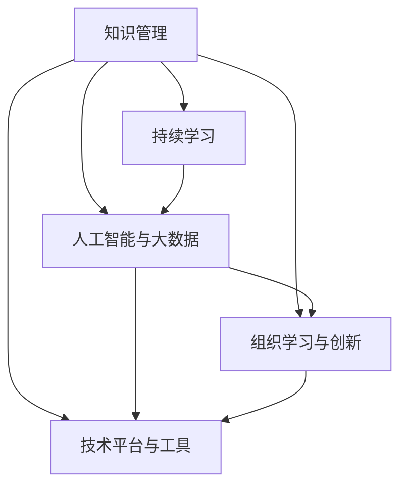

                 

# 管理者如何应对知识快速迭代

在信息爆炸的21世纪，知识更新速度迅猛，行业领导者和企业决策者必须不断学习、适应并掌握新知识，以保持竞争优势。本文将探讨知识快速迭代背景下，管理者应如何有效应对，结合技术手段，确保组织持续发展。

## 1. 背景介绍

### 1.1 问题由来

随着科技的不断进步，知识更新速度日益加快，这对管理者的学习能力提出了更高的要求。在高度动态变化的市场环境中，领导者必须快速学习和适应新的技术、市场趋势和消费者行为，以确保企业始终保持竞争力。

### 1.2 问题核心关键点

管理者在应对知识快速迭代时，面临的核心问题包括：

- **学习速度与效果**：如何快速获取新知识并将其应用于实践？
- **知识管理**：如何有效组织、存储和共享知识资源？
- **决策支持**：如何利用数据和人工智能工具进行辅助决策？
- **团队协作**：如何提升团队的学习能力和知识共享能力？
- **创新驱动**：如何通过持续学习和创新保持企业活力？

## 2. 核心概念与联系

### 2.1 核心概念概述

为更好地理解如何应对知识快速迭代，本节将介绍几个密切相关的核心概念：

- **知识管理**：指的是组织内部知识的收集、存储、分享、使用和更新过程。有效的知识管理可以帮助组织更好地利用内部资源，提升工作效率和创新能力。
- **持续学习**：指个人和组织不断追求新知识、技能和经验的积累和学习过程。持续学习是适应知识快速迭代的关键。
- **人工智能与大数据**：利用AI和大数据技术，可以高效地处理大量数据，提取有用信息，辅助管理者进行决策。
- **组织学习与创新**：组织通过持续学习和知识共享，形成创新文化，推动新技术的应用和创新成果的落地。
- **技术平台与工具**：提供知识管理和学习支持的技术平台和工具，如知识管理系统、在线学习平台等。

这些概念之间的逻辑关系可以通过以下Mermaid流程图来展示：



这个流程图展示了一些关键概念之间的相互关系：

1. 知识管理为持续学习和组织创新提供基础。
2. 人工智能与大数据可以辅助持续学习，促进知识挖掘和应用。
3. 技术平台和工具为知识管理、持续学习和组织创新提供支持。
4. 持续学习驱动组织创新，推动新技术应用。

## 3. 核心算法原理 & 具体操作步骤
### 3.1 算法原理概述

管理者的知识快速迭代，本质上是知识获取和应用的过程。本文将从知识管理的角度出发，讨论如何通过技术手段支持这一过程。

知识管理主要分为四个环节：

1. **知识获取**：通过自动化的文本挖掘、网页抓取等技术，从网络、内部系统和行业报告中获取知识。
2. **知识存储**：使用数据库或知识管理系统，对获取的知识进行结构化存储。
3. **知识分享**：利用社交网络和协作工具，促进知识在组织内部的分享和交流。
4. **知识应用**：将获取的知识应用到业务决策和产品创新中，驱动组织创新。

### 3.2 算法步骤详解

管理者的知识快速迭代过程，主要包括以下步骤：

**Step 1: 数据采集与预处理**

- 确定需要采集的数据源，如社交媒体、行业报告、学术文章等。
- 使用爬虫或API获取数据。
- 进行数据清洗和预处理，去除噪声和无用信息，提取关键数据点。

**Step 2: 知识存储与管理**

- 选择合适的知识管理系统(KMS)，如Confluence、SharePoint等。
- 将清洗后的数据存储到知识库中，并进行分类和标注。
- 使用元数据和搜索功能，提高知识检索的效率和准确性。

**Step 3: 知识分享与协作**

- 利用内部社交网络工具（如Slack、Microsoft Teams），创建知识共享群组。
- 定期发布知识更新，鼓励员工参与讨论和反馈。
- 使用协作平台（如Google Docs、JIRA），协同编辑文档和项目计划。

**Step 4: 知识应用与创新**

- 使用商业智能(BI)工具，如Tableau、Power BI，提取知识库中的数据，生成业务报表和可视化。
- 将知识应用到决策支持系统（DSS）中，辅助管理层进行决策。
- 建立创新实验室，利用知识推动新产品开发和流程改进。

### 3.3 算法优缺点

基于知识管理的快速迭代方法具有以下优点：

1. **高效获取知识**：自动化数据采集和处理工具可以大大提高知识获取速度和质量。
2. **结构化存储**：通过KMS和元数据管理，知识更易于检索和重用。
3. **促进协作**：利用社交网络和协作工具，促进知识的共享和交流。
4. **决策支持**：结合商业智能和大数据，提供数据驱动的决策支持。
5. **推动创新**：知识应用到产品开发和流程改进中，推动组织创新。

但该方法也存在以下局限性：

1. **数据隐私和安全**：自动数据采集可能涉及敏感信息，需要严格的数据保护措施。
2. **质量控制**：自动化工具在数据清洗和标注过程中可能引入错误。
3. **团队参与度**：依赖员工的积极参与和协作，否则效果会大打折扣。
4. **技术成本**：知识管理系统的部署和维护需要一定的技术投入。

## 4. 数学模型和公式 & 详细讲解
### 4.1 数学模型构建

知识管理的核心目标是提高知识获取、存储、分享和应用的效果。这里我们使用数学模型来描述这一过程。

设知识管理的目标函数为：

$$
\min \sum_{i=1}^{n} f_i(x_i) \quad \text{subject to} \quad g_i(x_i) \leq 0, i = 1, \ldots, m
$$

其中，$f_i(x_i)$ 表示第 $i$ 项知识管理指标的损失函数，$g_i(x_i)$ 表示第 $i$ 项约束条件。常见指标包括知识获取量、存储质量、分享频率和应用效果。

### 4.2 公式推导过程

以知识获取指标为例，假设获取的知识量与数据采集效率和数据质量有关。使用回归模型表示这一关系：

$$
y = f(x) + \epsilon
$$

其中，$y$ 为知识获取量，$x$ 为采集效率和数据质量，$f(x)$ 为模型函数，$\epsilon$ 为误差项。

根据最小二乘法，最优解为：

$$
\hat{x} = (X^T X)^{-1} X^T y
$$

其中，$X$ 为模型特征矩阵，$\hat{x}$ 为最优参数向量。

### 4.3 案例分析与讲解

以一家科技公司为例，使用上述模型进行知识管理：

- 数据采集：从LinkedIn、GitHub等平台抓取员工的技能和项目数据。
- 特征设计：提取技能更新频率、项目贡献度等指标作为特征。
- 模型训练：使用线性回归模型，预测员工的整体知识获取情况。
- 应用优化：根据模型结果，制定员工培训计划，提升团队整体知识水平。

## 5. 项目实践：代码实例和详细解释说明
### 5.1 开发环境搭建

在进行知识管理实践前，我们需要准备好开发环境。以下是使用Python进行Scrapy框架开发的Python环境配置流程：

1. 安装Anaconda：从官网下载并安装Anaconda，用于创建独立的Python环境。

2. 创建并激活虚拟环境：
```bash
conda create -n scraper python=3.8 
conda activate scraper
```

3. 安装Scrapy：根据CUDA版本，从官网获取对应的安装命令。例如：
```bash
conda install scrapy==2.6.0
```

4. 安装Xpath解析器和爬虫中间件：
```bash
pip install scrapy-xpath extractor-rich-tables
```

完成上述步骤后，即可在`scraper`环境中开始知识管理实践。

### 5.2 源代码详细实现

以下是使用Scrapy框架进行数据采集的Python代码实现：

```python
import scrapy

class LinkedInScraper(scrapy.Spider):
    name = 'linkedin_scraper'
    start_urls = ['https://www.linkedin.com/in/']

    def parse(self, response):
        for item in response.css('div.f3'):
            yield {
                'name': item.css('a::text').get(),
                'skills': item.css('div.f4::text').getall(),
                'projects': item.css('div.f5::text').getall(),
            }
```

然后，定义知识管理系统的数据处理函数：

```python
from scipy import stats
import pandas as pd

def analyze_data(data):
    # 数据预处理
    data = pd.DataFrame(data)
    data = data.dropna().reset_index(drop=True)

    # 特征工程
    data['skills'] = data['skills'].apply(lambda x: x.split())
    data['project_count'] = data['projects'].apply(lambda x: len(x))

    # 统计分析
    skills_count = data['skills'].apply(lambda x: len(set(x)))
    project_count_mean = data['project_count'].mean()
    project_count_median = data['project_count'].median()

    # 回归模型
    X = data[['skills_count', 'project_count']]
    y = data['project_count']
    model = stats.linregress(X, y)
    slope, intercept, r_value, p_value, std_err = model

    # 结果可视化
    data['predicted_project_count'] = slope * X + intercept
    data['error'] = abs(data['project_count'] - data['predicted_project_count'])
    return data
```

最后，启动数据采集流程并在知识库中存储结果：

```python
spider = LinkedInScraper()
result = spider.parse(response)
data = analyze_data(result)

# 存储数据到知识库
with open('data.csv', 'w') as f:
    f.write(data.to_csv(index=False))
```

以上就是使用Scrapy框架进行知识管理的完整代码实现。可以看到，Scrapy框架结合Python数据处理工具，可以快速高效地进行数据采集和预处理。

### 5.3 代码解读与分析

让我们再详细解读一下关键代码的实现细节：

**LinkedInScraper类**：
- `__init__`方法：初始化爬虫的基本信息，包括名称和起始URL。
- `parse`方法：对响应数据进行解析，提取需要的字段信息，形成数据字典。

**analyze_data函数**：
- 数据预处理：去重、去除空值、重置索引。
- 特征工程：将技能和项目列表转换为集合，统计项目数量。
- 统计分析：计算技能数量、项目数量的均值和中位数。
- 回归模型：使用线性回归模型拟合数据，计算斜率和截距。
- 结果可视化：计算预测值和误差，保存到数据框中。

**数据采集流程**：
- 创建Scrapy爬虫实例，并指定起始URL。
- 调用爬虫的`parse`方法进行数据采集。
- 将采集到的数据传入`analyze_data`函数进行预处理和分析。
- 将分析结果保存到CSV文件中，形成知识库。

可以看到，利用Python和Scrapy框架，管理者的知识获取和管理过程变得高效便捷，大大提升了知识获取和应用的效果。

## 6. 实际应用场景
### 6.1 企业内部知识库建设

知识库是企业知识管理的核心，通过建立企业内部知识库，可以有效地组织、存储和共享知识资源，提升企业整体的知识水平和创新能力。

企业内部知识库的构建主要包括以下几个环节：

- **知识分类和标注**：将知识按照主题进行分类，使用标准化的元数据进行标注。
- **知识检索和查询**：利用搜索算法，提升知识检索的效率和准确性。
- **知识版本控制**：使用版本控制系统，管理知识更新和版本变更。
- **知识共享和协作**：利用社交网络和协作工具，促进知识的共享和交流。

企业内部的知识库建设，可以帮助管理者快速获取和应用新知识，提升组织的学习能力和创新能力。

### 6.2 跨部门知识共享平台

跨部门的知识共享平台，可以打破信息孤岛，促进不同部门之间的知识交流和协作，提升企业的整体知识管理水平。

平台建设主要包括以下几个环节：

- **数据集成**：将各部门的知识管理系统集成到统一的平台上。
- **知识地图和推荐**：利用知识图谱技术，生成知识地图，推荐相关知识。
- **实时更新和通知**：使用实时更新和通知机制，及时更新知识库，并在知识变更时通知相关人员。
- **权限控制和安全**：设置权限控制机制，确保知识的安全和隐私。

通过跨部门的知识共享平台，企业可以打破部门壁垒，促进知识的流动和共享，提升组织的整体创新能力。

### 6.3 创新实验室

创新实验室是企业推动技术创新和产品开发的孵化器，通过知识管理工具，支持创新实验室的知识获取和应用，加速新产品的开发和落地。

创新实验室的知识管理主要包括以下几个环节：

- **知识库和文档管理**：存储和管理实验室的各类文档和资料。
- **需求分析与设计**：使用需求分析工具，获取用户需求，设计产品原型。
- **原型测试与验证**：利用测试工具，对原型进行测试和验证。
- **项目管理与协作**：使用项目管理工具，跟踪项目进展，促进团队协作。

通过创新实验室的知识管理，企业可以快速获取和应用新知识，加速新技术的应用和产品开发，推动企业的技术创新和产品创新。

## 7. 工具和资源推荐
### 7.1 学习资源推荐

为了帮助管理者系统掌握知识快速迭代的方法，这里推荐一些优质的学习资源：

1. **《知识管理的艺术与科学》**：这本书全面介绍了知识管理的理论基础和实践方法，适合管理者系统学习。
2. **Coursera《知识管理与创新》课程**：由密歇根大学开设的在线课程，涵盖知识管理的基本概念和实践方法。
3. **LinkedIn Learning《数据分析与可视化》课程**：利用数据和可视化工具，提升管理者的数据分析能力。
4. **Minitab《统计分析与数据可视化》课程**：使用Minitab工具，进行数据分析和可视化，提升管理者的数据处理能力。
5. **Kaggle《数据科学与机器学习》课程**：利用Kaggle平台，进行数据科学和机器学习实践，提升管理者的技术能力。

通过对这些资源的学习实践，管理者可以系统掌握知识管理的理论基础和实践技巧，更好地应对知识快速迭代。

### 7.2 开发工具推荐

高效的开发离不开优秀的工具支持。以下是几款用于知识管理的常用工具：

1. **Confluence**：Atlassian开发的知识管理系统，支持文档管理和团队协作，是企业知识管理的首选工具。
2. **SharePoint**：Microsoft开发的知识管理系统，支持文档管理和协作工具，适用于企业内部知识共享。
3. **Miro**：在线协作工具，支持团队协作和知识共享，适合跨部门知识共享平台建设。
4. **Slack**：即时通讯工具，支持消息分组和协作，适合知识共享和团队沟通。
5. **JIRA**：项目管理工具，支持任务跟踪和协作，适合创新实验室项目管理。
6. **Tableau**：商业智能工具，支持数据可视化，适合数据驱动决策支持。

合理利用这些工具，可以显著提升知识管理的效率和效果，更好地应对知识快速迭代。

### 7.3 相关论文推荐

知识快速迭代技术的发展源于学界的持续研究。以下是几篇奠基性的相关论文，推荐阅读：

1. **Knowledge Management: A Concept Whose Time Has Come and Gone?**：探讨知识管理的未来发展趋势，提出新的知识管理范式。
2. **A Comparative Analysis of Knowledge Management Systems**：对不同的知识管理系统的优缺点进行比较分析，提出选择系统的建议。
3. **Social Knowledge Management in Organizations**：探讨社交网络在知识管理中的应用，提出新的知识管理策略。
4. **The Role of Knowledge Management in Innovative Organizations**：研究知识管理对组织创新的影响，提出新的知识管理方法。
5. **A Survey on Knowledge Management Systems**：对知识管理系统的最新研究成果进行综述，提出未来研究的方向。

这些论文代表了大规模知识管理技术的发展脉络。通过学习这些前沿成果，管理者可以更好地把握知识快速迭代的最新趋势，推动企业知识管理水平的提升。

## 8. 总结：未来发展趋势与挑战
### 8.1 总结

本文对知识快速迭代背景下，管理者应如何有效应对进行了全面系统的介绍。首先阐述了知识快速迭代对管理者的挑战，明确了持续学习和知识管理的关键作用。其次，从技术手段的角度出发，详细讲解了知识获取、存储、分享和应用的全过程，给出了完整的代码实例和分析解读。同时，本文还探讨了知识管理的未来发展趋势和面临的挑战，提出了相应的解决策略。

通过本文的系统梳理，可以看到，知识快速迭代背景下，管理者需要不断学习和应用新技术，以保持组织的持续创新和发展。未来，随着知识管理工具和技术的不断进步，管理者将能够更好地应对知识快速迭代的挑战，推动企业实现更高的发展目标。

### 8.2 未来发展趋势

展望未来，知识管理技术将呈现以下几个发展趋势：

1. **自动化和智能化**：利用人工智能和机器学习技术，自动化知识管理过程，提升知识获取和应用的效果。
2. **跨平台和跨部门**：利用云平台和微服务架构，实现知识管理系统的跨平台和跨部门集成。
3. **个性化和精准化**：利用推荐算法和用户画像，提供个性化的知识推荐和精准化的知识服务。
4. **数据驱动和可视化**：利用数据驱动的方法，进行知识管理过程的可视化和监控，提升管理决策的科学性。
5. **持续学习和适应**：利用自适应学习算法，实时更新知识库，应对不断变化的知识需求和环境。

这些趋势凸显了知识管理技术的不断演进，为管理者的知识快速迭代提供了新的工具和方法。

### 8.3 面临的挑战

尽管知识管理技术已经取得了显著进展，但在迈向更加智能化和自动化的过程中，仍面临诸多挑战：

1. **数据隐私和安全**：知识管理的自动化过程中，可能涉及敏感数据，需要严格的数据保护措施。
2. **技术复杂度**：复杂的技术架构和工具链，需要专业的技术支持和管理。
3. **人员参与度**：知识管理的成功依赖于员工的积极参与和协作，否则效果会大打折扣。
4. **知识质量控制**：自动化工具在数据清洗和标注过程中可能引入错误，需要进行严格的质量控制。
5. **系统集成和互操作性**：不同系统的集成和互操作性，需要统一的规范和标准。

这些挑战需要管理者在实施知识管理时，充分考虑技术、人员和管理等多方面的因素，寻找最优解决方案。

### 8.4 研究展望

面对知识管理技术面临的挑战，未来的研究需要在以下几个方面寻求新的突破：

1. **自动化知识管理技术**：开发更加智能和自动化的知识管理工具，降低管理者的技术门槛，提升管理效率。
2. **跨平台和跨部门集成**：研究知识管理系统的跨平台和跨部门集成技术，提升系统的互操作性和灵活性。
3. **个性化知识推荐**：研究个性化知识推荐算法，提供更加精准和个性化的知识服务。
4. **数据隐私和安全保护**：研究数据隐私和安全保护技术，确保知识管理系统的安全性和可靠性。
5. **知识管理系统的统一标准**：制定知识管理系统的统一标准和规范，提升系统的互操作性和兼容性。

这些研究方向的探索，将推动知识管理技术不断进步，为管理者的知识快速迭代提供更加智能和高效的支持。

## 9. 附录：常见问题与解答

**Q1：如何选择合适的知识管理系统？**

A: 选择合适的知识管理系统需要考虑以下几个方面：
- **功能需求**：根据企业知识管理的实际需求，选择功能完善的系统。
- **用户体验**：选择用户界面友好、操作简便的系统。
- **可扩展性**：选择具有良好可扩展性和灵活性的系统。
- **数据安全**：选择具有完善数据安全和隐私保护功能的系统。
- **成本效益**：综合考虑系统的价格、维护和部署成本，选择性价比高的系统。

**Q2：知识管理系统中如何实现数据隐私和安全？**

A: 知识管理系统中，数据隐私和安全保护主要通过以下措施实现：
- **访问控制**：设置用户权限，确保只有授权用户可以访问敏感数据。
- **数据加密**：对存储和传输的数据进行加密，确保数据安全。
- **审计和监控**：记录用户操作日志，实时监控数据访问和使用情况，及时发现异常。
- **数据备份**：定期备份数据，防止数据丢失和损坏。
- **合规性**：确保系统符合相关法律法规和行业标准，如GDPR、ISO 27001等。

**Q3：如何提升团队的知识共享和协作能力？**

A: 提升团队的知识共享和协作能力主要通过以下措施实现：
- **知识共享平台**：建立知识共享平台，促进团队成员之间的知识交流和分享。
- **定期培训和交流**：定期组织培训和交流活动，提升团队成员的知识水平。
- **团队协作工具**：使用协作工具，如Slack、Microsoft Teams，促进团队协作。
- **知识地图和知识库**：利用知识图谱和知识库，提升团队成员的知识检索和应用能力。
- **激励机制**：建立知识共享激励机制，鼓励团队成员积极参与知识共享和协作。

这些措施可以有效地提升团队的知识共享和协作能力，推动组织整体的创新和发展。

**Q4：知识管理系统的集成和互操作性如何实现？**

A: 知识管理系统的集成和互操作性主要通过以下措施实现：
- **统一标准和协议**：制定统一的知识管理系统标准和数据交换协议，确保系统的互操作性。
- **API接口**：利用API接口，实现不同系统之间的数据交换和集成。
- **数据迁移工具**：开发数据迁移工具，将不同系统的数据进行迁移和集成。
- **数据同步工具**：开发数据同步工具，确保不同系统之间的数据同步和更新。
- **集成平台**：利用集成平台，将不同系统的功能和服务集成到统一的平台上。

这些措施可以有效地提升知识管理系统的集成和互操作性，确保系统的稳定性和可靠性。

**Q5：知识管理系统的持续学习和适应如何实现？**

A: 知识管理系统的持续学习和适应主要通过以下措施实现：
- **自适应学习算法**：利用自适应学习算法，实时更新知识库，应对不断变化的知识需求和环境。
- **用户画像和推荐系统**：利用用户画像和推荐系统，提供个性化的知识推荐和精准化的知识服务。
- **实时监控和反馈机制**：建立实时监控和反馈机制，及时发现知识库的更新和变更，进行及时的调整和优化。
- **持续改进和优化**：定期评估知识管理系统的性能和效果，进行持续改进和优化，提升系统的稳定性和可靠性。

这些措施可以有效地提升知识管理系统的持续学习和适应能力，确保系统始终保持最新的状态和最佳的性能。

