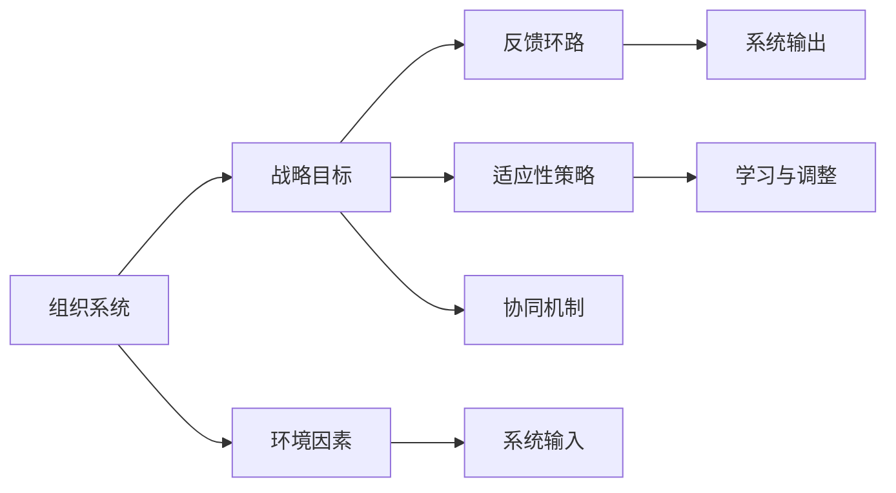

                 

## 1. 背景介绍

### 1.1 问题由来
在21世纪的今天，组织变革已经成为企业管理中的一个重要议题。全球化、数字化、智能化等诸多因素的共同作用，使得传统组织结构、管理模式、运营流程等面临前所未有的挑战。如何通过系统思考的方式，帮助组织实现战略转型、提升竞争力，成为了各行业企业领导者和变革管理者的核心任务。

系统思考（Systems Thinking）是一种从整体出发，全面考虑组织内外部因素，识别关键影响变量，并优化系统结构以提升整体性能的思考方法。该方法不仅适用于企业管理，还可以在政府治理、教育、医疗等多个领域推广应用。

### 1.2 问题核心关键点
系统思考在组织变革中的应用，关键在于理解系统动力学，从整体和全局视角出发，识别关键影响因素，并设计出符合系统动态变化的管理策略。具体来说，包括以下几个关键点：

1. **整体观：** 将组织视为一个整体系统，包括内部员工、流程、系统以及外部市场、客户等环境因素。
2. **反馈环：** 识别系统内部的正反馈和负反馈环，以及系统与环境的互动关系。
3. **适应性：** 通过系统思考，预测环境变化，并设计灵活的适应性策略，以应对不确定性和变化。
4. **协同优化：** 系统思考强调内部协同与外部协同，通过优化系统内部关系，提高整体绩效。
5. **学习与调整：** 持续学习和调整策略，以不断适应新环境和新要求。

### 1.3 问题研究意义
系统思考在组织变革中的应用，旨在帮助组织以系统化、整体化的视角，实现战略转型和业务升级。具体意义包括：

1. **提高管理效率：** 通过系统思考，可以识别并优化组织流程和内部协作，提升整体运行效率。
2. **增强适应性：** 系统思考强调灵活性和适应性，帮助组织应对市场变化、技术创新等外部冲击。
3. **优化资源配置：** 通过系统思考，可以更科学合理地配置资源，避免浪费，提高投资回报率。
4. **促进创新：** 系统思考鼓励创新思维，帮助组织突破传统框架，发现新的增长点。
5. **提升领导力：** 领导者在系统思考的基础上，可以更全面地理解组织系统，制定出更具前瞻性的战略决策。

## 2. 核心概念与联系

### 2.1 核心概念概述

系统思考在组织变革中的应用，涉及多个核心概念。这些概念之间相互联系，形成了一个动态的系统结构。以下是几个关键概念及其联系的概述：

- **组织系统：** 指由人员、流程、技术、文化等组成的系统。
- **战略目标：** 组织追求的长期目标和愿景，指导系统运作。
- **环境因素：** 影响组织的外部因素，如市场、政策、竞争等。
- **反馈环路：** 系统内部和外部因素之间的正反馈和负反馈，影响组织行为和结果。
- **适应性策略：** 组织根据反馈环路和外部环境变化，采取的适应性措施。
- **协同机制：** 内部不同部门、单元之间的协同合作机制。
- **学习与调整：** 组织通过持续学习和反馈，调整策略以适应新环境。

### 2.2 核心概念原理和架构的 Mermaid 流程图



**图1. 系统思考在组织变革中的核心概念联系图**

上述图表展示了系统思考在组织变革中的核心概念及其联系。其中，组织系统根据战略目标运作，同时受到环境因素的影响，并产生反馈环路和适应性策略。协同机制和持续学习与调整过程贯穿其中，推动系统不断优化和适应新环境。

## 3. 核心算法原理 & 具体操作步骤

### 3.1 算法原理概述

系统思考在组织变革中的应用，本质上是一个基于整体系统视角的管理优化过程。其核心思想是：从整体出发，识别关键影响变量，并通过优化系统结构，提升组织整体绩效。

假设组织系统为 $S=\{S_i\}_{i=1}^n$，其中 $S_i$ 表示系统内的子系统，如部门、流程等。组织的战略目标为 $T$。环境因素 $E$ 对系统产生影响。系统通过反馈环路 $F$ 响应环境变化，并执行适应性策略 $A$。通过协同机制 $C$ 和持续学习与调整机制 $L$，系统不断优化自身结构。

组织变革的优化目标是最小化系统运行成本，同时最大化战略目标的实现程度。即：

$$
\min_{S_i,T,E,F,A,C,L} \sum_{i=1}^n C_i
$$

$$
\max_{S_i,T,E,F,A,C,L} T
$$

其中，$C_i$ 为第 $i$ 个子系统的成本。

### 3.2 算法步骤详解

基于系统思考的组织变革管理，一般包括以下几个关键步骤：

**Step 1: 系统建模**

- 收集系统数据和信息，构建系统模型。
- 识别系统的关键变量和参数，包括内部流程、人员、技术等。
- 识别系统的正反馈和负反馈环路，理解系统动态变化。

**Step 2: 制定战略目标**

- 确定组织的长期目标和愿景，如市场份额、利润增长等。
- 设计实现目标的路线图和时间表。

**Step 3: 设计适应性策略**

- 根据系统模型和战略目标，设计适应性策略。
- 考虑系统内部的协同机制，确保策略的可行性。

**Step 4: 执行策略并监控**

- 根据设计好的策略，执行变革措施。
- 定期监控系统运行情况，评估策略效果。

**Step 5: 持续学习和调整**

- 根据监控结果，不断调整和优化策略。
- 通过持续学习和反馈，进一步提升系统适应性。

### 3.3 算法优缺点

系统思考在组织变革中的应用，具有以下优点：

1. **系统化视角：** 能够从整体和全局视角出发，考虑系统的内部和外部因素，避免局部视角带来的片面性。
2. **动态适应性：** 强调系统的动态变化，帮助组织适应市场变化和技术创新等外部冲击。
3. **协同优化：** 通过内部协同和外部协同，提升组织整体的运行效率和绩效。
4. **持续学习：** 鼓励组织持续学习和改进，不断提高适应性。

同时，该方法也存在一定的局限性：

1. **复杂度高：** 需要深入理解系统模型和动态变化，对于复杂系统建模难度大。
2. **数据需求高：** 需要大量系统数据来构建和验证模型，数据获取和处理成本高。
3. **策略执行难度：** 复杂系统的适应性策略设计复杂，实施难度大。
4. **反馈时滞：** 系统内部和外部的反馈环路存在时滞，决策响应速度较慢。

### 3.4 算法应用领域

系统思考在组织变革中的应用，已经广泛应用于以下多个领域：

1. **企业管理：** 帮助企业识别内部流程和部门间的协同问题，优化资源配置，提升管理效率。
2. **政府治理：** 帮助政府机构识别关键影响因素，设计适应性政策，提高治理效率。
3. **教育改革：** 帮助教育系统识别学生、教师、学校之间的互动关系，优化教学资源配置。
4. **医疗改革：** 帮助医疗机构识别患者、医生、医院之间的互动关系，提升医疗服务质量。
5. **智能制造：** 帮助制造企业优化生产流程，提升自动化水平，提高生产效率。

## 4. 数学模型和公式 & 详细讲解 & 举例说明

### 4.1 数学模型构建

系统思考在组织变革中的应用，可以通过数学模型进行建模和优化。这里我们使用系统动力学模型(System Dynamics Modeling)来构建系统模型。

假设组织系统由 $n$ 个子系统组成，每个子系统 $S_i$ 的输出 $Y_i$ 受到自身输入 $X_i$ 和环境因素 $E_i$ 的影响，同时又反馈到自身输入 $X_i$ 和环境因素 $E_i$。系统目标是最大化 $T$，最小化总成本 $C$。

数学模型如下：

$$
Y_i = f_i(X_i,E_i)
$$

$$
X_i = g_i(Y_i,E_i)
$$

$$
E_i = h_i(X_i,Y_i)
$$

$$
T = \sum_{i=1}^n \omega_i Y_i
$$

$$
C = \sum_{i=1}^n c_i(X_i,Y_i)
$$

其中，$f_i, g_i, h_i$ 为系统函数，$\omega_i$ 为子系统权重，$c_i$ 为子系统成本函数。

### 4.2 公式推导过程

基于上述系统动力学模型，我们可以通过以下步骤进行优化：

1. **构建系统模型：** 通过系统建模，确定系统中的关键变量和参数，以及它们之间的关系。
2. **优化目标函数：** 将系统目标和总成本函数代入优化目标，得到：

$$
\min_{X_i,E_i} C = \sum_{i=1}^n c_i(X_i,Y_i)
$$

$$
\max_{X_i,E_i} T = \sum_{i=1}^n \omega_i Y_i
$$

3. **求解优化问题：** 通过求解优化问题，找到最优的 $X_i$ 和 $E_i$，使得总成本最小化，同时最大化战略目标 $T$。

### 4.3 案例分析与讲解

假设某大型制造企业，面临生产成本高、市场响应慢的问题。通过系统思考，我们构建了如下系统动力学模型：

**系统变量：**
- $S_1$：生产系统，输入为原材料 $X_1$，输出为成品 $Y_1$。
- $S_2$：市场系统，输入为成品 $Y_1$，输出为销售量 $Y_2$。
- $E_1$：原材料价格，影响 $S_1$ 的运行成本。
- $E_2$：市场需求，影响 $S_2$ 的销售量。

**系统函数：**
- $f_1(X_1,E_1) = Y_1$
- $g_1(Y_1,E_2) = X_1$
- $h_1(X_1,Y_1) = E_1$
- $h_2(Y_1,E_2) = E_2$

**优化目标：**
- 最小化总成本 $C = c_1(X_1,Y_1) + c_2(Y_1,E_2)$
- 最大化销售收入 $T = \omega_1 Y_1 + \omega_2 Y_2$

通过构建模型并进行优化，我们找到最优的 $X_1$ 和 $E_2$，使得生产成本最低，同时实现最大的销售收入。

## 5. 项目实践：代码实例和详细解释说明

### 5.1 开发环境搭建

在项目实践中，我们需要搭建Python开发环境。以下是具体的步骤：

1. **安装Python：** 下载并安装最新版本的Python，如Python 3.9.x。
2. **安装系统动力学库：** 使用pip安装系统动力学库，如psimpy或sysmod。
3. **创建虚拟环境：** 使用venv创建虚拟环境，确保项目开发与全局Python环境隔离。
4. **配置IDE：** 安装并配置Python IDE，如Jupyter Notebook或PyCharm，用于编写和调试代码。

### 5.2 源代码详细实现

以下是使用psimpy库构建和优化系统模型的Python代码实现：

```python
import psimpy as psy
from psimpy import S, T, N

# 定义系统模型
def system_model():
    S = S('S', 10) # 生产系统，初始存货10个单位
    T = T('T', 1000) # 总目标，销售收入1000
    N = N('N', 100) # 市场需求，初始100
    X1 = S.outputs[0] # 生产系统的输出
    Y1 = X1 # 成品数量
    E1 = S.inputs[0] # 原材料价格
    E2 = N.inputs[0] # 市场需求
    Y2 = E2 # 销售量
    
    # 系统函数
    f1 = psy.Func([E1, X1], Y1, 'X1 + E1') # 生产系统函数
    g1 = psy.Func([Y1, E2], X1, 'Y1 - E2') # 生产系统输入
    h1 = psy.Func([X1, Y1], E1, 'X1 - Y1') # 原材料价格函数
    h2 = psy.Func([Y1, E2], E2, 'Y1 + E2') # 市场需求函数
    
    # 优化目标
    C = psy.Cost([X1, Y1], 100 * X1 + 200 * Y1) # 生产成本
    T = psy.Objective([Y1, Y2], [1000, 500], 'Y1 + Y2') # 销售收入
    
    # 优化模型
    model = psy.Model()
    model.add_var(S, T, N, X1, Y1, E1, E2)
    model.add_eq([f1, g1, h1, h2])
    model.add_obj([C, T])
    model.optimize()
    
    return model

# 运行模型
model = system_model()
model.run()
model.plot('X1', 'E1', 'E2', 'Y1', 'Y2', 'C', 'T')
```

### 5.3 代码解读与分析

上述代码实现了对系统模型的构建和优化。具体步骤如下：

1. **定义系统变量：** 使用psimpy库定义生产系统 $S$、市场系统 $T$、市场需求 $N$、生产系统的输出 $X_1$、成品数量 $Y_1$、原材料价格 $E_1$ 和市场需求 $E_2$。
2. **定义系统函数：** 使用psimpy库定义生产系统函数 $f_1$、生产系统输入函数 $g_1$、原材料价格函数 $h_1$ 和市场需求函数 $h_2$。
3. **定义优化目标：** 使用psimpy库定义生产成本函数 $C$ 和销售收入函数 $T$。
4. **构建系统模型：** 使用psimpy库构建系统模型，并调用 `optimize` 方法进行优化。
5. **运行和可视化：** 使用psimpy库的 `run` 和 `plot` 方法，可视化系统模型的运行结果。

## 6. 实际应用场景

### 6.1 智能制造

系统思考在智能制造中的应用，主要集中在生产系统的优化和供应链管理上。通过系统建模和优化，可以实现以下目标：

1. **提高生产效率：** 识别生产流程中的瓶颈，优化资源配置，提升生产效率。
2. **降低生产成本：** 通过系统优化，降低原材料消耗和生产成本。
3. **提升市场响应速度：** 优化供应链管理，缩短生产周期，提高市场响应速度。

### 6.2 政府治理

在政府治理中，系统思考可以帮助优化政策制定和执行过程。通过系统建模，可以识别政策实施中的关键影响因素，设计适应性政策，并实时调整策略。具体应用包括：

1. **政策制定：** 通过系统思考，制定更加科学合理的政策，避免政策冲突和资源浪费。
2. **执行监督：** 通过系统监控和反馈，及时发现政策执行中的问题和偏差，并进行调整。
3. **公共服务：** 通过系统思考，提升公共服务的质量和效率，提高社会满意度。

### 6.3 教育改革

在教育改革中，系统思考可以帮助优化教学资源配置和学生学习过程。通过系统建模，可以识别教学系统中的关键变量和关系，设计协同教学策略，并持续优化教学方法。具体应用包括：

1. **教学资源优化：** 通过系统思考，优化教师、学生和学校之间的互动关系，提高教学资源利用率。
2. **学生学习支持：** 通过系统思考，设计个性化学习路径，提升学生学习效果。
3. **教学质量提升：** 通过系统思考，优化教学方法和评估机制，提升教学质量。

## 7. 工具和资源推荐

### 7.1 学习资源推荐

为了帮助开发者系统掌握系统思考的理论基础和实践技巧，这里推荐一些优质的学习资源：

1. **系统动力学基础：** 《系统动力学理论与实践》一书，介绍了系统动力学基本概念和建模方法。
2. **Simulink教程：** MATLAB自带的系统动力学模拟工具，详细教程见MATLAB官方文档。
3. **NetLogo学习资源：** NetLogo是一个基于代理的系统动力学模拟平台，大量案例和教程可供参考。
4. **System Dynamics Interactive Learning Center：** 斯坦福大学开发的交互式系统动力学学习平台，提供了大量案例和练习。
5. **《系统思考：系统动力学模型与仿真》：** 一本系统思考的入门书籍，通俗易懂，适合初学者。

### 7.2 开发工具推荐

在开发系统思考模型时，推荐使用以下工具：

1. **psimpy：** 一个Python系统动力学库，提供建模和仿真功能。
2. **Vensim：** 一个商业系统动力学软件，功能强大，支持复杂系统建模。
3. **Simulink：** MATLAB自带的系统动力学模拟工具，适合科学研究和工程应用。
4. **Stella：** 一个免费开源的系统动力学软件，支持互动式模拟和可视化。
5. **AnyLogic：** 一个企业级系统动力学仿真软件，支持复杂系统的动态仿真和优化。

### 7.3 相关论文推荐

系统思考和系统动力学在企业管理中的应用，得到了广泛的研究和应用。以下是几篇经典的系统动力学论文，推荐阅读：

1. **《系统思考：重新发现管理的系统》：** 一本系统思考的奠基之作，深入浅出地介绍了系统思考的基本原理和方法。
2. **《系统动力学：建模、仿真与优化》：** 一本系统动力学理论基础和应用案例的合集，详细介绍了系统动态建模和仿真方法。
3. **《系统动力学模型在企业管理中的应用》：** 一篇综述论文，总结了系统动力学在企业管理中的主要应用方向和研究成果。
4. **《智能制造系统动力学建模与仿真》：** 一篇介绍智能制造系统动力学建模的论文，提供了大量实际案例和仿真结果。

## 8. 总结：未来发展趋势与挑战

### 8.1 研究成果总结

本文对系统思考在组织变革中的应用进行了系统介绍，主要内容包括：

1. **系统思考的基本概念和联系：** 通过Mermaid流程图，介绍了系统思考的核心概念和联系。
2. **系统思考的算法原理和操作步骤：** 详细讲解了系统思考在组织变革中的应用步骤。
3. **系统思考的数学模型和公式：** 通过数学模型和公式推导，介绍了系统思考的优化方法。
4. **系统思考的实际应用场景：** 通过实际案例，展示了系统思考在智能制造、政府治理、教育改革等领域的广泛应用。
5. **系统思考的工具和资源推荐：** 推荐了系统思考的学习资源、开发工具和相关论文。

### 8.2 未来发展趋势

展望未来，系统思考在组织变革中的应用将呈现以下趋势：

1. **智能化与自动化：** 引入人工智能和自动化技术，提升系统优化和决策的智能化水平。
2. **数据驱动：** 利用大数据和机器学习技术，通过数据驱动的方式优化系统模型。
3. **跨领域应用：** 系统思考将被广泛应用于更多领域，如医疗、金融、能源等，推动各行业的数字化转型。
4. **复杂系统建模：** 面对更复杂、动态的系统，系统思考模型将不断优化，提升模型的适应性和鲁棒性。
5. **协同优化：** 系统思考将更多关注内部协同和外部协同，提升系统整体的运行效率和绩效。

### 8.3 面临的挑战

尽管系统思考在组织变革中的应用取得了不少进展，但仍面临以下挑战：

1. **模型复杂性：** 系统思考模型涉及大量变量和参数，建模复杂度高，易出现过度拟合等问题。
2. **数据获取难度：** 获取系统数据和信息成本高，数据质量不确定性大。
3. **决策响应速度：** 系统优化和决策响应速度较慢，难以应对快速变化的环境。
4. **模型应用难度：** 系统思考模型应用复杂，需要跨学科知识，对企业内部和外部环境有较高要求。
5. **用户接受度：** 系统思考和系统动力学方法较新，部分企业管理者和决策者对其接受度较低。

### 8.4 研究展望

面向未来，系统思考在组织变革中的应用还需要在以下几个方面进行深入研究：

1. **模型简化与优化：** 简化系统思考模型，提高模型的可解释性和应用效率。
2. **跨学科整合：** 将系统思考与其他学科知识进行整合，如人工智能、大数据等，提升系统的整体性能。
3. **实时化与动态化：** 通过实时数据流，提升系统优化的动态响应能力。
4. **普适性与适用性：** 推广系统思考在更多领域的普适性和适用性，实现广泛的应用。
5. **伦理与社会责任：** 在系统思考中引入伦理和社会责任，确保系统的可持续发展和公平性。

## 9. 附录：常见问题与解答

### Q1: 系统思考和系统动力学有何区别？

A: 系统思考是一种思考方式和视角，关注系统内部和外部的动态变化，强调整体性和关系。而系统动力学则是基于系统思考的一种数学建模和仿真技术，用于描述和优化系统的动态行为。

### Q2: 系统思考在实际应用中是否存在局限性？

A: 系统思考在应用中确实存在一些局限性，如模型复杂度高、数据获取难度大等。但通过不断优化模型、提高数据质量、引入跨学科知识等方法，这些局限性可以逐步得到缓解。

### Q3: 如何平衡系统思考的复杂性和应用效率？

A: 可以通过模型简化、数据驱动、自动化技术等方法，平衡系统思考的复杂性和应用效率。如在实际应用中，可以使用系统动力学软件，如Vensim和Stella，提高模型的可操作性和可视化水平。

### Q4: 系统思考在企业管理中的应用前景如何？

A: 系统思考在企业管理中的应用前景广阔。通过优化系统结构、提升管理效率、增强适应性等，可以帮助企业应对市场变化和竞争压力，提升整体绩效。

### Q5: 系统思考是否适用于所有类型的组织变革？

A: 系统思考适用于大部分类型的组织变革，尤其是那些具有明确战略目标和内部协同关系的组织。但对于一些非结构化的组织或单一目标的组织，系统思考的适用性可能有限。

---

作者：禅与计算机程序设计艺术 / Zen and the Art of Computer Programming

