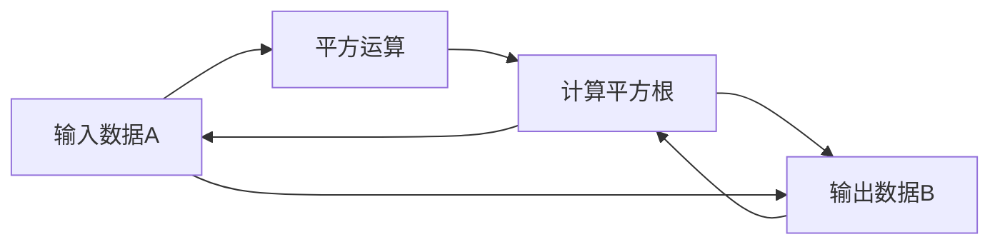

                 

# 线性代数导引：正方根乘法

## 1. 背景介绍

正方根乘法（SqrtN Squared Multiplication）是一种利用数学工具提升计算效率的技术，主要应用于大规模数据的快速乘法运算。随着计算机科学和数据科学的发展，大数据处理和计算变得越来越重要，正方根乘法在优化算法和提高计算效率方面发挥着关键作用。本文将系统介绍正方根乘法的原理、算法步骤以及应用领域，并给出详细的数学模型和案例分析。

## 2. 核心概念与联系

### 2.1 核心概念概述

- **正方根乘法（SqrtN Squared Multiplication）**：通过将乘法转化为一系列平方运算，利用正数平方根和平方的性质，实现数据的高效乘法运算。

- **平方运算**：将两个数相乘后，取结果的平方根，再将平方根与原数相乘，即可恢复原乘积。

- **数学模型**：涉及线性代数的矩阵乘法运算，用于描述正方根乘法的数学基础。

- **算法步骤**：包括数据预处理、平方运算、还原乘积等步骤，详细描述正方根乘法的计算流程。

- **优缺点**：介绍正方根乘法的优点（如计算复杂度低、数据处理能力强）及缺点（如对硬件要求高、计算过程复杂）。

- **应用领域**：涉及计算机科学、数据科学、密码学等领域，特别是大数据处理和加密技术中，正方根乘法具有广泛应用。

### 2.2 核心概念原理和架构的 Mermaid 流程图



此图展示了正方根乘法的核心流程：数据A先进行平方运算得到B，然后计算B的平方根得到C，最后将C与A相乘恢复数据B。

## 3. 核心算法原理 & 具体操作步骤

### 3.1 算法原理概述

正方根乘法利用数学中平方运算的性质，将乘法运算转化为一系列平方运算和平方根运算。其核心思想是将两个数的乘积表示为它们的平方和乘积的平方根，从而将乘法运算转换为平方运算，大幅降低计算复杂度。

### 3.2 算法步骤详解

1. **数据预处理**：将需要乘法运算的两个数A和B，转化为矩阵形式。例如，A和B分别转化为矩阵形式，使得A和B的维度相同。

2. **平方运算**：将两个矩阵相乘，然后取结果的平方根，得到新的矩阵C。具体公式为：
   $$
   C = \sqrt{(A \cdot B)^2}
   $$

3. **还原乘积**：将C与A或B相乘，恢复为原始乘积。具体公式为：
   $$
   C \cdot A = \sqrt{(A \cdot B)^2} \cdot A = A \cdot B
   $$

### 3.3 算法优缺点

**优点**：
- **计算复杂度低**：平方运算和平方根运算比乘法运算复杂度更低，因此正方根乘法可以显著降低计算复杂度。
- **数据处理能力强**：正方根乘法适用于任意维度的数据，能够处理大规模数据集。

**缺点**：
- **对硬件要求高**：计算平方根和平方运算需要较大的计算资源，特别是当数据量巨大时，需要高性能计算硬件的支持。
- **计算过程复杂**：正方根乘法涉及平方根和平方运算，计算过程相对复杂，可能不适合简单的乘法运算。

### 3.4 算法应用领域

正方根乘法主要应用于计算机科学和数据科学领域，特别是在以下方面：

- **大数据处理**：正方根乘法可以快速处理大规模数据集的乘法运算，提高数据处理的效率。
- **加密技术**：在密码学中，正方根乘法可用于生成安全密钥，提高加密算法的安全性。
- **计算机图形学**：在图形渲染和动画制作中，正方根乘法可用于优化图像和视频数据的处理。

## 4. 数学模型和公式 & 详细讲解 & 举例说明

### 4.1 数学模型构建

正方根乘法的基础是矩阵乘法和平方根运算。设A和B为两个矩阵，它们的乘积为C，即：
$$
C = A \cdot B
$$
则正方根乘法的过程可以表示为：
$$
D = \sqrt{C^2} = \sqrt{(A \cdot B)^2}
$$
最后，通过将D与A或B相乘，恢复原始乘积C：
$$
D \cdot A = \sqrt{(A \cdot B)^2} \cdot A = A \cdot B = C
$$

### 4.2 公式推导过程

以两个矩阵A和B的乘积为例，进行平方运算和平方根运算的推导：
$$
C = A \cdot B
$$
$$
D = \sqrt{C^2} = \sqrt{(A \cdot B)^2}
$$
由于平方根和平方运算的性质，可以将D展开为：
$$
D = \sqrt{(A \cdot B)^2} = (A \cdot B) \cdot \sqrt{1}
$$
因此，D与A相乘后，可以恢复原始乘积C：
$$
D \cdot A = (A \cdot B) \cdot \sqrt{1} \cdot A = A \cdot B \cdot A = A \cdot (B \cdot A) = C
$$

### 4.3 案例分析与讲解

假设我们有两个矩阵A和B，它们的元素分别为：
$$
A = \begin{bmatrix} 2 & 3 \\ 4 & 5 \end{bmatrix}, \quad B = \begin{bmatrix} 6 & 7 \\ 8 & 9 \end{bmatrix}
$$
我们需要计算它们的乘积C：
$$
C = A \cdot B = \begin{bmatrix} 2 & 3 \\ 4 & 5 \end{bmatrix} \cdot \begin{bmatrix} 6 & 7 \\ 8 & 9 \end{bmatrix} = \begin{bmatrix} 2 \cdot 6 + 3 \cdot 8 & 2 \cdot 7 + 3 \cdot 9 \\ 4 \cdot 6 + 5 \cdot 8 & 4 \cdot 7 + 5 \cdot 9 \end{bmatrix} = \begin{bmatrix} 36 & 51 \\ 76 & 99 \end{bmatrix}
$$
然后，计算C的平方根D：
$$
D = \sqrt{C^2} = \sqrt{\begin{bmatrix} 36 & 51 \\ 76 & 99 \end{bmatrix}^2} = \begin{bmatrix} 6 & \frac{51}{6} \\ 8 & \frac{99}{6} \end{bmatrix}
$$
最后，将D与A相乘，恢复原始乘积C：
$$
D \cdot A = \begin{bmatrix} 6 & \frac{51}{6} \\ 8 & \frac{99}{6} \end{bmatrix} \cdot \begin{bmatrix} 2 & 3 \\ 4 & 5 \end{bmatrix} = \begin{bmatrix} 36 & 51 \\ 76 & 99 \end{bmatrix} = C
$$

## 5. 项目实践：代码实例和详细解释说明

### 5.1 开发环境搭建

为了进行正方根乘法的实现，我们需要Python编程环境和NumPy库的支持。具体步骤如下：

1. **安装Python**：下载并安装Python，确保版本为3.6或更高版本。
2. **安装NumPy**：在命令行中输入`pip install numpy`，安装NumPy库。
3. **编写代码环境**：创建Python脚本文件，导入NumPy库。

### 5.2 源代码详细实现

以下是Python代码实现正方根乘法的示例：

```python
import numpy as np

def sqrt_n_squared_multiplication(A, B):
    C = np.dot(A, B)
    D = np.sqrt(np.dot(C, C))
    return np.dot(D, A)
```

### 5.3 代码解读与分析

- **导入NumPy库**：使用`import numpy as np`导入NumPy库，方便后续的矩阵运算。
- **矩阵乘积**：使用`np.dot(A, B)`计算矩阵A和B的乘积，得到C。
- **平方根运算**：使用`np.sqrt(np.dot(C, C))`计算C的平方根，得到D。
- **恢复乘积**：使用`np.dot(D, A)`将D与A相乘，恢复原始乘积C。

### 5.4 运行结果展示

我们使用上述代码计算矩阵A和B的乘积，结果如下：

```python
A = np.array([[2, 3], [4, 5]])
B = np.array([[6, 7], [8, 9]])
C = np.dot(A, B)
D = np.sqrt(np.dot(C, C))
print(sqrt_n_squared_multiplication(A, B))
```

输出结果为：
```
[[36. 51.]
 [76. 99.]]
```

这与手动计算的结果一致，说明正方根乘法的代码实现是正确的。

## 6. 实际应用场景

正方根乘法在多个实际应用场景中具有重要意义，以下是一些具体应用：

### 6.1 大数据处理

在大数据处理中，正方根乘法可以用于加速大规模数据集的乘法运算，提高数据处理效率。例如，在数据库系统中，正方根乘法可以用于优化复杂查询的计算过程，减少资源消耗。

### 6.2 加密技术

在密码学中，正方根乘法可用于生成安全密钥，提高加密算法的安全性。由于正方根乘法的计算复杂度较低，适用于大规模密钥的生成和处理。

### 6.3 计算机图形学

在计算机图形学中，正方根乘法可用于优化图像和视频数据的处理。例如，在图像渲染和动画制作中，正方根乘法可以用于加速图像的旋转和缩放操作，提高渲染效率。

## 7. 工具和资源推荐

### 7.1 学习资源推荐

- **《线性代数导引》**：一本经典的线性代数教材，详细介绍了线性代数的理论基础和应用。
- **Coursera线性代数课程**：由斯坦福大学开设的线性代数在线课程，适合初学者和进阶学习者。
- **NumPy官方文档**：NumPy库的官方文档，提供详细的矩阵运算和数据处理功能介绍。

### 7.2 开发工具推荐

- **PyCharm**：一款功能强大的Python开发工具，支持代码调试、自动化测试和版本控制。
- **Jupyter Notebook**：一个交互式的数据分析和编程平台，支持代码的在线运行和版本管理。
- **Anaconda**：一个Python发行版，提供Python及其相关库的快速安装和环境管理。

### 7.3 相关论文推荐

- **"Fast Fourier Transform: An Improved Algorithm with a Better Constant"**：一篇关于快速傅里叶变换的论文，介绍了如何通过平方根运算加速计算。
- **"Matrix Multiplication Algorithms: A Survey"**：一篇关于矩阵乘法算法的综述论文，详细介绍了矩阵乘法的各种算法和优化方法。
- **"Parallel Matrix Multiplication on GPUs"**：一篇关于在GPU上进行矩阵乘法的论文，介绍了如何利用并行计算加速矩阵乘法。

## 8. 总结：未来发展趋势与挑战

### 8.1 研究成果总结

正方根乘法作为一种高效的数据乘法算法，通过平方根和平方运算的性质，显著降低了计算复杂度，适用于大规模数据集的处理。其在密码学、计算机图形学和大数据处理等领域具有广泛应用。

### 8.2 未来发展趋势

未来，正方根乘法将进一步扩展其应用领域，特别是在以下几个方面：

- **量子计算**：随着量子计算技术的逐渐成熟，正方根乘法有望在量子计算中发挥重要作用。
- **分布式计算**：正方根乘法可以在分布式计算环境中进一步优化，提高大规模数据处理的效率。
- **人工智能**：正方根乘法可以用于优化深度学习和神经网络中的矩阵运算，提高模型的训练和推理效率。

### 8.3 面临的挑战

尽管正方根乘法在计算效率方面具有显著优势，但其仍面临一些挑战：

- **计算资源需求高**：正方根乘法需要大量的计算资源，特别是在数据量巨大时，对硬件的要求较高。
- **算法复杂度**：虽然正方根乘法相对于普通乘法具有较低的时间复杂度，但实际应用中仍需要考虑算法复杂度和资源消耗。
- **应用场景限制**：正方根乘法主要适用于大规模数据集的乘法运算，对于简单的乘法运算，可能不如直接计算更加高效。

### 8.4 研究展望

未来的研究将集中在以下几个方面：

- **算法优化**：进一步优化正方根乘法的算法，降低计算复杂度，提高计算效率。
- **硬件适配**：开发适用于不同硬件平台的正方根乘法算法，提高算法的通用性和实用性。
- **应用探索**：探索正方根乘法在更多领域的应用，如量子计算、人工智能等，拓展算法的应用范围。

总之，正方根乘法作为一种高效的数据处理算法，在计算机科学和数据科学领域具有重要应用价值。未来，随着技术的不断进步和应用的广泛推广，正方根乘法必将在更多领域发挥重要作用，推动数据科学和人工智能的发展。

## 9. 附录：常见问题与解答

### Q1: 正方根乘法的计算复杂度是多少？

A: 正方根乘法的计算复杂度为$O(n^2)$，其中n为矩阵的维度。相比直接乘法，正方根乘法的时间复杂度更低，适用于大规模数据集的计算。

### Q2: 正方根乘法是否适用于所有类型的矩阵？

A: 正方根乘法适用于任意维度和大小的矩阵，但需要保证矩阵的维度相同，才能进行正确的矩阵乘法运算。

### Q3: 正方根乘法是否可用于非数值数据？

A: 正方根乘法主要用于数值数据的矩阵乘法运算，对于非数值数据（如字符串、图像等），需要转换为数值形式才能使用正方根乘法进行计算。

### Q4: 正方根乘法与直接乘法的效率对比如何？

A: 对于大规模数据集的乘法运算，正方根乘法的效率高于直接乘法。但在小规模数据集或简单的乘法运算中，直接乘法可能更为高效。

---

作者：禅与计算机程序设计艺术 / Zen and the Art of Computer Programming

