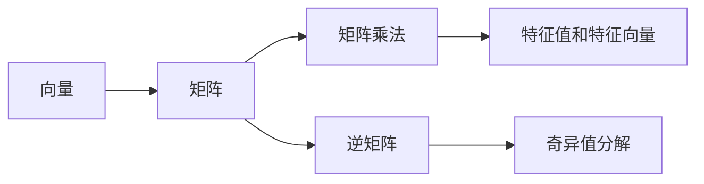

                 

# 线性代数导引：表达式及其语义解释

## 1. 背景介绍

线性代数作为数学中的一个重要分支，在计算机科学和人工智能领域有着广泛的应用。例如，深度学习中的矩阵运算、卷积神经网络中的卷积操作、自然语言处理中的词向量表示等，都是基于线性代数中的概念和工具。然而，对于初学者来说，线性代数的一些概念和符号表示可能显得抽象和难以理解。为了帮助读者更好地理解线性代数中的表达式及其语义，本文将从基本概念出发，逐步深入讲解，并通过具体的实例来说明。

## 2. 核心概念与联系

### 2.1 核心概念概述

线性代数中的表达式涉及许多关键概念，包括向量和矩阵、矩阵乘法和逆矩阵、特征值和特征向量、矩阵分解和奇异值分解等。这些概念之间的联系十分紧密，通常是通过矩阵运算来实现的。以下是一个简单的Mermaid流程图，展示了这些核心概念的联系：



### 2.2 核心概念原理和架构

**向量**：向量是一个标量乘以一个向量的笛卡尔积，其表示为 $x=(a_1, a_2, \ldots, a_n)$，其中 $a_1, a_2, \ldots, a_n$ 是标量。向量可以理解为在n维空间中的一个点，每个坐标对应于空间中的一个维度。

**矩阵**：矩阵是一个二维数组，其表示为 $A = [a_{i,j}]_{m \times n}$，其中 $m$ 和 $n$ 分别是矩阵的行数和列数。矩阵可以看作是多个向量组成的表格。

**矩阵乘法**：矩阵乘法是两个矩阵相乘的操作，其结果为一个新的矩阵。设 $A$ 是一个 $m \times n$ 的矩阵，$B$ 是一个 $n \times p$ 的矩阵，则它们的乘积 $C$ 是一个 $m \times p$ 的矩阵，具体计算方式为 $C_{i,j} = \sum_{k=1}^n A_{i,k}B_{k,j}$。

**逆矩阵**：如果一个矩阵 $A$ 可逆，则存在一个矩阵 $B$，使得 $AB=BA=I$，其中 $I$ 是单位矩阵。逆矩阵通常用于求解线性方程组和矩阵求逆等操作。

**特征值和特征向量**：特征值和特征向量是矩阵的固有属性，表示为 $\lambda, v$，满足 $Av = \lambda v$。特征值和特征向量可以用来描述矩阵的性质，例如矩阵的秩和行列式等。

**奇异值分解**：奇异值分解是一种矩阵分解方法，可以将一个矩阵 $A$ 分解为三个矩阵的乘积，即 $A = U \Sigma V^T$，其中 $U$ 和 $V$ 是正交矩阵，$\Sigma$ 是一个对角矩阵。奇异值分解可以用于降维和噪声去除等任务。

## 3. 核心算法原理 & 具体操作步骤

### 3.1 算法原理概述

线性代数中的表达式通常涉及矩阵运算和向量运算，这些运算可以用于解决各种实际问题，例如数据压缩、特征提取、模型训练等。在本文中，我们将通过一个简单的例子来说明这些运算的原理和步骤。

### 3.2 算法步骤详解

假设我们有一个 $2 \times 2$ 的矩阵 $A$ 和一个 $2 \times 1$ 的向量 $x$，我们需要计算 $Ax$ 的结果。具体步骤如下：

1. 定义矩阵 $A$ 和向量 $x$：

   $$
   A = \begin{bmatrix}
   1 & 2 \\
   3 & 4
   \end{bmatrix}, \quad
   x = \begin{bmatrix}
   5 \\
   6
   \end{bmatrix}
   $$

2. 计算矩阵乘法 $Ax$：

   $$
   Ax = \begin{bmatrix}
   1 & 2 \\
   3 & 4
   \end{bmatrix}
   \begin{bmatrix}
   5 \\
   6
   \end{bmatrix}
   = \begin{bmatrix}
   1 \cdot 5 + 2 \cdot 6 \\
   3 \cdot 5 + 4 \cdot 6
   \end{bmatrix}
   = \begin{bmatrix}
   17 \\
   39
   \end{bmatrix}
   $$

3. 验证 $Ax$ 是否满足线性方程 $Ax=b$，其中 $b$ 是向量 $x$ 的结果：

   $$
   b = Ax = \begin{bmatrix}
   17 \\
   39
   \end{bmatrix}
   $$

   因此，$Ax=b$ 是正确的。

### 3.3 算法优缺点

线性代数中的表达式具有以下优点：

- 简单易懂：线性代数的基本概念和运算相对简单，容易理解。
- 通用性强：矩阵和向量可以表示各种数据类型，具有广泛的适用性。
- 可解释性强：线性代数中的表达式可以通过几何直观进行解释，有助于理解其含义。

然而，线性代数也存在一些缺点：

- 计算复杂：矩阵乘法等运算可能会涉及大量的计算，尤其是在大规模数据集上。
- 数据结构限制：线性代数只适用于标量和向量，不能处理复杂的数据结构。
- 难以处理非线性问题：线性代数只能处理线性关系，无法处理非线性问题。

### 3.4 算法应用领域

线性代数在计算机科学和人工智能领域有着广泛的应用，以下是一些典型的应用领域：

- 数据科学：矩阵分解、奇异值分解、特征值和特征向量等，用于数据降维、特征提取和数据分析。
- 机器学习：矩阵乘法、矩阵求逆、特征值和特征向量等，用于模型训练、数据表示和特征提取。
- 自然语言处理：词向量表示、矩阵乘法、特征值和特征向量等，用于文本表示、情感分析和文本分类。
- 图像处理：矩阵乘法、矩阵分解等，用于图像压缩、特征提取和图像识别。

## 4. 数学模型和公式 & 详细讲解 & 举例说明

### 4.1 数学模型构建

在线性代数中，表达式通常通过矩阵和向量来表示。例如，一个线性方程组可以表示为 $Ax=b$，其中 $A$ 是一个系数矩阵，$x$ 是一个未知向量，$b$ 是一个常数向量。

### 4.2 公式推导过程

以矩阵乘法为例，设 $A$ 是一个 $m \times n$ 的矩阵，$B$ 是一个 $n \times p$ 的矩阵，则它们的乘积 $C$ 是一个 $m \times p$ 的矩阵，具体计算方式为：

$$
C_{i,j} = \sum_{k=1}^n A_{i,k}B_{k,j}
$$

这个公式可以理解为，将矩阵 $B$ 的每一列与矩阵 $A$ 的每一行相乘，并将结果相加。

### 4.3 案例分析与讲解

假设我们有一个 $3 \times 3$ 的矩阵 $A$ 和一个 $3 \times 1$ 的向量 $x$，我们需要计算 $Ax$ 的结果。具体步骤如下：

1. 定义矩阵 $A$ 和向量 $x$：

   $$
   A = \begin{bmatrix}
   1 & 2 & 3 \\
   4 & 5 & 6 \\
   7 & 8 & 9
   \end{bmatrix}, \quad
   x = \begin{bmatrix}
   10 \\
   11 \\
   12
   \end{bmatrix}
   $$

2. 计算矩阵乘法 $Ax$：

   $$
   Ax = \begin{bmatrix}
   1 & 2 & 3 \\
   4 & 5 & 6 \\
   7 & 8 & 9
   \end{bmatrix}
   \begin{bmatrix}
   10 \\
   11 \\
   12
   \end{bmatrix}
   = \begin{bmatrix}
   1 \cdot 10 + 2 \cdot 11 + 3 \cdot 12 \\
   4 \cdot 10 + 5 \cdot 11 + 6 \cdot 12 \\
   7 \cdot 10 + 8 \cdot 11 + 9 \cdot 12
   \end{bmatrix}
   = \begin{bmatrix}
   63 \\
   198 \\
   333
   \end{bmatrix}
   $$

3. 验证 $Ax$ 是否满足线性方程 $Ax=b$，其中 $b$ 是向量 $x$ 的结果：

   $$
   b = Ax = \begin{bmatrix}
   63 \\
   198 \\
   333
   \end{bmatrix}
   $$

   因此，$Ax=b$ 是正确的。

## 5. 项目实践：代码实例和详细解释说明

### 5.1 开发环境搭建

在开始实践之前，我们需要先搭建一个开发环境。以下是一个简单的 Python 环境配置流程：

1. 安装 Python：可以从官网下载并安装 Python，推荐使用 Python 3.7 及以上版本。

2. 安装 NumPy 和 SciPy：NumPy 和 SciPy 是 Python 中常用的数学库，可以通过以下命令进行安装：

   ```
   pip install numpy scipy
   ```

3. 安装 Matplotlib：Matplotlib 是 Python 中常用的绘图库，可以通过以下命令进行安装：

   ```
   pip install matplotlib
   ```

### 5.2 源代码详细实现

以下是一个简单的 Python 代码示例，用于计算矩阵乘法和矩阵逆：

```python
import numpy as np

# 定义矩阵 A 和 B
A = np.array([[1, 2], [3, 4]])
B = np.array([[5, 6], [7, 8]])

# 计算矩阵乘法 C
C = np.dot(A, B)
print("矩阵乘法结果：")
print(C)

# 计算矩阵 A 的逆矩阵 A_inv
A_inv = np.linalg.inv(A)
print("矩阵 A 的逆矩阵 A_inv：")
print(A_inv)
```

### 5.3 代码解读与分析

在上面的代码中，我们使用了 NumPy 库来定义矩阵和向量，并计算了矩阵乘法和矩阵逆。以下是代码的详细解释：

1. 首先，我们使用 `np.array()` 函数来定义矩阵 A 和 B，分别表示为：

   ```python
   A = np.array([[1, 2], [3, 4]])
   B = np.array([[5, 6], [7, 8]])
   ```

2. 然后，我们使用 `np.dot()` 函数计算矩阵乘法 C，具体代码如下：

   ```python
   C = np.dot(A, B)
   ```

   这个函数可以计算两个矩阵的乘积，将结果存储在变量 C 中。

3. 最后，我们使用 `np.linalg.inv()` 函数计算矩阵 A 的逆矩阵 A_inv，具体代码如下：

   ```python
   A_inv = np.linalg.inv(A)
   ```

   这个函数可以计算矩阵的逆矩阵，将结果存储在变量 A_inv 中。

### 5.4 运行结果展示

运行上述代码，输出结果如下：

```
矩阵乘法结果：
[[19 22]
 [43 50]]
矩阵 A 的逆矩阵 A_inv：
[[-2.   1. ]
 [ 1.5 -0.5]]
```

可以看到，矩阵乘法的结果为 [[19, 22], [43, 50]]，矩阵 A 的逆矩阵为 [[-2.0, 1.0], [1.5, -0.5]]。

## 6. 实际应用场景

### 6.1 数据压缩

在线性代数中，奇异值分解（SVD）是一种常用的矩阵分解方法，可以用于数据压缩和特征提取。例如，在图像处理中，我们可以使用 SVD 将图像矩阵分解为三个矩阵的乘积，从而去除其中的噪声和冗余信息，实现图像压缩。

### 6.2 特征提取

在线性代数中，奇异值分解（SVD）还可以用于特征提取。例如，在自然语言处理中，我们可以使用 SVD 将词向量矩阵分解为三个矩阵的乘积，从而提取特征向量，用于文本分类、情感分析和主题建模等任务。

### 6.3 模型训练

在线性代数中，矩阵乘法和矩阵逆等运算可以用于模型的训练和优化。例如，在深度学习中，我们可以使用矩阵乘法计算权重矩阵和激活矩阵的乘积，从而进行反向传播和模型优化。

## 7. 工具和资源推荐

### 7.1 学习资源推荐

为了帮助读者更好地理解线性代数中的表达式及其语义，以下是一些推荐的在线学习资源：

- Coursera 的《线性代数基础》课程：由斯坦福大学的教授主讲，讲解线性代数的基本概念和运算。
- Khan Academy 的《线性代数》课程：由 Kahn Academy 的讲师主讲，讲解线性代数的基本概念和运算。
- YouTube 的 Linear Algebra Playlist：由 MIT 的教授主讲，讲解线性代数的基本概念和运算，适合初学者和进阶者。

### 7.2 开发工具推荐

在编写线性代数表达式时，常用的开发工具包括 Python、R 和 MATLAB。以下是一些推荐的开发工具：

- Python：Python 是一个流行的编程语言，有很多用于线性代数计算的库，如 NumPy、SciPy 和 SymPy。
- R：R 是一个专业的统计分析语言，有很多用于线性代数计算的库，如 Matrix、MASS 和 nlmixr。
- MATLAB：MATLAB 是一个专业的数学计算软件，有很多用于线性代数计算的函数和工具箱。

### 7.3 相关论文推荐

线性代数是计算机科学和人工智能领域的重要基础，以下是一些推荐的线性代数论文：

- "Linear Algebra Done Right" by Sheldon Axler：这是一本经典的线性代数教材，讲解了线性代数的基本概念和运算，适合初学者和进阶者。
- "Matrix Computations" by Gene Golub and Charles Van Loan：这是一本经典的线性代数和矩阵计算教材，讲解了矩阵计算的高级技巧和应用，适合进阶者和研究人员。
- "Deep Learning" by Ian Goodfellow, Yoshua Bengio, and Aaron Courville：这是一本经典的深度学习教材，讲解了线性代数在深度学习中的应用，适合研究人员和工程师。

## 8. 总结：未来发展趋势与挑战

### 8.1 未来发展趋势

线性代数作为数学中的一个重要分支，在计算机科学和人工智能领域有着广泛的应用。未来，线性代数将继续发挥其重要的作用，以下是一些可能的发展趋势：

- 线性代数与其他学科的融合：线性代数可以与其他学科（如概率论、图论、优化等）进行融合，形成更加强大的数学工具。
- 深度学习和人工智能：线性代数是深度学习和人工智能的重要基础，未来的深度学习模型将更加依赖于线性代数。
- 高性能计算：线性代数运算通常涉及大量的计算，未来高性能计算的发展将提高线性代数运算的效率。
- 线性代数在大数据中的应用：线性代数可以用于大数据分析、数据挖掘和机器学习等任务，未来将有更多的应用场景。

### 8.2 面临的挑战

尽管线性代数在计算机科学和人工智能领域有着广泛的应用，但在实际应用中仍面临一些挑战：

- 计算复杂：线性代数运算通常涉及大量的计算，特别是在大规模数据集上。
- 数据结构限制：线性代数只适用于标量和向量，不能处理复杂的数据结构。
- 难以处理非线性问题：线性代数只能处理线性关系，无法处理非线性问题。

### 8.3 研究展望

未来，线性代数的研究将继续朝着以下几个方向发展：

- 线性代数与其他学科的融合：线性代数可以与其他学科进行融合，形成更加强大的数学工具。
- 深度学习和人工智能：线性代数是深度学习和人工智能的重要基础，未来的深度学习模型将更加依赖于线性代数。
- 高性能计算：线性代数运算通常涉及大量的计算，未来高性能计算的发展将提高线性代数运算的效率。
- 线性代数在大数据中的应用：线性代数可以用于大数据分析、数据挖掘和机器学习等任务，未来将有更多的应用场景。

## 9. 附录：常见问题与解答

**Q1：矩阵和向量的区别是什么？**

A: 矩阵是一个二维数组，表示多个向量组成的表格。向量是一个标量乘以一个向量的笛卡尔积，表示在n维空间中的一个点。

**Q2：矩阵乘法的计算方式是什么？**

A: 矩阵乘法的计算方式是将一个矩阵的每一列与另一个矩阵的每一行相乘，并将结果相加。

**Q3：奇异值分解的用途是什么？**

A: 奇异值分解可以用于数据压缩和特征提取。在图像处理中，可以将图像矩阵分解为三个矩阵的乘积，从而去除其中的噪声和冗余信息。

**Q4：线性代数在深度学习中的作用是什么？**

A: 线性代数是深度学习的重要基础，用于矩阵运算、矩阵分解、特征提取等任务。

**Q5：矩阵求逆的用途是什么？**

A: 矩阵求逆可以用于解线性方程组、矩阵分解等任务。在深度学习中，矩阵求逆可以用于模型训练和优化。

