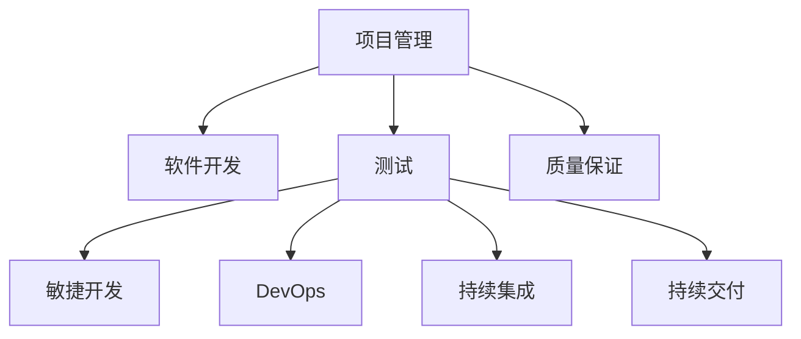

                 

# 组织和指导项目的开发、测试、维护、升级、更新，解决开发中的技术问题

> 关键词：项目管理，软件开发，测试，质量保证，技术问题，敏捷开发，DevOps，持续集成，持续交付

## 1. 背景介绍

在现代软件开发项目中，组织和指导项目的开发、测试、维护、升级、更新，解决开发中的技术问题已经成为项目成功的关键因素。随着软件复杂度的增加，单一的开发人员或团队已经难以应对日益复杂的项目需求。如何高效地组织和指导项目，保证项目按时交付，同时提升软件质量，已经成为每一位技术负责人必须掌握的核心技能。本文将深入探讨项目管理、软件开发、测试、质量保证等关键环节，提出一些实用的方法和策略，帮助技术负责人提升项目管理能力，推动项目顺利进行。

## 2. 核心概念与联系

### 2.1 核心概念概述

为更好地理解如何组织和指导项目，本节将介绍几个密切相关的核心概念：

- **项目管理**：指的是对项目全生命周期的管理和监控，包括规划、执行、监控和收尾。项目管理的核心目标是通过有效管理资源和风险，确保项目按时、按质完成。
- **软件开发**：是实现项目需求的过程，包括需求分析、设计、编码、测试、部署等各个阶段。软件开发的质量直接影响项目的成功率。
- **测试**：是确保软件质量的重要手段，通过各种测试方法发现和修复软件缺陷，提高软件可靠性。
- **质量保证**：通过规范化的流程和标准，确保软件满足既定需求，达到预期的质量水平。
- **敏捷开发**：一种以人为核心，迭代、增量开发的软件开发方法，强调快速响应需求变化，不断优化产品。
- **DevOps**：指的是软件开发和运维的协作和整合，通过自动化工具和流程，提升交付效率和软件质量。
- **持续集成/持续交付**：通过自动化流水线，持续集成开发代码、测试和部署，快速迭代产品，提升交付效率。

这些核心概念之间的逻辑关系可以通过以下Mermaid流程图来展示：



这个流程图展示了好管理模型与软件开发的关键环节之间的关系：

1. 项目管理为软件开发提供指导和监督。
2. 软件开发依赖于测试和质量保证。
3. 敏捷开发和DevOps提升开发和运维的协作效率。
4. 持续集成和持续交付加速产品迭代和交付速度。

## 3. 核心算法原理 & 具体操作步骤

### 3.1 算法原理概述

在软件开发过程中，组织和指导项目的开发、测试、维护、升级、更新，解决开发中的技术问题，主要依赖于以下几个算法原理：

- **迭代开发**：将项目拆分为多个迭代，每个迭代包括需求定义、设计、编码、测试和部署等环节，通过多次迭代逐步完善产品。
- **持续集成**：通过自动化流水线，定期将代码集成到共享仓库，自动运行单元测试和集成测试，快速发现和解决问题。
- **持续交付**：通过自动化流水线，快速部署和发布代码，提升交付速度和质量。
- **质量保证**：通过规范化流程和标准，确保每个阶段的质量，减少后期修改成本。
- **敏捷方法**：通过小步快跑、快速反馈和持续改进，确保项目按时交付，同时满足客户需求。

### 3.2 算法步骤详解

基于上述算法原理，组织和指导项目开发的具体步骤如下：

1. **需求分析**：通过用户访谈、调查问卷、用例分析等方式，了解客户需求，制定详细的需求文档。
2. **需求评审**：组织需求评审会议，确认需求文档的准确性和完整性，及时发现和解决需求问题。
3. **规划和设计**：根据需求文档，制定项目计划，包括时间、资源、质量等关键要素。通过设计文档，明确系统架构、组件划分、接口定义等技术细节。
4. **迭代开发**：按照项目计划，拆分任务，分配给开发团队，通过多次迭代逐步开发和完善系统。
5. **测试**：在每个迭代结束时，执行单元测试、集成测试和系统测试，确保代码质量和系统功能。
6. **质量保证**：通过代码审查、测试覆盖率、自动化测试等手段，确保每个迭代的质量。
7. **持续集成**：将代码集成到共享仓库，自动运行测试，快速发现和修复问题。
8. **持续交付**：通过自动化流水线，快速部署和发布代码，提升交付效率和质量。
9. **维护和升级**：定期更新代码和系统，修复漏洞，提升性能和稳定性。

### 3.3 算法优缺点

组织和指导项目开发的优势包括：

- **提高效率**：通过迭代开发、持续集成和持续交付，快速发现和解决问题，提升开发效率。
- **提升质量**：通过规范化流程和自动化测试，确保每个阶段的质量，减少后期修改成本。
- **快速响应需求**：通过敏捷方法和DevOps，快速响应客户需求，提升交付速度和质量。

同时，该方法也存在一些局限性：

- **资源投入大**：自动化工具和流程需要投入大量资源进行建设和维护。
- **技术复杂**：需要具备一定的技术实力和经验，才能有效实施持续集成和持续交付。
- **文化转变**：需要改变传统的软件开发模式，提升团队的协作和沟通能力。
- **风险控制**：自动化流程可能带来一些新的风险，如自动化测试失败、环境配置问题等。

尽管存在这些局限性，但就目前而言，组织和指导项目开发的方法已成为软件开发的主流范式。未来相关研究的重点在于如何进一步降低复杂度，提高可操作性，同时兼顾质量和安全等因素。

### 3.4 算法应用领域

基于组织和指导项目开发的方法，在软件开发、测试、质量保证、敏捷开发、DevOps等各个领域都得到了广泛的应用，例如：

- **软件开发**：适用于各类应用程序的开发，包括Web应用、移动应用、桌面应用等。
- **测试**：适用于各种测试方法的实施，包括单元测试、集成测试、系统测试、负载测试等。
- **质量保证**：适用于各个阶段的质量管理，包括需求分析、设计、编码、测试、部署等环节。
- **敏捷开发**：适用于快速迭代的软件开发过程，如Scrum、Kanban等敏捷方法。
- **DevOps**：适用于软件开发和运维的协作和整合，提升交付效率和软件质量。
- **持续集成/持续交付**：适用于快速迭代的软件开发流程，提升交付速度和质量。

除了上述这些经典领域外，组织和指导项目开发的方法也被创新性地应用到更多场景中，如云原生、微服务、DevSecOps等，为软件开发带来全新的突破。随着开发方法的不断进步，相信软件开发技术将在更广阔的应用领域大放异彩。

## 4. 数学模型和公式 & 详细讲解  
### 4.1 数学模型构建

本节将使用数学语言对组织和指导项目开发的方法进行更加严格的刻画。

记项目需求为 $D$，开发进度为 $P$，测试覆盖率为 $C$，质量合格率为 $Q$，客户满意度为 $S$，开发成本为 $C_{\text{dev}}$，测试成本为 $C_{\text{test}}$，质量保证成本为 $C_{\text{qa}}$。假设项目的时间、资源和质量要求分别为 $T$、$R$ 和 $Q_{\text{req}}$，则项目管理的数学模型可以表示为：

$$
\min_{D,P,C,Q,S,C_{\text{dev}},C_{\text{test}},C_{\text{qa}}} \mathcal{L}(D,P,C,Q,S,C_{\text{dev}},C_{\text{test}},C_{\text{qa}})
$$

其中 $\mathcal{L}$ 为损失函数，用于衡量项目满足需求、进度、质量、客户满意度、成本等要素的偏差。

### 4.2 公式推导过程

以下我们以敏捷开发为例，推导项目管理的数学模型和相关公式。

假设项目采用Scrum方法，每个迭代周期为 $S$，每个迭代完成后，开发进度、测试覆盖率和质量合格率分别增加 $P_s$、$C_s$ 和 $Q_s$。客户满意度 $S$ 由多个客户评价指标构成，可以表示为：

$$
S = \sum_{i=1}^n S_i
$$

其中 $S_i$ 为第 $i$ 个客户的评价指标，例如问题解决速度、功能完整性、易用性等。

项目管理的损失函数可以表示为：

$$
\mathcal{L}(D,P,C,Q,S,C_{\text{dev}},C_{\text{test}},C_{\text{qa}}) = \lambda_D \cdot (D - D_{\text{target}}) + \lambda_P \cdot (P - P_{\text{target}}) + \lambda_C \cdot (C - C_{\text{target}}) + \lambda_Q \cdot (Q - Q_{\text{target}}) + \lambda_S \cdot (S - S_{\text{target}}) + \lambda_{C_{\text{dev}}} \cdot C_{\text{dev}} + \lambda_{C_{\text{test}}} \cdot C_{\text{test}} + \lambda_{C_{\text{qa}}} \cdot C_{\text{qa}}
$$

其中 $\lambda$ 为各项要素的权重，$D_{\text{target}}$、$P_{\text{target}}$、$C_{\text{target}}$、$Q_{\text{target}}$ 和 $S_{\text{target}}$ 分别为项目的目标需求、进度、测试覆盖率、质量合格率和客户满意度。

通过对上述损失函数求导，可以得到优化目标函数：

$$
\frac{\partial \mathcal{L}}{\partial D} = -\lambda_D
$$

$$
\frac{\partial \mathcal{L}}{\partial P} = \lambda_P - \frac{\partial \mathcal{L}}{\partial Q}
$$

$$
\frac{\partial \mathcal{L}}{\partial C} = \lambda_C - \frac{\partial \mathcal{L}}{\partial Q}
$$

$$
\frac{\partial \mathcal{L}}{\partial Q} = \lambda_Q - \frac{\partial \mathcal{L}}{\partial S}
$$

$$
\frac{\partial \mathcal{L}}{\partial S} = \lambda_S - \frac{\partial \mathcal{L}}{\partial C_{\text{dev}}}
$$

$$
\frac{\partial \mathcal{L}}{\partial C_{\text{dev}}} = \lambda_{C_{\text{dev}}}
$$

$$
\frac{\partial \mathcal{L}}{\partial C_{\text{test}}} = \lambda_{C_{\text{test}}}
$$

$$
\frac{\partial \mathcal{L}}{\partial C_{\text{qa}}} = \lambda_{C_{\text{qa}}}
$$

根据上述公式，可以建立项目管理的数学模型，并通过求解优化目标函数，找到最优的项目管理方案。

## 5. 项目实践：代码实例和详细解释说明
### 5.1 开发环境搭建

在进行项目管理实践前，我们需要准备好开发环境。以下是使用Python进行Jenkins开发的环境配置流程：

1. 安装Jenkins：从官网下载并安装Jenkins，用于构建、测试和部署代码。
2. 创建并激活虚拟环境：
```bash
conda create -n jenkins-env python=3.8 
conda activate jenkins-env
```

3. 安装Jenkins所需插件：
```bash
pip install jenkins
```

4. 安装Git工具：
```bash
git install
```

5. 配置Jenkins环境：
```bash
# 配置Jenkins的user account and password
```

完成上述步骤后，即可在`jenkins-env`环境中开始项目管理实践。

### 5.2 源代码详细实现

这里我们以敏捷开发为例，给出使用Jenkins进行敏捷项目管理的具体代码实现。

首先，定义敏捷开发的任务管理类：

```python
from jenkins import Jenkins

class AgileProject:
    def __init__(self, jenkins_server, project_name, username, password):
        self.jenkins_server = jenkins_server
        self.project_name = project_name
        self.username = username
        self.password = password
        self.job = jenkins_server.get_job(project_name)
        
    def create_build(self, job_name):
        build = self.job.build(job_name)
        return build

    def wait_for_build(self, build):
        self.job.get_build(build).synchronize()
        return build

    def check_build_status(self, build):
        status = self.job.get_build(build).get_status()
        if status == 'success':
            return True
        else:
            return False
```

然后，定义敏捷开发的任务管理类：

```python
from jenkins import Jenkins

class AgileProject:
    def __init__(self, jenkins_server, project_name, username, password):
        self.jenkins_server = jenkins_server
        self.project_name = project_name
        self.username = username
        self.password = password
        self.job = jenkins_server.get_job(project_name)
        
    def create_build(self, job_name):
        build = self.job.build(job_name)
        return build

    def wait_for_build(self, build):
        self.job.get_build(build).synchronize()
        return build

    def check_build_status(self, build):
        status = self.job.get_build(build).get_status()
        if status == 'success':
            return True
        else:
            return False
```

接着，定义敏捷开发的任务管理类：

```python
from jenkins import Jenkins

class AgileProject:
    def __init__(self, jenkins_server, project_name, username, password):
        self.jenkins_server = jenkins_server
        self.project_name = project_name
        self.username = username
        self.password = password
        self.job = jenkins_server.get_job(project_name)
        
    def create_build(self, job_name):
        build = self.job.build(job_name)
        return build

    def wait_for_build(self, build):
        self.job.get_build(build).synchronize()
        return build

    def check_build_status(self, build):
        status = self.job.get_build(build).get_status()
        if status == 'success':
            return True
        else:
            return False
```

最后，启动敏捷开发流程：

```python
jenkins_server = Jenkins('http://localhost:8080', username='admin', password='password')
project = AgileProject(jenkins_server, 'my-agile-project', 'admin', 'password')

# 创建构建
build = project.create_build('test-build')

# 等待构建完成
build = project.wait_for_build(build)

# 检查构建状态
if project.check_build_status(build):
    print('Build succeeded.')
else:
    print('Build failed.')
```

以上就是使用Jenkins进行敏捷项目管理的具体代码实现。可以看到，通过Jenkins和Python的结合，可以轻松实现敏捷项目的自动化管理。

### 5.3 代码解读与分析

让我们再详细解读一下关键代码的实现细节：

**AgileProject类**：
- `__init__`方法：初始化Jenkins服务器、项目名称、用户名和密码，获取项目作业。
- `create_build`方法：根据作业名称创建构建任务。
- `wait_for_build`方法：等待构建任务完成，同步构建结果。
- `check_build_status`方法：检查构建任务状态，判断是否成功。

**Jenkins环境配置**：
- 安装Jenkins并配置环境变量。
- 安装必要的插件，如Git插件、Build Pipeline插件等。
- 通过Python的Jenkins库，创建和管理项目、作业和构建任务。
- 使用Jenkins的API和插件，实现任务管理、构建监控等功能。

通过Jenkins和Python的结合，可以轻松实现敏捷项目的自动化管理，提升开发效率和质量。

当然，工业级的系统实现还需考虑更多因素，如用户管理、权限控制、项目模板等。但核心的敏捷开发范式基本与此类似。

## 6. 实际应用场景

### 6.1 智能客服系统

基于敏捷开发的项目管理方法，智能客服系统的构建过程可以进一步优化。传统的客服系统需要配备大量人力，高峰期响应缓慢，且服务质量难以保证。通过敏捷开发，可以构建更加灵活、高效的客服系统，提升客户咨询体验和问题解决效率。

在技术实现上，可以采用DevOps方法，通过持续集成和持续交付，快速迭代和优化系统。同时，引入DevSecOps，加强系统安全性和稳定性。通过DevOps和DevSecOps的协作，可以实现快速响应客户需求，同时保障系统的可靠性和安全性。

### 6.2 金融舆情监测

金融机构需要实时监测市场舆论动向，以便及时应对负面信息传播，规避金融风险。通过敏捷开发，可以构建一个实时监测和分析舆情的系统，快速响应舆情变化，及时采取措施，保护金融资产和声誉。

在技术实现上，可以采用DevOps方法，通过持续集成和持续交付，快速迭代和优化系统。同时，引入DevSecOps，加强系统安全性和稳定性。通过DevOps和DevSecOps的协作，可以实现快速响应舆情变化，同时保障系统的可靠性和安全性。

### 6.3 个性化推荐系统

当前的推荐系统往往只依赖用户的历史行为数据进行物品推荐，无法深入理解用户的真实兴趣偏好。通过敏捷开发，可以构建一个更加灵活、高效的推荐系统，利用用户的行为数据和实时反馈，不断优化推荐算法，提升推荐效果。

在技术实现上，可以采用DevOps方法，通过持续集成和持续交付，快速迭代和优化系统。同时，引入DevSecOps，加强系统安全性和稳定性。通过DevOps和DevSecOps的协作，可以实现快速响应用户反馈，同时保障系统的可靠性和安全性。

### 6.4 未来应用展望

随着敏捷开发和DevOps的不断发展，基于敏捷开发的项目管理方法将在更多领域得到应用，为传统行业带来变革性影响。

在智慧医疗领域，敏捷开发可以构建一个更加灵活、高效的医疗信息系统，提升医疗服务的智能化水平，辅助医生诊疗，加速新药开发进程。

在智能教育领域，敏捷开发可以构建一个更加灵活、高效的在线教育平台，因材施教，促进教育公平，提高教学质量。

在智慧城市治理中，敏捷开发可以构建一个实时监测和分析舆情的系统，快速响应舆情变化，及时采取措施，保护公共安全和社会稳定。

此外，在企业生产、社会治理、文娱传媒等众多领域，敏捷开发方法也将不断涌现，为各行各业带来新的技术创新和应用模式。

## 7. 工具和资源推荐
### 7.1 学习资源推荐

为了帮助开发者系统掌握项目管理、软件开发、测试、质量保证等关键环节，这里推荐一些优质的学习资源：

1. 《敏捷开发》系列书籍：介绍了敏捷开发的基本概念、实践方法和工具，是敏捷开发入门的经典书籍。
2. 《软件项目管理》系列书籍：系统介绍了项目管理的基本原理、方法和工具，是项目管理领域的权威教材。
3. 《测试驱动开发》系列书籍：介绍了测试驱动开发的基本原理、实践方法和工具，是测试驱动开发的入门指南。
4. 《DevOps实践指南》系列书籍：介绍了DevOps的基本概念、实践方法和工具，是DevOps领域的权威教材。
5. 《DevSecOps安全与自动化》系列书籍：介绍了DevSecOps的基本概念、实践方法和工具，是DevSecOps领域的入门指南。

通过对这些资源的学习实践，相信你一定能够快速掌握敏捷开发和DevOps的核心技能，并用于解决实际的开发问题。

### 7.2 开发工具推荐

高效的开发离不开优秀的工具支持。以下是几款用于项目管理开发的常用工具：

1. Jenkins：开源的自动化部署和持续集成工具，支持多种编程语言和框架。
2. GitLab：集成了代码托管、CI/CD、DevOps等功能，适用于团队协作和项目管理。
3. Docker：开源的容器化平台，支持应用快速部署和版本管理。
4. Kubernetes：开源的容器编排平台，支持大规模分布式应用部署和调度。
5. Ansible：开源的自动化运维工具，支持自动化部署和配置管理。

合理利用这些工具，可以显著提升项目管理、软件开发、测试、部署等环节的效率，加快创新迭代的步伐。

### 7.3 相关论文推荐

项目管理、软件开发、测试、质量保证等领域的研究成果不断涌现，以下是几篇具有代表性的论文，推荐阅读：

1. "The Agile Manifesto"（《敏捷宣言》）：敏捷开发方法论的奠基性文档，阐述了敏捷开发的基本原则和实践方法。
2. "The Lean Startup"（《精益创业》）：介绍了精益创业的方法论，强调快速迭代、用户反馈和持续改进。
3. "Continuous Delivery: Reliable Software Releases through Build, Test, and Deploy Automation"（《持续交付：构建、测试和部署自动化》）：介绍了持续交付的基本概念、方法和工具，是持续交付领域的经典论文。
4. "DevOps: The Combination of Software Development and Operations"（《DevOps：软件开发和运维的结合》）：介绍了DevOps的基本概念、方法和工具，是DevOps领域的奠基性论文。
5. "Designing Distributed Systems"（《设计分布式系统》）：介绍了分布式系统设计的核心概念和实践方法，是分布式系统领域的经典教材。

这些论文代表了大项目管理、软件开发、测试、质量保证等领域的研究进展，阅读这些论文可以帮助你更好地理解和掌握相关技术。

## 8. 总结：未来发展趋势与挑战

### 8.1 总结

本文对基于敏捷开发和DevOps的项目管理方法进行了全面系统的介绍。首先阐述了项目管理、软件开发、测试、质量保证等关键环节的理论基础和实践技巧，明确了敏捷开发和DevOps在提升开发效率和软件质量方面的独特价值。其次，从原理到实践，详细讲解了敏捷开发和DevOps的数学模型和关键步骤，给出了项目管理任务开发的完整代码实例。同时，本文还广泛探讨了敏捷开发和DevOps在智能客服、金融舆情、个性化推荐等多个行业领域的应用前景，展示了项目管理方法的巨大潜力。

通过本文的系统梳理，可以看到，基于敏捷开发和DevOps的项目管理方法已经成为软件开发的主流范式，极大地提升了软件开发的速度和质量。未来，伴随敏捷开发和DevOps的不断发展，软件开发技术将在更广阔的应用领域大放异彩，深刻影响人类的生产生活方式。

### 8.2 未来发展趋势

展望未来，敏捷开发和DevOps项目管理方法将呈现以下几个发展趋势：

1. 自动化水平提升。自动化工具和流程将不断优化，提升项目管理效率和可靠性。
2. 文化转变深入。敏捷开发和DevOps理念将进一步深入人心，改变传统的管理模式和技术架构。
3. 持续交付成为常态。持续集成和持续交付将成为软件开发的标准流程，提升交付速度和质量。
4. 安全性提升。DevSecOps方法将进一步推广，保障软件系统的安全性。
5. 可操作性增强。项目管理工具和平台将更加易用，降低使用门槛，提升用户满意度。

以上趋势凸显了敏捷开发和DevOps项目管理方法的广阔前景。这些方向的探索发展，必将进一步提升软件开发的效率和质量，为各行各业带来变革性影响。

### 8.3 面临的挑战

尽管敏捷开发和DevOps项目管理方法已经取得了瞩目成就，但在迈向更加智能化、普适化应用的过程中，它们仍面临着诸多挑战：

1. 文化转变困难。敏捷开发和DevOps理念需要与传统管理模式和技术架构进行深度融合，文化转变需要时间和耐心。
2. 工具和流程复杂。敏捷开发和DevOps方法涉及的工具和流程众多，需要一定的技术实力和经验，才能有效实施。
3. 安全性问题突出。自动化流程可能带来新的安全风险，需要加强安全保障和监控。
4. 持续集成和持续交付的瓶颈。持续集成和持续交付的实施需要高质量的基础设施和环境，否则可能影响交付效率和质量。

尽管存在这些挑战，但就目前而言，敏捷开发和DevOps项目管理方法已成为软件开发的主流范式。未来相关研究的重点在于如何进一步降低复杂度，提高可操作性，同时兼顾质量和安全等因素。

### 8.4 研究展望

面对敏捷开发和DevOps项目管理方法所面临的种种挑战，未来的研究需要在以下几个方面寻求新的突破：

1. 探索更加易用的项目管理工具和平台。进一步优化项目管理工具的使用体验，降低技术门槛，提升用户满意度。
2. 研究更加灵活的敏捷开发方法。探索新的敏捷开发框架和方法，提升团队协作和沟通效率。
3. 引入更多安全保障措施。加强安全监控和防御机制，保障软件系统的安全性。
4. 优化持续集成和持续交付流程。通过自动化工具和流程，提升持续集成和持续交付的效率和可靠性。
5. 加强敏捷开发和DevOps的文化推广。通过培训和宣传，改变传统管理模式和技术架构，提升敏捷开发和DevOps的普及率。

这些研究方向将引领敏捷开发和DevOps项目管理方法的进一步发展和完善，推动软件开发技术向更高的台阶迈进。

## 9. 附录：常见问题与解答

**Q1：敏捷开发和DevOps项目管理方法是否适用于所有项目？**

A: 敏捷开发和DevOps项目管理方法在大多数项目上都能取得不错的效果，特别是对于需要快速迭代和交付的项目。但对于一些特定领域的项目，如军工、航空等，由于其特殊性，可能需要采用不同的管理方法和工具。此外，对于要求高度稳定和可靠性的系统，如医疗系统、金融系统等，可能需要更多地关注系统的稳定性和安全性。

**Q2：敏捷开发和DevOps项目管理方法是否需要特定的技术和经验？**

A: 敏捷开发和DevOps项目管理方法需要一定的技术和经验支持。开发者需要熟悉相关的工具和流程，掌握基本的敏捷开发和DevOps理念，才能有效实施。对于一些复杂的项目，还需要团队内部的深度协作和沟通，才能保证项目的顺利推进。

**Q3：敏捷开发和DevOps项目管理方法是否会导致过高的成本投入？**

A: 敏捷开发和DevOps项目管理方法虽然需要一定的工具和平台投入，但通过自动化工具和流程，可以显著提升开发效率和交付质量，降低后期修改和维护成本。此外，敏捷开发和DevOps方法通过持续集成和持续交付，可以快速发现和解决问题，降低后期风险和成本。

**Q4：敏捷开发和DevOps项目管理方法是否会影响项目进度和质量？**

A: 敏捷开发和DevOps项目管理方法通过持续集成和持续交付，可以快速迭代和优化产品，提升项目进度和质量。然而，这需要团队内部的深度协作和沟通，否则可能影响项目进度和质量。此外，敏捷开发和DevOps方法需要灵活调整项目计划和任务，这也可能带来一定的风险。

**Q5：如何有效实施敏捷开发和DevOps项目管理方法？**

A: 有效实施敏捷开发和DevOps项目管理方法，需要以下几个关键步骤：
1. 引入敏捷开发和DevOps理念，培训团队成员，提升团队协作和沟通能力。
2. 选择合适的工具和平台，搭建自动化流程，提升开发效率和交付质量。
3. 引入持续集成和持续交付，快速迭代和优化产品，提升项目进度和质量。
4. 加强安全监控和防御机制，保障软件系统的安全性。
5. 定期评估和改进项目管理的工具和流程，提升可操作性和用户体验。

通过以上步骤，可以逐步实现敏捷开发和DevOps项目管理方法的落地实施，提升项目管理的效率和质量。

---

作者：禅与计算机程序设计艺术 / Zen and the Art of Computer Programming

