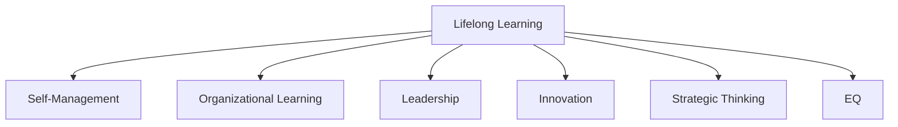

                 

# 终身学习：管理者的必修课

## 1. 背景介绍

### 1.1 问题由来

在现代社会，知识和技术的更新迭代速度不断加快，行业竞争日趋激烈。管理者的角色不再是简单的决策者，而更像是学习者和变革者。终身学习成为了管理者持续提升自我、适应环境变化的必要手段。

### 1.2 问题核心关键点
管理者需要学习的内容不仅仅是专业知识，更包括战略思维、沟通技巧、团队管理等多个方面。同时，管理者所处的行业和组织环境也在不断变化，终身学习使其能够及时调整策略，避免被时代淘汰。

### 1.3 问题研究意义
终身学习能显著提升管理者的综合素质，使其能够在复杂多变的环境中做出更准确的决策，增强组织的竞争力和创新力。同时，管理者通过持续学习，也能更好地引领团队成员共同成长，构建更高效的团队。

## 2. 核心概念与联系

### 2.1 核心概念概述

为了更好地理解终身学习的核心概念，本节将介绍几个密切相关的核心概念：

- **终身学习(Lifelong Learning)**：指一个人在其一生中持续学习新知识和技能，以适应环境变化和职业发展的过程。
- **自我管理(Self-Management)**：指个体对自己的思想、情绪和行为进行管理和调整，提升自我效能和幸福感。
- **组织学习(Organizational Learning)**：指组织通过内部沟通和反馈机制，共享知识经验，不断改进和优化流程。
- **领导力(Leadership)**：指管理者在组织内发挥影响力，通过示范和激励引导团队成员达成共同目标的能力。
- **创新(Creativity)**：指个体或组织产生新颖、有价值、可行的想法和解决方案的能力。
- **战略思维(Strategic Thinking)**：指管理者分析和解决问题，制定长远计划和策略的能力。
- **情商(EQ)**：指个体识别、理解和管理自己和他人的情绪的能力。

这些核心概念之间的逻辑关系可以通过以下Mermaid流程图来展示：



这个流程图展示了大语言模型的核心概念及其之间的关系：

1. 终身学习通过不断学习提升自我管理能力，使管理者能够更好地管理自己的情绪和行为。
2. 通过组织学习，管理者能够共享和应用集体智慧，优化团队效率。
3. 领导力使得管理者能够通过示范和激励，引导团队实现共同目标。
4. 创新能力促使管理者不断寻找新的解决方案，推动组织向前发展。
5. 战略思维使管理者能够从全局视角制定长远计划，适应外部环境的变化。
6. 情商帮助管理者更好地理解团队成员的情绪和需求，增强团队凝聚力。

这些概念共同构成了管理者终身学习的知识框架，使其能够在不断变化的环境中，持续提升自身和组织的竞争力。

## 3. 核心算法原理 & 具体操作步骤
### 3.1 算法原理概述

终身学习的核心在于持续不断的学习循环，这一过程可以概括为以下几个步骤：

1. **目标设定**：明确学习目标，包括知识获取、技能提升、经验积累等方面。
2. **资源获取**：通过书籍、网络课程、研讨会等途径获取相关学习资源。
3. **知识内化**：通过阅读、实践、讨论等方式，将知识转化为自身的经验和技能。
4. **技能应用**：将所学知识应用到实际工作中，检验和完善学习成果。
5. **反馈调整**：根据实践反馈，调整学习策略和方法，持续改进。

这一过程通过正向反馈和持续优化，使学习者能够在不断变化的环境中保持竞争力。

### 3.2 算法步骤详解

具体而言，终身学习的步骤可以分为以下几个阶段：

**阶段1：目标设定**
- 管理者需要明确自身和组织的学习目标。例如，提升某项技能、了解最新行业趋势、优化管理流程等。

**阶段2：资源获取**
- 选择合适的学习资源，包括书籍、在线课程、研讨会、案例研究等。例如，阅读《哈佛商业评论》、参加某在线平台的MBA课程、参加行业研讨会等。

**阶段3：知识内化**
- 通过阅读、实践、讨论等方式，将学习内容转化为自身的知识。例如，阅读相关书籍后，通过案例分析、模拟练习、讨论小组等方式，深入理解知识内容。

**阶段4：技能应用**
- 将所学知识应用到实际工作中，检验学习效果。例如，将新的管理工具和技术应用于日常管理中，观察其效果，调整优化。

**阶段5：反馈调整**
- 根据实际反馈，调整学习策略。例如，根据实际应用效果，进一步深入学习某一领域，或发现新的学习方向。

### 3.3 算法优缺点

终身学习的优点包括：

- **适应性强**：不断学习新知识，能够适应外部环境的变化。
- **提升全面能力**：不仅提升专业技能，还提升管理、沟通、创新等多方面能力。
- **增强自信心**：通过持续学习，提升自我效能感，增强自信心。
- **推动组织进步**：管理者通过持续学习，带动组织整体进步，提升组织竞争力。

但这一方法也存在一定的局限性：

- **资源需求高**：需要大量时间、金钱和精力投入学习。
- **动力维持难**：长时间学习容易产生倦怠，需要持续激励和引导。
- **成果转化慢**：知识转化为技能和行为需要时间，短期内难以见效。

尽管存在这些局限性，但就目前而言，终身学习仍然是管理者提升自身和组织能力的最有效手段之一。

### 3.4 算法应用领域

终身学习在多个领域得到了广泛应用，以下是几个典型例子：

**1. 企业领导**
- 管理者通过持续学习，提升自身领导力，激发团队潜力，推动企业发展。例如，定期参加EMBA课程，学习最新的管理理论和实践。

**2. 科技公司**
- 技术领导者通过学习最新的科技趋势和工具，保持与技术前沿的接轨，推动产品创新。例如，通过在线课程和研讨会，学习区块链、人工智能等新兴技术。

**3. 教育机构**
- 教育管理者通过不断学习最新的教学方法和教育理论，提升教育质量和学生满意度。例如，参加教育学术会议，阅读最新的教育研究成果。

## 4. 数学模型和公式 & 详细讲解 & 举例说明

### 4.1 数学模型构建

为了更好地理解终身学习的数学模型，我们将其抽象为以下模型：

设 $T(t)$ 为时间 $t$ 时刻管理者的技能水平，$S(t)$ 为 $t$ 时刻管理者的学习能力，$\epsilon(t)$ 为 $t$ 时刻的随机扰动。则终身学习的模型可以表示为：

$$
T(t+1) = T(t) + f(T(t),S(t),\epsilon(t))
$$

其中 $f$ 为学习函数，描述技能提升的过程。

### 4.2 公式推导过程

假设 $S(t)$ 为常量，则 $T(t)$ 随时间 $t$ 单调递增。如果 $f$ 为线性函数，则有：

$$
T(t+1) = T(t) + aS(t) + \epsilon(t)
$$

其中 $a$ 为学习速率。当 $\epsilon(t)=0$ 时，$T(t)$ 呈线性增长。但实际中，$\epsilon(t)$ 通常不为零，且随时间 $t$ 变化。因此，需要进一步研究随机扰动对学习过程的影响。

### 4.3 案例分析与讲解

假设某管理者 $T(0)=10$，初始学习能力 $S=0.5$，学习速率 $a=0.1$，随机扰动 $\epsilon(t)$ 服从均值为0，方差为0.1的正态分布。则：

- $T(1) = T(0) + 0.1 \times 0.5 + \epsilon(1) = 10.05 + \epsilon(1)$
- $T(2) = T(1) + 0.1 \times 0.5 + \epsilon(2) = 10.25 + \epsilon(1) + \epsilon(2)$

以此类推，$T(t)$ 随时间不断增长，但受随机扰动影响，其增长过程非线性。通过不断调整学习策略，最小化 $\epsilon(t)$，可以使技能提升更加稳定。

## 5. 项目实践：代码实例和详细解释说明
### 5.1 开发环境搭建

在进行终身学习实践前，我们需要准备好开发环境。以下是使用Python进行开发的环境配置流程：

1. 安装Anaconda：从官网下载并安装Anaconda，用于创建独立的Python环境。

2. 创建并激活虚拟环境：
```bash
conda create -n lifelong-learning python=3.8 
conda activate lifelong-learning
```

3. 安装必要的库：
```bash
conda install pandas numpy matplotlib seaborn
```

4. 搭建学习平台：
```bash
pip install flask
```

### 5.2 源代码详细实现

我们以一个简单的终身学习模型为例，展示如何通过Python实现终身学习的过程。

首先，定义一个简单的学习模型：

```python
import numpy as np

class LifelongLearningModel:
    def __init__(self, initial_skill, learning_rate, noise_std):
        self.current_skill = initial_skill
        self.learning_rate = learning_rate
        self.noise_std = noise_std
        
    def next_step(self, skill):
        epsilon = np.random.normal(0, self.noise_std)
        new_skill = self.current_skill + self.learning_rate * skill + epsilon
        self.current_skill = max(new_skill, 0)
        return self.current_skill
```

然后，定义一个简单的学习循环：

```python
# 初始化学习模型
model = LifelongLearningModel(10, 0.1, 0.1)

# 定义学习周期
num_steps = 100

# 定义学习任务和目标
task = np.array([1, 2, 3, 4, 5, 6, 7, 8, 9, 10])
target = 15

# 学习过程
for i in range(num_steps):
    new_skill = model.next_step(task[i])
    print(f"Step {i+1}: Skill level {new_skill}")

# 最终技能水平
print(f"Final Skill Level: {model.current_skill}")
```

以上代码展示了如何通过Python实现终身学习的简单模型。通过不断迭代，模型技能水平逐渐提升，直到达到目标水平。

### 5.3 代码解读与分析

让我们再详细解读一下关键代码的实现细节：

**LifelongLearningModel类**：
- `__init__`方法：初始化当前技能水平、学习速率和随机扰动标准差。
- `next_step`方法：计算下一个时间步的技能水平，包括学习、扰动等过程。

**学习循环**：
- 定义学习周期和目标技能水平，通过迭代调用 `next_step` 方法，模拟终身学习过程。
- 观察技能水平的变化，最终输出最终技能水平。

## 6. 实际应用场景
### 6.1 企业领导

终身学习对于企业领导尤其重要。例如，某集团公司的CEO决定提升自身的战略思维能力。他通过以下步骤进行终身学习：

1. **目标设定**：提升战略思维能力，以便更好地制定企业发展战略。
2. **资源获取**：订阅哈佛商学院的《哈佛商业评论》，参加MBA课程，参加行业研讨会。
3. **知识内化**：通过阅读文章、课堂讨论、案例分析等方式，深入理解战略思维的理论和实践。
4. **技能应用**：将所学知识应用到企业战略规划中，检验和调整战略方案。
5. **反馈调整**：根据战略执行效果，进一步学习新的战略理论，调整战略规划。

通过持续学习和不断调整，CEO能够更好地应对市场变化，提升企业竞争力。

### 6.2 科技公司

科技公司中，技术领导通过终身学习保持与技术前沿的接轨。例如，某公司的CTO决定提升对人工智能技术的理解。他通过以下步骤进行终身学习：

1. **目标设定**：提升对人工智能技术的应用能力，推动公司产品创新。
2. **资源获取**：参加在线课程，如Coursera的深度学习课程，阅读最新的AI研究论文，参加行业交流会。
3. **知识内化**：通过课程学习、论文阅读、项目实践等方式，掌握人工智能技术。
4. **技能应用**：将所学技术应用到产品开发中，推动技术创新。
5. **反馈调整**：根据产品反馈，进一步学习新的AI技术，优化产品设计。

通过不断学习和应用，CTO能够推动公司技术创新，保持竞争优势。

### 6.3 教育机构

教育管理者通过终身学习提升教育质量。例如，某学校的校长决定提升自身的教学管理能力。他通过以下步骤进行终身学习：

1. **目标设定**：提升教学管理能力，提升学校教育质量。
2. **资源获取**：参加教育学术会议，阅读最新的教育研究成果，参加教育培训课程。
3. **知识内化**：通过学术会议、论文阅读、课堂实践等方式，掌握新的教学管理方法。
4. **技能应用**：将所学知识应用到学校管理中，提升教学质量。
5. **反馈调整**：根据教学反馈，进一步学习新的教学理论，调整管理方案。

通过不断学习和调整，校长能够提升教育质量，推动学校发展。

## 7. 工具和资源推荐
### 7.1 学习资源推荐

为了帮助管理者系统掌握终身学习的理论基础和实践技巧，这里推荐一些优质的学习资源：

1. **《高效能人士的七个习惯》**：由史蒂芬·柯维著，介绍了七个高效能人士的七个习惯，帮助管理者提升自我管理能力。
2. **《五项修炼：学习型组织的艺术与实践》**：由彼得·圣吉著，介绍了学习型组织的构建和管理方法。
3. **《领导梯队：如何将普通人才变成卓越领导者》**：由拉姆·查兰等著，介绍了如何培养和提升领导力。
4. **《创新者的窘境》**：由克莱顿·克里斯滕森著，介绍了创新的本质和如何克服创新窘境。
5. **《谷歌的秘密》**：由大卫·格雷格尔著，介绍了谷歌的管理文化和技术创新。
6. **《数据驱动型领导力》**：由珍妮弗·哈里森著，介绍了如何通过数据驱动提升领导力。
7. **《敏捷领导力》**：由约翰·麦克米伦著，介绍了敏捷管理方法在领导中的应用。

通过对这些资源的学习实践，相信你一定能够快速掌握终身学习的精髓，并用于解决实际的组织管理问题。

### 7.2 开发工具推荐

高效的开发离不开优秀的工具支持。以下是几款用于终身学习开发的常用工具：

1. **Jupyter Notebook**：用于编写和运行Python代码，支持代码的实时修改和展示。
2. **Anaconda Navigator**：用于管理Python环境和安装库，提供了方便的图形界面。
3. **Git**：用于版本控制，便于团队协作和代码管理。
4. **Flask**：用于搭建Web平台，便于学习资源的管理和分享。
5. **GitHub**：用于代码托管和协作，便于知识的分享和传播。

合理利用这些工具，可以显著提升终身学习的开发效率，加快创新迭代的步伐。

### 7.3 相关论文推荐

终身学习在学界的研究也日益增多，以下是几篇奠基性的相关论文，推荐阅读：

1. **《终身学习的理论框架》**：由约翰·霍华德·克拉克曼著，探讨了终身学习的理论基础和实践方法。
2. **《企业学习力的构建与实践》**：由约翰·拉森等著，介绍了如何构建学习型企业。
3. **《管理者终身学习的策略与实践》**：由李华等人著，探讨了管理者终身学习的策略和方法。
4. **《学习型组织理论与实践》**：由马庆华等著，介绍了学习型组织的理论基础和实践应用。
5. **《领导者的学习之道》**：由罗伯特·基欧汉等著，介绍了领导者的学习方法和策略。
6. **《创新与组织的可持续发展》**：由查尔斯·汉迪著，介绍了创新与组织的可持续发展关系。

这些论文代表了大语言模型微调技术的发展脉络。通过学习这些前沿成果，可以帮助研究者把握学科前进方向，激发更多的创新灵感。

## 8. 总结：未来发展趋势与挑战
### 8.1 总结

本文对终身学习管理者的必修课进行了全面系统的介绍。首先阐述了终身学习的重要性，明确了管理者需要学习的内容。其次，从原理到实践，详细讲解了终身学习的数学模型和操作步骤，给出了终身学习任务开发的完整代码实例。同时，本文还广泛探讨了终身学习在企业领导、科技公司、教育机构等多个领域的应用前景，展示了终身学习范式的广泛适用性。此外，本文精选了终身学习的各类学习资源，力求为管理者提供全方位的技术指引。

通过本文的系统梳理，可以看到，终身学习在管理者职业发展中扮演着越来越重要的角色。这一过程不仅提升了个体的综合素质，还推动了组织整体能力的提升。未来，伴随技术的不断进步和应用场景的拓展，终身学习必将成为管理者的必备技能，推动组织的持续发展和创新。

### 8.2 未来发展趋势

展望未来，终身学习的趋势将更加明显，具体体现在以下几个方面：

1. **自动化与智能化**：随着AI技术的发展，学习平台将更加智能化，能够根据学习者的特点和需求，推荐个性化的学习内容，提供智能化的学习辅助。
2. **泛在化与多模态**：终身学习将不再局限于传统的学习方式，而是向泛在化和多模态方向发展。学习者可以通过移动设备、虚拟现实、混合现实等形式进行学习，获取更丰富的学习体验。
3. **社会化与协同化**：终身学习将更加注重社会化与协同化，通过在线社区、学习小组等方式，促进知识共享和交流，提升学习效率。
4. **全球化与跨文化**：随着全球化的深入，终身学习将更加注重跨文化学习和交流，帮助学习者适应多元化的国际环境。
5. **终身化与职业化**：终身学习将更加注重职业化，帮助学习者不断提升专业技能，适应职业发展的需求。

这些趋势将推动终身学习向更加灵活、高效、智能化方向发展，为管理者的职业成长和组织的可持续发展提供更多可能性。

### 8.3 面临的挑战

尽管终身学习具有诸多优势，但在实践过程中仍面临一些挑战：

1. **学习动机不足**：管理者在繁忙的工作中，难以保持持续学习的热情。需要建立有效的激励机制，激发学习动机。
2. **时间与资源有限**：管理者的时间和资源有限，需要制定合理的学习计划，提高学习效率。
3. **知识更新快**：知识和技术的更新迭代速度快，管理者需要不断调整学习策略，跟上最新进展。
4. **学习效果评价困难**：终身学习的成果难以量化，需要建立科学的评价体系，评估学习效果。
5. **知识应用难**：学习到的知识如何转化为实际工作中的能力，如何根据实践反馈进行调整，仍是重要问题。

### 8.4 研究展望

面对终身学习面临的挑战，未来的研究需要在以下几个方面寻求新的突破：

1. **建立科学评价体系**：通过数据驱动的方式，建立科学的终身学习评价体系，量化学习成果，指导学习方向。
2. **提升学习效率**：开发更智能、高效的学习工具和平台，帮助管理者更高效地进行学习。
3. **加强知识应用**：建立学习与实践相结合的机制，确保学习成果能够转化为实际工作中的能力。
4. **推动知识共享**：通过在线社区、学习小组等方式，促进知识共享和交流，提升学习效果。
5. **培养跨领域学习能力**：注重跨领域知识的学习，提升管理者的综合素质和适应能力。

这些研究方向将进一步推动终身学习的发展，帮助管理者更好地应对复杂多变的外部环境，推动组织的持续发展和创新。

## 9. 附录：常见问题与解答

**Q1：管理者是否需要终身学习？**

A: 在快速变化的时代，终身学习已成为管理者的必备技能。通过不断学习新知识，管理者能够提升自身和组织的能力，适应外部环境的变化。

**Q2：终身学习如何与日常工作平衡？**

A: 管理者需要制定合理的学习计划，将学习与工作有效结合。例如，利用碎片时间阅读相关书籍，参加在线课程，或在工作中应用所学知识。

**Q3：终身学习是否需要付出大量时间和金钱？**

A: 终身学习确实需要一定的时间和金钱投入，但长远来看，通过提升能力，管理者能够获得更大的回报。同时，选择高效的学习工具和平台，也能降低学习成本。

**Q4：如何评估终身学习的成效？**

A: 可以通过定期自我评估、360度反馈等方式，评估学习成果。同时，通过实践中的反馈，调整学习策略，确保学习效果。

**Q5：终身学习对职业生涯有哪些影响？**

A: 终身学习能够提升管理者的综合素质，增强职业竞争力，推动职业发展。同时，通过持续学习，管理者能够保持对行业动态的敏感性，把握发展机会。

总之，终身学习不仅是管理者的必修课，更是组织和个人可持续发展的关键。只有不断学习、不断进步，才能在激烈的市场竞争中立于不败之地。

