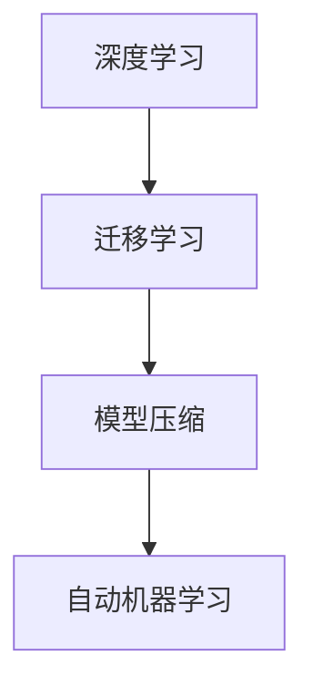

                 

# 经典为师:夯实认知基础的必由之路

在探索人工智能(AI)技术的征途上，我们常常提及“经典为师”。这不仅仅是指学习经典论文、参考经典代码，更意味着扎根于经典理论的坚实基础之上。本文旨在深入探讨基于经典理论的认知基础，帮助你夯实技术地基，从而在未来AI研究与开发中游刃有余。

## 1. 背景介绍

### 1.1 问题由来
随着AI技术的快速发展，人工智能领域的知识体系越来越庞大，内容更新迭代的速度也在加快。如何在变化莫测的技术浪潮中保持知识体系的完整性和时效性，成为每一位从业者面临的巨大挑战。经典理论提供了经过时间考验的知识体系，可以帮助我们在快速变化的技术环境中保持稳定与扎实的技术基础。

### 1.2 问题核心关键点
经典理论与前沿技术的核心关键点在于理论与实践的紧密结合，经典理论为实践提供指导，实践又验证并推动理论的发展。以下是经典理论与前沿技术之间联系的几个核心关键点：

1. **算法与模型的基石**：经典算法如梯度下降、深度神经网络等构成了现代AI技术的核心。
2. **理论的普适性**：经典理论往往具有普适性，能够应用于多种AI技术中。
3. **创新的源泉**：经典理论中的思想和方法常常是推动AI领域新理论和技术发展的驱动力。
4. **教育与培训**：经典理论是教育和培训的基础，帮助初学者建立正确的技术认知和思维方法。

## 2. 核心概念与联系

### 2.1 核心概念概述

为更好地理解经典理论与前沿技术的联系，本节将介绍几个密切相关的核心概念：

- **算法与模型**：如梯度下降、神经网络、卷积神经网络(CNN)、循环神经网络(RNN)、Transformer等。
- **深度学习**：利用多层神经网络从数据中学习高层次特征，解决复杂模式识别问题。
- **迁移学习**：将一个领域学到的知识应用到另一个相关领域，减少新任务的学习成本。
- **模型压缩**：在保持模型性能的前提下，减少模型参数和计算量。
- **自动机器学习(AutoML)**：通过自动化方式寻找最优模型和超参数配置。

### 2.2 核心概念原理和架构的 Mermaid 流程图



这个流程图展示了深度学习、迁移学习、模型压缩和自动机器学习之间的关系。深度学习提供了模型构建的基础，迁移学习通过已有模型的知识加速新任务的学习，模型压缩优化模型性能和效率，而自动机器学习则通过自动化手段寻找最优模型配置。

## 3. 核心算法原理 & 具体操作步骤

### 3.1 算法原理概述

本节将介绍几个经典算法的基本原理，包括梯度下降、神经网络和迁移学习。

**3.1.1 梯度下降算法**

梯度下降是深度学习中最基本的优化算法，其核心思想是通过计算损失函数的梯度，逐步调整参数，使损失函数最小化。梯度下降算法有多种变体，包括批量梯度下降(Batch Gradient Descent, BGD)、随机梯度下降(Stochastic Gradient Descent, SGD)和小批量梯度下降(Mini-batch Gradient Descent)。

**3.1.2 神经网络**

神经网络是由多层神经元组成的模型，每个神经元接收输入，产生输出。神经网络的层次结构允许网络学习复杂的非线性关系，从而解决多种复杂问题。

**3.1.3 迁移学习**

迁移学习是指将一个领域学到的知识应用于另一个相关领域，减少新任务的学习成本。迁移学习的关键在于选择适当的源任务和目标任务，以及设计合理的知识迁移策略。

### 3.2 算法步骤详解

#### 3.2.1 梯度下降算法

梯度下降算法的具体步骤如下：

1. **初始化参数**：随机初始化模型参数。
2. **计算损失**：计算当前参数下模型的损失函数值。
3. **计算梯度**：计算损失函数对每个参数的梯度。
4. **更新参数**：使用梯度下降公式更新参数。
5. **重复迭代**：重复步骤2-4，直至收敛。

**3.2.2 神经网络**

神经网络的具体实现步骤如下：

1. **定义模型架构**：确定神经网络的层数、每层神经元个数等。
2. **初始化权重**：随机初始化各层之间的连接权重。
3. **前向传播**：将输入数据通过网络进行前向传播，得到输出结果。
4. **计算损失**：计算输出结果与真实标签之间的损失函数。
5. **反向传播**：计算损失函数对每个参数的梯度。
6. **更新参数**：使用梯度下降公式更新参数。
7. **重复迭代**：重复步骤3-6，直至收敛。

**3.2.3 迁移学习**

迁移学习的具体步骤如下：

1. **选择合适的源任务**：选择一个与目标任务有相似特征的源任务。
2. **迁移知识**：使用源任务学习到的知识，如预训练的模型、特征表示等，初始化目标任务的模型。
3. **微调**：在目标任务的数据集上对迁移后的模型进行微调，以适应新任务。
4. **评估与优化**：在目标任务的数据集上评估模型性能，根据评估结果调整模型参数。
5. **重复迭代**：重复步骤3-4，直至达到理想性能。

### 3.3 算法优缺点

#### 3.3.1 梯度下降算法的优缺点

- **优点**：
  - 简单易实现，收敛速度快。
  - 理论上可以收敛到全局最优解。
  - 适用于多种损失函数。

- **缺点**：
  - 对超参数敏感，如学习率和动量。
  - 容易陷入局部最优解。
  - 计算量大，尤其是大批量数据。

#### 3.3.2 神经网络的优缺点

- **优点**：
  - 强大的泛化能力，可以解决多种复杂问题。
  - 并行计算能力强，适合大规模数据处理。
  - 可解释性强，部分模型（如卷积神经网络）具有较好的可视化效果。

- **缺点**：
  - 需要大量数据和计算资源进行训练。
  - 模型复杂，容易过拟合。
  - 训练时间长，尤其是深度网络。

#### 3.3.3 迁移学习的优缺点

- **优点**：
  - 利用已有知识，减少新任务的学习成本。
  - 适用于数据量较少的任务。
  - 提升模型泛化能力。

- **缺点**：
  - 需要选择合适的源任务和目标任务。
  - 源任务和目标任务之间的知识迁移可能需要额外调整。
  - 可能需要微调参数，增加计算量。

### 3.4 算法应用领域

基于经典理论的算法和模型已经在多个领域得到了广泛应用，包括计算机视觉、自然语言处理、语音识别、推荐系统等。以下是一些经典算法在具体应用领域的实例：

- **计算机视觉**：卷积神经网络在图像分类、物体检测、人脸识别等任务上取得了显著成果。
- **自然语言处理**：循环神经网络在文本分类、情感分析、机器翻译等任务上表现出色。
- **语音识别**：卷积神经网络和循环神经网络在语音识别、语音合成等任务上提供了高效准确的解决方案。
- **推荐系统**：协同过滤算法在个性化推荐、用户行为预测等任务上发挥了重要作用。

## 4. 数学模型和公式 & 详细讲解 & 举例说明

### 4.1 数学模型构建

本节将通过数学语言对深度学习的基本模型进行更严格的描述。

#### 4.1.1 神经网络模型

假设我们有一个三层神经网络，其中输入层有$m$个神经元，隐藏层有$n$个神经元，输出层有$p$个神经元。神经网络的数学模型可以表示为：

$$
h_{l+1} = g(W_l h_l + b_l), \quad l = 0, 1, 2
$$

其中$h_l$表示第$l$层的输出，$g$为激活函数，$W_l$和$b_l$分别为第$l$层的权重和偏置。最终输出为：

$$
y = W_2 h_2 + b_2
$$

#### 4.1.2 损失函数

常用的损失函数包括均方误差损失、交叉熵损失等。以均方误差损失为例，假设模型输出为$y$，真实标签为$y^*$，则均方误差损失函数为：

$$
L(y, y^*) = \frac{1}{2} \|y - y^*\|_2^2
$$

#### 4.1.3 梯度下降公式

梯度下降算法的更新公式为：

$$
\theta_{l+1} = \theta_l - \eta \nabla L(\theta_l)
$$

其中$\theta_l$为第$l$层的参数，$\eta$为学习率，$\nabla L(\theta_l)$为损失函数对参数$\theta_l$的梯度。

### 4.2 公式推导过程

**4.2.1 均方误差损失推导**

均方误差损失的详细推导过程如下：

$$
L(y, y^*) = \frac{1}{2} \|y - y^*\|_2^2 = \frac{1}{2} \sum_{i=1}^m (y_i - y_i^*)^2
$$

其中$y_i$为模型输出，$y_i^*$为真实标签。

**4.2.2 梯度下降公式推导**

梯度下降算法的详细推导过程如下：

$$
\nabla L(\theta_l) = \frac{\partial L(y, y^*)}{\partial \theta_l} = -\eta \frac{\partial L(y, y^*)}{\partial h_l} \frac{\partial h_l}{\partial \theta_l}
$$

其中$\frac{\partial L(y, y^*)}{\partial h_l}$为损失函数对隐藏层输出的梯度，$\frac{\partial h_l}{\partial \theta_l}$为隐藏层输出对参数的导数。

### 4.3 案例分析与讲解

#### 4.3.1 神经网络案例

假设我们有一个三层神经网络，用于二分类任务。使用随机梯度下降算法进行训练，数据集为$m$个样本，每个样本有两个特征。我们选择交叉熵损失函数，激活函数为sigmoid函数。

- **模型构建**：
  - 输入层有2个神经元。
  - 隐藏层有4个神经元，激活函数为ReLU。
  - 输出层有1个神经元，激活函数为sigmoid。

- **参数初始化**：
  - 隐藏层权重$W_h \in \mathbb{R}^{4\times2}$，偏置$b_h \in \mathbb{R}^4$。
  - 输出层权重$W_y \in \mathbb{R}^1$，偏置$b_y \in \mathbb{R}^1$。

- **前向传播**：
  - 隐藏层输出$h_1 = g(W_h h_0 + b_h)$。
  - 输出层输出$y = W_y h_1 + b_y$。

- **损失函数**：
  - 交叉熵损失$L(y, y^*) = -(y^* \log y + (1 - y^*) \log(1 - y))$。

- **梯度下降**：
  - 隐藏层权重梯度$\nabla W_h = \frac{\partial L}{\partial W_h} \nabla h_1$。
  - 隐藏层偏置梯度$\nabla b_h = \frac{\partial L}{\partial b_h} \nabla h_1$。
  - 输出层权重梯度$\nabla W_y = \frac{\partial L}{\partial W_y} \nabla y$。
  - 输出层偏置梯度$\nabla b_y = \frac{\partial L}{\partial b_y} \nabla y$。

#### 4.3.2 迁移学习案例

假设我们有一个预训练的BERT模型，用于迁移学习任务。我们使用迁移学习的方法，将BERT模型的知识应用于新的自然语言推理(NLI)任务。

- **模型选择**：
  - 源任务：预训练的BERT模型。
  - 目标任务：NLI任务。

- **迁移知识**：
  - 使用预训练的BERT模型作为初始化参数。
  - 在目标任务的数据集上进行微调。

- **微调**：
  - 添加任务特定的输出层。
  - 优化目标任务上的损失函数。
  - 使用小批量梯度下降算法。

- **评估与优化**：
  - 在验证集上评估模型性能。
  - 根据评估结果调整模型参数。

- **结果展示**：
  - 在测试集上展示迁移学习后的模型性能。

## 5. 项目实践：代码实例和详细解释说明

### 5.1 开发环境搭建

在进行项目实践前，我们需要准备好开发环境。以下是使用Python进行TensorFlow开发的环境配置流程：

1. 安装Anaconda：从官网下载并安装Anaconda，用于创建独立的Python环境。

2. 创建并激活虚拟环境：
```bash
conda create -n tf-env python=3.8 
conda activate tf-env
```

3. 安装TensorFlow：根据CUDA版本，从官网获取对应的安装命令。例如：
```bash
pip install tensorflow-gpu==2.7.0
```

4. 安装各类工具包：
```bash
pip install numpy pandas scikit-learn matplotlib tqdm jupyter notebook ipython
```

完成上述步骤后，即可在`tf-env`环境中开始项目实践。

### 5.2 源代码详细实现

下面我们以卷积神经网络(CNN)为例，给出使用TensorFlow对图像分类任务进行微调的代码实现。

首先，定义图像分类任务的数据处理函数：

```python
import tensorflow as tf
import numpy as np
import matplotlib.pyplot as plt

class ImageDataset(tf.data.Dataset):
    def __init__(self, data_dir):
        self.data_dir = data_dir
        self.filenames = tf.io.gfile.glob(self.data_dir + '/*.jpg')
        self.class_names = tf.io.gfile.listdir(self.data_dir)
        
    def __len__(self):
        return len(self.filenames)
    
    def __getitem__(self, item):
        image_path = self.filenames[item]
        label = self.class_names.index(os.path.basename(image_path)[-5:-4])
        image = tf.io.read_file(image_path)
        image = tf.image.decode_jpeg(image, channels=3)
        image = tf.image.resize(image, (224, 224))
        image /= 255.0
        return image, label

# 定义数据集
data_dir = '/path/to/dataset/'
train_dataset = ImageDataset(data_dir)
train_dataset = train_dataset.shuffle(1000).batch(32)
```

然后，定义卷积神经网络模型和优化器：

```python
from tensorflow.keras import layers

model = tf.keras.Sequential([
    layers.Conv2D(32, (3, 3), activation='relu', input_shape=(224, 224, 3)),
    layers.MaxPooling2D((2, 2)),
    layers.Conv2D(64, (3, 3), activation='relu'),
    layers.MaxPooling2D((2, 2)),
    layers.Conv2D(128, (3, 3), activation='relu'),
    layers.MaxPooling2D((2, 2)),
    layers.Flatten(),
    layers.Dense(64, activation='relu'),
    layers.Dense(10, activation='softmax')
])

optimizer = tf.keras.optimizers.Adam(learning_rate=0.001)
```

接着，定义训练和评估函数：

```python
@tf.function
def train_step(images, labels):
    with tf.GradientTape() as tape:
        logits = model(images)
        loss = tf.keras.losses.sparse_categorical_crossentropy(labels, logits)
    gradients = tape.gradient(loss, model.trainable_variables)
    optimizer.apply_gradients(zip(gradients, model.trainable_variables))

@tf.function
def evaluate_step(images, labels):
    logits = model(images)
    predictions = tf.argmax(logits, axis=1)
    return tf.metrics.sparse_categorical_accuracy(labels, predictions)

# 训练和评估函数
@tf.function
def train_epoch(dataset):
    for images, labels in dataset:
        train_step(images, labels)

@tf.function
def evaluate_epoch(dataset):
    predictions = []
    labels = []
    for images, labels in dataset:
        predictions.extend(evaluate_step(images, labels))
        labels.extend(labels)
    return np.mean(predictions == labels)

# 训练流程
epochs = 10
batch_size = 32

for epoch in range(epochs):
    print(f'Epoch {epoch+1}')
    train_loss = 0.0
    train_acc = 0.0
    val_loss = 0.0
    val_acc = 0.0
    
    for images, labels in train_dataset:
        train_step(images, labels)
        train_loss += loss
        train_acc += tf.keras.metrics.sparse_categorical_accuracy(labels, logits).numpy()

    val_loss = evaluate_epoch(val_dataset)
    val_acc = evaluate_epoch(val_dataset)
    
    print(f'Epoch {epoch+1}, train loss: {train_loss:.4f}, train acc: {train_acc:.4f}, val loss: {val_loss:.4f}, val acc: {val_acc:.4f}')
```

以上就是使用TensorFlow对卷积神经网络进行图像分类任务微调的完整代码实现。可以看到，得益于TensorFlow的强大封装，我们可以用相对简洁的代码完成CNN模型的加载和微调。

### 5.3 代码解读与分析

让我们再详细解读一下关键代码的实现细节：

**ImageDataset类**：
- `__init__`方法：初始化数据集文件名和类别名。
- `__len__`方法：返回数据集的样本数量。
- `__getitem__`方法：对单个样本进行处理，将图像进行预处理后，返回输入和标签。

**模型定义**：
- 定义一个包含卷积层、池化层、全连接层的神经网络模型，输出10个类别的概率分布。
- 使用Adam优化器进行优化。

**训练和评估函数**：
- 定义训练函数`train_step`，使用梯度下降更新模型参数。
- 定义评估函数`evaluate_step`，计算模型的分类准确率。
- 在训练循环中，使用`train_step`函数更新模型参数，同时记录训练损失和准确率。
- 在评估循环中，使用`evaluate_step`函数计算验证集的分类准确率。

**训练流程**：
- 定义总的epoch数和batch size，开始循环迭代
- 每个epoch内，先在训练集上训练，输出训练损失和准确率
- 在验证集上评估，输出验证损失和准确率
- 所有epoch结束后，停止训练

可以看到，TensorFlow配合Keras封装使得CNN微调的代码实现变得简洁高效。开发者可以将更多精力放在数据处理、模型改进等高层逻辑上，而不必过多关注底层的实现细节。

当然，工业级的系统实现还需考虑更多因素，如模型的保存和部署、超参数的自动搜索、更灵活的任务适配层等。但核心的微调范式基本与此类似。

## 6. 实际应用场景

### 6.1 智能推荐系统

基于卷积神经网络等经典算法的智能推荐系统，可以广泛应用于电商、视频、音乐等平台，为用户推荐感兴趣的内容。

在技术实现上，可以收集用户的历史行为数据，将用户-物品之间的交互信息作为训练数据，使用CNN等模型预测用户对新物品的兴趣。微调后的模型能够自动理解用户兴趣点，结合用户实时行为数据，动态生成推荐列表，实现个性化推荐。

### 6.2 自然语言处理

卷积神经网络和循环神经网络等经典算法在自然语言处理领域也得到了广泛应用，如文本分类、情感分析、机器翻译等任务。

在实践中，可以将文本转化为数值向量，使用CNN或RNN模型进行处理。微调后的模型能够从文本中提取重要特征，分类、分析文本内容，生成翻译结果。

### 6.3 计算机视觉

卷积神经网络在计算机视觉领域也展现了强大的能力，如图像分类、物体检测、人脸识别等任务。

在实践中，可以将图像转化为数值向量，使用CNN模型进行处理。微调后的模型能够从图像中提取重要特征，分类、检测物体，识别人脸等。

## 7. 工具和资源推荐

### 7.1 学习资源推荐

为了帮助开发者系统掌握经典理论与前沿技术的联系，这里推荐一些优质的学习资源：

1. 《深度学习》书籍：由深度学习领域的知名学者撰写，全面介绍了深度学习的基本概念和算法。
2. 《TensorFlow官方文档》：TensorFlow的官方文档，提供了详细的API和使用指南，是学习TensorFlow的必备资源。
3. 《PyTorch官方文档》：PyTorch的官方文档，提供了丰富的教程和样例，是学习PyTorch的好资源。
4. 《Keras官方文档》：Keras的官方文档，提供了简单易用的API，适合初学者上手。
5. 《自然语言处理综论》课程：斯坦福大学开设的NLP课程，有Lecture视频和配套作业，是学习NLP的好资源。

通过对这些资源的学习实践，相信你一定能够快速掌握经典理论与前沿技术之间的联系，并用于解决实际的AI问题。

### 7.2 开发工具推荐

高效的开发离不开优秀的工具支持。以下是几款用于TensorFlow开发的工具：

1. Jupyter Notebook：免费的交互式开发环境，支持Python、R等多种语言，适合快速迭代开发。
2. Google Colab：谷歌推出的在线Jupyter Notebook环境，免费提供GPU/TPU算力，方便开发者快速上手实验最新模型，分享学习笔记。
3. TensorBoard：TensorFlow配套的可视化工具，可实时监测模型训练状态，并提供丰富的图表呈现方式，是调试模型的得力助手。
4. Weights & Biases：模型训练的实验跟踪工具，可以记录和可视化模型训练过程中的各项指标，方便对比和调优。
5. PyTorch Lightning：PyTorch的闪电框架，提供了更简洁的API，方便快速搭建模型和训练流程。

合理利用这些工具，可以显著提升TensorFlow开发的效率，加快创新迭代的步伐。

### 7.3 相关论文推荐

经典理论与前沿技术的演变离不开学界的持续研究。以下是几篇奠基性的相关论文，推荐阅读：

1. LeNet：卷积神经网络的基本结构。
2. AlexNet：深度学习在图像识别任务上的突破。
3. ResNet：残差网络，解决了深度网络训练中的梯度消失问题。
4. InceptionNet：多层次卷积网络，提升卷积特征的表达能力。
5. Transformer：引入自注意力机制，提升了序列建模能力。

这些论文代表了经典算法的发展脉络。通过学习这些前沿成果，可以帮助研究者把握学科前进方向，激发更多的创新灵感。

## 8. 总结：未来发展趋势与挑战

### 8.1 总结

本文对基于经典理论的深度学习进行了全面系统的介绍。首先阐述了深度学习、迁移学习等经典算法的基本原理和应用场景，明确了经典理论在AI技术发展中的重要地位。其次，从算法原理到项目实践，详细讲解了基于卷积神经网络的图像分类任务和迁移学习任务的实现过程，给出了完整的代码实例和详细解释。最后，本文还探讨了经典理论在多个实际应用场景中的应用，展示了经典理论与前沿技术的紧密联系。

通过本文的系统梳理，可以看到，经典理论与前沿技术之间存在着不可分割的联系。经典理论为前沿技术提供了坚实的理论基础，前沿技术也在不断推动经典理论的进步。在AI技术发展的道路上，经典理论始终是我们的“老师”，指引着我们在探索未知的道路上不断前行。

### 8.2 未来发展趋势

展望未来，经典理论仍将是AI技术发展的重要基石。以下是未来经典理论与前沿技术之间可能的趋势：

1. **深度学习模型更加复杂**：未来的深度学习模型将更加复杂，能够处理更加复杂和抽象的任务。
2. **迁移学习更加普适**：迁移学习将变得更加普适，能够应用于更多领域和任务。
3. **算法优化更加高效**：算法优化将更加高效，能够显著提升模型性能和训练效率。
4. **多模态融合更加深入**：未来的AI系统将更多地融合视觉、语音、文本等多种模态的信息，提升系统的综合能力。
5. **知识图谱的应用更加广泛**：知识图谱将成为AI系统的重要组成部分，辅助系统进行推理和决策。

这些趋势凸显了经典理论在AI技术发展中的重要地位，也预示着未来的AI系统将更加智能和全面。经典理论的深入研究，将为AI技术的发展提供更加坚实的理论基础和实现手段。

### 8.3 面临的挑战

尽管经典理论在AI技术发展中发挥了重要作用，但面对快速变化的AI技术环境，仍面临诸多挑战：

1. **数据量和质量问题**：经典算法通常需要大量的数据进行训练，数据质量和多样性不足可能导致模型性能不佳。
2. **模型复杂度问题**：经典算法通常需要复杂的模型结构，增加了训练和推理的难度。
3. **计算资源问题**：经典算法需要大量的计算资源进行训练和推理，可能导致成本高昂。
4. **模型可解释性问题**：经典算法模型通常缺乏可解释性，难以理解模型的决策过程。
5. **模型鲁棒性问题**：经典算法模型容易受到数据分布变化的影响，鲁棒性不足。

这些挑战需要我们在未来研究中不断探索和解决。只有不断克服这些挑战，经典理论才能更好地服务于AI技术的发展。

### 8.4 研究展望

面对经典理论面临的挑战，未来的研究需要在以下几个方面寻求新的突破：

1. **数据增强和预处理**：开发更加高效的数据增强和预处理技术，提升数据质量和多样性。
2. **模型压缩和优化**：开发更加高效的模型压缩和优化技术，提升模型性能和计算效率。
3. **模型可解释性**：开发更加可解释的模型，提高模型的透明度和可信度。
4. **模型鲁棒性提升**：研究如何提升模型鲁棒性，使其更好地应对数据分布变化。
5. **跨模态融合技术**：研究跨模态融合技术，提升多模态信息融合的效率和效果。

这些研究方向的探索，将引领经典理论的进一步发展，为AI技术的应用提供更加坚实的基础。未来，经典理论与前沿技术将更加紧密地结合，共同推动AI技术的发展和应用。

## 9. 附录：常见问题与解答

**Q1：卷积神经网络为什么能够处理图像分类任务？**

A: 卷积神经网络通过卷积层和池化层的组合，能够自动提取图像中的特征，这些特征在分类任务中可以作为判别依据。

**Q2：迁移学习与微调的区别是什么？**

A: 迁移学习是指将一个领域学到的知识应用到另一个相关领域，而微调是在迁移学习的基础上，对模型在新任务上的性能进行进一步优化。

**Q3：卷积神经网络为什么能够提升图像分类性能？**

A: 卷积神经网络通过卷积和池化操作，能够自动提取图像中的特征，减少模型的计算量，提高模型的泛化能力。

**Q4：什么是梯度下降算法？**

A: 梯度下降算法是一种常用的优化算法，通过计算损失函数的梯度，逐步调整参数，使损失函数最小化。

**Q5：卷积神经网络的超参数有哪些？**

A: 卷积神经网络的超参数包括卷积核大小、卷积核数量、池化大小、池化步长、学习率等。

**Q6：什么是迁移学习？**

A: 迁移学习是指将一个领域学到的知识应用到另一个相关领域，减少新任务的学习成本。

**Q7：卷积神经网络的训练流程是什么？**

A: 卷积神经网络的训练流程包括定义模型、选择损失函数、选择优化器、定义训练函数、训练模型等步骤。

**Q8：什么是TensorFlow？**

A: TensorFlow是由Google开发的深度学习框架，提供了灵活的API和高效的计算能力。

**Q9：什么是TensorBoard？**

A: TensorBoard是TensorFlow配套的可视化工具，可实时监测模型训练状态，并提供丰富的图表呈现方式。

**Q10：什么是Keras？**

A: Keras是一个高级深度学习API，提供了简单易用的接口，适合初学者上手。

通过这些常见问题的解答，相信你对经典理论与前沿技术的联系有了更深刻的理解。希望这些知识能够帮助你在AI技术发展的道路上不断前行。

---

作者：禅与计算机程序设计艺术 / Zen and the Art of Computer Programming

