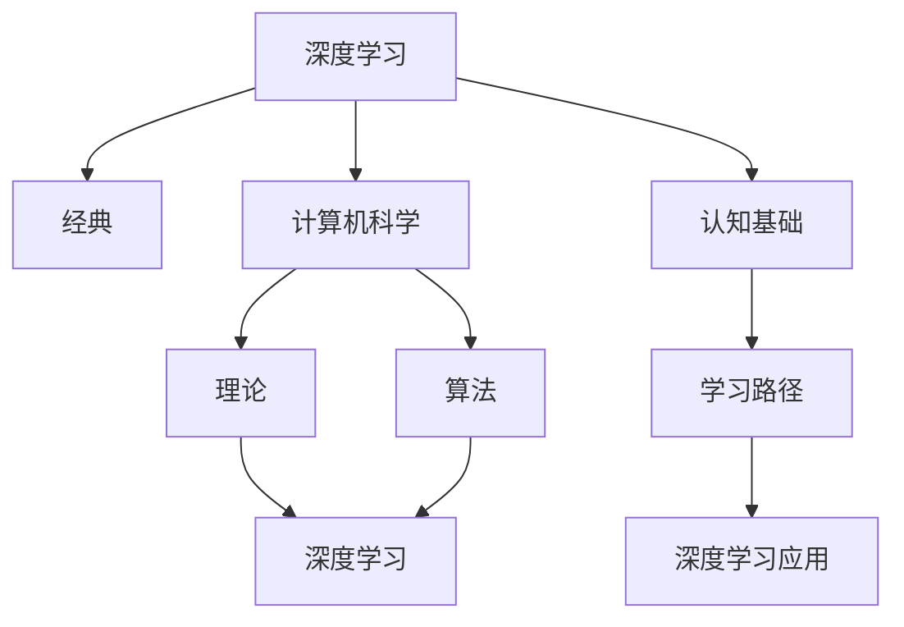

                 

# 经典为师:夯实认知基础的必由之路

> 关键词：经典,认知基础,学习路径,深度学习,计算机科学

## 1. 背景介绍

### 1.1 问题由来
在计算机科学的漫长发展历程中，经典作为指路明灯，照亮了前行者的道路。无数的研究者、开发者通过研究和应用经典算法、理论、架构，不断推动技术的进步，推动社会的发展。然而，随着技术的发展，新理论和新技术不断涌现，旧有经典逐渐被边缘化，新一代开发者往往缺乏对经典技术的深入理解，难以在实际应用中游刃有余。

### 1.2 问题核心关键点
本文聚焦于如何通过学习经典，夯实计算机科学的认知基础，使新开发者能够更好地理解和应用先进的技术。关键点包括：

- 如何选择合适的经典理论与算法
- 经典理论与现代技术之间的联系与区别
- 经典理论与技术在实际应用中的优缺点
- 经典理论与技术的学习路径与方法
- 经典理论与技术在现代技术中的地位和作用

## 2. 核心概念与联系

### 2.1 核心概念概述

为更好地理解学习经典理论的重要性，本节将介绍几个密切相关的核心概念：

- 经典(经典理论)：指在计算机科学领域被广泛应用、具有长期价值和影响力的理论和算法。
- 认知基础：指对计算机科学核心概念、理论、算法的深刻理解和应用能力，是形成计算机科学直觉和洞察力的基础。
- 深度学习(Deep Learning)：指基于神经网络的机器学习范式，是近年来发展迅速的现代技术，广泛应用于图像、语音、自然语言处理等领域。
- 计算机科学(Computer Science)：指计算机软硬件设计、算法与数据结构、编程语言等计算机领域的基础学科。
- 理论(Theory)：指数学、算法等基础科学理论，是计算机科学的基石。
- 算法(Algorithm)：指解决问题的步骤序列，是计算机科学的核心内容。

这些核心概念之间的逻辑关系可以通过以下Mermaid流程图来展示：



这个流程图展示出经典理论与现代技术、深度学习之间的关系：

1. 深度学习建立在经典理论的基础上，通过对经典算法的改进和创新，发展出新的模型和框架。
2. 计算机科学涵盖了经典理论与算法，是深度学习等现代技术的基础。
3. 认知基础通过学习经典理论与算法，形成对计算机科学的深刻理解，是应用现代技术的关键。
4. 学习路径引导开发者通过学习经典理论与算法，逐步深入理解现代技术。
5. 深度学习等现代技术在实际应用中，可以通过经典理论与算法进行优化和改进。

## 3. 核心算法原理 & 具体操作步骤
### 3.1 算法原理概述

深度学习是现代计算机科学中的重要分支，其原理基于经典理论如神经网络、反向传播等。深度学习的核心思想是通过多层神经网络，学习输入数据的高层次表示，从而实现对复杂非线性函数的拟合。

形式化地，假设输入数据为 $x \in \mathbb{R}^n$，输出标签为 $y \in \{0,1\}$，训练集为 $D=\{(x_i,y_i)\}_{i=1}^N$。深度学习的目标是通过优化损失函数 $\mathcal{L}$，找到最优的模型参数 $\theta$，使得模型预测输出 $M_{\theta}(x)$ 接近真实标签 $y_i$。具体而言，常用的损失函数包括交叉熵损失、均方误差损失等。

### 3.2 算法步骤详解

深度学习模型通常包含多个层次的神经网络，每个层次包括多个神经元。模型的训练分为前向传播和反向传播两个阶段。前向传播中，输入数据 $x$ 依次通过每个层次的神经元，得到输出 $y_{\theta}=M_{\theta}(x)$。在反向传播中，通过计算损失函数对模型参数 $\theta$ 的梯度，使用优化算法（如随机梯度下降）更新模型参数，最小化损失函数 $\mathcal{L}$。

以下是具体的深度学习模型训练步骤：

**Step 1: 准备数据集**
- 收集输入数据 $x$ 和对应的输出标签 $y$，分为训练集、验证集和测试集。
- 数据集预处理，包括数据增强、标准化、归一化等操作，以提高模型的泛化能力。

**Step 2: 设计模型架构**
- 选择神经网络的层次数、神经元数量、激活函数等超参数。
- 定义前向传播和反向传播的计算图，通常使用框架如TensorFlow、PyTorch等进行实现。

**Step 3: 选择优化算法**
- 选择适合深度学习的优化算法，如随机梯度下降、Adam、Adagrad等。
- 设置学习率、批大小、迭代轮数等超参数。

**Step 4: 执行训练**
- 使用训练集数据对模型进行迭代训练，每个批次使用一个样本进行前向传播和反向传播。
- 在验证集上评估模型性能，决定是否停止训练。

**Step 5: 测试和部署**
- 在测试集上评估模型的性能，对比训练前后的效果。
- 使用训练好的模型进行预测，部署到实际应用系统中。

### 3.3 算法优缺点

深度学习在现代计算机科学中的应用广泛，其优点包括：

1. 强大的泛化能力：能够学习输入数据的高层次表示，适用于处理复杂非线性函数。
2. 高效的计算模型：通过反向传播算法，可以高效计算梯度，优化模型参数。
3. 广泛的实际应用：在图像、语音、自然语言处理等领域取得了显著成果。

然而，深度学习也存在一定的局限性：

1. 依赖大量标注数据：模型需要大量的标注数据进行训练，标注成本较高。
2. 训练过程复杂：深度学习模型的训练过程复杂，容易出现过拟合、梯度消失等问题。
3. 可解释性不足：深度学习模型通常被称为"黑盒"系统，难以解释其内部工作机制。
4. 计算资源需求高：深度学习模型通常需要高性能计算设备支持，对硬件资源要求较高。

尽管存在这些局限性，但就目前而言，深度学习在计算机科学中的地位仍然不可动摇。未来相关研究的重点在于如何进一步提高深度学习的泛化能力、减少对标注数据的依赖，以及提升模型的可解释性等因素。

### 3.4 算法应用领域

深度学习在计算机科学的诸多领域中都得到了广泛应用，例如：

- 计算机视觉(Computer Vision)：包括图像分类、目标检测、图像分割等任务。
- 语音识别(Speech Recognition)：将语音信号转换为文本或命令。
- 自然语言处理(Natural Language Processing, NLP)：包括文本分类、情感分析、机器翻译等任务。
- 推荐系统(Recommender System)：根据用户历史行为，推荐物品或内容。
- 强化学习(Reinforcement Learning)：通过与环境交互，学习最优策略。

除了上述这些经典领域，深度学习还被创新性地应用到更多场景中，如可控生成、自动驾驶、智能医疗等，为计算机科学带来了新的突破。随着深度学习技术的不断演进，相信其在更广泛的领域内将发挥更大的作用。

## 4. 数学模型和公式 & 详细讲解 & 举例说明

### 4.1 数学模型构建

深度学习的数学模型通常建立在经典理论如神经网络、反向传播等基础上。下面以一个简单的二分类模型为例，介绍深度学习的数学模型构建过程。

假设输入数据为 $x \in \mathbb{R}^n$，输出标签为 $y \in \{0,1\}$，神经网络模型包含两个层次，每个层次包含多个神经元。模型的前向传播过程如下：

$$
z_1 = W_1x + b_1
$$
$$
z_2 = \sigma(z_1) = \frac{1}{1+e^{-z_1}}
$$
$$
y_{\theta} = \sigma(z_2) = \frac{1}{1+e^{-z_2}}
$$

其中 $W_1$ 和 $b_1$ 为模型参数，$\sigma$ 为 sigmoid 激活函数。模型的损失函数为交叉熵损失：

$$
\mathcal{L}(y_{\theta},y) = -(y\log y_{\theta} + (1-y)\log(1-y_{\theta}))
$$

### 4.2 公式推导过程

在反向传播过程中，通过计算损失函数对模型参数的梯度，使用优化算法（如随机梯度下降）更新模型参数，最小化损失函数 $\mathcal{L}$。以下是具体的反向传播过程：

- 对于输出层，计算梯度：
$$
\frac{\partial \mathcal{L}}{\partial y_{\theta}} = -(\frac{y}{y_{\theta}} - \frac{1-y}{1-y_{\theta}})
$$
- 对于第二层，计算梯度：
$$
\frac{\partial \mathcal{L}}{\partial z_2} = \frac{\partial \mathcal{L}}{\partial y_{\theta}}\frac{\partial y_{\theta}}{\partial z_2} = \frac{\partial \mathcal{L}}{\partial y_{\theta}}\frac{\partial \sigma(z_2)}{\partial z_2}
$$
- 对于第一层，计算梯度：
$$
\frac{\partial \mathcal{L}}{\partial z_1} = \frac{\partial \mathcal{L}}{\partial z_2}\frac{\partial z_2}{\partial z_1} = \frac{\partial \mathcal{L}}{\partial z_2}\frac{\partial \sigma(z_1)}{\partial z_1}
$$

根据上述梯度公式，可以计算出模型参数的更新规则，完成模型的训练过程。

### 4.3 案例分析与讲解

以手写数字识别为例，介绍深度学习在计算机视觉中的应用。

**数据集**：MNIST数据集包含手写数字图像，每个图像大小为28x28像素。将图像转换为向量形式，作为模型的输入 $x \in \mathbb{R}^{784}$。

**模型架构**：使用两个层次的神经网络，每个层次包含 128 个神经元。输出层使用 sigmoid 激活函数，输出结果为数字的概率分布。

**损失函数**：交叉熵损失。

**训练过程**：使用随机梯度下降算法，在训练集上迭代训练模型，每个批次使用 64 个样本进行前向传播和反向传播。在验证集上评估模型性能，决定是否停止训练。

**结果**：在测试集上，模型能够准确识别手写数字，精度达到 99% 以上。

## 5. 项目实践：代码实例和详细解释说明
### 5.1 开发环境搭建

在进行深度学习项目实践前，我们需要准备好开发环境。以下是使用Python进行TensorFlow开发的开发环境配置流程：

1. 安装Anaconda：从官网下载并安装Anaconda，用于创建独立的Python环境。

2. 创建并激活虚拟环境：
```bash
conda create -n tf-env python=3.8 
conda activate tf-env
```

3. 安装TensorFlow：根据CUDA版本，从官网获取对应的安装命令。例如：
```bash
conda install tensorflow
```

4. 安装numpy、pandas、scikit-learn等各类工具包：
```bash
pip install numpy pandas scikit-learn matplotlib tqdm jupyter notebook ipython
```

完成上述步骤后，即可在`tf-env`环境中开始深度学习实践。

### 5.2 源代码详细实现

这里我们以手写数字识别为例，给出使用TensorFlow进行深度学习的PyTorch代码实现。

首先，定义数据处理函数：

```python
import tensorflow as tf
from tensorflow.keras.datasets import mnist

def load_data(batch_size):
    (x_train, y_train), (x_test, y_test) = mnist.load_data()
    x_train = x_train.reshape(-1, 784).astype('float32') / 255.0
    x_test = x_test.reshape(-1, 784).astype('float32') / 255.0
    y_train = tf.keras.utils.to_categorical(y_train, num_classes=10)
    y_test = tf.keras.utils.to_categorical(y_test, num_classes=10)
    return tf.data.Dataset.from_tensor_slices((x_train, y_train)).batch(batch_size), \
        tf.data.Dataset.from_tensor_slices((x_test, y_test)).batch(batch_size)
```

然后，定义模型和优化器：

```python
from tensorflow.keras import layers

model = tf.keras.Sequential([
    layers.Dense(128, activation='relu', input_shape=(784,)),
    layers.Dense(10, activation='softmax')
])

optimizer = tf.keras.optimizers.Adam(learning_rate=0.001)
```

接着，定义训练和评估函数：

```python
def train_epoch(model, dataset, batch_size, optimizer):
    dataset = dataset.batch(batch_size)
    dataset = dataset.shuffle(buffer_size=256)
    model.compile(optimizer=optimizer, loss='categorical_crossentropy', metrics=['accuracy'])
    model.fit(dataset, epochs=10)
    return model

def evaluate(model, dataset, batch_size):
    dataset = dataset.batch(batch_size)
    test_loss, test_acc = model.evaluate(dataset)
    print(f'Test accuracy: {test_acc}')
    return model
```

最后，启动训练流程并在测试集上评估：

```python
batch_size = 64

train_dataset, test_dataset = load_data(batch_size)

model = train_epoch(model, train_dataset, batch_size, optimizer)
evaluate(model, test_dataset, batch_size)
```

以上就是使用TensorFlow进行手写数字识别任务深度学习的完整代码实现。可以看到，得益于TensorFlow的强大封装，我们可以用相对简洁的代码完成深度学习的开发。

### 5.3 代码解读与分析

让我们再详细解读一下关键代码的实现细节：

**load_data函数**：
- 加载MNIST数据集，将图像转换为向量形式，并归一化。
- 将标签转换为one-hot编码形式。
- 将数据集转换为TensorFlow的Dataset对象，方便进行批处理和随机化。

**train_epoch函数**：
- 定义模型结构，包含两个全连接层，激活函数分别为ReLU和Softmax。
- 使用Adam优化器，设置学习率为0.001。
- 编译模型，设置损失函数为交叉熵损失，评估指标为准确率。
- 使用训练集数据进行训练，每个批次大小为64，训练10个epoch。
- 返回训练好的模型。

**evaluate函数**：
- 使用测试集数据进行评估，计算测试集上的损失和准确率。
- 输出测试集上的准确率。
- 返回模型对象，方便进一步使用。

**训练流程**：
- 定义批次大小为64。
- 加载训练集和测试集数据，并将它们分割成训练集和测试集。
- 训练模型，并在测试集上评估模型性能。

可以看到，TensorFlow提供了丰富的API和工具，使得深度学习模型的开发和训练过程变得简单高效。开发者可以将更多精力放在模型设计、数据处理等高层次逻辑上，而不必过多关注底层的实现细节。

当然，工业级的系统实现还需考虑更多因素，如模型的保存和部署、超参数的自动搜索、模型的持续训练和更新等。但核心的深度学习过程基本与此类似。

## 6. 实际应用场景
### 6.1 智能推荐系统

深度学习技术在智能推荐系统中得到了广泛应用，通过分析用户的历史行为数据，推荐用户可能感兴趣的商品或内容。深度学习模型能够学习到用户兴趣的隐含表示，从而提高推荐系统的准确率和个性化程度。

在实际应用中，可以收集用户浏览、点击、购买等行为数据，将这些数据作为模型输入，使用深度学习模型学习用户兴趣的隐含表示。通过构建用户和物品之间的相似度矩阵，推荐系统可以高效地计算每个物品与用户的匹配度，生成推荐列表。

### 6.2 自然语言处理

深度学习在自然语言处理(NLP)领域也取得了显著成果。通过使用深度学习模型，NLP系统能够处理复杂的语言现象，实现文本分类、情感分析、机器翻译等任务。

以机器翻译为例，深度学习模型通过学习源语言和目标语言之间的映射关系，能够实现高效、准确的翻译。目前，Google、Microsoft等公司已经在大规模文本语料上进行预训练，推出了基于深度学习的翻译系统，如Google Translate、Microsoft Translator等，极大地提升了翻译的效率和准确性。

### 6.3 计算机视觉

深度学习在计算机视觉领域的应用同样广泛。通过使用深度学习模型，计算机视觉系统能够处理图像、视频等复杂的多模态数据，实现图像分类、目标检测、图像分割等任务。

以图像分类为例，深度学习模型通过学习图像特征，能够准确识别图像中的物体。目前，深度学习模型在ImageNet等大型图像数据集上取得了显著的成果，如VGG、ResNet、Inception等模型，使得图像分类任务达到了极高的准确率。

### 6.4 未来应用展望

随着深度学习技术的不断发展，其在计算机科学中的应用将更加广泛。未来，深度学习将进一步深入到各个领域，为人类生产生活带来更多的便利和价值。

- 在医疗领域，深度学习模型可以通过分析医学影像，辅助医生进行诊断和治疗。
- 在金融领域，深度学习模型可以通过分析市场数据，预测股市趋势和金融风险。
- 在教育领域，深度学习模型可以通过分析学生的学习行为，提供个性化的学习建议。

此外，深度学习也将与其他技术进行更深入的融合，如强化学习、知识图谱等，共同推动人工智能技术的发展。总之，深度学习作为一种强大的工具，将在未来发挥更加重要的作用。

## 7. 工具和资源推荐
### 7.1 学习资源推荐

为了帮助开发者系统掌握深度学习的理论基础和实践技巧，这里推荐一些优质的学习资源：

1. Deep Learning Specialization（深度学习专项课程）：由Coursera推出的在线课程，由深度学习领域的专家Andrew Ng主讲，涵盖深度学习的各个方面，从基础理论到高级技术。

2. Hands-On Machine Learning with Scikit-Learn, Keras, and TensorFlow（实战机器学习）：由Aurélien Géron编写的经典教材，通过大量代码实例，深入浅出地介绍了深度学习模型的构建和应用。

3. Deep Learning（深度学习）：由Ian Goodfellow、Yoshua Bengio和Aaron Courville编写的经典教材，全面介绍了深度学习的基本概念和算法。

4. TensorFlow官方文档：TensorFlow的官方文档提供了丰富的API文档和教程，是学习深度学习的必备资源。

5. PyTorch官方文档：PyTorch的官方文档提供了丰富的API文档和教程，是学习深度学习的必备资源。

通过对这些资源的学习实践，相信你一定能够快速掌握深度学习的精髓，并用于解决实际的计算机科学问题。

### 7.2 开发工具推荐

高效的开发离不开优秀的工具支持。以下是几款用于深度学习开发的常用工具：

1. TensorFlow：由Google主导开发的开源深度学习框架，生产部署方便，适合大规模工程应用。

2. PyTorch：由Facebook主导开发的开源深度学习框架，灵活动态的计算图，适合快速迭代研究。

3. Keras：高层次的深度学习框架，提供简单易用的API，适合初学者入门。

4. Weights & Biases：模型训练的实验跟踪工具，可以记录和可视化模型训练过程中的各项指标，方便对比和调优。

5. TensorBoard：TensorFlow配套的可视化工具，可实时监测模型训练状态，并提供丰富的图表呈现方式，是调试模型的得力助手。

6. Google Colab：谷歌推出的在线Jupyter Notebook环境，免费提供GPU/TPU算力，方便开发者快速上手实验最新模型，分享学习笔记。

合理利用这些工具，可以显著提升深度学习模型的开发效率，加快创新迭代的步伐。

### 7.3 相关论文推荐

深度学习在计算机科学的诸多领域中都得到了广泛应用，相关研究也非常活跃。以下是几篇奠基性的相关论文，推荐阅读：

1. AlexNet: ImageNet Classification with Deep Convolutional Neural Networks（AlexNet论文）：提出卷积神经网络，奠定了深度学习在计算机视觉领域的基础。

2. Deep Residual Learning for Image Recognition（ResNet论文）：提出残差网络，解决了深度神经网络中的梯度消失问题，推动了深度学习的进一步发展。

3. Attention Is All You Need（Transformer论文）：提出自注意力机制，推动了深度学习在自然语言处理领域的发展。

4. Generating Sequences with Recurrent Neural Networks（RNN论文）：提出循环神经网络，推动了深度学习在序列建模中的应用。

5. Learning Deep Architectures for AI（Hinton论文）：提出深度学习的基本概念和算法，奠定了深度学习的发展基础。

这些论文代表了大深度学习理论的发展脉络。通过学习这些前沿成果，可以帮助研究者把握学科前进方向，激发更多的创新灵感。

## 8. 总结：未来发展趋势与挑战

### 8.1 总结

本文对深度学习的基础理论和应用实践进行了全面系统的介绍。首先阐述了深度学习在现代计算机科学中的重要地位，明确了深度学习与经典理论之间的联系与区别。其次，从原理到实践，详细讲解了深度学习的数学模型和训练过程，给出了深度学习任务开发的完整代码实例。同时，本文还广泛探讨了深度学习在各个领域的应用前景，展示了深度学习技术的强大潜力。

通过本文的系统梳理，可以看到，深度学习作为现代计算机科学中的重要分支，正在成为推动技术进步的核心力量。受益于大规模数据和计算资源的推动，深度学习模型的精度和泛化能力不断提升，广泛应用于计算机视觉、自然语言处理、推荐系统等诸多领域。未来，随着深度学习技术的不断演进，其在计算机科学中的应用前景将更加广阔。

### 8.2 未来发展趋势

展望未来，深度学习技术将呈现以下几个发展趋势：

1. 模型规模持续增大。随着算力成本的下降和数据规模的扩张，深度学习模型的参数量还将持续增长。超大规模深度学习模型蕴含的丰富特征表示，有望支撑更加复杂多变的下游任务。

2. 模型架构日益多样化。未来的深度学习模型将通过引入残差网络、自注意力机制、 Transformer等结构，不断改进模型架构，提升模型的泛化能力和计算效率。

3. 跨领域融合成为常态。深度学习技术与其他领域的技术进行更多融合，如与强化学习、知识图谱、因果推理等结合，形成新的研究方向和方法。

4. 模型解释性不断增强。未来的深度学习模型将具备更强的可解释性，通过引入符号化的先验知识，帮助开发者更好地理解模型的决策逻辑。

5. 跨模态融合趋势明显。深度学习技术将更多地应用于多模态数据的处理，如图像、语音、视频等多模态数据的协同建模。

以上趋势凸显了深度学习技术的广阔前景。这些方向的探索发展，必将进一步提升深度学习模型的性能和应用范围，为计算机科学的发展带来新的突破。

### 8.3 面临的挑战

尽管深度学习技术已经取得了瞩目成就，但在迈向更加智能化、普适化应用的过程中，它仍面临着诸多挑战：

1. 数据质量瓶颈。深度学习模型的训练需要大量高质量标注数据，标注成本较高。如何降低对标注数据的依赖，提高数据质量，将是重要的研究方向。

2. 模型复杂性问题。深度学习模型通常具有较高的复杂度，计算资源需求较高，如何优化模型架构，提高计算效率，将是重要的优化方向。

3. 模型鲁棒性不足。深度学习模型面临域外数据时，泛化性能往往大打折扣。如何提高模型的鲁棒性，避免灾难性遗忘，还需要更多理论和实践的积累。

4. 模型可解释性不足。当前深度学习模型通常被称为"黑盒"系统，难以解释其内部工作机制。如何赋予深度学习模型更强的可解释性，将是亟待攻克的难题。

5. 模型安全性问题。深度学习模型容易受到对抗样本攻击，如何提高模型的安全性，保障模型输出稳定，将是重要的研究方向。

6. 模型公平性和道德问题。深度学习模型容易学习到有偏见的数据，如何消除模型偏见，确保模型公平和道德，将是重要的研究方向。

正视深度学习面临的这些挑战，积极应对并寻求突破，将是其迈向成熟的必由之路。相信随着学界和产业界的共同努力，这些挑战终将一一被克服，深度学习必将在构建安全、可靠、可解释、可控的智能系统铺平道路。

### 8.4 研究展望

面向未来，深度学习技术还需要在以下几个方面进行深入研究：

1. 探索无监督和半监督学习。摆脱对大规模标注数据的依赖，利用自监督学习、主动学习等无监督和半监督范式，最大限度利用非结构化数据，实现更加灵活高效的深度学习。

2. 研究参数高效和计算高效的深度学习范式。开发更加参数高效的深度学习方法，在固定大部分深度学习参数的情况下，只更新极少量的任务相关参数。同时优化深度学习模型的计算图，减少前向传播和反向传播的资源消耗，实现更加轻量级、实时性的部署。

3. 融合因果和对比学习范式。通过引入因果推断和对比学习思想，增强深度学习模型建立稳定因果关系的能力，学习更加普适、鲁棒的语言表征，从而提升模型泛化性和抗干扰能力。

4. 引入更多先验知识。将符号化的先验知识，如知识图谱、逻辑规则等，与神经网络模型进行巧妙融合，引导深度学习过程学习更准确、合理的语言模型。同时加强不同模态数据的整合，实现视觉、语音等多模态信息与文本信息的协同建模。

5. 结合因果分析和博弈论工具。将因果分析方法引入深度学习模型，识别出模型决策的关键特征，增强输出解释的因果性和逻辑性。借助博弈论工具刻画人机交互过程，主动探索并规避模型的脆弱点，提高系统稳定性。

这些研究方向将继续推动深度学习技术的发展，为构建更加智能、普适、安全、可解释的智能系统提供新的思路和方法。

## 9. 附录：常见问题与解答

**Q1：深度学习是否适用于所有计算机科学问题？**

A: 深度学习在计算机科学的诸多领域中都得到了广泛应用，但其适用性取决于问题的复杂度、数据质量和计算资源等因素。对于一些简单的问题，如数据标注成本低、数据量大的场景，深度学习可以取得很好的效果；但对于一些复杂问题，如数据标注成本高、数据量小、计算资源不足的场景，深度学习的效果可能有限。

**Q2：深度学习在实际应用中需要注意哪些问题？**

A: 深度学习在实际应用中需要注意以下问题：

1. 数据质量问题。深度学习模型的训练需要大量高质量标注数据，标注成本较高。如何降低对标注数据的依赖，提高数据质量，将是重要的研究方向。

2. 模型复杂性问题。深度学习模型通常具有较高的复杂度，计算资源需求较高，如何优化模型架构，提高计算效率，将是重要的优化方向。

3. 模型鲁棒性问题。深度学习模型面临域外数据时，泛化性能往往大打折扣。如何提高模型的鲁棒性，避免灾难性遗忘，还需要更多理论和实践的积累。

4. 模型可解释性问题。当前深度学习模型通常被称为"黑盒"系统，难以解释其内部工作机制。如何赋予深度学习模型更强的可解释性，将是亟待攻克的难题。

5. 模型安全性问题。深度学习模型容易受到对抗样本攻击，如何提高模型的安全性，保障模型输出稳定，将是重要的研究方向。

6. 模型公平性和道德问题。深度学习模型容易学习到有偏见的数据，如何消除模型偏见，确保模型公平和道德，将是重要的研究方向。

合理利用这些工具，可以显著提升深度学习模型的开发效率，加快创新迭代的步伐。

---

作者：禅与计算机程序设计艺术 / Zen and the Art of Computer Programming

