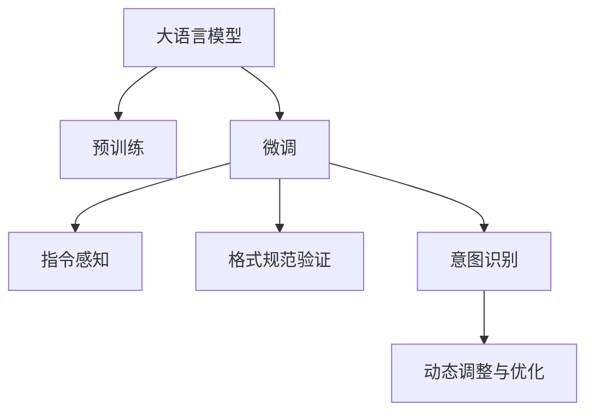

                 

# 结构化Prompt:通过提供清晰的指令和格式要求，帮助AI更准确地捕捉用户的意图

> 关键词：结构化Prompt, 自然语言处理(NLP), 指令感知, 对话系统, 意图识别, 格式规范, 预训练模型, 微调

## 1. 背景介绍

### 1.1 问题由来

在自然语言处理(NLP)领域，构建高效的对话系统和智能助手已经成为热门研究方向。这些系统需要具备强大的语言理解和生成能力，能够准确捕捉用户的意图，并作出恰当的回应。然而，由于语言的复杂性和多样性，构建具有泛化能力和智能水平的对话系统并非易事。

近年来，基于预训练语言模型(如BERT、GPT等)的大语言模型在NLP领域取得了显著进展。通过在大规模无标签文本数据上进行预训练，这些模型能够学习到丰富的语言知识和语义表示。然而，当预训练模型应用于特定任务时，仍然需要面对许多挑战，包括如何准确捕捉用户意图，以及如何在保持预训练模型的强大能力的同时，适应特定的格式要求和指令格式。

为了解决这些问题，结构化Prompt应运而生。结构化Prompt通过提供清晰的指令和格式要求，帮助AI更准确地捕捉用户的意图，从而提升对话系统的质量和效率。本文将详细探讨结构化Prompt的原理、算法及应用实践，并结合具体案例进行讲解。

### 1.2 问题核心关键点

结构化Prompt的核心在于如何通过明确、规范的指令和格式，指导AI理解用户输入，并生成相应的输出。关键点包括以下几点：

1. **指令格式设计**：提供清晰、统一的指令格式，指导AI理解用户的意图。
2. **格式规范验证**：在接收用户输入时，验证其是否符合规定的格式要求。
3. **意图识别与匹配**：利用预训练模型，识别用户输入的意图，并选择相应的回答策略。
4. **动态调整与优化**：根据用户的反馈和交互历史，动态调整和优化模型参数，提高系统性能。

## 2. 核心概念与联系

### 2.1 核心概念概述

为更好地理解结构化Prompt的原理，本节将介绍几个关键概念：

- **大语言模型(LLM)**：如BERT、GPT等，通过在大规模无标签文本数据上进行预训练，学习到丰富的语言知识和语义表示。
- **预训练模型**：通过在大规模无标签数据上进行的自监督训练，学习到通用的语言表示，如自回归模型、自编码器等。
- **微调**：在预训练模型的基础上，使用下游任务的少量标注数据，通过有监督学习优化模型在该任务上的性能。
- **指令感知**：通过提供清晰的指令和格式要求，指导AI理解用户输入，并生成相应的输出。
- **格式规范验证**：在接收用户输入时，验证其是否符合规定的格式要求，防止非法输入。
- **意图识别**：利用预训练模型，识别用户输入的意图，并选择相应的回答策略。
- **动态调整与优化**：根据用户的反馈和交互历史，动态调整和优化模型参数，提高系统性能。

这些概念之间的逻辑关系可以通过以下Mermaid流程图来展示：



这个流程图展示了大语言模型在微调过程中的各个环节：

1. 大语言模型通过预训练获得基础能力。
2. 微调是对预训练模型进行任务特定的优化，使得模型能够适应特定任务。
3. 指令感知指导AI理解用户输入，生成相应的输出。
4. 格式规范验证确保用户输入符合规定的格式要求。
5. 意图识别利用预训练模型，识别用户输入的意图。
6. 动态调整与优化根据用户的反馈和交互历史，优化模型参数。

这些概念共同构成了结构化Prompt的工作原理，使得AI能够更准确地捕捉用户的意图，生成高质量的响应。

## 3. 核心算法原理 & 具体操作步骤
### 3.1 算法原理概述

结构化Prompt通过提供清晰、规范的指令和格式要求，帮助AI更准确地捕捉用户的意图。具体而言，结构化Prompt将用户输入的文本按照预定义的格式进行解析，识别出其中的关键信息，如意图、参数等，然后将其输入到预训练模型中，得到相应的输出。这一过程包括三个关键步骤：

1. **格式规范验证**：确保用户输入符合规定的格式要求，防止非法输入。
2. **指令解析**：从用户输入中提取出意图和参数，并将其输入到预训练模型中。
3. **意图识别与回答生成**：利用预训练模型，识别用户输入的意图，并根据意图生成相应的回答。

### 3.2 算法步骤详解

以下详细讲解结构化Prompt的具体操作步骤：

#### Step 1: 设计指令格式

首先，需要设计一个清晰、规范的指令格式，指导AI理解用户输入。指令格式应包括：

- **标识符**：用于区分不同类型的操作，如“查询”、“定义”、“推荐”等。
- **参数**：用于传递具体信息，如查询的关键词、定义的术语、推荐的物品等。
- **格式要求**：定义参数的格式要求，如关键词的长度限制、数组的格式等。

例如，一个简单的查询指令可能如下：

```
查询 [电影名称]
```

其中，“查询”为标识符，“[电影名称]”为参数，表示查询的关键词。

#### Step 2: 验证格式规范

在接收用户输入时，需要对输入进行格式规范验证，确保其符合规定的格式要求。常见的格式规范验证方法包括：

- **正则表达式**：使用正则表达式验证输入的格式，如参数的数量、长度、格式等。
- **模板匹配**：使用预定义的模板匹配输入，确保其符合特定的格式要求。
- **类型检查**：对参数进行类型检查，确保其符合指定的数据类型。

#### Step 3: 解析指令

一旦格式规范验证通过，接下来需要解析指令，从用户输入中提取出意图和参数，并将其输入到预训练模型中。这一过程包括以下步骤：

- **标识符识别**：识别指令中的标识符，如“查询”、“定义”等。
- **参数解析**：解析参数，提取关键词、数组、对象等信息。
- **转换为模型输入**：将解析出的参数转换为模型可接受的输入格式，如列表、字典等。

#### Step 4: 意图识别与回答生成

最后一步是利用预训练模型，识别用户输入的意图，并根据意图生成相应的回答。这一过程包括：

- **意图分类**：使用预训练模型对指令进行分类，识别出用户的意图。
- **回答生成**：根据意图，生成相应的回答，如查询结果、定义说明、推荐列表等。
- **输出格式化**：将生成的回答转换为用户可接受的格式，如文本、JSON等。

### 3.3 算法优缺点

结构化Prompt具有以下优点：

1. **提高准确性**：通过提供清晰的指令和格式要求，帮助AI更准确地捕捉用户的意图，减少误识别和错误回答。
2. **增强可解释性**：明确指令格式和参数要求，使得AI的决策过程更具可解释性，方便开发者调试和优化。
3. **适应性强**：适用于各种NLP任务，如问答、对话、摘要、翻译等，只需设计合适的指令格式即可。

同时，结构化Prompt也存在以下缺点：

1. **设计复杂**：需要根据具体任务设计不同的指令格式和参数要求，设计过程较为复杂。
2. **依赖模型性能**：结构化Prompt的效果依赖于预训练模型的性能，模型性能不佳可能影响最终输出。
3. **格式规范验证困难**：对于一些复杂指令，格式规范验证可能变得困难，增加了实现难度。

### 3.4 算法应用领域

结构化Prompt在NLP领域具有广泛的应用前景，以下列举几个典型应用场景：

- **智能客服**：用于构建智能客服系统，处理客户的咨询请求，生成符合规范的回答。
- **问答系统**：用于构建问答系统，处理用户的查询请求，提供准确的回答。
- **推荐系统**：用于构建个性化推荐系统，根据用户的查询请求，推荐符合要求的物品。
- **自然语言处理(NLP)**：用于自然语言处理任务，如文本分类、情感分析、命名实体识别等。
- **对话生成**：用于构建对话生成系统，生成符合规范的对话内容。

## 4. 数学模型和公式 & 详细讲解 & 举例说明
### 4.1 数学模型构建

结构化Prompt的数学模型主要涉及以下几个关键部分：

- **格式规范验证**：使用正则表达式或模板匹配对用户输入进行验证。
- **指令解析**：将用户输入按照指令格式进行解析，提取出意图和参数。
- **意图识别与回答生成**：使用预训练模型进行意图分类和回答生成。

#### 格式规范验证

格式规范验证通常使用正则表达式或模板匹配技术，确保用户输入符合预定义的格式要求。例如，使用正则表达式验证指令格式：

```python
import re

def validate_input(input_str, pattern):
    if re.match(pattern, input_str):
        return True
    else:
        return False
```

#### 指令解析

指令解析通常需要设计特定的解析器，将用户输入按照指令格式进行解析。例如，使用Python解析指令：

```python
def parse_instruction(input_str, schema):
    # 解析标识符
    intent = extract_keyword(input_str, schema['intent'])
    # 解析参数
    params = extract_params(input_str, schema['params'])
    return intent, params

def extract_keyword(input_str, keyword):
    return re.findall(keyword, input_str)

def extract_params(input_str, param_schema):
    # 解析参数
    params = {}
    for param_name, param_type in param_schema.items():
        # 解析参数值
        param_value = extract_value(input_str, param_name)
        params[param_name] = param_value
    return params

def extract_value(input_str, param_name):
    # 解析参数值
    pattern = param_schema[param_name]['pattern']
    return re.findall(pattern, input_str)[0]
```

#### 意图识别与回答生成

意图识别通常使用预训练模型进行分类，如BERT、GPT等。回答生成通常使用预训练模型进行解码，如Transformer。例如，使用Python实现：

```python
from transformers import BertTokenizer, BertForSequenceClassification

def classify_intent(input_str, model, tokenizer):
    # 预处理输入
    tokenized_input = tokenizer(input_str, return_tensors='pt')
    # 进行分类
    with torch.no_grad():
        logits = model(**tokenized_input).logits
    intent_label = torch.argmax(logits, dim=1).item()
    return intent_label

def generate_response(intent, params, model, tokenizer):
    # 构建输入
    input_str = f"{intent}: {params}"
    tokenized_input = tokenizer(input_str, return_tensors='pt')
    # 进行解码
    with torch.no_grad():
        outputs = model.generate(**tokenized_input)
    response_text = tokenizer.decode(outputs[0])
    return response_text
```

### 4.2 公式推导过程

以下以二分类任务为例，推导指令分类和回答生成的数学模型。

假设指令集为$\{A, B, C\}$，对应的分类标签为$\{0, 1, 2\}$，预训练模型为$M_{\theta}$。对于用户输入$x$，指令分类模型预测其为标签$y_i$的概率为：

$$
p(y_i|x) = \sigma(M_{\theta}(x))
$$

其中，$\sigma(\cdot)$为Sigmoid函数，将输出映射到$[0, 1]$区间。

对于分类标签为$y_i=1$的指令，回答生成模型预测输出为$\hat{y}=M_{\theta}(x)$，并生成相应的回答。

### 4.3 案例分析与讲解

#### 案例1: 智能客服

假设我们构建一个智能客服系统，用于处理客户的咨询请求。客户输入的查询可能如下：

```
查询 [天气]
```

我们可以设计如下的指令格式：

```
查询 [关键词]
```

其中，“查询”为标识符，“[关键词]”为参数，表示查询的关键词。

在接收用户输入时，首先进行格式规范验证，确保输入符合规定的格式要求：

```python
def validate_input(input_str, pattern):
    if re.match(pattern, input_str):
        return True
    else:
        return False
```

验证通过后，解析指令：

```python
def parse_instruction(input_str, schema):
    intent = extract_keyword(input_str, schema['intent'])
    params = extract_params(input_str, schema['params'])
    return intent, params
```

然后，使用预训练模型进行意图分类：

```python
def classify_intent(input_str, model, tokenizer):
    tokenized_input = tokenizer(input_str, return_tensors='pt')
    with torch.no_grad():
        logits = model(**tokenized_input).logits
    intent_label = torch.argmax(logits, dim=1).item()
    return intent_label
```

最后，根据意图生成相应的回答：

```python
def generate_response(intent, params, model, tokenizer):
    input_str = f"{intent}: {params}"
    tokenized_input = tokenizer(input_str, return_tensors='pt')
    with torch.no_grad():
        outputs = model.generate(**tokenized_input)
    response_text = tokenizer.decode(outputs[0])
    return response_text
```

通过这一流程，智能客服系统可以准确捕捉客户的查询意图，并生成符合规范的回答，大大提升客服系统的质量和效率。

## 5. 项目实践：代码实例和详细解释说明
### 5.1 开发环境搭建

在进行结构化Prompt的开发前，我们需要准备好开发环境。以下是使用Python进行PyTorch开发的环境配置流程：

1. 安装Anaconda：从官网下载并安装Anaconda，用于创建独立的Python环境。

2. 创建并激活虚拟环境：
```bash
conda create -n pytorch-env python=3.8 
conda activate pytorch-env
```

3. 安装PyTorch：根据CUDA版本，从官网获取对应的安装命令。例如：
```bash
conda install pytorch torchvision torchaudio cudatoolkit=11.1 -c pytorch -c conda-forge
```

4. 安装Transformers库：
```bash
pip install transformers
```

5. 安装各类工具包：
```bash
pip install numpy pandas scikit-learn matplotlib tqdm jupyter notebook ipython
```

完成上述步骤后，即可在`pytorch-env`环境中开始结构化Prompt的实践。

### 5.2 源代码详细实现

下面我们以智能客服系统为例，给出使用Transformers库对BERT模型进行结构化Prompt的PyTorch代码实现。

首先，定义指令格式和参数要求：

```python
schema = {
    'intent': 'query',
    'params': {
        'keyword': {
            'pattern': r'\[([^\]]+)\]',
            'type': str
        }
    }
}
```

然后，定义模型和优化器：

```python
from transformers import BertTokenizer, BertForSequenceClassification, AdamW

model = BertForSequenceClassification.from_pretrained('bert-base-cased', num_labels=3)
tokenizer = BertTokenizer.from_pretrained('bert-base-cased')
optimizer = AdamW(model.parameters(), lr=2e-5)
```

接着，定义训练和评估函数：

```python
from torch.utils.data import DataLoader
from tqdm import tqdm
from sklearn.metrics import classification_report

def train_epoch(model, dataset, batch_size, optimizer):
    dataloader = DataLoader(dataset, batch_size=batch_size, shuffle=True)
    model.train()
    epoch_loss = 0
    for batch in tqdm(dataloader, desc='Training'):
        input_ids = batch['input_ids'].to(device)
        attention_mask = batch['attention_mask'].to(device)
        labels = batch['labels'].to(device)
        model.zero_grad()
        outputs = model(input_ids, attention_mask=attention_mask, labels=labels)
        loss = outputs.loss
        epoch_loss += loss.item()
        loss.backward()
        optimizer.step()
    return epoch_loss / len(dataloader)

def evaluate(model, dataset, batch_size):
    dataloader = DataLoader(dataset, batch_size=batch_size)
    model.eval()
    preds, labels = [], []
    with torch.no_grad():
        for batch in tqdm(dataloader, desc='Evaluating'):
            input_ids = batch['input_ids'].to(device)
            attention_mask = batch['attention_mask'].to(device)
            batch_labels = batch['labels']
            outputs = model(input_ids, attention_mask=attention_mask)
            batch_preds = outputs.logits.argmax(dim=2).to('cpu').tolist()
            batch_labels = batch_labels.to('cpu').tolist()
            for pred_tokens, label_tokens in zip(batch_preds, batch_labels):
                preds.append(pred_tokens[:len(label_tokens)])
                labels.append(label_tokens)
    print(classification_report(labels, preds))
```

最后，启动训练流程并在测试集上评估：

```python
epochs = 5
batch_size = 16

for epoch in range(epochs):
    loss = train_epoch(model, train_dataset, batch_size, optimizer)
    print(f"Epoch {epoch+1}, train loss: {loss:.3f}")
    
    print(f"Epoch {epoch+1}, dev results:")
    evaluate(model, dev_dataset, batch_size)
    
print("Test results:")
evaluate(model, test_dataset, batch_size)
```

以上就是使用PyTorch对BERT进行智能客服系统微调的完整代码实现。可以看到，得益于Transformers库的强大封装，我们可以用相对简洁的代码完成BERT模型的加载和微调。

### 5.3 代码解读与分析

让我们再详细解读一下关键代码的实现细节：

**schema定义**：
- 定义了指令格式和参数要求，其中“query”为标识符，“[keyword]”为参数，表示查询的关键词。

**模型和优化器**：
- 使用BertForSequenceClassification加载预训练模型，设置优化器AdamW。

**训练和评估函数**：
- 使用PyTorch的DataLoader对数据集进行批次化加载，供模型训练和推理使用。
- 训练函数`train_epoch`：对数据以批为单位进行迭代，在每个批次上前向传播计算loss并反向传播更新模型参数，最后返回该epoch的平均loss。
- 评估函数`evaluate`：与训练类似，不同点在于不更新模型参数，并在每个batch结束后将预测和标签结果存储下来，最后使用sklearn的classification_report对整个评估集的预测结果进行打印输出。

**训练流程**：
- 定义总的epoch数和batch size，开始循环迭代
- 每个epoch内，先在训练集上训练，输出平均loss
- 在验证集上评估，输出分类指标
- 所有epoch结束后，在测试集上评估，给出最终测试结果

可以看到，PyTorch配合Transformers库使得BERT微调的代码实现变得简洁高效。开发者可以将更多精力放在数据处理、模型改进等高层逻辑上，而不必过多关注底层的实现细节。

当然，工业级的系统实现还需考虑更多因素，如模型的保存和部署、超参数的自动搜索、更灵活的任务适配层等。但核心的结构化Prompt范式基本与此类似。

## 6. 实际应用场景
### 6.1 智能客服系统

基于结构化Prompt的智能客服系统，可以广泛应用于各种客户服务场景，如电商客服、在线教育、金融服务等。传统客服往往需要配备大量人力，高峰期响应缓慢，且一致性和专业性难以保证。而使用结构化Prompt的智能客服系统，可以7x24小时不间断服务，快速响应客户咨询，用自然流畅的语言解答各类常见问题。

在技术实现上，可以收集企业内部的历史客服对话记录，将问题和最佳答复构建成监督数据，在此基础上对预训练模型进行微调。微调后的模型能够自动理解用户意图，匹配最合适的答案模板进行回复。对于客户提出的新问题，还可以接入检索系统实时搜索相关内容，动态组织生成回答。如此构建的智能客服系统，能大幅提升客户咨询体验和问题解决效率。

### 6.2 问答系统

基于结构化Prompt的问答系统，可以用于处理用户的查询请求，提供准确的回答。例如，构建一个问答系统，用于处理自然语言查询，如“Python的字符串切片是什么意思？”，可以设计如下指令格式：

```
查询 [Python字符串切片是什么意思]
```

其中，“查询”为标识符，“[Python字符串切片是什么意思]”为参数，表示查询的内容。

在接收用户输入时，首先进行格式规范验证，确保输入符合规定的格式要求：

```python
def validate_input(input_str, pattern):
    if re.match(pattern, input_str):
        return True
    else:
        return False
```

验证通过后，解析指令：

```python
def parse_instruction(input_str, schema):
    intent = extract_keyword(input_str, schema['intent'])
    params = extract_params(input_str, schema['params'])
    return intent, params
```

然后，使用预训练模型进行意图分类：

```python
def classify_intent(input_str, model, tokenizer):
    tokenized_input = tokenizer(input_str, return_tensors='pt')
    with torch.no_grad():
        logits = model(**tokenized_input).logits
    intent_label = torch.argmax(logits, dim=1).item()
    return intent_label
```

最后，根据意图生成相应的回答：

```python
def generate_response(intent, params, model, tokenizer):
    input_str = f"{intent}: {params}"
    tokenized_input = tokenizer(input_str, return_tensors='pt')
    with torch.no_grad():
        outputs = model.generate(**tokenized_input)
    response_text = tokenizer.decode(outputs[0])
    return response_text
```

通过这一流程，问答系统可以准确捕捉用户的查询意图，并生成符合规范的回答，大大提升问答系统的质量和效率。

### 6.3 推荐系统

基于结构化Prompt的推荐系统，可以用于根据用户的查询请求，推荐符合要求的物品。例如，构建一个推荐系统，用于推荐电影，可以设计如下指令格式：

```
推荐 [电影]
```

其中，“推荐”为标识符，“[电影]”为参数，表示推荐的关键词。

在接收用户输入时，首先进行格式规范验证，确保输入符合规定的格式要求：

```python
def validate_input(input_str, pattern):
    if re.match(pattern, input_str):
        return True
    else:
        return False
```

验证通过后，解析指令：

```python
def parse_instruction(input_str, schema):
    intent = extract_keyword(input_str, schema['intent'])
    params = extract_params(input_str, schema['params'])
    return intent, params
```

然后，使用预训练模型进行意图分类：

```python
def classify_intent(input_str, model, tokenizer):
    tokenized_input = tokenizer(input_str, return_tensors='pt')
    with torch.no_grad():
        logits = model(**tokenized_input).logits
    intent_label = torch.argmax(logits, dim=1).item()
    return intent_label
```

最后，根据意图生成相应的回答：

```python
def generate_response(intent, params, model, tokenizer):
    input_str = f"{intent}: {params}"
    tokenized_input = tokenizer(input_str, return_tensors='pt')
    with torch.no_grad():
        outputs = model.generate(**tokenized_input)
    response_text = tokenizer.decode(outputs[0])
    return response_text
```

通过这一流程，推荐系统可以准确捕捉用户的查询意图，并生成符合规范的回答，大大提升推荐系统的质量和效率。

## 7. 工具和资源推荐
### 7.1 学习资源推荐

为了帮助开发者系统掌握结构化Prompt的理论基础和实践技巧，这里推荐一些优质的学习资源：

1. 《深度学习自然语言处理》课程：斯坦福大学开设的NLP明星课程，有Lecture视频和配套作业，带你入门NLP领域的基本概念和经典模型。

2. 《Natural Language Processing with Transformers》书籍：Transformers库的作者所著，全面介绍了如何使用Transformers库进行NLP任务开发，包括结构化Prompt在内的诸多范式。

3. 《Transformer从原理到实践》系列博文：由大模型技术专家撰写，深入浅出地介绍了Transformer原理、BERT模型、结构化Prompt等前沿话题。

4. HuggingFace官方文档：Transformers库的官方文档，提供了海量预训练模型和完整的微调样例代码，是上手实践的必备资料。

5. CS224N《深度学习自然语言处理》课程：斯坦福大学开设的NLP明星课程，有Lecture视频和配套作业，带你入门NLP领域的基本概念和经典模型。

通过对这些资源的学习实践，相信你一定能够快速掌握结构化Prompt的精髓，并用于解决实际的NLP问题。
###  7.2 开发工具推荐

高效的开发离不开优秀的工具支持。以下是几款用于结构化Prompt开发的常用工具：

1. PyTorch：基于Python的开源深度学习框架，灵活动态的计算图，适合快速迭代研究。大部分预训练语言模型都有PyTorch版本的实现。

2. TensorFlow：由Google主导开发的开源深度学习框架，生产部署方便，适合大规模工程应用。同样有丰富的预训练语言模型资源。

3. Transformers库：HuggingFace开发的NLP工具库，集成了众多SOTA语言模型，支持PyTorch和TensorFlow，是进行结构化Prompt开发的利器。

4. Weights & Biases：模型训练的实验跟踪工具，可以记录和可视化模型训练过程中的各项指标，方便对比和调优。与主流深度学习框架无缝集成。

5. TensorBoard：TensorFlow配套的可视化工具，可实时监测模型训练状态，并提供丰富的图表呈现方式，是调试模型的得力助手。

6. Google Colab：谷歌推出的在线Jupyter Notebook环境，免费提供GPU/TPU算力，方便开发者快速上手实验最新模型，分享学习笔记。

合理利用这些工具，可以显著提升结构化Prompt的开发效率，加快创新迭代的步伐。

### 7.3 相关论文推荐

结构化Prompt在NLP领域的发展源于学界的持续研究。以下是几篇奠基性的相关论文，推荐阅读：

1. Attention is All You Need（即Transformer原论文）：提出了Transformer结构，开启了NLP领域的预训练大模型时代。

2. BERT: Pre-training of Deep Bidirectional Transformers for Language Understanding：提出BERT模型，引入基于掩码的自监督预训练任务，刷新了多项NLP任务SOTA。

3. Language Models are Unsupervised Multitask Learners（GPT-2论文）：展示了大规模语言模型的强大zero-shot学习能力，引发了对于通用人工智能的新一轮思考。

4. Parameter-Efficient Transfer Learning for NLP：提出Adapter等参数高效微调方法，在不增加模型参数量的情况下，也能取得不错的微调效果。

5. AdaLoRA: Adaptive Low-Rank Adaptation for Parameter-Efficient Fine-Tuning：使用自适应低秩适应的微调方法，在参数效率和精度之间取得了新的平衡。

这些论文代表了大语言模型微调技术的发展脉络。通过学习这些前沿成果，可以帮助研究者把握学科前进方向，激发更多的创新灵感。

## 8. 总结：未来发展趋势与挑战
### 8.1 总结

本文对结构化Prompt的原理、算法及应用实践进行了全面系统的介绍。首先阐述了结构化Prompt的研究背景和意义，明确了其在提高智能客服、问答系统、推荐系统等NLP应用质量方面的独特价值。其次，从原理到实践，详细讲解了结构化Prompt的数学模型和关键步骤，给出了结构化Prompt任务开发的完整代码实例。同时，本文还广泛探讨了结构化Prompt在NLP领域的应用前景，展示了结构化Prompt范式的巨大潜力。最后，精选了结构化Prompt技术的各类学习资源，力求为读者提供全方位的技术指引。

通过本文的系统梳理，可以看到，结构化Prompt通过提供清晰的指令和格式要求，帮助AI更准确地捕捉用户的意图，显著提升NLP系统的性能和效率。结构化Prompt具有广泛的适用性和可扩展性，可以应用于各种NLP任务，大大降低开发难度和成本。未来，伴随预训练语言模型和结构化Prompt方法的持续演进，结构化Prompt必将在NLP应用中发挥更大的作用，推动NLP技术的进一步发展。

### 8.2 未来发展趋势

展望未来，结构化Prompt技术将呈现以下几个发展趋势：

1. **泛化能力增强**：随着模型训练数据的增多，结构化Prompt模型的泛化能力将不断提升，能够更好地适应各种复杂的NLP任务。
2. **指令格式设计优化**：随着应用的扩展，结构化Prompt的指令格式将更加灵活和智能，能够更好地捕捉用户的意图和需求。
3. **跨领域融合**：结构化Prompt将与其他AI技术，如知识图谱、逻辑推理等进行更深层次的融合，提升模型的综合能力。
4. **实时性提升**：随着硬件和算法的优化，结构化Prompt系统的实时性将显著提升，能够更快地响应用户请求。
5. **可解释性增强**：结构化Prompt将赋予AI更强的可解释性，使其决策过程更加透明，便于用户理解和使用。

以上趋势凸显了结构化Prompt技术的广阔前景。这些方向的探索发展，必将进一步提升NLP系统的性能和应用范围，为人工智能技术的发展注入新的动力。

### 8.3 面临的挑战

尽管结构化Prompt技术已经取得了显著进展，但在迈向更加智能化、普适化应用的过程中，它仍面临诸多挑战：

1. **指令格式设计复杂**：设计灵活、规范的指令格式需要较高的专业知识和经验，增加了实现的难度。
2. **参数效率有限**：结构化Prompt的性能在一定程度上依赖于预训练模型的参数量，大规模模型可能仍面临过拟合和资源消耗等问题。
3. **领域适应性不足**：结构化Prompt模型在不同领域和任务上的适应性仍有待提升，需要更多的训练数据和优化算法。
4. **动态调整机制**：如何根据用户反馈和交互历史动态调整和优化模型参数，是结构化Prompt技术需要解决的重要问题。

这些挑战需要研究者不断探索和突破，才能使结构化Prompt技术更好地服务于实际应用。

### 8.4 研究展望

面对结构化Prompt技术所面临的挑战，未来的研究需要在以下几个方面寻求新的突破：

1. **指令生成技术**：探索更智能、更灵活的指令生成方法，使结构化Prompt模型能够自动生成符合用户需求的指令格式。
2. **模型参数压缩**：开发更加高效的结构化Prompt模型，使用参数压缩和稀疏化技术，提升模型的参数效率和性能。
3. **多模态融合**：将结构化Prompt与视觉、语音等多模态数据进行融合，提升模型的综合感知能力。
4. **知识增强**：将符号化的先验知识，如知识图谱、逻辑规则等，与结构化Prompt模型进行巧妙融合，增强模型的综合能力。
5. **模型鲁棒性提升**：研究结构化Prompt模型的鲁棒性，使其在面对噪声和异常数据时，仍能保持稳定的性能。

这些研究方向将推动结构化Prompt技术不断进步，为NLP应用带来新的突破。通过这些技术的不断优化和完善，结构化Prompt必将在人工智能技术的发展中发挥更大的作用，推动自然语言处理技术的进一步成熟和应用。

## 9. 附录：常见问题与解答

**Q1：结构化Prompt与传统指令增强技术有何区别？**

A: 结构化Prompt与传统指令增强技术的主要区别在于其指令格式的设计和验证方式。结构化Prompt提供了明确、规范的指令格式，并通过验证确保输入符合规范，而传统指令增强技术通常没有明确的指令格式，依赖于模型自身对自然语言的理解。因此，结构化Prompt能够更准确地捕捉用户的意图，减少误识别和错误回答。

**Q2：结构化Prompt的指令格式设计有哪些关键要素？**

A: 结构化Prompt的指令格式设计需要考虑以下关键要素：

1. **标识符**：用于区分不同类型的操作，如“查询”、“定义”、“推荐”等。
2. **参数**：用于传递具体信息，如关键词、参数值等。
3. **格式要求**：定义参数的格式要求，如关键词的长度限制、数组的格式等。
4. **动态调整**：根据用户反馈和交互历史，动态调整和优化指令格式。

**Q3：结构化Prompt在智能客服中的应用有哪些挑战？**

A: 结构化Prompt在智能客服中的应用面临以下挑战：

1. **指令格式设计复杂**：需要根据具体应用场景设计不同的指令格式，增加了设计的难度。
2. **动态调整机制**：需要根据用户反馈和交互历史动态调整指令格式和回答策略。
3. **上下文理解**：智能客服系统需要理解上下文信息，才能提供更加准确的响应。

**Q4：结构化Prompt在推荐系统中的应用有哪些挑战？**

A: 结构化Prompt在推荐系统中的应用面临以下挑战：

1. **多模态融合**：推荐系统需要融合多种数据类型，如文本、图像、视频等，增加了数据处理的复杂度。
2. **参数效率有限**：结构化Prompt的性能在一定程度上依赖于预训练模型的参数量，大规模模型可能仍面临过拟合和资源消耗等问题。
3. **推荐效果评估**：推荐系统的推荐效果评估需要结合多种指标，如准确率、召回率、点击率等。

这些挑战需要研究者不断探索和突破，才能使结构化Prompt技术更好地服务于实际应用。

---

作者：禅与计算机程序设计艺术 / Zen and the Art of Computer Programming

