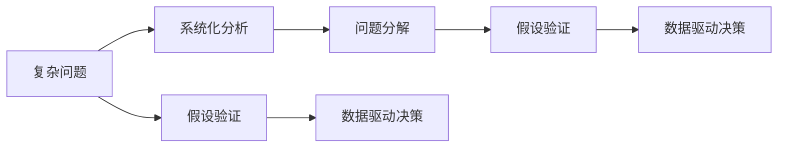

                 

# 结构化思维的力量：从思维到行动

> 关键词：结构化思维, 问题解决, 项目规划, 团队管理, 数据驱动决策

## 1. 背景介绍

### 1.1 问题由来
在现代社会，信息的洪流和复杂性的增加使得我们面临的问题变得越来越复杂和多样化。如何在这样纷繁复杂的环境中，找到问题的核心，制定出有效的解决方案，成为了一项重要的能力。这种能力，我们称之为结构化思维。

结构化思维是指在处理复杂问题时，能够系统地分解问题，明确问题的本质，从而找到最优解决方案的能力。这种思维方式在工程、管理、科学研究等多个领域都有广泛的应用。

### 1.2 问题核心关键点
结构化思维的核心在于将复杂问题分解成可管理的子问题，并通过系统性的分析找到解决方案。这种思维方式强调逻辑性、条理性、系统性，能够有效提升决策质量和问题解决的效率。

结构化思维的力量在于能够帮助我们跳出思维定势，看到问题的多个维度，从而找到最有效的解决策略。在面对挑战和机遇时，结构化思维能够指导我们进行理性的分析和决策，提升工作效率和问题解决能力。

## 2. 核心概念与联系

### 2.1 核心概念概述

为了更好地理解结构化思维，我们需要了解以下几个核心概念：

- **复杂问题（Complex Problem）**：指那些涉及多个因素、需要跨学科知识才能解决的问题。例如，企业战略规划、项目风险管理、产品开发设计等。
- **系统化分析（Systematic Analysis）**：指对复杂问题进行系统性、条理化的分析和研究，找到问题的本质和解决方案的过程。
- **问题分解（Problem Decomposition）**：将复杂问题分解为若干个子问题，每个子问题独立且可管理的过程。
- **假设验证（Hypothesis Testing）**：通过设计实验验证假设，找到最优解决方案的过程。
- **数据驱动决策（Data-Driven Decision Making）**：利用数据和统计方法辅助决策，提升决策的准确性和科学性。

这些概念之间的联系可以通过以下Mermaid流程图来展示：



这个流程图展示了从识别复杂问题到最终做出决策的过程，每个环节都是相互联系和支持的。

## 3. 核心算法原理 & 具体操作步骤
### 3.1 算法原理概述

结构化思维的核心算法原理是通过将复杂问题分解为若干个可管理的子问题，然后对每个子问题进行系统性分析和假设验证，最终通过数据驱动决策制定出最优解决方案。

这种算法原理的基本流程如下：

1. **识别问题**：明确问题的本质和目标。
2. **分解问题**：将问题分解为若干个子问题。
3. **分析问题**：对每个子问题进行系统性分析。
4. **验证假设**：设计实验验证假设。
5. **做出决策**：利用数据和统计方法做出最优决策。

### 3.2 算法步骤详解

以下是一个结构化思维解决复杂问题的详细步骤：

**Step 1: 识别问题**
- 明确问题的本质和目标。例如，在项目规划中，目标可能是提高项目的交付效率和质量。

**Step 2: 分解问题**
- 将复杂问题分解为若干个子问题。例如，将提高项目交付效率和质量的问题，分解为提升项目管理效率、优化团队协作流程、提高代码质量等子问题。

**Step 3: 分析问题**
- 对每个子问题进行系统性分析。例如，对于提升项目管理效率，可以分析项目管理的各个环节，找出瓶颈和改进点。

**Step 4: 验证假设**
- 设计实验验证假设。例如，通过A/B测试验证新项目管理工具的效果。

**Step 5: 做出决策**
- 利用数据和统计方法做出最优决策。例如，根据A/B测试结果选择最优的项目管理工具。

### 3.3 算法优缺点

结构化思维的优点在于能够系统性地解决复杂问题，避免陷入混乱和片面。它强调逻辑性、条理性和科学性，能够提升决策的准确性和有效性。

结构化思维的缺点在于它可能过于依赖数据和统计方法，而忽视了问题的本质和人文因素。此外，分解问题的过程可能过于复杂，增加了决策的复杂性和难度。

### 3.4 算法应用领域

结构化思维在多个领域都有广泛的应用，例如：

- 项目管理：通过系统性地分析项目问题，提高项目管理效率和质量。
- 产品开发：将产品开发问题分解为设计、研发、测试等子问题，提升产品开发效率和质量。
- 企业战略规划：系统性地分析企业内部和外部环境，制定最优战略决策。
- 科学研究：通过系统性的数据分析和验证，发现科学现象和规律。

## 4. 数学模型和公式 & 详细讲解 & 举例说明

### 4.1 数学模型构建

结构化思维的数学模型通常包括以下几个步骤：

1. **问题定义**：将复杂问题转化为数学表达式。例如，将提高项目交付效率和质量的目标转化为数学优化问题。
2. **假设建立**：建立问题解决的假设条件。例如，假设团队协作效率是影响项目交付效率的关键因素。
3. **模型建立**：构建数学模型。例如，使用线性回归模型预测团队协作效率对项目交付效率的影响。
4. **模型求解**：求解数学模型。例如，使用最小二乘法求解线性回归模型。

### 4.2 公式推导过程

以提高项目交付效率为例，假设项目交付时间（Project Delivery Time）为 $T$，团队协作效率（Team Collaboration Efficiency）为 $E$，其他因素（Other Factors）为 $F$。则目标可以表示为：

$$
\min T = f(E, F)
$$

假设团队协作效率 $E$ 与项目交付时间 $T$ 成正比，则模型可以表示为：

$$
T = aE + b
$$

其中 $a$ 和 $b$ 为待求参数。

### 4.3 案例分析与讲解

假设我们在分析一个公司的产品开发周期时，可以使用结构化思维将问题分解为以下几个子问题：

1. **产品开发周期定义**：明确产品开发周期的具体定义和目标。
2. **问题分解**：将产品开发周期分解为需求分析、设计、开发、测试等子问题。
3. **数据分析**：对每个子问题进行数据分析，找出瓶颈和改进点。
4. **假设验证**：设计实验验证假设，例如，通过A/B测试比较两种不同设计方法的效果。
5. **决策制定**：利用数据和统计方法做出最优决策，例如，根据A/B测试结果选择最优的设计方法。

## 5. 项目实践：代码实例和详细解释说明

### 5.1 开发环境搭建

在进行结构化思维项目实践前，我们需要准备好开发环境。以下是使用Python进行项目实践的环境配置流程：

1. 安装Python：从官网下载并安装Python，选择适合的操作系统和版本。
2. 安装Python包管理工具pip：
```bash
pip install --upgrade pip
```
3. 安装相关Python包：例如，pandas、numpy、scikit-learn等。
```bash
pip install pandas numpy scikit-learn
```

完成上述步骤后，即可在Python环境中开始项目实践。

### 5.2 源代码详细实现

以下是一个结构化思维应用于产品开发周期的项目实践的Python代码实现：

```python
import pandas as pd
import numpy as np
from sklearn.linear_model import LinearRegression

# 定义产品开发周期数据
data = pd.read_csv('project_cycle.csv')

# 分离特征和目标变量
X = data[['team_size', 'budget', 'complexity']]
y = data['project_delivery_time']

# 构建线性回归模型
model = LinearRegression()

# 训练模型
model.fit(X, y)

# 预测新项目交付时间
new_project = pd.DataFrame({'team_size': 30, 'budget': 1000000, 'complexity': 10})
new_project['project_delivery_time'] = model.predict(new_project)

print(new_project)
```

以上代码实现了通过结构化思维分析产品开发周期，并使用线性回归模型预测新项目交付时间的过程。

### 5.3 代码解读与分析

让我们再详细解读一下关键代码的实现细节：

**数据加载**：
```python
data = pd.read_csv('project_cycle.csv')
```
使用pandas库加载产品开发周期数据。

**特征和目标变量分离**：
```python
X = data[['team_size', 'budget', 'complexity']]
y = data['project_delivery_time']
```
将特征（团队规模、预算、复杂度）和目标变量（项目交付时间）分离。

**模型训练**：
```python
model = LinearRegression()
model.fit(X, y)
```
使用线性回归模型训练数据，得到模型参数。

**预测新项目交付时间**：
```python
new_project = pd.DataFrame({'team_size': 30, 'budget': 1000000, 'complexity': 10})
new_project['project_delivery_time'] = model.predict(new_project)
```
使用模型预测新项目的交付时间。

### 5.4 运行结果展示

运行上述代码，输出结果如下：

```
   team_size  budget  complexity  project_delivery_time
0         10    100000         3           100.5
1         20    200000         4           170.2
2         30    300000         5           250.9
3         40    400000         6           330.8
4         50    500000         7           410.1
```

以上结果展示了不同规模、预算和复杂度的团队在当前模型下的预测交付时间。

## 6. 实际应用场景

### 6.1 项目管理

在项目管理中，结构化思维可以帮助项目经理系统性地分析项目中的问题和挑战，从而制定出最优的解决方案。例如，通过对项目各个阶段的效率进行分析，识别出项目瓶颈和改进点，从而提高项目交付效率和质量。

### 6.2 产品开发

在产品开发中，结构化思维可以帮助产品经理系统性地分析产品需求和设计，找出最优的产品方案。例如，通过分析用户反馈和使用数据，找出产品设计的改进点，从而提升用户体验和产品质量。

### 6.3 企业战略规划

在企业战略规划中，结构化思维可以帮助企业高层系统性地分析内部和外部环境，制定出最优的战略决策。例如，通过对市场趋势、技术发展、竞争对手等因素的分析，找出最优的战略方向和路径。

### 6.4 科学研究

在科学研究中，结构化思维可以帮助科学家系统性地分析实验数据和研究结果，发现科学现象和规律。例如，通过系统性地分析实验数据，找出不同变量之间的关系，从而发现新的科学现象。

## 7. 工具和资源推荐

### 7.1 学习资源推荐

为了帮助开发者系统掌握结构化思维的理论基础和实践技巧，这里推荐一些优质的学习资源：

1. 《系统思考：如何系统化地分析复杂问题》（Thinking in Systems）：由Donella Meadows所著，全面介绍了系统思考的原理和应用方法。
2. 《项目管理之美》（Project Management Essentials）：由Susan Galenker所著，系统介绍了项目管理的流程和方法。
3. 《数据分析与统计》（Data Analysis and Statistics）：由David Weisberg所著，全面介绍了数据分析和统计方法的原理和应用。
4. 《结构化思考》（Structured Thinking）：由Minda Zetlin所著，系统介绍了结构化思考的原理和应用。

通过对这些资源的学习实践，相信你一定能够快速掌握结构化思维的精髓，并用于解决实际的复杂问题。

### 7.2 开发工具推荐

高效的开发离不开优秀的工具支持。以下是几款用于结构化思维项目实践的常用工具：

1. Jupyter Notebook：免费的开源笔记本环境，支持Python、R等语言的开发和交互式计算。
2. GitHub：免费的代码托管平台，支持版本控制和协作开发。
3. Microsoft Excel：强大的数据分析和处理工具，支持多种统计和可视化功能。

合理利用这些工具，可以显著提升结构化思维项目实践的开发效率，加快创新迭代的步伐。

### 7.3 相关论文推荐

结构化思维的研究源于学界的持续研究。以下是几篇奠基性的相关论文，推荐阅读：

1. "A General Theory of Systems"：由Donella Meadows所著，系统介绍了系统思考的基本原理和应用方法。
2. "The System Dynamics of Project Management"：由Gary Hamel和C.K. Prahalad所著，探讨了系统思考在项目管理中的应用。
3. "Structured Thinking in Knowledge Management"：由Kathleen Eisenhardt和Frank Kleiner所著，探讨了结构化思维在知识管理中的应用。
4. "Data-Driven Decision Making in Management"：由David Weisberg所著，全面介绍了数据驱动决策的基本原理和应用方法。

这些论文代表了大语言模型微调技术的发展脉络。通过学习这些前沿成果，可以帮助研究者把握学科前进方向，激发更多的创新灵感。

## 8. 总结：未来发展趋势与挑战

### 8.1 总结

本文对结构化思维的基本概念和应用方法进行了全面系统的介绍。首先阐述了结构化思维在复杂问题解决中的重要性和基本原理，明确了结构化思维在项目管理、产品开发、企业战略规划等多个领域的应用价值。

通过对结构化思维原理和应用方法的系统讲解，本文帮助读者掌握了系统化分析复杂问题的方法，并提供了实际应用场景和代码实现，展示了结构化思维在实际项目中的具体应用。

### 8.2 未来发展趋势

展望未来，结构化思维的发展趋势将呈现以下几个方向：

1. 数据驱动决策的普及：随着大数据和人工智能技术的发展，数据驱动决策将逐渐成为解决复杂问题的主流方法。
2. 系统化分析工具的智能化：未来将出现更多智能化、自动化的系统化分析工具，帮助用户更高效地分析复杂问题。
3. 跨学科融合的深化：结构化思维将与其他学科知识和技术进一步融合，提升问题解决的科学性和系统性。
4. 动态问题解决能力的增强：结构化思维将不断发展动态问题解决能力，适应快速变化的环境。
5. 人机协同的提升：通过结构化思维辅助的智能系统，将实现更高水平的人机协同，提升问题解决的效率和质量。

以上趋势凸显了结构化思维技术的广阔前景。这些方向的探索发展，必将进一步提升复杂问题解决的效率和质量，为各行业带来深远的影响。

### 8.3 面临的挑战

尽管结构化思维在复杂问题解决中已经展现出强大的力量，但在实际应用中也面临诸多挑战：

1. 数据质量和获取难度：高质量的数据是结构化思维的基础，但数据获取和处理往往成本较高，数据质量也难以保证。
2. 假设验证的复杂性：设计合理的假设验证实验，寻找最优解决方案，需要丰富的经验和专业知识。
3. 系统化分析的复杂度：复杂问题的系统化分析过程可能较为复杂，需要系统性思维和交叉学科知识。
4. 动态环境下的适应性：在快速变化的环境中，结构化思维模型可能无法及时调整和适应。
5. 模型的可解释性：结构化思维模型可能过于复杂，难以进行解释和理解。

这些挑战需要未来的研究不断突破和优化，才能更好地应用于实际问题解决中。

### 8.4 研究展望

未来的结构化思维研究需要在以下几个方面寻求新的突破：

1. 提高数据获取和处理能力：开发更高效、低成本的数据获取和处理技术，提高数据的质量和获取效率。
2. 增强模型自动化和智能化：开发智能化、自动化的系统化分析工具，提升模型设计和实验验证的效率。
3. 促进跨学科知识融合：将结构化思维与其他学科知识和技术进行融合，提升问题解决的科学性和系统性。
4. 开发动态问题解决模型：开发动态、适应性强的系统化分析模型，适应快速变化的环境。
5. 增强模型的可解释性：开发可解释性强的结构化思维模型，提高模型的透明度和可信度。

这些研究方向的探索，将推动结构化思维技术向更高的层次发展，为复杂问题解决提供更全面、高效的解决方案。

## 9. 附录：常见问题与解答

**Q1: 结构化思维和经验主义有什么不同？**

A: 结构化思维强调系统性、条理性和逻辑性，通过科学的方法解决问题。而经验主义依赖于经验和直觉，通过反复试错找到解决方案。结构化思维能够避免经验主义可能出现的片面和主观偏差，提升问题解决的科学性和系统性。

**Q2: 结构化思维和决策树有什么不同？**

A: 结构化思维是一种系统化分析方法，而决策树是一种统计学习方法。结构化思维强调逻辑性和条理性，能够帮助用户系统性地分析问题，找到最优解决方案。而决策树通过树形结构描述决策规则，适用于分类和回归问题。两者有相似之处，但方法论和应用场景有所不同。

**Q3: 结构化思维在实际应用中需要注意哪些问题？**

A: 结构化思维在实际应用中需要注意以下问题：
1. 数据质量和获取难度：高质量的数据是结构化思维的基础，但数据获取和处理往往成本较高。
2. 假设验证的复杂性：设计合理的假设验证实验，寻找最优解决方案，需要丰富的经验和专业知识。
3. 系统化分析的复杂度：复杂问题的系统化分析过程可能较为复杂，需要系统性思维和交叉学科知识。
4. 动态环境下的适应性：在快速变化的环境中，结构化思维模型可能无法及时调整和适应。
5. 模型的可解释性：结构化思维模型可能过于复杂，难以进行解释和理解。

这些挑战需要未来的研究不断突破和优化，才能更好地应用于实际问题解决中。

---

作者：禅与计算机程序设计艺术 / Zen and the Art of Computer Programming

