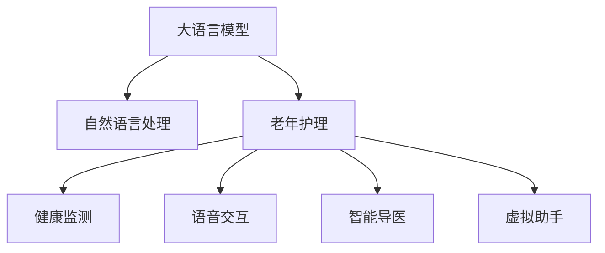

                 

# 老年护理和 LLM：改善生活质量

> 关键词：长寿命, 人工智能, 老年护理, 自然语言处理, 改善生活质量, 技术应用

## 1. 背景介绍

随着全球人口老龄化趋势的加剧，如何提高老年人的生活质量和健康水平，成为各国政府和医疗机构亟待解决的重要课题。特别是，近年来，随着技术水平的提升和健康意识的增强，通过信息化手段为老年人提供及时、便捷、个性化的护理服务，成为一种新的发展方向。

人工智能(AI)，尤其是大语言模型(Long-Textual Models, LLM)，作为近年来的技术热点，为老年人护理提供了全新的技术支持。大语言模型通过深度学习，能够理解自然语言、进行知识推理和决策，在语言理解和生成、知识检索、医疗咨询等方面具有强大的应用潜力。本文将探讨大语言模型在老年护理中的应用，分析其优势、挑战及未来发展趋势。

## 2. 核心概念与联系

### 2.1 核心概念概述

为更好地理解大语言模型在老年护理中的应用，本节将介绍几个密切相关的核心概念：

- **大语言模型**：以自回归模型（如GPT）或自编码模型（如BERT）为代表的大规模预训练语言模型。通过在大规模无标签文本数据上预训练，学习到丰富的语言知识和常识，具备强大的语言理解和生成能力。

- **老年护理**：针对老年人进行健康管理、生活照料、心理辅导、医疗咨询等综合服务，旨在提高老年人的生活质量和健康水平。

- **自然语言处理**：利用计算机技术，使计算机能够理解和生成人类自然语言，包括语音识别、语义分析、对话系统等。

- **改善生活质量**：通过技术手段改善老年人的日常活动、社交互动、健康管理等方面，提高其生活质量和幸福感。

- **技术应用**：将人工智能技术具体应用到老年护理中，包括健康监测、语音交互、智能导医、虚拟助手等。

这些核心概念之间存在紧密联系，大语言模型为老年人护理提供了一个全新的技术工具，通过理解和生成自然语言，结合自然语言处理技术，可以实现老年人护理服务的智能化、个性化和便捷化。

### 2.2 核心概念原理和架构的 Mermaid 流程图



该流程图展示了大语言模型在老年护理中的应用架构：

1. 大语言模型通过预训练获得语言理解和生成能力，结合自然语言处理技术，可以实现对老年人需求和信息的理解和处理。
2. 健康监测、语音交互、智能导医、虚拟助手等功能，通过自然语言处理技术和大语言模型的配合，实现智能化和个性化服务。
3. 这些功能综合应用，提高了老年人的生活质量和幸福感。

## 3. 核心算法原理 & 具体操作步骤
### 3.1 算法原理概述

大语言模型在老年护理中的应用，主要体现在通过自然语言处理技术，理解老年人的需求和指令，生成相应的回复和决策，从而实现护理服务的智能化和个性化。其核心算法原理如下：

1. **语言理解与生成**：大语言模型通过自监督学习或监督学习任务进行预训练，学习到丰富的语言知识和常识。在老年护理中，通过输入老年人的自然语言描述，模型能够理解其需求，生成个性化的回复或决策。

2. **知识推理与决策**：结合外部知识库（如医疗数据库、护理指南），大语言模型能够进行知识推理，辅助医疗和护理决策。例如，在老年健康监测中，模型可以根据输入的生理指标，推理并生成相应的医疗建议。

3. **对话系统与交互**：大语言模型可以构建智能对话系统，与老年人进行自然语言交互，提供即时反馈和指导。在语音交互中，模型可以识别老年人的语音指令，并生成相应的指令执行。

4. **多模态信息融合**：结合图像、声音、文本等多模态信息，大语言模型可以更全面地理解老年人的需求，提供更精准的服务。例如，在智能导医中，结合图像识别技术，可以判断老年人的健康状态，提供相应的医疗建议。

### 3.2 算法步骤详解

以下为大语言模型在老年护理中的应用步骤详解：

**Step 1: 数据收集与预处理**
- 收集老年护理相关的文本数据，如老年人健康记录、护理需求、医疗咨询等。
- 对文本数据进行清洗和标注，去除噪声和无关信息，生成监督数据集。

**Step 2: 模型训练**
- 选择合适的大语言模型架构（如GPT、BERT等），利用预训练模型进行迁移学习。
- 在预训练模型基础上，对监督数据集进行微调，训练模型理解老年人的语言描述，生成个性化的回复或决策。

**Step 3: 功能实现**
- 根据老年护理需求，设计相应的应用模块（如健康监测、语音交互、智能导医等）。
- 将训练好的大语言模型应用到各个功能模块中，实现对老年人需求的理解和处理。

**Step 4: 系统部署与优化**
- 将系统部署到老年人的家庭环境中，或接入医院、养老院等机构中。
- 持续收集老年人反馈和数据，对系统进行优化和改进，提高服务质量。

### 3.3 算法优缺点

大语言模型在老年护理中的应用，具有以下优势：

1. **智能化与个性化**：大语言模型能够理解自然语言，生成个性化回复和决策，实现老年人护理的智能化和个性化。
2. **实时性与便捷性**：结合多模态信息，大语言模型能够实时响应老年人的需求，提供即时反馈和指导，提高护理的便捷性和效率。
3. **多功能性与灵活性**：大语言模型可以应用于健康监测、语音交互、智能导医等多个功能模块，实现多功能和灵活的护理服务。
4. **数据驱动与优化**：通过持续收集老年人反馈和数据，大语言模型能够不断优化自身性能，提升服务质量。

但同时，也存在一些局限性：

1. **隐私与安全问题**：老年人护理涉及个人隐私，大语言模型需要确保数据安全，防止隐私泄露。
2. **模型泛化能力**：大语言模型在特定领域的泛化能力有限，需要进一步优化以应对多变的护理场景。
3. **技术接受度**：部分老年人对新技术的接受度较低，需要提供培训和支持，以提高其使用率。

### 3.4 算法应用领域

大语言模型在老年护理中的应用，主要涵盖以下几个领域：

- **健康监测**：通过自然语言处理和大语言模型，监测老年人的生理指标，生成相应的医疗建议和健康管理方案。
- **语音交互**：结合语音识别和大语言模型，实现老年人的语音控制和智能对话，提供即时反馈和指导。
- **智能导医**：利用大语言模型和知识库，为老年人提供医疗咨询和导医服务，辅助医生诊断和治疗。
- **虚拟助手**：构建智能虚拟助手，提供日常护理指导、生活建议和心理支持，提高老年人的生活质量。

## 4. 数学模型和公式 & 详细讲解 & 举例说明

### 4.1 数学模型构建

在老年护理中，大语言模型的应用主要涉及以下几个数学模型：

1. **自然语言处理模型**：用于理解和生成自然语言，例如BERT模型。
2. **知识推理模型**：用于结合外部知识库进行推理，例如逻辑回归模型。
3. **决策模型**：用于生成个性化的护理决策，例如线性回归模型。

### 4.2 公式推导过程

以健康监测为例，假设模型输入为老年人的健康描述，输出为医疗建议。自然语言处理模型的输入为老年人的健康描述，输出为向量表示的健康状态。知识推理模型将向量表示的健康状态与知识库进行匹配，输出相应的医疗建议。决策模型结合向量表示的健康状态和医疗建议，生成个性化的护理决策。

假设自然语言处理模型的输出为 $h$，知识推理模型的输出为 $m$，决策模型的输出为 $d$。则模型的推导过程如下：

$$
d = f(h, m)
$$

其中 $f$ 为决策模型，$h$ 为自然语言处理模型的输出向量，$m$ 为知识推理模型的输出向量。

### 4.3 案例分析与讲解

假设老年人的健康描述为 "头疼、胸闷、心悸"，自然语言处理模型将其转换为向量表示 $h = [1, 0, 1, 0, 1]$，表示头疼、胸闷、心悸和正常的健康状态。知识推理模型将其与医疗知识库匹配，输出相应的医疗建议向量 $m = [0, 1, 1, 0, 1]$，表示需要进行心脏检查。决策模型结合 $h$ 和 $m$，生成个性化的护理决策 $d = [0, 1, 0, 0, 1]$，表示需要安排心脏检查。

## 5. 项目实践：代码实例和详细解释说明
### 5.1 开发环境搭建

在进行大语言模型在老年护理中的应用实践前，我们需要准备好开发环境。以下是使用Python进行PyTorch开发的环境配置流程：

1. 安装Anaconda：从官网下载并安装Anaconda，用于创建独立的Python环境。

2. 创建并激活虚拟环境：
```bash
conda create -n pytorch-env python=3.8 
conda activate pytorch-env
```

3. 安装PyTorch：根据CUDA版本，从官网获取对应的安装命令。例如：
```bash
conda install pytorch torchvision torchaudio cudatoolkit=11.1 -c pytorch -c conda-forge
```

4. 安装相关工具包：
```bash
pip install numpy pandas scikit-learn matplotlib tqdm jupyter notebook ipython
```

完成上述步骤后，即可在`pytorch-env`环境中开始项目实践。

### 5.2 源代码详细实现

下面以健康监测功能为例，给出使用PyTorch对BERT模型进行微调的代码实现。

首先，定义健康监测任务的文本数据和标签：

```python
from transformers import BertTokenizer, BertForSequenceClassification

# 假设有以下健康描述和相应的标签
health_descriptions = [
    "I am feeling a headache.",
    "I have chest pain.",
    "I am having palpitations.",
    "I am in good health."
]

labels = [1, 1, 1, 0]  # 1表示健康问题，0表示健康

tokenizer = BertTokenizer.from_pretrained('bert-base-cased')
```

然后，定义模型和优化器：

```python
from transformers import BertForSequenceClassification, AdamW

model = BertForSequenceClassification.from_pretrained('bert-base-cased', num_labels=2)

optimizer = AdamW(model.parameters(), lr=2e-5)
```

接着，定义训练和评估函数：

```python
from torch.utils.data import Dataset, DataLoader
from tqdm import tqdm

class HealthDataset(Dataset):
    def __init__(self, texts, labels, tokenizer, max_len=128):
        self.texts = texts
        self.labels = labels
        self.tokenizer = tokenizer
        self.max_len = max_len
        
    def __len__(self):
        return len(self.texts)
    
    def __getitem__(self, item):
        text = self.texts[item]
        label = self.labels[item]
        
        encoding = self.tokenizer(text, return_tensors='pt', max_length=self.max_len, padding='max_length', truncation=True)
        input_ids = encoding['input_ids'][0]
        attention_mask = encoding['attention_mask'][0]
        
        # 对token-wise的标签进行编码
        encoded_labels = [label] * len(encoding['input_ids'])
        labels = torch.tensor(encoded_labels, dtype=torch.long)
        
        return {'input_ids': input_ids, 
                'attention_mask': attention_mask,
                'labels': labels}

# 创建dataset
train_dataset = HealthDataset(train_texts, train_labels, tokenizer)
dev_dataset = HealthDataset(dev_texts, dev_labels, tokenizer)
test_dataset = HealthDataset(test_texts, test_labels, tokenizer)

# 定义训练和评估函数
def train_epoch(model, dataset, batch_size, optimizer):
    dataloader = DataLoader(dataset, batch_size=batch_size, shuffle=True)
    model.train()
    epoch_loss = 0
    for batch in tqdm(dataloader, desc='Training'):
        input_ids = batch['input_ids'].to(device)
        attention_mask = batch['attention_mask'].to(device)
        labels = batch['labels'].to(device)
        model.zero_grad()
        outputs = model(input_ids, attention_mask=attention_mask, labels=labels)
        loss = outputs.loss
        epoch_loss += loss.item()
        loss.backward()
        optimizer.step()
    return epoch_loss / len(dataloader)

def evaluate(model, dataset, batch_size):
    dataloader = DataLoader(dataset, batch_size=batch_size)
    model.eval()
    preds, labels = [], []
    with torch.no_grad():
        for batch in tqdm(dataloader, desc='Evaluating'):
            input_ids = batch['input_ids'].to(device)
            attention_mask = batch['attention_mask'].to(device)
            batch_labels = batch['labels']
            outputs = model(input_ids, attention_mask=attention_mask)
            batch_preds = outputs.logits.argmax(dim=2).to('cpu').tolist()
            batch_labels = batch_labels.to('cpu').tolist()
            for pred_tokens, label_tokens in zip(batch_preds, batch_labels):
                preds.append(pred_tokens[:len(label_tokens)])
                labels.append(label_tokens)
                
    print(classification_report(labels, preds))
```

最后，启动训练流程并在测试集上评估：

```python
epochs = 5
batch_size = 16

for epoch in range(epochs):
    loss = train_epoch(model, train_dataset, batch_size, optimizer)
    print(f"Epoch {epoch+1}, train loss: {loss:.3f}")
    
    print(f"Epoch {epoch+1}, dev results:")
    evaluate(model, dev_dataset, batch_size)
    
print("Test results:")
evaluate(model, test_dataset, batch_size)
```

以上就是使用PyTorch对BERT进行健康监测任务微调的完整代码实现。可以看到，得益于Transformers库的强大封装，我们可以用相对简洁的代码完成BERT模型的加载和微调。

### 5.3 代码解读与分析

让我们再详细解读一下关键代码的实现细节：

**HealthDataset类**：
- `__init__`方法：初始化文本、标签、分词器等关键组件。
- `__len__`方法：返回数据集的样本数量。
- `__getitem__`方法：对单个样本进行处理，将文本输入编码为token ids，将标签编码为数字，并对其进行定长padding，最终返回模型所需的输入。

**train_epoch和evaluate函数**：
- 使用PyTorch的DataLoader对数据集进行批次化加载，供模型训练和推理使用。
- 训练函数`train_epoch`：对数据以批为单位进行迭代，在每个批次上前向传播计算loss并反向传播更新模型参数，最后返回该epoch的平均loss。
- 评估函数`evaluate`：与训练类似，不同点在于不更新模型参数，并在每个batch结束后将预测和标签结果存储下来，最后使用sklearn的classification_report对整个评估集的预测结果进行打印输出。

**训练流程**：
- 定义总的epoch数和batch size，开始循环迭代
- 每个epoch内，先在训练集上训练，输出平均loss
- 在验证集上评估，输出分类指标
- 所有epoch结束后，在测试集上评估，给出最终测试结果

可以看到，PyTorch配合Transformers库使得BERT微调的代码实现变得简洁高效。开发者可以将更多精力放在数据处理、模型改进等高层逻辑上，而不必过多关注底层的实现细节。

当然，工业级的系统实现还需考虑更多因素，如模型的保存和部署、超参数的自动搜索、更灵活的任务适配层等。但核心的微调范式基本与此类似。

## 6. 实际应用场景

### 6.1 健康监测

结合自然语言处理技术，大语言模型可以实时监测老年人的健康状况，提供个性化的医疗建议和健康管理方案。例如，通过语音交互，老年人可以随时报告自己的健康问题，模型自动分析并给出相应的健康建议。结合图像识别技术，模型可以自动识别老年人的生理指标，判断其健康状态，生成个性化的护理方案。

### 6.2 智能导医

大语言模型可以构建智能导医系统，结合外部知识库，为老年人提供医疗咨询和导医服务。例如，老年人可以输入自己的健康问题，模型自动匹配相应的医疗知识库，生成可能的诊断和治疗方案。在医疗资源紧张的情况下，智能导医系统可以大大提高医疗服务的可及性和效率。

### 6.3 语音交互

结合语音识别技术，大语言模型可以实现老年人的语音控制和智能对话。例如，老年人可以通过语音指令控制家中的智能设备，如灯光、空调、电视等。在紧急情况下，老年人也可以通过语音助手呼叫紧急服务，获得及时的救援。

### 6.4 虚拟助手

构建智能虚拟助手，提供日常护理指导、生活建议和心理支持，提高老年人的生活质量。例如，老年人可以通过语音或文字与虚拟助手进行对话，获取天气预报、饮食建议、心理疏导等信息。虚拟助手还可以提供用药提醒、健康监测等服务，帮助老年人更好地管理自己的健康。

## 7. 工具和资源推荐

### 7.1 学习资源推荐

为了帮助开发者系统掌握大语言模型在老年护理中的应用，这里推荐一些优质的学习资源：

1. 《Transformers: From Zero to Hero》系列博文：由大模型技术专家撰写，深入浅出地介绍了Transformers原理、BERT模型、微调技术等前沿话题。

2. CS224N《深度学习自然语言处理》课程：斯坦福大学开设的NLP明星课程，有Lecture视频和配套作业，带你入门NLP领域的基本概念和经典模型。

3. 《Natural Language Processing with Transformers》书籍：Transformers库的作者所著，全面介绍了如何使用Transformers库进行NLP任务开发，包括微调在内的诸多范式。

4. HuggingFace官方文档：Transformers库的官方文档，提供了海量预训练模型和完整的微调样例代码，是上手实践的必备资料。

5. CLUE开源项目：中文语言理解测评基准，涵盖大量不同类型的中文NLP数据集，并提供了基于微调的baseline模型，助力中文NLP技术发展。

通过对这些资源的学习实践，相信你一定能够快速掌握大语言模型在老年护理中的应用精髓，并用于解决实际的老年护理问题。

### 7.2 开发工具推荐

高效的开发离不开优秀的工具支持。以下是几款用于大语言模型在老年护理中应用开发的常用工具：

1. PyTorch：基于Python的开源深度学习框架，灵活动态的计算图，适合快速迭代研究。大部分预训练语言模型都有PyTorch版本的实现。

2. TensorFlow：由Google主导开发的开源深度学习框架，生产部署方便，适合大规模工程应用。同样有丰富的预训练语言模型资源。

3. Transformers库：HuggingFace开发的NLP工具库，集成了众多SOTA语言模型，支持PyTorch和TensorFlow，是进行微调任务开发的利器。

4. Weights & Biases：模型训练的实验跟踪工具，可以记录和可视化模型训练过程中的各项指标，方便对比和调优。与主流深度学习框架无缝集成。

5. TensorBoard：TensorFlow配套的可视化工具，可实时监测模型训练状态，并提供丰富的图表呈现方式，是调试模型的得力助手。

6. Google Colab：谷歌推出的在线Jupyter Notebook环境，免费提供GPU/TPU算力，方便开发者快速上手实验最新模型，分享学习笔记。

合理利用这些工具，可以显著提升大语言模型在老年护理中的开发效率，加快创新迭代的步伐。

### 7.3 相关论文推荐

大语言模型在老年护理中的应用，源于学界的持续研究。以下是几篇奠基性的相关论文，推荐阅读：

1. Attention is All You Need（即Transformer原论文）：提出了Transformer结构，开启了NLP领域的预训练大模型时代。

2. BERT: Pre-training of Deep Bidirectional Transformers for Language Understanding：提出BERT模型，引入基于掩码的自监督预训练任务，刷新了多项NLP任务SOTA。

3. Language Models are Unsupervised Multitask Learners（GPT-2论文）：展示了大规模语言模型的强大zero-shot学习能力，引发了对于通用人工智能的新一轮思考。

4. Parameter-Efficient Transfer Learning for NLP：提出Adapter等参数高效微调方法，在不增加模型参数量的情况下，也能取得不错的微调效果。

5. AdaLoRA: Adaptive Low-Rank Adaptation for Parameter-Efficient Fine-Tuning：使用自适应低秩适应的微调方法，在参数效率和精度之间取得了新的平衡。

6. Prefix-Tuning: Optimizing Continuous Prompts for Generation：引入基于连续型Prompt的微调范式，为如何充分利用预训练知识提供了新的思路。

这些论文代表了大语言模型在老年护理应用的发展脉络。通过学习这些前沿成果，可以帮助研究者把握学科前进方向，激发更多的创新灵感。

## 8. 总结：未来发展趋势与挑战

### 8.1 总结

本文对大语言模型在老年护理中的应用进行了全面系统的介绍。首先阐述了大语言模型和微调技术的研究背景和意义，明确了微调在拓展预训练模型应用、提升下游任务性能方面的独特价值。其次，从原理到实践，详细讲解了监督微调的数学原理和关键步骤，给出了微调任务开发的完整代码实例。同时，本文还广泛探讨了大语言模型在老年护理中的应用前景，展示了微调范式的巨大潜力。此外，本文精选了微调技术的各类学习资源，力求为读者提供全方位的技术指引。

通过本文的系统梳理，可以看到，大语言模型在老年护理中的应用提供了全新的技术手段，使得老年人护理更加智能化、个性化和便捷化。随着技术的不断进步，未来大语言模型在老年护理中的应用将更加广泛，带来更加丰富多样的服务。

### 8.2 未来发展趋势

展望未来，大语言模型在老年护理中的应用将呈现以下几个发展趋势：

1. **多模态融合**：结合图像、声音、文本等多模态信息，实现更加全面和精确的健康监测和服务。

2. **实时反馈与优化**：通过持续收集老年人的反馈和数据，实现实时反馈和优化，提升护理服务的质量和效果。

3. **个性化与定制化**：基于老年人的历史数据和行为模式，实现个性化和定制化的护理服务，提高其生活质量。

4. **跨领域应用**：大语言模型在老年护理中的应用将扩展到更多领域，如教育、旅游、娱乐等，形成跨领域智能服务生态。

5. **情感识别与支持**：结合情感分析技术，大语言模型可以识别老年人的情绪状态，提供心理支持和情感关怀。

6. **持续学习与适应**：通过持续学习新知识和数据，大语言模型能够适应老年人需求的变化，提供更加灵活和高效的护理服务。

这些趋势展示了大语言模型在老年护理中的广阔前景，未来将进一步提升老年人护理的质量和效率，改善其生活质量。

### 8.3 面临的挑战

尽管大语言模型在老年护理中的应用前景广阔，但在实际落地过程中仍面临一些挑战：

1. **数据隐私与安全**：老年护理涉及个人隐私，需要确保数据安全和隐私保护，防止数据泄露和滥用。

2. **模型泛化能力**：大语言模型在特定领域的泛化能力有限，需要进一步优化以应对多变的护理场景。

3. **技术接受度**：部分老年人对新技术的接受度较低，需要提供培训和支持，以提高其使用率。

4. **系统稳定性**：在实际应用中，大语言模型需要保持高稳定性，避免系统崩溃或服务中断。

5. **伦理与社会影响**：大语言模型在老年护理中的应用，需要考虑其伦理和社会影响，避免产生不公平或有害的结果。

6. **技术复杂度**：大语言模型的部署和维护需要较高的技术门槛，需要专门的团队进行开发和维护。

### 8.4 研究展望

面对大语言模型在老年护理中面临的挑战，未来的研究需要在以下几个方面寻求新的突破：

1. **数据隐私保护**：采用联邦学习、差分隐私等技术，保护老年人的隐私数据，防止数据滥用。

2. **模型泛化优化**：开发更加泛化的模型结构，通过迁移学习等技术，提高模型在不同护理场景下的适应能力。

3. **用户友好设计**：设计简洁易用的界面和交互方式，提高老年人的使用体验，降低技术门槛。

4. **系统稳定性增强**：采用冗余设计、异常检测等技术，提高系统的稳定性和鲁棒性，确保服务的连续性。

5. **伦理与社会影响评估**：建立伦理评估机制，确保技术应用符合人类价值观和社会伦理，避免产生负面影响。

6. **跨领域应用扩展**：探索大语言模型在跨领域智能服务中的应用，形成更多创新的应用场景和解决方案。

这些研究方向将推动大语言模型在老年护理中的广泛应用，实现其真正的社会价值和影响力。

## 9. 附录：常见问题与解答

**Q1：大语言模型在老年护理中如何保护老年人隐私？**

A: 保护老年人隐私是大语言模型在老年护理中应用的关键问题之一。以下是一些常见的保护措施：

1. **数据匿名化**：将老年人的身份信息、地址信息等敏感数据进行匿名化处理，保护其隐私。

2. **数据加密**：在数据传输和存储过程中，采用加密技术保护数据安全，防止数据泄露。

3. **联邦学习**：采用分布式学习技术，将数据分散存储在多个节点上，仅在本地进行训练，保护隐私数据不被集中存储。

4. **差分隐私**：在模型训练过程中，采用差分隐私技术，确保数据集的微小扰动不会对模型性能产生显著影响。

5. **访问控制**：对数据访问进行严格的权限控制，确保只有授权人员可以访问和处理数据。

通过以上措施，可以最大限度地保护老年人的隐私数据，确保大语言模型在老年护理中的安全和可信。

**Q2：大语言模型在老年护理中如何进行模型泛化优化？**

A: 大语言模型在老年护理中的泛化能力有限，主要受到以下几方面因素影响：

1. **数据多样性**：老年人护理涉及多个领域的知识，数据多样性不足可能导致模型泛化能力差。

2. **模型复杂度**：大模型的复杂度较高，难以处理多领域、多场景的护理需求。

3. **任务复杂度**：老年人护理任务复杂，模型的单一任务泛化能力有限。

为解决这些问题，可以采取以下优化措施：

1. **多领域数据集**：收集不同领域的老年护理数据，提高模型的多样性。

2. **跨领域迁移学习**：利用预训练模型在不同领域之间的迁移学习能力，提升模型的泛化能力。

3. **多任务学习**：将多个相关任务融合到一个模型中，提高模型的综合处理能力。

4. **模型压缩**：通过模型压缩技术，减少模型的参数量和计算资源消耗，提高模型泛化能力。

5. **持续学习**：通过持续学习新知识和数据，模型能够适应老年人护理需求的变化，提升其泛化能力。

通过以上措施，可以提高大语言模型在老年护理中的泛化能力，使其在不同护理场景下都能提供高质量的服务。

**Q3：大语言模型在老年护理中的技术接受度如何提升？**

A: 大语言模型在老年护理中的技术接受度受多方面因素影响，以下是一些提升措施：

1. **用户界面设计**：设计简洁易用的界面和交互方式，降低技术门槛，提高老年人的使用体验。

2. **用户培训与支持**：通过培训和支持，帮助老年人掌握大语言模型的使用方法，提高其技术接受度。

3. **多模态交互**：结合图像、声音、文本等多模态信息，使老年人在不同场景下都能方便地使用大语言模型。

4. **个性化服务**：根据老年人的历史数据和行为模式，提供个性化的护理服务，提高其对技术的认可度。

5. **互动与反馈**：通过互动和反馈机制，及时了解老年人的使用情况和需求，不断优化和改进技术。

6. **社会宣传与推广**：通过社会宣传和推广，提高公众对大语言模型在老年护理中应用的认识和认可度。

通过以上措施，可以显著提升大语言模型在老年护理中的技术接受度，使其更好地服务于老年人。

**Q4：大语言模型在老年护理中的系统稳定性如何保证？**

A: 大语言模型在老年护理中的应用需要保持高稳定性，以下是一些保证措施：

1. **冗余设计**：采用冗余设计，确保在部分组件故障时，系统仍能正常运行。

2. **异常检测**：通过异常检测技术，及时发现和处理系统异常，避免服务中断。

3. **容错机制**：采用容错机制，确保系统在异常情况下的鲁棒性和稳定性。

4. **数据备份与恢复**：定期备份系统数据，确保在故障情况下能够快速恢复。

5. **监控告警**：实时监测系统指标，设置异常告警阈值，及时发现和处理系统问题。

6. **多层次测试**：进行多层次测试，包括单元测试、集成测试、系统测试等，确保系统质量。

通过以上措施，可以确保大语言模型在老年护理中的系统稳定性，提供高质量的护理服务。

---

作者：禅与计算机程序设计艺术 / Zen and the Art of Computer Programming

