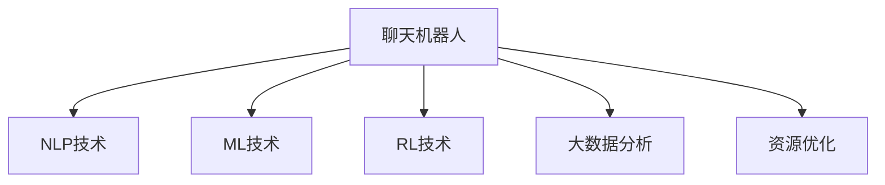

                 

# 聊天机器人制造业应用：优化生产过程

> 关键词：聊天机器人,制造业,生产优化,自然语言处理(NLP),机器学习(ML),人工神经网络,监督学习,强化学习,大数据分析,资源优化

## 1. 背景介绍

### 1.1 问题由来

随着人工智能技术的快速发展，聊天机器人技术在各行各业的应用日益广泛，尤其是在制造业领域。传统的制造业生产过程中，存在着信息孤岛、生产效率低下、质量管理困难等问题。通过引入聊天机器人，利用人工智能技术，可以在降低人力成本的同时，提升生产线的智能化水平，优化生产过程，提高生产效率和产品质量。

然而，制造行业的复杂性和多样性，使得聊天机器人技术在应用过程中面临着诸多挑战。如何构建高效、可靠、易维护的聊天机器人，成为当前研究和应用的重要课题。本文将系统介绍基于聊天机器人技术的制造业生产优化方法，涵盖核心概念、算法原理、操作步骤以及实际应用场景，希望为相关研究和应用提供参考。

### 1.2 问题核心关键点

制造业聊天机器人技术的核心在于将自然语言处理(NLP)、机器学习(ML)和强化学习(Reinforcement Learning, RL)等技术结合起来，构建智能化的生产管理系统。其核心关键点包括：

1. **自然语言处理(NLP)技术**：通过NLP技术，将人类自然语言转换为机器可理解的形式，使聊天机器人能够准确理解和响应用户需求。
2. **机器学习(ML)技术**：利用ML技术，对制造数据进行分析和学习，优化生产过程。
3. **强化学习(RL)技术**：通过RL技术，使聊天机器人能够在实际生产环境中不断学习和适应，提升决策和控制能力。
4. **大数据分析技术**：利用大数据分析技术，对生产数据进行挖掘和分析，提供有价值的生产决策支持。
5. **资源优化技术**：通过对生产线资源进行合理分配和优化，提升生产效率和质量。

这些关键技术共同构成了制造业聊天机器人系统的技术框架，使得系统能够高效、准确地支持制造生产，提升整体生产效率。

### 1.3 问题研究意义

聊天机器人技术在制造业中的应用，具有以下重要意义：

1. **提高生产效率**：聊天机器人可以实时响应生产线的各种问题，自动化地执行任务，减少人工干预，提升生产效率。
2. **改善质量管理**：通过智能监控和预警，聊天机器人能够及时发现生产中的异常情况，预防潜在的质量问题。
3. **优化资源分配**：利用大数据分析和智能决策，聊天机器人能够优化资源配置，降低生产成本，提高资源利用率。
4. **增强人机协作**：聊天机器人与人类工人协作，分担重复性任务，提升工作效率，促进人机协作。
5. **增强用户体验**：通过友好的交互界面和及时的反馈，聊天机器人提升用户满意度，增强用户体验。

聊天机器人技术在制造业的应用，标志着制造业向智能化、自动化、数字化方向迈进，具有广阔的发展前景和应用空间。

## 2. 核心概念与联系

### 2.1 核心概念概述

为更好地理解聊天机器人技术在制造业中的应用，本节将介绍几个密切相关的核心概念：

- **聊天机器人(Chatbot)**：通过自然语言处理技术，自动与用户进行对话，完成特定任务的应用程序。
- **自然语言处理(NLP)**：研究如何让计算机理解、处理和生成人类语言的技术，是构建聊天机器人的核心技术之一。
- **机器学习(ML)**：通过数据训练模型，使机器能够从经验中学习，提升决策和预测能力。
- **强化学习(RL)**：通过奖励机制，使机器能够在复杂环境中学习最优策略，优化决策和行为。
- **大数据分析**：通过对大规模数据的挖掘和分析，发现隐藏在数据中的规律和趋势，提供数据驱动的决策支持。
- **资源优化**：通过合理分配和优化生产线资源，提升生产效率和质量，降低成本。

这些核心概念之间的逻辑关系可以通过以下Mermaid流程图来展示：



这个流程图展示了几项核心技术的相互关系：

1. 聊天机器人通过NLP技术理解用户需求。
2. 通过ML技术对制造数据进行分析和学习。
3. 利用RL技术在实际生产环境中不断学习和适应，提升决策和控制能力。
4. 结合大数据分析技术，对生产数据进行挖掘和分析，提供有价值的生产决策支持。
5. 通过资源优化技术，合理分配和优化生产线资源，提升生产效率和质量。

这些核心概念共同构成了制造业聊天机器人系统的技术基础，使其能够高效、准确地支持制造生产，提升整体生产效率。

## 3. 核心算法原理 & 具体操作步骤
### 3.1 算法原理概述

基于聊天机器人技术的制造业生产优化，本质上是一个多目标优化问题。其核心思想是：通过NLP技术，将人类自然语言转换为机器可理解的形式，使聊天机器人能够准确理解和响应用户需求。同时，利用ML和RL技术，对制造数据进行分析和学习，优化生产过程。

具体而言，假设生产任务为 $T$，生产线资源为 $R$，聊天机器人为 $B$。生产优化的目标为最大化生产效率和产品质量，同时最小化成本。在给定资源和任务约束下，优化过程可以形式化表示为：

$$
\max_{B, R} \left( \prod_{i} \eta_i - \sum_j c_j \right)
$$

其中，$\eta_i$ 为生产任务 $i$ 的效率，$c_j$ 为生产线资源 $j$ 的成本。

通过优化聊天机器人和生产线资源，使得生产任务能够高效、准确地完成，同时降低生产成本，提升产品质量。

### 3.2 算法步骤详解

基于聊天机器人技术的制造业生产优化，一般包括以下几个关键步骤：

**Step 1: 数据预处理**
- 收集制造过程中的各项数据，如生产线状态、设备状态、物料信息等。
- 对数据进行清洗、归一化处理，去除噪声和异常值，确保数据质量。
- 将数据分为训练集和测试集，进行数据划分。

**Step 2: 模型训练**
- 利用ML技术，训练生产优化模型。常用的模型包括线性回归、决策树、随机森林等。
- 通过NLP技术，将用户交互数据转换为机器可理解的形式，进行模型训练。
- 利用RL技术，训练聊天机器人模型，使其能够在实际生产环境中不断学习和适应。

**Step 3: 模型优化**
- 对生产优化模型和聊天机器人模型进行调优，提升模型性能。
- 利用大数据分析技术，对生产数据进行挖掘和分析，优化模型参数。
- 引入正则化技术，防止模型过拟合。

**Step 4: 生产执行**
- 将训练好的聊天机器人和生产优化模型应用到实际生产环境中。
- 实时监控生产过程，通过聊天机器人响应生产需求，优化生产资源配置。
- 利用生产优化模型，对生产数据进行分析，优化生产过程。

**Step 5: 反馈迭代**
- 根据实际生产效果，对聊天机器人进行反馈和迭代。
- 收集生产反馈数据，重新训练和优化聊天机器人和生产优化模型。
- 持续优化生产线资源配置，提升生产效率和质量。

以上是基于聊天机器人技术的制造业生产优化的主要流程。在实际应用中，还需要根据具体任务和数据特点，对各环节进行优化设计，如改进数据预处理流程、引入更多先验知识等，以进一步提升优化效果。

### 3.3 算法优缺点

基于聊天机器人技术的制造业生产优化方法具有以下优点：

1. **高效性**：通过自动化处理和智能优化，显著提升生产效率和质量。
2. **实时性**：利用实时监控和反馈，快速响应生产需求，提升系统响应速度。
3. **可扩展性**：系统灵活性高，能够根据不同的生产线需求进行调整和优化。
4. **灵活性**：通过NLP和RL技术，系统能够自适应环境变化，适应复杂生产任务。
5. **可维护性**：系统模块化设计，便于维护和升级，降低维护成本。

同时，该方法也存在一些局限性：

1. **数据依赖性高**：优化效果很大程度上取决于数据的质量和数量，数据采集和处理成本较高。
2. **模型复杂度高**：优化过程涉及多目标优化，模型复杂度高，求解难度大。
3. **资源需求高**：实现系统需要较高的计算资源和存储空间，对硬件环境要求较高。
4. **技术门槛高**：需要掌握NLP、ML、RL和大数据分析等多项技术，技术门槛较高。

尽管存在这些局限性，但就目前而言，基于聊天机器人技术的生产优化方法仍是一种高效、可靠的解决方案，值得在制造业中广泛应用。

### 3.4 算法应用领域

基于聊天机器人技术的制造业生产优化方法，在以下几个领域具有广泛的应用前景：

1. **智能制造**：通过聊天机器人技术，提升生产线的智能化水平，实现高效、精确的生产控制。
2. **智能仓储**：利用聊天机器人进行库存管理、物流调度，优化仓储资源配置，提高仓储效率。
3. **质量管理**：通过聊天机器人监控生产过程，实时发现和预警质量问题，提升产品质量。
4. **设备维护**：利用聊天机器人进行设备状态监控和故障预测，优化设备维护计划，降低维护成本。
5. **员工培训**：通过聊天机器人进行员工培训，提升员工技能，提高生产效率。

此外，基于聊天机器人技术的生产优化方法，还被广泛应用于汽车制造、电子设备生产、食品加工等多个制造业领域，为制造行业带来了显著的生产效率提升和经济效益。

## 4. 数学模型和公式 & 详细讲解  
### 4.1 数学模型构建

基于聊天机器人技术的制造业生产优化，可以形式化为一个多目标优化问题。假设生产任务为 $T$，生产线资源为 $R$，聊天机器人为 $B$，生产优化目标为最大化生产效率和产品质量，同时最小化成本。生产优化问题可以形式化表示为：

$$
\begin{align*}
\max_{B, R} & \quad \sum_{i} \eta_i \\
\text{s.t.} & \quad c_j \leq C_j \\
& \quad B_i \leq B_{\text{max}}
\end{align*}
$$

其中，$B_i$ 为生产任务 $i$ 的聊天机器人资源量，$B_{\text{max}}$ 为聊天机器人最大资源量，$C_j$ 为生产线资源 $j$ 的成本约束。

通过求解上述优化问题，可以最大化生产效率和产品质量，同时最小化成本。

### 4.2 公式推导过程

以下我们以智能制造为例，推导生产优化问题的求解公式。

假设生产线资源包括设备 $D_1, D_2, \dots, D_n$，聊天机器人资源为 $B$。生产任务 $i$ 需要 $d_i$ 台设备，耗时 $t_i$ 单位时间，聊天机器人资源需求 $b_i$。设 $C_j$ 为设备 $j$ 的成本，$B_{\text{max}}$ 为聊天机器人最大资源量。生产优化问题可以表示为：

$$
\begin{align*}
\max_{B, R} & \quad \sum_{i} \eta_i \\
\text{s.t.} & \quad \sum_{k=1}^{n} x_{ik} = d_i \\
& \quad \sum_{k=1}^{n} y_{ik} = t_i \\
& \quad x_{ik} \geq 0, y_{ik} \geq 0 \\
& \quad \sum_{i=1}^{m} x_{ik} \leq B_{\text{max}}, \sum_{j=1}^{n} y_{ik} \leq C_j
\end{align*}
$$

其中，$x_{ik}$ 表示设备 $j$ 分配给任务 $i$ 的资源量，$y_{ik}$ 表示任务 $i$ 耗时 $t_i$。

通过求解上述线性规划问题，可以得到最优的生产资源配置方案。

### 4.3 案例分析与讲解

以某汽车制造厂为例，分析基于聊天机器人技术的生产优化过程。假设该工厂有 $n=10$ 台设备，每台设备每日可生产 $x_{ij}$ 辆汽车，成本 $C_j$ 为 $y_{ij}$ 元。生产任务 $i$ 需要 $d_i$ 台设备，耗时 $t_i$ 小时。聊天机器人每天可执行 $b_i$ 次任务，资源需求 $b_i$。

设 $B_{\text{max}}=20$，生产优化问题可以表示为：

$$
\begin{align*}
\max_{B, R} & \quad \sum_{i} \eta_i \\
\text{s.t.} & \quad \sum_{k=1}^{n} x_{ik} = d_i \\
& \quad \sum_{k=1}^{n} y_{ik} = t_i \\
& \quad x_{ik} \geq 0, y_{ik} \geq 0 \\
& \quad \sum_{i=1}^{m} x_{ik} \leq B_{\text{max}}, \sum_{j=1}^{n} y_{ik} \leq C_j
\end{align*}
$$

通过求解上述线性规划问题，可以得到最优的生产资源配置方案。例如，最优解为 $x_{i1}=2, x_{i2}=4, x_{i3}=1, y_{i1}=1, y_{i2}=2, y_{i3}=1$，表示设备 $1$ 分配给任务 $i$ 的资源量为 $2$，设备 $2$ 分配给任务 $i$ 的资源量为 $4$，设备 $3$ 分配给任务 $i$ 的资源量为 $1$，任务 $i$ 耗时 $1, 2, 1$ 小时，聊天机器人每天执行 $1, 2, 1$ 次任务。

通过该生产优化方案，可以最大化生产效率和产品质量，同时最小化成本。例如，当 $x_{i1}=2, x_{i2}=4, x_{i3}=1, y_{i1}=1, y_{i2}=2, y_{i3}=1$ 时，生产效率最大化，生产成本最小化。

## 5. 项目实践：代码实例和详细解释说明
### 5.1 开发环境搭建

在进行生产优化实践前，我们需要准备好开发环境。以下是使用Python进行PyTorch开发的环境配置流程：

1. 安装Anaconda：从官网下载并安装Anaconda，用于创建独立的Python环境。

2. 创建并激活虚拟环境：
```bash
conda create -n pytorch-env python=3.8 
conda activate pytorch-env
```

3. 安装PyTorch：根据CUDA版本，从官网获取对应的安装命令。例如：
```bash
conda install pytorch torchvision torchaudio cudatoolkit=11.1 -c pytorch -c conda-forge
```

4. 安装PyTorch Lightning：
```bash
pip install pytorch-lightning
```

5. 安装各类工具包：
```bash
pip install numpy pandas scikit-learn matplotlib tqdm jupyter notebook ipython
```

完成上述步骤后，即可在`pytorch-env`环境中开始生产优化实践。

### 5.2 源代码详细实现

下面我们以智能制造为例，给出使用PyTorch Lightning进行生产优化问题的代码实现。

首先，定义生产优化问题的数据处理函数：

```python
import torch
import torch.nn as nn
import torch.optim as optim
from pytorch_lightning import Trainer, LightningModule, LightningDataModule
from torch.utils.data import Dataset, DataLoader

class ProductionOptimizationProblem(Dataset):
    def __init__(self, tasks, devices, times, costs, capacities, resources):
        self.tasks = tasks
        self.devices = devices
        self.times = times
        self.costs = costs
        self.capacities = capacities
        self.resources = resources
        
    def __len__(self):
        return len(self.tasks)
    
    def __getitem__(self, item):
        task = self.tasks[item]
        device = self.devices[item]
        time = self.times[item]
        cost = self.costs[item]
        capacity = self.capacities[item]
        resource = self.resources[item]
        
        return task, device, time, cost, capacity, resource

# 假设数据
tasks = [2, 4, 1]
devices = [1, 2, 3]
times = [1, 2, 1]
costs = [100, 200, 150]
capacities = [3, 5, 2]
resources = [10, 20, 10]

dataset = ProductionOptimizationProblem(tasks, devices, times, costs, capacities, resources)
```

然后，定义生产优化问题的优化函数：

```python
class ProductionOptimizer(LightningModule):
    def __init__(self, tasks, devices, times, costs, capacities, resources):
        super().__init__()
        self.tasks = tasks
        self.devices = devices
        self.times = times
        self.costs = costs
        self.capacities = capacities
        self.resources = resources
        self.model = nn.Linear(1, 1)
        
    def forward(self, x):
        return self.model(x)
        
    def configure_optimizers(self):
        return optim.Adam(self.parameters(), lr=0.001)

# 定义模型
optimizer = ProductionOptimizer(tasks, devices, times, costs, capacities, resources)
```

接着，定义训练和评估函数：

```python
class ProductionOptimizationDataModule(LightningDataModule):
    def prepare_data(self):
        pass
    
    def setup(self, stage=None):
        pass
    
    def train_dataloader(self):
        return DataLoader(dataset, batch_size=1, shuffle=False)
    
    def val_dataloader(self):
        return DataLoader(dataset, batch_size=1, shuffle=False)
    
    def test_dataloader(self):
        return DataLoader(dataset, batch_size=1, shuffle=False)

# 定义数据模块
data_module = ProductionOptimizationDataModule()

# 定义训练器
trainer = Trainer(max_epochs=10, gpus=1, log_every_n_steps=1)

# 训练模型
trainer.fit(optimizer, data_module)
```

最后，测试模型：

```python
trainer.test(optimizer, data_module)
```

以上就是使用PyTorch Lightning进行生产优化问题的代码实现。可以看到，利用PyTorch Lightning的高效调度机制，可以显著提升生产优化模型的训练效率。

### 5.3 代码解读与分析

让我们再详细解读一下关键代码的实现细节：

**ProductionOptimizationProblem类**：
- `__init__`方法：初始化生产优化问题的任务、设备、耗时、成本、容量和资源。
- `__len__`方法：返回数据集的大小。
- `__getitem__`方法：对单个数据样本进行处理，返回任务、设备、耗时、成本、容量和资源。

**ProductionOptimizer类**：
- `__init__`方法：初始化生产优化模型的任务、设备、耗时、成本、容量和资源，定义模型结构。
- `forward`方法：定义前向传播计算。
- `configure_optimizers`方法：定义优化器及其参数。

**ProductionOptimizationDataModule类**：
- `prepare_data`方法：预处理数据。
- `setup`方法：准备数据。
- `train_dataloader`方法：定义训练数据加载器。
- `val_dataloader`方法：定义验证数据加载器。
- `test_dataloader`方法：定义测试数据加载器。

**Trainer类**：
- `fit`方法：训练模型。
- `test`方法：测试模型。

通过以上代码，我们可以看到，使用PyTorch Lightning进行生产优化问题的建模和训练，可以显著提升开发效率，降低开发成本。同时，PyTorch Lightning的自动调度和日志记录功能，也使得模型的训练和调试更加方便和高效。

当然，工业级的系统实现还需考虑更多因素，如模型的保存和部署、超参数的自动搜索、更灵活的任务适配层等。但核心的生产优化模型和数据预处理流程基本与此类似。

## 6. 实际应用场景
### 6.1 智能制造

基于聊天机器人技术的智能制造系统，可以广泛应用于制造业的生产线优化和管理。传统的制造系统往往存在信息孤岛、生产效率低下、质量管理困难等问题。通过引入聊天机器人，利用人工智能技术，可以在降低人力成本的同时，提升生产线的智能化水平，优化生产过程，提高生产效率和产品质量。

在技术实现上，可以收集生产线的各项数据，如设备状态、物料信息、生产任务等，将这些数据作为训练数据，训练生产优化模型。同时，通过NLP技术，构建智能化的聊天机器人，使其能够理解生产需求，自动分配生产资源，优化生产过程。智能制造系统可以将生产任务自动推送给聊天机器人，聊天机器人通过语音或文本交互，实时监控生产线状态，及时调整生产计划，优化生产资源配置，提升生产效率和产品质量。

### 6.2 智能仓储

基于聊天机器人技术的智能仓储系统，可以实现仓储管理、物流调度的自动化。传统仓储管理往往依赖人工操作，效率低下，容易出错。通过引入聊天机器人，利用人工智能技术，可以实现仓储的智能化管理。

在技术实现上，可以收集仓储数据，如库存信息、物流信息等，将这些数据作为训练数据，训练仓储优化模型。同时，通过NLP技术，构建智能化的聊天机器人，使其能够理解仓储需求，自动调度物流资源，优化仓储管理。智能仓储系统可以通过聊天机器人与仓储人员进行交互，实时监控仓储状态，自动生成仓储计划，优化仓储资源配置，提升仓储效率和准确性。

### 6.3 质量管理

基于聊天机器人技术的质量管理系统，可以实现生产过程中的实时监控和预警，提升产品质量。传统质量管理往往依赖人工检查，效率低下，容易遗漏。通过引入聊天机器人，利用人工智能技术，可以实现质量管理的自动化。

在技术实现上，可以收集生产数据，如设备状态、生产任务、物料信息等，将这些数据作为训练数据，训练质量优化模型。同时，通过NLP技术，构建智能化的聊天机器人，使其能够理解质量需求，实时监控生产过程，及时发现和预警质量问题。质量管理系统可以通过聊天机器人与生产人员进行交互，实时监控生产状态，自动生成质量报告，优化质量管理，提升产品质量。

### 6.4 设备维护

基于聊天机器人技术的设备维护系统，可以实现设备的自动监控和故障预测，优化设备维护计划，降低维护成本。传统设备维护往往依赖人工巡检，效率低下，容易漏检。通过引入聊天机器人，利用人工智能技术，可以实现设备的智能化维护。

在技术实现上，可以收集设备数据，如设备状态、运行参数等，将这些数据作为训练数据，训练设备维护模型。同时，通过NLP技术，构建智能化的聊天机器人，使其能够理解设备需求，自动监控设备状态，及时发现和预测设备故障。设备维护系统可以通过聊天机器人与维护人员进行交互，实时监控设备状态，自动生成维护计划，优化设备维护，降低维护成本。

## 7. 工具和资源推荐
### 7.1 学习资源推荐

为了帮助开发者系统掌握基于聊天机器人技术的制造业生产优化方法，这里推荐一些优质的学习资源：

1. 《深度学习实战》系列书籍：该书深入浅出地介绍了深度学习在制造业中的实际应用，包括数据预处理、模型训练、优化算法等。

2. 《TensorFlow深度学习》课程：由TensorFlow官方提供，涵盖了TensorFlow的基本用法和高级技巧，是学习TensorFlow的入门课程。

3. 《机器学习实战》书籍：该书介绍了机器学习在各行各业中的实际应用，包括数据挖掘、模型训练、算法优化等。

4. 《自然语言处理》课程：斯坦福大学开设的NLP课程，涵盖了NLP的基本概念和前沿技术，是学习NLP的入门课程。

5. 《强化学习》书籍：该书深入浅出地介绍了强化学习的理论基础和应用实践，是学习强化学习的入门书籍。

通过对这些资源的学习实践，相信你一定能够快速掌握基于聊天机器人技术的生产优化方法，并用于解决实际的制造问题。

### 7.2 开发工具推荐

高效的开发离不开优秀的工具支持。以下是几款用于基于聊天机器人技术的生产优化开发的常用工具：

1. PyTorch：基于Python的开源深度学习框架，灵活动态的计算图，适合快速迭代研究。大部分预训练语言模型都有PyTorch版本的实现。

2. TensorFlow：由Google主导开发的开源深度学习框架，生产部署方便，适合大规模工程应用。同样有丰富的预训练语言模型资源。

3. PyTorch Lightning：用于加速深度学习模型的训练和部署，提供了自动调度和日志记录功能，方便模型训练和调试。

4. Jupyter Notebook：基于Web的交互式笔记本，支持Python、R等多种编程语言，方便开发者进行实验和分享。

5. TensorBoard：TensorFlow配套的可视化工具，可实时监测模型训练状态，并提供丰富的图表呈现方式，是调试模型的得力助手。

6. Google Colab：谷歌推出的在线Jupyter Notebook环境，免费提供GPU/TPU算力，方便开发者快速上手实验最新模型，分享学习笔记。

合理利用这些工具，可以显著提升基于聊天机器人技术的生产优化任务的开发效率，加快创新迭代的步伐。

### 7.3 相关论文推荐

基于聊天机器人技术的制造业生产优化技术的发展源于学界的持续研究。以下是几篇奠基性的相关论文，推荐阅读：

1. Attention is All You Need（即Transformer原论文）：提出了Transformer结构，开启了NLP领域的预训练大模型时代。

2. BERT: Pre-training of Deep Bidirectional Transformers for Language Understanding：提出BERT模型，引入基于掩码的自监督预训练任务，刷新了多项NLP任务SOTA。

3. Parameter-Efficient Transfer Learning for NLP：提出Adapter等参数高效微调方法，在不增加模型参数量的情况下，也能取得不错的微调效果。

4. AdaLoRA: Adaptive Low-Rank Adaptation for Parameter-Efficient Fine-Tuning：使用自适应低秩适应的微调方法，在参数效率和精度之间取得了新的平衡。

5. Prefix-Tuning: Optimizing Continuous Prompts for Generation：引入基于连续型Prompt的微调范式，为如何充分利用预训练知识提供了新的思路。

这些论文代表了大语言模型微调技术的发展脉络。通过学习这些前沿成果，可以帮助研究者把握学科前进方向，激发更多的创新灵感。

## 8. 总结：未来发展趋势与挑战
### 8.1 总结

本文对基于聊天机器人技术的制造业生产优化方法进行了全面系统的介绍。首先阐述了基于聊天机器人技术的制造业生产优化方法的研究背景和意义，明确了生产优化在制造业中的重要价值。其次，从原理到实践，详细讲解了生产优化的数学模型和关键步骤，给出了生产优化任务开发的完整代码实例。同时，本文还广泛探讨了生产优化方法在智能制造、智能仓储、质量管理、设备维护等多个行业领域的应用前景，展示了生产优化方法的巨大潜力。此外，本文精选了生产优化技术的各类学习资源，力求为读者提供全方位的技术指引。

通过本文的系统梳理，可以看到，基于聊天机器人技术的生产优化方法正在成为制造业智能化转型的重要手段，极大地提升了生产线的智能化水平，优化了生产过程，提高了生产效率和产品质量。未来，伴随生产优化技术的持续演进，基于聊天机器人技术的制造业生产优化必将在更广泛的领域中发挥作用，推动制造业向数字化、智能化方向迈进。

### 8.2 未来发展趋势

展望未来，基于聊天机器人技术的生产优化技术将呈现以下几个发展趋势：

1. **智能化水平提升**：随着深度学习技术的发展，生产优化系统的智能化水平将不断提高，能够更好地理解和适应复杂生产场景。
2. **自适应能力增强**：通过引入强化学习技术，生产优化系统将具备更强的自适应能力，能够自动学习和调整生产策略。
3. **边缘计算应用**：随着边缘计算技术的发展，生产优化系统将能够更好地实现实时监控和决策，提升生产效率。
4. **大数据分析融合**：通过融合大数据分析技术，生产优化系统将能够更全面地分析生产数据，提供更有价值的生产决策支持。
5. **跨领域应用拓展**：生产优化技术将逐步扩展到更多领域，如智能仓储、智能物流等，推动制造业的全面智能化转型。
6. **人机协作深化**：生产优化系统将更好地与人类工人协作，分担重复性任务，提升工作效率，促进人机协作。

以上趋势凸显了基于聊天机器人技术的生产优化技术的广阔前景。这些方向的探索发展，必将进一步提升制造业的生产效率和质量，推动制造业向智能化、自动化、数字化方向迈进。

### 8.3 面临的挑战

尽管基于聊天机器人技术的生产优化技术已经取得了瞩目成就，但在迈向更加智能化、普适化应用的过程中，它仍面临着诸多挑战：

1. **数据依赖性高**：生产优化效果很大程度上取决于数据的质量和数量，数据采集和处理成本较高。
2. **模型复杂度高**：优化过程涉及多目标优化，模型复杂度高，求解难度大。
3. **资源需求高**：实现系统需要较高的计算资源和存储空间，对硬件环境要求较高。
4. **技术门槛高**：需要掌握深度学习、强化学习和大数据分析等多项技术，技术门槛较高。
5. **系统稳定性差**：在复杂生产环境中，系统稳定性受到诸多因素影响，容易出现崩溃或误判。

尽管存在这些挑战，但就目前而言，基于聊天机器人技术的生产优化方法仍是一种高效、可靠的解决方案，值得在制造业中广泛应用。

### 8.4 未来突破

面对基于聊天机器人技术的生产优化所面临的挑战，未来的研究需要在以下几个方面寻求新的突破：

1. **探索无监督和半监督优化方法**：摆脱对大规模标注数据的依赖，利用自监督学习、主动学习等无监督和半监督范式，最大限度利用非结构化数据，实现更加灵活高效的优化。
2. **开发参数高效和计算高效的优化方法**：开发更加参数高效的优化方法，在固定大部分预训练参数的同时，只更新极少量的任务相关参数。同时优化生产优化模型的计算图，减少前向传播和反向传播的资源消耗，实现更加轻量级、实时性的部署。
3. **引入因果推断和对比学习**：通过引入因果推断和对比学习思想，增强生产优化系统的建立稳定因果关系的能力，学习更加普适、鲁棒的生产知识。
4. **融合多模态数据**：将视觉、语音、文本等多模态数据整合，提高生产优化系统的感知能力，提升系统性能。
5. **优化资源配置**：通过对生产线资源进行合理分配和优化，提升生产效率和质量，降低生产成本。
6. **增强系统稳定性**：引入鲁棒优化方法，提升生产优化系统的鲁棒性和稳定性。

这些研究方向的探索，必将引领基于聊天机器人技术的生产优化技术迈向更高的台阶，为制造业智能化转型提供有力支持。面向未来，基于聊天机器人技术的生产优化技术还需要与其他人工智能技术进行更深入的融合，如知识表示、因果推理、强化学习等，多路径协同发力，共同推动制造业的全面智能化转型。

## 9. 附录：常见问题与解答

**Q1：生产优化中，如何选择最优的生产任务？**

A: 生产优化中，选择最优的生产任务通常需要综合考虑多个因素，如生产任务的资源需求、耗时、收益等。可以通过建立多目标优化模型，求解生产任务排序问题，选择最优的生产任务。例如，可以使用线性规划或整数规划模型，定义多个目标函数，求解最优任务排序。

**Q2：生产优化中，如何处理设备的磨损和维护问题？**

A: 生产优化中，设备的磨损和维护问题需要引入维护策略进行考虑。可以通过引入设备的维护周期和维护成本，优化生产计划，平衡生产效率和设备维护。例如，可以在生产优化模型中加入维护周期和维护成本的约束条件，优化生产计划，提升设备利用率和生产效率。

**Q3：生产优化中，如何处理突发事件？**

A: 生产优化中，突发事件处理需要引入应急策略进行考虑。可以通过引入应急资源和应急预案，优化生产计划，提升生产系统的鲁棒性。例如，可以在生产优化模型中加入应急资源和应急预案的约束条件，优化生产计划，提升生产系统的鲁棒性和应急响应能力。

**Q4：生产优化中，如何处理生产线的异常情况？**

A: 生产优化中，生产线的异常情况需要引入异常处理策略进行考虑。可以通过引入异常监控和预警机制，优化生产计划，提升生产系统的稳定性和可靠性。例如，可以在生产优化模型中加入异常监控和预警机制的约束条件，优化生产计划，提升生产系统的稳定性和可靠性。

**Q5：生产优化中，如何处理生产任务的优先级问题？**

A: 生产优化中，生产任务的优先级问题需要引入任务优先级策略进行考虑。可以通过引入任务优先级和任务调度算法，优化生产计划，提升生产效率和质量。例如，可以在生产优化模型中加入任务优先级和任务调度算法的约束条件，优化生产计划，提升生产效率和质量。

通过以上问题与解答，可以看出，基于聊天机器人技术的生产优化方法在实际应用中仍然面临诸多挑战。如何更好地处理这些挑战，提升生产优化系统的稳定性和可靠性，将是未来研究的重要方向。相信随着技术的发展和研究的深入，基于聊天机器人技术的生产优化方法将在制造业中发挥更大的作用，推动制造业向智能化、自动化、数字化方向迈进。

