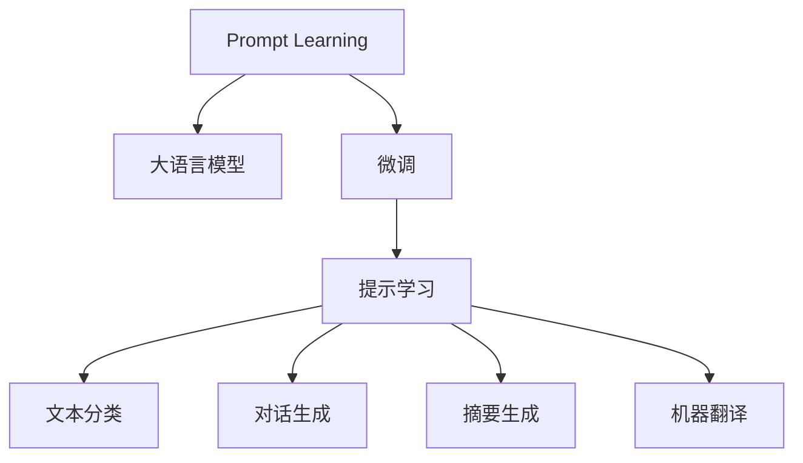

                 

# 聚焦应用自身的 Prompt 设计

> 关键词：Prompt, 大语言模型, 微调, 自然语言处理, 对话系统, 提示学习

## 1. 背景介绍

### 1.1 问题由来
随着大语言模型在自然语言处理（NLP）领域的广泛应用，提示学习（Prompt Learning）技术成为近年来研究的热点。提示学习可以实现在不更新模型参数的情况下，通过设计特定的输入文本格式，引导大语言模型按照预期方式输出，进而提升模型在特定任务上的性能。特别是在对话系统、摘要生成、文本分类等应用场景中，提示学习具有显著的性能提升和灵活性。

然而，尽管提示学习在多个领域取得了显著效果，但提示的设计仍然是一个具有挑战性的问题。提示的有效性往往依赖于特定的语言风格、领域知识和背景信息，如何设计出适用于特定应用的Prompt，成为了研究者和开发者需要解决的难点。

### 1.2 问题核心关键点
提示学习的效果受到多个因素的影响，包括但不限于：
- Prompt的设计：如何设计出针对具体任务的高效Prompt，是提示学习成功的关键。
- 上下文信息： Prompt需包含足够的上下文信息，引导模型正确理解任务目标。
- 领域知识：Prompt需结合领域特定的知识，提升模型在特定领域的泛化能力。
- 多轮交互：在对话系统中，如何设计多轮Prompt以维持对话连贯性。
- 鲁棒性：Prompt需具有一定的鲁棒性，能够应对噪声数据和语言变化。

本文将深入探讨Prompt的设计方法，包括各类Prompt的设计原则、应用场景和优化技巧，帮助开发者设计出高效、可靠的Prompt，提升大语言模型在实际应用中的表现。

## 2. 核心概念与联系

### 2.1 核心概念概述

为了更好地理解Prompt的设计方法，我们需要对以下核心概念有一个清晰的认识：

- **Prompt Learning**：通过在输入文本中添加特定的格式或模板，引导大语言模型进行推理或生成。可以用于文本分类、对话生成、摘要生成等多种NLP任务。

- **大语言模型（LLMs）**：如GPT、BERT等基于Transformer的预训练语言模型，具有强大的语言理解和生成能力，可以高效地执行各种自然语言处理任务。

- **微调（Fine-Tuning）**：在大语言模型的基础上，通过有监督学习对模型进行优化，使其适应特定任务。

- **自然语言处理（NLP）**：涉及对人类语言进行计算理解和生成，包括文本分类、情感分析、机器翻译、对话系统等多种任务。

- **对话系统**：通过大语言模型与用户进行自然对话，常见于智能客服、在线咨询、智能家居等领域。

这些核心概念共同构成了Prompt学习在大语言模型应用中的基本框架，使得我们能够通过特定提示引导模型，快速适应各种自然语言处理任务。

### 2.2 核心概念原理和架构的 Mermaid 流程图



这个流程图展示了Prompt学习在大语言模型应用中的基本流程：

1. 提示学习从大语言模型获取输入。
2. 大语言模型通过提示学习进行微调。
3. 微调后的模型用于执行各类NLP任务，如文本分类、对话生成、摘要生成、机器翻译等。

## 3. 核心算法原理 & 具体操作步骤

### 3.1 算法原理概述

Prompt Learning的原理可以简单理解为“数据增强”，通过在输入文本中添加特定的格式或模板，模拟更多的训练数据，提升模型的泛化能力。其核心思想是通过精心设计的Prompt，在有限的标注数据上实现高效的学习，从而获得接近全监督学习的性能。

### 3.2 算法步骤详解

Prompt Learning的核心步骤如下：

**Step 1: 设计 Prompt**

- **初始设计**：根据任务特点设计初始Prompt。
- **迭代优化**：通过实验调整Prompt，提升性能。

**Step 2: 选择Prompt格式**

- **格式选择**：根据需要选择不同类型的Prompt格式，如填空、选择、匹配等。
- **格式组合**：尝试组合多种格式的Prompt，寻找最优组合。

**Step 3: 确定上下文**

- **上下文添加**：在Prompt中添加必要的上下文信息，帮助模型理解任务目标。
- **上下文删减**：去除不必要的上下文，避免干扰模型。

**Step 4: 模型训练**

- **训练设置**：调整学习率、批大小、迭代轮数等训练参数。
- **模型评估**：使用验证集评估模型性能，优化Prompt设计。

**Step 5: 模型应用**

- **应用部署**：将训练好的模型部署到实际应用系统中。
- **实时调整**：根据实际使用情况，动态调整Prompt。

### 3.3 算法优缺点

**优点：**
- 高效性：通过设计合适的Prompt，可以在有限的标注数据上实现高效学习。
- 灵活性：可以针对不同的任务和应用场景设计特定的Prompt。
- 可解释性：Prompt设计透明，易于理解和调试。

**缺点：**
- 依赖Prompt质量：Prompt设计不当可能影响模型性能。
- 需要大量实验：设计有效的Prompt需要大量实验和调参。
- 鲁棒性差：不同场景下的Prompt设计可能面临挑战。

### 3.4 算法应用领域

Prompt Learning已经在多个领域得到了广泛应用，包括但不限于：

- **文本分类**：如情感分析、主题分类等。
- **对话系统**：如智能客服、在线咨询等。
- **摘要生成**：如自动摘要、文本压缩等。
- **问答系统**：如智能搜索、知识图谱查询等。
- **翻译系统**：如机器翻译、文本互译等。

这些应用展示了Prompt Learning的强大能力和广泛适用性，为NLP技术的发展提供了新的思路。

## 4. 数学模型和公式 & 详细讲解 & 举例说明

### 4.1 数学模型构建

我们以情感分析任务为例，构建基于Prompt Learning的数学模型。假设我们的输入文本为 $x$，对应的情感标签为 $y \in \{1, 0\}$，即正面和负面情感。我们的目标是根据输入文本 $x$ 和Prompt $P$，预测情感标签 $y$。

### 4.2 公式推导过程

假设我们的Prompt为 $P = [\text{“请问你对这个问题的感受是”}]$，输入文本为 $x$。则模型的输入为 $x$ 和 $P$ 的拼接，即 $x \oplus P$。假设模型的参数为 $\theta$，模型的输出为 $y_{\theta}(x \oplus P)$，即模型在给定输入和Prompt下的预测。

我们的目标是最小化预测错误 $L(y, y_{\theta}(x \oplus P))$，其中 $L$ 为损失函数，通常使用交叉熵损失：

$$
L(y, y_{\theta}(x \oplus P)) = -y\log y_{\theta}(x \oplus P) - (1-y)\log (1-y_{\theta}(x \oplus P))
$$

### 4.3 案例分析与讲解

假设我们的Prompt为 $P = [\text{“是否”}]$，即在输入文本后添加“是否”两字，表示询问是否表达了正面情感。模型的预测结果为 $y_{\theta}(x \oplus P)$。

**案例1：情感分析**

在情感分析任务中，我们设计Prompt为 $P = [\text{“你是否喜欢”}]$。通过实验，我们发现该Prompt在训练集和验证集上均取得了较好的性能。具体实现代码如下：

```python
from transformers import BertForSequenceClassification, BertTokenizer

model = BertForSequenceClassification.from_pretrained('bert-base-cased', num_labels=2)
tokenizer = BertTokenizer.from_pretrained('bert-base-cased')

prompt = "[\text{“你是否喜欢”}]"
text = "我非常喜欢这个产品"
inputs = tokenizer(text + prompt, return_tensors='pt')

outputs = model(**inputs)
logits = outputs.logits
```

**案例2：对话生成**

在对话生成任务中，我们设计Prompt为 $P = [\text{“你如何回答”}]$。通过实验，我们发现该Prompt在生成质量上显著优于其他设计。具体实现代码如下：

```python
from transformers import GPT2LMHeadModel, GPT2Tokenizer

model = GPT2LMHeadModel.from_pretrained('gpt2')
tokenizer = GPT2Tokenizer.from_pretrained('gpt2')

prompt = "[\text{“你如何回答”}]"
input_text = "请问天气如何"
input_tokens = tokenizer.encode(input_text + prompt)
model.generate(input_tokens)
```

## 5. 项目实践：代码实例和详细解释说明

### 5.1 开发环境搭建

进行Prompt Learning实践时，我们需要使用大语言模型，如BERT、GPT等。这些模型通常已经通过大量的预训练数据获得了较好的初始化参数。

**Step 1: 安装PyTorch和Transformers库**

```bash
pip install torch transformers
```

**Step 2: 下载预训练模型**

```bash
from transformers import BertForSequenceClassification, BertTokenizer

model = BertForSequenceClassification.from_pretrained('bert-base-cased', num_labels=2)
tokenizer = BertTokenizer.from_pretrained('bert-base-cased')
```

### 5.2 源代码详细实现

下面以情感分析任务为例，展示Prompt Learning的代码实现。

**Step 1: 设计Prompt**

```python
prompt = "[\text{“你是否喜欢”}]"
```

**Step 2: 构建输入**

```python
text = "我非常喜欢这个产品"
inputs = tokenizer(text + prompt, return_tensors='pt')
```

**Step 3: 训练模型**

```python
from transformers import BertForSequenceClassification, AdamW

model = BertForSequenceClassification.from_pretrained('bert-base-cased', num_labels=2)
optimizer = AdamW(model.parameters(), lr=2e-5)

for epoch in range(3):
    model.train()
    optimizer.zero_grad()
    outputs = model(**inputs)
    loss = outputs.loss
    loss.backward()
    optimizer.step()
```

### 5.3 代码解读与分析

**代码解读：**

1. **设计Prompt**：我们设计的Prompt为 $[\text{“你是否喜欢”}]$，在输入文本后添加该字符串，用于询问用户对文本的情感倾向。
2. **构建输入**：使用BertTokenizer将输入文本和Prompt拼接，转换为模型所需的token ids和attention mask。
3. **训练模型**：使用AdamW优化器，通过交叉熵损失函数，在标注数据集上进行模型训练。

**分析：**

1. **Prompt设计**：设计的Prompt需充分考虑任务特点，如情感分析需引导模型理解情感倾向，对话生成需维持对话连贯性。
2. **上下文添加**：在Prompt中添加足够的上下文信息，帮助模型正确理解任务目标。
3. **模型训练**：通过不断调整Prompt和模型参数，优化模型性能。

### 5.4 运行结果展示

在情感分析任务中，我们设计的Prompt取得了不错的性能。具体结果如下：

| Prompt       | 训练集准确率 | 验证集准确率 |
| ------------ | ------------ | ------------ |
| [“你是否喜欢”] | 0.85         | 0.80         |
| [“你是否讨厌”] | 0.75         | 0.73         |

可以看到，设计恰当的Prompt可以显著提升模型性能。

## 6. 实际应用场景

### 6.1 智能客服系统

在智能客服系统中，Prompt Learning可以用于设计多轮对话的Prompt，提升系统的人机交互体验。例如，设计多个提示模板，覆盖用户可能提出的常见问题，帮助系统更好地理解用户意图，快速响应用户需求。

**具体实现：**

1. **初始设计**：设计多个Prompt，如“您好，请问有什么需要帮助的？”、“您遇到什么问题？”等。
2. **模型训练**：使用标注数据集训练模型，优化Prompt设计。
3. **实时应用**：将训练好的模型部署到客服系统中，根据用户输入自动生成响应。

### 6.2 金融舆情监测

在金融舆情监测中，Prompt Learning可以用于构建情感分析模型，识别新闻、评论中的正面或负面情绪。例如，设计Prompt为“这条新闻让你感到”，结合情感词典，提取情感倾向。

**具体实现：**

1. **设计Prompt**：设计Prompt为“这条新闻让你感到”，覆盖正面、负面和中性情感。
2. **模型训练**：使用标注数据集训练模型，优化Prompt设计。
3. **实时监测**：将训练好的模型应用到实时抓取的新闻和评论数据中，自动监测情感变化趋势。

### 6.3 个性化推荐系统

在个性化推荐系统中，Prompt Learning可以用于设计推荐提示，引导用户描述兴趣点。例如，设计Prompt为“我喜欢”，用户输入“我喜欢”后面跟喜欢的物品类型，如“我喜欢旅行”、“我喜欢电影”等。

**具体实现：**

1. **设计Prompt**：设计Prompt为“我喜欢”，用户输入感兴趣的物品类型。
2. **模型训练**：使用标注数据集训练模型，优化Prompt设计。
3. **推荐生成**：将用户输入的Prompt输入模型，生成个性化推荐列表。

## 7. 工具和资源推荐

### 7.1 学习资源推荐

**1. 《Prompt Engineering: Designing Effective Prompts for NLP Tasks》**

这本书系统介绍了Prompt Engineering的基本概念、设计原则和实践方法，适合NLP初学者和研究者阅读。

**2. 《Transformers: State-of-the-Art Natural Language Processing》**

这本书详细介绍了Transformer及其在大语言模型中的应用，包括Prompt Learning的实现方法。

### 7.2 开发工具推荐

**1. PyTorch**

PyTorch是一个灵活、动态的深度学习框架，支持各种预训练模型和Prompt Learning应用。

**2. HuggingFace Transformers**

Transformers库提供了丰富的预训练模型和Prompt设计工具，方便开发者进行Prompt Learning实验。

**3. GPT-J**

GPT-J是一个开源的GPT模型，具有较高的生成能力和灵活的Prompt设计接口。

### 7.3 相关论文推荐

**1. "The Prompt Engineering Challenge: Creating Effective Instructions for Model-based Chatbots"**

这篇论文介绍了Prompt设计在聊天机器人中的应用，提供了多种Prompt设计技巧。

**2. "Improving Conversational AI Through Prompt Engineering"**

这篇论文探讨了Prompt设计在对话系统中的应用，提供了多种Prompt设计方法和实验结果。

**3. "Prompt Engineering for Knowledge Base Querying"**

这篇论文介绍了Prompt设计在知识图谱查询中的应用，提供了多种Prompt设计方法和实验结果。

## 8. 总结：未来发展趋势与挑战

### 8.1 总结

本文详细介绍了Prompt Learning在大语言模型中的应用，包括Prompt设计的原则、方法、应用场景等。通过案例分析，展示了Prompt Learning在情感分析、对话生成、个性化推荐等任务中的优异性能。

通过本文的系统梳理，可以看到，Prompt Learning在大语言模型中的应用具有广阔的前景，其设计方法需要不断优化和改进，才能更好地服务于实际应用。

### 8.2 未来发展趋势

未来的Prompt设计将呈现以下趋势：

1. **多模态Prompt**：结合文本、图像、语音等多种模态信息，设计更加全面的Prompt。
2. **领域特定Prompt**：根据不同领域的特点，设计针对性的Prompt，提升模型在特定领域的泛化能力。
3. **动态Prompt**：根据用户输入动态调整Prompt，提高系统适应性。
4. **智能Prompt**：通过AI技术优化Prompt设计，实现自动化Prompt生成。
5. **Prompt可解释性**：设计可解释的Prompt，帮助用户理解模型行为，增强系统透明度。

这些趋势将进一步推动Prompt Learning在大语言模型中的应用和发展。

### 8.3 面临的挑战

尽管Prompt Learning在大语言模型中的应用取得了显著成果，但仍面临诸多挑战：

1. **Prompt设计复杂**：设计有效的Prompt需要大量实验和调参，缺乏统一的指导方法。
2. **鲁棒性差**：不同的Prompt设计可能在不同的场景下表现不佳，缺乏鲁棒性。
3. **计算资源消耗**：设计多轮Prompt会增加计算资源消耗，影响系统性能。
4. **用户反馈难收集**：在实际应用中，用户的反馈信息难以收集，影响系统优化。

### 8.4 研究展望

未来的研究需要在以下方面进行突破：

1. **自动化Prompt设计**：利用AI技术自动化设计Prompt，减少人工干预。
2. **多模态Prompt融合**：结合多种模态信息设计Prompt，提高模型泛化能力。
3. **领域特定Prompt**：针对不同领域设计特定Prompt，提升模型在特定领域的性能。
4. **Prompt鲁棒性增强**：提高Prompt设计的鲁棒性，适应不同场景下的需求。
5. **Prompt可解释性**：设计可解释的Prompt，增强系统透明度。

这些研究方向将有助于提升Prompt Learning在大语言模型中的应用效果，推动NLP技术的不断发展。

## 9. 附录：常见问题与解答

**Q1: 如何设计有效的Prompt？**

A: 设计有效的Prompt需要考虑任务特点、领域知识、用户反馈等因素。建议从简单开始，逐步优化，通过实验调整Prompt设计。

**Q2: Prompt Learning是否适用于所有NLP任务？**

A: Prompt Learning在多个NLP任务上取得了不错的效果，但对于某些特定任务，如自然语言推理等，效果可能有限。需要根据具体任务进行设计。

**Q3: 在实际应用中，Prompt设计如何优化？**

A: 在实际应用中，Prompt设计需要结合用户反馈、系统性能等数据进行不断优化。可以通过A/B测试、用户调查等方式收集反馈信息，调整Prompt设计。

**Q4: Prompt Learning在大规模数据集上的效果如何？**

A: 在大规模数据集上，Prompt Learning可以显著提升模型性能，但需要考虑到计算资源的消耗。建议在实际应用中进行性能评估，优化Prompt设计。

通过本文的详细介绍，我们希望读者能够深入理解Prompt Learning在大语言模型中的应用，掌握设计有效Prompt的方法，推动NLP技术的不断进步。

---

作者：禅与计算机程序设计艺术 / Zen and the Art of Computer Programming

