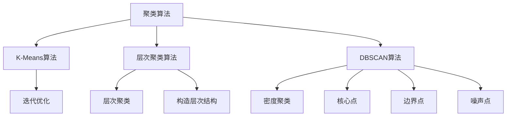

                 

# 聚类(Clustering) - 原理与代码实例讲解

> 关键词：聚类算法, K-Means, 层次聚类, DBSCAN, 轮廓系数, 聚类应用, 特征降维

## 1. 背景介绍

聚类（Clustering）是一种无监督学习的方法，目的是将数据集划分为若干个“组”，使得组内数据的相似度尽可能高，而组间的相似度尽可能低。聚类算法广泛应用于数据挖掘、图像处理、生物信息学、推荐系统等领域，旨在发现数据中的潜在结构和模式。

聚类算法的核心在于距离度量与相似性判断。距离度量是衡量数据点之间距离的方法，如欧氏距离、曼哈顿距离等。相似性判断则是基于距离度量，将距离近的数据点归为一组，如K-Means、层次聚类等算法。

## 2. 核心概念与联系

### 2.1 核心概念概述

为更好地理解聚类算法，本节将介绍几个核心概念：

- 聚类算法（Clustering Algorithm）：旨在将数据集划分为若干个相似度高的组，常用的聚类算法有K-Means、层次聚类、DBSCAN等。
- 距离度量（Distance Metric）：衡量数据点之间距离的方法，常用的有欧氏距离、曼哈顿距离等。
- 相似性判断（Similarity Judgment）：基于距离度量，将距离近的数据点归为一组。
- 层次聚类（Hierarchical Clustering）：通过构建层次结构，逐步合并数据点，生成聚类树。
- K-Means算法：基于划分的聚类算法，通过迭代优化中心点和组内距离，将数据集划分为K个组。
- DBSCAN算法：基于密度的聚类算法，将数据点分为核心点、边界点和噪声点，通过密度阈值自动确定聚类数目。
- 轮廓系数（Silhouette Coefficient）：用于衡量聚类质量，通过计算组内距离和组间距离的差值，评估聚类结果。

这些核心概念之间的逻辑关系可以通过以下Mermaid流程图来展示：



这个流程图展示了几类常见聚类算法的核心步骤和基本原理。

## 3. 核心算法原理 & 具体操作步骤

### 3.1 算法原理概述

聚类算法基于数据点之间的相似性，将相似的数据点划分到同一组中。算法的核心步骤包括：

1. 定义距离度量，计算数据点之间的距离。
2. 根据距离度量，对数据点进行相似性判断。
3. 根据相似性判断，将数据点划分为若干个组。
4. 根据组内和组间距离，优化聚类结果，使其更符合数据分布。

### 3.2 算法步骤详解

#### 3.2.1 K-Means算法

K-Means算法是一种基于划分的聚类算法，通过迭代优化中心点和组内距离，将数据集划分为K个组。

1. 随机选择K个数据点作为初始中心点。
2. 计算每个数据点与中心点的距离，将其划分到最近的组。
3. 重新计算每个组的中心点，作为新的初始中心点。
4. 重复步骤2和3，直至中心点不再发生变化或达到预设迭代次数。

#### 3.2.2 层次聚类算法

层次聚类算法通过构建层次结构，逐步合并数据点，生成聚类树。

1. 计算每个数据点之间的距离，构建距离矩阵。
2. 根据距离矩阵，构造层次结构，逐步合并数据点。
3. 选择合适的聚类数目，将数据点划分为若干个组。

#### 3.2.3 DBSCAN算法

DBSCAN算法是一种基于密度的聚类算法，通过密度阈值自动确定聚类数目。

1. 选择核心距离（MinPts），计算每个数据点的可达距离。
2. 将可达距离内的数据点划分为核心点，否则为噪声点。
3. 合并核心点，形成新的聚类。
4. 重复步骤2和3，直至所有数据点被处理。

### 3.3 算法优缺点

#### 3.3.1 K-Means算法

**优点**：

- 算法简单易懂，易于实现。
- 并行化程度高，适合大规模数据集。

**缺点**：

- 需要预设聚类数目K，可能存在人为因素影响。
- 对数据分布的假设强，如假设簇球形。
- 对初始中心点敏感，可能陷入局部最优。

#### 3.3.2 层次聚类算法

**优点**：

- 无需预设聚类数目，通过层次结构逐步合并。
- 可生成聚类树，便于观察和分析。

**缺点**：

- 对距离度量敏感，距离矩阵计算复杂。
- 不能直接控制聚类数目，可能产生过多或过少的簇。

#### 3.3.3 DBSCAN算法

**优点**：

- 不需要预设聚类数目，自动确定簇的密度。
- 对噪声点敏感，可将噪声点自动排除。

**缺点**：

- 参数MinPts影响聚类结果，可能导致伪簇。
- 对数据分布不均匀敏感，可能产生不均衡的聚类。

### 3.4 算法应用领域

聚类算法广泛应用于数据挖掘、图像处理、生物信息学、推荐系统等领域：

1. 图像处理：将像素点聚类为图像区域，实现图像分割、特征提取等。
2. 生物信息学：将基因序列聚类为基因家族，用于基因功能注释、基因表达分析等。
3. 推荐系统：将用户聚类为不同的兴趣群体，推荐个性化商品或内容。
4. 市场营销：将消费者聚类为不同的细分市场，制定个性化营销策略。
5. 自然语言处理：将文本聚类为不同的主题，用于信息检索、文本分类等。

## 4. 数学模型和公式 & 详细讲解 & 举例说明

### 4.1 数学模型构建

以K-Means算法为例，定义数学模型：

1. 设数据集 $X=\{x_1, x_2, ..., x_n\}$，每个数据点 $x_i$ 包含 $d$ 个特征。
2. 设聚类数目为 $K$，初始化 $K$ 个中心点 $c_1, c_2, ..., c_K$。
3. 设每个数据点 $x_i$ 到每个中心点 $c_j$ 的距离为 $d(x_i, c_j)$，计算方法包括欧氏距离、曼哈顿距离等。
4. 计算每个数据点 $x_i$ 的组内距离 $d_i$ 和组间距离 $d_i^*$。
5. 迭代优化中心点和组内距离，直到满足收敛条件。

### 4.2 公式推导过程

以欧氏距离为例，推导K-Means算法的核心公式：

设数据点 $x_i$ 到中心点 $c_j$ 的距离为 $d(x_i, c_j)=\sqrt{\sum_{k=1}^d (x_{ik}-c_{jk})^2}$，则：

1. 计算每个数据点 $x_i$ 的组内距离 $d_i = \sum_{k=1}^K (d(x_i, c_k))^2$。
2. 计算每个数据点 $x_i$ 的组间距离 $d_i^* = \sum_{k=1}^K (d(x_i, c_k))^2 - (d_i / K)^2$。
3. 计算每个中心点 $c_j$ 的组内距离 $d_j = \sum_{i=1}^n (d(x_i, c_j))^2$。
4. 迭代优化中心点 $c_j$，使其满足 $c_j = \frac{1}{|I_j|} \sum_{i \in I_j} x_i$，其中 $I_j$ 为组 $j$ 的成员集合。

### 4.3 案例分析与讲解

以Iris数据集为例，展示K-Means算法的应用过程：

1. 加载Iris数据集，包含3种花的4个特征：花萼长度、花萼宽度、花瓣长度、花瓣宽度。
2. 将数据集标准化，计算每个特征的均值和标准差，并将数据点归一化。
3. 随机选择3个中心点，将数据点划分到最近的组。
4. 重新计算每个组的中心点，迭代优化。
5. 评估聚类结果，计算轮廓系数，评估聚类质量。

## 5. 项目实践：代码实例和详细解释说明

### 5.1 开发环境搭建

在进行聚类算法实践前，我们需要准备好开发环境。以下是使用Python进行Scikit-Learn开发的简单环境配置流程：

1. 安装Anaconda：从官网下载并安装Anaconda，用于创建独立的Python环境。
2. 创建并激活虚拟环境：
```bash
conda create -n clustering-env python=3.8 
conda activate clustering-env
```

3. 安装Scikit-Learn：
```bash
pip install scikit-learn
```

4. 安装各类工具包：
```bash
pip install numpy pandas matplotlib seaborn
```

完成上述步骤后，即可在`clustering-env`环境中开始聚类实践。

### 5.2 源代码详细实现

我们以K-Means算法为例，展示Scikit-Learn库中`KMeans`类的使用方法。

```python
from sklearn.cluster import KMeans
from sklearn.datasets import load_iris
import numpy as np

# 加载Iris数据集
iris = load_iris()
X = iris.data

# 创建K-Means模型，设置聚类数目为3
kmeans = KMeans(n_clusters=3)

# 训练模型
kmeans.fit(X)

# 获取聚类结果
labels = kmeans.labels_

# 可视化聚类结果
from matplotlib import pyplot as plt
plt.scatter(X[:, 0], X[:, 1], c=labels)
plt.show()
```

以上是使用Scikit-Learn库对K-Means算法进行聚类实践的完整代码实现。可以看到，Scikit-Learn库提供了方便的接口，可以快速实现聚类算法。

### 5.3 代码解读与分析

让我们再详细解读一下关键代码的实现细节：

**KMeans类**：
- `n_clusters`参数：设置聚类数目。
- `fit`方法：训练模型，计算每个数据点的组内距离和组间距离。
- `labels_`属性：获取每个数据点的聚类标签。

**Iris数据集**：
- `load_iris`方法：加载Iris数据集，返回包含特征和标签的numpy数组。
- `data`属性：获取特征数据，包含3种花的4个特征。

**可视化聚类结果**：
- `scatter`方法：绘制散点图，用不同颜色表示不同的聚类标签。

**代码总结**：
- 使用Scikit-Learn库，可以通过一行代码实现K-Means聚类，简单易用。
- 通过可视化工具，可以直观展示聚类结果，方便分析。

## 6. 实际应用场景

### 6.1 社交网络分析

社交网络分析是一种常见的聚类应用场景，旨在发现社交网络中的社群结构。聚类算法可以将社交网络中的用户划分为不同的兴趣群体，帮助企业更好地理解用户行为和需求，提升营销效果。

在技术实现上，可以收集用户之间的互动数据，如好友关系、评论互动等，将其转换为向量形式，使用聚类算法进行群组划分。聚类结果可以帮助企业制定针对性营销策略，提高广告投放的精准度。

### 6.2 客户细分

客户细分是企业市场营销中常见的任务，旨在将客户划分为不同的细分市场，制定个性化的营销策略。聚类算法可以将客户根据其购买行为、兴趣偏好等特征进行分组，帮助企业更好地理解不同细分市场的特点和需求。

在实践中，可以收集客户的各种行为数据，如购买记录、浏览历史、反馈评论等，使用聚类算法进行客户细分。聚类结果可以帮助企业制定更加精准的营销方案，提升客户满意度和忠诚度。

### 6.3 图像处理

聚类算法在图像处理中也有广泛应用，如图像分割、特征提取等。通过将像素点聚类为图像区域，可以实现图像去噪、边缘检测、图像增强等功能。

在实践中，可以收集图像数据，使用聚类算法进行像素点聚类。聚类结果可以帮助提取图像的重要特征，用于图像分类、目标检测等任务。

### 6.4 未来应用展望

随着聚类算法的不断发展，其在更多领域将得到应用，为数据驱动决策提供新的工具：

1. 金融风险管理：通过分析金融数据，聚类算法可以识别出高风险客户，帮助金融机构制定风险控制策略。
2. 医疗健康：通过分析医疗数据，聚类算法可以识别出不同的疾病类型，帮助医疗机构制定个性化治疗方案。
3. 网络安全：通过分析网络日志数据，聚类算法可以识别出异常流量，帮助网络安全团队及时发现并应对网络攻击。
4. 城市规划：通过分析城市数据，聚类算法可以识别出不同的城市区域，帮助城市规划师制定合理的空间布局。

## 7. 工具和资源推荐

### 7.1 学习资源推荐

为了帮助开发者系统掌握聚类算法的理论基础和实践技巧，这里推荐一些优质的学习资源：

1. 《机器学习》系列博文：由机器学习专家撰写，深入浅出地介绍了各种聚类算法，包括K-Means、层次聚类、DBSCAN等。

2. Coursera《数据科学专业》课程：由约翰霍普金斯大学开设的专业课程，涵盖了聚类算法、数据可视化等。

3. 《Pattern Recognition and Machine Learning》书籍：经典的机器学习教材，系统介绍了聚类算法、特征提取、分类器等。

4. Scikit-Learn官方文档：Scikit-Learn库的官方文档，提供了丰富的聚类算法实现和示例代码，是上手实践的必备资料。

5. K-means算法维基百科页面：详细介绍了K-Means算法的原理、实现和应用，适合深入学习。

通过对这些资源的学习实践，相信你一定能够快速掌握聚类算法的精髓，并用于解决实际的业务问题。

### 7.2 开发工具推荐

高效的开发离不开优秀的工具支持。以下是几款用于聚类算法开发的常用工具：

1. Scikit-Learn：基于Python的开源机器学习库，提供了丰富的聚类算法实现，适合快速迭代研究。

2. TensorFlow：由Google主导开发的开源机器学习框架，支持分布式计算，适合大规模工程应用。

3. PyTorch：基于Python的开源深度学习框架，支持动态计算图，适合灵活调整研究策略。

4. Weights & Biases：模型训练的实验跟踪工具，可以记录和可视化模型训练过程中的各项指标，方便对比和调优。

5. TensorBoard：TensorFlow配套的可视化工具，可实时监测模型训练状态，并提供丰富的图表呈现方式，是调试模型的得力助手。

6. Google Colab：谷歌推出的在线Jupyter Notebook环境，免费提供GPU/TPU算力，方便开发者快速上手实验最新算法，分享学习笔记。

合理利用这些工具，可以显著提升聚类算法的开发效率，加快创新迭代的步伐。

### 7.3 相关论文推荐

聚类算法的发展源于学界的持续研究。以下是几篇奠基性的相关论文，推荐阅读：

1. K-means: Algorithms for Vector Quantization（Jain, 1988）：提出了K-means算法的原始形式，奠定了聚类算法的基础。

2. Density-Based Clustering by Hierarchical Density Estimates（DENCLUE，Breunig et al., 2000）：提出DBSCAN算法，通过密度阈值自动确定聚类数目。

3. A Dendrogram-Based Method for Clustering Large Datasets（CHAMELEON，Davies & Bouldin, 1996）：提出层次聚类算法，通过层次结构逐步合并数据点。

4. Clustering by Passing Messages Between Data Points（Spectral Clustering，Ng et al., 2001）：提出谱聚类算法，通过图拉普拉斯矩阵进行聚类。

5. Learning the Parts of Objects by Non-negative Matrix Factorization（NMF，Lee & Seung, 1999）：提出非负矩阵分解算法，通过分解数据矩阵进行聚类。

这些论文代表了几十年来聚类算法的经典研究成果，通过学习这些前沿成果，可以帮助研究者把握学科前进方向，激发更多的创新灵感。

## 8. 总结：未来发展趋势与挑战

### 8.1 总结

本文对聚类算法的核心原理和实践技巧进行了全面系统的介绍。首先阐述了聚类算法的研究背景和意义，明确了聚类在数据挖掘、图像处理、推荐系统等领域的广泛应用。其次，从原理到实践，详细讲解了聚类算法的数学模型和关键步骤，给出了聚类任务开发的完整代码实例。同时，本文还广泛探讨了聚类算法在社交网络分析、客户细分、图像处理等多个领域的应用前景，展示了聚类算法的巨大潜力。此外，本文精选了聚类算法的各类学习资源，力求为读者提供全方位的技术指引。

通过本文的系统梳理，可以看到，聚类算法是数据挖掘和分析中不可或缺的工具，其高效性和实用性不容忽视。随着聚类算法和相关工具的不断进步，相信聚类技术将在更多领域得到应用，为数据驱动决策提供新的工具。未来，伴随聚类算法和其他数据处理技术的协同发展，聚类方法将进一步提升数据挖掘和分析的能力，为数据科学领域带来新的突破。

### 8.2 未来发展趋势

展望未来，聚类算法的发展将呈现以下几个趋势：

1. 自适应聚类：通过引入外部知识或先验信息，自动调整聚类算法参数，提高聚类质量和鲁棒性。

2. 混合聚类：将不同聚类算法进行组合，取长补短，提高聚类效果。

3. 半监督聚类：结合少量标注数据和大量非标注数据，提高聚类准确性和鲁棒性。

4. 多模态聚类：结合不同类型的数据，如文本、图像、音频等，进行综合聚类，提高聚类效果。

5. 分布式聚类：利用分布式计算框架，如Spark、Hadoop等，进行大规模数据聚类，提高计算效率。

6. 图聚类：利用图结构进行聚类，如谱聚类、图切割等，提高聚类效果。

这些趋势将推动聚类算法在更多领域得到应用，为数据驱动决策提供新的工具。伴随聚类算法和相关工具的不断进步，相信聚类技术将在更多领域得到应用，为数据驱动决策提供新的工具。

### 8.3 面临的挑战

尽管聚类算法已经取得了显著成果，但在迈向更加智能化、普适化应用的过程中，它仍面临诸多挑战：

1. 聚类数目选择：如何自动选择聚类数目，避免人为因素影响，是聚类算法的一大挑战。

2. 聚类结果解释：聚类算法的黑盒特性使其结果难以解释，对于高风险领域的应用，聚类结果的可解释性尤为重要。

3. 数据质量依赖：聚类算法的性能依赖于数据质量，如何处理异常数据、噪声数据，是聚类算法的难点。

4. 计算资源消耗：聚类算法对计算资源的需求较高，如何在有限的资源条件下，提高聚类效率，是聚类算法的发展方向。

5. 模型鲁棒性不足：聚类算法对数据分布的假设较强，如何提高聚类算法的鲁棒性，是聚类算法的一大挑战。

6. 聚类算法融合：如何将聚类算法与其他算法进行融合，取长补短，是聚类算法的发展方向。

7. 算法鲁棒性不足：聚类算法对数据分布的假设较强，如何提高聚类算法的鲁棒性，是聚类算法的一大挑战。

### 8.4 研究展望

未来的聚类研究将在以下几个方面寻求新的突破：

1. 自适应聚类：通过引入外部知识或先验信息，自动调整聚类算法参数，提高聚类质量和鲁棒性。

2. 混合聚类：将不同聚类算法进行组合，取长补短，提高聚类效果。

3. 半监督聚类：结合少量标注数据和大量非标注数据，提高聚类准确性和鲁棒性。

4. 多模态聚类：结合不同类型的数据，如文本、图像、音频等，进行综合聚类，提高聚类效果。

5. 分布式聚类：利用分布式计算框架，如Spark、Hadoop等，进行大规模数据聚类，提高计算效率。

6. 图聚类：利用图结构进行聚类，如谱聚类、图切割等，提高聚类效果。

7. 聚类算法的融合：将聚类算法与其他算法进行融合，取长补短，提高聚类效果。

8. 聚类算法的自适应：通过引入外部知识或先验信息，自动调整聚类算法参数，提高聚类质量和鲁棒性。

9. 聚类算法的分布式：利用分布式计算框架，如Spark、Hadoop等，进行大规模数据聚类，提高计算效率。

10. 聚类算法的图聚类：利用图结构进行聚类，如谱聚类、图切割等，提高聚类效果。

这些研究方向将推动聚类算法在更多领域得到应用，为数据驱动决策提供新的工具。伴随聚类算法和其他数据处理技术的协同发展，聚类方法将进一步提升数据挖掘和分析的能力，为数据科学领域带来新的突破。

## 9. 附录：常见问题与解答

**Q1: 聚类算法是否适用于所有数据集？**

A: 聚类算法不适用于所有数据集。聚类算法的核心在于相似性判断，而相似性判断依赖于数据集的特点和分布。如果数据集存在明显的类别标签或噪声，聚类算法可能无法识别出正确的簇。对于此类数据集，应先进行预处理，如降维、去噪等，然后再进行聚类。

**Q2: 如何选择聚类算法的超参数？**

A: 聚类算法的超参数包括聚类数目、距离度量、密度阈值等。超参数的选择方法包括交叉验证、网格搜索等。通常需要结合领域知识和先验信息，选择最优的超参数组合。同时，可以考虑使用自适应聚类算法，自动选择超参数，提高聚类效果。

**Q3: 聚类算法是否适用于小数据集？**

A: 聚类算法通常适用于小到中规模的数据集，但不同算法的适用性不同。K-Means算法对数据规模和初始中心点敏感，可能不适合非常小或非常大的数据集。层次聚类算法和DBSCAN算法对数据规模相对稳健，但在大规模数据集上，计算复杂度较高。因此，需要根据具体数据集特点，选择合适的聚类算法。

**Q4: 聚类算法的计算复杂度是多少？**

A: 聚类算法的计算复杂度主要取决于数据规模和距离度量。K-Means算法的计算复杂度为$O(knd)$，其中$k$为聚类数目，$n$为数据点数目，$d$为特征维度。层次聚类算法的计算复杂度为$O(n^3)$，而DBSCAN算法的计算复杂度为$O(kd)$，其中$k$为数据点数目，$d$为特征维度。因此，在大规模数据集上，DBSCAN算法的计算复杂度较低，适合快速聚类。

**Q5: 聚类算法的鲁棒性如何？**

A: 聚类算法的鲁棒性相对较低，对于数据分布的假设较强。K-Means算法假设簇为球形，层次聚类算法假设数据集为分层结构。DBSCAN算法对噪声和异常点相对鲁棒，但当数据分布不均匀时，聚类效果可能受到影响。因此，需要结合实际数据集特点，选择合适的聚类算法，并采用一些预处理或后处理技术，提高聚类鲁棒性。

**Q6: 聚类算法的可解释性如何？**

A: 聚类算法的可解释性相对较低，通常只能给出聚类结果，难以解释聚类过程和内部机制。对于高风险领域的应用，聚类结果的可解释性尤为重要。因此，需要结合领域知识和先验信息，选择合适的聚类算法，并采用一些可视化技术，提高聚类结果的可解释性。

