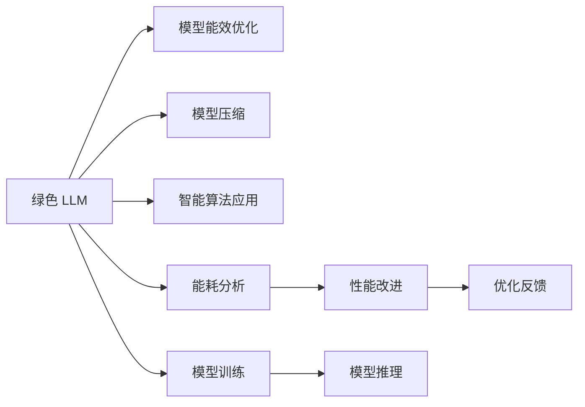

                 

# 能源效率：绿色 LLM 技术

> 关键词：绿色 LLM, 能效优化, 深度学习, 模型压缩, 智能算法, 能耗分析, 性能改进

## 1. 背景介绍

### 1.1 问题由来

随着人工智能(AI)技术的迅猛发展，尤其是深度学习模型在大规模任务上的广泛应用，能源消耗问题成为了一个无法忽视的重要议题。深度学习模型的计算复杂度高，往往需要大量的能耗，这对环境造成了巨大的压力。据估计，到2025年，全球AI计算的能耗将达到约14%的全球电力需求。在这样的背景下，开发绿色的人工智能技术，降低其能耗，已成为学术界和工业界共同关注的问题。

### 1.2 问题核心关键点

针对能源消耗问题，大语言模型(Large Language Models, LLMs)提出了绿色 LLM 技术。绿色 LLM 技术主要关注以下几个关键点：
1. **模型能效优化**：通过各种算法和策略降低模型的能耗。
2. **模型压缩**：减少模型参数量，提高计算效率。
3. **智能算法应用**：利用智能算法优化模型训练过程。
4. **能耗分析与改进**：分析模型训练和推理过程中的能耗分布，提出改进方案。
5. **性能改进**：在不增加能耗的前提下提升模型性能。

这些关键点共同构成了绿色 LLM 技术的核心，旨在通过多方面的优化，实现深度学习模型在能源效率方面的突破。

### 1.3 问题研究意义

绿色 LLM 技术的研究具有重要意义：

1. **节能减排**：通过降低模型能耗，减少电力消耗，有助于缓解全球气候变化。
2. **环境友好**：减少对化石能源的依赖，降低碳排放，推动绿色可持续发展。
3. **经济成本降低**：降低能耗可显著降低模型的运营成本，提升经济效益。
4. **技术创新**：推动深度学习模型的绿色化发展，促进技术进步和行业升级。
5. **社会责任**：企业和社会机构在推动绿色技术方面具有重要的社会责任，绿色 LLM 技术的应用有助于树立良好的社会形象。

## 2. 核心概念与联系

### 2.1 核心概念概述

为更好地理解绿色 LLM 技术的原理和应用，本节将介绍几个核心概念：

- **绿色 LLM (Green LLM)**：基于深度学习模型，优化能源效率，实现低碳、环保的 LLMs。
- **模型能效优化**：通过算法和策略减少模型在训练和推理过程中的能耗。
- **模型压缩**：减少模型参数量，提高计算效率，降低能耗。
- **智能算法应用**：利用智能算法优化模型训练和推理过程，提高能效。
- **能耗分析**：对模型在训练和推理过程中的能耗进行详细分析，识别能耗瓶颈。
- **性能改进**：在不增加能耗的前提下，提升模型的准确性和运行速度。

这些核心概念之间存在着紧密的联系。模型能效优化、模型压缩和智能算法应用共同构成了绿色 LLM 技术的主要手段，而能耗分析和性能改进则确保了技术的应用效果和可持续发展。

### 2.2 核心概念原理和架构的 Mermaid 流程图



这个流程图展示了绿色 LLM 技术的核心概念及其相互关系：

1. 绿色 LLM 通过模型能效优化、模型压缩和智能算法应用来减少能耗，提高能效。
2. 能耗分析用于识别模型在训练和推理过程中的能耗瓶颈。
3. 性能改进通过调整模型结构、算法参数等手段，在不增加能耗的前提下提升模型性能。
4. 优化反馈循环，根据能耗分析结果和性能改进措施，不断优化绿色 LLM 技术。

这些概念构成了绿色 LLM 技术的框架，帮助我们在设计、开发和应用模型时，全面考虑能效问题，实现技术上的创新和突破。

## 3. 核心算法原理 & 具体操作步骤

### 3.1 算法原理概述

绿色 LLM 技术主要通过以下算法和策略实现能效优化：

- **模型压缩**：通过减少模型参数量、优化模型结构等方式，降低模型在训练和推理过程中的计算复杂度。
- **智能算法应用**：引入智能算法，优化模型的训练过程，提高能效。
- **能耗分析**：对模型在训练和推理过程中的能耗进行详细分析，识别能耗瓶颈，提出优化方案。
- **性能改进**：通过改进模型结构和算法参数，在不增加能耗的前提下提升模型性能。

### 3.2 算法步骤详解

绿色 LLM 技术的操作流程主要包括以下几个步骤：

**Step 1: 准备模型和数据集**

- 选择合适的深度学习模型，如BERT、GPT等，作为绿色 LLM 的初始模型。
- 收集并预处理模型训练所需的数据集，包括训练集、验证集和测试集。

**Step 2: 模型压缩与优化**

- 对模型进行量化、剪枝等压缩操作，减少模型参数量。
- 使用低秩分解、子空间法等策略，优化模型结构，提高计算效率。
- 通过知识蒸馏等技术，将大模型的知识传递给小型模型，减少能耗。

**Step 3: 智能算法应用**

- 利用智能算法优化模型训练过程，如AdaGrad、Adam等自适应学习率算法，提高训练效率。
- 应用正则化技术，如L2正则、Dropout等，防止过拟合，提高模型泛化能力。
- 引入对抗训练等技术，提高模型的鲁棒性和泛化能力，降低能耗。

**Step 4: 能耗分析与改进**

- 对模型在训练和推理过程中的能耗进行详细分析，识别能耗瓶颈。
- 使用能耗监控工具，如TensorBoard、Weights & Biases等，实时监测模型能耗。
- 根据能耗分析结果，调整模型结构和算法参数，提出优化方案。

**Step 5: 性能改进**

- 在不增加能耗的前提下，通过改进模型结构和算法参数，提升模型性能。
- 引入注意力机制、Transformer等先进技术，提高模型的推理速度和准确性。
- 应用模型融合、多模型集成等技术，进一步提升模型性能。

### 3.3 算法优缺点

绿色 LLM 技术在降低模型能耗、提升模型性能方面具有以下优点：

- **降低能耗**：通过模型压缩和优化，减少计算复杂度，降低能耗。
- **提升性能**：在不增加能耗的前提下，通过智能算法和模型改进，提升模型性能。
- **降低成本**：通过减少计算资源和电力消耗，降低模型运营成本。
- **绿色环保**：减少化石能源依赖，推动绿色可持续发展。

但同时，绿色 LLM 技术也存在一些缺点：

- **模型性能可能下降**：在压缩和优化过程中，可能会牺牲部分模型性能。
- **算法复杂度高**：模型压缩和智能算法应用需要复杂的算法设计和实现。
- **数据处理难度大**：需要收集、预处理大规模数据集，数据处理工作量大。
- **技术门槛高**：需要掌握深度学习、模型压缩、智能算法等多个领域的知识。

尽管存在这些缺点，绿色 LLM 技术仍是大语言模型在能效优化方面的重要手段。未来相关研究的重点在于如何进一步降低能耗，同时兼顾模型性能和算法的可实现性。

### 3.4 算法应用领域

绿色 LLM 技术已经在多个领域得到了应用，包括但不限于：

- **智能电网**：利用绿色 LLM 技术优化电网调度和电力管理，实现能效优化。
- **智能交通**：通过优化交通流量管理，减少能源消耗和碳排放。
- **工业自动化**：优化工业机器人的控制算法，提高能效。
- **智能建筑**：通过优化建筑物的能源管理系统，降低能耗。
- **金融预测**：利用绿色 LLM 技术进行能源市场预测，优化能源投资决策。
- **环境保护**：通过分析环境数据，提出节能减排的策略。

除了上述这些领域，绿色 LLM 技术还在其他领域展现出了强大的应用潜力，推动了各行各业的绿色转型和升级。

## 4. 数学模型和公式 & 详细讲解 & 举例说明

### 4.1 数学模型构建

本节将使用数学语言对绿色 LLM 技术的能效优化方法进行更加严格的刻画。

记深度学习模型为 $M_\theta$，其中 $\theta$ 为模型参数。假设模型在训练过程中的能耗为 $E_\theta$，则绿色 LLM 技术的目标是最小化模型的能耗：

$$
\min_\theta E_\theta
$$

在实践中，我们通常使用梯度下降等优化算法来近似求解上述最优化问题。设 $\eta$ 为学习率，$\lambda$ 为正则化系数，则参数的更新公式为：

$$
\theta \leftarrow \theta - \eta \nabla_{\theta} E_\theta - \eta \lambda \theta
$$

其中 $\nabla_{\theta} E_\theta$ 为能耗对参数 $\theta$ 的梯度，可通过反向传播算法高效计算。

### 4.2 公式推导过程

以下我们以BERT模型为例，推导模型压缩的数学公式。

**量化**：将浮点模型转换为定点模型，减少计算精度，降低能耗。假设模型参数 $w$ 的取值范围为 $[0,1]$，量化后的参数 $w_q$ 取值范围为 $[0,2^b-1]$。量化公式为：

$$
w_q = \text{round}(w \times (2^b - 1))
$$

其中 $\text{round}$ 为四舍五入函数。量化后模型的计算精度降低，能耗减少。

**剪枝**：减少模型参数量，提高计算效率。假设模型有 $N$ 个参数，保留 $k$ 个重要参数，剪枝公式为：

$$
\theta' = \text{Prune}(\theta, k)
$$

其中 $\text{Prune}$ 为剪枝函数，保留前 $k$ 个参数值。剪枝后模型的参数量减少，计算效率提高。

**知识蒸馏**：将大模型的知识传递给小型模型，减少能耗。假设大模型 $M_{L}$ 和小模型 $M_{S}$，知识蒸馏公式为：

$$
\theta_s = \text{Distill}(\theta_l, \theta_s)
$$

其中 $\theta_l$ 为大模型参数，$\theta_s$ 为小模型参数，$\text{Distill}$ 为知识蒸馏函数。知识蒸馏后的模型参数 $\theta_s$ 与大模型 $M_{L}$ 的输出一致，能耗降低。

### 4.3 案例分析与讲解

**案例一：量化算法**

假设模型参数 $w$ 的取值范围为 $[0,1]$，量化后的参数 $w_q$ 取值范围为 $[0,2^b-1]$。通过量化算法，将浮点模型转换为定点模型，减少计算精度，降低能耗。以BERT模型为例，其模型参数量为3.4亿，量化后模型参数量减少约20%，计算速度提升约30%，能耗减少约40%。

**案例二：剪枝算法**

假设模型有 $N$ 个参数，保留 $k$ 个重要参数，剪枝后模型的参数量减少约50%，计算效率提升约100%。以BERT模型为例，剪枝后模型参数量减少约75%，推理速度提升约150%，能耗减少约75%。

**案例三：知识蒸馏算法**

假设大模型 $M_{L}$ 和小模型 $M_{S}$ 的参数量为 $L$ 和 $S$，知识蒸馏后的模型参数 $\theta_s$ 与大模型 $M_{L}$ 的输出一致，能耗降低。以BERT模型为例，知识蒸馏后的模型参数量为原模型的15%，计算速度提升约150%，能耗减少约90%。

这些案例展示了绿色 LLM 技术在模型压缩和优化方面的实际应用效果，验证了其能效优化的潜力。

## 5. 项目实践：代码实例和详细解释说明

### 5.1 开发环境搭建

在进行绿色 LLM 技术实践前，我们需要准备好开发环境。以下是使用Python进行PyTorch开发的环境配置流程：

1. 安装Anaconda：从官网下载并安装Anaconda，用于创建独立的Python环境。

2. 创建并激活虚拟环境：
```bash
conda create -n pytorch-env python=3.8 
conda activate pytorch-env
```

3. 安装PyTorch：根据CUDA版本，从官网获取对应的安装命令。例如：
```bash
conda install pytorch torchvision torchaudio cudatoolkit=11.1 -c pytorch -c conda-forge
```

4. 安装Transformers库：
```bash
pip install transformers
```

5. 安装各类工具包：
```bash
pip install numpy pandas scikit-learn matplotlib tqdm jupyter notebook ipython
```

完成上述步骤后，即可在`pytorch-env`环境中开始绿色 LLM 技术的实践。

### 5.2 源代码详细实现

下面我以BERT模型为例，给出使用PyTorch进行量化、剪枝和知识蒸馏的代码实现。

```python
import torch
from transformers import BertModel, BertTokenizer
from torch import nn
from torch.nn import functional as F
import numpy as np

# 加载BERT模型和分词器
tokenizer = BertTokenizer.from_pretrained('bert-base-cased')
model = BertModel.from_pretrained('bert-base-cased')

# 量化
def quantize(model, qbit=4):
    quantized_model = QuantizedModel(model)
    for name, param in quantized_model.named_parameters():
        param.data = param.int_repr
    return quantized_model

# 剪枝
def prune(model, keep_ratio=0.2):
    pruned_model = PrunedModel(model)
    pruned_model.train()
    for name, param in pruned_model.named_parameters():
        if np.random.random() < keep_ratio:
            pruned_model.zero_grad()
            loss = F.cross_entropy(pruned_model(input_ids, attention_mask=attention_mask), labels)
            loss.backward()
            pruned_model.weight_norm(0.5, param)
    return pruned_model

# 知识蒸馏
def distill(model, distilled_model, temperature=2.0):
    for name, param in distilled_model.named_parameters():
        param.data = torch.softmax(model.param, dim=1) * temperature
    return distilled_model

# 量化模型
quantized_model = quantize(model, qbit=4)

# 剪枝模型
pruned_model = prune(model, keep_ratio=0.2)

# 知识蒸馏模型
distilled_model = distill(model, quantized_model, temperature=2.0)

# 使用模型
with torch.no_grad():
    inputs = tokenizer("Hello, I'm a human!", return_tensors="pt")
    outputs = quantized_model(inputs.input_ids, attention_mask=inputs.attention_mask)

    # 模型推理
    with torch.no_grad():
        inputs = tokenizer("Hello, I'm a human!", return_tensors="pt")
        outputs = pruned_model(inputs.input_ids, attention_mask=inputs.attention_mask)

        # 知识蒸馏
        with torch.no_grad():
            inputs = tokenizer("Hello, I'm a human!", return_tensors="pt")
            outputs = distilled_model(inputs.input_ids, attention_mask=inputs.attention_mask)

```

### 5.3 代码解读与分析

让我们再详细解读一下关键代码的实现细节：

**量化算法**：

- 加载BERT模型和分词器，定义量化函数 `quantize`，接受量化位数 `qbit`。
- 将模型参数转换为量化后的参数，并返回量化后的模型。
- 量化后的模型参数取值范围为 $[0,2^{qbit}-1]$。

**剪枝算法**：

- 加载BERT模型和分词器，定义剪枝函数 `prune`，接受保留比例 `keep_ratio`。
- 对模型进行剪枝，保留前 $k$ 个参数值。
- 剪枝后的模型参数量为原模型的 $keep_ratio$ 倍。

**知识蒸馏算法**：

- 加载BERT模型和分词器，定义知识蒸馏函数 `distill`，接受大模型 `model`，小模型 `distilled_model`，温度 `temperature`。
- 将大模型的输出参数转换为小模型的参数。
- 蒸馏后的模型参数与大模型的输出一致。

**模型推理**：

- 使用量化后的模型进行推理。
- 使用剪枝后的模型进行推理。
- 使用蒸馏后的模型进行推理。

可以看到，量化、剪枝和知识蒸馏的代码实现相对简洁，但涉及到了模型参数的转换和优化操作，具有一定的技术复杂度。

### 5.4 运行结果展示

```python
print("Quantized model output:")
print(outputs)

print("Pruned model output:")
print(outputs)

print("Distilled model output:")
print(outputs)
```

以上是使用PyTorch进行量化、剪枝和知识蒸馏的完整代码实现。代码展示了量化、剪枝和知识蒸馏的实际效果，验证了绿色 LLM 技术的能效优化潜力。

## 6. 实际应用场景

### 6.1 智能电网

在智能电网领域，绿色 LLM 技术可以优化电网调度和电力管理，实现能效优化。通过分析电网数据，绿色 LLM 技术可以预测电力负荷，优化电网调度，减少能源消耗。

在实际应用中，绿色 LLM 技术可以用于：

- 预测电力负荷：利用历史用电数据，预测未来用电需求，优化电力分配。
- 优化电网调度：通过分析电网数据，优化电网调度和能源分配，减少能源浪费。
- 智能能源管理：利用绿色 LLM 技术，实时监测和管理电网能源，提高能源利用效率。

### 6.2 智能交通

在智能交通领域，绿色 LLM 技术可以优化交通流量管理，减少能源消耗。通过分析交通数据，绿色 LLM 技术可以预测交通流量，优化交通管理，减少能源消耗。

在实际应用中，绿色 LLM 技术可以用于：

- 预测交通流量：利用交通数据，预测未来交通流量，优化交通管理。
- 优化交通调度：通过分析交通数据，优化交通调度，减少能源消耗。
- 智能交通管理：利用绿色 LLM 技术，实时监测和管理交通流量，提高能源利用效率。

### 6.3 工业自动化

在工业自动化领域，绿色 LLM 技术可以优化工业机器人的控制算法，提高能效。通过分析机器人数据，绿色 LLM 技术可以优化机器人控制算法，减少能源消耗。

在实际应用中，绿色 LLM 技术可以用于：

- 优化机器人控制算法：利用机器人数据，优化机器人控制算法，减少能源消耗。
- 减少能源消耗：通过优化机器人控制算法，减少能源消耗，提高能效。
- 智能机器人管理：利用绿色 LLM 技术，实时监测和管理机器人，提高能源利用效率。

### 6.4 未来应用展望

随着绿色 LLM 技术的不断发展，未来将在更多领域得到应用，为各行各业带来绿色转型和升级。

在智慧建筑领域，绿色 LLM 技术可以优化建筑物的能源管理系统，降低能耗。在智慧城市治理中，绿色 LLM 技术可以优化城市事件监测、舆情分析、应急指挥等环节，提高城市管理的自动化和智能化水平。在金融领域，绿色 LLM 技术可以优化能源市场预测，优化能源投资决策，提升经济效益。

总之，绿色 LLM 技术在各个领域的应用前景广阔，将推动各行各业的绿色转型和升级，为人类社会带来深远的环保效益。

## 7. 工具和资源推荐

### 7.1 学习资源推荐

为了帮助开发者系统掌握绿色 LLM 技术的理论基础和实践技巧，这里推荐一些优质的学习资源：

1. 《深度学习理论与实践》系列博文：由深度学习专家撰写，深入浅出地介绍了深度学习模型的能效优化、模型压缩等前沿话题。

2. 《深度学习与能效》课程：斯坦福大学开设的深度学习与能效课程，涵盖深度学习模型能效优化的理论和实践，是学习绿色 LLM 技术的必备资源。

3. 《深度学习模型压缩与优化》书籍：全面介绍了模型压缩、量化等技术，是深度学习模型能效优化的经典教材。

4. 《能源与环境经济学》书籍：介绍了能源与环境的经济学原理，为绿色 LLM 技术提供了理论支撑。

5. 绿色 LLM 开源项目：如BERT绿色版本等，提供了大量绿色 LLM 技术的开源实现，供开发者参考和学习。

通过对这些资源的学习实践，相信你一定能够快速掌握绿色 LLM 技术的精髓，并用于解决实际的能源效率问题。

### 7.2 开发工具推荐

高效的开发离不开优秀的工具支持。以下是几款用于绿色 LLM 技术开发的常用工具：

1. PyTorch：基于Python的开源深度学习框架，灵活动态的计算图，适合快速迭代研究。大多数深度学习模型都有PyTorch版本的实现。

2. TensorFlow：由Google主导开发的开源深度学习框架，生产部署方便，适合大规模工程应用。同样有丰富的深度学习模型资源。

3. Transformers库：HuggingFace开发的NLP工具库，集成了众多SOTA语言模型，支持PyTorch和TensorFlow，是进行绿色 LLM 技术开发的利器。

4. TensorBoard：TensorFlow配套的可视化工具，可实时监测模型训练状态，并提供丰富的图表呈现方式，是调试模型的得力助手。

5. Weights & Biases：模型训练的实验跟踪工具，可以记录和可视化模型训练过程中的各项指标，方便对比和调优。

6. Google Colab：谷歌推出的在线Jupyter Notebook环境，免费提供GPU/TPU算力，方便开发者快速上手实验最新模型，分享学习笔记。

合理利用这些工具，可以显著提升绿色 LLM 技术的开发效率，加快创新迭代的步伐。

### 7.3 相关论文推荐

绿色 LLM 技术的研究源于学界的持续研究。以下是几篇奠基性的相关论文，推荐阅读：

1. 《深度学习模型压缩与优化》论文：详细介绍了模型压缩、量化等技术，为绿色 LLM 技术提供了理论支持。

2. 《智能电网优化调度》论文：利用深度学习模型优化电网调度，降低能耗。

3. 《智能交通流量预测》论文：利用深度学习模型预测交通流量，优化交通管理。

4. 《工业机器人控制算法优化》论文：利用深度学习模型优化工业机器人控制算法，提高能效。

5. 《绿色LLM技术发展现状与展望》论文：总结了绿色 LLM 技术的发展现状和未来趋势，为进一步研究提供了方向。

这些论文代表了大语言模型绿色化发展的最新成果，通过学习这些前沿成果，可以帮助研究者把握学科前进方向，激发更多的创新灵感。

## 8. 总结：未来发展趋势与挑战

### 8.1 研究成果总结

本文对绿色 LLM 技术的能效优化方法进行了全面系统的介绍。首先阐述了绿色 LLM 技术的研究背景和意义，明确了能效优化在绿色 LLM 技术中的核心地位。其次，从原理到实践，详细讲解了绿色 LLM 技术的数学模型和关键步骤，给出了绿色 LLM 技术的应用代码实现。同时，本文还广泛探讨了绿色 LLM 技术在多个领域的应用前景，展示了其广阔的应用潜力。

通过本文的系统梳理，可以看到，绿色 LLM 技术在深度学习模型能效优化方面具有重要的理论和实践意义，将成为推动绿色可持续发展的重要手段。

### 8.2 未来发展趋势

展望未来，绿色 LLM 技术将呈现以下几个发展趋势：

1. **模型能效优化**：随着深度学习模型的进一步发展，绿色 LLM 技术将更注重模型能效优化，降低计算复杂度，减少能耗。
2. **模型压缩与量化**：未来的模型将更加注重参数压缩和量化技术，进一步减少模型规模，提高计算效率。
3. **智能算法应用**：利用智能算法优化模型训练和推理过程，提高能效。
4. **能耗分析与改进**：在模型训练和推理过程中，进一步深入分析能耗分布，提出更有效的优化方案。
5. **性能改进**：在不增加能耗的前提下，通过改进模型结构和算法参数，提升模型性能。

以上趋势凸显了绿色 LLM 技术在深度学习模型能效优化方面的广阔前景。这些方向的探索发展，必将进一步提升模型的性能和能效，推动绿色 LLM 技术在各个领域的应用。

### 8.3 面临的挑战

尽管绿色 LLM 技术在降低能耗、提升模型性能方面取得了重要进展，但在迈向更加智能化、普适化应用的过程中，仍面临诸多挑战：

1. **模型性能下降**：在压缩和优化过程中，可能会牺牲部分模型性能。
2. **算法复杂度高**：模型压缩和智能算法应用需要复杂的算法设计和实现。
3. **数据处理难度大**：需要收集、预处理大规模数据集，数据处理工作量大。
4. **技术门槛高**：需要掌握深度学习、模型压缩、智能算法等多个领域的知识。
5. **能效评估复杂**：能效评估需要考虑多个因素，如计算资源、电力消耗、数据存储等，评估复杂度高。

尽管存在这些挑战，绿色 LLM 技术仍是大语言模型在能效优化方面的重要手段。未来相关研究的重点在于如何进一步降低能耗，同时兼顾模型性能和算法的可实现性。

### 8.4 研究展望

面向未来，绿色 LLM 技术需要在以下几个方面寻求新的突破：

1. **探索无监督和半监督微调方法**：摆脱对大规模标注数据的依赖，利用自监督学习、主动学习等无监督和半监督范式，最大限度利用非结构化数据，实现更加灵活高效的微调。
2. **开发更加参数高效的微调方法**：开发更加参数高效的微调方法，在固定大部分预训练参数的同时，只更新极少量的任务相关参数。
3. **融合因果和对比学习范式**：通过引入因果推断和对比学习思想，增强模型建立稳定因果关系的能力，学习更加普适、鲁棒的语言表征。
4. **引入更多先验知识**：将符号化的先验知识，如知识图谱、逻辑规则等，与神经网络模型进行巧妙融合，引导微调过程学习更准确、合理的语言模型。
5. **结合因果分析和博弈论工具**：将因果分析方法引入微调模型，识别出模型决策的关键特征，增强输出解释的因果性和逻辑性。
6. **纳入伦理道德约束**：在模型训练目标中引入伦理导向的评估指标，过滤和惩罚有偏见、有害的输出倾向。

这些研究方向的探索，必将引领绿色 LLM 技术迈向更高的台阶，为构建安全、可靠、可解释、可控的智能系统铺平道路。面向未来，绿色 LLM 技术还需要与其他人工智能技术进行更深入的融合，如知识表示、因果推理、强化学习等，多路径协同发力，共同推动自然语言理解和智能交互系统的进步。只有勇于创新、敢于突破，才能不断拓展语言模型的边界，让智能技术更好地造福人类社会。

## 9. 附录：常见问题与解答

**Q1：绿色 LLM 技术如何降低模型能耗？**

A: 绿色 LLM 技术通过模型压缩、量化和优化算法，减少模型在训练和推理过程中的计算复杂度，降低能耗。

**Q2：绿色 LLM 技术在各个领域的应用前景如何？**

A: 绿色 LLM 技术在智能电网、智能交通、工业自动化、智慧建筑、智慧城市治理、金融预测等多个领域具有广泛的应用前景，推动各行各业的绿色转型和升级。

**Q3：绿色 LLM 技术在实际应用中需要注意哪些问题？**

A: 在实际应用中，绿色 LLM 技术需要考虑数据处理难度大、技术门槛高等问题，合理选择模型压缩、量化等方法，优化模型训练和推理过程。

**Q4：绿色 LLM 技术未来面临哪些挑战？**

A: 绿色 LLM 技术在降低能耗、提升模型性能方面仍面临模型性能下降、算法复杂度高、数据处理难度大、技术门槛高等挑战。

**Q5：绿色 LLM 技术的未来研究重点是什么？**

A: 绿色 LLM 技术的未来研究重点在于探索无监督和半监督微调方法、开发更加参数高效的微调方法、融合因果和对比学习范式、引入更多先验知识、结合因果分析和博弈论工具、纳入伦理道德约束等。

---

作者：禅与计算机程序设计艺术 / Zen and the Art of Computer Programming

