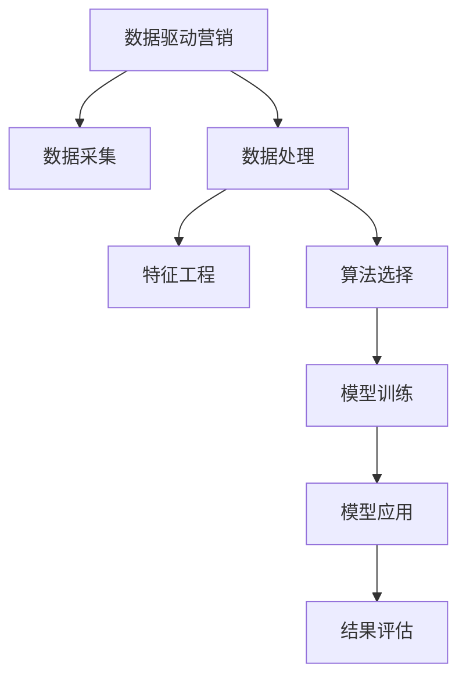

                 

# 自动化创业中的数据驱动营销

> 关键词：数据驱动, 自动化, 创业, 营销, 用户分析, 精准营销, 客户细分, 市场预测, AI 营销

## 1. 背景介绍

### 1.1 问题由来
在数字化时代，创业企业面临着复杂多变的市场环境。如何利用数据，高效精准地实现市场营销，是每一个创业团队必须解决的问题。传统的市场分析方法，往往需要大量的手工操作和大量的时间，难以满足快速迭代的市场需求。数据驱动的营销方法，通过先进的数据分析和AI技术，能快速洞察市场趋势，精确预测用户行为，极大地提高了市场响应的速度和精准度。

### 1.2 问题核心关键点
数据驱动营销的核心在于：利用数据采集、存储、分析等技术手段，通过机器学习算法，发现用户行为背后的规律和模式，将之转化为可操作的营销策略。其关键点包括：
- 数据获取：构建有效的数据采集管道，获取高质量的用户行为数据。
- 数据处理：对海量数据进行预处理、清洗和特征工程，构建合适的模型输入。
- 算法选择：选择合适的机器学习算法，构建用户行为预测模型。
- 模型应用：将预测模型应用于精准推荐、用户细分、市场预测等实际营销场景。
- 结果评估：实时监控和评估营销效果，迭代优化模型。

### 1.3 问题研究意义
数据驱动营销的引入，显著提升了创业企业的市场响应速度和精准度，优化了营销资源配置。其意义体现在：
- 快速迭代：数据驱动营销可快速分析市场趋势，实时响应市场变化，缩短营销周期。
- 精准投放：利用用户行为数据进行用户画像和行为预测，实现更精准的定向投放。
- 高效转化：通过个性化推荐和行为干预，提升用户转化率，提升营销ROI。
- 辅助决策：结合实时市场数据，为决策提供有力支撑，优化营销策略。

## 2. 核心概念与联系

### 2.1 核心概念概述

为更好地理解数据驱动营销的实现原理，本节将介绍几个关键的概念：

- 数据驱动营销(Data-Driven Marketing)：通过数据分析和AI技术，驱动营销策略制定和优化的一种方式。数据驱动的营销策略可以更快地响应市场变化，更精准地实现用户触达和转化。
- 机器学习(Machine Learning)：利用数据和算法，训练模型进行预测、分类、聚类等任务，提升决策的自动化和智能化水平。
- 用户画像(User Profiling)：基于用户行为数据构建用户特征标签，建立详尽的用户画像，为精准营销提供依据。
- 推荐系统(Recommendation System)：利用用户行为数据进行行为预测，生成个性化推荐，提升用户转化和满意度。
- 情感分析(Sentiment Analysis)：通过文本数据挖掘，分析用户情感倾向，优化营销策略。

这些概念之间的逻辑关系可以通过以下Mermaid流程图来展示：



这个流程图展示了数据驱动营销的核心步骤：从数据采集到模型应用的完整流程。

## 3. 核心算法原理 & 具体操作步骤
### 3.1 算法原理概述

数据驱动营销的核心算法为机器学习算法，主要包括回归、分类、聚类、协同过滤等。本文将以回归算法为例，简要介绍其原理。

假设我们有一组用户行为数据 $(x_1,x_2,...,x_n)$ 和对应的转化率 $y_1,y_2,...,y_n$。我们的目标是通过训练一个回归模型 $M(x) = \theta_0 + \theta_1x_1 + \theta_2x_2 + ... + \theta_kx_k$，使得模型输出的预测值 $M(x)$ 尽可能接近真实值 $y$，即最小化损失函数：

$$
\min_{\theta} \sum_{i=1}^{n} (y_i - M(x_i))^2
$$

求解上述优化问题，可以使用梯度下降等优化算法，不断更新模型参数 $\theta$，直至收敛。

### 3.2 算法步骤详解

基于回归算法的数据驱动营销具体步骤如下：

1. **数据准备**：收集用户行为数据，进行初步清洗和特征工程，转化为合适的模型输入。

2. **模型选择**：选择合适的回归算法，如线性回归、岭回归、Lasso回归等。

3. **模型训练**：使用历史数据训练回归模型，确定模型参数。

4. **模型评估**：使用测试数据评估模型性能，调整模型参数。

5. **模型应用**：将训练好的模型应用于新数据，预测用户转化率。

6. **效果优化**：实时监控模型预测效果，根据市场反馈优化模型。

### 3.3 算法优缺点

数据驱动营销的回归算法具有以下优点：
- 预测准确：回归算法通过学习历史数据中的规律，能够对未来行为进行较为准确的预测。
- 简单易用：线性回归等算法实现简单，易于部署和维护。
- 可解释性强：回归模型中的每个特征参数都具有明确的意义，易于理解和解释。

其缺点主要包括：
- 对异常值敏感：回归模型对异常值和噪声较为敏感，需要额外处理。
- 无法处理非线性关系：线性回归假设数据呈现线性关系，难以处理复杂的非线性关系。
- 数据质量依赖性高：回归模型的效果依赖于数据质量，数据缺失、错误等问题会影响模型效果。

### 3.4 算法应用领域

数据驱动营销的回归算法在以下领域得到了广泛应用：

- 电商推荐：基于用户历史行为数据，预测用户对商品的转化率，实现个性化推荐。
- 广告投放：根据用户行为数据，预测用户对广告的响应，实现精准投放。
- 客户流失预测：分析用户行为特征，预测流失风险，提前采取干预措施。
- 销售预测：基于历史销售数据，预测未来销售趋势，优化库存和营销策略。
- 金融风控：分析用户交易数据，预测欺诈风险，实现风险预警。

## 4. 数学模型和公式 & 详细讲解  
### 4.1 数学模型构建

回归模型的数学模型为：

$$
y_i = \theta_0 + \theta_1x_{i1} + \theta_2x_{i2} + ... + \theta_kx_{ik} + \epsilon_i
$$

其中 $y_i$ 为第 $i$ 个样本的转化率，$\theta_0, \theta_1, ..., \theta_k$ 为模型参数，$x_{i1}, x_{i2}, ..., x_{ik}$ 为第 $i$ 个样本的特征向量，$\epsilon_i$ 为随机误差项。

### 4.2 公式推导过程

回归模型的损失函数为：

$$
\mathcal{L}(\theta) = \frac{1}{2N} \sum_{i=1}^{N} (y_i - M(x_i))^2
$$

其中 $M(x_i)$ 为第 $i$ 个样本的预测值，$N$ 为样本数。

对于线性回归，梯度下降的优化目标为：

$$
\theta = \mathop{\arg\min}_{\theta} \frac{1}{2N} \sum_{i=1}^{N} (y_i - \theta_0 - \sum_{j=1}^{k}\theta_jx_{ij})^2
$$

求解上述优化问题，可以通过梯度下降法进行。

### 4.3 案例分析与讲解

以下为一个电商推荐系统中的线性回归模型案例。假设我们有一组用户历史购买数据：

| 用户ID | 商品ID | 购买时间 | 转化率 |
| --- | --- | --- | --- |
| 1 | 1 | 2020-01-01 | 0.1 |
| 1 | 2 | 2020-01-02 | 0.05 |
| 1 | 3 | 2020-01-03 | 0.2 |
| 2 | 1 | 2020-01-01 | 0.2 |
| 2 | 2 | 2020-01-02 | 0.3 |
| 2 | 3 | 2020-01-03 | 0.1 |

假设我们要预测用户对新商品 "4" 的转化率。我们首先对数据进行归一化，得到特征矩阵 $X$ 和标签向量 $y$。然后使用线性回归模型进行预测，得到转化率预测值。

## 5. 项目实践：代码实例和详细解释说明
### 5.1 开发环境搭建

在进行数据驱动营销的实现前，我们需要准备好开发环境。以下是使用Python进行Scikit-learn库开发的简单配置流程：

1. 安装Anaconda：从官网下载并安装Anaconda，用于创建独立的Python环境。

2. 创建并激活虚拟环境：
```bash
conda create -n data-driven-marketing python=3.8 
conda activate data-driven-marketing
```

3. 安装Scikit-learn：
```bash
pip install scikit-learn
```

4. 安装各类工具包：
```bash
pip install numpy pandas scikit-learn matplotlib tqdm jupyter notebook ipython
```

完成上述步骤后，即可在`data-driven-marketing`环境中开始数据驱动营销的实践。

### 5.2 源代码详细实现

下面我们以电商推荐系统为例，给出使用Scikit-learn库进行回归分析的代码实现。

首先，定义数据处理函数：

```python
import pandas as pd
from sklearn.preprocessing import StandardScaler

def preprocess_data(data_path):
    df = pd.read_csv(data_path)
    
    # 数据清洗
    df.dropna(inplace=True)
    
    # 特征工程
    X = df[['user_id', 'item_id', 'time']]  # 特征列
    y = df['convert_rate']  # 目标列
    
    # 归一化
    scaler = StandardScaler()
    X_scaled = scaler.fit_transform(X)
    
    return X_scaled, y
```

然后，定义回归模型训练函数：

```python
from sklearn.linear_model import LinearRegression
from sklearn.metrics import mean_squared_error

def train_model(X, y, validation_fraction=0.2, cv=None):
    model = LinearRegression()
    X_train, X_valid, y_train, y_valid = train_test_split(X, y, test_size=validation_fraction, random_state=42)
    
    # 训练模型
    model.fit(X_train, y_train)
    
    # 评估模型
    y_pred = model.predict(X_valid)
    mse = mean_squared_error(y_valid, y_pred)
    
    return model, mse
```

接着，定义测试和预测函数：

```python
def test_model(model, X_test, y_test):
    y_pred = model.predict(X_test)
    mse = mean_squared_error(y_test, y_pred)
    
    return mse

def predict_new_item(model, user_id, item_id, time):
    X_new = [[user_id, item_id, time]]
    X_new_scaled = scaler.transform(X_new)
    y_new_pred = model.predict(X_new_scaled)
    
    return y_new_pred[0]
```

最后，启动回归模型训练流程并预测新商品：

```python
X_scaled, y = preprocess_data('data.csv')
model, mse = train_model(X_scaled, y)
print(f'Model MSE: {mse:.4f}')

# 预测新商品转化率
user_id = 1
item_id = 4
time = '2020-01-04'
y_new_pred = predict_new_item(model, user_id, item_id, time)
print(f'预测转化率: {y_new_pred:.4f}')
```

以上就是使用Scikit-learn进行电商推荐系统回归分析的完整代码实现。可以看到，Scikit-learn提供了方便的API接口，极大地简化了模型训练和评估的流程。

### 5.3 代码解读与分析

让我们再详细解读一下关键代码的实现细节：

**preprocess_data函数**：
- 读取数据集，并进行初步清洗和特征工程。
- 归一化特征数据，使之满足线性回归模型的要求。

**train_model函数**：
- 对数据进行划分，分为训练集和验证集。
- 使用训练集数据训练线性回归模型。
- 在验证集上评估模型性能，输出均方误差。

**test_model函数**：
- 对测试集数据进行预测，评估模型性能。

**predict_new_item函数**：
- 对新样本进行预处理和归一化。
- 使用训练好的模型对新样本进行预测，输出转化率。

**主函数**：
- 对数据进行预处理和模型训练。
- 评估模型性能并输出。
- 对新商品进行预测，输出转化率。

可以看到，Scikit-learn使得回归模型的实现变得简洁高效。开发者可以将更多精力放在数据处理、特征工程等高层逻辑上，而不必过多关注底层的实现细节。

## 6. 实际应用场景

### 6.1 电商推荐系统

基于回归算法的数据驱动营销，在电商推荐系统中得到了广泛应用。传统电商推荐系统往往只依赖用户的历史行为数据进行物品推荐，难以深入挖掘用户的潜在需求。通过回归分析，可以进一步探索用户的特征和行为规律，实现更加精准的个性化推荐。

在技术实现上，可以利用用户历史浏览、购买数据，建立回归模型，预测用户对新商品的转化率，从而实现更精准的物品推荐。同时，利用回归模型对用户行为进行预测，可以提前发现流失风险，进行定向挽留。

### 6.2 广告投放系统

数据驱动营销的广告投放系统，通过回归分析预测用户对广告的响应，实现精准投放。在实际应用中，可以利用用户的历史行为数据，建立回归模型，预测用户对不同广告的点击率、转化率等指标，从而实现更高效的广告投放策略。

广告投放系统可以分为线上和线下两种类型：
- 线上广告投放：通过点击率预测模型，预测用户对线上广告的响应，进行定向投放。
- 线下广告投放：通过转化率预测模型，预测用户对线下广告的响应，进行精准投放。

### 6.3 金融风控系统

金融风控系统需要实时监控用户的交易行为，预测欺诈风险，及时采取防范措施。通过回归分析，可以建立用户行为预测模型，实时评估用户的风险水平，实现风险预警和控制。

在实际应用中，可以利用用户的交易数据，建立回归模型，预测用户的欺诈风险。如果模型输出超过预设阈值，系统便会自动预警，并进行人工审核。

## 7. 工具和资源推荐

### 7.1 学习资源推荐

为了帮助开发者系统掌握数据驱动营销的理论基础和实践技巧，这里推荐一些优质的学习资源：

1. 《Python机器学习》书籍：由Scikit-learn库的作者编写，系统讲解了Python在机器学习中的应用，包括回归分析、特征工程等。

2. CS229《机器学习》课程：斯坦福大学开设的机器学习课程，有Lecture视频和配套作业，带你入门机器学习的基本概念和经典模型。

3. Kaggle机器学习竞赛：Kaggle上举办了大量的机器学习竞赛，通过实践竞赛可以巩固和提升回归分析等技能。

4. Weights & Biases：模型训练的实验跟踪工具，可以记录和可视化模型训练过程中的各项指标，方便对比和调优。

5. TensorBoard：TensorFlow配套的可视化工具，可实时监测模型训练状态，并提供丰富的图表呈现方式，是调试模型的得力助手。

通过对这些资源的学习实践，相信你一定能够快速掌握数据驱动营销的精髓，并用于解决实际的业务问题。

### 7.2 开发工具推荐

高效的开发离不开优秀的工具支持。以下是几款用于数据驱动营销开发的常用工具：

1. Python：广泛用于机器学习和数据分析的编程语言，拥有丰富的科学计算库和数据分析工具。

2. Scikit-learn：基于Python的科学计算库，提供了丰富的回归分析工具，简单易用。

3. Pandas：数据处理库，提供高效的数据清洗、转换和分析工具，适用于大数据分析。

4. TensorFlow：由Google主导开发的深度学习框架，支持复杂的机器学习模型，生产部署方便。

5. Keras：基于TensorFlow的深度学习库，提供了简单易用的API接口，适合快速迭代实验。

6. Jupyter Notebook：交互式编程环境，支持Python等语言，实时展示代码执行结果。

合理利用这些工具，可以显著提升数据驱动营销任务的开发效率，加快创新迭代的步伐。

### 7.3 相关论文推荐

数据驱动营销的回归分析方法在NLP、金融、电商等多个领域得到了广泛应用。以下是几篇奠基性的相关论文，推荐阅读：

1. "The Elements of Statistical Learning"：由Tibshirani等人编写，全面介绍了统计学习中的回归分析方法，是回归分析领域的经典著作。

2. "Adaptive Boosting"：由Freund等人编写，介绍了AdaBoost算法，这是一种强有力的回归方法，适用于非线性关系和异常值较多的数据。

3. "Random Forests"：由Breiman编写，介绍了随机森林算法，适用于高维数据和复杂数据集。

4. "Neural Network and Deep Learning"：由Goodfellow等人编写，介绍了深度学习在回归分析中的应用，特别是卷积神经网络和循环神经网络在时序数据上的表现。

5. "Support Vector Machines"：由Cortes和Vapnik编写，介绍了支持向量机算法，适用于小样本数据和线性不可分的情况。

这些论文代表了大数据驱动营销的回归分析方法的发展脉络。通过学习这些前沿成果，可以帮助研究者把握学科前进方向，激发更多的创新灵感。

## 8. 总结：未来发展趋势与挑战

### 8.1 总结

本文对基于回归算法的数据驱动营销方法进行了全面系统的介绍。首先阐述了数据驱动营销的研究背景和意义，明确了回归分析在精准营销中的重要作用。其次，从原理到实践，详细讲解了回归算法的数学原理和关键步骤，给出了回归分析任务开发的完整代码实例。同时，本文还广泛探讨了回归分析方法在电商推荐、广告投放、金融风控等多个行业领域的应用前景，展示了回归分析方法的巨大潜力。最后，本文精选了回归分析技术的各类学习资源，力求为读者提供全方位的技术指引。

通过本文的系统梳理，可以看到，基于回归算法的回归分析方法在数据驱动营销中发挥着至关重要的作用。回归分析能够快速分析用户行为规律，预测用户行为，为精准营销提供有力支撑。未来，伴随数据量的持续增加和数据处理技术的不断进步，回归分析将进一步提升市场营销的智能化和自动化水平，为创业企业带来新的增长点。

### 8.2 未来发展趋势

展望未来，数据驱动营销的回归分析技术将呈现以下几个发展趋势：

1. 算法多样化：除了传统的回归分析外，未来将涌现更多高级的回归方法，如AdaBoost、随机森林、梯度提升树等，根据不同数据特点选择最优算法。

2. 数据质量提升：随着数据采集技术的提升，数据质量将得到大幅提升，回归分析模型能够更好地学习用户行为规律。

3. 模型优化：利用深度学习和强化学习等方法，进一步优化回归模型的性能，提升预测精度和效率。

4. 实时计算：利用大数据和分布式计算技术，实现实时数据处理和回归分析，为营销策略的实时调整提供支撑。

5. 跨领域融合：回归分析方法将与其他技术，如自然语言处理、计算机视觉等进行深度融合，拓展应用范围。

6. 智能化决策：结合机器学习和大数据技术，实现市场数据的智能化分析和决策支持。

以上趋势凸显了回归分析技术在数据驱动营销中的重要地位。这些方向的探索发展，必将进一步提升市场营销的智能化和自动化水平，为创业企业带来新的增长点。

### 8.3 面临的挑战

尽管回归分析方法在数据驱动营销中取得了显著成就，但在迈向更加智能化、普适化应用的过程中，它仍面临着诸多挑战：

1. 数据依赖性强：回归分析的效果依赖于高质量的数据，数据的缺失、错误、异常等问题可能影响模型效果。

2. 特征工程复杂：回归模型对特征工程的要求较高，需要开发者具备较强的数据处理和特征选择能力。

3. 模型复杂度高：回归模型过于复杂可能出现过度拟合，模型过于简单则可能无法捕捉复杂关系。

4. 实时性要求高：在实际应用中，回归模型需要实时处理大量数据，对计算资源的要求较高。

5. 可解释性不足：回归模型难以解释其决策过程，在需要解释性的应用场景中可能存在局限。

6. 数据隐私问题：回归分析涉及大量个人数据，如何保护数据隐私，是数据驱动营销中必须考虑的问题。

正视回归分析面临的这些挑战，积极应对并寻求突破，将是大数据驱动营销走向成熟的必由之路。

### 8.4 研究展望

面对回归分析面临的种种挑战，未来的研究需要在以下几个方面寻求新的突破：

1. 探索自动化特征工程方法：利用机器学习算法自动选择和生成特征，简化特征工程流程。

2. 研究轻量级回归方法：开发更轻量级的回归算法，提升模型实时性和效率。

3. 引入深度学习技术：利用深度学习模型处理高维数据和复杂关系，提升模型预测能力。

4. 结合强化学习技术：利用强化学习技术优化回归模型的参数，提升模型泛化能力和鲁棒性。

5. 加强数据隐私保护：研究数据加密、匿名化等技术，保护用户隐私，确保数据安全。

这些研究方向的探索，必将引领数据驱动营销回归分析技术迈向更高的台阶，为创业企业带来更高效、智能的市场营销解决方案。

## 9. 附录：常见问题与解答

**Q1：数据驱动营销的优势和劣势是什么？**

A: 数据驱动营销的优势包括：
- 精准度高：通过数据分析和模型训练，能够精准预测用户行为，实现定向投放。
- 实时性强：能够实时分析市场数据，快速响应市场变化。
- 成本低廉：数据驱动营销减少了手工操作的成本，提升了营销效率。

其劣势主要包括：
- 数据质量要求高：数据质量的好坏直接影响模型效果，数据缺失、错误等问题可能影响模型预测。
- 模型依赖强：模型效果依赖于数据的真实性和完整性，数据偏差可能导致模型预测偏差。
- 技术门槛高：需要具备数据分析和模型训练的能力，技术门槛较高。

**Q2：数据驱动营销中的回归分析需要注意哪些问题？**

A: 数据驱动营销中的回归分析需要注意的问题包括：
- 数据采集：建立有效的数据采集管道，获取高质量的用户行为数据。
- 数据预处理：对数据进行清洗、归一化和特征工程，提升数据质量。
- 模型选择：选择合适的回归算法，考虑数据特点和应用场景。
- 模型训练：使用合适的优化算法，避免过拟合和欠拟合问题。
- 模型评估：实时监控模型效果，根据市场反馈进行调整。

**Q3：如何优化数据驱动营销中的回归分析模型？**

A: 数据驱动营销中的回归分析模型优化主要从以下几个方面进行：
- 数据质量提升：优化数据采集流程，减少数据缺失和错误。
- 特征工程改进：引入更多特征，进行特征选择和降维。
- 模型选择优化：结合多种回归算法，选择最优模型。
- 模型参数调优：使用网格搜索、随机搜索等方法，优化模型参数。
- 模型集成优化：使用集成学习技术，提升模型性能。

**Q4：数据驱动营销在实际应用中面临哪些挑战？**

A: 数据驱动营销在实际应用中面临的挑战包括：
- 数据隐私问题：保护用户隐私，防止数据泄露。
- 数据处理效率：处理海量数据，提升计算效率。
- 数据偏差问题：解决数据偏差问题，提升模型泛化能力。
- 模型解释性：提升模型的可解释性，方便用户理解和使用。
- 模型鲁棒性：提升模型的鲁棒性，应对数据异常和噪声。

**Q5：数据驱动营销的未来发展方向是什么？**

A: 数据驱动营销的未来发展方向包括：
- 数据自动化：利用自动化技术，简化数据处理流程。
- 模型智能化：结合深度学习和强化学习技术，提升模型预测能力。
- 跨领域融合：与其他技术进行深度融合，拓展应用范围。
- 实时化：实现实时数据处理和分析，提升响应速度。
- 智能化决策：利用大数据和智能算法，实现智能化决策支持。

这些发展方向将引领数据驱动营销技术迈向更高的台阶，为创业企业带来新的增长点。

---

作者：禅与计算机程序设计艺术 / Zen and the Art of Computer Programming

