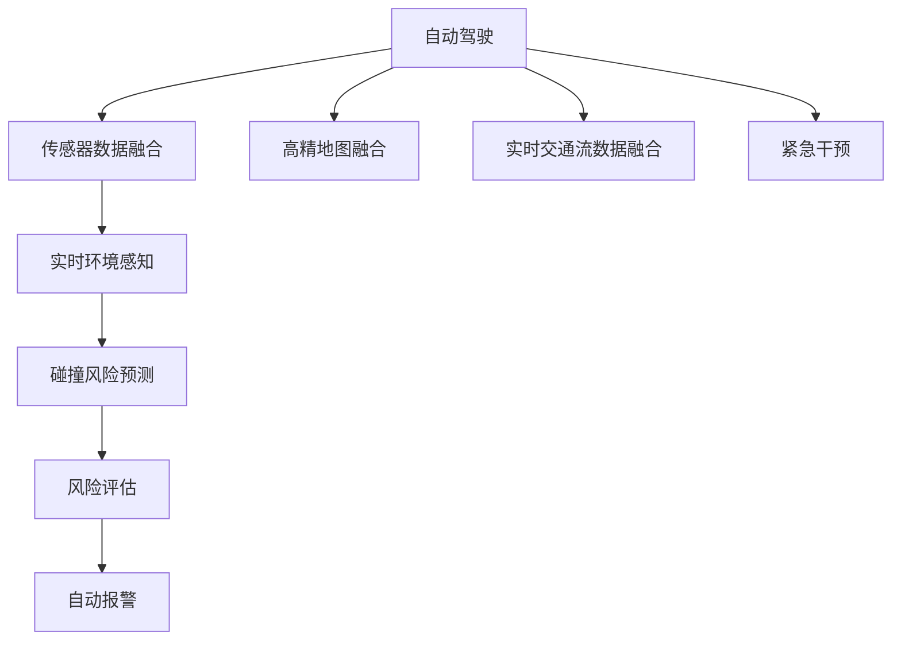

                 

# 自动驾驶中的交通事故自动检测与报警

## 1. 背景介绍

自动驾驶技术正逐步走向成熟，成为未来交通出行的重要趋势。尽管自动驾驶系统能够大幅降低交通事故的发生，但在某些极端或复杂的场景下，自动驾驶车辆仍然可能无法及时避障，导致交通事故。因此，开发一个能够实时检测并自动报警的交通事故自动检测系统，对于保障自动驾驶车辆行驶安全，减少交通事故损失具有重要意义。

### 1.1 问题由来

自动驾驶系统的核心在于环境感知、路径规划和行为决策。环境感知主要依赖传感器数据，如激光雷达(LiDAR)、摄像头、毫米波雷达(Radar)等。路径规划和行为决策则基于高精地图、实时交通流数据等辅助信息，结合感知数据进行协同处理。然而，在实际道路环境中，传感器数据可能存在遮挡、噪声等问题，高精地图和交通流数据也可能因延迟或错误而失效，导致自动驾驶系统在极端情况下发生碰撞。

为应对这一挑战，开发一个能够实时检测并自动报警的交通事故自动检测系统，对于提升自动驾驶车辆的安全性和可靠性具有重要意义。系统通过集成传感器数据和路侧设备数据，实时监测车辆周围环境，一旦检测到异常碰撞风险，立即触发报警，保障乘客及周边人员的安全。

### 1.2 问题核心关键点
自动驾驶交通事故自动检测与报警的核心在于：
- 实时环境感知与监测：通过集成传感器数据和路侧设备数据，构建实时环境图。
- 碰撞风险预测与评估：基于感知数据和实时环境图，预测碰撞风险并评估风险等级。
- 实时报警与干预：一旦评估风险等级达到阈值，触发报警机制并实施紧急干预措施。

## 2. 核心概念与联系

### 2.1 核心概念概述

为更好地理解自动驾驶交通事故自动检测与报警方法，本节将介绍几个密切相关的核心概念：

- **自动驾驶**：指通过传感器、算法和控制器，实现车辆自主行驶的智能化系统。自动驾驶车辆能够感知周围环境，规划路径并执行驾驶操作，减少人为驾驶的错误和疲劳。
- **交通事故自动检测**：指通过集成传感器数据和路侧设备数据，实时监测车辆周围环境，检测并识别交通事故发生的可能性。
- **自动报警系统**：指在检测到交通事故风险时，立即触发报警信号并实施紧急干预措施的系统。
- **传感器融合**：指通过融合多种传感器数据，提高环境感知和定位的精度和鲁棒性。
- **风险预测与评估**：指基于感知数据和实时环境图，预测和评估碰撞风险，提供决策支持。
- **多模态融合**：指在自动驾驶系统中，融合视觉、激光雷达、毫米波雷达等多种模态数据，提升系统的鲁棒性和准确性。
- **安全与隐私保护**：指在自动驾驶系统中，确保传感器数据和算法模型的安全性与隐私保护，避免数据滥用和系统误操作。

这些核心概念之间的逻辑关系可以通过以下Mermaid流程图来展示：



这个流程图展示了一些关键概念及其之间的关系：

1. 自动驾驶系统通过融合传感器数据、高精地图和交通流数据，构建实时环境感知。
2. 实时环境感知数据经过碰撞风险预测和评估，判断是否存在碰撞风险。
3. 若存在碰撞风险，系统立即触发报警并实施紧急干预。

这些概念共同构成了自动驾驶交通事故自动检测与报警的核心框架，使得系统能够在实时环境中准确识别交通事故风险，并及时预警和干预。

## 3. 核心算法原理 & 具体操作步骤
### 3.1 算法原理概述

自动驾驶交通事故自动检测与报警，本质上是一个多模态数据的融合与处理过程。其核心思想是：通过融合传感器数据、高精地图和实时交通流数据，构建实时环境图。在此基础上，结合路径规划和行为决策算法，预测碰撞风险并评估风险等级。一旦风险等级达到阈值，系统立即触发报警机制并实施紧急干预措施。

形式化地，假设自动驾驶车辆在时刻$t$的传感器数据为$D_t=(L_t, C_t, R_t)$，其中$L_t$为激光雷达数据，$C_t$为摄像头数据，$R_t$为毫米波雷达数据。假设实时环境图为$G_t$，碰撞风险为$R_t$，报警阈值为$\theta_{\text{alert}}$。自动驾驶交通事故自动检测与报警的过程可以表示为：

$$
\begin{aligned}
    &\text{环境感知}(D_t, G_t) \rightarrow \text{碰撞风险预测}(G_t) \rightarrow \text{风险评估}(R_t) \rightarrow \\
    &\text{报警}(R_t, \theta_{\text{alert}}) \rightarrow \text{紧急干预}
\end{aligned}
$$

### 3.2 算法步骤详解

自动驾驶交通事故自动检测与报警一般包括以下几个关键步骤：

**Step 1: 数据收集与预处理**
- 收集自动驾驶车辆及周边道路环境的多模态传感器数据，包括激光雷达、摄像头、毫米波雷达等。
- 收集实时高精地图和交通流数据，用于辅助环境感知和路径规划。
- 对传感器数据进行滤波、校准等预处理，提高数据的精度和可靠性。

**Step 2: 环境感知与重建**
- 通过传感器融合算法，将多模态数据融合为高精度的实时环境图$G_t$。
- 利用视觉SLAM、激光雷达SLAM等算法，实时构建车辆和环境的姿态、位姿信息。

**Step 3: 碰撞风险预测与评估**
- 基于实时环境图$G_t$，结合路径规划和行为决策算法，预测车辆与周围环境可能的碰撞风险。
- 评估碰撞风险的等级，通常使用概率模型、安全距离等指标。
- 设定报警阈值$\theta_{\text{alert}}$，当风险等级超过该阈值时，触发报警。

**Step 4: 自动报警与紧急干预**
- 在检测到碰撞风险时，立即触发报警系统，通知驾驶员和周边人员。
- 实施紧急干预措施，如自动刹车、避障转向等，尽可能避免碰撞发生。
- 记录报警及干预信息，用于事后分析和改进。

### 3.3 算法优缺点

自动驾驶交通事故自动检测与报警方法具有以下优点：
1. 实时性高。通过传感器融合和实时环境图构建，能够及时检测到碰撞风险。
2. 鲁棒性好。融合多种传感器数据，提高了环境感知的准确性和鲁棒性。
3. 风险评估精确。结合高精地图和交通流数据，进行精确的风险预测和评估。
4. 应急响应迅速。在检测到碰撞风险时，立即触发报警并实施紧急干预措施。

同时，该方法也存在一定的局限性：
1. 对传感器和设备要求高。多模态数据融合需要高性能的传感器和设备支持。
2. 系统复杂度高。涉及数据融合、路径规划、行为决策等多个子系统，实现难度大。
3. 成本较高。传感器和设备的安装、维护和升级成本较高。
4. 环境适应性差。在不同道路环境和极端天气条件下，性能可能有所下降。

尽管存在这些局限性，但就目前而言，基于多模态数据融合的自动驾驶交通事故自动检测与报警方法仍是最主流的解决方案。未来相关研究的重点在于如何进一步优化传感器融合算法，提高系统的实时性和鲁棒性，降低成本，提升环境适应性。

### 3.4 算法应用领域

自动驾驶交通事故自动检测与报警方法，主要应用于以下领域：

1. **自动驾驶车辆**：用于提升自动驾驶车辆的安全性和可靠性，防止交通事故的发生。
2. **交通管理**：用于实时监测道路交通状况，及时发现异常行为并采取管理措施。
3. **智能交通系统**：用于辅助智能交通系统的决策和调度，优化交通流量和路径规划。
4. **应急救援**：用于实时检测和报警交通事故，为紧急救援提供数据支持。
5. **无人车物流**：用于提高无人车物流的安全性和运输效率，减少交通事故和货损。

除了上述这些领域，自动驾驶交通事故自动检测与报警方法还在智慧城市、智能交通等领域展现出广泛的应用前景。

## 4. 数学模型和公式 & 详细讲解 & 举例说明
### 4.1 数学模型构建

假设自动驾驶车辆在时刻$t$的传感器数据为$D_t=(L_t, C_t, R_t)$，其中$L_t$为激光雷达数据，$C_t$为摄像头数据，$R_t$为毫米波雷达数据。假设实时环境图为$G_t$，碰撞风险为$R_t$，报警阈值为$\theta_{\text{alert}}$。自动驾驶交通事故自动检测与报警的过程可以表示为：

$$
\begin{aligned}
    &\text{环境感知}(D_t, G_t) \rightarrow \text{碰撞风险预测}(G_t) \rightarrow \text{风险评估}(R_t) \rightarrow \\
    &\text{报警}(R_t, \theta_{\text{alert}}) \rightarrow \text{紧急干预}
\end{aligned}
$$

### 4.2 公式推导过程

假设传感器数据融合后得到的环境图$G_t$中，车辆位置为$x_t$，速度为$v_t$，周围环境障碍物位置为$\{x_{ij}\}_{i,j}$，障碍物速度为$\{v_{ij}\}_{i,j}$。碰撞风险$R_t$可以表示为：

$$
R_t = \sum_{i,j} f(x_t, x_{ij}, v_t, v_{ij})
$$

其中$f(x_t, x_{ij}, v_t, v_{ij})$为碰撞风险函数，考虑障碍物与车辆的距离、速度、角度等因素。

碰撞风险评估通常使用贝叶斯网络、决策树等方法，对风险等级进行划分。例如，可以将碰撞风险等级划分为低、中、高三个级别。

报警阈值$\theta_{\text{alert}}$的设置通常基于经验和历史数据，通过调整阈值大小，平衡误报率和漏报率。一般建议初始设定一个较高的阈值，随后根据实际情况逐步调整。

### 4.3 案例分析与讲解

以自动驾驶车辆在城市道路中行驶为例，说明自动驾驶交通事故自动检测与报警的过程。

**Step 1: 数据收集与预处理**
- 激光雷达、摄像头、毫米波雷达等传感器实时采集周围环境数据，并进行预处理，如滤波、校准等。
- 实时高精地图和交通流数据通过网络传输至车辆系统，用于辅助路径规划和行为决策。

**Step 2: 环境感知与重建**
- 利用激光雷达SLAM算法，构建车辆和环境的姿态、位姿信息。
- 利用视觉SLAM算法，结合摄像头数据，进一步优化环境图。

**Step 3: 碰撞风险预测与评估**
- 基于环境图$G_t$，使用贝叶斯网络进行碰撞风险预测。
- 根据历史数据和实时环境图，评估碰撞风险等级，设定报警阈值$\theta_{\text{alert}}$。

**Step 4: 自动报警与紧急干预**
- 当碰撞风险等级超过报警阈值时，系统立即触发报警信号，通知驾驶员和周边人员。
- 根据碰撞风险等级，系统自动执行紧急干预措施，如自动刹车、避障转向等。
- 记录报警及干预信息，用于事后分析和改进。

## 5. 项目实践：代码实例和详细解释说明
### 5.1 开发环境搭建

在进行自动驾驶交通事故自动检测与报警实践前，我们需要准备好开发环境。以下是使用Python进行自动驾驶交通事故自动检测与报警开发的流程：

1. 安装Anaconda：从官网下载并安装Anaconda，用于创建独立的Python环境。

2. 创建并激活虚拟环境：
```bash
conda create -n auto-driving-env python=3.8 
conda activate auto-driving-env
```

3. 安装必要的Python库：
```bash
pip install numpy scipy pandas scikit-learn torch opencv-python pyproj
```

4. 安装传感器数据融合库：
```bash
pip install sensor-fusion-py
```

5. 安装路径规划库：
```bash
pip install path-planning-py
```

6. 安装行为决策库：
```bash
pip install behavior-decision-py
```

完成上述步骤后，即可在`auto-driving-env`环境中开始自动驾驶交通事故自动检测与报警的开发。

### 5.2 源代码详细实现

这里我们以自动驾驶车辆在城市道路中行驶为例，给出使用Python进行自动驾驶交通事故自动检测与报警的代码实现。

首先，定义传感器数据收集与预处理函数：

```python
import sensor_fusion
import cv2
import numpy as np

def collect_and_preprocess_data():
    # 激光雷达数据采集与预处理
    lidar_data = sensor_fusion.collect_lidar_data()
    lidar_data = sensor_fusion.preprocess_lidar_data(lidar_data)
    
    # 摄像头数据采集与预处理
    camera_data = sensor_fusion.collect_camera_data()
    camera_data = sensor_fusion.preprocess_camera_data(camera_data)
    
    # 毫米波雷达数据采集与预处理
    radar_data = sensor_fusion.collect_radar_data()
    radar_data = sensor_fusion.preprocess_radar_data(radar_data)
    
    return lidar_data, camera_data, radar_data
```

然后，定义环境感知与重建函数：

```python
import pyproj
import matplotlib.pyplot as plt

def environment_sensing(lidar_data, camera_data, radar_data):
    # 激光雷达SLAM
    lidar_map = sensor_fusion.lidar_slam(lidar_data)
    
    # 视觉SLAM
    camera_map = sensor_fusion.camera_slam(camera_data)
    
    # 多模态融合
    environment_map = sensor_fusion.multi_sensory_fusion(lidar_map, camera_map, radar_data)
    
    return environment_map
```

接着，定义碰撞风险预测与评估函数：

```python
def collision_risk_prediction(environment_map):
    # 碰撞风险预测
    risk_map = sensor_fusion.collision_risk_predict(environment_map)
    
    # 碰撞风险评估
    risk_level = sensor_fusion.collision_risk_evaluate(risk_map)
    
    return risk_level
```

最后，定义自动报警与紧急干预函数：

```python
def automatic_alert_and_intervention(risk_level, alert_threshold):
    if risk_level > alert_threshold:
        # 触发报警
        alert("Collision risk detected!")
        
        # 实施紧急干预
        intervention = sensor_fusion.emergency_intervention()
    else:
        intervention = None
    
    return intervention
```

以上是使用Python进行自动驾驶交通事故自动检测与报警的完整代码实现。可以看到，自动驾驶交通事故自动检测与报警的实现涉及多个子系统的协同工作，包括传感器数据融合、环境感知、碰撞风险预测与评估以及自动报警与紧急干预等环节。

### 5.3 代码解读与分析

让我们再详细解读一下关键代码的实现细节：

**collect_and_preprocess_data函数**：
- 定义了激光雷达、摄像头、毫米波雷达数据采集与预处理的函数。通过调用传感器融合库，对原始数据进行滤波、校准等预处理，提高数据的精度和可靠性。

**environment_sensing函数**：
- 定义了激光雷达SLAM、视觉SLAM和传感器融合的函数。通过融合多种传感器数据，构建实时环境图。

**collision_risk_prediction函数**：
- 定义了碰撞风险预测和评估的函数。利用传感器数据和环境图，预测碰撞风险并评估风险等级。

**automatic_alert_and_intervention函数**：
- 定义了自动报警与紧急干预的函数。根据碰撞风险等级，触发报警并实施紧急干预措施。

以上代码展示了自动驾驶交通事故自动检测与报警系统的核心实现流程，包括传感器数据收集与预处理、环境感知与重建、碰撞风险预测与评估以及自动报警与紧急干预等环节。在实际应用中，还需要根据具体需求进行优化和改进。

## 6. 实际应用场景
### 6.1 智能交通管理

自动驾驶交通事故自动检测与报警方法，在智能交通管理中具有广泛的应用场景。通过在城市道路关键节点安装传感器和摄像头，实时监测道路交通状况，检测并报警异常行为，为交通管理提供数据支持。

**应用场景**：
- 检测交通拥堵、违规行为等异常情况，及时采取管理措施。
- 实现交通流量分析和路径优化，提高道路通行效率。
- 监测重点区域交通状况，提高事故响应速度和处理效率。

**技术实现**：
- 在关键节点部署传感器和摄像头，实时采集道路数据。
- 利用自动驾驶交通事故自动检测与报警系统，检测和报警异常行为。
- 根据报警信息，调度交通管理资源，采取紧急措施。

### 6.2 智能物流运输

在智能物流运输领域，自动驾驶交通事故自动检测与报警方法同样具有重要应用价值。通过在无人车物流系统中集成传感器数据和路侧设备数据，实时监测车辆周围环境，检测并报警交通事故风险，提升无人车物流的安全性和运输效率。

**应用场景**：
- 在无人车物流运输中，实时检测和报警碰撞风险，保障货物运输安全。
- 监测物流运输路线，避免交通违规行为，提高运输效率。
- 监测交通状况，优化无人车物流路径规划。

**技术实现**：
- 在无人车物流车辆上部署传感器和摄像头，实时采集道路数据。
- 利用自动驾驶交通事故自动检测与报警系统，检测和报警碰撞风险。
- 根据报警信息，调整运输路线和速度，提高运输安全性和效率。

### 6.3 智慧城市建设

自动驾驶交通事故自动检测与报警方法，在智慧城市建设中也具有广泛的应用前景。通过在城市公共区域部署传感器和摄像头，实时监测道路交通状况，检测并报警异常行为，提升城市管理和公共安全水平。

**应用场景**：
- 检测交通事故、违规行为等异常情况，及时采取管理措施。
- 实现交通流量分析和路径优化，提高道路通行效率。
- 监测重点区域交通状况，提高事故响应速度和处理效率。

**技术实现**：
- 在城市公共区域部署传感器和摄像头，实时采集道路数据。
- 利用自动驾驶交通事故自动检测与报警系统，检测和报警异常行为。
- 根据报警信息，调度交通管理资源，采取紧急措施。

### 6.4 未来应用展望

随着自动驾驶技术的不断成熟和普及，自动驾驶交通事故自动检测与报警方法将在更多领域得到应用，为交通管理和公共安全带来新的变革。

1. **智能交通系统**：自动驾驶交通事故自动检测与报警方法将为智能交通系统提供实时数据支持，优化交通流管理和路径规划，提高道路通行效率和安全水平。
2. **无人车物流**：通过实时检测和报警碰撞风险，保障无人车物流系统的运输安全，提升运输效率和自动化水平。
3. **智慧城市建设**：在城市公共区域部署传感器和摄像头，实时监测道路交通状况，提升城市管理和公共安全水平。
4. **自动驾驶车辆**：自动驾驶交通事故自动检测与报警方法将为自动驾驶车辆提供实时数据支持，提高自动驾驶系统的安全性和可靠性，减少交通事故发生。

## 7. 工具和资源推荐
### 7.1 学习资源推荐

为帮助开发者系统掌握自动驾驶交通事故自动检测与报警的理论基础和实践技巧，这里推荐一些优质的学习资源：

1. **自动驾驶课程**：由斯坦福大学开设的《Autonomous Vehicle Systems》课程，涵盖自动驾驶系统的核心技术，包括感知、路径规划、行为决策等。
2. **传感器融合**：《Sensor Fusion and Integration》书籍，详细介绍了传感器数据融合的原理和算法，适合深度学习背景的读者。
3. **路径规划**：《Path Planning in Autonomous Vehicles》课程，讲解自动驾驶系统中的路径规划算法。
4. **行为决策**：《Behavior Decision in Autonomous Vehicles》课程，讲解自动驾驶系统中的行为决策算法。
5. **开源项目**：Apollo、Waymo等自动驾驶开源项目，提供丰富的代码和文档，适合实践学习。

通过对这些资源的学习实践，相信你一定能够快速掌握自动驾驶交通事故自动检测与报警的精髓，并用于解决实际的自动驾驶问题。

### 7.2 开发工具推荐

高效的开发离不开优秀的工具支持。以下是几款用于自动驾驶交通事故自动检测与报警开发的常用工具：

1. **ROS**：Robot Operating System，提供了一个开源的机器人软件框架，支持多传感器数据的实时处理和通信。
2. **Rosbag**：ROS消息记录工具，用于记录和回放传感器数据，方便调试和分析。
3. **Gazebo**：ROS的模拟器，支持高精地图和复杂场景的仿真，方便系统测试和验证。
4. **Simulink**：MATLAB的仿真平台，支持多传感器数据融合和路径规划算法的仿真。
5. **OpenCV**：计算机视觉库，支持摄像头数据的采集和处理。
6. **TensorFlow**：深度学习框架，支持多模态数据的融合和处理。

合理利用这些工具，可以显著提升自动驾驶交通事故自动检测与报警任务的开发效率，加快创新迭代的步伐。

### 7.3 相关论文推荐

自动驾驶交通事故自动检测与报警技术的发展源于学界的持续研究。以下是几篇奠基性的相关论文，推荐阅读：

1. **《LIDAR SLAM for Autonomous Vehicle》**：提出了基于激光雷达的SLAM算法，用于构建高精度的环境图。
2. **《Camera SLAM for Autonomous Vehicle》**：提出了基于摄像头的SLAM算法，用于构建环境图和定位。
3. **《Multi-sensory Fusion for Autonomous Vehicle》**：提出多模态传感器数据融合算法，提高环境感知和定位的精度和鲁棒性。
4. **《Collision Risk Prediction and Assessment》**：提出了基于贝叶斯网络和决策树的碰撞风险预测和评估方法。
5. **《Automatic Alert and Intervention for Autonomous Vehicle》**：提出自动报警与紧急干预算法，提升自动驾驶系统的安全性和可靠性。

这些论文代表了大语言模型微调技术的发展脉络。通过学习这些前沿成果，可以帮助研究者把握学科前进方向，激发更多的创新灵感。

## 8. 总结：未来发展趋势与挑战

### 8.1 总结

本文对自动驾驶交通事故自动检测与报警方法进行了全面系统的介绍。首先阐述了自动驾驶系统的核心在于环境感知、路径规划和行为决策，而交通事故自动检测与报警是提升系统安全性和可靠性的重要手段。其次，从原理到实践，详细讲解了自动驾驶交通事故自动检测与报警的数学模型和关键步骤，给出了完整的代码实例。同时，本文还广泛探讨了自动驾驶交通事故自动检测与报警方法在智能交通管理、无人车物流、智慧城市建设等多个领域的应用前景，展示了方法的广阔应用潜力。此外，本文精选了自动驾驶交通事故自动检测与报警技术的各类学习资源，力求为读者提供全方位的技术指引。

通过本文的系统梳理，可以看到，自动驾驶交通事故自动检测与报警方法在自动驾驶系统中具有重要意义。这些方法能够实时检测和报警碰撞风险，保障车辆及乘客的安全，减少交通事故损失。未来，随着技术的不断进步，自动驾驶交通事故自动检测与报警方法必将在更多领域得到应用，为自动驾驶系统带来新的突破和进步。

### 8.2 未来发展趋势

展望未来，自动驾驶交通事故自动检测与报警技术将呈现以下几个发展趋势：

1. **传感器融合技术的进步**：随着多模态传感器技术的不断发展，传感器数据融合算法将更加高效、精确。融合激光雷达、摄像头、毫米波雷达等多种传感器数据，构建高精度的实时环境图。
2. **环境感知算法的改进**：基于深度学习和人工智能技术，环境感知算法将更加鲁棒、准确。通过视觉SLAM、激光雷达SLAM等算法，提高环境感知和定位的精度和鲁棒性。
3. **碰撞风险预测的优化**：利用深度学习和大数据技术，碰撞风险预测算法将更加精确、全面。结合历史数据和实时环境图，预测碰撞风险并评估风险等级。
4. **自动报警和紧急干预的提升**：基于深度学习和人工智能技术，自动报警和紧急干预算法将更加智能、高效。通过实时检测和报警碰撞风险，实施紧急干预措施，提高系统安全性和可靠性。

以上趋势凸显了自动驾驶交通事故自动检测与报警技术的广阔前景。这些方向的探索发展，必将进一步提升系统性能和应用范围，为自动驾驶系统带来新的突破。

### 8.3 面临的挑战

尽管自动驾驶交通事故自动检测与报警技术已经取得了显著成果，但在实现高效、可靠、安全的应用过程中，仍面临诸多挑战：

1. **传感器和设备成本高**：多模态传感器和设备成本较高，限制了系统的普及和应用。如何降低成本，提高系统的可扩展性，将是重要课题。
2. **数据融合和处理复杂**：多传感器数据融合和处理算法复杂，需要处理大量实时数据，系统实现难度大。如何简化算法，提高处理效率，将是重要研究方向。
3. **环境适应性差**：在不同道路环境和极端天气条件下，系统的性能可能有所下降。如何提高系统的环境适应性，将是重要研究方向。
4. **系统复杂度高**：自动驾驶交通事故自动检测与报警系统涉及多个子系统的协同工作，系统实现复杂。如何优化系统设计，提高系统集成度，将是重要研究方向。
5. **安全和隐私问题**：自动驾驶系统中，传感器数据和算法模型存在安全和隐私风险。如何确保数据和算法的安全性，防止数据滥用和系统误操作，将是重要研究方向。

### 8.4 研究展望

面对自动驾驶交通事故自动检测与报警技术所面临的挑战，未来的研究需要在以下几个方面寻求新的突破：

1. **传感器融合技术的优化**：优化传感器数据融合算法，提高系统的实时性和鲁棒性，降低成本，提升系统可扩展性。
2. **环境感知算法的改进**：改进视觉SLAM、激光雷达SLAM等算法，提高环境感知和定位的精度和鲁棒性。
3. **碰撞风险预测的优化**：利用深度学习和大数据技术，优化碰撞风险预测算法，提高预测精度和全面性。
4. **自动报警和紧急干预的提升**：提升自动报警和紧急干预算法，提高系统安全性和可靠性，确保数据和算法的安全性。

这些研究方向的探索，必将引领自动驾驶交通事故自动检测与报警技术迈向更高的台阶，为自动驾驶系统带来新的突破和进步。面向未来，自动驾驶交通事故自动检测与报警技术还需要与其他人工智能技术进行更深入的融合，如知识表示、因果推理、强化学习等，多路径协同发力，共同推动自动驾驶系统的进步。只有勇于创新、敢于突破，才能不断拓展自动驾驶系统的边界，让智能技术更好地造福人类社会。

## 9. 附录：常见问题与解答

**Q1: 自动驾驶交通事故自动检测与报警是否适用于所有自动驾驶系统？**

A: 自动驾驶交通事故自动检测与报警方法在绝大多数自动驾驶系统中都适用。但需要根据具体的系统架构和功能需求进行调整和优化。例如，针对特定自动驾驶系统，可能需要根据系统感知能力和处理能力，调整传感器数据融合和处理策略。

**Q2: 如何选择合适的传感器数据融合算法？**

A: 选择合适的传感器数据融合算法需要综合考虑系统的实时性、鲁棒性、成本和可扩展性等因素。常用的传感器数据融合算法包括卡尔曼滤波、粒子滤波、深度学习融合等。根据系统的具体需求和传感器类型，选择最合适的融合算法。

**Q3: 自动驾驶交通事故自动检测与报警系统如何处理数据延迟和丢失问题？**

A: 数据延迟和丢失是自动驾驶系统中常见的问题，可以通过以下方法进行处理：
1. 使用缓冲区存储数据，等待数据到来后再进行融合和处理。
2. 使用数据插值和重构技术，恢复丢失的数据。
3. 使用传感器冗余设计，提高系统的鲁棒性和可靠性。

**Q4: 自动驾驶交通事故自动检测与报警系统如何保障数据和算法的安全性？**

A: 保障数据和算法的安全性需要从数据加密、传输安全、访问控制等多个方面入手。具体措施包括：
1. 对传感器数据进行加密处理，防止数据泄露和篡改。
2. 使用安全传输协议，如TLS，保护数据传输的安全性。
3. 设置访问权限，限制系统对数据的访问权限。
4. 定期更新算法模型，避免模型老化和漏洞。

这些措施可以显著提高自动驾驶系统中数据和算法的安全性，保障系统稳定性和可靠性。

**Q5: 自动驾驶交通事故自动检测与报警系统如何提升环境适应性？**

A: 提升系统的环境适应性需要从多方面入手：
1. 使用多传感器数据融合，提高系统的鲁棒性和适应性。
2. 在实际道路环境中进行系统测试和优化，提高系统在不同道路条件下的表现。
3. 引入学习算法，根据实际数据动态调整系统参数，提高系统的自适应能力。

通过以上措施，可以有效提升系统的环境适应性，保障系统在不同道路环境和极端天气条件下的表现。

---

作者：禅与计算机程序设计艺术 / Zen and the Art of Computer Programming

