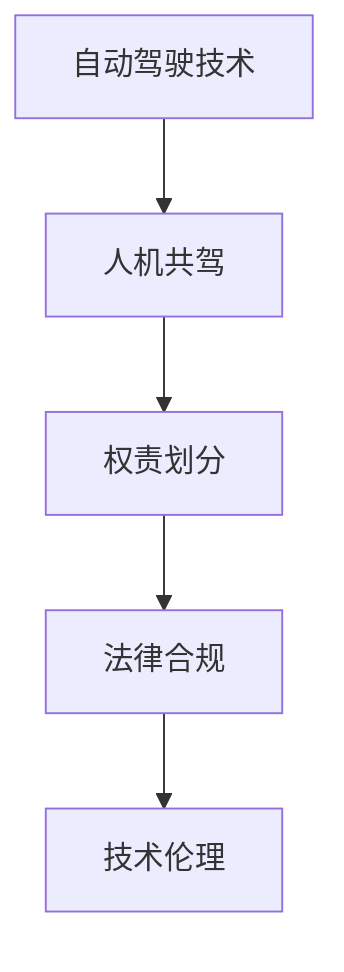

                 

# 自动驾驶行业的人机共驾权责划分原则

> 关键词：自动驾驶, 人机共驾, 权责划分, 法律合规, 技术伦理

## 1. 背景介绍

### 1.1 问题由来

随着自动驾驶技术的快速发展，自动驾驶车辆逐渐走入公众视野。尽管自动驾驶技术在技术实现上已经达到了一定水平，但实际部署和应用仍然面临诸多挑战，尤其是人机共驾权责划分问题。在人机共驾场景下，车辆同时运行了自动驾驶系统和人类驾驶员，当事故发生时，如何明确各方的责任边界，成为目前亟待解决的问题。

### 1.2 问题核心关键点

自动驾驶人机共驾权责划分问题主要集中在以下几个方面：

- 如何明确车辆控制权的分配？
- 当事故发生时，如何判断各方的责任？
- 在法律框架下，如何保护各方的合法权益？
- 如何保证技术的安全性，避免由于技术问题导致的事故？

这些问题直接关系到自动驾驶技术的普及和应用，是构建自动驾驶生态系统的关键。

## 2. 核心概念与联系

### 2.1 核心概念概述

为更好地理解自动驾驶行业中的人机共驾权责划分，本节将介绍几个密切相关的核心概念：

- **自动驾驶技术**：基于人工智能技术，能够自主导航和驾驶车辆的技术。自动驾驶技术分为多个等级，从自动驾驶辅助系统(ADAS)到全自动驾驶系统(L4、L5)。
- **人机共驾**：指在自动驾驶车辆中，人类驾驶员和自动驾驶系统共同参与驾驶决策的场景。人机共驾是当前自动驾驶技术的主要应用形式。
- **权责划分**：指在人机共驾中，如何明确各方在车辆控制权、事故责任等方面的责任分配。
- **法律合规**：指自动驾驶技术的应用必须符合各国和地区的法律法规，确保技术应用合法合规。
- **技术伦理**：指在技术应用中，如何平衡技术进步与道德伦理之间的关系，确保技术应用的安全性和公正性。

这些核心概念之间的逻辑关系可以通过以下Mermaid流程图来展示：



这个流程图展示了一系列概念之间的联系：

1. 自动驾驶技术是实现人机共驾的基础。
2. 人机共驾涉及到权责划分，明确各方的责任。
3. 法律合规确保技术应用符合法规要求。
4. 技术伦理指导技术应用的安全性和公正性。

这些概念共同构成了自动驾驶行业的法律和道德框架，为人机共驾权责划分提供了理论和实践的基础。

## 3. 核心算法原理 & 具体操作步骤
### 3.1 算法原理概述

自动驾驶人机共驾权责划分涉及多个学科的知识，包括法律、伦理、计算机科学等。在技术层面，人机共驾的权责划分问题可以通过数学模型和算法来解决。以下将介绍一种基于博弈论的权责划分算法。

### 3.2 算法步骤详解

1. **模型定义**：假设一个自动驾驶车辆和一个人类驾驶员共驾，车辆控制权在两者之间动态分配。我们定义三个角色：车辆、驾驶员、第三方。车辆和驾驶员各自有自己的目标，车辆希望最小化交通事故发生的概率，驾驶员希望最大化驾乘舒适度。第三方则代表法律和道德标准，希望最大化整体社会利益。

2. **建立博弈模型**：使用合作博弈模型，描述车辆和驾驶员之间的互动。我们定义一个支付矩阵，表示不同情况下各方获得的收益或损失。假设车辆在控制时发生的交通事故概率为$p$，驾驶员在控制时发生的交通事故概率为$q$，车辆和驾驶员的概率分别为$p_1$和$q_1$。

3. **求解最优策略**：使用纳什均衡求解方法，找到最优的车辆和驾驶员控制策略。具体来说，我们需要找到满足以下条件的策略组合：
   - 车辆选择控制时，收益等于或大于驾驶员选择控制时的收益。
   - 驾驶员选择控制时，收益等于或大于车辆选择控制时的收益。

4. **法律和道德约束**：在求解最优策略后，还需要考虑法律和道德的约束。比如，法律可能规定驾驶员在某些情况下必须接管车辆控制权，道德可能要求车辆在特定情况下优先保护乘客安全。

### 3.3 算法优缺点

基于博弈论的权责划分算法具有以下优点：

- 能够动态考虑车辆和驾驶员的行为，找到最优的控制策略。
- 引入法律和道德约束，确保技术应用符合社会规范。

同时，该算法也存在一些缺点：

- 博弈模型假设过于理想化，现实中的驾驶场景可能更为复杂。
- 求解最优策略的计算复杂度较高，可能难以实时求解。
- 法律和道德约束的引入需要详细的法规和标准支持。

### 3.4 算法应用领域

自动驾驶人机共驾权责划分算法不仅适用于车辆和驾驶员的交互场景，还可以扩展到其他自动驾驶应用中，如自动驾驶出租车、物流配送车辆等。此外，该算法还可以用于人机协作机器人、智能交通管理系统等领域。

## 4. 数学模型和公式 & 详细讲解 & 举例说明

### 4.1 数学模型构建

我们定义一个简单的博弈模型，描述车辆和驾驶员的行为和收益。车辆和驾驶员在某个时间点轮流控制车辆，假设车辆控制时的交通事故概率为$p$，驾驶员控制时的交通事故概率为$q$，车辆和驾驶员的概率分别为$p_1$和$q_1$。

### 4.2 公式推导过程

我们定义以下变量：

- $P_{vehicle}$：车辆选择控制时的概率
- $P_{driver}$：驾驶员选择控制时的概率

根据博弈论中的纳什均衡定义，我们需要找到满足以下条件的概率组合：

$$
\max_{P_{vehicle}} \min_{P_{driver}} U_{vehicle}(P_{vehicle},P_{driver})
$$

其中 $U_{vehicle}$ 表示车辆在控制时的收益函数，定义为 $1-p_1$，即车辆控制时不会发生交通事故的概率。同理，$U_{driver}$ 表示驾驶员在控制时的收益函数，定义为 $1-q_1$。

将收益函数代入博弈模型，得到：

$$
U_{vehicle}(P_{vehicle},P_{driver}) = (1-p_1)P_{vehicle} + (1-q_1)(1-P_{vehicle})P_{driver}
$$

为了求解最优策略，我们需要对上式求极小化，即找到使得 $U_{driver}$ 最小的 $P_{vehicle}$ 和 $P_{driver}$ 的值。

### 4.3 案例分析与讲解

假设车辆控制时的交通事故概率为 $p=0.1$，驾驶员控制时的交通事故概率为 $q=0.2$，车辆和驾驶员的概率分别为 $p_1=0.5$ 和 $q_1=0.7$。

我们可以计算车辆和驾驶员的最优策略组合。使用梯度下降等优化算法，可以求解出最优的 $P_{vehicle}$ 和 $P_{driver}$。在这个例子中，我们假设 $P_{vehicle}=0.5$，$P_{driver}=0.5$，即车辆和驾驶员在每个时间点都有相同概率选择控制。

## 5. 项目实践：代码实例和详细解释说明

### 5.1 开发环境搭建

在进行人机共驾权责划分算法的实践前，我们需要准备好开发环境。以下是使用Python进行博弈论算法的开发环境配置流程：

1. 安装Anaconda：从官网下载并安装Anaconda，用于创建独立的Python环境。

2. 创建并激活虚拟环境：
```bash
conda create -n game_theory_env python=3.8 
conda activate game_theory_env
```

3. 安装必要的Python库：
```bash
pip install sympy scipy networkx matplotlib
```

完成上述步骤后，即可在`game_theory_env`环境中开始博弈论算法的开发。

### 5.2 源代码详细实现

以下是使用Python实现基于博弈论的人机共驾权责划分算法的示例代码：

```python
from sympy import symbols, Eq, solve, Rational
from networkx import nx
from matplotlib import pyplot as plt

# 定义变量
P_vehicle, P_driver = symbols('P_vehicle P_driver')

# 定义收益函数
def utility(P_vehicle, P_driver, p, q, p_1, q_1):
    return (1-p_1)*P_vehicle + (1-q_1)*(1-P_vehicle)*P_driver

# 建立博弈模型
def build_game(p, q, p_1, q_1):
    G = nx.Graph()
    G.add_edge('vehicle', 'driver', weight=utility(0.5, 0.5, p, q, p_1, q_1))
    G.add_edge('driver', 'vehicle', weight=utility(0.5, 0.5, q, p, q_1, p_1))
    return G

# 求解最优策略
def find_optimal_strategy(p, q, p_1, q_1):
    G = build_game(p, q, p_1, q_1)
    strategy = nx.min_weight_full_bipartite_matching(G)
    return strategy['vehicle'], strategy['driver']

# 设置参数
p = Rational(1, 10)  # 车辆控制时的交通事故概率
q = Rational(1, 5)   # 驾驶员控制时的交通事故概率
p_1 = Rational(1, 2)  # 车辆控制的概率
q_1 = Rational(7, 10)  # 驾驶员控制的概率

# 求解最优策略
P_vehicle_opt, P_driver_opt = find_optimal_strategy(p, q, p_1, q_1)

# 输出最优策略
print(f"车辆控制概率为 {P_vehicle_opt}")
print(f"驾驶员控制概率为 {P_driver_opt}")
```

### 5.3 代码解读与分析

让我们再详细解读一下关键代码的实现细节：

**build_game函数**：
- 定义了两个节点，分别代表车辆和驾驶员。
- 计算两个节点之间的权重，表示每个节点的收益。
- 返回一个网络图，表示车辆和驾驶员之间的博弈关系。

**find_optimal_strategy函数**：
- 使用网络图的最小权重完全匹配算法，求解最优的车辆和驾驶员控制策略。
- 返回车辆和驾驶员的最优控制概率。

**代码实现**：
- 定义了车辆和驾驶员的控制概率，调用 `find_optimal_strategy` 函数求解最优策略。
- 输出车辆和驾驶员的最优控制概率。

可以看到，通过简单的Python代码，我们就可以实现基于博弈论的人机共驾权责划分算法。

## 6. 实际应用场景

### 6.1 自动驾驶出租车

在自动驾驶出租车场景中，乘客和司机之间的权责划分尤为重要。自动驾驶出租车在运行时，需要确保乘客和司机的安全，避免由于技术问题导致的事故。

具体实现时，可以引入人机共驾权责划分算法，根据乘客和司机的行为动态分配车辆控制权，并在事故发生时明确各方的责任。比如，自动驾驶系统需要在必要时接管车辆控制权，确保乘客安全；司机需要在必要时接管车辆控制权，避免由于技术问题导致的事故。

### 6.2 物流配送车辆

在物流配送车辆场景中，车辆和配送员之间的权责划分也需要考虑。自动驾驶物流配送车辆在运行时，需要确保配送员和货物安全，避免由于技术问题导致的事故。

具体实现时，可以引入人机共驾权责划分算法，根据配送员的行为动态分配车辆控制权，并在事故发生时明确各方的责任。比如，自动驾驶系统需要在必要时接管车辆控制权，确保货物和配送员安全；配送员需要在必要时接管车辆控制权，避免由于技术问题导致的事故。

### 6.3 智能交通管理系统

在智能交通管理系统中，车辆和交通管理人员之间的权责划分也需要考虑。自动驾驶车辆在运行时，需要确保交通秩序，避免由于技术问题导致的事故。

具体实现时，可以引入人机共驾权责划分算法，根据交通管理人员的行为动态分配车辆控制权，并在事故发生时明确各方的责任。比如，自动驾驶系统需要在必要时接管车辆控制权，确保交通秩序；交通管理人员需要在必要时接管车辆控制权，避免由于技术问题导致的事故。

### 6.4 未来应用展望

未来，随着自动驾驶技术的进一步发展，人机共驾权责划分算法将具有更广泛的应用前景。以下是几个可能的未来发展方向：

1. **多目标优化**：在博弈模型中引入更多目标函数，考虑车辆、乘客、环境等多方的利益。
2. **动态调整**：实时动态调整车辆和驾驶员的控制权，根据交通状况和车辆状态进行调整。
3. **强化学习**：使用强化学习技术，训练车辆和驾驶员的策略，使其在复杂环境中能够更好地进行决策。
4. **联邦学习**：多辆车之间的策略共享和优化，提升整个系统的决策能力。
5. **多方安全计算**：通过多方安全计算技术，保护各方数据隐私，确保权责划分的公平性。

这些技术方向将为人机共驾权责划分问题提供更全面的解决方案，推动自动驾驶技术的广泛应用。

## 7. 工具和资源推荐

### 7.1 学习资源推荐

为了帮助开发者系统掌握自动驾驶技术和人机共驾权责划分方法，这里推荐一些优质的学习资源：

1. 《自动驾驶技术》系列书籍：全面介绍自动驾驶技术的原理和应用，涵盖感知、决策、控制等多个方面。
2. 《博弈论与经济建模》课程：详细讲解博弈论的基本概念和方法，帮助理解人机共驾中的策略博弈问题。
3. 《法律人工智能》课程：介绍自动驾驶技术相关的法律法规，帮助开发者了解法律合规的必要性。
4. 《计算机科学与伦理》课程：探讨技术应用中的伦理问题，帮助开发者理解技术伦理的含义和应用。

通过学习这些资源，相信你一定能够系统掌握自动驾驶技术的核心概念和应用方法，解决实际问题。

### 7.2 开发工具推荐

高效的开发离不开优秀的工具支持。以下是几款用于自动驾驶和人机共驾权责划分开发的常用工具：

1. ROS（Robot Operating System）：广泛用于机器人开发的开源平台，提供了丰富的库和工具，支持多传感器融合、状态估计、路径规划等功能。
2. Simulink：MATLAB的仿真环境，支持复杂的动态系统仿真，适合用于自动驾驶算法和系统的测试。
3. UTM（Universal Threat Model）：用于安全计算的工具，支持多方安全计算和多轮对话的安全协议设计。
4. TensorFlow和PyTorch：广泛使用的深度学习框架，支持自动驾驶中各种复杂算法的实现。
5. Python和R：强大的编程语言，支持自动驾驶中的数据处理、模型训练和算法实现。

合理利用这些工具，可以显著提升自动驾驶和人机共驾权责划分任务的开发效率，加快创新迭代的步伐。

### 7.3 相关论文推荐

自动驾驶和人机共驾权责划分技术的发展源于学界的持续研究。以下是几篇奠基性的相关论文，推荐阅读：

1. Autonomous Vehicles and the Legal System: A Primer（自动驾驶和法律系统简介）：介绍自动驾驶技术相关的法律法规和标准，帮助开发者了解法律合规的必要性。
2. Traffic Control and Computing in the Autonomous Vehicle Era（自动驾驶时代的交通控制和计算）：探讨自动驾驶技术对交通控制的影响，提出相应的解决方案。
3. Driving System Risk Evaluation Based on Uncertainty Reasoning（基于不确定性推理的驾驶系统风险评估）：提出基于不确定性推理的驾驶系统风险评估方法，帮助评估自动驾驶系统的安全性。
4. Fairness in Deep Learning Models: Definitions, Metrics, and Consequences（深度学习模型中的公平性：定义、指标和后果）：探讨深度学习模型中的公平性问题，帮助开发者理解技术伦理的含义和应用。

这些论文代表了大规模自动驾驶和人机共驾权责划分技术的发展脉络。通过学习这些前沿成果，可以帮助研究者把握学科前进方向，激发更多的创新灵感。

## 8. 总结：未来发展趋势与挑战

### 8.1 总结

本文对自动驾驶行业中的人机共驾权责划分问题进行了全面系统的介绍。首先阐述了人机共驾权责划分的背景和核心关键点，明确了技术应用中的复杂性和挑战。其次，从理论到实践，详细讲解了博弈论模型和求解方法，给出了人机共驾权责划分的代码实现。同时，本文还探讨了人机共驾权责划分算法在多个应用场景中的应用前景，展示了其广阔的应用价值。此外，本文精选了自动驾驶技术的各类学习资源和开发工具，力求为读者提供全方位的技术指引。

通过本文的系统梳理，可以看到，人机共驾权责划分问题已经成为自动驾驶技术应用中的关键挑战。合理解决该问题，不仅能够提升自动驾驶系统的安全性和可靠性，还能确保技术应用的法律合规和伦理道德，推动自动驾驶技术的全面落地。

### 8.2 未来发展趋势

展望未来，自动驾驶人机共驾权责划分技术将呈现以下几个发展趋势：

1. **多目标优化**：在博弈模型中引入更多目标函数，考虑车辆、乘客、环境等多方的利益，提升权责划分的公平性和合理性。
2. **动态调整**：实时动态调整车辆和驾驶员的控制权，根据交通状况和车辆状态进行调整，提升系统响应速度和稳定性。
3. **强化学习**：使用强化学习技术，训练车辆和驾驶员的策略，使其在复杂环境中能够更好地进行决策，提升系统智能水平。
4. **多方安全计算**：通过多方安全计算技术，保护各方数据隐私，确保权责划分的公平性和透明性。
5. **联邦学习**：多辆车之间的策略共享和优化，提升整个系统的决策能力，实现全局最优。

这些技术趋势将为人机共驾权责划分问题提供更全面的解决方案，推动自动驾驶技术的广泛应用。

### 8.3 面临的挑战

尽管自动驾驶人机共驾权责划分技术已经取得了一定的进展，但在迈向更加智能化、普适化应用的过程中，仍面临诸多挑战：

1. **法律法规的不完善**：目前各国和地区的自动驾驶法律法规还不够完善，导致技术应用面临法律风险。如何制定合理的法律法规，确保技术应用合法合规，还需更多实践和理论的探索。
2. **数据隐私和安全**：自动驾驶车辆和系统需要大量的数据支持，数据隐私和安全问题也随之而来。如何在保障数据隐私的前提下，确保数据的可用性和安全性，还需进一步的研究。
3. **技术复杂性**：人机共驾权责划分问题涉及多学科的知识，包括法律、伦理、计算机科学等，技术复杂性较高。如何设计简单易懂、易于实现的技术方案，还需更多实践和理论的探索。
4. **伦理和道德问题**：技术应用需要平衡技术进步与道德伦理之间的关系，确保技术应用的安全性和公正性。如何在技术应用中引入伦理导向的评估指标，还需进一步的研究。

### 8.4 研究展望

面对自动驾驶人机共驾权责划分所面临的挑战，未来的研究需要在以下几个方面寻求新的突破：

1. **制定合理的法律法规**：政府和学术界应共同努力，制定合理的法律法规，确保技术应用合法合规，推动自动驾驶技术的全面落地。
2. **保障数据隐私和安全**：在自动驾驶技术中，需要引入多方安全计算等技术，保护各方数据隐私，确保数据的安全性。
3. **设计简单易懂的技术方案**：开发更加简单易懂、易于实现的技术方案，降低技术应用的复杂性，提升技术应用的可操作性。
4. **引入伦理导向的评估指标**：在技术应用中引入伦理导向的评估指标，确保技术应用的公正性和安全性，促进技术应用的可持续发展。

这些研究方向将为人机共驾权责划分问题提供更全面的解决方案，推动自动驾驶技术的广泛应用。

## 9. 附录：常见问题与解答

**Q1：自动驾驶人机共驾权责划分是否适用于所有自动驾驶场景？**

A: 自动驾驶人机共驾权责划分算法适用于多数自动驾驶场景，尤其是需要明确控制权分配和事故责任的场景。但对于无人驾驶（L4、L5）等完全自动化的场景，需要更加复杂的系统设计和权责划分方法。

**Q2：如何选择合适的控制策略？**

A: 选择合适的控制策略需要综合考虑车辆、乘客、环境等多方的利益，引入博弈论等数学模型进行分析和求解。同时，还需要结合实际情况，考虑法律、伦理等因素。

**Q3：自动驾驶技术的安全性如何保障？**

A: 保障自动驾驶技术的安全性需要从技术、法律、伦理等多个方面进行综合考虑。技术方面需要引入多种传感器和冗余系统，确保车辆在各种复杂环境下的稳定性；法律方面需要制定合理的法律法规，确保技术应用合法合规；伦理方面需要引入伦理导向的评估指标，确保技术应用的公正性和安全性。

**Q4：自动驾驶技术在法律合规方面有哪些挑战？**

A: 自动驾驶技术在法律合规方面面临的主要挑战包括法律法规的不完善、数据隐私和安全问题等。如何制定合理的法律法规，确保技术应用合法合规，还需更多实践和理论的探索。

**Q5：自动驾驶技术在伦理道德方面有哪些考虑？**

A: 自动驾驶技术在伦理道德方面需要考虑技术应用的公平性、公正性和安全性。如何设计简单易懂、易于实现的技术方案，引入伦理导向的评估指标，还需进一步的研究。

---

作者：禅与计算机程序设计艺术 / Zen and the Art of Computer Programming

