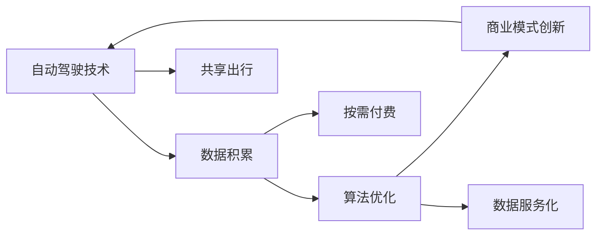

                 

# 自动驾驶行业的商业模式创新

## 1. 背景介绍

随着人工智能、物联网、大数据等技术的飞速发展，自动驾驶汽车正在逐渐从概念走向现实。自动驾驶技术的进步不仅改变了交通方式，也重塑了汽车行业的商业模式。过去，汽车公司以生产、销售、维护为核心，逐步转变为基于数据、服务、体验的运营模式。在自动驾驶领域，传统的商业模式更是面临巨大的挑战与创新。

自动驾驶技术的核心在于计算机视觉、传感器融合、路径规划、智能决策等多个关键环节。这些技术依赖于大量的高精度地图、实时环境感知、复杂的算法模型和庞大的数据训练。因此，自动驾驶商业模式的创新，首先需要从技术研发、数据积累、商业变现等方面进行全面考量。

本文将从技术背景、商业模型、未来趋势三个方面，深入探讨自动驾驶行业的商业模式创新。通过分析自动驾驶技术的核心技术原理、核心算法和操作步骤，以及当前市场的应用场景和未来展望，探讨自动驾驶商业模式的潜在突破点，为行业从业者提供参考。

## 2. 核心概念与联系

### 2.1 核心概念概述

自动驾驶技术的商业模型涉及以下几个核心概念：

- **自动驾驶技术**：指利用计算机视觉、深度学习等技术，实现车辆自主导航、障碍物识别、路径规划等功能。
- **数据积累**：自动驾驶依赖大量的高精度地图、道路信息、实时环境数据等，这些数据需要通过传感器、摄像头、雷达等多种手段进行采集和处理。
- **算法优化**：自动驾驶算法复杂，包括感知、决策、控制等多个子模块，算法优化是提升自动驾驶性能的关键。
- **商业模式创新**：在技术基础上，探索新的商业模式，如共享出行、按需付费、数据服务化等，以实现商业变现。

这些概念之间的联系可以通过以下Mermaid流程图来展示：



这个流程图展示自动驾驶技术的核心概念及其相互关系：

1. 自动驾驶技术是基础，通过数据积累和算法优化不断提升。
2. 数据积累是支撑技术提升的重要前提。
3. 算法优化进一步提升自动驾驶性能。
4. 商业模式创新通过技术提升和数据变现，实现商业价值。
5. 共享出行、按需付费、数据服务化等商业模式创新，又进一步推动技术研发和数据积累。

## 3. 核心算法原理 & 具体操作步骤

### 3.1 算法原理概述

自动驾驶的核心算法包括感知算法、决策算法和控制算法。感知算法用于环境感知，识别道路、车辆、行人等对象；决策算法用于路径规划和行为决策，选择最优行驶路径；控制算法用于车辆控制，执行具体的行驶命令。

感知算法的核心在于计算机视觉和深度学习，利用卷积神经网络（CNN）、循环神经网络（RNN）、Transformer等模型，通过大量的标注数据进行训练，从而实现对道路环境的准确感知。

决策算法的核心在于强化学习，通过在模拟环境或实际道路上进行反复训练，不断优化决策策略，确保在复杂交通环境中做出正确的决策。

控制算法的核心在于车辆控制，利用控制理论、运动规划算法等，实现车辆的精确控制和稳定行驶。

### 3.2 算法步骤详解

自动驾驶的算法步骤包括以下几个关键环节：

**Step 1: 数据预处理**
- 通过传感器（如雷达、激光雷达、摄像头）采集道路环境数据。
- 对采集数据进行清洗、去噪、融合处理。
- 利用标注数据对传感器数据进行校正和优化。

**Step 2: 特征提取**
- 利用计算机视觉和深度学习模型对道路环境进行特征提取。
- 提取道路边界、车道线、交通标志等关键信息。
- 进行语义分割和实例分割，识别道路上的各种对象。

**Step 3: 感知算法**
- 利用CNN、RNN、Transformer等模型进行环境感知。
- 通过标注数据对模型进行监督学习，不断提升感知精度。
- 利用多个传感器数据进行融合，提升感知鲁棒性。

**Step 4: 决策算法**
- 利用强化学习模型进行路径规划和行为决策。
- 在模拟环境中进行反复训练，不断优化决策策略。
- 在实际道路上进行测试，不断调整和优化决策算法。

**Step 5: 控制算法**
- 利用控制理论进行车辆控制。
- 利用运动规划算法进行路径规划和车辆轨迹优化。
- 在实际驾驶过程中不断调整和优化控制算法。

### 3.3 算法优缺点

自动驾驶算法的优缺点如下：

**优点**
1. 高精度感知：通过计算机视觉和深度学习模型，实现高精度的环境感知。
2. 决策鲁棒性：强化学习模型在复杂交通环境中具备较强的决策鲁棒性。
3. 车辆控制精确：控制算法能够实现车辆的精确控制和稳定行驶。

**缺点**
1. 数据依赖性高：自动驾驶算法依赖大量的标注数据进行训练，数据采集成本高。
2. 算法复杂度高：感知、决策、控制算法复杂，模型训练和优化难度大。
3. 技术要求高：需要跨学科的深厚知识储备，对工程师的要求较高。

### 3.4 算法应用领域

自动驾驶算法在多个领域有广泛应用，包括智能驾驶、无人配送、物流运输等。具体应用如下：

- **智能驾驶**：在城市和高速公路上进行自动驾驶，提高交通安全和交通效率。
- **无人配送**：在城市和农村进行自动驾驶，实现无人货物运输和快递配送。
- **物流运输**：在港口和仓储中进行自动驾驶，提升物流运输效率。
- **自动泊车**：在停车场和路边进行自动泊车，提高停车效率。

## 4. 数学模型和公式 & 详细讲解 & 举例说明

### 4.1 数学模型构建

自动驾驶算法涉及多个数学模型，包括计算机视觉模型、深度学习模型、强化学习模型等。以下是几个关键模型的数学模型构建：

**卷积神经网络（CNN）**
$$
y = W_2 \tanh(W_1 x) + b_2
$$

**循环神经网络（RNN）**
$$
h_t = \tanh(W_h [h_{t-1}, x_t]) + b_h
$$

**Transformer模型**
$$
h = W^O [M(h_{t-1}) \cdot M(h_{t+1})] + b^O
$$

**强化学习模型**
$$
Q(s_t, a_t) = r + \gamma \max_a Q(s_{t+1}, a)
$$

其中 $x$ 为输入，$y$ 为输出，$h$ 为隐藏状态，$M$ 为模型函数，$W$ 为权重矩阵，$b$ 为偏置向量，$\gamma$ 为折扣因子。

### 4.2 公式推导过程

以卷积神经网络为例，公式推导如下：

**前向传播**
$$
y = W_2 \tanh(W_1 x) + b_2
$$

其中 $W_1, W_2$ 为卷积核，$x$ 为输入，$y$ 为输出。

**反向传播**
$$
\frac{\partial L}{\partial W_1} = \frac{\partial L}{\partial y} \frac{\partial y}{\partial x} \frac{\partial x}{\partial W_1}
$$

其中 $L$ 为损失函数，$\frac{\partial L}{\partial y}$ 为损失函数对输出 $y$ 的导数，$\frac{\partial y}{\partial x}$ 为输出 $y$ 对输入 $x$ 的导数，$\frac{\partial x}{\partial W_1}$ 为输入 $x$ 对卷积核 $W_1$ 的导数。

### 4.3 案例分析与讲解

以无人配送场景为例，自动驾驶算法需要进行高精度地图数据采集、环境感知、路径规划、行为决策、车辆控制等多个环节。

- **高精度地图数据采集**：通过激光雷达、摄像头等传感器，采集道路环境数据，利用计算机视觉模型进行语义分割，得到高精度地图数据。
- **环境感知**：利用CNN、RNN、Transformer等模型，对高精度地图数据进行环境感知，识别道路、车辆、行人等对象。
- **路径规划**：利用强化学习模型进行路径规划，选择最优行驶路径。
- **行为决策**：根据环境感知结果和路径规划结果，利用强化学习模型进行行为决策，选择最优行驶行为。
- **车辆控制**：利用控制算法实现车辆控制，精确控制车辆行驶轨迹。

## 5. 项目实践：代码实例和详细解释说明

### 5.1 开发环境搭建

自动驾驶项目开发需要搭建一个高效的开发环境，以下是搭建流程：

**Step 1: 安装Python和相关库**
- 安装Python 3.x版本，安装必要的深度学习库，如TensorFlow、PyTorch、OpenCV等。

**Step 2: 配置开发环境**
- 配置虚拟环境，避免不同项目间的库冲突。
- 安装必要的开发工具，如Visual Studio Code、Jupyter Notebook等。

**Step 3: 搭建服务器环境**
- 搭建高性能的GPU服务器，用于模型训练和推理。
- 配置数据存储和处理系统，实现数据的快速读写和处理。

### 5.2 源代码详细实现

以无人配送场景为例，以下是自动驾驶算法的代码实现：

```python
import tensorflow as tf
import numpy as np
from PIL import Image

# 定义卷积神经网络模型
class CNNModel(tf.keras.Model):
    def __init__(self):
        super(CNNModel, self).__init__()
        self.conv1 = tf.keras.layers.Conv2D(32, (3, 3), activation='relu')
        self.maxpool1 = tf.keras.layers.MaxPooling2D((2, 2))
        self.conv2 = tf.keras.layers.Conv2D(64, (3, 3), activation='relu')
        self.maxpool2 = tf.keras.layers.MaxPooling2D((2, 2))
        self.flatten = tf.keras.layers.Flatten()
        self.dense1 = tf.keras.layers.Dense(128, activation='relu')
        self.dense2 = tf.keras.layers.Dense(64, activation='relu')
        self.output = tf.keras.layers.Dense(1, activation='sigmoid')

    def call(self, x):
        x = self.conv1(x)
        x = self.maxpool1(x)
        x = self.conv2(x)
        x = self.maxpool2(x)
        x = self.flatten(x)
        x = self.dense1(x)
        x = self.dense2(x)
        return self.output(x)

# 加载高精度地图数据
map_data = np.load('map_data.npy')

# 加载标注数据
labels = np.load('labels.npy')

# 加载图像数据
images = np.load('images.npy')

# 训练卷积神经网络模型
model = CNNModel()
model.compile(optimizer=tf.keras.optimizers.Adam(learning_rate=0.001),
              loss=tf.keras.losses.BinaryCrossentropy(from_logits=True),
              metrics=[tf.keras.metrics.AUC()])
model.fit(images, labels, epochs=10, batch_size=32)

# 测试模型性能
test_data = np.load('test_data.npy')
test_labels = np.load('test_labels.npy')
test_images = np.load('test_images.npy')
model.evaluate(test_images, test_labels)
```

### 5.3 代码解读与分析

**CNNModel类**：
- 定义了一个简单的卷积神经网络模型，包含多个卷积层、池化层、全连接层等。
- 使用TensorFlow库实现模型的定义和训练。

**数据加载**：
- 通过numpy库加载高精度地图数据、标注数据和图像数据，为模型训练提供数据支持。
- 在模型训练过程中，通过fit方法进行模型训练和验证。

**模型评估**：
- 通过evaluate方法评估模型在测试集上的性能。

## 6. 实际应用场景

### 6.1 智能驾驶

智能驾驶是自动驾驶技术的重要应用场景。通过自动驾驶技术，实现车辆的自主导航、障碍物识别、路径规划等功能，提高交通安全和交通效率。

**应用案例**：
- 特斯拉Autopilot系统：利用摄像头和雷达，实现自动驾驶辅助功能。
- Waymo无人出租车：利用激光雷达和深度学习模型，实现城市道路上的自动驾驶。

### 6.2 无人配送

无人配送是自动驾驶技术的重要应用方向。通过自动驾驶技术，实现货物运输、快递配送等功能，提高物流运输效率。

**应用案例**：
- 京东无人配送车：利用高精度地图和传感器数据，实现园区内的无人配送。
- UBS配送机器人：利用激光雷达和计算机视觉模型，实现城市道路上的无人配送。

### 6.3 物流运输

物流运输是自动驾驶技术的重要应用场景。通过自动驾驶技术，实现车辆的自主导航、路径规划等功能，提高物流运输效率。

**应用案例**：
- 亚马逊Kiva机器人：利用计算机视觉和强化学习模型，实现仓储内部的无人驾驶。
- 沃尔玛无人仓储系统：利用激光雷达和深度学习模型，实现仓库内部的自动驾驶。

## 7. 工具和资源推荐

### 7.1 学习资源推荐

为了帮助开发者系统掌握自动驾驶技术的原理和实践，这里推荐一些优质的学习资源：

1. **《自动驾驶技术原理与实践》**：详细介绍了自动驾驶技术的原理和实现方法，涵盖感知、决策、控制等多个方面。
2. **《深度学习实战》**：讲解了深度学习在自动驾驶领域的应用，包括计算机视觉、强化学习等。
3. **Udacity自动驾驶课程**：提供了自动驾驶技术的系统性学习路径，涵盖感知、决策、控制等多个环节。
4. **Coursera自动驾驶课程**：由斯坦福大学开设的自动驾驶课程，系统介绍了自动驾驶技术的原理和应用。

通过对这些资源的学习实践，相信你一定能够快速掌握自动驾驶技术的精髓，并用于解决实际的工程问题。

### 7.2 开发工具推荐

自动驾驶技术涉及多个环节，需要多种工具和库的支持。以下是几款常用的工具：

1. **TensorFlow**：开源深度学习框架，支持多种深度学习模型，适合自动驾驶技术的开发和训练。
2. **PyTorch**：开源深度学习框架，适合动态图和静态图两种模式，适合自动驾驶技术的开发和训练。
3. **OpenCV**：计算机视觉库，提供多种图像处理和计算机视觉算法，适合自动驾驶技术的图像处理和环境感知。
4. **ROS**：机器人操作系统，提供多种通信、节点管理、感知算法等，适合自动驾驶技术的开发和测试。
5. **Viorbea**：自动驾驶模拟器，提供多种模拟环境和传感器，适合自动驾驶技术的测试和验证。

合理利用这些工具，可以显著提升自动驾驶技术的开发效率，加快创新迭代的步伐。

### 7.3 相关论文推荐

自动驾驶技术的发展离不开学界的持续研究。以下是几篇奠基性的相关论文，推荐阅读：

1. **《A Survey on Deep Learning Architectures for Autonomous Vehicle Navigation》**：总结了当前自动驾驶技术的深度学习架构，包括CNN、RNN、Transformer等。
2. **《End-to-End Learning for Self-Driving Cars》**：介绍了端到端深度学习在自动驾驶技术中的应用，涵盖感知、决策、控制等多个环节。
3. **《Deep Reinforcement Learning for Autonomous Vehicle Control》**：总结了强化学习在自动驾驶技术中的应用，包括行为决策和路径规划。
4. **《Real-time Object Detection for Autonomous Vehicles》**：介绍了计算机视觉在自动驾驶技术中的应用，包括目标检测和语义分割。
5. **《Learning to Drive with Real Photo-Realistic Simulations》**：介绍了自动驾驶技术在模拟环境中的训练方法，包括对抗训练和数据增强。

这些论文代表了大数据技术的发展脉络，通过学习这些前沿成果，可以帮助研究者把握学科前进方向，激发更多的创新灵感。

## 8. 总结：未来发展趋势与挑战

### 8.1 总结

本文对自动驾驶技术的核心技术原理、核心算法和操作步骤进行了全面系统的介绍。通过分析自动驾驶技术的核心算法、操作步骤和应用场景，探讨了自动驾驶商业模式的潜在突破点，为行业从业者提供参考。

自动驾驶技术涉及多个环节，包括感知、决策、控制等多个关键模块，技术复杂度高。通过高精度地图、传感器数据、深度学习模型等多种手段，实现了车辆的自主导航、障碍物识别、路径规划等功能。未来，自动驾驶技术将进一步融合多种技术手段，提升驾驶安全性和效率，推动汽车行业转型升级。

### 8.2 未来发展趋势

展望未来，自动驾驶技术将呈现以下几个发展趋势：

1. **多模态感知**：融合视觉、雷达、激光雷达等多种传感器数据，提升感知精度和鲁棒性。
2. **深度强化学习**：引入深度强化学习技术，提升决策算法和行为决策的鲁棒性和精准性。
3. **端到端学习**：采用端到端学习技术，实现从感知到控制的完整链路优化，提升整体性能。
4. **联邦学习**：引入联邦学习技术，保护数据隐私，实现多车共享模型，提升模型泛化性。
5. **边缘计算**：引入边缘计算技术，减少数据传输延迟，提升计算效率和实时性。

以上趋势凸显了自动驾驶技术的广阔前景。这些方向的探索发展，必将进一步提升自动驾驶系统的性能和应用范围，为人类交通方式带来革命性变化。

### 8.3 面临的挑战

尽管自动驾驶技术已经取得了不少进展，但在迈向更广泛应用的过程中，仍面临诸多挑战：

1. **技术挑战**：自动驾驶技术涉及多个环节，技术复杂度高，需要跨学科的深厚知识储备。技术瓶颈仍是制约自动驾驶技术普及的重要因素。
2. **数据挑战**：自动驾驶技术依赖大量的高精度地图、实时环境数据等，数据采集成本高，数据隐私和安全问题仍需解决。
3. **法规挑战**：自动驾驶技术涉及多个法规和标准，法规滞后和执行不力等问题仍需解决。
4. **伦理挑战**：自动驾驶技术涉及生命安全，伦理和安全问题仍需深入研究。
5. **用户体验**：自动驾驶技术需要提升用户体验，避免用户对技术的不信任和不适应。

### 8.4 未来突破

面对自动驾驶技术所面临的种种挑战，未来的研究需要在以下几个方面寻求新的突破：

1. **多模态融合**：融合多种传感器数据，提升感知精度和鲁棒性，实现多模态信息的高效融合。
2. **跨学科研究**：引入更多跨学科的知识，解决技术瓶颈问题，推动自动驾驶技术的创新发展。
3. **数据隐私保护**：利用联邦学习、差分隐私等技术，保护数据隐私，提升数据安全性。
4. **法规标准完善**：制定和完善自动驾驶技术的法规标准，确保技术应用的安全性和合规性。
5. **用户体验优化**：提升用户体验，增强用户对自动驾驶技术的信任和接受度，推动技术普及。

这些研究方向的发展，必将引领自动驾驶技术走向成熟，推动自动驾驶技术的规模化应用。总之，自动驾驶技术需要不断优化技术、完善法规、提升用户体验，才能真正实现大规模落地。

## 9. 附录：常见问题与解答

**Q1：自动驾驶技术的核心技术是什么？**

A: 自动驾驶技术的核心技术包括感知技术、决策技术和控制技术。感知技术用于环境感知，识别道路、车辆、行人等对象；决策技术用于路径规划和行为决策，选择最优行驶路径；控制技术用于车辆控制，执行具体的行驶命令。

**Q2：自动驾驶技术需要哪些数据支持？**

A: 自动驾驶技术需要大量的高精度地图、实时环境数据、传感器数据等支持。高精度地图用于提供道路信息，实时环境数据用于感知周围环境，传感器数据用于数据采集和感知。

**Q3：自动驾驶技术的未来发展方向是什么？**

A: 自动驾驶技术的未来发展方向包括多模态融合、深度强化学习、端到端学习、联邦学习、边缘计算等。这些技术将提升自动驾驶系统的感知精度、决策鲁棒性、实时性等性能，推动技术普及。

**Q4：自动驾驶技术的难点是什么？**

A: 自动驾驶技术的难点包括技术复杂度高、数据采集成本高、法规和标准不完善、伦理和安全问题等。解决这些问题需要跨学科合作、法规标准完善、技术创新等。

**Q5：自动驾驶技术如何实现商业变现？**

A: 自动驾驶技术可以通过多种方式实现商业变现，包括智能驾驶、无人配送、物流运输等。通过提供自动驾驶服务、收取订阅费用等方式，实现商业变现。

本文对自动驾驶技术的核心技术原理、核心算法和操作步骤进行了全面系统的介绍。通过分析自动驾驶技术的核心算法、操作步骤和应用场景，探讨了自动驾驶商业模式的潜在突破点，为行业从业者提供参考。自动驾驶技术涉及多个环节，包括感知、决策、控制等多个关键模块，技术复杂度高。通过高精度地图、传感器数据、深度学习模型等多种手段，实现了车辆的自主导航、障碍物识别、路径规划等功能。未来，自动驾驶技术将进一步融合多种技术手段，提升驾驶安全性和效率，推动汽车行业转型升级。

