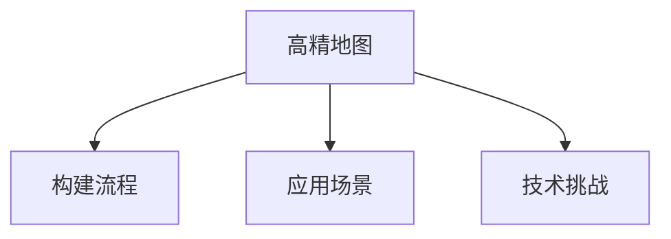

                 

# 自动驾驶高精地图的发展现状、构建流程与应用场景

## 1. 背景介绍

### 1.1 问题由来
自动驾驶技术的发展，离不开高精地图的支持。高精地图记录了道路的详细信息，包括道路网络、交通标志、路面条件、建筑物等，为自动驾驶车辆提供了精准的导航参考。自2010年代以来，随着自动驾驶技术的兴起，高精地图的需求日益增加，吸引了众多企业的关注和投入。

### 1.2 问题核心关键点
高精地图的核心在于其高精度和高更新的特性，能够实时反映道路状况的变化，保证自动驾驶车辆的安全运行。但高精地图的构建和维护成本高、周期长，如何高效构建和应用高精地图，成为自动驾驶领域的重要课题。

### 1.3 问题研究意义
高精地图作为自动驾驶的关键基础设施，对提升自动驾驶系统的安全性、可靠性和用户体验具有重要意义。研究高精地图的构建流程和技术方案，对于推动自动驾驶技术的商业化应用，具有重要价值。

## 2. 核心概念与联系

### 2.1 核心概念概述

为更好地理解自动驾驶高精地图的发展现状、构建流程与应用场景，本节将介绍几个密切相关的核心概念：

- **高精地图(High-DDefinition Map, HD Map)**：记录了道路的详细高分辨率地图信息，为自动驾驶车辆提供精准的导航参考。

- **构建流程(Building Process)**：从数据采集、处理到生成地图的整个过程，包括数据源选择、数据采集方法、数据处理流程、地图生成技术等。

- **应用场景(Application Scenarios)**：高精地图在自动驾驶中的应用领域，包括自动驾驶导航、障碍物检测、路径规划、安全辅助等。

- **技术挑战(Technical Challenges)**：高精地图构建过程中面临的难题，如数据获取难度、地图精度要求、数据更新频率、隐私保护等。

这些核心概念之间的逻辑关系可以通过以下Mermaid流程图来展示：



这个流程图展示了大精地图的核心概念及其之间的关系：

1. 高精地图通过构建流程获取和处理数据，生成最终地图。
2. 高精地图在自动驾驶中通过应用场景发挥作用。
3. 高精地图的构建面临技术挑战，需要不断优化和创新。

这些概念共同构成了自动驾驶高精地图的技术框架，使其能够在各种应用场景下发挥关键作用。

## 3. 核心算法原理 & 具体操作步骤

### 3.1 算法原理概述

高精地图的构建通常采用多源数据融合的方式，通过将来自不同数据源（如卫星、激光雷达、摄像头等）的信息进行综合分析，生成高分辨率的地图数据。

具体流程一般包括以下几个步骤：

1. **数据采集**：收集道路环境的多模态数据，如卫星影像、激光雷达数据、摄像头图像等。
2. **数据预处理**：对采集到的数据进行清洗、校正、拼接等预处理操作，保证数据质量。
3. **数据融合**：将不同数据源的信息进行融合，生成高精地图。
4. **地图生成**：将融合后的数据转换为地图格式，生成最终的高精地图。
5. **地图更新**：定期更新地图，保持其最新状态。

这些步骤涉及到多种传感器数据融合技术、图像处理技术、地理信息系统(GIS)技术等，需要综合运用多学科知识。

### 3.2 算法步骤详解

以下详细介绍高精地图构建的主要步骤：

**Step 1: 数据采集**
- **卫星数据**：利用卫星遥感技术，获取高分辨率的地面影像数据。
- **激光雷达数据**：使用激光雷达设备，获取道路三维点云数据。
- **摄像头数据**：通过安装摄像头，实时获取道路视频数据。

**Step 2: 数据预处理**
- **数据清洗**：去除噪声、畸变、阴影等干扰因素。
- **数据校正**：对采集数据进行坐标校正和对齐。
- **数据拼接**：将不同数据源的信息进行拼接，生成完整地图。

**Step 3: 数据融合**
- **特征提取**：从不同数据源中提取道路特征，如车道线、交通标志、路面标志等。
- **时空同步**：将不同时间、不同传感器采集的数据进行同步和对齐。
- **信息融合**：将不同数据源的信息进行综合分析，生成高精地图。

**Step 4: 地图生成**
- **地图渲染**：将数据转换为地图格式，生成道路网络、交通标志、车道线等地图元素。
- **地理编码**：为地图元素进行地理编码，方便在GIS系统中使用。

**Step 5: 地图更新**
- **数据采集**：定期进行数据采集，更新现有地图数据。
- **数据融合**：将新采集数据与现有数据进行融合，更新地图。
- **地图发布**：发布更新后的高精地图，供自动驾驶系统使用。

### 3.3 算法优缺点

高精地图构建的优缺点如下：

**优点**：
1. **高精度**：高精地图能够提供高分辨率的地图信息，支持自动驾驶车辆精确导航。
2. **实时更新**：高精地图能够实时反映道路变化，保持最新状态。
3. **多模态融合**：通过融合多种数据源，提高地图的准确性和可靠性。

**缺点**：
1. **成本高**：高精地图的构建需要昂贵的设备和技术支持，成本较高。
2. **复杂度高**：数据采集、处理和融合过程复杂，技术要求高。
3. **数据隐私**：高精地图涉及大量敏感数据，隐私保护难度大。

### 3.4 算法应用领域

高精地图在自动驾驶中的应用领域广泛，包括但不限于：

- **自动驾驶导航**：利用高精地图进行路径规划和导航，确保车辆安全到达目的地。
- **障碍物检测**：利用高精地图中的道路元素信息，进行障碍物检测和避障。
- **路径规划**：基于高精地图进行全局路径规划和局部路径优化，提升行车效率。
- **安全辅助**：提供实时道路信息和交通状况，辅助驾驶员做出决策。
- **车辆调度**：利用高精地图进行车辆调度，优化运输效率。

## 4. 数学模型和公式 & 详细讲解  
### 4.1 数学模型构建

高精地图的构建过程涉及多种数学模型和技术，以下以图像融合为例，介绍核心数学模型及其应用：

- **图像配准(Registration)**：将不同时间、不同传感器采集的图像进行空间对齐，常用的方法是基于特征点的匹配和仿射变换。

  假设原始图像为 $I$，旋转变换为 $\theta$，平移变换为 $t$，则配准后的图像 $I'$ 可以表示为：

  $$
  I' = \text{Rot}(\theta)I + \text{Trans}(t)
  $$

  其中，$\text{Rot}(\theta)$ 和 $\text{Trans}(t)$ 分别表示旋转和平移矩阵。

- **图像融合(Fusion)**：将多幅图像进行融合，生成高分辨率图像。常用的方法包括加权平均、金字塔融合、深度融合等。

  假设待融合图像为 $I_1, I_2, \dots, I_n$，则融合后的图像 $F$ 可以表示为：

  $$
  F = \frac{1}{n} \sum_{i=1}^n w_i I_i
  $$

  其中 $w_i$ 为各图像的权重，可以基于图像质量、重要度等进行计算。

### 4.2 公式推导过程

以图像配准为例，推导基于特征点的配准过程。假设原始图像为 $I$，旋转变换为 $\theta$，平移变换为 $t$，则配准后的图像 $I'$ 可以表示为：

$$
I'(x,y) = I(x-\text{Rot}(\theta)x + \text{Trans}(t))
$$

其中，$(x,y)$ 为像素坐标。配准过程的数学推导过程如下：

1. **特征点提取**：在原始图像中提取一组特征点，如SIFT、SURF等。

2. **特征点匹配**：在待配准图像中寻找与原始图像匹配的特征点，通过计算距离和旋转角，确定配准参数。

3. **图像变换**：根据配准参数，对原始图像进行旋转和平移变换，生成配准后的图像。

### 4.3 案例分析与讲解

以Google Maps为例，介绍其高精地图的构建流程和技术细节：

Google Maps采用多源数据融合的方式，综合利用卫星数据、激光雷达数据、摄像头数据等信息，生成高精地图。其构建流程主要包括：

1. **数据采集**：通过卫星遥感、激光雷达、摄像头等设备，采集道路数据。

2. **数据预处理**：对采集数据进行去噪、校正、拼接等预处理操作。

3. **数据融合**：将不同数据源的信息进行融合，生成高精地图。

4. **地图生成**：将融合后的数据转换为地图格式，生成道路网络、交通标志、车道线等地图元素。

5. **地图更新**：定期进行数据采集和更新，保持地图最新状态。

## 5. 项目实践：代码实例和详细解释说明
### 5.1 开发环境搭建

在进行高精地图项目实践前，我们需要准备好开发环境。以下是使用Python进行OpenCV开发的 environment 配置流程：

1. 安装Anaconda：从官网下载并安装Anaconda，用于创建独立的Python环境。

2. 创建并激活虚拟环境：
```bash
conda create -n cv-env python=3.8 
conda activate cv-env
```

3. 安装OpenCV：根据系统平台，从官网获取对应的安装命令。例如：
```bash
conda install opencv-python -c conda-forge
```

4. 安装各类工具包：
```bash
pip install numpy pandas scikit-image scikit-learn matplotlib tqdm jupyter notebook ipython
```

完成上述步骤后，即可在`cv-env`环境中开始高精地图项目实践。

### 5.2 源代码详细实现

这里我们以图像配准为例，给出使用OpenCV进行图像配准的PyTorch代码实现。

首先，定义图像配准函数：

```python
import cv2
import numpy as np

def image_registration(img1, img2, max_displacement=10):
    # 特征点提取
    corner1 = cv2.goodFeaturesToTrack(img1, maxCorners=100, qualityLevel=0.1, minDistance=7)
    corner2 = cv2.goodFeaturesToTrack(img2, maxCorners=100, qualityLevel=0.1, minDistance=7)

    # 特征点匹配
    dst1, status, err = cv2.calcOpticalFlowPyrLK(img1, img2, corner1, corner2, winSize=(15, 15), maxLevel=2,
                                               criteria=(cv2.TERM_CRITERIA_EPS | cv2.TERM_CRITERIA_COUNT, 10, 0.01))

    # 计算旋转和平移参数
    good_points = corner1[status == 1]
    good_points2 = corner2[status == 1]
    good_points1 = good_points[:, :2] + np.array([-max_displacement, max_displacement])
    good_points2 = good_points2[:, :2] + np.array([-max_displacement, max_displacement])

    s, mask = cv2.findEssentialMat(good_points1, good_points2, img1.shape[0], img1.shape[1], cv2.RANSAC)
    R, t, _, _, _ = cv2.decomposeEssentialMat(s, mask)
    return cv2.estimateAffinePartial2D(good_points1, good_points2, R, t)

# 加载图像
img1 = cv2.imread('image1.jpg')
img2 = cv2.imread('image2.jpg')

# 图像配准
transform = image_registration(img1, img2)
transformed_img2 = cv2.warpAffine(img2, transform, (img1.shape[1], img1.shape[0]))

# 显示配准结果
cv2.imshow('Transformed Image', transformed_img2)
cv2.waitKey(0)
```

### 5.3 代码解读与分析

让我们再详细解读一下关键代码的实现细节：

**image_registration函数**：
- `corner1` 和 `corner2`：通过 `cv2.goodFeaturesToTrack` 函数提取图像中的特征点。
- `cv2.calcOpticalFlowPyrLK`：计算特征点的光流，判断是否匹配成功。
- `cv2.findEssentialMat` 和 `cv2.decomposeEssentialMat`：计算旋转和平移参数。
- `cv2.estimateAffinePartial2D`：计算仿射变换矩阵。

**图像配准过程**：
- 通过 `cv2.goodFeaturesToTrack` 函数提取两幅图像中的特征点。
- 使用 `cv2.calcOpticalFlowPyrLK` 计算特征点的光流，判断是否匹配成功。
- 使用 `cv2.findEssentialMat` 和 `cv2.decomposeEssentialMat` 计算旋转和平移参数。
- 使用 `cv2.estimateAffinePartial2D` 计算仿射变换矩阵，将待配准图像进行变换。
- 最终将变换后的图像显示出来。

## 6. 实际应用场景

### 6.1 自动驾驶导航

高精地图在自动驾驶导航中发挥了重要作用。通过高精地图，自动驾驶车辆可以实时获取道路网络、交通标志、车道线等信息，进行路径规划和导航。例如，Waymo的自动驾驶系统就利用高精地图进行全局路径规划和局部路径优化，确保车辆安全到达目的地。

### 6.2 障碍物检测

高精地图提供了详细的道路元素信息，自动驾驶车辆可以利用这些信息进行障碍物检测和避障。例如，Waymo的自动驾驶系统在导航时，会根据高精地图中的道路信息，实时检测前方的障碍物，进行避障操作。

### 6.3 路径规划

高精地图提供了道路的全局信息，自动驾驶车辆可以利用这些信息进行全局路径规划和局部路径优化。例如，Waymo的自动驾驶系统在导航时，会根据高精地图中的道路信息，进行全局路径规划，确保车辆在复杂道路环境中安全行驶。

### 6.4 安全辅助

高精地图提供了实时道路信息和交通状况，自动驾驶车辆可以利用这些信息辅助驾驶员做出决策。例如，Waymo的自动驾驶系统在导航时，会根据高精地图中的实时信息，提示驾驶员潜在的危险和障碍，确保行车安全。

## 7. 工具和资源推荐

### 7.1 学习资源推荐

为了帮助开发者系统掌握高精地图的构建流程和技术细节，这里推荐一些优质的学习资源：

1. 《高精地图技术指南》系列博文：由高精地图技术专家撰写，详细介绍高精地图的构建流程、技术细节和应用场景。

2. 《自动驾驶技术》课程：由知名大学开设的自动驾驶技术课程，涵盖高精地图的构建和应用等内容。

3. 《高精地图构建与维护》书籍：详细介绍了高精地图的构建流程和维护方法，适合入门和进阶学习。

4. 高精地图开源项目：如Open Street Maps、MapQuest等，提供了丰富的高精地图数据和开发工具，方便学习和实践。

5. 高精地图学术论文：查阅高精地图领域的经典论文，了解最新的技术和研究进展。

通过对这些资源的学习实践，相信你一定能够快速掌握高精地图的构建方法和技术细节，并用于解决实际的NLP问题。

### 7.2 开发工具推荐

高效的开发离不开优秀的工具支持。以下是几款用于高精地图开发常用的工具：

1. OpenCV：开源计算机视觉库，支持图像处理、特征提取、图像配准等功能，适合高精地图项目开发。

2. Matplotlib：Python绘图库，支持图像可视化，适合展示和分析高精地图数据。

3. PyTorch：开源深度学习框架，支持图像配准等计算图操作，适合高精地图项目开发。

4. Google Earth Engine：Google提供的地理信息系统平台，支持高精地图的数据处理和可视化。

5. ArcGIS：Esri公司的地理信息系统软件，支持高精地图的存储、管理和分析。

合理利用这些工具，可以显著提升高精地图项目的开发效率，加快创新迭代的步伐。

### 7.3 相关论文推荐

高精地图的构建和应用技术涉及多学科知识，以下是几篇奠基性的相关论文，推荐阅读：

1. "High-Definition Mapping for Autonomous Vehicles"：介绍了高精地图的构建方法和技术细节。

2. "Image Registration and Fusion for High-DDefinition Mapping"：详细阐述了图像配准和高精地图融合的技术。

3. "High-DDefinition Maps in Smart Cities"：讨论了高精地图在智能城市中的应用前景和挑战。

4. "Mapping Techniques for Autonomous Vehicles"：综述了高精地图的技术进展和未来趋势。

5. "A Survey on High-DDefinition Mapping for Autonomous Vehicles"：总结了高精地图的研究现状和发展趋势。

这些论文代表了大精地图领域的最新研究成果，通过学习这些前沿成果，可以帮助研究者把握学科前进方向，激发更多的创新灵感。

## 8. 总结：未来发展趋势与挑战

### 8.1 总结

本文对自动驾驶高精地图的发展现状、构建流程与应用场景进行了全面系统的介绍。首先阐述了高精地图在自动驾驶中的重要作用和应用前景，明确了高精地图构建技术的核心点。其次，从原理到实践，详细讲解了高精地图的构建流程和关键技术，给出了高精地图项目的完整代码实例。同时，本文还广泛探讨了高精地图在自动驾驶中的应用领域，展示了高精地图技术的广阔前景。

通过本文的系统梳理，可以看到，高精地图作为自动驾驶的关键基础设施，对提升自动驾驶系统的安全性、可靠性和用户体验具有重要意义。研究高精地图的构建流程和技术细节，对于推动自动驾驶技术的商业化应用，具有重要价值。

### 8.2 未来发展趋势

展望未来，高精地图技术将呈现以下几个发展趋势：

1. **技术融合**：高精地图将与AI、机器学习、计算机视觉等技术深度融合，提升地图的准确性和实时性。

2. **多模态数据**：高精地图将融合多种传感器数据，包括激光雷达、摄像头、GPS等，提供更加全面和准确的信息。

3. **实时更新**：高精地图将实现实时更新和动态维护，保持地图的最新状态。

4. **数据隐私**：高精地图将加强数据隐私保护，确保数据的安全性和用户隐私。

5. **跨平台兼容**：高精地图将支持多种平台和设备，提供跨平台的数据共享和应用。

以上趋势凸显了高精地图技术的广阔前景，未来随着技术的不断进步，高精地图必将在自动驾驶等领域发挥更大的作用。

### 8.3 面临的挑战

尽管高精地图技术已经取得了显著进展，但在迈向更加智能化、普适化应用的过程中，它仍面临诸多挑战：

1. **成本高**：高精地图的构建需要昂贵的设备和复杂的算法，成本较高。

2. **数据隐私**：高精地图涉及大量敏感数据，隐私保护难度大。

3. **数据质量**：高精地图的数据质量对导航效果有直接影响，如何提高数据质量是一个重要问题。

4. **跨平台兼容性**：高精地图需要在不同平台和设备上应用，确保数据兼容性和系统稳定性。

5. **实时性要求高**：高精地图需要实时更新，保证导航的实时性和准确性。

6. **数据更新难度大**：高精地图的数据更新需要频繁采集和处理，成本较高。

正视高精地图面临的这些挑战，积极应对并寻求突破，将是大精地图技术走向成熟的必由之路。相信随着学界和产业界的共同努力，这些挑战终将一一被克服，高精地图必将在构建人机协同的智能时代中扮演越来越重要的角色。

### 8.4 研究展望

未来，高精地图的研究将在以下几个方向寻求新的突破：

1. **多源数据融合**：开发更加高效的多源数据融合算法，提升地图的准确性和鲁棒性。

2. **实时更新技术**：研究实时更新的算法和机制，保证地图的动态更新和实时性。

3. **隐私保护技术**：开发隐私保护技术，确保数据安全和用户隐私。

4. **跨平台兼容性**：研究跨平台兼容的算法和机制，支持多设备和多平台应用。

5. **人工智能融合**：将AI技术引入高精地图构建，提升地图的自动化和智能化水平。

6. **数据增强技术**：研究数据增强技术，提高地图数据质量和多样性。

这些研究方向将引领高精地图技术迈向更高的台阶，为构建安全、可靠、可解释、可控的智能系统铺平道路。面向未来，高精地图技术还需要与其他人工智能技术进行更深入的融合，如知识表示、因果推理、强化学习等，多路径协同发力，共同推动高精地图技术的进步。

## 9. 附录：常见问题与解答

**Q1：高精地图的构建流程主要包括哪些步骤？**

A: 高精地图的构建流程主要包括数据采集、数据预处理、数据融合、地图生成和地图更新。

**Q2：高精地图的应用场景有哪些？**

A: 高精地图在自动驾驶中的应用场景包括自动驾驶导航、障碍物检测、路径规划和安全辅助等。

**Q3：高精地图在构建过程中面临哪些挑战？**

A: 高精地图在构建过程中面临成本高、数据隐私、数据质量、跨平台兼容性和实时性等挑战。

**Q4：如何提高高精地图的数据质量？**

A: 提高高精地图的数据质量可以通过数据增强、多源数据融合和实时更新等技术手段实现。

**Q5：高精地图如何支持跨平台兼容？**

A: 高精地图可以通过标准化数据格式、接口设计和兼容协议等方式，支持跨平台兼容。

这些回答可以帮助读者更好地理解高精地图的构建流程、应用场景和面临的挑战，并针对性地解决问题。通过不断优化和创新，高精地图技术必将在自动驾驶等领域发挥更大的作用，推动技术的不断进步。

---

作者：禅与计算机程序设计艺术 / Zen and the Art of Computer Programming

